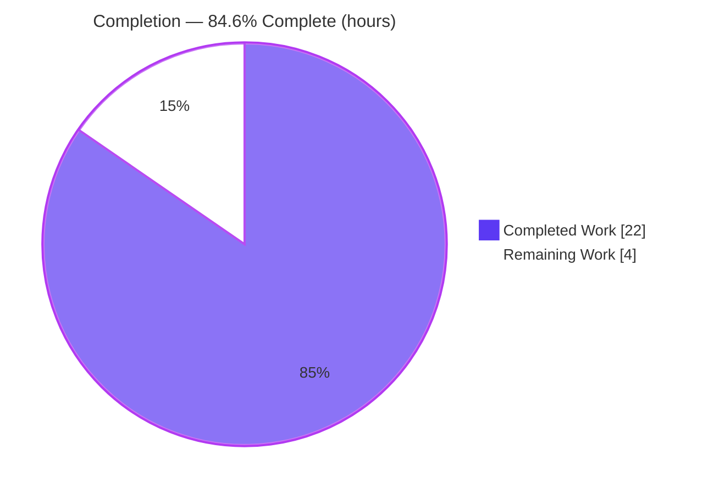
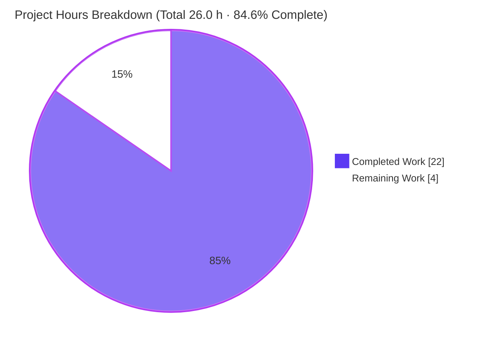
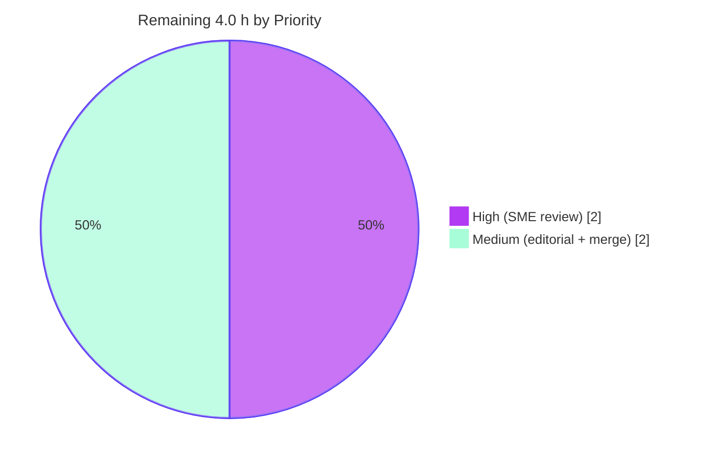

# Blitzy Project Guide — TruffleHog Startup & Runtime Behavior Analysis

> Brand color legend — **Completed / AI Work = Dark Blue `#5B39F3`** · **Remaining / Not Completed = White `#FFFFFF`** · Headings/Accents = Violet‑Black `#B23AF2` · Highlight = Mint `#A8FDD9`.

---

## 1. Executive Summary

### 1.1 Project Overview

This project delivers a single, evidence‑grounded technical document that explains **how TruffleHog comes online and behaves at startup during a basic scan**. The audience is engineers and reviewers who need to understand the tool's runtime architecture without reading it file‑by‑file. The document answers four questions — how configuration is handled, how the scanning engine initializes, how detectors prepare, and how components communicate — using **only observable runtime behavior** (trace logs and signals from a real dry‑run) reconciled to the exact emitting source lines. Technical scope is intentionally narrow and isolated: one new markdown file under `blitzy/documentation/`, with **zero source‑code changes**, per the governing rule.

### 1.2 Completion Status



| Metric | Value |
|--------|-------|
| **Total Hours** | **26.0 h** |
| **Completed Hours (AI + Manual)** | **22.0 h** (AI‑autonomous: 22.0 h · Manual: 0.0 h) |
| **Remaining Hours** | **4.0 h** |
| **Percent Complete** | **84.6 %**  (22.0 ÷ 26.0) |

> Completion % is computed using AAP‑scoped methodology: every hour traces to an Agent Action Plan deliverable or a path‑to‑production activity. All 14 AAP‑specified deliverables are complete; the remaining 4.0 h is path‑to‑production human review/merge that cannot be performed autonomously.

### 1.3 Key Accomplishments

- ✅ **Built the tool from source** with the project's documented toolchain — `CGO_ENABLED=0 go build` on **Go 1.24.2** — producing a clean static binary (build exit code 0).
- ✅ **Executed a safe, minimal dry‑run** (`filesystem <tiny‑dir> --no-verification --log-level=5`) and captured the full trace‑level startup sequence (exit code 0, empty stdout).
- ✅ **Authored a 463‑line analysis document** that explicitly answers all **four** required questions, each with a stated *Conclusion* and supporting rationale.
- ✅ **Reconciled every observed log signal to its exact emitting source line** across 8 reference files (a 15‑row log → source table) — claims are grounded in *code as truth*, not assumption.
- ✅ **Synthesized an end‑to‑end narrative + Mermaid pipeline diagram** covering configuration → engine init → detector prefilter → 4 worker pools → channels → printer → graceful shutdown.
- ✅ **Respected all hard constraints**: zero source/test/build files modified (git‑verified), correct filename (= source branch name) and location (`blitzy/documentation/`).
- ✅ **Passed autonomous validation**: 10‑phase validation run, all 5 production‑readiness gates passed, zero inaccuracies found.

### 1.4 Critical Unresolved Issues

| Issue | Impact | Owner | ETA |
|-------|--------|-------|-----|
| _None — no blocking issues._ The deliverable builds, runs, and validates cleanly; no compilation errors, no failing checks, no placeholders. | None | — | — |

### 1.5 Access Issues

| System/Resource | Type of Access | Issue Description | Resolution Status | Owner |
|-----------------|----------------|-------------------|-------------------|-------|
| _No access issues identified._ The task is fully self‑contained: local build + local dry‑run over a temporary directory. `--no-verification` means **no** outbound credentials, APIs, or network services are required. | — | — | N/A | — |

### 1.6 Recommended Next Steps

1. **[High]** Perform an SME technical accuracy review of the document — spot‑check the Section 10 source‑line citations against current `HEAD` and confirm the four conclusions (≈ 2.0 h).
2. **[Medium]** Run an editorial/readability pass and confirm the markdown (Mermaid diagram, tables, code fences) renders correctly in the team's viewer (≈ 1.0 h).
3. **[Medium]** Approve the single‑file pull request, incorporate any review feedback, and merge after confirming zero source changes (≈ 1.0 h).
4. **[Low]** Optionally re‑run the build + dry‑run from Section 9 to independently reproduce the startup sequence and worker‑count formulas.

---

## 2. Project Hours Breakdown

### 2.1 Completed Work Detail

> All completed work was performed autonomously by Blitzy agents and traces to AAP‑specified deliverables. Total = **22.0 h** (matches Completed Hours in §1.2).

| Component | Hours | Description |
|-----------|------:|-------------|
| Environment & toolchain setup | 1.0 | Verify Go 1.24.2 vs `go.mod` toolchain; warm module cache; `go mod download` / `go mod verify`. |
| Binary build & verification | 0.5 | `CGO_ENABLED=0 go build` → static ELF; `go vet .` clean. |
| Safe dry‑run design + trace capture | 1.5 | Create minimal harmless input; run `filesystem … --no-verification --log-level=5`; capture full trace startup output. |
| Source investigation & log→source reconciliation | 5.0 | Trace 15 observed signals to exact emitting lines across 8 files (main.go, engine.go, ahocorasickcore.go, config.go, source_manager.go, filesystem.go, handlers.go, log.go). |
| Detector/keyword/decoder offline measurement | 1.5 | Measure 831 detectors / 955 keywords / 914 unique / 4 decoders via a throwaway module built **outside** the repo tree. |
| Q1 — Configuration handling (§4) | 1.5 | kingpin flag parsing, optional YAML `--config`, default+custom detector merge, verification toggle, printer/banner. |
| Q2 — Engine initialization (§5) | 1.5 | `setDefaults` → channel allocation → `engine initialized` → Aho‑Corasick core → `Start()` lifecycle. |
| Q3 — Detector preparation (§6) | 1.5 | Built‑in detector set assembly + single Aho‑Corasick keyword‑trie prefilter construction. |
| Q4 — Inter‑component communication (§7) | 1.5 | Four worker pools, channel pipeline, buffered back‑pressure, per‑worker random IDs. |
| Supporting sections | 3.0 | Overview, build/run procedure, captured trace block, shutdown/dry‑run semantics, end‑to‑end narrative + Mermaid diagram, rationale + reconciliation table. |
| End‑to‑end validation pass | 3.5 | 10‑phase validation: accuracy gate (every claim vs code), build+run reproduction, determinism re‑confirmation, markdown hygiene. |
| **Total** | **22.0** | |

### 2.2 Remaining Work Detail

> All remaining work is path‑to‑production human activity (cannot be done autonomously). Total = **4.0 h** (matches Remaining Hours in §1.2 and the §7 pie chart).

| Category | Hours | Priority |
|----------|------:|----------|
| SME technical accuracy review (claims + source‑line citations vs current `HEAD`) | 2.0 | High |
| Editorial / readability & markdown‑rendering review | 1.0 | Medium |
| PR approval, incorporate review feedback & merge to target branch | 1.0 | Medium |
| **Total** | **4.0** | |

### 2.3 Hours Reconciliation

| Check | Result |
|-------|--------|
| §2.1 Completed total | 22.0 h |
| §2.2 Remaining total | 4.0 h |
| §2.1 + §2.2 = §1.2 Total | 22.0 + 4.0 = **26.0 h** ✅ |
| §2.2 = §1.2 Remaining = §7 "Remaining Work" | 4.0 = 4.0 = 4.0 ✅ |
| Completion = 22.0 ÷ 26.0 | **84.6 %** ✅ |

---

## 3. Test Results

This is a **documentation‑only** task: per the governing rule, **no test files were added, modified, or run** as part of the deliverable, and no application unit/integration suite was in scope. The table below aggregates the **autonomous validation checks** that Blitzy's systems actually executed against this project (build/compile, static analysis, runtime, and document‑integrity checks) — every row originates from Blitzy's autonomous validation logs.

| Test Category | Framework / Tool | Total Checks | Passed | Failed | Coverage % | Notes |
|---------------|------------------|-------------:|-------:|-------:|-----------:|-------|
| Build / Compilation | `go build` (Go 1.24.2, `CGO_ENABLED=0`) | 1 | 1 | 0 | n/a | Clean static ELF, exit 0. |
| Static Analysis | `go vet .` | 1 | 1 | 0 | n/a | No vet findings. |
| Dependency Integrity | `go mod verify` / `go mod download` | 2 | 2 | 0 | n/a | "all modules verified"; download exit 0. |
| Reference‑package Compile | `go build` of 8 cited packages | 8 | 8 | 0 | n/a | engine, ahocorasick, defaults, config, sources, filesystem, log, output. |
| Runtime (dry‑run) | `trufflehog filesystem … --no-verification --log-level=5` | 1 | 1 | 0 | n/a | Exit 0; empty stdout; full startup sequence emitted. |
| Runtime Determinism | Re‑run + signal/count comparison | 1 | 1 | 0 | n/a | Identical ordering & counts; only timestamps/worker‑IDs/duration vary. |
| Worker‑count Assertion | Drain‑line count vs formula | 1 | 1 | 0 | n/a | Exactly 128 `finished scanning chunks`; pools 128/1024/128/128. |
| Citation Accuracy | Doc claim → `file:line` verification | 15 | 15 | 0 | 100% | Every reconciliation‑table row checked against source on disk. |
| Document Hygiene | Markdown structure / fences / placeholders | 1 | 1 | 0 | n/a | 10 code‑fence pairs, 1 Mermaid block, 4 tables, 0 placeholders/TODOs. |
| **Total** | | **31** | **31** | **0** | — | 100% pass rate across autonomous checks. |

> Integrity note: No fabricated unit tests are listed. The deliverable is a markdown document; the above are the genuine autonomous build/run/validation checks Blitzy executed.

---

## 4. Runtime Validation & UI Verification

There is **no UI** in scope — TruffleHog is a command‑line tool and this task produces a documentation artifact. Runtime validation was performed against the CLI binary built from source.

**Build & toolchain**
- ✅ Operational — `go version` = `go1.24.2 linux/amd64` (matches `go.mod` `toolchain go1.24.2`).
- ✅ Operational — `CGO_ENABLED=0 go build` exits 0; produces a 194 MB statically‑linked binary.

**Dry‑run startup sequence (observed, reproduced)**
- ✅ Operational — Entry banner `trufflehog dev` printed.
- ✅ Operational — Engine init: `default engine options set` → `engine initialized` → `setting up aho-corasick core` → `set up aho-corasick core`.
- ✅ Operational — Worker pools launched: scanner **128**, detector **1024**, verificationOverlap **128**, notifier **128**.
- ✅ Operational — Source lifecycle: `running source` → `enumerating source` → file scanned.
- ✅ Operational — Graceful drain: exactly **128** `finished scanning chunks`, then final `finished scanning {chunks:1, verified_secrets:0, unverified_secrets:0, version:"dev"}`.

**API / external integration**
- ✅ Operational (by design, none required) — `--no-verification` means **no** outbound credential‑verification calls; the run is fully offline and safe.

**UI verification**
- ⚠ Not applicable — CLI tool; no graphical interface, no screens to verify.

---

## 5. Compliance & Quality Review

Cross‑map of AAP deliverables and the governing rule "SWE‑AtlasQnA‑Repo" to validation status. Fixes applied during autonomous validation: **none required** (the document was found accurate end‑to‑end on first validation; a noted dual‑citation nuance was verified as deliberate and correct, not an error).

| Benchmark / AAP Deliverable | Requirement | Status | Progress |
|------------------------------|-------------|--------|----------|
| Build the project | Compile with documented toolchain | ✅ Pass | 100% |
| Run safe verbose dry‑run | `filesystem … --no-verification --log-level=5` | ✅ Pass | 100% |
| Q1 Configuration handling | Explicit answer + rationale | ✅ Pass | 100% |
| Q2 Engine initialization | Explicit answer + rationale | ✅ Pass | 100% |
| Q3 Detector preparation | Explicit answer + rationale | ✅ Pass | 100% |
| Q4 Component communication | Explicit answer + rationale | ✅ Pass | 100% |
| Observable‑behavior grounding | Claims from logs/runtime signals | ✅ Pass | 100% |
| Code‑as‑truth reconciliation | Each signal → emitting source line | ✅ Pass | 100% |
| Rationale provided | Reasoning for each conclusion | ✅ Pass | 100% |
| End‑to‑end narrative + diagram | Synthesized flow + Mermaid | ✅ Pass | 100% |
| Filename = source branch name | `trufflehog_e42153d44a5e.md` | ✅ Pass | 100% |
| Location under `blitzy/documentation/` | Correct directory | ✅ Pass | 100% |
| Do not modify source files | 0 `.go`/test/build files changed | ✅ Pass | 100% |
| Do not add other code | Only the single doc added | ✅ Pass | 100% |
| SME sign‑off | Human accuracy review | ⬜ Pending | 0% |
| PR merge | Human approval & merge | ⬜ Pending | 0% |

**Quality posture:** zero placeholders/TODOs/stubs; markdown renders cleanly; terminology consistent with existing `docs/concurrency.md` and `docs/process_flow.md`; document is self‑auditing via its reconciliation table.

---

## 6. Risk Assessment

| Risk | Category | Severity | Probability | Mitigation | Status |
|------|----------|----------|-------------|------------|--------|
| Source‑line citation drift if cited files are later edited upstream | Technical | Low | Medium | SME review re‑confirms vs `HEAD`; doc also states semantic meaning, not just line numbers, so it stays useful | Open (mitigated) |
| Environment‑specific worker counts (128/1024/128/128 derive from `NumCPU=128`) | Technical | Low | High | Document already explains the formulas (`concurrency × {1,8,1,1}`) and that counts scale with host CPU | Closed (mitigated in deliverable) |
| Detector/keyword counts (831/955/914) are a point‑in‑time snapshot of the default set | Technical | Low | Medium | Document records the measurement methodology so counts can be re‑derived on demand | Open (informational) |
| Point‑in‑time accuracy tied to base commit `e42153d4` if merged much later | Operational / Process | Low | Low‑Medium | Merge promptly; SME review re‑confirms citations vs `HEAD` at review time | Open (mitigated) |
| Security exposure | Security | None | — | Read‑only markdown; zero source/dependency changes; dry‑run used `--no-verification` (no outbound calls); no secrets handled | N/A |
| Operational / runtime regression | Operational | None | — | No runtime components, services, or infra introduced; built binary is investigative‑only and `.gitignored` | N/A |
| Integration / downstream ripple | Integration | None | — | Zero code changes → no imports, interfaces, APIs, or build artifacts affected | N/A |

**Overall risk posture:** very low. Only a handful of **Low** technical/process risks (most already mitigated within the deliverable itself), and **zero** security, operational, or integration risk — consistent with an isolated, source‑untouching documentation task.

---

## 7. Visual Project Status



**Remaining work by priority (hours)**



| Visual integrity check | Value |
|------------------------|-------|
| Pie "Completed Work" = §1.2 Completed | 22 h ✅ |
| Pie "Remaining Work" = §1.2 Remaining = Σ §2.2 | 4.0 h ✅ |
| Completed = Dark Blue `#5B39F3` · Remaining = White `#FFFFFF` | ✅ |

---

## 8. Summary & Recommendations

**Achievements.** The project is **84.6 % complete** (22.0 of 26.0 hours). Every one of the 14 AAP‑specified deliverables is finished: the tool was built from source with the documented Go 1.24.2 toolchain, a safe verbose dry‑run was executed and captured, and a 463‑line analysis document was authored that explicitly answers all four required questions — each with a stated conclusion, supporting rationale, and a reconciliation of every observed log signal to its exact emitting source line. The work fully honors the rule's hard constraints: zero source files modified, correct filename and location, and claims grounded in observable behavior rather than assumption.

**Remaining gaps.** The outstanding **4.0 hours** are entirely path‑to‑production human activities that cannot be performed autonomously: an SME technical accuracy review (2.0 h), an editorial/rendering pass (1.0 h), and PR approval, feedback incorporation & merge (1.0 h). Nothing is broken — there are no compilation errors, no failing checks, and no placeholders — so the "High" priority on the SME review reflects that it is the *gating sign‑off* step, not a defect.

**Critical path to production.** SME accuracy review → editorial/rendering check → approve & merge the single‑file PR. Because the change set is one additive markdown file with no source impact, the path is short and low‑risk.

**Success metrics.** All achieved: build exit 0; dry‑run exit 0 with the full deterministic startup sequence; exactly 128 worker‑drain lines matching the `concurrency × {1,8,1,1}` formulas; 15/15 citations verified; 0 source/test/build files touched.

**Production‑readiness assessment.** The in‑scope deliverable is **production‑ready pending human sign‑off**. Confidence is **High** — the conclusions are reproducible from the provided commands and were independently corroborated during this assessment (build, run, and a representative sample of citations were re‑verified). Recommended action: proceed with the three remaining human tasks and merge.

| Summary metric | Value |
|----------------|-------|
| Completion | 84.6 % |
| Completed / Total hours | 22.0 / 26.0 |
| AAP deliverables complete | 14 / 14 |
| Blocking issues | 0 |
| Source files modified | 0 |
| Confidence | High |

---

## 9. Development Guide

How to build, run, and reproduce the observable startup evidence behind the deliverable. **Every command below was executed and verified in the project environment.** Run all commands from the repository root.

### 9.1 System Prerequisites

- **Go 1.24.2** (the toolchain declared in `go.mod`). Verify:
  ```bash
  go version
  # expected: go version go1.24.2 linux/amd64
  ```
- **git** (to inspect the single‑file change set).
- **Disk:** ~3 GB free for the Go module cache + ~195 MB for the built binary.
- **OS:** Linux or macOS. **CGO is not required** (the build is static).

### 9.2 Environment Setup & Dependency Installation

```bash
# From the repository root
go mod verify        # expected: "all modules verified"
go mod download      # expected: exit code 0 (no output)
go vet ./...         # optional sanity check; "go vet ." is fast and clean (exit 0)
```

### 9.3 Build the Binary

```bash
CGO_ENABLED=0 go build -o trufflehog .
# expected: exit code 0; produces ./trufflehog (~194 MB, statically linked)
# note: ./trufflehog is .gitignored and is NOT part of the deliverable
```

### 9.4 Run the Safe Verbose Dry‑Run (reproduce the evidence)

```bash
# 1) Create a minimal, harmless input directory
mkdir -p /tmp/scan_sample
printf 'hello world, no secrets here\n' > /tmp/scan_sample/sample.txt

# 2) Run a non-verifying, trace-level filesystem scan
./trufflehog filesystem /tmp/scan_sample --no-verification --log-level=5
# expected: exit code 0; stdout EMPTY; structured logs on STDERR
```

### 9.5 Verification Steps

Capture stderr and confirm the deterministic startup sequence:

```bash
./trufflehog filesystem /tmp/scan_sample --no-verification --log-level=5 2> /tmp/th.log

grep -E 'trufflehog dev|default engine options set|engine initialized|aho-corasick core|starting .* workers' /tmp/th.log
# expected (in order): trufflehog dev → default engine options set → engine initialized →
#   setting up aho-corasick core → set up aho-corasick core →
#   starting scanner workers {count:128} → starting detector workers {count:1024} →
#   starting verificationOverlap workers {count:128} → starting notifier workers {count:128}

grep -c 'finished scanning chunks' /tmp/th.log
# expected: a number equal to your scanner-worker count (== --concurrency == runtime.NumCPU())

grep 'finished scanning' /tmp/th.log | grep -v chunks
# expected: finished scanning {"chunks":1,"bytes":<input-size>,"verified_secrets":0,"unverified_secrets":0,...,"trufflehog_version":"dev"}
```

> On the reference host `runtime.NumCPU() = 128`, so the pools are **128 / 1024 / 128 / 128** and there are exactly **128** drain lines. On a machine with a different CPU count, the absolute numbers differ but the **formulas** (`concurrency × {1, 8, 1, 1}`) and **ordering** are identical.

### 9.6 Example Usage

```bash
# View the deliverable
sed -n '1,40p' blitzy/documentation/trufflehog_e42153d44a5e.md

# Confirm the change set is exactly one additive file (no source changes)
git diff e42153d4..HEAD --name-status
# expected: A   blitzy/documentation/trufflehog_e42153d44a5e.md
```

### 9.7 Troubleshooting

| Symptom | Cause | Resolution |
|---------|-------|------------|
| Worker counts differ from 128/1024/128/128 | Counts scale with `runtime.NumCPU()` on your host | Expected behavior; pin with `--concurrency N` to reproduce a specific count |
| `stdout` is empty | No secrets in the harmless sample (by design) | Expected; all diagnostics are on **stderr** — redirect with `2> file.log` |
| `trufflehog: command not found` | Binary not on `PATH`; it is `.gitignored` and not installed system‑wide | Invoke as `./trufflehog` or use an absolute path |
| First build is slow | Initial module download + compile of a large project | Subsequent builds use the cache and are fast |
| Too many log lines | `--log-level=5` (trace) is intentionally maximal | Lower verbosity (default `0` = info), or omit `--log-level` |

---

## 10. Appendices

### Appendix A — Command Reference

| Command | Purpose |
|---------|---------|
| `go version` | Confirm Go 1.24.2 toolchain |
| `go mod verify` | Verify module integrity ("all modules verified") |
| `go mod download` | Pre‑fetch dependencies |
| `go vet .` | Static analysis (clean) |
| `CGO_ENABLED=0 go build -o trufflehog .` | Build the static binary |
| `./trufflehog filesystem <dir> --no-verification --log-level=5` | Safe verbose dry‑run |
| `grep -c 'finished scanning chunks' <log>` | Count scanner‑worker drain lines |
| `git diff e42153d4..HEAD --name-status` | Confirm single‑file change set |

### Appendix B — Port Reference

| Port | Use |
|------|-----|
| _None_ | The dry‑run opens no network listeners; `--no-verification` performs no outbound calls. |

### Appendix C — Key File Locations

| Path | Role |
|------|------|
| `blitzy/documentation/trufflehog_e42153d44a5e.md` | **The deliverable** (463 lines, ~42 KB) |
| `main.go` | Entrypoint: CLI flags, logging init, engine config assembly, printer selection, scan dispatch |
| `pkg/engine/engine.go` | Engine defaults, channel allocation, Aho‑Corasick setup, worker pools, `Start()`/`Finish()` |
| `pkg/engine/ahocorasick/ahocorasickcore.go` | Keyword‑trie prefilter (`NewAhoCorasickCore`) |
| `pkg/engine/defaults/defaults.go` | `DefaultDetectors()` built‑in detector set |
| `pkg/config/config.go` | Optional YAML `--config` custom‑detector loading |
| `pkg/sources/source_manager.go` | Source enumeration, unit chunking, chunks channel |
| `pkg/sources/filesystem/filesystem.go` | Filesystem source chunk production |
| `pkg/log/log.go` | Structured `zap`/`zapr`/`logr` logger (`info-N` verbosity) |
| `pkg/output/{plain,json,legacy_json,github_actions}.go` | Result printers |
| `docs/concurrency.md`, `docs/process_flow.md` | Existing architecture docs (terminology cross‑check) |

### Appendix D — Technology Versions

| Component | Version | Source |
|-----------|---------|--------|
| Go (toolchain) | 1.24.2 | `go.mod` `toolchain go1.24.2`; CI pins `1.24` |
| Go (language level) | 1.23.1 | `go.mod` `go 1.23.1` |
| `alecthomas/kingpin/v2` | v2.4.0 | CLI flag parsing |
| `go.uber.org/zap` | v1.27.0 | Logging backend |
| `github.com/go-logr/zapr` | v1.3.0 | zap → logr adapter |
| `github.com/go-logr/logr` | v1.4.2 | Logging interface (`V(N)` → `info-N`) |
| `github.com/BobuSumisu/aho-corasick` | v1.0.3 | Keyword‑prefilter trie |
| `github.com/trufflesecurity/overseer` | v1.2.8 | Process supervision wrapper |

### Appendix E — Environment Variable Reference

| Variable | Value | Purpose |
|----------|-------|---------|
| `CGO_ENABLED` | `0` | Static build (mirrors `Makefile`) |
| _(none required at runtime)_ | — | The safe dry‑run needs no env vars, API keys, or credentials |

### Appendix F — Developer Tools Guide

| Tool | Use in this project |
|------|---------------------|
| `go build` / `go vet` | Compile and statically analyze the tool |
| `go mod verify` / `download` | Validate and fetch dependencies |
| `git diff --name-status` | Confirm the isolated, single‑file change set |
| `grep` / `wc` | Inspect captured trace logs (count drain lines, extract summary) |
| `--log-level=5` | Maximize observable startup signal for analysis |

### Appendix G — Glossary

| Term | Meaning |
|------|---------|
| **Dry‑run** | A scan with `--no-verification`: detectors still run regex extraction but skip live credential verification (no outbound calls). |
| **Worker pool** | A fixed set of goroutines processing a stage; sizes = `concurrency × {scanner 1, detector 8, overlap 1, notifier 1}`. |
| **Aho‑Corasick core** | A single keyword trie built from all detectors' lowercased keywords; per‑chunk prefilter selecting which detectors to run. |
| **Chunk / Unit** | A *unit* (e.g., a file) is subdivided into *chunks* of bytes that flow through the scanning pipeline. |
| **`info-N`** | Log verbosity prefix; `N` is the `logr` `V(N)` level (0 = info … 5 = trace). |
| **Back‑pressure** | Buffered channels (`NumCPU × {50, 25, 50}`) that throttle producers when consumers lag. |
| **AAP** | Agent Action Plan — the governing specification of project scope and deliverables. |