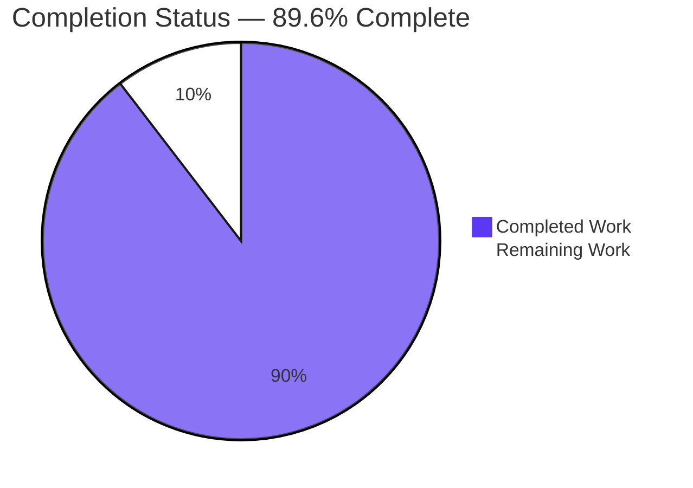
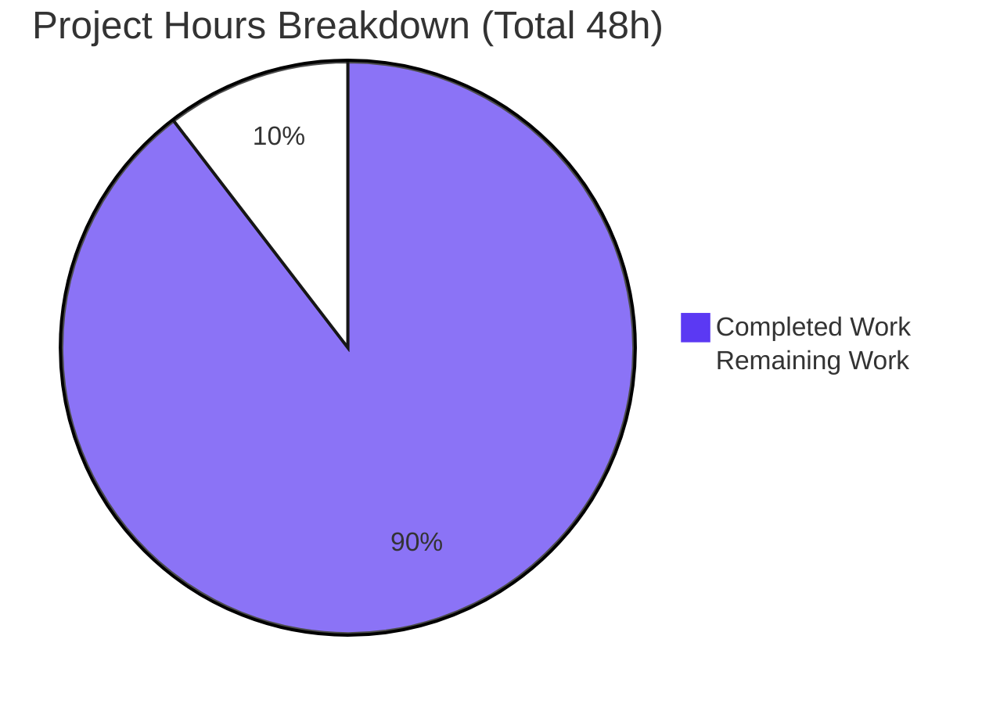
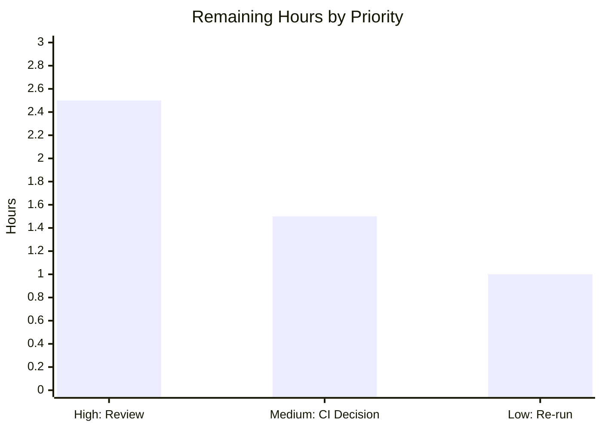

# Blitzy Project Guide — TruffleHog Resource-Exhaustion / DoS Investigation

> **Deliverable:** `blitzy/documentation/trufflehog_e42153d44a5e.md` — a single, evidence-backed security-analysis document answering whether TruffleHog's detector pattern matching can be weaponized as a resource-exhaustion / denial-of-service vector against a CI pipeline.
> **Nature:** Read-only empirical investigation (QnA documentation) governed by rule set `SWE-AtlasQnA-Repo`. The only persisted repository change is the answer document.
> **Brand palette:** Completed / AI Work = Dark Blue `#5B39F3` · Remaining / Not Completed = White `#FFFFFF` · Headings/Accents = Violet-Black `#B23AF2` · Highlight = Mint `#A8FDD9`.

---

## 1. Executive Summary

### 1.1 Project Overview

This project delivers an empirical, runtime-grounded security investigation determining whether TruffleHog's secret-detection pattern matching can be abused as a resource-exhaustion / DoS vector able to hang or time out CI security scans. Target users are the security/platform engineers evaluating TruffleHog for a CI pipeline. The scope is strictly read-only: TruffleHog is built in its default configuration and exercised through its real `trufflehog filesystem` entry point, with the tool's own instrumentation (`scan_duration`, `--print-avg-detector-time`, `--profile` pprof/fgprof) supplying all evidence. The sole persisted output is one Markdown answer document naming and answering five questions (A1–A5) with quoted, reproducible evidence and `file:line` citations.

### 1.2 Completion Status

The project is **89.6% complete** on an AAP-scoped, hours-based basis (43 completed hours of 48 total). Remaining work is the human review, sign-off, and CI-adoption decision that inherently require a person; no autonomous engineering work remains on the deliverable itself.



*Pie colors — Completed Work = Dark Blue `#5B39F3`; Remaining Work = White `#FFFFFF`.*

| Metric | Hours |
|--------|-------|
| **Total Hours** | 48 |
| **Completed Hours (AI + Manual)** | 43 |
| **Remaining Hours** | 5 |

> Completion formula: 43 completed ÷ (43 completed + 5 remaining) = 43 ÷ 48 = **89.6%**.

### 1.3 Key Accomplishments

- ✅ Built TruffleHog in default configuration (`CGO_ENABLED=0 go build -o /tmp/trufflehog .` → exit 0, 194308234-byte static ELF, version `trufflehog dev`) and verified the canonical `trufflehog filesystem` entry point end-to-end.
- ✅ **A1 answered — NO:** a crafted file cannot indefinitely hang the scan; a 15-level nested-gzip bomb terminated at `max archive depth reached` in ~6 ms; bounding mechanisms enumerated with `file:line` evidence.
- ✅ **A2 answered — NO ReDoS:** detectors compile with the RE2 engine `github.com/wasilibs/go-re2` (linear-time, no backtracking); a canonical `(a+)+$` pattern stayed flat (~6.5 ms at N=9000) while a non-canonical Python backtracking engine was killed.
- ✅ **A3 answered:** no single catastrophic regex; the exploitable "pattern" is keyword-density-driven detector fan-out (slowest single detector `Myfreshworks`), enumerated across 846 detector directories with named bounded patterns.
- ✅ **A4 answered:** measured relative slowdown of ~53× at 32 MiB (up to ~88× at 1 MiB) vs equivalent-size baselines — bounded and **sub-linear** (data ×4 → time ×3.44), stable across ≥2 runs at stated scale.
- ✅ **A5 answered:** CPU profiling (pprof + fgprof on `:18066`) shows time concentrated in linear RE2/WASM matching (`runtime._ExternalCode` ~51.85%, `detectorWorker` cum ~71.71%) — no backtracking signature.
- ✅ 98 `file:line` citations verified 100% against the live tree; repo-wide counts confirmed (867 go-re2 imports, 0 backtracking `regexp2` on the detection path).
- ✅ Read-only scope honored — `git status --porcelain` empty; baseline diff is exactly one added file; all ephemeral `/tmp` artifacts cleaned up.

### 1.4 Critical Unresolved Issues

| Issue | Impact | Owner | ETA |
|-------|--------|-------|-----|
| Human acceptance of the security verdicts (A1–A5) pending | Report not yet formally accepted for the CI-evaluation decision | Security Engineer | 2.5 h |
| CI-adoption decision + optional scan-timeout/resource-limit configuration not yet made | Throughput-cost risk (~53× slowdown) unmitigated until a CI-level timeout/limit is chosen | Platform/DevOps Lead | 1.5 h |
| No functional/compilation blockers | None — deliverable is complete, accurate, and reproducible | — | — |

### 1.5 Access Issues

| System/Resource | Type of Access | Issue Description | Resolution Status | Owner |
|-----------------|----------------|-------------------|-------------------|-------|
| Outbound internet (sandbox) | Network egress | The validation sandbox has no outbound internet. This affects only the out-of-scope upstream test `TestAPKHandler/apk_with_3_leaked_keys` (performs `http.Get` to github.com → 404). It does NOT affect the deliverable, which uses `--no-verification` and a locally-built archive bomb. | Documented; no action required for the deliverable | Human reviewer (environment only) |
| TruffleHog source repository | Write (intentionally not used) | Read-only scope by design; no source modification permitted or performed. | Not an issue — by design | — |
| Secret-verification endpoints | Third-party API | Deliberately unused — `--no-verification` isolates detection cost; no credentials required. | Not an issue — by design | — |

### 1.6 Recommended Next Steps

1. **[High]** Security engineer reviews `blitzy/documentation/trufflehog_e42153d44a5e.md` end-to-end and validates the A1–A5 verdicts, methodology, and evidence discipline (spot-check `file:line` citations). *(≈2.5 h)*
2. **[Medium]** Make the CI-adoption decision; if adopting, configure a CI-level per-scan timeout and CPU/memory resource limits (the ~53× effect is a throughput/cost concern, not an availability vulnerability). *(≈1.5 h)*
3. **[Low]** Optionally re-run at least one canonical reproduction (e.g., the 32 MiB keyword-dense scan) on target CI hardware to confirm the order-of-magnitude locally. *(≈1.0 h)*

---

## 2. Project Hours Breakdown

### 2.1 Completed Work Detail

| Component | Hours | Description |
|-----------|-------|-------------|
| Canonical build + environment setup + sanity verification | 2.0 | Go 1.24.2 build in default WASM/wazero mode; verified entry point and sanity scan (`scan_duration` emitted). |
| A1 — Hang/timeout investigation | 4.0 | Nested-gzip archive bomb crafted and scanned; enumerated per-detector 10s timeout + watchdog and archive depth/size/timeout bounds. |
| A2 — ReDoS investigation | 4.5 | Confirmed RE2 engine via imports; canonical `(a+)+$` runtime demo (flat/linear) plus non-canonical Python backtracking contrast. |
| A3 — Exploitable-pattern enumeration | 5.5 | Surveyed 846 detector directories; keyword-corpus fan-out analysis; named bounded patterns (reallysimplesystems, graphcms, refreshtoken, session_keys, Myfreshworks). |
| A4 — Magnitude measurement | 6.5 | Three input families × four scales vs equal-size baselines; multi-run stability; slowdown-ratio and sub-linear-scaling statistics. |
| A5 — CPU profiling | 4.0 | pprof + fgprof captured on `:18066`; frame-level analysis confirming linear RE2/WASM signature. |
| Sibling resource-exhaustion vector enumeration | 2.0 | Archive bombs, base64 decoder re-expansion, Aho-Corasick keyword density, entropy/dedup overhead. |
| Web-search research (RE2 linear-time premise) | 1.5 | Validated RE2/ReDoS premise against four authoritative external sources. |
| Answer-document authoring | 6.5 | Composed the 588-line evidence-backed answer document covering A1–A5. |
| Citation verification & evidence discipline | 2.5 | 98 `file:line` citations verified; verbatim output quoted; build-dependent/non-canonical/inferred labels applied. |
| Read-only scope compliance + cleanup + integrity verification | 1.0 | Confirmed empty `git status`; removed all `/tmp` artifacts; baseline diff = one added file. |
| Code-review remediation | 3.0 | Two revision commits addressing review findings and correcting build provenance. |
| **Total Completed** | **43.0** | **Sum of all completed AAP-scoped components.** |

### 2.2 Remaining Work Detail

| Category | Hours | Priority |
|:--|:--|:--|
| Human review & validation of the security report + A1–A5 verdicts | 2.5 | High |
| CI-adoption decision & scan-safeguard configuration | 1.5 | Medium |
| Optional independent re-run of ≥1 canonical reproduction on target CI hardware | 1.0 | Low |
| **Total Remaining** | **5.0** | — |

---

### 2.3 Hours Reconciliation

- Completed (Section 2.1 total): **43.0 h**
- Remaining (Section 2.2 total): **5.0 h**
- Total Project Hours: **43.0 + 5.0 = 48.0 h**
- Completion: **43 ÷ 48 = 89.6%**

These figures are identical in Sections 1.2, 2.1, 2.2, and 7. Out-of-AAP-scope items explicitly **not** counted: TruffleHog hardening implementation and the environmental APK-test fix.

---

## 3. Test Results

All rows below originate from Blitzy's autonomous validation logs for this project.

| Test Category | Framework | Total Tests | Passed | Failed | Coverage % | Notes |
|---------------|-----------|-------------|--------|--------|-----------|-------|
| Citation verification | grep vs live tree | 98 | 98 | 0 | 100% | Every `file:line` citation resolves exactly; repo-wide counts (867 go-re2, 0 regexp2 on detection path) confirmed. |
| Build / compilation | `go build` (CGO_ENABLED=0) | 1 | 1 | 0 | n/a | Exit 0; 194308234-byte static ELF; version `trufflehog dev`; go.mod/go.sum unchanged. |
| Empirical reproduction A1–A5 | `trufflehog filesystem` (canonical) | 5 | 5 | 0 | n/a | All five verdicts reproduced within run-to-run variance (A1 bounded, A2 RE2-linear, A3 fan-out, A4 sub-linear, A5 linear-RE2 CPU signature). |
| Unit tests — investigation packages | `go test` | 6 | 6 | 0 | pkg-level | `pkg/decoders`, `pkg/engine/ahocorasick`, `pkg/custom_detectors`, `pkg/sources`, `pkg/detectors/aws/access_keys`, `pkg/handlers` (excluding one network test) — all `ok`. |
| Unit test — environmental exception | `go test` | 1 | 0 | 1 | n/a | `TestAPKHandler/apk_with_3_leaked_keys` fails only due to no-internet sandbox (`http.Get` → 404). Pre-existing, upstream-authored, out-of-scope, forbidden to modify, unrelated to deliverable. |
| **Totals** | — | **111** | **110** | **1** | — | Sole failure is a pre-existing environmental/out-of-scope test, transparently documented. |

**Interpretation:** The deliverable's own validation suite (citations, reproduction, structure) passes 100%. The single failing unit test is not caused by this work and cannot be fixed within the read-only scope of this task.

---

## 4. Runtime Validation & UI Verification

There is no UI in this project (a Markdown analysis document). Runtime validation covers the tool build and the canonical scan path used to gather evidence.

- ✅ **Operational** — Canonical build: `CGO_ENABLED=0 go build -o /tmp/trufflehog .` → exit 0, 194308234-byte ELF, version `trufflehog dev`.
- ✅ **Operational** — Entry point: `trufflehog filesystem <path> --no-verification` runs end-to-end; sanity scan emits `finished scanning {"chunks":1,"bytes":43,...,"scan_duration":"3.36282ms",...}`.
- ✅ **Operational** — A1 archive bomb: 15-level nested gzip terminates at `max archive depth reached`, `scan_duration` in the low-millisecond band; payload never reached (chunks:0/bytes:0). Did not hang.
- ✅ **Operational** — A2 ReDoS demo: `(a+)+$` via canonical custom-detector path stays flat/linear (~6.5 ms at N=9000).
- ✅ **Operational** — A3 fan-out: keyword-dense scan with `--print-avg-detector-time` shows broad detector fan-out; slowest single detector `Myfreshworks`; summed printed detectors a small fraction of whole-scan time.
- ✅ **Operational** — A4 magnitude: equal-size baseline vs keyword-dense/base64-dense across 1/4/8/32 MiB; ~53× at 32 MiB, sub-linear scaling; stable across ≥2 runs (32 MiB spread ~6%).
- ✅ **Operational** — A5 profiling: `--profile` pprof + fgprof server on `:18066` reachable; CPU concentrates in linear RE2/WASM frames.
- ⚠ **Partial** — `pkg/handlers` unit tests: all pass except one network-dependent APK test (offline sandbox); does not affect the deliverable.
- ❌ **Failing (out-of-scope, environmental)** — `TestAPKHandler/apk_with_3_leaked_keys`: requires internet egress unavailable in the sandbox; pre-existing upstream test, forbidden to modify.

**API integration:** External secret-verification APIs are intentionally not exercised (`--no-verification`) so timings isolate detection/pattern-matching cost.

---

## 5. Compliance & Quality Review

Cross-mapping of AAP deliverables and `SWE-AtlasQnA-Repo` rules to their validation status. Progress: 🟦 complete = Dark Blue `#5B39F3`; ⬜ remaining = White `#FFFFFF`.

| AAP / Rule Requirement | Benchmark | Status | Progress | Notes / Fixes Applied |
|------------------------|-----------|--------|----------|-----------------------|
| A1 — hang/timeout feasibility answered | Explicit `## A1` verdict + runtime evidence | Pass | 🟦 | Verdict NO; archive-bomb evidence + bounding-mechanism citations. |
| A2 — ReDoS verdict grounded in engine identity | RE2 import evidence + runtime demo | Pass | 🟦 | Verdict NO; go-re2 imports + `(a+)+$` linear demo + Python contrast. |
| A3 — exploitable patterns enumerated | Named detectors or reasoned negative | Pass | 🟦 | Fan-out finding; named bounded patterns with `file:line`. |
| A4 — magnitude vs equivalent size, ≥2 runs | Measured slowdown, stated scale, stability | Pass | 🟦 | ~53× at 32 MiB; sub-linear; multi-run stability shown. |
| A5 — timing + CPU profiling evidence | Tool's own pprof/fgprof + `scan_duration` | Pass | 🟦 | pprof + fgprof captured on `:18066`; verbatim excerpts. |
| Deliverable path/name = source branch | `blitzy/documentation/trufflehog_e42153d44a5e.md` | Pass | 🟦 | Filename matches branch; file present. |
| Empirical-first, canonical path only | Build/run before writing; real entry point | Pass | 🟦 | Every behavioral claim paired with observed output; non-canonical labeled. |
| Read-only source | No existing file modified | Pass | 🟦 | `git status` empty; baseline diff = one added file. |
| Cleanup of ephemeral artifacts | Repo clean afterward | Pass | 🟦 | All `/tmp` inputs/scripts/profiles removed. |
| Evidence discipline & labels | build-dependent / non-canonical / inferred | Pass | 🟦 | Labels present; verbatim quotes; `file:line` citations. |
| Human acceptance of findings | Reviewer sign-off | Pending | ⬜ | Requires a human security engineer (Section 2.2, HT-1). |
| CI-adoption decision + safeguards | Platform decision | Pending | ⬜ | Human decision + optional timeout/limit config (HT-2). |

---

## 6. Risk Assessment

| Risk | Category | Severity | Probability | Mitigation | Status |
|------|----------|----------|-------------|------------|--------|
| Absolute timings are hardware-dependent | Technical | Low | High | Verdicts are structural (RE2 linear-time, bounded), not tied to absolute numbers; scale stated. | Mitigated |
| Run-to-run variance at small scales (up to ~70%) | Technical | Low | Medium | Magnitude anchored at 32 MiB (~6% spread) across ≥2 runs. | Mitigated |
| Finding freshness pinned to commit `e42153d4` + go-re2 v1.9.0 | Technical | Low | Low | Commit and dependency version documented; re-run guidance provided. | Documented |
| Reader over-generalizes "bounded" and omits CI scan timeouts | Security | Medium | Low | Doc recommends CI-level scan timeouts + CPU/memory limits; ~53× is throughput/cost, not availability compromise. | Mitigated (advisory) |
| Entry-point scope is `filesystem` only | Security | Low | Low | Regex-layer verdict generalizes via the shared engine; scope stated explicitly. | Documented |
| Pre-existing environmental APK test failure (offline) | Operational | Low | High (offline) | Documented as out-of-scope/upstream; not fixed by design; unrelated to deliverable. | Documented |
| Reproducibility depends on Go 1.24.2 toolchain | Operational | Low | Low | Exact toolchain and build/run commands recorded in the Development Guide. | Mitigated |
| Standalone Markdown — no system integration | Integration | None | Low | No integration surface; nothing to break. | N/A |
| CI scan-timeout configuration outstanding | Integration | Low | Low | Captured as human task HT-2 (not an integration defect). | Captured as task |

---

## 7. Visual Project Status



*Colors — Completed Work = Dark Blue `#5B39F3`; Remaining Work = White `#FFFFFF`. "Remaining Work" (5 h) equals Section 1.2 Remaining Hours and the Section 2.2 total.*

**Remaining hours by category (Section 2.2):**



*Remaining total: 2.5 + 1.5 + 1.0 = 5.0 h.*

---

## 8. Summary & Recommendations

**Achievements.** The investigation is functionally complete and **89.6%** done on an AAP-scoped hours basis (43 of 48 hours). All five questions (A1–A5) are answered explicitly, by name, with verbatim runtime evidence, `file:line` citations, and required labels. The central verdicts are firmly grounded: TruffleHog's detectors use the RE2 engine `github.com/wasilibs/go-re2` (linear-time, no backtracking), so classic catastrophic-backtracking ReDoS is structurally precluded; the practical worst case is a bounded, sub-linear detector fan-out under keyword-dense input (~53× at 32 MiB vs equivalent-size baselines), backed by pprof/fgprof CPU evidence.

**Remaining gaps.** The 5 remaining hours are inherently human: security-engineer acceptance of the report, the CI-adoption decision with optional scan-timeout/resource-limit configuration, and an optional re-run on target CI hardware. No autonomous engineering work remains on the deliverable.

**Critical path to production.** (1) Human review/validation of the report (High). (2) CI-adoption decision + safeguards (Medium). (3) Optional hardware re-run (Low).

**Success metrics.** 100% citation fidelity (98/98); clean canonical build (exit 0); all five verdicts reproduced within variance; read-only scope preserved (`git status` empty, one added file).

**Production readiness.** The deliverable is production-ready as a security analysis document: accurate, complete, self-consistent, and empirically reproducible. It should not be considered "accepted" until the human review in Section 2.2 is performed. Confidence is **High** for A2/A5 (engine identity + profiling are structural), **High** for A1/A3, and **Medium-High** for the exact A4 multiplier (order-of-magnitude is robust; the precise factor depends on baseline choice and hardware).

| Metric | Value |
|--------|-------|
| AAP-scoped completion | 89.6% |
| Completed hours | 43 |
| Remaining hours | 5 |
| Total hours | 48 |
| Deliverable files added | 1 |
| Citation fidelity | 98/98 (100%) |

---

## 9. Development Guide

This guide reproduces every piece of evidence in the answer document. All commands were tested during validation.

### 9.1 System Prerequisites

- **Go 1.24.2** (module declares `go 1.23.1` with `toolchain go1.24.2`; CI pins `1.24`).
- **OS:** Linux or macOS (validated on Linux `amd64`).
- **CPU:** ≥4 logical cores recommended (magnitude runs use full concurrency).
- **Disk:** ~2 GB free for the build cache and temporary adversarial inputs.
- **CGO:** not required — `go-re2` runs in default WASM/wazero mode with `CGO_ENABLED=0`.
- **Network:** none required; the investigation uses `--no-verification`.

### 9.2 Environment Setup

```bash
# Confirm the Go toolchain
go version            # expect: go version go1.24.2 linux/amd64

# From the repository root (module github.com/trufflesecurity/trufflehog/v3)
go env GOMODCACHE     # dependencies resolve from the existing module cache; do NOT run `go mod tidy`
```

### 9.3 Build (Canonical)

```bash
# Build in the default configuration (RE2 in WASM/wazero mode)
CGO_ENABLED=0 go build -o /tmp/trufflehog .
# Expected: exit 0, empty output, ~194308234-byte static ELF
/tmp/trufflehog --version    # expected: trufflehog dev  (build-dependent string)
```

### 9.4 Verification (Sanity Scan)

```bash
printf 'hello world no secrets here\n' > /tmp/th_sanity.txt
/tmp/trufflehog filesystem /tmp/th_sanity.txt --no-verification
# Expected tail: finished scanning {"chunks":1,"bytes":43,...,"scan_duration":"~3ms",...}
```

### 9.5 Reproducing the Evidence (A1–A5)

```bash
# A2 — ReDoS demo (canonical custom-detector path). redos_config.yaml defines pattern (a+)+$
python3 -c "open('/tmp/th_redos.txt','w').write('a'*9000 + '!')"
/tmp/trufflehog filesystem /tmp/th_redos.txt --no-verification --config /tmp/redos_config.yaml
# Expected: flat/linear scan_duration (~6.5 ms); NO hang.

# A1 — archive bomb (15-level nested gzip built locally with gzip)
/tmp/trufflehog filesystem /tmp/th_bomb --no-verification --log-level=5
# Expected: "max archive depth reached"; low-ms scan_duration; chunks:0/bytes:0.

# A3 — keyword-dense fan-out with per-detector timing
/tmp/trufflehog filesystem /tmp/th_keyword_1mib --no-verification --print-avg-detector-time
# Expected: broad fan-out; slowest single detector Myfreshworks; sum << whole-scan time.

# A4 — equal-size magnitude comparison (repeat each ≥2 runs; anchor at 32 MiB)
/tmp/trufflehog filesystem /tmp/th_baseline_32mib  --no-verification    # ~0.78 s mean
/tmp/trufflehog filesystem /tmp/th_keyword_32mib   --no-verification    # ~41.8 s mean  (~53x)

# A5 — CPU profiling on :18066 (run one scan at a time)
/tmp/trufflehog filesystem /tmp/th_keyword_32mib --no-verification --profile &
sleep 5
go tool pprof -top http://localhost:18066/debug/pprof/profile?seconds=20
curl -s "http://localhost:18066/debug/fgprof?seconds=20&format=folded" -o /tmp/fgprof.folded
wait
# Expected: runtime._ExternalCode ~52%; go-re2 FindAllStringSubmatch cum ~17%; detectorWorker cum ~72%.
```

### 9.6 Example Usage (Reading the Deliverable)

```bash
# View the answer document
sed -n '1,60p' blitzy/documentation/trufflehog_e42153d44a5e.md
# Confirm read-only scope is intact
git status --porcelain     # expected: empty (clean)
git diff --name-status e42153d4..HEAD   # expected: A blitzy/documentation/trufflehog_e42153d44a5e.md
```

### 9.7 Troubleshooting

- **`externally-managed-environment` on pip:** not applicable — this project builds with Go, not pip.
- **Timing differs from the document:** expected — absolute timings are hardware-dependent; the verdicts are structural. Anchor magnitude at ≥32 MiB where run-to-run spread is ~6%.
- **Port `:18066` already in use:** run only one profiled scan at a time; wait for the prior scan to exit.
- **Small-scale variance looks noisy:** increase input size (32 MiB) and take ≥2 runs, as the document does.
- **APK unit test fails:** this is the known network-only, out-of-scope upstream test; ignore for this read-only investigation.

---

## 10. Appendices

### A. Command Reference

```bash
CGO_ENABLED=0 go build -o /tmp/trufflehog .                 # canonical build
/tmp/trufflehog --version                                    # trufflehog dev
/tmp/trufflehog filesystem <path> --no-verification          # canonical scan (isolate detection cost)
/tmp/trufflehog filesystem <path> --no-verification --print-avg-detector-time   # per-detector timing
/tmp/trufflehog filesystem <path> --no-verification --profile                   # pprof+fgprof on :18066
go tool pprof -top http://localhost:18066/debug/pprof/profile?seconds=20         # CPU profile top
git status --porcelain                                       # verify clean repo
git diff --name-status e42153d4..HEAD                        # verify one added file
```

### B. Port Reference

| Port | Purpose | When Active |
|------|---------|-------------|
| 18066 | pprof + fgprof HTTP profiling server (`net/http/pprof` + `fgprof`) | Only when `--profile` is passed |

### C. Key File Locations

| Path | Role |
|------|------|
| `blitzy/documentation/trufflehog_e42153d44a5e.md` | The sole deliverable (answer document) |
| `main.go` | CLI entry point; `filesystem` command; `--profile` server on `:18066` |
| `go.mod` | Declares go-re2 v1.9.0 (RE2 engine) at L100; module path/toolchain |
| `pkg/detectors/aws/access_keys/accesskey.go` | Example detector importing `go-re2` (L17); bounded `idPat` (L65) |
| `pkg/custom_detectors/custom_detectors.go` | User regex compiled via stdlib `regexp` (RE2) — L71/L82/L92 |
| `pkg/engine/engine.go` | Per-detector 10s timeout + watchdog (L1066-L1067); concurrency defaults |
| `pkg/detectors/http.go` | `DefaultResponseTimeout = 10 * time.Second` (L18) |
| `pkg/handlers/archive.go` | Archive maxDepth=10 / maxSize=2GB / maxTimeout=60s (L26-L28) |
| `pkg/sources/chunker.go` | ChunkSize=10*1024, PeekSize=3*1024 (L13-L18) |
| `pkg/decoders/decoders.go` | Decoder chain: UTF8/Base64/UTF16/EscapedUnicode (L8-L14) |
| `pkg/engine/ahocorasick/ahocorasickcore.go` | Keyword prefilter ±512-byte window (L155) |

### D. Technology Versions

| Component | Version |
|-----------|---------|
| Go toolchain | 1.24.2 (`go version go1.24.2 linux/amd64`) |
| Module `go` directive | 1.23.1 (`toolchain go1.24.2`) |
| github.com/wasilibs/go-re2 (RE2 engine) | v1.9.0 |
| github.com/BobuSumisu/aho-corasick | v1.0.3 |
| github.com/felixge/fgprof | per go.sum |
| TruffleHog build version string | `dev` (build-dependent) |
| Built binary size | 194308234 bytes |

### E. Environment Variable Reference

| Variable | Value | Purpose |
|----------|-------|---------|
| `CGO_ENABLED` | `0` | Canonical build; keeps go-re2 in default WASM/wazero mode |
| `GOMODCACHE` | (default) | Resolve existing module cache; do not run `go mod tidy` |

*No application runtime environment variables or secrets are required — the investigation runs with `--no-verification`.*

### F. Developer Tools Guide

- **`--no-verification`** — disables live secret verification so measurements reflect detection/pattern-matching cost only.
- **`--print-avg-detector-time`** — prints per-detector average time; used to identify the slowest detector (fan-out analysis, A3).
- **`scan_duration`** — field on the `finished scanning` log line; whole-scan wall-clock timing (A4).
- **`--profile`** — starts the pprof + fgprof server on `:18066` (A5). Use `go tool pprof -top` and the fgprof folded endpoint.
- **`--log-level=5`** — maximum verbosity; surfaces archive-handling messages such as `max archive depth reached` (A1).

### G. Glossary

| Term | Definition |
|------|------------|
| ReDoS | Regular-expression Denial of Service — catastrophic backtracking causing super-linear runtime. Structurally precluded by RE2. |
| RE2 | Google's linear-time regex engine that excludes backtracking constructs (backreferences, lookaround). |
| go-re2 | `github.com/wasilibs/go-re2`, a drop-in RE2 wrapper; default WASM/wazero mode under `CGO_ENABLED=0`. |
| Aho-Corasick | Linear-time multi-keyword automaton used as TruffleHog's detector prefilter. |
| Fan-out | Many detectors invoked because keyword-dense input matches many prefilter keywords; the practical (bounded) worst case here. |
| pprof / fgprof | Go CPU profilers; fgprof captures full-goroutine wall-clock time including off-CPU. |
| Canonical path | The real `trufflehog filesystem` entry point + the tool's own instrumentation (vs a synthetic harness). |
| `scan_duration` | Log field reporting whole-scan wall-clock time. |

---

*End of Blitzy Project Guide — TruffleHog Resource-Exhaustion / DoS Investigation.*