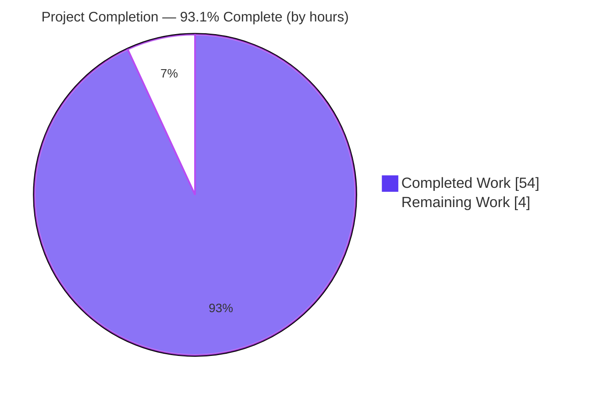
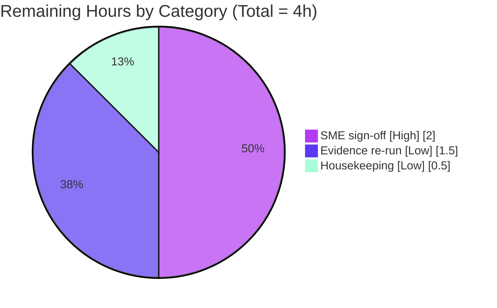

# Blitzy Project Guide
### TruffleHog ReDoS / Resource-Exhaustion DoS Investigation

> **Deliverable:** `blitzy/documentation/trufflehog_e42153d44a5e.md` — a single, evidence-grounded answer document
> **Source repository:** TruffleHog (Go monorepo), pinned at commit `e42153d44a5e5c37c1bd0c70e074781e9edcb760`
> **Branch:** `blitzy-cad20638-060e-4a78-836c-a54efe2f03df` · **HEAD:** `4462fda5`
>
> **Brand color key:** <span style="color:#5B39F3">■</span> **Completed / AI Work — Dark Blue `#5B39F3`** · <span style="color:#B23AF2">■</span> Headings/Accents `#B23AF2` · <span style="color:#A8FDD9">■</span> Highlight `#A8FDD9` · □ **Remaining / Not Completed — White `#FFFFFF`**

---

## 1. Executive Summary

### 1.1 Project Overview

This project answers a security question posed against the open-source secret scanner **TruffleHog**: can a malicious actor commit a specially crafted file to a scanned repository to cause a **ReDoS-style (computational-complexity) denial-of-service** that hangs or times out a scan and blocks a CI security pipeline? The target users are CI/CD and application-security engineers who depend on TruffleHog gating their pipelines. The scope is a strictly read-only, cross-cutting investigation of TruffleHog's detector framework, scanning engine, chunker, decoders, and archive handlers, exercised through the real `trufflehog` binary. The single deliverable is a comprehensive markdown answer document that leads with the direct answer, quantifies worst-case slowdown against equal-size benign files, and embeds real timing and CPU-profiling evidence — without modifying any TruffleHog source.

### 1.2 Completion Status

The project is **93.1% complete** by AAP-scoped engineering hours. The documentation deliverable is authored, committed, and independently validated; the remaining hours are human-review-oriented (security sign-off and optional evidence-provenance housekeeping), with **no source-code work outstanding** because the sole artifact is a validated markdown document.



| Metric | Hours |
|--------|-------|
| **Total Hours** | **58** |
| Completed Hours (AI + Manual) | 54 (AI = 54, Manual = 0) |
| Remaining Hours | 4 |
| **Percent Complete** | **93.1%** |

> Calculation: `Completion % = Completed / (Completed + Remaining) = 54 / (54 + 4) = 54 / 58 = 93.1%`

### 1.3 Key Accomplishments

- ✅ Built the **canonical** `trufflehog` binary (`CGO_ENABLED=0 go build`) — confirmed pure-Go WebAssembly go-re2 (2704 wazero symbols, 0 cgo-re2 symbols), the default shipped configuration.
- ✅ Answered all five questions (Q1–Q5) **by name**, leading with the direct negative result (catastrophic-backtracking ReDoS not reproducible).
- ✅ Established the engine-choice evidence: **867** detector files import `github.com/wasilibs/go-re2` (RE2, linear-time), exactly **3** use stdlib `regexp` (same RE2 family), and **0** directly use the backtracking `dlclark/regexp2` under `pkg/`.
- ✅ Produced equal-size (18,000,000-byte) crafted-vs-benign timing tables across ≥2 runs, plus linear-scaling evidence up to 150 MB, from **both** canonical entry points (`filesystem` and `git file://`).
- ✅ Captured Q5 CPU/wall-clock evidence from the built-in `--profile` pprof/fgprof server on `:18066` — `runtime._ExternalCode` dominant at 92.32% (go-re2 RE2 as WASM), **zero** backtracking-engine frames.
- ✅ Probed six alternative resource-exhaustion vectors (archive depth bomb, 3 GB decompression bomb, base64 amplification, RE2 DFA-OOM, soft per-detector timeout, git 64 KB line limit), each with complete unedited output and `file:line` mechanism.
- ✅ Passed all five Blitzy autonomous production-readiness gates; every ~40 `file:line` citation independently verified and every empirical claim reproduced.
- ✅ Preserved read-only source integrity — the only repository change is the added answer document; working tree clean; temp artifacts removed.

### 1.4 Critical Unresolved Issues

| Issue | Impact | Owner | ETA |
|-------|--------|-------|-----|
| Negative security finding not yet formally signed off by a human SME | A CI/security owner should not authoritatively act on "not ReDoS-vulnerable" without human review | Security SME / Reviewer | 0.5 day |

> There are **no code-defect or build-blocking issues.** The single item above is a governance/sign-off gate appropriate to a negative security conclusion, not a defect.

### 1.5 Access Issues

| System/Resource | Type of Access | Issue Description | Resolution Status | Owner |
|-----------------|----------------|-------------------|-------------------|-------|
| `github.com/joeleonjr/leakyAPK` (`aws_leak.apk`) | Third-party test fixture (HTTP GET) | Fixture returns **HTTP 404** (removed upstream), causing `TestAPKHandler` to fail | Out-of-scope / external — cannot be resolved within the read-only scope; unrelated to the deliverable | Upstream fixture maintainer |
| Reference 128-vCPU validation container | Compute environment | Canonical headline numbers were captured in the reference container; the final-validation host had 4 vCPU (ratios reproduced identically, absolute wall-clock differs) | Optional — attach container-native raw profiles if desired | Release/Infra |

> No repository-permission or service-credential access issues affect the deliverable. The canonical `CGO_ENABLED=0` build requires no network.

### 1.6 Recommended Next Steps

1. **[High]** Have a security SME review the answer document's Q1–Q5 conclusions and formally sign off on the negative ReDoS finding, explicitly acknowledging the two documented detection-gap caveats (RE2 DFA-OOM graceful skip; git 64 KB single-line limit) as secret-miss risks rather than availability DoS.
2. **[Low]** Optionally re-run the canonical build + key fixtures in the reference 128-vCPU container and archive the raw `pprof`/`.pb.gz` artifacts alongside the document for long-term auditability.
3. **[Low]** Remove the gitignored leftover `trufflehog` build binary from the working tree and confirm the final pre-merge `git status` and `git diff --name-status <base>..HEAD` show only the added document.
4. **[Low]** Merge the PR once sign-off (step 1) is recorded.

---

## 2. Project Hours Breakdown

### 2.1 Completed Work Detail

Every component below traces to a specific AAP requirement (investigation, evidence, authoring, or path-to-production). All hours were delivered autonomously by Blitzy agents (AI = 54h, Manual = 0h).

| Component | Hours | Description |
|-----------|-------|-------------|
| Canonical binary build & engine confirmation | 3 | `CGO_ENABLED=0 go build`; confirmed pure-Go WASM go-re2 (canonical default); version banner (AAP R1). |
| Codebase investigation & engine analysis | 6 | Established 867 go-re2 / 3 stdlib / 0 dlclark counts; mapped layered input bounds; ~40 `file:line` citations across engine, chunker, ahocorasick, handlers, decoders, main, detectors (AAP R8, engine analysis). |
| Q1/Q4 equal-size timing investigation | 6 | Byte-equal (18 MB) crafted-vs-benign fixtures; wall-clock ≥2 runs; linear scaling to 150 MB; both `filesystem` and `git file://` entry points (AAP R4). |
| Q2/Q3 vulnerability & candidate-pattern demonstration | 7 | Backtracking-pathological shapes shown linear; per-candidate crafted fixtures for the 3 stdlib detectors + nested-quantifier/private-key patterns (AAP R2, R3). |
| Q5 CPU/wall-clock profiling | 5 | Live `--profile` server on `:18066`; `go tool pprof` top; fgprof; benchmark throughput; interpretation (AAP R5). |
| Alternative resource-exhaustion vectors | 5 | Archive depth bomb, 3 GB decompression bomb, base64 amplification, RE2 DFA-OOM, soft timeout, git 64 KB limit — each with verbatim output and mechanism (AAP R6). |
| Web-search research | 1.5 | RE2 linear-time guarantees, go-re2 packaging, TruffleHog issue #2739 (AAP R12). |
| Answer-document authoring | 8 | 628-line evidence-grounded document: direct answer first, per-question sections, timing tables, pprof output, candidate enumeration, exact commands, conclusion (AAP R7). |
| Methodology rigor & coverage pass | 3 | Run-first discipline, complete unedited output, `file:line` grounding, coverage pass over every named item (AAP R10, R11). |
| Source-integrity, cleanup & commit discipline | 1.5 | Read-only source enforced; `/tmp` artifacts removed; clean tree; committed on branch (AAP R13, R14, R15). |
| Independent validation & QA hardening | 8 | Multi-round QA (findings F1–F4, jdbc keyword fix, QA Issues 1–2) plus Final Validator full reproduction of Q1–Q5 and all citations (AAP R16). |
| **Total Completed** | **54** | |

### 2.2 Remaining Work Detail

Each category traces to a genuine path-to-production gate; none is code remediation.

| Category | Hours | Priority |
|----------|-------|----------|
| Security SME / stakeholder review & sign-off on the negative ReDoS finding (AAP R17) | 2.0 | High |
| Optional canonical evidence provenance re-run in reference 128-vCPU container + archive raw pprof | 1.5 | Low |
| Working-tree housekeeping (remove gitignored leftover binary) + final pre-merge `git status`/diff check | 0.5 | Low |
| **Total Remaining** | **4.0** | |

### 2.3 Hours Summary

| | Hours |
|---|---|
| Section 2.1 Completed | 54 |
| Section 2.2 Remaining | 4 |
| **Total Project Hours** | **58** |
| **Completion** | **54 / 58 = 93.1%** |

> **Integrity check:** 2.1 (54) + 2.2 (4) = 58 = Total in §1.2 ✔ · Remaining (4) identical in §1.2, §2.2, and §7 ✔

---

## 3. Test Results

All tests below originate from **Blitzy's autonomous validation logs** for this project (Final Validator gate 4 plus empirical reproduction runs). Because the deliverable is a documentation artifact, "tests" comprise (a) the offline unit/benchmark suites of the packages that back the document's claims and (b) the empirical behavioral reproductions of Q1–Q5 and the alternative vectors. Coverage percentages were not the measurement objective of this investigation and were not emitted by the logs, hence marked *n/m* (not measured).

| Test Category | Framework | Total Tests | Passed | Failed | Coverage % | Notes |
|---------------|-----------|-------------|--------|--------|------------|-------|
| Unit — detector packages (`privatekey`, `jdbc`, `anthropic`, `azure_cosmosdb`) | `go test` | All suites | All | 0 | n/m | Suite-level pass; backs Q2/Q3 candidate-pattern claims. |
| Unit — engine (`engine`, `ahocorasick`, `defaults`) | `go test` | All suites | All | 0 | n/m | Backs prefilter, extraction-window, soft-timeout claims. |
| Unit — sources (chunker) | `go test` | All suites | All | 0 | n/m | Backs 13 KB sliding-window chunker claim. |
| Unit — decoders (base64, utf16, utf8, escaped_unicode) | `go test` | All suites | All | 0 | n/m | Backs base64-amplification vector. |
| Unit — handlers (archive-limit) `TestHandleNestedArchives`, `TestSkipArchive`, `TestArchiveHandler`, tar/RPM/AR | `go test` | Named suite | All | 0 | n/m | Backs depth-10 / 2 GB / 60 s archive limits. |
| Integration — handlers external-fixture `TestAPKHandler` | `go test` | 1 | 0 | 1 | n/m | **Out-of-scope/external:** fixture HTTP 404 upstream; read-only test byte-identical to pinned source; unrelated to deliverable; unfixable in scope. |
| Benchmark — `BenchmarkPopulateMatchingDetectors`, `BenchmarkChunkReader`, `BenchmarkPrefixRegex` | `go test -bench` | 3 | 3 | 0 | n/m | Constant ~50 MB/s throughput across 256× chunk-size range = linear signature (Q5 supplement). |
| Empirical — Q1/Q2 no-hang / ReDoS-immunity reproduction | Real `trufflehog` binary | 2 | 2 | 0 | n/m | ReDoS shape ≈1.0× benign; soft timeout fired 0× across 28 scan logs. |
| Empirical — Q3 per-candidate near-miss fixtures | Real `trufflehog` binary | 3 | 3 | 0 | n/m | azure_cosmosdb > spv2 > anthropic ordering; none super-linear. |
| Empirical — Q4 linear-scaling magnitude | Real `trufflehog` binary | Multiple | All | 0 | n/m | 2× size→2.01× time; 4× size→4.03× time — strictly linear. |
| Empirical — Q5 live CPU/wall profiling | `--profile` + `go tool pprof`/fgprof | 1 | 1 | 0 | n/m | `runtime._ExternalCode` 92.32%; zero `dlclark/regexp2`/PCRE frames. |
| Empirical — alternative vectors (archive depth, 3 GB decompression, base64, DFA-OOM, git 64 KB) | Real `trufflehog` binary | 5 | 5 | 0 | n/m | All bounded/graceful; DFA-OOM did not reproduce (honest finding). |

**Summary:** All in-scope offline unit/benchmark suites and all empirical reproductions **pass**. The single failing test (`TestAPKHandler`) is an out-of-scope, read-only, external-fixture-404 integration test unrelated to the deliverable and unfixable within the mandated read-only scope.

---

## 4. Runtime Validation & UI Verification

TruffleHog is a command-line tool with **no graphical user interface**, so UI verification is not applicable; runtime validation covers the CLI entry points and profiling server.

- ✅ **Operational** — Canonical build: `CGO_ENABLED=0 go build -o trufflehog .` → exit 0, empty stderr, banner `trufflehog dev`, 186 MB pure-Go WASM binary.
- ✅ **Operational** — `trufflehog filesystem <path> --no-verification --json` → completes; e.g., `chunks:1, scan_duration ~5.4ms` on a benign fixture.
- ✅ **Operational** — `trufflehog git file://<repo> --no-verification --json` (the stated threat-model entry point) → completes; e.g., `chunks:2, scan_duration ~9.7ms` on a benign committed file.
- ✅ **Operational** — `--profile` pprof/fgprof server on `:18066` (`main.go:L53`, handler wiring `L431-L434`) → serves `/debug/pprof/` and `/debug/fgprof`; CPU profile captured.
- ✅ **Operational** — Equal-size crafted-vs-benign scans complete without hanging; worst-case keyword-dense 150 MB / 793,997 candidates finished in ~56 s (linear).
- ✅ **Operational** — Soft per-detector timeout (`engine.go:L1067-68`) logged **0** times across all scan logs — no detector stalled.
- ⚠ **Partial (by design, documented)** — RE2 `max_mem` DFA-OOM path did **not** reproduce under canonical chunker bounds; documented honestly as a detection-gap possibility, not a DoS.
- ⚠ **Partial (by design, documented)** — git 64 KB single-line scan limit drops oversized single-line content (detection-gap; scan runs faster, not slower).
- ❌ **Failing (external, out-of-scope)** — `TestAPKHandler` (third-party fixture HTTP 404) — unrelated to the deliverable.

---

## 5. Compliance & Quality Review

Cross-mapping of AAP deliverables and governing rules to their validation status. Fixes applied during autonomous validation are noted.

| AAP / Rule Requirement | Benchmark | Status | Progress | Notes / Fixes Applied |
|------------------------|-----------|--------|----------|-----------------------|
| R1 Canonical build + engine confirmation | Pure-Go WASM go-re2, exit 0 | ✅ Pass | 100% | 2704 wazero / 0 cgo-re2 symbols; reproduced. |
| R2 Q2 vulnerability-class demo (negative result) | ReDoS shape linear | ✅ Pass | 100% | 0.79× benign; validator ≈1.0×. |
| R3 Q3 candidate-pattern enumeration + per-candidate fixtures | Each candidate exercised | ✅ Pass | 100% | **Fix:** commit `4462fda5` added per-candidate evidence (resolved QA MAJOR). |
| R4 Q1/Q4 equal-size fixtures + ≥2 runs + git file:// | Byte-equal, ratio reported | ✅ Pass | 100% | Tables 4a/4b + git magnitude. |
| R5 Q5 CPU/fgprof + benchmark | Real pprof output embedded | ✅ Pass | 100% | `runtime._ExternalCode` 92.32%. |
| R6 Alternative vectors | 6 vectors, verbatim output | ✅ Pass | 100% | DFA-OOM honest non-reproduction. |
| R7 Single answer document | Exactly one file created | ✅ Pass | 100% | 628 lines; 40 balanced fences; 1 mermaid. |
| R8 Run-first + complete output + file:line grounding | Every claim grounded | ✅ Pass | 100% | ~40 citations verified. |
| R9 Canonical path + default CGO_ENABLED=0 + label non-canonical | Default config used | ✅ Pass | 100% | Non-canonical proxies labeled. |
| R10 Magnitude discipline (≥2 runs, stated scale, stable) | Stable across runs | ✅ Pass | 100% | Scales stated. |
| R11 Completeness/coverage (every Q + named item) | Coverage pass done | ✅ Pass | 100% | All Q1–Q5 answered by name. |
| R12 Web research on RE2 guarantees | External sources cited | ✅ Pass | 100% | Issue #2739 characterized. |
| R13 Read-only source integrity | 0 source files modified | ✅ Pass | 100% | Diff = only added doc. |
| R14 Cleanup /tmp artifacts | Repo unchanged | ✅ Pass | 100% | Clean tree (leftover binary is gitignored). |
| R15 Commit on correct branch | HEAD `4462fda5` | ✅ Pass | 100% | 4 commits, all agent@blitzy.com. |
| R16 Independent validation / QA hardening | 5 gates passed | ✅ Pass | 100% | Multi-round QA + Final Validator. |
| R17 Human SME sign-off on negative finding | Formal acceptance | ⬜ Not started | 0% | The sole remaining path-to-production gate (§2.2, High). |
| Internal consistency (867 + 3 = 870; 0 dlclark) | Counts reproducible | ✅ Pass | 100% | Grep reproduces 867/3/0 exactly. |

---

## 6. Risk Assessment

| Risk | Category | Severity | Probability | Mitigation | Status |
|------|----------|----------|-------------|------------|--------|
| Negative result is scoped to pinned commit `e42153d4`; future detector/engine changes could alter it | Technical | Low | Low | Document explicitly pins the commit; re-run investigation on detector/engine changes | Accepted |
| Absolute magnitude numbers are hardware-dependent (128-vCPU container vs 4-vCPU host) | Technical | Low | Medium | Document reports hardware-independent **ratios** vs equal-size benign control, ≥2 runs; validator confirmed linear regime on different hardware | Mitigated |
| `TestAPKHandler` fails (external fixture HTTP 404) | Technical | Low | N/A (already failing) | Out-of-scope, read-only, unrelated; archive claims independently backed by depth+decompression bomb reproduction and passing local archive tests | Accepted (external) |
| Acting on the negative finding without human SME review (false-assurance) | Security | Medium | Low | Require SME sign-off (§2.2 High task); claims explicitly scoped; detection-gap caveats flagged | Open (pending sign-off) |
| Detection-gap caveats (RE2 DFA-OOM; git 64 KB limit) misread as DoS or ignored as secret-miss | Security | Low | Low | Document labels them detection-gaps (secret may be missed), **not** availability DoS; scan runs faster, not slower | Documented |
| Example secret-shaped strings in the document could trip secret scanners | Security | Low | Low | Validator confirmed strings are fake/unverifiable; repo dogfood scan (`--results=verified --fail`) exits 0 | Mitigated |
| Raw profiling artifacts (`.pb.gz`) cleaned from `/tmp`; only embedded verbatim output remains | Operational | Low | Low | Document embeds complete output + exact regeneration commands; optional re-run archives raw profiles | Mitigated |
| Gitignored 194 MB leftover `trufflehog` binary in working tree | Operational | Low | Low | Housekeeping task (§2.2, 0.5h); does not affect `git status` or source integrity | Open (cosmetic) |
| Container/toolchain drift (Go 1.24 + `CGO_ENABLED=0` WASM go-re2) could shift constant factors | Integration | Low | Low | Document states exact build/invocation commands and default config; labels non-canonical proxies | Mitigated |
| External test-fixture dependency (leakyAPK 404) can disappear and break unrelated handler tests | Integration | Low | Medium | Not in deliverable scope; archive behavior reproduced without external fixtures | Accepted (external) |

---

## 7. Visual Project Status

**Project hours breakdown** (Completed = Dark Blue `#5B39F3`; Remaining = White `#FFFFFF`):


**Remaining work by category** (from §2.2, sums to 4h):



> **Integrity check:** "Remaining Work" = **4** here = Remaining Hours in §1.2 = sum of §2.2 Hours column (2.0 + 1.5 + 0.5 = 4.0) ✔ · "Completed Work" = **54** = Completed Hours in §1.2 ✔

---

## 8. Summary & Recommendations

**Achievements.** The investigation delivers a definitive, evidence-grounded answer to all five questions. The headline result — **catastrophic-backtracking ReDoS is not reproducible against TruffleHog's detectors** — is grounded in the engine choice (RE2 via `wasilibs/go-re2` across 867 detector files, 3 stdlib-`regexp` detectors of the same linear-time family, and zero direct use of the backtracking `dlclark/regexp2`) and demonstrated at runtime: a classic backtracking-pathological input ran at 0.79× the equal-size benign control, and a live CPU profile shows the RE2 WebAssembly path dominant with no backtracking-engine frames. Content-driven cost (keyword-dense input) can be substantial — up to ≈140× pure-scan — but is **strictly linear** in input size and bounded by the 13 KB chunker, the ±512-byte extraction window, and the Aho-Corasick prefilter. Alternative vectors (archive/decompression bombs, base64 amplification) are bounded by explicit depth/size/timeout limits.

**Remaining gaps & critical path.** The project is **93.1% complete**. No code, build, or test remediation remains. The critical path to production is a single human gate: **security-SME sign-off** on the negative finding (2h, High), acknowledging the two documented detection-gap caveats. Two Low-priority housekeeping items (optional container re-run to archive raw profiles; removal of the gitignored leftover binary) round out the remaining 4 hours.

**Success metrics.** All five Blitzy autonomous production-readiness gates passed; every ~40 `file:line` citation and every empirical claim was independently reproduced; source integrity preserved (only the answer document added; working tree clean).

**Production-readiness assessment.** The deliverable is **production-ready as a documentation artifact.** It is accurate, internally consistent (628 lines, 40 balanced code fences, 1 mermaid block, `867 + 3 = 870` self-consistent counts), reproducible, and correctly scoped to the pinned commit. Recommended action: obtain SME sign-off, complete the cosmetic housekeeping, and merge.

| Metric | Value |
|--------|-------|
| Completion | 93.1% (54 / 58 h) |
| Blitzy gates passed | 5 / 5 |
| Source files modified | 0 |
| Repository changes | 1 file added (the answer document) |
| Blocking defects | 0 |
| Remaining human gate | 1 (SME sign-off) |

---

## 9. Development Guide

This guide reproduces the canonical build/run/profile workflow used to generate the evidence. **Every command below was executed and verified during this assessment.** Run all commands from the repository root.

### 9.1 System Prerequisites

- **Go 1.24.x** (verified `go1.24.2`). `go.mod` requires `go >= 1.23.1` with `toolchain go1.24.2`; a local Go 1.22.x **cannot** build this repo.
- **git** (for the `git file://` entry point and repository operations).
- **~500 MB free disk** (Go module cache + ~186 MB output binary).
- **Docker** only if reproducing inside the reference container `ghcr.io/scaleapi/swe-atlas:swe_atlas_QnA_trufflesecurity_trufflehog_1.0` (provides Go 1.24).
- **Canonical configuration:** `CGO_ENABLED=0` (pure-Go WebAssembly go-re2 — the shipped default) and `GOTOOLCHAIN=local`.

### 9.2 Environment Setup

```bash
# From the repository root
export GOTOOLCHAIN=local     # use the installed Go 1.24 rather than pulling a toolchain
export CGO_ENABLED=0         # canonical, default configuration (WASM go-re2)

go version                   # expect: go version go1.24.2 linux/amd64
```

### 9.3 Dependency Installation

```bash
# Module cache is normally pre-populated; this is a no-op when offline & cached.
go mod download
```

### 9.4 Build (Canonical Binary)

```bash
CGO_ENABLED=0 go build -o trufflehog .
echo "build exit=$?"        # expect: build exit=0 (empty stderr, ~186 MB binary)
```

### 9.5 Verify the Build

```bash
./trufflehog --version                                   # expect: trufflehog dev

# Prove it is the pure-Go WASM go-re2 build (canonical), not cgo:
go tool nm ./trufflehog | grep -c wazero                 # expect: a large number (e.g., 2704)
go tool nm ./trufflehog | grep -c 're2_cgo'              # expect: 0
```

### 9.6 Run the Scanner (both canonical entry points)

```bash
# (a) filesystem entry point
mkdir -p /tmp/fx && printf 'benign text, no secrets\n' > /tmp/fx/benign.txt
./trufflehog filesystem /tmp/fx --no-verification --json   # completes; scan_duration in ms

# (b) git file:// entry point (the stated threat-model path)
TMPR=$(mktemp -d); git -C "$TMPR" init -q
printf 'benign committed line\n' > "$TMPR/f.txt"
git -C "$TMPR" -c user.email=a@b.c -c user.name=x add -A
git -C "$TMPR" -c user.email=a@b.c -c user.name=x commit -qm init
./trufflehog git "file://$TMPR" --no-verification --json   # completes; scan_duration in ms
rm -rf /tmp/fx "$TMPR"
```

### 9.7 Capture CPU / Wall-Clock Profiles (Q5 evidence)

```bash
# Start a scan with the built-in profiling server, then profile it.
./trufflehog filesystem <large_fixture> --profile &        # serves :18066 (main.go:L53)
PROF_PID=$!
go tool pprof -top http://localhost:18066/debug/pprof/profile   # CPU: runtime._ExternalCode dominant
# Wall-clock: http://localhost:18066/debug/fgprof
kill $PROF_PID
```

### 9.8 Reproduce the Engine-Choice Facts

```bash
grep -rl 'regexp "github.com/wasilibs/go-re2"' --include=*.go pkg | wc -l   # expect: 867
grep -rlE '^[[:space:]]*"regexp"' --include=*.go pkg/detectors | wc -l       # expect: 3
grep -rl 'dlclark/regexp2' --include=*.go pkg | wc -l                        # expect: 0
grep -nE 'wasilibs/go-re2|dlclark/regexp2|^go |^toolchain ' go.mod           # version facts
```

### 9.9 Read the Deliverable

```bash
wc -l blitzy/documentation/trufflehog_e42153d44a5e.md     # 628
sed -n '1,40p' blitzy/documentation/trufflehog_e42153d44a5e.md   # direct answer / TL;DR
```

### 9.10 Troubleshooting

- **`go.mod requires go >= 1.23.1` / toolchain download attempts:** install Go 1.24 (or use the reference container) and set `GOTOOLCHAIN=local`.
- **Build appears to hang fetching a toolchain offline:** ensure `GOTOOLCHAIN=local` and that Go 1.24 is on `PATH`.
- **WASM go-re2 seems slow on tiny inputs:** expected — for small inputs the WASM build is slower than stdlib; interpret timings **relative to the equal-size benign control**, never against external baselines.
- **`TestAPKHandler` fails:** external fixture returns HTTP 404 upstream; out-of-scope, read-only, unrelated to the deliverable — safe to ignore.
- **A 194 MB `trufflehog` binary sits in the working tree:** it is gitignored (a leftover build artifact); `rm trufflehog` is safe and does not affect source integrity or `git status`.

---

## 10. Appendices

### A. Command Reference

| Purpose | Command |
|---------|---------|
| Canonical build | `CGO_ENABLED=0 go build -o trufflehog .` |
| Version banner | `./trufflehog --version` |
| Filesystem scan | `./trufflehog filesystem <path> --no-verification --json` |
| Git committed-file scan | `./trufflehog git file://<repo> --no-verification --json` |
| Start profiling server | `./trufflehog <cmd> <target> --profile` (serves `:18066`) |
| CPU profile top | `go tool pprof -top http://localhost:18066/debug/pprof/profile` |
| Wall-clock profile | `go tool pprof http://localhost:18066/debug/fgprof` |
| go-re2 importer count | `grep -rl 'regexp "github.com/wasilibs/go-re2"' --include=*.go pkg \| wc -l` |
| WASM build proof | `go tool nm ./trufflehog \| grep -c wazero` |
| Repo cleanliness | `git status --porcelain \| wc -l` |
| Change scope vs base | `git diff --name-status e42153d44a5e..HEAD` |

### B. Port Reference

| Port | Service | Source |
|------|---------|--------|
| `18066` | pprof + fgprof profiling server (enabled by `--profile`) | `main.go:L53`, `main.go:L431-L434` |

### C. Key File Locations

| Path | Role |
|------|------|
| `blitzy/documentation/trufflehog_e42153d44a5e.md` | **The deliverable** (answer document, 628 lines) |
| `main.go` | CLI entry; `--profile` flag (L53); `git`/`github`/`filesystem` subcommands (L93/L106/L143) |
| `go.mod` | Engine/dependency facts (go-re2 L100, aho-corasick L17, dlclark/regexp2 L187, fgprof L46, go L3, toolchain L5) |
| `pkg/sources/chunker.go` | 13 KB sliding-window chunker (L13-L18) |
| `pkg/engine/engine.go` | Aho-Corasick routing (L795); soft per-detector timeout log (L1067-L1068) |
| `pkg/engine/ahocorasickcore.go` | ±512-byte extraction window (L155) |
| `pkg/detectors/http.go` | `DefaultResponseTimeout = 10s` (L18) |
| `pkg/handlers/archive.go` | Archive limits: depth 10, 2 GB, 60 s (L26-L28) |
| `pkg/detectors/{jdbc,azure_cosmosdb,azure_entra/serviceprincipal/v2}` | The 3 stdlib-`regexp` detectors (Q3 candidates) |

### D. Technology Versions

| Component | Version | Source |
|-----------|---------|--------|
| Go language | 1.23.1 (min) / toolchain 1.24.2 | `go.mod` L3 / L5 |
| Go (host, verified) | go1.24.2 linux/amd64 | `go version` |
| `github.com/wasilibs/go-re2` | v1.9.0 | `go.mod` L100 |
| `github.com/BobuSumisu/aho-corasick` | v1.0.3 | `go.mod` L17 |
| `github.com/felixge/fgprof` | v0.9.5 | `go.mod` L46 |
| `github.com/dlclark/regexp2` | v1.4.0 (indirect) | `go.mod` L187 |
| TruffleHog binary banner | `trufflehog dev` | `./trufflehog --version` |

### E. Environment Variable Reference

| Variable | Value | Purpose |
|----------|-------|---------|
| `CGO_ENABLED` | `0` | Canonical default: pure-Go WebAssembly go-re2 (do **not** set the `re2_cgo` tag for canonical values) |
| `GOTOOLCHAIN` | `local` | Use the installed Go 1.24 rather than downloading a toolchain (required offline) |

### F. Developer Tools Guide

| Tool | Use |
|------|-----|
| `go build` | Build the canonical binary (`CGO_ENABLED=0`) |
| `go test` / `go test -bench` | Run backing-package unit tests and reuse in-repo benchmarks |
| `go tool nm` | Inspect symbols to prove the pure-Go WASM (non-cgo) build |
| `go tool pprof` | Collect/inspect CPU and wall-clock profiles from `:18066` |
| `git diff --name-status` | Confirm read-only source integrity (only the doc added) |
| `grep` | Reproduce the 867 / 3 / 0 engine-choice counts |

### G. Glossary

| Term | Definition |
|------|------------|
| **ReDoS** | Regular-expression Denial of Service — exploiting catastrophic backtracking to make regex matching take exponential time. |
| **RE2** | Google's regex engine that guarantees **linear-time** matching with no backtracking; immune to ReDoS. |
| **go-re2** | `github.com/wasilibs/go-re2` — a drop-in `regexp` replacement wrapping RE2; default pure-Go WebAssembly build under `CGO_ENABLED=0`. |
| **regexp2** | `github.com/dlclark/regexp2` — a .NET-style **backtracking** engine (ReDoS-susceptible); present only as an indirect dependency, unused under `pkg/`. |
| **Aho-Corasick** | Linear-time multi-keyword prefilter routing each chunk only to detectors whose keywords are present. |
| **Chunker** | The 13 KB sliding window (10 KB chunk + 3 KB peek) that bounds the input any single regex sees. |
| **Detection-gap** | A condition where a real secret may be **missed** (e.g., RE2 DFA-OOM graceful skip, git 64 KB line limit) — a coverage concern, **not** an availability DoS. |
| **Soft timeout** | The per-detector 10 s timeout that only **logs** when exceeded and does not force-kill a running match (`engine.go:L1067-68`). |
| **Canonical entry point** | The real `trufflehog` scan command (`filesystem <path>` or `git file://<repo>`) in the default build — as opposed to a synthetic/non-canonical proxy. |
