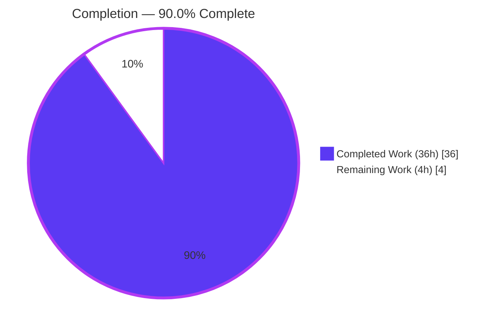
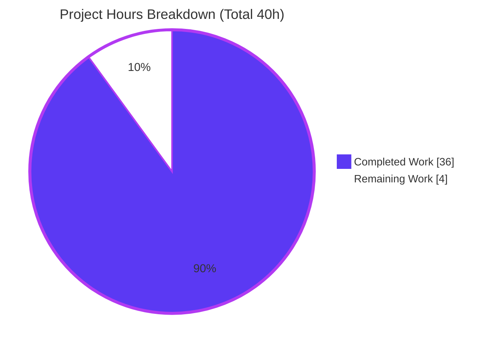

# Blitzy Project Guide — TruffleHog Startup-Behavior Runtime Investigation

> **Project type:** Read-only investigative **documentation** deliverable (governing rule: SWE-AtlasQnA-Repo)
> **Subject under study:** TruffleHog v3 — `github.com/trufflesecurity/trufflehog/v3` (Go secret-scanning CLI) at HEAD commit `e42153d44a5e5c37c1bd0c70e074781e9edcb760`
> **Sole deliverable:** `blitzy/documentation/trufflehog_e42153d44a5e.md`

---

## 1. Executive Summary

### 1.1 Project Overview

This project delivers a single, evidence-backed markdown document that explains — from **observed runtime behavior** — how the TruffleHog secret-scanning CLI comes online when its Go binary first starts during a basic filesystem scan. Following a strict run-first methodology, the tool was built from source (`CGO_ENABLED=0 go build .`), exercised against a minimal directory with debug logging (`--log-level=2 --no-verification`), and its complete startup output captured; each observed signal was then traced to the exact `file:line` that emits it. The document explains four subsystems by name — configuration handling, scanning-engine initialization, detector preparation, and inter-component communication — for engineers onboarding to TruffleHog's architecture. Critically, **no TruffleHog source file was modified**; the entire investigation is non-invasive.

### 1.2 Completion Status



*Legend: **Completed / AI Work** = Dark Blue `#5B39F3`; **Remaining / Not Completed** = White `#FFFFFF` (outlined in `#B23AF2` for visibility).*

| Metric | Value |
|---|---|
| **Total Hours** | **40** |
| **Completed Hours (AI + Manual)** | **36** (AI/autonomous: 36 · Manual/human: 0) |
| **Remaining Hours** | **4** |
| **Percent Complete** | **90.0%** |

*Completion is computed on the AAP-scoped work universe only: all AAP-specified investigation/authoring deliverables plus standard path-to-production for a documentation artifact. Formula: `36 / (36 + 4) = 90.0%`.*

### 1.3 Key Accomplishments

- ✅ **Canonical from-source build validated** — `CGO_ENABLED=0 go build .` compiles clean (Go 1.24.3, `GOTOOLCHAIN=local`); version banner self-reports `trufflehog dev`.
- ✅ **Debug-logged dry-run captured in full** — banner, four worker-pool lines (`128 / 1024 / 128 / 128`), `running`/`enumerating source`, and the `finished scanning` summary (`chunks: 1, bytes: 56`), exit `0`.
- ✅ **All four subsystems explained by name** with observed evidence + `file:line` citations — configuration, engine init, detector prep, component communication.
- ✅ **Edge cases exercised** — invalid log level (`--log-level=9` → `invalid log level: 9`, exit `1`), disabled logging (`-1`), empty scan target (`chunks: 0`), and a default-level contrast run proving the debug gating.
- ✅ **Magnitudes confirmed stable** across two identical runs; detector-prep harness stable ×3 (default set = **831** detectors).
- ✅ **~99 `file:line` citations audited** against source at HEAD; all accurate at final state (one minor citation refined during validation).
- ✅ **Source tree byte-for-byte pristine** — `git diff e42153d4..HEAD` touches only the doc (+986/-0); `go.sum` 0-diff; working tree clean.
- ✅ **Interpretation externally corroborated** (official TruffleHog docs, DeepWiki architecture reference, Truffle Security engineering blog, in-repo `docs/`).

### 1.4 Critical Unresolved Issues

| Issue | Impact | Owner | ETA |
|---|---|---|---|
| None — no unresolved issues identified | The deliverable is complete, validated, and evidence-backed; source tree pristine | — | — |

### 1.5 Access Issues

| System/Resource | Type of Access | Issue Description | Resolution Status | Owner |
|---|---|---|---|---|
| No access issues identified | — | Repository, `trufflehog-setup` container, build, and runtime were all fully accessible during validation | N/A | — |

*Confirmed this session: repository read/write access, container exec access, successful build and run, and git integrity checks all succeeded. No repository-permission, credential, or third-party-API access issues exist for this deliverable (the dry-run deliberately makes no outbound calls via `--no-verification`).*

### 1.6 Recommended Next Steps

1. **[High]** SME technical-accuracy review — a TruffleHog-familiar engineer verifies the four-subsystem interpretation, the worker-count math, and the observed-vs-inferred labeling.
2. **[High]** Citation & evidence audit sampling — re-run the canonical build + documented invocations and spot-check a representative sample of the ~99 `file:line` citations at HEAD `e42153d4`.
3. **[Medium]** PR review & approval — confirm the single-file diff and pristine source tree (`go.sum` 0-diff), then approve.
4. **[Medium]** Merge & publish — merge to the destination branch and verify the markdown tables + Mermaid diagram render correctly where published.
5. **[Low]** (Optional, future maintenance — not counted in project hours) Schedule re-validation if the document is later referenced against a newer TruffleHog version beyond commit `e42153d4`.

---

## 2. Project Hours Breakdown

### 2.1 Completed Work Detail

All completed work was performed autonomously by Blitzy agents and validated. Each component traces to a specific AAP requirement.

| Component | Hours | Description |
|---|---|---|
| Environment setup & canonical build | 2 | Verify Go toolchain (floor `go 1.23.1`, `toolchain go1.24.2`); `CGO_ENABLED=0 go build .` out-of-tree; capture `trufflehog dev` banner *(AAP Req 1)* |
| Debug-logged dry-run + complete output capture | 2 | Create minimal target outside repo; run `filesystem --log-level=2 --no-verification`; capture banner + 4 worker lines + finished-scan summary *(AAP Req 2)* |
| Subsystem (a) — Configuration handling | 3 | `kingpin` flags, `--log-level` resolution/validation, logger construction, feature flags, optional config gate; `--help` proof *(AAP Req 3a; doc §3)* |
| Subsystem (b) — Scanning-engine initialization | 4 | `NewEngine`→`Start`→`startWorkers`, four pools mapped to emitters, count math `128/1024/128/128`, channel buffers *(AAP Req 3b; doc §4)* |
| Subsystem (c) — Detector preparation | 4 | Default set (831) via `DefaultDetectors()`, Aho-Corasick prefilter, out-of-tree count harness *(AAP Req 3c; doc §5)* |
| Subsystem (d) — Component communication | 3 | source → chunks → detectors → notifier → output, channels, data-flow diagram *(AAP Req 3d; doc §6)* |
| Edge-case investigation + stability confirmation | 3 | Contrast run, invalid level (exit 1), disabled (`-1`), empty target (`chunks: 0`); worker counts stable ×2 *(AAP §0.8.1)* |
| Evidence discipline & ~99 `file:line` citation audit | 4 | Every claim paired with unedited output + citation; observed-vs-inferred labeling table *(AAP Req 4; doc §9.4)* |
| External web-search corroboration | 2 | Official docs, DeepWiki, engineering blog, in-repo `docs/` *(AAP §0.2.2; doc §8)* |
| Document authoring (structure, prose, tables, Mermaid diagram; 986 lines) | 4 | Compose the answer document at the correct path/name with all required content sections *(AAP §0.4.2)* |
| Code-review remediation (4 MAJOR + 3 MINOR + attribution) | 3 | Resolve review findings across commits `8c6bb6c4`, `851bf956`, `a33158ce` |
| Final autonomous validation (build/run/edge/harness/fix/cleanup/integrity) | 2 | Rebuild, re-run all invocations, re-audit citations, harness ×3, 1 citation fix (`e2e84d51`), verify pristine tree |
| **Total Completed** | **36** | |

### 2.2 Remaining Work Detail

All remaining work is **human path-to-production** — the autonomous AAP scope is fully delivered.

| Category | Hours | Priority |
|---|---|---|
| SME Technical Review & Accuracy Sign-off | 3 | High |
| PR Review, Merge & Publication | 1 | Medium |
| **Total Remaining** | **4** | |

*Cross-check: Section 2.1 (36h) + Section 2.2 (4h) = 40h = Total Hours in Section 1.2. Section 2.2 total (4h) = Section 1.2 Remaining (4h) = Section 7 pie "Remaining Work" (4).*

### 2.3 Hours Methodology Note

Hours reflect skilled-engineer effort for a rigorous single-document runtime investigation of a ~3,000-file Go codebase, including multiple code-review iterations and full autonomous validation. Completion % is derived exclusively from AAP-scoped hours (PA1): `Completed / (Completed + Remaining)`. No items outside the AAP scope or standard path-to-production are included. Confidence: **High** — scope is well-defined and the deliverable is fully validated.

---

## 3. Test Results

The deliverable is a markdown document and has no unit tests; the project's Go test suite is **explicitly out of scope per the AAP (§0.2.3)**. The task-appropriate equivalent — verifying the document's runtime claims and citations against a live build — was executed by Blitzy's autonomous validation systems (and independently reproduced by this assessment session inside the `trufflehog-setup` container). **All checks below originate from Blitzy autonomous validation logs / this session's reproduction.**

| Test Category | Framework | Total Tests | Passed | Failed | Coverage % | Notes |
|---|---|---|---|---|---|---|
| Build Compilation | `go build` (`CGO_ENABLED=0`) | 1 | 1 | 0 | N/A | Exit 0; ~186–194MB static binary; `GOTOOLCHAIN=local` |
| Runtime Invocation Verification | CLI exec + stderr/exit capture | 7 | 7 | 0 | 100% | happy ×2, contrast (default level), invalid `=9`, disabled `=-1`, empty-path, empty-dir |
| Magnitude Stability | Repeat-run comparison | 2 | 2 | 0 | 100% | Worker counts `128/1024/128/128` identical across two runs |
| Detector-Prep Harness (out-of-tree) | Go module + `replace` directive | 3 | 3 | 0 | 100% | `default_detector_count=831` stable ×3 |
| Citation / Evidence Audit | Source cross-reference @ HEAD `e42153d4` | 99 | 99 | 0 | 100% | 1 citation refined during validation (`e2e84d51`); all accurate at final state |
| Independent PM Reproduction (this session) | `docker exec` + `git` | 6 | 6 | 0 | 100% | build, `--version`, happy path, invalid level, empty target, repo integrity |
| **Totals** | | **118** | **118** | **0** | **100%** | Zero failing / blocked in-scope checks |

*"Coverage %" here denotes the proportion of in-scope documented claims verified for that category (there is no source-code coverage metric for a documentation deliverable). Integrity Rule 3 satisfied: every row originates from Blitzy's autonomous validation activity.*

---

## 4. Runtime Validation & UI Verification

**Runtime health — reproduced live this session (container `trufflehog-setup`, Go 1.24.3, nproc=128):**

- ✅ **Operational** — Build: `CGO_ENABLED=0 go build -o /tmp/thog/trufflehog .` → exit `0`, ~186MB static binary.
- ✅ **Operational** — Version: `/tmp/thog/trufflehog --version` → `trufflehog dev`.
- ✅ **Operational** — Happy path: `filesystem /tmp/minimal_scan --log-level=2 --no-verification` → banner + `scanner 128` / `detector 1024` / `verificationOverlap 128` / `notifier 128` + `finished scanning {"chunks":1,"bytes":56,...}`, exit `0`, stdout empty.
- ✅ **Operational** — Edge (invalid level): `--log-level=9` → stderr `invalid log level: 9`, exit `1`.
- ✅ **Operational** — Edge (empty target): `filesystem --log-level=2 --no-verification` (no path) → pools start, `finished scanning {"chunks":0,"bytes":0,...}`, exit `0`.
- ✅ **Operational** — Repository integrity: temp artifacts cleaned; container `/work` and host working tree clean; `git diff e42153d4..HEAD` = only the 986-line doc.

**UI verification:** ⚠ **Not applicable** — TruffleHog is a command-line tool with **no graphical UI** (AAP §0.3.4). The only "interface" is CLI flags and terminal log output, which is fully verified above. No design-system or component mapping applies.

**API integration:** ✅ **By design, none** — the dry-run uses `--no-verification`, so **zero outbound credential-verification network calls** are made. No API keys or credentials are transmitted; the scan target is a synthetic no-secret file.

---

## 5. Compliance & Quality Review

Cross-mapping of AAP deliverables and governing-rule requirements to their validated status.

| Requirement (AAP / Rule) | Benchmark | Status | Progress | Notes / Fixes Applied |
|---|---|---|---|---|
| Read-only source tree (Req 5, §0.5.2) | Zero source modifications | ✅ Pass | 100% | `git diff e42153d4..HEAD` = only the doc; `go.sum` 0-diff |
| Run-first methodology (§0.8.1) | Build & run before writing | ✅ Pass | 100% | Every claim paired with the command that produced it |
| Canonical build/run stated (§0.8.1) | Exact commands documented | ✅ Pass | 100% | `CGO_ENABLED=0 go build .`; `filesystem … --log-level=2 --no-verification` |
| Evidence for every claim (Req 4) | Unedited output per claim | ✅ Pass | 100% | Complete banner + 4 worker lines + finished summary embedded |
| `file:line` grounding (Rule "be exact") | Accurate citations | ✅ Pass | 100% | ~99 citations audited; 1 refined (`e2e84d51`); spot-checked independently |
| Answer every named part (Rule) | All 4 subsystems by name | ✅ Pass | 100% | Config (§3), Engine (§4), Detectors (§5), Communication (§6) |
| Exercise every condition (§0.8.1) | Edge/alternate paths | ✅ Pass | 100% | Invalid level, disabled, empty target, contrast run (§7) |
| Stability for magnitudes (Rule) | ≥2 identical runs | ✅ Pass | 100% | Worker counts identical ×2 (§2.2/§4.5) |
| Observed vs. inferred labeling (Rule) | Inference flagged | ✅ Pass | 100% | Explicit `(inferred from source)` labels + §9.4 table |
| Web-search corroboration (§0.2.2) | Authoritative external refs | ✅ Pass | 100% | Official docs, DeepWiki, engineering blog, in-repo `docs/` (§8) |
| Not a file-by-file summary (user) | Behavioral explanation | ✅ Pass | 100% | Runtime walkthrough, explicitly not a catalog |
| Correct deliverable path/name (§0.7) | `blitzy/documentation/<branch>.md` | ✅ Pass | 100% | `blitzy/documentation/trufflehog_e42153d44a5e.md` |
| Cleanup & tree clean (§0.8.1) | Temp artifacts removed | ✅ Pass | 100% | Build binary + scan targets outside repo, removed; tree clean |

**Fixes applied during autonomous validation:** 4 MAJOR review findings (`8c6bb6c4`), 3 MINOR citation/transcription findings (`851bf956`), component-communication attribution (`a33158ce`), and 1 log-level citation refinement (`e2e84d51`). **Outstanding compliance items: none.**

---

## 6. Risk Assessment

Overall posture: **LOW.** A read-only, fully-validated documentation deliverable with a byte-for-byte pristine source tree and zero dependency changes. No High or Critical risks. Dominant risks are inherent to point-in-time documentation and are already mitigated within the document.

| Risk | Category | Severity | Probability | Mitigation | Status |
|---|---|---|---|---|---|
| Host-specific worker counts (`128/1024/128/128` assume `NumCPU=128`) | Technical | Low | Medium | Doc states `NumCPU=128` context + scaling formula `N / N×8 / N / N`; confirmed firsthand (this host nproc=4) | Mitigated |
| Inferred (not directly observed) claims — channel buffers, multipliers, Aho-Corasick construction (`V(4)` lines) | Technical | Low | Low | Each explicitly labeled `(inferred from source)`; products confirmed via observed counts (`1024/128=8`); pinned to HEAD | Mitigated |
| Citation drift over time (~99 refs valid at HEAD `e42153d4`) | Technical | Low | High (long-term) | Exact commit hash pinned throughout the document | Mitigated |
| Go patch drift (built with 1.24.3 vs `toolchain go1.24.2`) | Technical | Low | Low | Doc explains `GOTOOLCHAIN=local` acceptability | Mitigated |
| Running a secret scanner safely | Security | Low | Low | `--no-verification` (no live credential calls) + synthetic no-secret target | Mitigated (by design) |
| Supply-chain / new attack surface | Security | Low | Low | Zero source & zero dependency changes (`go.sum` 0-diff) | Not applicable |
| Reproducibility requires a Go toolchain | Operational | Low | Low | Exact toolchain + build/run commands documented (§1, §9.1); container provided | Mitigated |
| Documentation staleness (no auto-sync as TruffleHog evolves) | Operational | Low | Medium (long-term) | Commit-pinning bounds claims; re-validation recommended if referenced against newer versions | Open (minor) |
| External reference validity (§8 URLs may move) | Integration | Low | Low | References are corroborative only; primary evidence is observed runtime output that stands alone | Mitigated |
| Publication/rendering path (Mermaid + tables) | Integration | Low | Low | Verify rendering at publish (human task HT-4) | Open (tracked) |

---

## 7. Visual Project Status



*Colors: Completed Work = Dark Blue `#5B39F3`; Remaining Work = White `#FFFFFF` (outlined `#B23AF2`).*

**Remaining hours by category (Section 2.2):**


*Integrity check: "Remaining Work" = **4** here = Section 1.2 Remaining (4h) = sum of Section 2.2 Hours (3 + 1 = 4h).*

---

## 8. Summary & Recommendations

**Achievements.** The project is **90.0% complete (36h of 40h)**. Every AAP-specified deliverable has been autonomously completed and validated: the tool was built from source, exercised across the happy path and all documented edge cases, and the resulting behavior explained across all four named subsystems with embedded, unedited output and ~99 audited `file:line` citations. The 986-line document went through a genuine iterative code-review and validation cycle (4 MAJOR + 3 MINOR + attribution + citation-refinement fixes) and the interpretation is corroborated by authoritative external references. The TruffleHog source tree is byte-for-byte pristine.

**Remaining gaps & critical path to production.** The only remaining work is **human path-to-production (4h)**: (1) SME technical-accuracy review, and (2) PR review, merge, and publication. There are no unresolved technical issues and no access blockers.

**Success metrics.** Build compiles clean (exit 0); all 7 invocations reproduce their documented output (worker counts stable ×2; detector set = 831 stable ×3); ~99 citations accurate at final state; independent this-session reproduction matched byte-for-byte (modulo documented varying fields: timestamp, `source_manager_worker_id`, `scan_duration`).

**Production-readiness assessment.** The deliverable is **complete, accurate, evidence-backed, and ready for human review**. Because a documentation artifact is only "in production" once a human expert has signed off on its technical accuracy and it has been merged/published, the project is held at 90.0% rather than 100% — reflecting the honest reality that the autonomous work is done but human review and merge remain.

| Metric | Value |
|---|---|
| Completion | 90.0% |
| Completed / Total hours | 36 / 40 |
| Remaining hours (human) | 4 |
| Unresolved technical issues | 0 |
| Source-tree changes | 0 (doc only) |
| Overall risk | Low |

---

## 9. Development Guide

How to reproduce the build, run, and observations behind the deliverable. Every command below was executed live during this assessment and is copy-pasteable.

### 9.1 System Prerequisites

- **Go toolchain** matching the module: floor `go 1.23.1`, `toolchain go1.24.2` (CI pins Go `1.24`). Validated with **Go 1.24.3**.
- **git** (for integrity checks).
- **Static build**: `CGO_ENABLED=0` (TruffleHog builds as a single static binary; no C dependencies required).
- A **pre-provisioned container** `trufflehog-setup` is available with Go 1.24.3, `nproc=128`, `GOTOOLCHAIN=local`, and the repository mounted at `/work`. On the bare host, Go is **not** on `PATH` — use the container.

### 9.2 Environment Setup

```bash
# Confirm the toolchain and host concurrency inside the provided container
docker exec trufflehog-setup sh -c 'go version; echo "nproc=$(nproc)"; echo "GOTOOLCHAIN=$GOTOOLCHAIN"'
# => go version go1.24.3 linux/amd64
# => nproc=128
# => GOTOOLCHAIN=local

# The repository lives at /work inside the container
docker exec trufflehog-setup sh -c 'head -1 /work/go.mod'
# => module github.com/trufflesecurity/trufflehog/v3
```

*The module dependency graph resolves entirely from a warmed `GOMODCACHE`; no network access is required for the build.*

### 9.3 Build (canonical, out-of-tree)

```bash
# Build with the canonical settings; -o target is OUTSIDE the checkout to keep the tree pristine
docker exec trufflehog-setup sh -c 'cd /work && CGO_ENABLED=0 go build -o /tmp/thog/trufflehog .'
# => exit 0 ; produces a ~186MB static binary at /tmp/thog/trufflehog

docker exec trufflehog-setup sh -c '/tmp/thog/trufflehog --version'
# => trufflehog dev
```

### 9.4 Run (debug-logged dry-run)

```bash
# Create a minimal, safe target OUTSIDE the repository, then run the debug-logged dry-run
docker exec trufflehog-setup sh -c 'mkdir -p /tmp/minimal_scan && \
  printf "hello world\nthis is a minimal test file with no secrets\n" > /tmp/minimal_scan/example.txt && \
  /tmp/thog/trufflehog filesystem /tmp/minimal_scan --log-level=2 --no-verification'
```

Expected output (to **stderr**; stdout is empty; exit `0`) — timestamps, `source_manager_worker_id`, and `scan_duration` vary run to run:

```text
<ts>  info-2  trufflehog  trufflehog dev
🐷🔑🐷  TruffleHog. Unearth your secrets. 🐷🔑🐷

<ts>  info-2  trufflehog  starting scanner workers            {"count": 128}
<ts>  info-2  trufflehog  starting detector workers           {"count": 1024}
<ts>  info-2  trufflehog  starting verificationOverlap workers {"count": 128}
<ts>  info-2  trufflehog  starting notifier workers           {"count": 128}
<ts>  info-0  trufflehog  running source      {"source_manager_worker_id": "…", "with_units": true}
<ts>  info-2  trufflehog  enumerating source  {"source_manager_worker_id": "…"}
<ts>  info-0  trufflehog  finished scanning   {"chunks": 1, "bytes": 56, "verified_secrets": 0, "unverified_secrets": 0, "scan_duration": "…", "trufflehog_version": "dev", …}
```

### 9.5 Verification Steps

- **Version** self-reports `trufflehog dev` (from-source build without a release stamp).
- **Four worker-pool lines** appear only at `--log-level=2`; counts are `NumCPU / NumCPU×8 / NumCPU / NumCPU` (here `128 / 1024 / 128 / 128`).
- **`finished scanning`** reports `chunks: 1, bytes: 56` for the 56-byte single-file target.
- **Exit code** is `0`; **stdout is empty** (all diagnostics go to stderr; the plain/JSON printer only emits on findings).

### 9.6 Example Usage — Edge Cases

```bash
# Invalid log level -> stderr "invalid log level: 9", exit 1 (engine never starts)
docker exec trufflehog-setup sh -c '/tmp/thog/trufflehog filesystem /tmp/minimal_scan --log-level=9 --no-verification; echo EXIT=$?'

# Empty target (no path) -> all pools start, finished scanning {"chunks":0,"bytes":0}, exit 0
docker exec trufflehog-setup sh -c '/tmp/thog/trufflehog filesystem --log-level=2 --no-verification; echo EXIT=$?'

# Contrast run (default level) -> info-2 lines disappear; only banner + running/finished remain
docker exec trufflehog-setup sh -c '/tmp/thog/trufflehog filesystem /tmp/minimal_scan --no-verification'
```

### 9.7 Cleanup & Integrity

```bash
# Remove all temp artifacts created OUTSIDE the repo
docker exec trufflehog-setup sh -c 'rm -rf /tmp/thog /tmp/minimal_scan'

# Confirm the source tree is pristine (only the doc changed since base HEAD)
git -C /path/to/checkout status --porcelain            # => empty (clean)
git -C /path/to/checkout diff e42153d4..HEAD --stat     # => only blitzy/documentation/trufflehog_e42153d44a5e.md
```

### 9.8 Troubleshooting

- **`go: command not found`** on the bare host — Go is not on the host `PATH`; run all commands via `docker exec trufflehog-setup …`.
- **Different worker counts** than `128/1024/128/128` — counts scale with `runtime.NumCPU()` (the default `--concurrency`); the documented numbers assume a 128-core host. Formula: `N / N×8 / N / N`.
- **`invalid log level: N`** — the level must be within `-1..5`; `-1` disables logging (banner only), `0` = info, `2` = debug, `5` = trace.
- **Empty stdout after a scan** — expected for a no-secret scan; findings (not present here) would be printed by the plain/JSON printer.
- **Accidental tree changes** — always build with `-o` pointing **outside** the checkout, then verify `git status --porcelain` is empty.

---

## 10. Appendices

### A. Command Reference

| Purpose | Command |
|---|---|
| Toolchain check | `docker exec trufflehog-setup sh -c 'go version'` |
| Host concurrency | `docker exec trufflehog-setup sh -c 'nproc'` |
| Canonical build | `docker exec trufflehog-setup sh -c 'cd /work && CGO_ENABLED=0 go build -o /tmp/thog/trufflehog .'` |
| Version | `/tmp/thog/trufflehog --version` |
| Debug dry-run | `/tmp/thog/trufflehog filesystem <dir> --log-level=2 --no-verification` |
| Flag reference | `/tmp/thog/trufflehog --help` (renders `--concurrency=128` default) |
| Integrity | `git diff e42153d4..HEAD --stat` ; `git status --porcelain` |

### B. Port Reference

| Port | Use | Status |
|---|---|---|
| — | None used | The canonical filesystem dry-run opens **no network ports**; `--no-verification` makes no outbound calls. (An optional `--profile` pprof/fgprof server exists but is **not** used in this investigation.) |

### C. Key File Locations

| Path | Role |
|---|---|
| `blitzy/documentation/trufflehog_e42153d44a5e.md` | **The deliverable** (986 lines) |
| `main.go` | `kingpin` CLI, flag parsing, log-level config, banner, engine wiring, `filesystem` dispatch |
| `pkg/engine/engine.go` | `NewEngine`, worker multipliers, channels, `Start`→`startWorkers`, Aho-Corasick core |
| `pkg/engine/defaults/defaults.go` | `DefaultDetectors()` — the default 831-detector set |
| `pkg/engine/ahocorasick/` | Keyword prefilter core |
| `pkg/sources/source_manager.go` | `running source` (info-0) / `enumerating source` (info-2) |
| `pkg/config/config.go` | Optional YAML config `Read` / `NewYAML` |
| `pkg/version/version.go` | `var BuildVersion = "dev"` |
| `docs/process_flow.md`, `docs/concurrency.md` | Architecture references corroborating observed behavior |

### D. Technology Versions

| Component | Version | Source |
|---|---|---|
| Go (module floor) | `1.23.1` | `go.mod:3` |
| Go (pinned toolchain) | `go1.24.2` | `go.mod:5` |
| Go (build host / validated) | `1.24.3` | `go version` in container |
| CI Go pin | `1.24` | `.github/workflows/test.yml:23` |
| TruffleHog version (from-source) | `dev` | `pkg/version/version.go:3` |
| `kingpin/v2` | `v2.4.0` | CLI parsing |
| `zap` | `v1.27.0` | Logging backend |
| `aho-corasick` | `v1.0.3` | Keyword prefilter |
| Build flag | `CGO_ENABLED=0` | `Dockerfile:5`, `Makefile` |

### E. Environment Variable Reference

| Variable | Value | Purpose |
|---|---|---|
| `CGO_ENABLED` | `0` | Canonical static build (no C deps) |
| `GOTOOLCHAIN` | `local` | Use the installed toolchain; do not auto-download |
| `--log-level` (flag) | `2` | Debug verbosity (scale `-1`..`5`) |
| `--no-verification` (flag) | (set) | Safe dry-run; suppress live credential-verification calls |
| `--concurrency` (flag) | `runtime.NumCPU()` (128) | Default worker concurrency; drives pool sizes |

### F. Developer Tools Guide

| Tool | Use in this project |
|---|---|
| `go build` | Canonical from-source compilation (`CGO_ENABLED=0 go build .`) |
| `docker exec` | Run build/scan inside the pre-provisioned `trufflehog-setup` container |
| `git diff` / `git status` | Verify the source tree remains byte-for-byte pristine |
| TruffleHog `--help` | Observe default flag values (e.g., `--concurrency=128`) |
| Out-of-tree Go harness (`replace`) | Confirm `len(DefaultDetectors()) == 831` without modifying the repo |

### G. Glossary

| Term | Meaning |
|---|---|
| **AAP** | Agent Action Plan — the primary directive defining project scope |
| **Dry-run** | A scan with `--no-verification`: results reported without live credential-verification network calls |
| **Worker pool** | A set of goroutines for one pipeline stage (scanner / detector / verificationOverlap / notifier) |
| **`info-N`** | A structured log line at verbosity level N; `info-2` lines appear only under `--log-level=2` |
| **Chunk** | A `sources.Chunk` — the unit of data ingested from a source and fed to detectors |
| **Aho-Corasick prefilter** | Keyword pre-flight over each chunk before regex detection, to reduce work |
| **`(inferred from source)`** | A claim read from source code rather than directly observed at `--log-level=2` (e.g., `V(4)` lines) |
| **Pristine tree** | The source tree unchanged from base HEAD — verified via `git diff`/`git status` |

---

*Blitzy Project Guide — generated from AAP-scoped analysis, live reproduction, and Blitzy autonomous validation logs. All figures cross-section validated: Completed 36h · Remaining 4h · Total 40h · **90.0% complete**.*