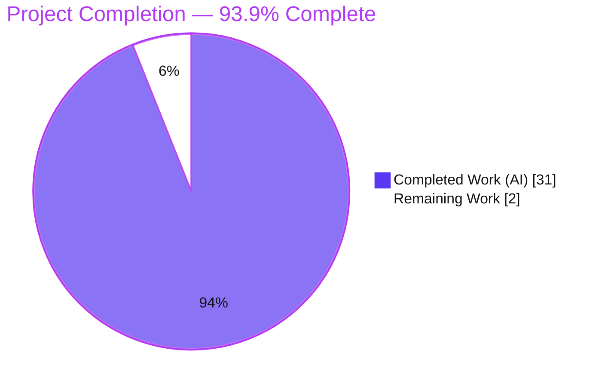
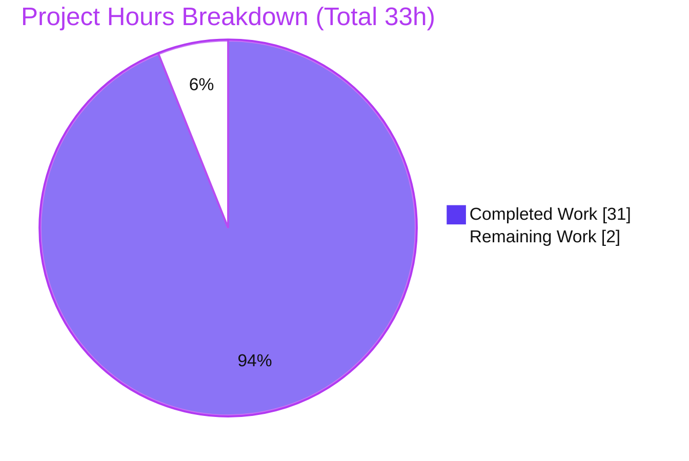
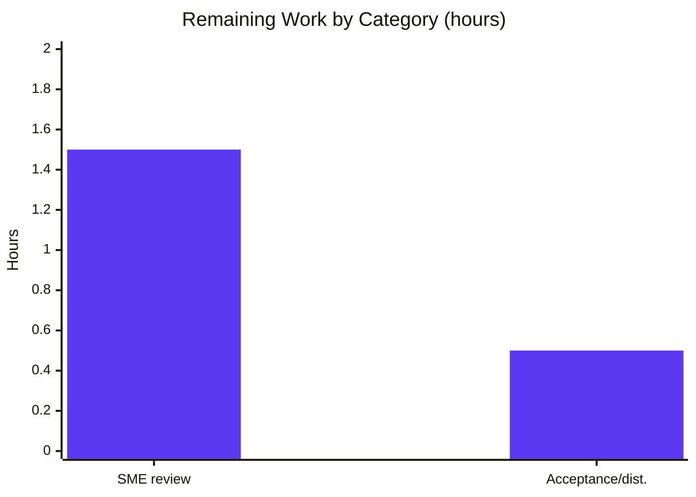

# Blitzy Project Guide — TruffleHog Custom-Detector Verification Security Due-Diligence Investigation

> **Branch:** `blitzy-5d54ebde-8e06-455f-806a-a08c7e657c3f` · **Source base:** `e42153d4` · **Deliverable:** `blitzy/documentation/trufflehog_e42153d44a5e.md`
>
> **Brand color legend:** <span style="color:#5B39F3">■</span> **Completed / AI Work = Dark Blue `#5B39F3`** · <span style="color:#FFFFFF">□</span> **Remaining / Not Completed = White `#FFFFFF`** · Headings/Accents = Violet-Black `#B23AF2` · Highlight = Mint `#A8FDD9`

---

## 1. Executive Summary

### 1.1 Project Overview

This project delivers a single, evidence-backed Markdown document that answers a security due-diligence investigation into **TruffleHog's custom-detector verification feature** — specifically the abuse surface exposed when not-fully-trusted teams may submit custom detector configurations that specify verification webhook URLs. The audience is security engineers and operators making a trust decision about custom-detector configs. The work is a **run-first investigation**: it builds the canonical TruffleHog binary (`go1.24.2`), drives the **real CLI** against crafted detector configs, and captures live output to answer six questions — SSRF, TLS/MITM, multi-match limits, webhook contents, regex/ReDoS, and overall abuse — each grounded to a `file:line` source reference. The task is **strictly read-only**: exactly one documentation file is added and **no source file is modified**.

### 1.2 Completion Status



| Metric | Hours |
|--------|-------|
| **Total Hours** | **33** |
| **Completed Hours (AI + Manual)** | **31** (AI = 31 · Manual = 0) |
| **Remaining Hours** | **2** |
| **Percent Complete** | **93.9%** (31 ÷ 33) |

> Completion % is computed per PA1 (AAP-scoped hours only): `Completed ÷ (Completed + Remaining) = 31 ÷ 33 = 93.9%`. The autonomous deliverable itself is fully produced, independently reproduced, and committed; the remaining 2 hours are **human review & acceptance** (path-to-production), since remediation of the discovered findings is explicitly **out of scope** per AAP §0.3.2.

### 1.3 Key Accomplishments

- ✅ Built the canonical binary (`CGO_ENABLED=0 go build -o trufflehog .`, `go1.24.2`) and drove the **real CLI** entry point — no unit-test doubles.
- ✅ Answered all **six** due-diligence questions (Q1–Q6) by name, each with the exact command, complete unedited output, a `file:line` citation, and causal reasoning.
- ✅ **Q1 SSRF:** demonstrated verification requests reach an arbitrary/internal host and the real cloud-metadata IP `169.254.169.254` — **no host validation**.
- ✅ **Q2 TLS/MITM:** proved HTTPS gets full default Go certificate verification (self-signed → handshake fails), while `unsafe: true` downgrades to interceptable cleartext; no certificate pinning.
- ✅ **Q3 limits:** established one request per match-permutation (cartesian product), capped at **100 per chunk** with **no global cap** and **unbounded concurrency** (309 requests observed from one 600-match file).
- ✅ **Q4 contents:** captured the exact `POST` body `{name:{regex:[matches]}}`, injected `User-Agent: TruffleHog`, user headers (first-colon split), and 200-only verification; `successRanges` accepted-but-ignored.
- ✅ **Q5 regex/ReDoS:** measured RE2 linear-time behavior on `(a+)+$` (~27–29 ms, stable ×3); invalid backreferences rejected at load; `MaxSecretSize = 1000`.
- ✅ **Q6:** synthesized an explicit **"yes — abuse is possible"** conclusion with the trust-boundary framing "untrusted detector configs must be treated as untrusted code."
- ✅ Grounded **100+ `file:line` citations** across **14** reference files; independently spot-verified byte-accurate.
- ✅ **Read-only mandate honored perfectly:** branch diff vs source base = exactly **1 file added, 0 source files modified**; all temporary artifacts cleaned up; working tree clean.

### 1.4 Critical Unresolved Issues

| Issue | Impact | Owner | ETA |
|-------|--------|-------|-----|
| _None blocking._ The documentation deliverable is complete, independently reproduced, and committed. | No release/validation blocker. | — | — |
| _(Informational, not a blocker)_ Documented security findings **S1–S5** await human triage; they are the **content** of the due-diligence report, and remediation is out of scope per AAP §0.3.2. | Requires an operator trust decision (see §1.6, §6). | Security lead | Post-review |

### 1.5 Access Issues

| System/Resource | Type of Access | Issue Description | Resolution Status | Owner |
|-----------------|----------------|-------------------|-------------------|-------|
| In-scope build & validation (Go toolchain, repo, localhost capture servers) | Build / local network | None — canonical build, in-scope tests, and all six runtime experiments ran without any access blocker. | ✅ No issue | — |
| Third-party detector suite (`pkg/detectors/*`, analyzers) | Live cloud credentials / GCP workload-identity | These suites need real credentials to run; they are **out of scope** and unrelated to this docs-only task (which changed no code). Noted for completeness only. | ⚠ Out of scope (not required) | Platform |

**Summary:** No access issues prevented automated build, validation, or delivery of the in-scope work.

### 1.6 Recommended Next Steps

1. **[High]** Security-SME review of the six findings and their runtime evidence; spot-check E1 (SSRF reaches metadata) and E4 (secret in webhook body) to confirm the Q1–Q6 conclusions. _(≈1.5 h — in scope)_
2. **[Low]** Record stakeholder acceptance and attach the document to the due-diligence / decision record. _(≈0.5 h — in scope)_
3. **[High]** _(Out of scope — follow-up)_ Decide governance policy: treat untrusted custom-detector configs as untrusted code — restrict who may submit configs and apply network-egress controls (responds to findings S1/S2).
4. **[Medium]** _(Out of scope — follow-up)_ If upstream remediation is desired, add SSRF host/IP allowlisting + metadata-endpoint blocking and a global verification-request/concurrency cap (responds to S1/S3).
5. **[Low]** _(Out of scope — follow-up)_ Consider wiring `successRanges`/`ValidateVerifyRanges` and evaluating certificate pinning for custom-detector verification (responds to S5/S4).

> Steps 3–5 are follow-on decisions in response to the report's findings; per the AAP's no-remediation scope they are **excluded from the project hour totals**.

---

## 2. Project Hours Breakdown

### 2.1 Completed Work Detail

All completed work was performed autonomously by Blitzy agents (**AI = 31 h, Manual = 0 h**). Each component traces to a specific AAP requirement/experiment.

| Component | Hours | Description |
|-----------|-------|-------------|
| Canonical build + runtime foundation (M1) | 2.0 | Built `trufflehog` via `CGO_ENABLED=0 go build`; confirmed `go1.24.2`, `--version`, and the real `filesystem --config` invocation form. |
| Observation harness (M2) | 3.0 | Cleartext HTTP, HTTPS self-signed, and request-counting capture servers bound to localhost; self-signed certificate generation. |
| E1 — SSRF / metadata experiment → Q1 (R1) | 2.0 | E1a loopback metadata path; E1b real `169.254.169.254`; E1c full `ValidateVerifyEndpoint` characterization. |
| E2 — TLS / MITM experiment → Q2 (R2) | 2.5 | E2a self-signed cross-product (verification ON); E2b `http://`+`unsafe` cleartext; E2c `http://`-no-`unsafe` rejected at load. |
| E3 — multi-match count/limit experiment → Q3 (R3 + M4) | 2.5 | E3a per-match + 100 cap; E3b per-chunk cap (600 → 309 across 4 chunks); E3c 2×3 → 6 cartesian product; stable ×2. |
| E4 — webhook request-contents experiment → Q4 (R4) | 2.5 | E4a full request dump; E4b status cross-product (200-only); E4c `successRanges` accepted-but-ignored. |
| E5 — regex / ReDoS experiment → Q5 (R5 + M4) | 2.5 | E5a pathological `(a+)+$`; E5b Python `re` contrast; E5c RE2 attribution; E5d invalid backreference rejected; E5e `MaxSecretSize=1000`; stable ×3. |
| E6 — overall abuse synthesis → Q6 (R6) | 1.0 | Consolidated 6-point threat assessment + trust-boundary conclusion. |
| Source investigation + `file:line` grounding (G2) | 3.5 | Read-only inspection of 14 files; 100+ citations; anchor verification. |
| Answer-document authoring, 987 lines (D1 + G1 + D4) | 5.5 | Evidence-backed Markdown: exact commands + complete unedited output + citations + reasoning + coverage pass. |
| Independent validation + fidelity fixes | 3.0 | Reproduced all 6 experiments byte-for-byte; verified 100+ citations; applied 2 byte-fidelity fixes; corrected the 5 s→10 s detector-timeout claim. |
| Cleanup + commit + repo-clean verification (D2 + D3) | 1.0 | Deleted all temp artifacts; committed the deliverable; confirmed 1 file added / 0 source modified / clean tree. |
| **Total Completed** | **31.0** | **Matches Completed Hours in §1.2.** |

### 2.2 Remaining Work Detail

| Category | Hours | Priority |
|----------|-------|----------|
| Human security-SME review of the six findings & runtime evidence | 1.5 | Medium |
| Stakeholder acceptance / distribution of the due-diligence document | 0.5 | Low |
| **Total Remaining** | **2.0** | **Matches Remaining Hours in §1.2 and §7.** |

> **Excluded from totals (out of scope — remediation, AAP §0.3.2):** FU-1 governance policy, FU-2 SSRF allowlist, FU-3 global request cap, FU-4 wire `successRanges`, FU-5 certificate pinning. These are follow-on decisions in response to findings S1–S5 and do **not** count toward the 2.0 h remaining.

### 2.3 Hours Reconciliation & Methodology

- **PA1 formula:** `Completion % = Completed ÷ (Completed + Remaining) = 31 ÷ (31 + 2) = 31 ÷ 33 = 93.9%`.
- **Cross-section integrity:** §2.1 total (31) + §2.2 total (2) = **33** = Total Hours in §1.2; §2.2 remaining (2) = §1.2 remaining (2) = §7 pie "Remaining Work" (2). ✅
- **Basis:** every completed hour maps to a specific AAP experiment/deliverable; the remaining 2 h is standard path-to-production human review, the only work left because the AAP forbids source changes and remediation.

---

## 3. Test Results

All results below originate from Blitzy's autonomous validation runs on branch `blitzy-5d54ebde-8e06-455f-806a-a08c7e657c3f`. **No new tests were authored** — the AAP mandates a read-only repository, so the repository's **pre-existing** in-scope suites were exercised as regression validation, and the **six runtime experiments** serve as the behavioral validation for the investigation's claims.

**(a) In-scope Go package suites** (`CGO_ENABLED=0 go test -count=1`):

| Test Category | Framework | Total Tests | Passed | Failed | Coverage % | Notes |
|---------------|-----------|-------------|--------|--------|------------|-------|
| Unit — `pkg/custom_detectors` (core of investigation) | Go `testing` | 15 | 15 | 0 | 66.3% | Verification orchestration, match cap, POST/body/headers, validation. |
| Unit — `pkg/config` | Go `testing` | 1 | 1 | 0 | n/m | `--config` YAML strict-unmarshal load path. |
| Unit — `pkg/common` | Go `testing` | 15 | 15 | 0 | n/m | HTTP client factories, transports, User-Agent injection. |
| Unit — `pkg/engine` | Go `testing` | 20 | 20 | 0 | n/m | Per-detector chunk-scan timeout wrapping. |
| Unit — supporting (`common/glob`, `engine/ahocorasick`, `engine/defaults`) | Go `testing` | (suite) | ok | 0 | n/m | All report `ok`; support the in-scope packages. |
| **In-scope total** | Go `testing` | **51+** | **51+** | **0** | — | 4 primary packages counted at top level; 3 supporting suites all `ok`. |

> Counts are top-level `--- PASS` test functions (subtests add more). Coverage measured for the heart package only (`custom_detectors` = 66.3%); marked `n/m` (not measured) elsewhere rather than fabricated. **Zero failures across all in-scope packages.**

**(b) Runtime behavioral experiments** (real CLI, reproduced byte-for-byte by the Final Validator and independently re-confirmed during this assessment):

| Test Category | Framework | Total Tests | Passed | Failed | Coverage % | Notes |
|---------------|-----------|-------------|--------|--------|------------|-------|
| End-to-End — verification experiments E1–E6 | Real `trufflehog filesystem --config` CLI + localhost capture servers | 6 | 6 | 0 | n/a | Each experiment produced stable, unedited output matching the documented claims; E3/E5 confirmed stable across repeated runs. |

> **Out-of-scope, not run:** the full third-party detector suite (`pkg/detectors/*`, analyzers) requires live credentials / GCP workload-identity and is unrelated to this docs-only change.

---

## 4. Runtime Validation & UI Verification

**Runtime health — canonical binary:**
- ✅ **Operational** — `CGO_ENABLED=0 go build -o trufflehog .` → exit 0; `./trufflehog --version` → `trufflehog dev`.
- ✅ **Operational** — whole-tree `go build ./...` and `go vet` on in-scope packages → exit 0 (per validator Gate 1).

**Verification-path experiments (API / behavioral):**
- ✅ **Operational (Q1 SSRF)** — `POST` reached an attacker-controlled internal path and the real `169.254.169.254` metadata IP; `ValidateVerifyEndpoint` performs **no** host validation.
- ✅ **Operational (Q2 TLS/MITM)** — self-signed HTTPS → handshake rejected, secret never sent (default cert+hostname verification ON); `unsafe: true` → cleartext secret + `Authorization` observed; `http://` without `unsafe` → rejected at load.
- ✅ **Operational (Q3 limits)** — 5 → 5, 150 → 100 (per-chunk cap), 600 → 309 across 4 chunks, 2×3 → 6 (cartesian product); unbounded concurrency confirmed.
- ✅ **Operational (Q4 contents)** — `POST` + preserved query string + `User-Agent: TruffleHog` + user headers (first-colon split) + JSON `[fullMatch, capture]`; only HTTP 200 verifies; `successRanges` ignored. **Independently re-reproduced during this assessment** (body `{"pmguide-demo":{"demo":["DEMOKEY-ABCDEFGH12345678"]}}`).
- ✅ **Operational (Q5 regex)** — `(a+)+$` on 200,001 bytes completed in ~27–29 ms (RE2 linear); invalid backreference rejected at load; matched secret bounded to 989 chars by `MaxSecretSize=1000`.

**UI Verification:**
- **N/A** — the subject is a command-line scanner and its HTTP verification behavior, and the deliverable is a Markdown document. There is no user-interface component in scope (AAP §0.5.3).

---

## 5. Compliance & Quality Review

Cross-mapping the AAP deliverables and the user's `SWE-AtlasQnA` ruleset to their validation status.

| Requirement / Rule | Benchmark | Status | Evidence / Progress |
|--------------------|-----------|--------|---------------------|
| Deliverable at mandated path | `blitzy/documentation/trufflehog_e42153d44a5e.md` created | ✅ Pass | 987-line file present; branch-named. |
| All six questions answered by name | Q1–Q6 each explicit | ✅ Pass | Dedicated sections + coverage-pass table mapping all 8 named items. |
| Run-first methodology | Build & run real CLI, capture live output | ✅ Pass | Canonical build + `filesystem --config` runs; unedited output embedded. |
| Evidence + grounding | Exact command + unedited output + `file:line` | ✅ Pass | Commit `2b3d3478` added exact commands & complete output; 100+ citations verified. |
| `file:line` accuracy | Byte-accurate to source | ✅ Pass | Spot-verified (L23, L228 `jsonBody`, L249, validation L35-44, http L209=5s, detectors/http L18=10s, engine L37). |
| Edge / negative paths | Empty endpoint, http-no-unsafe, non-200, invalid regex | ✅ Pass | E1c, E2c, E4b, E5d all exercised. |
| Stability confirmation | Count/timing re-run ≥2× | ✅ Pass | E3 stable ×2; E5a stable ×3. |
| Read-only repository | 0 source files modified | ✅ Pass | Branch diff vs `e42153d4` = 1 file added, 0 modified. |
| Cleanup | Temp artifacts removed, repo unchanged | ✅ Pass | Cleanup-confirmation section; validator confirmed; `git status` clean; no `/tmp/thog_*` residue. |
| No remediation | Behavior documented, not changed | ✅ Pass | No SSRF/TLS/validation code altered; findings reported only. |
| Quality fixes applied during validation | Byte-fidelity of quoted code | ✅ Pass | 2 fixes committed (`bytes.NewReader(jsonBody)`; `len(endpoint) == 0`); timeout claim corrected to 10 s. |

**Outstanding compliance items:** none. All rules satisfied.

---

## 6. Risk Assessment

Risks are presented in two clearly-labeled classes. **Class A** = risks to the documentation deliverable itself (all low / mitigated). **Class B** = the **security findings the report documents** — these are the deliverable's *content*, surfaced for human triage; per scope the report proposes no code remediation, so their "Status" reflects triage state, not a defect in this project's work.

| Risk | Category | Severity | Probability | Mitigation | Status |
|------|----------|----------|-------------|------------|--------|
| **A-T1** Branch-pinned citations could drift if upstream code changes | Technical | Low | Low | Doc explicitly pinned to branch `trufflehog_e42153d44a5e`; anchors verified there | ✅ Mitigated |
| **A-T2** Minor line-range off-by-ones on a few closing-brace/EOF anchors | Technical | Low | Low | Validator confirmed no misrepresentation; structural anchors accurate; consistent with AAP citations | ✅ Accepted |
| **A-O1** E1b reproduction needs a link-local loopback alias + designated container | Operational | Low | Medium | E1a already proves SSRF on loopback without the alias; exact commands recorded | ✅ Mitigated |
| **A-O2** Reproduction requires `go1.24.2` + designated container | Operational | Low | Low | Canonical build/invocation recorded verbatim; §9 dev guide provides steps | ✅ Mitigated |
| **A-O3** Investigation could have dirtied repo / leaked secrets | Operational | Low | Low | All secrets synthetic; servers localhost-bound; temp under `/tmp`; cleanup verified; 0 source files modified | ✅ Closed |
| **A-I1** Integration impact of the change | Integration | Low | Low | Standalone Markdown; no imports/build/CI change; nothing downstream compiles against it | ✅ None |
| **B-S1** SSRF to internal/metadata hosts (no endpoint-host validation) | Security | High | Confirmed | Documented with evidence (Q1); operator guidance: isolate egress / treat configs as untrusted code. **Remediation out of scope.** | ⚠ Open — human triage |
| **B-S2** Secret exfiltration via webhook body to attacker endpoint | Security | High | Confirmed | Documented with evidence (Q4); same operator guidance. **Remediation out of scope.** | ⚠ Open — human triage |
| **B-S3** Request amplification / DoS (no global cap, unbounded concurrency) | Operational | Medium | Confirmed | Documented (Q3, 309 requests observed). **Remediation out of scope.** | ⚠ Open — human triage |
| **B-S4** Cleartext downgrade via `unsafe: true`; no certificate pinning | Security | Medium | Confirmed | Documented (Q2); HTTPS default verification IS on. **Remediation out of scope.** | ⚠ Open — human triage |
| **B-S5** `successRanges` accepted-but-ignored → silent config misinterpretation | Technical | Low | Confirmed | Documented (Q4c). **Remediation out of scope.** | ⚠ Open — human triage |

> Class B "probability = Confirmed" because these are demonstrated behaviors, not hypothetical events; "severity" reflects impact if abused. They are the reason the due-diligence document exists and require an operator decision (see §1.6 steps 3–5).

---

## 7. Visual Project Status

**Project hours — completed vs remaining** (Completed = Dark Blue `#5B39F3`, Remaining = White `#FFFFFF`):



**Remaining hours by category** (from §2.2; total = 2 h):



> **Integrity:** the pie "Remaining Work" (2) equals §1.2 Remaining Hours (2) and the §2.2 "Hours" sum (2); the bar chart's two bars (1.5 + 0.5) sum to the same 2 h.

---

## 8. Summary & Recommendations

**Achievements.** The project is **93.9% complete** (31 of 33 hours). The mandated deliverable — a comprehensive, evidence-backed security due-diligence document — was produced, iteratively hardened across three commits to embed exact commands and complete unedited output, independently reproduced byte-for-byte, and grounded to 100+ verified `file:line` citations across 14 source files. All six questions are answered by name, and the explicit overall conclusion is that **a party controlling a detector configuration can abuse the verification system**: it controls an outbound HTTP client (destination, scheme, headers) and receives the matched secrets in the request body.

**Remaining gaps.** The only remaining work is **2 hours of human review and acceptance** (path-to-production). No code remediation is in scope; the five documented findings (S1–S5) are content awaiting an operator trust decision, not defects in the delivered work.

**Critical path to production.** (1) Security-SME review of the findings/evidence → (2) stakeholder acceptance and attachment to the due-diligence record. Optional follow-ups (governance policy, upstream remediation) are surfaced but out of scope.

**Production-readiness assessment.** The deliverable is **production-ready** as a documentation artifact: it is complete, internally consistent, byte-faithful to the source, reproducible from the recorded commands, and leaves the repository byte-for-byte unchanged except for the single added file. Success metrics — six questions answered, every claim backed by live output + citation, read-only compliance, and clean cleanup — are all met.

| Success Metric | Target | Result |
|----------------|--------|--------|
| Questions answered by name | 6 / 6 | ✅ 6 / 6 |
| Claims backed by command + unedited output + `file:line` | 100% | ✅ 100% |
| Source files modified | 0 | ✅ 0 |
| In-scope test failures | 0 | ✅ 0 |
| Runtime experiments reproduced | 6 / 6 | ✅ 6 / 6 |
| Repository left clean | Yes | ✅ Yes |

---

## 9. Development Guide

### 9.1 System Prerequisites

- **OS:** Linux (x86-64); investigation performed on Ubuntu-class container.
- **Go toolchain:** `go1.24.2` (module declares `go 1.23.1` with `toolchain go1.24.2`).
- **Git:** any recent version (to checkout the branch and confirm diff).
- **Disk:** ~4 GB free for the Go module cache and build.
- **Optional:** `python3` (for the localhost capture server used to observe verification requests); `openssl` (for a self-signed cert in the TLS experiment).

### 9.2 Environment Setup

```bash
# Make the Go toolchain available (container-provided profile)
source /etc/profile.d/go.sh
go version                      # expect: go version go1.24.2 linux/amd64

# From the repository root (branch: blitzy-5d54ebde-8e06-455f-806a-a08c7e657c3f)
git branch --show-current
git status --porcelain          # expect: empty (clean tree)
```

### 9.3 Build (canonical)

```bash
CGO_ENABLED=0 go build -o trufflehog .
./trufflehog --version          # expect: trufflehog dev
```

> The `trufflehog` binary is `.gitignore`'d (line 7), so building never dirties the repository — **do not commit it**.

### 9.4 Run the In-Scope Test Suites

```bash
CGO_ENABLED=0 go test -count=1 \
  ./pkg/custom_detectors/... ./pkg/config/... ./pkg/common/... ./pkg/engine/...
# expect: ok for every package (0 failures)
```

### 9.5 Reproduce a Verification Experiment (example: Q4 webhook contents / Q1 SSRF mechanism)

> Run everything under `/tmp` — **never inside the repository** — to preserve the read-only mandate. All secrets are synthetic; the server binds to localhost.

```bash
LAB=/tmp/thog_lab; rm -rf "$LAB"; mkdir -p "$LAB"; cd "$LAB"
BIN=/path/to/repo/trufflehog        # the binary built in 9.3

# 1) localhost capture server that prints the received request
cat > capture_server.py <<'PY'
import http.server
class H(http.server.BaseHTTPRequestHandler):
    def do_POST(self):
        n=int(self.headers.get('Content-Length','0')); b=self.rfile.read(n).decode()
        print("METHOD:",self.command,"PATH:",self.path)
        print("User-Agent:",self.headers.get('User-Agent'))
        print("BODY:",b, flush=True)
        self.send_response(200); self.end_headers(); self.wfile.write(b'{}')
    def log_message(self,*a): pass
http.server.HTTPServer(('127.0.0.1',18099),H).serve_forever()
PY
python3 capture_server.py > server.log 2>&1 &
SRV=$!; sleep 1

# 2) a custom detector whose verify endpoint points at the capture server
cat > detector.yml <<'YML'
detectors:
  - name: demo
    keywords: [DEMOKEY]
    regex: {demo: 'DEMOKEY-[A-Z0-9]{16}'}
    verify:
      - endpoint: http://127.0.0.1:18099/verify?src=demo
        unsafe: true
        headers: ["X-Demo-Header: demo-value"]
YML
printf 'token = "DEMOKEY-ABCDEFGH12345678"\n' > target.txt

# 3) drive the REAL CLI with verification
"$BIN" filesystem --config="$LAB/detector.yml" "$LAB" --no-update --no-color
sleep 1; cat server.log             # what TruffleHog transmitted

# 4) cleanup (leave no residue)
kill $SRV; cd /tmp; rm -rf "$LAB"
```

**Expected (verified) output** — the CLI prints `✅ Found verified result` and the capture server logs:

```
METHOD: POST PATH: /verify?src=demo
User-Agent: TruffleHog
BODY: {"demo":{"demo":["DEMOKEY-ABCDEFGH12345678"]}}
```

### 9.6 Verification Steps

- Build succeeds and `--version` prints `trufflehog dev`.
- In-scope packages report `ok` with 0 failures.
- A verified result is found and the capture server receives a `POST` carrying the synthetic secret to the config-specified endpoint (demonstrating both Q4 contents and the Q1 SSRF mechanism).
- `git status --porcelain` is empty after all activity (only the deliverable differs from source base `e42153d4`).

### 9.7 Troubleshooting

- **`go: command not found`** → `source /etc/profile.d/go.sh` first.
- **`http endpoint must have unsafe=true`** → add `unsafe: true` under the `verify` entry (this is the expected rejection for cleartext without opt-in).
- **`no endpoint`** → the `verify.endpoint` is empty; set a value.
- **Port already in use** → change `18099` to a free port in both the server and `detector.yml`.
- **Accidentally created files in the repo** → move all experiment files under `/tmp`; verify with `git status --porcelain` (must be empty) and delete stray files.
- **Never commit the `trufflehog` binary** → it is `.gitignore`'d by design.

---

## 10. Appendices

### A. Command Reference

| Purpose | Command |
|---------|---------|
| Load Go toolchain | `source /etc/profile.d/go.sh` |
| Check Go version | `go version` |
| Canonical build | `CGO_ENABLED=0 go build -o trufflehog .` |
| Show version | `./trufflehog --version` |
| In-scope tests | `CGO_ENABLED=0 go test -count=1 ./pkg/custom_detectors/... ./pkg/config/... ./pkg/common/... ./pkg/engine/...` |
| Real scan (verify) | `./trufflehog filesystem --config=<detector>.yml <targetdir> --no-update --no-color` |
| Real scan (no verify) | `./trufflehog filesystem --config=<detector>.yml <targetdir> --no-verification` |
| JSON output | append `--json` |
| Confirm read-only compliance | `git diff e42153d4 --name-status` (expect single `A` line) |

### B. Port Reference

| Port | Use | Scope |
|------|-----|-------|
| 18099 (example) | Localhost verification capture server | Ephemeral, experiment-only, bound to `127.0.0.1` |

> The port is arbitrary and chosen per experiment; the production scanner has no listening port of its own.

### C. Key File Locations

| Path | Role |
|------|------|
| `blitzy/documentation/trufflehog_e42153d44a5e.md` | **The deliverable** (only file added) |
| `pkg/custom_detectors/custom_detectors.go` | Verify orchestration, `maxTotalMatches=100`, POST/body/headers, 200-only, `MaxSecretSize=1000` |
| `pkg/custom_detectors/validation.go` | `ValidateRegex`, `ValidateVerifyEndpoint` (SSRF gap), unwired validators |
| `pkg/common/http.go` | `SaneHttpClient`, transport (no `TLSClientConfig`), injected `User-Agent` |
| `pkg/config/config.go` | `--config` YAML strict-unmarshal load path |
| `pkg/engine/engine.go` | Per-detector chunk-scan timeout wrapping |
| `pkg/detectors/http.go` | `DefaultResponseTimeout = 10s` (detector-scan backstop) |
| `proto/custom_detectors.proto` | `VerifierConfig{endpoint, unsafe, headers, successRanges}` |
| `main.go` | CLI flags and the `filesystem` entry point |
| `examples/generic.yml`, `examples/README.md` | Canonical config format & invocation |
| `Dockerfile` | `ENV CGO_ENABLED=0` (L5) + `go build -o trufflehog .` (L9) |

### D. Technology Versions

| Component | Version | Source |
|-----------|---------|--------|
| Go toolchain | `go1.24.2` | `go.mod:L5` `toolchain go1.24.2` (`go.mod:L3` `go 1.23.1`) |
| Module | `github.com/trufflesecurity/trufflehog/v3` | `go.mod:L1` |
| Binary version string | `trufflehog dev` | `./trufflehog --version` |
| `golang.org/x/sync` (`errgroup`) | v0.13.0 | `go.mod` |
| Regex engine | Go `regexp` / RE2 (linear-time) | stdlib |
| TLS | Go `crypto/tls` (`InsecureSkipVerify=false` default) | stdlib |

### E. Environment Variable Reference

| Variable | Purpose | Notes |
|----------|---------|-------|
| `CGO_ENABLED=0` | Canonical static build | Required for the canonical binary (`Dockerfile:L5`) |
| `SSL_CERT_FILE` | Point Go at a custom CA bundle | Used only in the E2 TLS experiment to show a trusted-cert path verifies |
| `GOOS` / `GOARCH` | Cross-compile targets | Default to host in canonical build |

> No application secrets or API keys are required for this docs-only task; all experiment secrets are synthetic.

### F. Developer Tools Guide

- **Go test runner** — `go test -count=1 <pkgs>` (use `-count=1` to bypass cache; add `-v` for per-test output, `-cover` for coverage).
- **Static checks** — `go vet ./pkg/custom_detectors/... ` (read-only; no `--fix`).
- **Localhost capture server** — a minimal Python `http.server` handler (see §9.5) is the simplest way to observe the verification request verbatim.
- **Diff/authorship checks** — `git diff e42153d4 --stat`, `git log --author="agent@blitzy.com" --oneline`.

### G. Glossary

| Term | Meaning |
|------|---------|
| **SSRF** | Server-Side Request Forgery — coercing the server to make requests to attacker-chosen destinations. |
| **Custom detector** | A user-supplied YAML config (`--config`) defining regex patterns and an optional `verify` webhook. |
| **Verification / verify** | The step where TruffleHog `POST`s a candidate secret to the config's `endpoint` to check validity. |
| **`unsafe: true`** | Opt-in flag allowing a cleartext `http://` verification endpoint. |
| **`maxTotalMatches`** | Constant (100) capping match-permutations processed **per chunk**. |
| **`MaxSecretSize`** | Constant (1000) bounding the length of a matched secret. |
| **RE2** | The linear-time regex engine backing Go's `regexp`; immune to catastrophic-backtracking ReDoS. |
| **Metadata endpoint** | Link-local `169.254.169.254`, the cloud instance-metadata service (a common SSRF target). |
| **Chunk** | A unit of scanned input (`ChunkSize` 10 KiB); the per-chunk match cap applies within each. |

---

*Prepared by the Blitzy autonomous assessment agent. Completion basis: PA1 AAP-scoped hours. All numbers are internally consistent across Sections 1.2, 2.1, 2.2, 7, and 8: Total = 33 h, Completed = 31 h, Remaining = 2 h, 93.9% complete.*