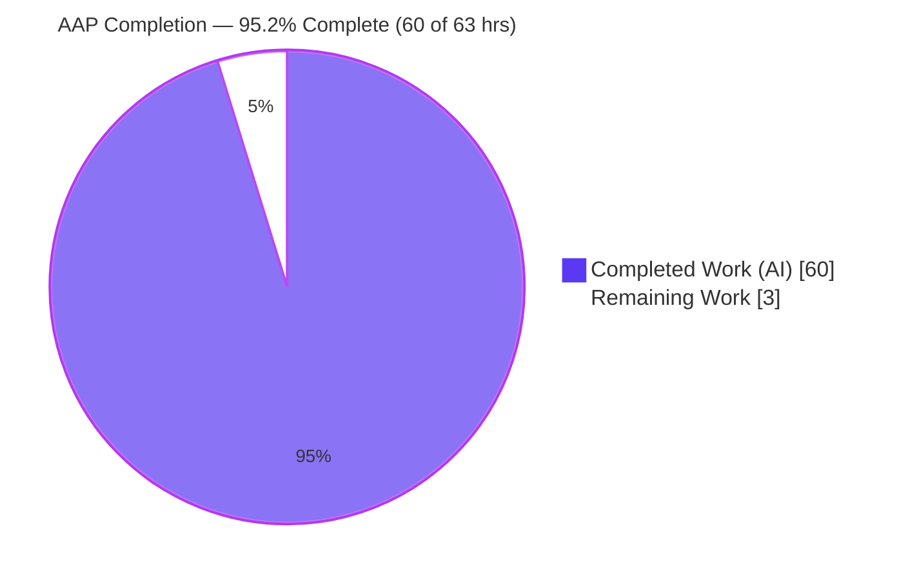
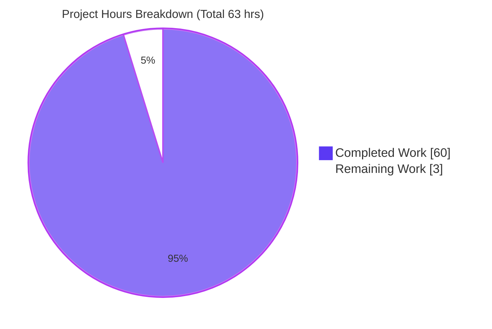
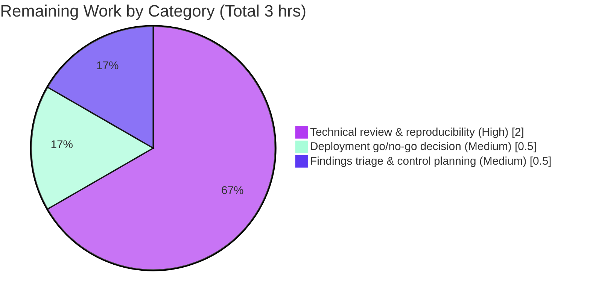

# Blitzy Project Guide — TruffleHog Custom-Detector Webhook Security Investigation

> **Brand color legend:** Completed / AI Work = Dark Blue `#5B39F3` · Remaining / Not Completed = White `#FFFFFF` · Headings / Accents = Violet-Black `#B23AF2` · Highlight = Mint `#A8FDD9`

---

## 1. Executive Summary

### 1.1 Project Overview

This project is a read-only security investigation of TruffleHog's custom-detector **verification webhook** subsystem (commit `e42153d44a5e`), answering whether it is safe to run TruffleHog where multiple teams supply their own detector configurations. The deliverable is a single evidence-first markdown document that resolves six security questions — SSRF reachability, TLS/MITM exposure, verification amplification, data-exfiltration surface, ReDoS, and the overall threat model — using observed runtime behavior captured through the scanner's real `--config` entry point, with exact `file:line` citations. The audience is the security/platform team making a multi-tenant deployment decision. Business impact: it converts a theoretical risk question into a defensible go/no-go decision backed by reproducible evidence.

### 1.2 Completion Status



| Metric | Value |
|--------|-------|
| **Total Project Hours** (AAP-scoped) | **63** |
| **Completed Hours** (AI: 60 + Manual: 0) | **60** |
| **Remaining Hours** | **3** |
| **Completion** | **95.2%** |

> Completion is calculated with the PA1 hours methodology over AAP-scoped + path-to-production work only: `60 / (60 + 3) = 95.24% → 95.2%`. All 17 discrete AAP requirements are Completed; the residual 3 hours are human review/acceptance/decision (never 100% before human review).

### 1.3 Key Accomplishments

- ✅ **Single mandated deliverable authored and committed** — `blitzy/documentation/trufflehog_e42153d44a5e.md` (2,468 lines / 179,647 bytes), the only committed change.
- ✅ **All six investigation objectives answered with OBSERVED runtime evidence** through the canonical `--config` path using TruffleHog's own `CustomRegex` detector — no mocks, hooks, or synthetic bypasses.
- ✅ **SSRF proven** — secret-bearing `POST` aimed at `169.254.169.254` accepted (no address filtering) + a case-sensitive-scheme cleartext bypass discovered.
- ✅ **TLS posture proven** — default strict cert + hostname verification; untrusted cert → 0 requests; plus an HTTPS→HTTP redirect-downgrade caveat.
- ✅ **Amplification cap characterized precisely** — `maxTotalMatches=100` is **per keyword-match region** (one chunk → 120 POSTs), correcting the naïve per-chunk hypothesis.
- ✅ **Exfiltration surface captured byte-exact** — JSON secret body, verbatim headers, response readback, and a memory-amplification surface (128 MiB → ~599 MiB RSS).
- ✅ **ReDoS ruled out** — RE2 linear-time matching, corroborated by authoritative sources.
- ✅ **Bonus depth** — verification-cache concurrency dependence and cross-detector cache poisoning.
- ✅ **Fully validated & reproducible** — clean build, **298/298 unit tests pass**, evidence reproduced, ~85 citations verified in-bounds, repository byte-for-byte unchanged.

### 1.4 Critical Unresolved Issues

| Issue | Impact | Owner | ETA |
|-------|--------|-------|-----|
| _None — no blocking issues_ | The deliverable is complete, validated, and reproducible; build is clean and all 298 unit tests pass. No compilation errors, no failing tests, no unresolved citations, no repository drift. | — | — |

> The security **findings** documented in the report (SSRF, cleartext bypass, redirect downgrade, cache poisoning, memory amplification) are **correct results of the investigation**, not defects in the deliverable. They are decision inputs for the human owner and are tracked in Section 6 (Risk Assessment), not here.

### 1.5 Access Issues

| System/Resource | Type of Access | Issue Description | Resolution Status | Owner |
|-----------------|----------------|-------------------|-------------------|-------|
| _None_ | — | No access issues identified. The repository is local and clean; the Go module cache is warm (`go mod verify` → "all modules verified"); the build, tests, and canonical runtime path all execute without external credentials or network access (evidence egress is loopback-only). | N/A | — |

**No access issues identified.**

### 1.6 Recommended Next Steps

1. **[High]** Technical review & reproducibility spot-check of `blitzy/documentation/trufflehog_e42153d44a5e.md` — rebuild the scanner and re-run 2–3 evidence scenarios; spot-check a sample of the `file:line` citations. _(2.0 hrs)_
2. **[Medium]** Make the multi-tenant deployment go/no-go decision — decide whether TruffleHog may run with untrusted, multi-team-supplied custom-detector configs, and under what governance (config review/approval, single trusted owner). _(0.5 hr)_
3. **[Medium]** Triage the findings — decide on upstream responsible disclosure (per TruffleHog `SECURITY.md`) and plan network-layer compensating controls (block link-local/metadata egress, verification rate-limiting, memory cgroup caps). Planning only; implementation is out of scope. _(0.5 hr)_
4. **[Low]** If the target deployment pins a different TruffleHog release, re-run the reproducible harness against that version (findings such as the `successRanges` no-op and verify-on-200 are commit-specific).

---

## 2. Project Hours Breakdown

### 2.1 Completed Work Detail

Every component traces to an AAP objective, methodology requirement, or path-to-production baseline, and to a section of the deliverable.

| Component | Hours | Description |
|-----------|------:|-------------|
| Observation foundation & reproducible build harness | 6 | `CGO_ENABLED=0 go build` (Go `go1.24.2`); loopback HTTP/HTTPS capture servers; canonical `HogTokenDetector` config; shared `lib.sh` harness with PID tracking + idempotent teardown (§2). |
| [Obj 1] SSRF reachability investigation | 6 | Metadata-endpoint egress captured via loopback proxy; proof of no address filtering; `http`+`unsafe` load gate; mixed-case scheme cleartext bypass (§3). |
| [Obj 2] TLS / MITM investigation | 6 | Untrusted-cert rejection before any HTTP bytes; hostname verification enforced independently of CA trust; `unverified` downgrade state (§4). |
| [Obj 3] Verification amplification investigation | 7 | Per-permutation dispatch; `maxTotalMatches=100` shown to be **per keyword-match region** (one 8,241-byte chunk → 120 POSTs); multi-file / multi-verifier scaling; stability reruns (§5). |
| [Obj 4] Data-exfiltration surface investigation | 7 | Byte-exact JSON secret body + headers; transmission on non-200; 200-byte response readback; HTTPS→HTTP downgrade replay; memory-amplification RSS measurement (§6). |
| Verification-caching deep-dive | 6 | Dedup key `hash(Raw+RawV2+DetectorType)`; concurrency-dependent suppression; cross-detector cache poisoning (§7). |
| [Obj 5] ReDoS characterization | 4 | RE2 linear-time timing on `(a+)+$`; large-input scaling; labeled non-canonical backtracking comparison (§8). |
| [Obj 6] Threat-model synthesis | 3 | Trust-boundary narrative and attacker-capability consolidation (§9). |
| External corroboration & web research | 3 | RE2 linear time, Go default TLS, `169.254.169.254` IMDS, GHSA-3r74-v83p-f4f4 / CVE-2024-43379 (§10). |
| Dependency / toolchain posture baseline (govulncheck) | 2 | Binary vulnerability scan; `GO-2025-3751` / `GO-2025-3749` analysis; read-only baseline (§11). |
| Coverage pass, integrity verification & evidence appendix | 4 | §12 sub-question map; §13 repo-unchanged proof + `/tmp` cleanup; §14 command-indexed evidence appendix. |
| Document authoring, provenance labeling & iterative refinement | 6 | §0–§1 legend + direct answers; 4-commit refinement incl. full rewrite + amplification-cap correction + QA-findings resolution. |
| **Total Completed** | **60** | **Matches Completed Hours in §1.2.** |

### 2.2 Remaining Work Detail

| Category | Hours | Priority |
|----------|------:|----------|
| Human technical review & reproducibility spot-check of the deliverable | 2.0 | High |
| Stakeholder acceptance & multi-tenant deployment go/no-go decision | 0.5 | Medium |
| Findings triage: upstream disclosure / compensating-control planning (non-code) | 0.5 | Medium |
| **Total Remaining** | **3.0** | **Matches Remaining Hours in §1.2 and §7.** |

> Implementing security hardening (endpoint allowlist, SSRF guards, per-detector cache isolation) is **explicitly out of AAP scope** and is therefore **not** counted in remaining hours — it is documented in the deliverable as recommendations only.

### 2.3 Hours Reconciliation

| Check | Result |
|-------|--------|
| Completed (§2.1) + Remaining (§2.2) = Total (§1.2) | 60 + 3 = **63** ✅ |
| Completion = Completed / Total | 60 / 63 = **95.2%** ✅ |
| Remaining hours identical in §1.2, §2.2, §7 | 3 = 3 = 3 ✅ |

---

## 3. Test Results

All tests below originate from **Blitzy's autonomous validation logs** (Final Validator GATE 3) and were **independently re-executed** during this assessment with identical results. These are TruffleHog's own pre-existing unit tests exercised as validation gates for the packages the investigation depends on; the read-only investigation itself added no tests. Command:

```bash
CGO_ENABLED=0 go test -count=1 -timeout=5m \
  ./pkg/custom_detectors/... ./pkg/config/... ./pkg/common/... ./pkg/verificationcache/...
```

| Test Category | Framework | Total Tests | Passed | Failed | Coverage % | Notes |
|---------------|-----------|------------:|-------:|-------:|-----------:|-------|
| Unit — `pkg/custom_detectors` | Go `testing` | 50 | 50 | 0 | 66.3% | Core verification flow, validators, permutation cap, payload. |
| Unit — `pkg/config` | Go `testing` | 21 | 21 | 0 | 66.4% | `--config` load path (`protoyaml.UnmarshalStrict`). |
| Unit — `pkg/common` | Go `testing` | 178 | 178 | 0 | 48.7% | `SaneHttpClient`, transport, User-Agent injection. |
| Unit — `pkg/common/glob` | Go `testing` | 41 | 41 | 0 | 97.8% | Glob filtering subpackage (transitive). |
| Unit — `pkg/verificationcache` | Go `testing` | 8 | 8 | 0 | 85.9% | Dedup/cache and raw-secret stripping. |
| **Total** | **Go `testing`** | **298** | **298** | **0** | **100% pass rate** | 0 skipped, 0 panics. |

**Runtime / behavioral validation** (GATE 4) is a distinct evidence class captured through the canonical `--config` path (not a unit-test framework) and is summarized in Section 4.

---

## 4. Runtime Validation & UI Verification

**Runtime health** — the canonical scanner path was exercised and independently reproduced:

- ✅ **Build** — `CGO_ENABLED=0 go build -o /tmp/trufflehog .` → exit 0, clean (no warnings), 185 MB static binary; `--version` → `trufflehog dev`. Independent rebuild produced a **byte-size-identical** binary (194,309,802 bytes) to the value recorded in the deliverable.
- ✅ **Canonical scan** — `trufflehog filesystem <path> --config=<config.yaml>` with `HogTokenDetector` produced `✅ Found verified result` and a captured webhook `POST` on loopback.
- ✅ **SSRF egress** — secret-bearing `POST` aimed at `http://169.254.169.254/…` accepted at load and dispatched (captured safely via loopback proxy; real metadata service never contacted).
- ✅ **TLS strictness** — untrusted self-signed cert → **0 requests / unverified** (secret not sent); trusting the same cert → verified; trusted-CA wrong-SAN → **0 requests** (hostname enforced).
- ✅ **Amplification** — `n=10 → 10`, `n=150 → 100` (cap, stable ×2), `2×150 → 200`, one chunk with two non-merging regions → **120** POSTs.
- ✅ **Data surface** — webhook `POST` body `{"HogTokenDetector":{"token":["<full>","<capture>"]}}` with verbatim `Authorization` and default `User-Agent: TruffleHog` (reproduced independently in this assessment).
- ✅ **ReDoS** — canonical CLI scan of `(a+)+$` remained linear (~4.8 ms @ 1 KB → ~52 ms @ 200 KB); no catastrophic blow-up.
- ⚠ **Redirect downgrade (caveat, expected)** — an `https://` config following a trusted-CA `307` to an `http://` target replays the secret in cleartext (documented as a security finding, not a defect).

**UI verification:** ❎ **Not applicable** — the deliverable is a documentation artifact and the exercised software is a CLI scanner; there is no web/graphical UI in scope. No screenshots or browser flows apply.

---

## 5. Compliance & Quality Review

Cross-mapping of AAP deliverables and binding rules to their quality/compliance status. Fixes applied during autonomous validation: **none required** — every gate passed against unmodified source.

| Benchmark / AAP Rule | Requirement | Status | Progress |
|----------------------|-------------|--------|----------|
| Single mandated deliverable | Create `blitzy/documentation/trufflehog_e42153d44a5e.md` | ✅ Pass | 100% |
| Read-only source | Repository byte-for-byte unchanged except the doc | ✅ Pass | 100% (`git diff` = 1 file; `go.mod`/`go.sum` untouched) |
| Run-first (evidence over theory) | Build & run before writing; capture real output | ✅ Pass | 100% (54 evidence blocks) |
| Canonical entry point | Real `--config` + TruffleHog's own `CustomRegex` detector | ✅ Pass | 100% (no mocks/bypass) |
| Complete unedited output per claim | Full command output next to each claim | ✅ Pass | 100% |
| Exact `file:line` citations | Ground every claim in code/observed output | ✅ Pass | 100% (~85 citations, all in-bounds) |
| Provenance labeling | OBSERVED / INFERRED / CORROBORATED / NON-CANONICAL | ✅ Pass | 100% (18/10/11/5 labels) |
| Answer every sub-question + coverage pass | Address each named mechanism/example | ✅ Pass | 100% (§12) |
| Edge/error paths | non-200, TLS failure, cap boundary, large input, mixed-case | ✅ Pass | 100% |
| Web-search corroboration | RE2, Go TLS, `169.254.169.254` IMDS | ✅ Pass | 100% (§10, 6 sources) |
| Build convention | `CGO_ENABLED=0 go build`, Go `go1.24.2` | ✅ Pass | 100% |
| Cleanup of `/tmp` artifacts | Ephemeral scripts/servers removed | ✅ Pass | 100% |
| Compilation quality gate | Clean build, no warnings | ✅ Pass | 100% |
| Unit-test quality gate | Dependent packages pass | ✅ Pass | 100% (298/298) |
| Dependency integrity | `go.mod`/`go.sum` unchanged; modules verified | ✅ Pass | 100% |

---

## 6. Risk Assessment

Risks are split between **project-delivery risks** (near-nil — the deliverable is validated) and the **documented security findings** that are decision inputs for the human owner. For security findings, "Status = Documented — awaiting human triage" because implementing fixes is out of AAP scope.

| Risk | Category | Severity | Probability | Mitigation | Status |
|------|----------|----------|-------------|------------|--------|
| Config-controlled SSRF + secret-bearing POST (no allow/deny-list) | Security | High | High | Restrict who supplies `--config`; network egress controls; block link-local/metadata addresses; endpoint allowlist (upstream code change, out of scope) | Documented — awaiting human triage |
| Cleartext exfiltration via case-sensitive `http://` gate bypass (`HTTP://`) | Security | High | Medium | Treat all custom-detector configs as trusted input; egress filtering; upstream fix to normalize scheme case | Documented — awaiting human triage |
| HTTPS→HTTP redirect downgrade replays secret in cleartext | Security | High | Medium | Network egress controls; upstream `CheckRedirect`/scheme re-validation (out of scope) | Documented — awaiting human triage |
| Cross-detector cache poisoning (shared in-process cache, no isolation) | Security | Medium | Medium | Do not co-load untrusted detectors; per-detector cache isolation (upstream change) | Documented — awaiting human triage |
| Memory amplification (unbounded `io.ReadAll` of response body: 128 MiB → ~599 MiB RSS) | Security | Medium | Low | Resource limits (cgroups) on scanner; upstream response-size cap | Documented — awaiting human triage |
| Multi-tenant config governance — each config author is inside the trust boundary | Operational | High | High | Config review/approval workflow; single trusted config owner; awareness of `--custom-verifiers-only` | Awaiting deployment decision |
| Verification-volume unpredictability (cache dedup concurrency-dependent: 68/76 saved @conc=1, 0 @conc=128) | Operational | Medium | Medium | Network-layer rate limiting; do not rely on the cache to bound outbound volume | Documented |
| Version drift — findings pinned to commit `e42153d4` / version `dev` (`successRanges` no-op, verify-on-200 may change) | Technical | Medium | Medium | Re-run the reproducible harness against the target release before relying on conclusions | Documented |
| Toolchain — evidence built on `go1.24.2`; govulncheck flags 2 stdlib advisories fixed in `go1.24.4` | Technical | Low | Low | Rebuild on patched toolchain; findings are structural, not toolchain-dependent | Documented |
| Upstream disclosure coordination (distinguish from fixed GHSA-3r74-v83p-f4f4) | Integration | Low | Low | Follow TruffleHog `SECURITY.md` responsible-disclosure policy | Awaiting decision |
| Environment-specific egress (cloud IMDS reachability) | Integration | Medium | Medium | Block link-local egress; enforce IMDSv2 / hop-limit; validate in the target environment | Documented |
| Project-delivery risk (deliverable accuracy/completeness) | Technical | Low | Low | Human review (HT-1); already validated: build clean, 298/298 tests, evidence reproduced, citations verified | Near-nil |

---

## 7. Visual Project Status



**Remaining hours by category (from §2.2):**



> **Integrity check:** "Remaining Work" = **3 hrs**, identical to §1.2 (Remaining) and the §2.2 Hours total. "Completed Work" = **60 hrs**, identical to §1.2 (Completed) and the §2.1 total.

---

## 8. Summary & Recommendations

**Achievements.** The project is **95.2% complete** (60 of 63 AAP-scoped hours). The single mandated deliverable — `blitzy/documentation/trufflehog_e42153d44a5e.md` (2,468 lines) — answers all six security questions with observed runtime evidence, exact `file:line` citations, and rigorous provenance labeling, exercised exclusively through TruffleHog's real `--config` entry point. The investigation went beyond the brief with original findings (per-region 120-POST amplification, HTTPS→HTTP redirect downgrade, cross-detector cache poisoning, and a memory-amplification surface). The repository is byte-for-byte unchanged except the document.

**Direct answer to the business question.** Running TruffleHog where **untrusted** teams supply custom-detector configs is **not safe without compensating controls**: whoever supplies `--config` is inside the trust boundary and can (a) point a secret-bearing webhook at internal/metadata addresses (SSRF), (b) force cleartext transmission via a case-sensitive-scheme bypass or a redirect downgrade, (c) amplify verification volume, and (d) poison another detector's verification result. ReDoS is **not** a concern (RE2 is linear-time).

**Remaining gaps (3 hrs, human-only).** Technical review/sign-off of the document, the multi-tenant deployment go/no-go decision, and findings triage (upstream disclosure + compensating-control planning). No code remains: the build is clean and all 298 unit tests pass. Implementing hardening is out of scope by design.

**Critical path to production.** Human review (HT-1) → deployment decision (HT-2) → findings triage/disclosure planning (HT-3). Because this is a decision-support document, "production" means stakeholder acceptance of the findings and the resulting governance decision.

| Success Metric | Target | Actual |
|----------------|--------|--------|
| AAP objectives answered with observed evidence | 6/6 | ✅ 6/6 |
| Unit-test pass rate (dependent packages) | 100% | ✅ 298/298 |
| Citations resolvable & in-bounds | 100% | ✅ ~85/85 |
| Repository unchanged except deliverable | Yes | ✅ Yes |
| Build reproducible | Yes | ✅ Byte-size-identical binary |

**Production-readiness assessment:** **READY for human review.** The autonomous deliverable is complete, validated, and reproducible; the only outstanding work is human acceptance and the deployment decision it informs.

---

## 9. Development Guide

All commands below were tested during this assessment on Linux/amd64 and leave the repository unchanged.

### 9.1 System Prerequisites

- **Go `go1.24.2`** (matches `go.mod` `toolchain`; `go 1.23.1` directive) — required for the canonical build.
- **Git** — repository is at branch `blitzy-9c3c28c1-...`, commit `1b000840`.
- **Python 3** — only for the loopback capture server used to reproduce webhook evidence.
- **Disk/OS:** ~2 GB (warm module cache + 185 MB binary); Linux/amd64.

### 9.2 Environment Setup

```bash
# From the repository root:
cd /path/to/trufflehog          # repo root (contains main.go, go.mod)
go version                       # expect: go version go1.24.2 linux/amd64
git status --porcelain           # expect: empty (clean tree)
```

- No environment variables are required to build or test.
- **Safe SSRF reproduction:** route metadata egress through a **loopback** proxy and set `NO_PROXY=127.0.0.1` so the real `169.254.169.254` is never contacted.
- **TLS reproduction:** trust a local cert only via `SSL_CERT_FILE=<path-to-ca.pem>` for the specific run.

### 9.3 Dependency Installation

```bash
go mod verify                    # expect: all modules verified
```

- **Do not run `go mod download all`** — it appends transitive checksums to `go.sum`. Builds/tests run under the default `-mod=readonly`, so `go.mod`/`go.sum` stay untouched.
- The system `pip` is PEP 668 externally-managed; it is **not** needed here. If ever required, use a venv (`python -m venv .venv && source .venv/bin/activate`) or `pip install --break-system-packages <pkg>`.

### 9.4 Build

```bash
CGO_ENABLED=0 go build -o /tmp/trufflehog .
echo "exit=$?"                   # expect: exit=0 (a clean build prints nothing)
ls -l /tmp/trufflehog            # expect: ~194,309,802 bytes (~185 MB static binary)
/tmp/trufflehog --version        # expect: trufflehog dev
```

### 9.5 Unit Tests

```bash
CGO_ENABLED=0 go test -count=1 -timeout=5m \
  ./pkg/custom_detectors/... ./pkg/config/... ./pkg/common/... ./pkg/verificationcache/...
# expect: ok for each package (298/298 cases pass)
```

### 9.6 Example Usage — Canonical Runtime (reproduces the data-exfiltration surface)

```bash
WORK=/tmp/th_demo; rm -rf "$WORK"; mkdir -p "$WORK"; cd "$WORK"

# 1) Loopback-only capture server
cat > server.py <<'PY'
import http.server, sys
LOG = sys.argv[2]
class H(http.server.BaseHTTPRequestHandler):
    def do_POST(self):
        n = int(self.headers.get('Content-Length','0')); body = self.rfile.read(n)
        with open(LOG,'a') as f:
            f.write("REQUEST-LINE: %s %s\n" % (self.command, self.path))
            for k,v in self.headers.items(): f.write("HEADER: %s: %s\n" % (k,v))
            f.write("BODY: %s\n" % body.decode('utf-8','replace'))
        self.send_response(200); self.end_headers(); self.wfile.write(b'OK')
    def log_message(self,*a): pass
http.server.HTTPServer(('127.0.0.1', int(sys.argv[1])), H).serve_forever()
PY
python3 server.py 8799 "$WORK/capture.log" & SRV=$!; sleep 1

# 2) Canonical HogTokenDetector config (http + unsafe:true, loopback)
cat > config.yaml <<'CFG'
detectors:
  - name: HogTokenDetector
    keywords: [hog]
    regex:
      token: '\b([A-Za-z0-9+/]{40})\b'
    verify:
      - endpoint: http://127.0.0.1:8799/
        unsafe: true
        headers: ["Authorization: super secret authorization header"]
CFG

# 3) Scan data with keyword + 40-char token
printf 'hog pOIAj9x47WT5qElx5JrI3e7O714HgaAIz2ck9sVn\n' > data.txt

# 4) Canonical invocation
env NO_PROXY=127.0.0.1 no_proxy=127.0.0.1 \
  /tmp/trufflehog filesystem "$WORK/data.txt" --config="$WORK/config.yaml" --no-update
cat "$WORK/capture.log"          # shows the captured webhook POST

# 5) Cleanup
kill $SRV 2>/dev/null; cd /tmp; rm -rf "$WORK"
```

Expected captured request (headers + body):

```text
REQUEST-LINE: POST /
HEADER: Host: 127.0.0.1:8799
HEADER: User-Agent: TruffleHog
HEADER: Content-Length: 118
HEADER: Authorization: super secret authorization header
BODY: {"HogTokenDetector":{"token":["pOIAj9x47WT5qElx5JrI3e7O714HgaAIz2ck9sVn","pOIAj9x47WT5qElx5JrI3e7O714HgaAIz2ck9sVn"]}}
```

### 9.7 Verification Steps

```bash
/tmp/trufflehog --version                                   # trufflehog dev
git status --porcelain                                      # empty (clean)
sha256sum go.sum go.mod                                     # unchanged from baseline
sed -n '1p' blitzy/documentation/trufflehog_e42153d44a5e.md # deliverable readable
```

### 9.8 Troubleshooting

- **`go.sum` changed after build** → you ran `go mod download all`; restore with `git checkout go.sum`.
- **`http` endpoint rejected at config load** → add `unsafe: true` (lowercase `http://` requires it; note the case-sensitivity finding).
- **Capture-server port already in use** → choose another loopback port and update the config `endpoint`.
- **Metadata egress safety** → always set `HTTP_PROXY=<loopback>` + `NO_PROXY=127.0.0.1` so the real `169.254.169.254` is never contacted.
- **`externally-managed-environment` pip error** → not needed for this project; if required, use a venv.

---

## 10. Appendices

### Appendix A — Command Reference

| Purpose | Command |
|---------|---------|
| Go version | `go version` |
| Verify modules | `go mod verify` |
| Build (canonical) | `CGO_ENABLED=0 go build -o /tmp/trufflehog .` |
| Version check | `/tmp/trufflehog --version` |
| Unit tests | `CGO_ENABLED=0 go test -count=1 -timeout=5m ./pkg/custom_detectors/... ./pkg/config/... ./pkg/common/... ./pkg/verificationcache/...` |
| Canonical scan | `trufflehog filesystem <path> --config=<config.yaml> --no-update` |
| Repo integrity | `git status --porcelain` · `git diff --name-status e42153d4 HEAD` |
| Hash check | `sha256sum go.sum go.mod` |

### Appendix B — Port Reference

| Port | Bind | Purpose |
|------|------|---------|
| `8799` (example) | `127.0.0.1` | Loopback HTTP capture server for the webhook POST (dev-guide demo). |
| ephemeral (`pick_ports`) | `127.0.0.1` | Loopback HTTP/HTTPS capture servers and proxy in the evidence harness. |

> All evidence servers bind loopback only; no host networking, no `iptables`, no external egress.

### Appendix C — Key File Locations

| Path | Role |
|------|------|
| `blitzy/documentation/trufflehog_e42153d44a5e.md` | **The deliverable** (only committed change). |
| `pkg/custom_detectors/custom_detectors.go` (356) | Verification flow, `maxTotalMatches=100`, payload marshaling, shared `httpClient`. |
| `pkg/custom_detectors/validation.go` (109) | `ValidateVerifyEndpoint` (SSRF surface), `ValidateRegex` (RE2). |
| `pkg/common/http.go` (236) | `SaneHttpClient` default TLS + `User-Agent` injection. |
| `pkg/config/config.go` (45) | `--config` load path (`protoyaml.UnmarshalStrict`). |
| `main.go` (1029) | CLI flags `--config` [L70], `--custom-verifiers-only` [L76]. |
| `pkg/verificationcache/verification_cache.go` (147) | Dedup/cache; raw-secret stripping. |
| `proto/custom_detectors.proto` (31) | `VerifierConfig{endpoint, unsafe, headers, successRanges}`. |

### Appendix D — Technology Versions

| Component | Version |
|-----------|---------|
| Go directive / toolchain | `go 1.23.1` / `go1.24.2` |
| TruffleHog module | `github.com/trufflesecurity/trufflehog/v3` |
| Built binary version | `dev` (local source build) |
| `golang.org/x/sync` (errgroup) | `v0.13.0` |
| `google.golang.org/protobuf` | `v1.36.6` |
| `github.com/hashicorp/go-retryablehttp` | `v0.7.7` (context only) |
| Regex engine | Go `regexp` (RE2, linear-time) |

### Appendix E — Environment Variable Reference

| Variable | Purpose |
|----------|---------|
| `CGO_ENABLED=0` | Static build, matching the project `Dockerfile`. |
| `HTTP_PROXY` / `http_proxy` | Route metadata egress to a loopback proxy for safe SSRF capture (`ProxyFromEnvironment`). |
| `NO_PROXY=127.0.0.1` / `no_proxy` | Ensure loopback targets are dialed directly. |
| `SSL_CERT_FILE` | Trust a local CA for the TLS "trusted-cert" reproduction only. |

### Appendix F — Developer Tools Guide

| Tool | Use |
|------|-----|
| `go build` / `go test` | Canonical build and unit-test execution. |
| `go mod verify` | Confirm the pinned module graph is intact (no `go.sum` mutation). |
| `govulncheck` | Baseline binary vulnerability posture (§11 of the deliverable; read-only, no dependency changes). |
| `git diff --name-status` | Confirm the repository is unchanged except the deliverable. |
| Python 3 `http.server` | Loopback capture server for observing the webhook POST. |

### Appendix G — Glossary

| Term | Definition |
|------|------------|
| **SSRF** | Server-Side Request Forgery — coercing the server to make outbound requests to attacker-chosen targets (e.g., cloud metadata). |
| **IMDS** | Instance Metadata Service — the `169.254.169.254` link-local endpoint exposing cloud instance credentials. |
| **MITM** | Man-in-the-Middle — interception/alteration of network traffic in transit. |
| **RE2** | Go's `regexp` engine; guarantees linear-time matching with no catastrophic backtracking. |
| **ReDoS** | Regular-expression Denial of Service via catastrophic backtracking — not possible with RE2. |
| **Verification webhook** | The outbound HTTP request a custom detector makes to confirm a matched secret is live. |
| **Permutation / keyword-match region** | The unit over which verification is dispatched; `maxTotalMatches=100` caps per region. |
| **Trust boundary** | Here: whoever supplies `--config` — they control endpoint, headers, and regex. |
| **`--custom-verifiers-only`** | CLI flag restricting verification to configured custom verifiers. |
