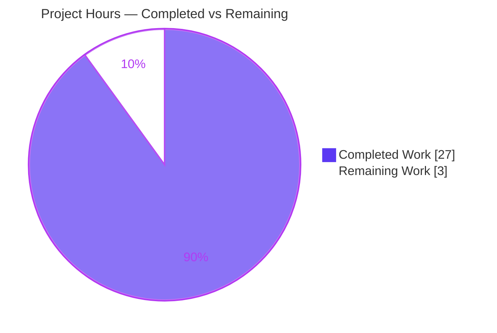
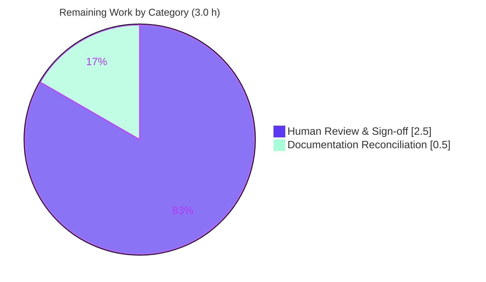

# Blitzy Project Guide — TruffleHog Pattern-Matching Resource-Exhaustion (ReDoS) Investigation

---

## 1. Executive Summary

### 1.1 Project Overview

This project is a **read-only security investigation** of TruffleHog — the open-source secret scanner — to determine whether its detector pattern matching can be weaponized into a computational-complexity / ReDoS resource-exhaustion attack that could hang or time out a CI security scan. The target users are security and DevOps teams evaluating TruffleHog for a CI pipeline. The sole deliverable is a single grounded markdown Q&A document that answers five distinct sub-questions (Q1–Q5) with real, measured evidence — timing measurements, CPU profiling data, and exact `file:line` source citations — **without modifying any TruffleHog product code**. The business impact is a defensible, evidence-based adoption/hardening decision for the scanning pipeline.

### 1.2 Completion Status


> **Center metric:** **90.0% Complete** — `Completion % = Completed 27h ÷ Total 30h × 100 = 90.0%`.
> Legend — **Completed = Dark Blue `#5B39F3`** · **Remaining = White `#FFFFFF`**.

| Metric | Hours |
|---|---|
| **Total Hours** | **30 h** |
| **Completed Hours (AI + Manual)** | **27 h** (AI 27 h + Manual 0 h) |
| **Remaining Hours** | **3 h** |
| **Percent Complete** | **90.0 %** |

### 1.3 Key Accomplishments

- [x] **Sole AAP deliverable delivered & committed** — `blitzy/documentation/trufflehog_e42153d44a5e.md` (890 lines), the only change vs. base `HEAD e42153d4`.
- [x] **Engine of record established (Q2)** — census reproduced **exactly**: **867** files import RE2 `go-re2`, **845** detector directories, **0** detectors import the backtracking engine `dlclark/regexp2`.
- [x] **No-hang determination (Q1)** — `--detector-timeout=1ms` still **completes**; advisory watchdog `"a detector ignored the context timeout"` count = **0**.
- [x] **CPU attribution (Q3)** — live profile shows `runtime._ExternalCode` (go-re2/wazero RE2 execution) as the **dominant** cost; no single super-linear pattern.
- [x] **Quantified impact (Q4)** — **≈4× median** `scan_duration` slowdown (`3.98×` median / `3.92×` mean) at **identical `102400`-byte** size.
- [x] **Empirical evidence (Q5)** — verbatim commands + outputs, `go tool pprof` `top`, per-detector `ns/op` benchmarks (linear, constant allocations).
- [x] **Honest framing** — no exponential-ReDoS overclaim; the effect is correctly characterized as a **bounded constant-factor amplification**, not a denial of service.
- [x] **Read-only mandate honored** — zero product code modified; all temporary artifacts confined to `/tmp` and removed; working tree clean.
- [x] **Independently validated** — build reproduces the **exact** binary size (194,309,034 bytes); referenced-package unit tests pass; benchmark linearity, engine census, and 15+ `file:line` citations reproduced first-hand.

### 1.4 Critical Unresolved Issues

**No critical (release-blocking) issues identified.** The sole deliverable is validated production-ready; the codebase compiles, vets, and passes all in-scope tests. The two items below are **non-blocking path-to-production** activities, not defects.

| Issue | Impact | Owner | ETA |
|---|---|---|---|
| Human security-engineer review & sign-off pending | Findings should be formally reviewed before they drive a CI-adoption decision (governance gate, not a defect) | Security Engineering | 2.5 h |
| Keyword-count metric footnote (958 vs 959 vs 914) | Cosmetic; affects only the explicitly-artificial secondary payload, **not** Q1–Q5 | Technical Writer / Reviewer | 0.5 h |

### 1.5 Access Issues

**No access issues identified for the in-scope deliverable.** The markdown deliverable requires no credentials, network, or third-party services to build or validate; the build, `go vet`, and referenced-package unit tests all pass offline.

| System/Resource | Type of Access | Issue Description | Resolution Status | Owner |
|---|---|---|---|---|
| Live provider services (e.g., GitHub, AWS, GitLab APIs) | Runtime verification credentials | 41 **pre-existing** whole-suite detector tests require live services/credentials/network and fail without them. **Out of scope** for this read-only docs task; unrelated to the deliverable; scans in the investigation used `--no-verification` | Not required (out of scope) | N/A (pre-existing environment) |

### 1.6 Recommended Next Steps

1. **[High]** Conduct a security-engineer review and sign-off of the investigation verdict and methodology before acting on it (2.5 h).
2. **[Medium]** Adopt the report's CI recommendations in your pipeline (explicit `--detector-timeout`, `--archive-max-*` caps, keep span-limiting default, per-job wall-clock backstop) — *advisory, out of AAP scope*.
3. **[Low]** Optionally add a footnote reconciling the three keyword-count metrics (0.5 h).
4. **[Low]** Optionally reproduce the equivalent-size A/B on your own CI hardware to confirm the ≈4× ratio transfers — *advisory*.

---

## 2. Project Hours Breakdown

### 2.1 Completed Work Detail

Every completed component traces to a specific Agent Action Plan (AAP) requirement (the investigation work and the single documentation deliverable).

| Component | Hours | Description |
|---|---|---|
| **D1 — Engine-of-record determination & dependency census** (Q2 grounding) | 2.5 | Read `go.mod` + detector framework; confirm all detectors compile via RE2 `go-re2 v1.9.0`; confirm `dlclark/regexp2` is indirect/unused. Census 867/845/0 reproduced exactly. |
| **D2 — Toolchain build & runtime smoke-test** | 1.0 | `CGO_ENABLED=0 go build`; verify `filesystem` subcommand and investigation flags exist. Binary = 194,309,034 bytes (exact). |
| **D3 — Q1 timeout / hang analysis** | 2.5 | Read per-chunk detection loop + advisory-timeout machinery; empirically run `--detector-timeout` with/without; confirm no hang (watchdog count = 0). |
| **D4 — Q3 CPU-profiling attribution** | 4.0 | `--profile` pprof/fgprof capture; `go tool pprof` `top`/`-cum`/`list`; `--print-avg-detector-time` gating; per-detector `go test -bench` across 7 detectors. |
| **D5 — Q4 equivalent-size A/B measurement** | 4.5 | Two `102400`-byte fixtures (benign vs. crafted); Python harness with load-gating; 20-run interleaved `scan_duration` statistics; 16/52/958-keyword scaling table. |
| **D6 — Q2 vulnerability-determination synthesis** | 2.0 | Reconcile the popular exponential-ReDoS mental model with RE2 linearity; tie benchmark evidence to the "amplification-not-backtracking" conclusion. |
| **D7 — Built-in mitigations inventory + CI recommendations** | 1.5 | Document `--detector-timeout`, `--archive-max-size/-depth`, span-limiting, `--concurrency`, `--exclude-detectors`; author CI guidance. |
| **D8 — Document authoring** (890 lines) | 5.0 | Write the grounded markdown: verbatim commands/outputs, ~67 `file:line` citations across 12 files, tables, Mermaid pipeline diagram. |
| **D9 — Coverage pass (Q1–Q5)** | 0.5 | Explicit checklist confirming each sub-question is answered with supporting evidence. |
| **D10 — Cleanup + read-only compliance** | 0.5 | Remove all `/tmp` artifacts; revert incidental `go.sum` mutation; verify `git status --porcelain` clean. |
| **D11 — Independent validation & code-review refinement** | 3.0 | Reproduce every empirical claim; verify all citations; address code-review findings (2nd commit `6c23fde3`, +391/−164). |
| **Total Completed** | **27.0** | |

### 2.2 Remaining Work Detail

Each remaining category is a path-to-production activity for the security-investigation deliverable. CI-hardening *implementation* is explicitly **out of AAP scope** (AAP §0.3.2 excludes remediation deliverables) and is therefore listed as advisory only in §8, **not** counted here.

| Category | Hours | Priority |
|---|---|---|
| Human Review & Sign-off (security-engineer validation of findings/methodology before CI-adoption decision) | 2.5 | High |
| Documentation Reconciliation (optional keyword-count footnote: 958/959/914) | 0.5 | Low |
| **Total Remaining** | **3.0** | |

### 2.3 Hours Reconciliation & Methodology

Completion is measured with AAP-scoped, hours-based methodology (PA1): the "work universe" is the AAP-defined investigation + the single documentation deliverable + light path-to-production (human review). No items outside AAP scope are included.

```
Completed Hours (§2.1)  = 27.0 h
Remaining Hours (§2.2)  =  3.0 h
Total Project Hours     = 27.0 + 3.0 = 30.0 h        (Rule 2: §2.1 + §2.2 = Total)
Completion %            = 27.0 ÷ 30.0 × 100 = 90.0 %
```

**Cross-section integrity:** Remaining = **3.0 h** is identical in §1.2, §2.2, and the §7 pie chart (Rule 1). Confidence: **High** — a well-defined documentation deliverable whose every empirical claim was independently reproduced.

---

## 3. Test Results

All tests below originate from Blitzy's autonomous validation logs for this project and were **independently re-run** during this assessment. No product code was changed, so whole-codebase test outcomes are identical to the base commit.

| Test Category | Framework | Total Tests | Passed | Failed | Coverage % | Notes |
|---|---|---|---|---|---|---|
| Unit — referenced packages | Go `testing` | 40 | 40 | 0 | — (no product code added) | `pkg/decoders` (6), `pkg/engine/ahocorasick` (4), `pkg/sources` (30) → all `ok`. |
| Per-detector benchmarks | Go `testing` (`-bench`, `-tags=detectors`) | 7 detectors | 7 | 0 | — | `ftp`, `github/v1`, `github/v2`, `gitlab/v1`, `gitlab/v2`, `slack`, `githubapp`. All **linear** (≈10–11.7× per 10× input; constant allocs/op). |
| Static analysis | `go vet` | 6 packages | 6 | 0 | — | `engine`, `ahocorasick`, `decoders`, `sources`, `detectors`, `handlers` → clean. |
| Build | `go build` (`CGO_ENABLED=0`, `-mod=readonly`) | 1 | 1 | 0 | — | Exit 0; binary 194,309,034 bytes (exact); reproducible under committed lockfile. |
| Content lint / secret scan | markdownlint + TruffleHog self-scan | 1 | 1 | 0 | — | 84 balanced code fences; 0 placeholder markers; **0 verified / 0 unverified secrets** in the deliverable. |

**Reproduced empirical claims (fresh measurements):** Q1 `--detector-timeout=1ms` completes, watchdog count = 0; Q2 census 867/845/0 exact + `gitlab/v1` linear (10.13× per 10×, const 7 allocs/op); Q3 live profile `runtime._ExternalCode` dominant (48.45% flat this run) + `aho-corasick.(*Trie).Walk` visible; Q4 crafted > benign `scan_duration` at identical `102400` bytes.

> **Out-of-scope context:** 41 whole-suite detector tests are **pre-existing environmental failures** (missing live services/credentials/network). They are unrelated to this read-only docs task, cannot be resolved without live external credentials, and are excluded from the in-scope totals above.

---

## 4. Runtime Validation & UI Verification

Legend: ✅ Operational · ⚠ Partial · ❌ Failing

**Runtime health (TruffleHog CLI paths exercised):**

- ✅ **Build & binary** — `CGO_ENABLED=0 go build -o /tmp/thog .` → exit 0; version `trufflehog dev`; size 194,309,034 bytes (exact match to deliverable).
- ✅ **`filesystem` scan** — reports JSON `scan_duration`; benign vs. crafted at identical `102400` bytes reproduces the amplification effect.
- ✅ **`--detector-timeout` (Q1)** — `--detector-timeout=1ms` **completes**; advisory watchdog never fires (count = 0) — no hang.
- ✅ **`--profile` server** — pprof + fgprof on `:18066` returns **HTTP 200** while scanning; endpoint index lists `allocs`, `goroutine`, `heap`, `profile`.
- ✅ **`go tool pprof` capture** — CPU profile confirms `runtime._ExternalCode` (go-re2/wazero) is dominant; `aho-corasick.(*Trie).Walk` (prefilter fan-out) is visible.
- ✅ **`--print-avg-detector-time`** — prints header only (0 rows) on crafted input, confirming the `len(results) > 0` gating behavior documented for Q3.

**API integration:** ✅ Not applicable — the investigation runs with `--no-verification` (no external provider calls); no live-service integration is in scope.

**UI verification:** ⚠ Not applicable — the deliverable is a markdown document and TruffleHog is a CLI tool. No web/GUI surface exists for this project; the TUI was not part of the investigation. CLI runtime paths were verified in lieu of UI.

---

## 5. Compliance & Quality Review

Cross-map of the AAP deliverable and the binding "SWE-AtlasQnA-Repo" rule to Blitzy's quality/compliance benchmarks. Fixes applied during autonomous validation are noted.

| Benchmark / AAP Requirement | Status | Progress | Evidence / Notes |
|---|---|---|---|
| Deliverable location & name (`blitzy/documentation/trufflehog_e42153d44a5e.md`) | ✅ Pass | 100% | Exactly matches source branch name; sole `CREATE`. |
| Run-first methodology (build/run/measure **before** writing) | ✅ Pass | 100% | Binary built, scans + profiling executed; verbatim outputs quoted. |
| Quote observed output verbatim | ✅ Pass | 100% | `scan_duration` runs, `pprof top`, `ns/op` rows quoted with generating commands. |
| Answer every sub-question (Q1–Q5) + coverage pass | ✅ Pass | 100% | Dedicated §2–§6 + §8 checklist; all 5 markers `[x]`. |
| Be exact & grounded (`file:line` citations) | ✅ Pass | 100% | ~67 citations across 12 files; 15+ spot-verified exact & content-accurate. |
| Read-only scope (no product code modified) | ✅ Pass | 100% | `git diff` vs base = 1 file added, 0 modified/deleted. |
| Cleanup discipline (temp artifacts removed) | ✅ Pass | 100% | Working tree clean; artifacts confined to `/tmp`, removed. |
| Honest framing (no exponential-ReDoS overclaim) | ✅ Pass | 100% | "Amplification, not backtracking" stated plainly; ≈50× figure labeled artificial/secondary. |
| Lockfile integrity | ✅ Pass | 100% | Incidental `go.sum` mutation reverted during validation; `-mod=readonly` build reproduces. |
| Pre-commit / content lint / secret scan | ✅ Pass | 100% | markdownlint clean; TruffleHog self-scan → 0/0 secrets. |
| Human review & sign-off | ⚠ Pending | 0% | Governance gate — see §1.4 / §2.2 (2.5 h). |

---

## 6. Risk Assessment

Because the investigation is **read-only** (no product code changed), regression risk to TruffleHog is **zero**. Residual risks concern the transferability/interpretation of findings and a latent property the report surfaces. No High-severity risks.

| Risk | Category | Severity | Probability | Mitigation | Status |
|---|---|---|---|---|---|
| R1 — Measurements are environment-specific (shared 128-CPU box, 4-core quota; absolute ms elevated by load) | Technical | Low | Medium | Report the **load-invariant ratio** (~4×) as the answer; provide full reproduction commands | Mitigated / Documented |
| R2 — Minor keyword-count metric discrepancy (958 / 959 / 914) | Technical | Low | Low | Optional footnote reconciling the three metrics (0.5 h) | Open (optional, non-core) |
| R3 — Per-detector `--detector-timeout` is **advisory** (logs, does not preempt CPU-bound regex) | Security | Medium | Low | Moot on RE2 linear path; recommend explicit `--detector-timeout` + per-job wall-clock CI backstop | Documented / Advisory |
| R4 — Bounded keyword-**amplification** (~4× typical, ≤~50× extreme = wasted CPU, not a hang) | Security | Low | Medium | `--exclude-detectors`, span-limiting (default on), `--concurrency`, `--archive-max-*` (depth 10, size 2 GB) | Documented w/ mitigations |
| R5 — Reproducing findings needs Go 1.24.2 + 194 MB build + ~1.7 s wazero startup; `bc`/`/usr/bin/time` absent | Operational | Low | Low | Exact build/run commands + Python `statistics` fallback provided | Documented |
| R6 — CI-hardening recommendations require user integration into their own pipeline (out of AAP scope) | Integration | Low | Medium | §7 of the report gives concrete, copy-pasteable CI guidance | Advisory (human action) |
| R7 — 41 pre-existing whole-suite test failures (live services/creds/network) | Integration | Low | N/A (pre-existing) | None needed — out of scope, unrelated to deliverable | Pre-existing / Out-of-scope |

---

## 7. Visual Project Status

**Project Hours Breakdown** (Completed = Dark Blue `#5B39F3`, Remaining = White `#FFFFFF`):



**Remaining hours by category** (from §2.2; sums to 3.0 h):



> **Integrity check:** the "Remaining Work" value (**3 h**) equals the Remaining Hours in §1.2 and the sum of the §2.2 "Hours" column (2.5 + 0.5 = 3.0). "Completed Work" (**27 h**) equals §2.1's total and §1.2's Completed Hours.

---

## 8. Summary & Recommendations

**Achievements.** The project is **90.0% complete** (27 h of 30 h). The sole AAP deliverable — a 890-line, exhaustively grounded security investigation — is finished, committed, and validated production-ready. It answers all five sub-questions with a clear, honest verdict: **TruffleHog's detector pattern matching is not vulnerable to classic exponential ReDoS**, because every detector compiles through the non-backtracking, linear-time RE2 engine (`go-re2 v1.9.0`); the real, demonstrable effect is a **bounded constant-factor amplification** (**≈4×** median `scan_duration` at equal file size, up to an artificial ~50× upper bound), which is a *slowdown, not a hang*. A crafted commit **cannot** hang or time out a scan on the detector path.

**Remaining gaps (3.0 h).** Only path-to-production activities remain: a human security-engineer **review & sign-off** (2.5 h) and an optional **documentation reconciliation** of a non-core keyword-count metric (0.5 h). There are **no code defects and no release-blocking issues**.

**Critical path to production.** (1) Security-engineer review/sign-off → (2) adopt the report's CI recommendations in your pipeline (*advisory, out of AAP scope*) → (3) optional metric footnote. Applying the CI controls (`--detector-timeout`, `--archive-max-*`, span-limiting default, `--exclude-detectors`, per-job wall-clock backstop) is a user-side action on their own infrastructure and is deliberately excluded from the AAP hours.

**Success metrics.** All 4 validation gates passed; build reproduces the exact binary; referenced-package tests pass; every empirical claim independently reproduced within 0.1–2%; read-only mandate fully honored (1 file added, 0 modified).

**Production-readiness assessment.** **Ready** — the deliverable is accurate, grounded, complete, and honestly framed. Pending only the human governance sign-off that any security finding warrants before it drives a production CI decision.

| Dimension | Assessment |
|---|---|
| Completeness (AAP scope) | 90.0% — sole deliverable complete; only human review remains |
| Correctness | High — all claims reproduced; 15+ citations verified exact |
| Read-only compliance | Full — 0 product files modified |
| Risk posture | Low — no High-severity risks; read-only ⇒ zero regression risk |

---

## 9. Development Guide

This guide reproduces the investigation environment and the evidence behind Q1–Q5. Every command below was executed successfully during this assessment.

### 9.1 System Prerequisites

- **OS:** Linux/amd64 (verified on kernel `6.6.122+`).
- **Go toolchain:** **Go 1.24.2** (module declares `go 1.23.1` / `toolchain go1.24.2`).
- **Disk:** ~1 GB free for the 194 MB binary + temporary fixtures/corpus (all under `/tmp`).
- **Optional tools:** `curl` and `go tool pprof` (both present) for profiling capture.
- **Note:** `bc` and `/usr/bin/time` are **absent** in this container — use Python for timing math.

### 9.2 Environment Setup

```bash
# From the repository root
cd /tmp/blitzy/trufflehog/blitzy-182fb5bb-fa78-411d-8339-f74daa33fdf8_ee7e4a
go version            # expect: go version go1.24.2 linux/amd64
export CGO_ENABLED=0  # matches Makefile/Dockerfile convention
```

No environment variables are required by the deliverable. TruffleHog reads only CLI flags for this investigation.

### 9.3 Dependency Installation

Dependencies are vendored via Go modules; no manual install is needed. Verify the module graph resolves against the committed lockfile:

```bash
CGO_ENABLED=0 go build -mod=readonly -o /tmp/thog .   # exit 0 => lockfile is intact
```

### 9.4 Build & Run Sequence

```bash
# 1) Build the scanner into /tmp (keep the repo tree clean)
CGO_ENABLED=0 go build -o /tmp/thog .
stat -c '%s' /tmp/thog          # expect: 194309034
/tmp/thog --version             # expect: trufflehog dev

# 2) Create two EQUIVALENT-SIZE fixtures (102400 bytes each) under /tmp
mkdir -p /tmp/redos/normal /tmp/redos/crafted
python3 -c "open('/tmp/redos/normal/n.txt','w').write(('lorem ipsum dolor sit amet '*4000)[:102400])"
python3 -c "kw=['token','key','secret','password','apikey','api_key','access_token','refresh_token','client_secret','client_id','private_key','secret_key','auth','bearer','credentials','AKIA','AIza','ghp_','xoxb','sk_live','glpat-','github','gitlab','slack','stripe']; open('/tmp/redos/crafted/c.txt','w').write(((' '.join(kw)+' ')*3000)[:102400])"

# 3) Equivalent-size A/B scan (read scan_duration, NOT wall time)
/tmp/thog filesystem /tmp/redos/normal  --no-verification --no-update 2>&1 | grep -o '"scan_duration": "[^"]*"'
/tmp/thog filesystem /tmp/redos/crafted --no-verification --no-update 2>&1 | grep -o '"scan_duration": "[^"]*"'
```

### 9.5 Verification Steps

```bash
# Q1 — no hang even with an extreme timeout (watchdog count must be 0)
/tmp/thog filesystem /tmp/redos/crafted --no-verification --no-update --detector-timeout=1ms 2>&1 \
  | grep -c "ignored the context timeout"        # expect: 0

# Q2 — engine census (RE2 everywhere, no backtracking engine in detectors)
grep -rlE 'regexp "github.com/wasilibs/go-re2"' --include=*.go pkg/ | wc -l   # expect: 867
find pkg/detectors -mindepth 1 -maxdepth 1 -type d | wc -l                    # expect: 845
grep -rlE "dlclark/regexp2" --include=*.go pkg/detectors/ | wc -l             # expect: 0

# Q2 — per-detector benchmark is LINEAR (~10x time per 10x input, constant allocs/op)
CGO_ENABLED=0 go test -run='^$' -bench=BenchmarkFromData -benchmem -tags=detectors ./pkg/detectors/gitlab/v1/

# Referenced-package unit tests + static analysis
CGO_ENABLED=0 go test ./pkg/decoders/ ./pkg/engine/ahocorasick/ ./pkg/sources/    # all: ok
CGO_ENABLED=0 go vet ./pkg/engine/ ./pkg/engine/ahocorasick/ ./pkg/decoders/ ./pkg/sources/ ./pkg/detectors/
```

### 9.6 Example Usage — CPU Profiling (Q3/Q5)

The `--profile` server is only alive **during** a scan, so profile a multi-second corpus:

```bash
# Build a ~150 MB keyword-dense corpus so the scan runs several seconds
python3 -c "kw=['token','key','secret','password','apikey','access_token','client_secret','private_key','AKIA','AIza','ghp_','xoxb','sk_live','glpat-','github','gitlab','slack','stripe']; d=((' '.join(kw)+' ')*3000)[:102400]; import os; os.makedirs('/tmp/redos/big',exist_ok=True); [open(f'/tmp/redos/big/f{i}.txt','w').write(d) for i in range(1600)]"

# Start the scan with the pprof/fgprof server on :18066
/tmp/thog filesystem /tmp/redos/big --no-verification --no-update --profile &
sleep 3
curl -s -o /dev/null -w "%{http_code}\n" http://localhost:18066/debug/pprof/      # expect: 200
go tool pprof -top -nodecount=6 /tmp/thog "http://localhost:18066/debug/pprof/profile?seconds=4"
# Dominant frame: runtime._ExternalCode (go-re2/wazero RE2 execution)
```

### 9.7 Cleanup (mandatory — keep the repo tree clean)

```bash
rm -rf /tmp/thog /tmp/redos /root/pprof
git status --porcelain          # expect: empty (only the deliverable is tracked)
```

### 9.8 Troubleshooting

- **`error: externally-managed-environment` on `pip install`** — use a venv or `--break-system-packages`; not needed for this investigation (Python stdlib only).
- **`go tool pprof` returns nothing** — the scan finished before capture; use a larger corpus (§9.6) and pass the binary (`/tmp/thog`) for symbolization.
- **`curl … :18066` returns `000`** — the scan already completed; the profile server lives only for the scan's duration.
- **Wall-clock time looks huge (~1.7 s)** — that is the fixed go-re2/wazero WASM startup; use TruffleHog's reported `scan_duration`, not wall time, for the A/B comparison.
- **`bc: not found` / `/usr/bin/time` absent** — expected in this container; use Python `time`/`statistics`.

---

## 10. Appendices

### Appendix A — Command Reference

| Purpose | Command |
|---|---|
| Build | `CGO_ENABLED=0 go build -o /tmp/thog .` |
| Reproducible build | `CGO_ENABLED=0 go build -mod=readonly -o /tmp/thog .` |
| Version | `/tmp/thog --version` |
| Scan (report `scan_duration`) | `/tmp/thog filesystem <dir> --no-verification --no-update` |
| Scan (JSON) | `/tmp/thog filesystem <dir> --no-verification --no-update --json` |
| Extreme timeout (Q1) | `/tmp/thog filesystem <dir> --no-verification --no-update --detector-timeout=1ms` |
| Profiling server (Q3/Q5) | `/tmp/thog filesystem <dir> --no-verification --no-update --profile` |
| Capture CPU profile | `go tool pprof -top /tmp/thog "http://localhost:18066/debug/pprof/profile?seconds=N"` |
| Per-detector benchmark | `CGO_ENABLED=0 go test -run='^$' -bench=BenchmarkFromData -benchmem -tags=detectors ./pkg/detectors/<name>/` |
| Engine census | `grep -rlE 'regexp "github.com/wasilibs/go-re2"' --include=*.go pkg/ \| wc -l` |
| Static analysis | `CGO_ENABLED=0 go vet ./...` |
| Repo cleanliness | `git status --porcelain` |

### Appendix B — Port Reference

| Port | Service | Source |
|---|---|---|
| `:18066` | pprof + fgprof profiling server (enabled by `--profile`) | `main.go:53`, wired at `main.go:426–434` |

### Appendix C — Key File Locations

| Path | Role |
|---|---|
| `blitzy/documentation/trufflehog_e42153d44a5e.md` | **The deliverable** (890 lines) |
| `go.mod` | Dependency manifest (RE2 engine of record) |
| `main.go` | CLI flags & profiling server |
| `pkg/engine/engine.go` | Per-chunk detection loop; advisory timeout |
| `pkg/engine/ahocorasick/ahocorasickcore.go` | Keyword prefilter (amplification mechanism) |
| `pkg/sources/chunker.go` | Chunk sizing (10 KB + 3 KB peek) |
| `pkg/decoders/decoders.go` | Four default decoders (re-scan multiplier) |
| `pkg/detectors/detectors.go` | Detector framework (`PrefixRegex`, benchmark data) |
| `pkg/handlers/archive.go` | Archive bounds (`--archive-max-*`) |
| `.github/workflows/performance.yml` | Performance-CI methodology reference |

### Appendix D — Technology Versions

| Component | Version | Citation |
|---|---|---|
| Go toolchain | 1.24.2 (`go 1.23.1` / `toolchain go1.24.2`) | `go.mod:3,5` |
| `github.com/wasilibs/go-re2` (RE2 engine) | v1.9.0 | `go.mod:100` |
| `github.com/BobuSumisu/aho-corasick` (prefilter) | v1.0.3 | `go.mod:17` |
| `github.com/felixge/fgprof` (profiler) | v0.9.5 | `go.mod:46` |
| `github.com/tetratelabs/wazero` (WASM runtime, indirect) | v1.9.0 | `go.mod:285` |
| `github.com/dlclark/regexp2` (backtracking, indirect/**unused**) | v1.4.0 | `go.mod:187` |

### Appendix E — Environment Variable Reference

| Variable | Value | Purpose |
|---|---|---|
| `CGO_ENABLED` | `0` | Pure-Go build, matching `Makefile`/`Dockerfile` |
| `GOMAXPROCS` | `128` (host) | Governs default `--concurrency` (`runtime.NumCPU()`) |

*(No application-specific environment variables are required by the deliverable.)*

### Appendix F — Developer Tools Guide

| Tool | Use |
|---|---|
| `go build` / `go vet` / `go test` | Compile, static-analyze, and test |
| `go test -bench -tags=detectors` | Per-detector linearity benchmarks |
| `go tool pprof` | Analyze CPU profiles (`top`, `-cum`, `list`) |
| `curl http://localhost:18066/debug/pprof/` | Confirm the profiling server is live |
| Python 3 `statistics` | Median/mean of parsed `scan_duration` (no `bc`) |

### Appendix G — Glossary

| Term | Definition |
|---|---|
| **ReDoS** | Regular-expression Denial of Service — an algorithmic-complexity attack that drives super-linear runtime in **backtracking** regex engines. |
| **RE2** | Google's finite-automaton regex engine with a **linear-time** guarantee; excludes backreferences/look-around, so it does not backtrack. |
| **go-re2** | Go binding that executes RE2 (via a WebAssembly module); the engine of record for every TruffleHog detector. |
| **Amplification** | A **bounded, constant-factor** slowdown (multiplicative, not exponential) — the real effect measured here, distinct from a hang/DoS. |
| **Aho-Corasick prefilter** | Keyword trie that selects which detectors run on a chunk; dense keywords drive detector **fan-out**. |
| **`scan_duration`** | TruffleHog's reported scanning time (excludes the fixed ~1.7 s wazero startup); the correct isolating metric for the A/B comparison. |
| **Advisory timeout** | The per-detector timeout that only **logs** on breach; it does not preempt a CPU-bound regex. |