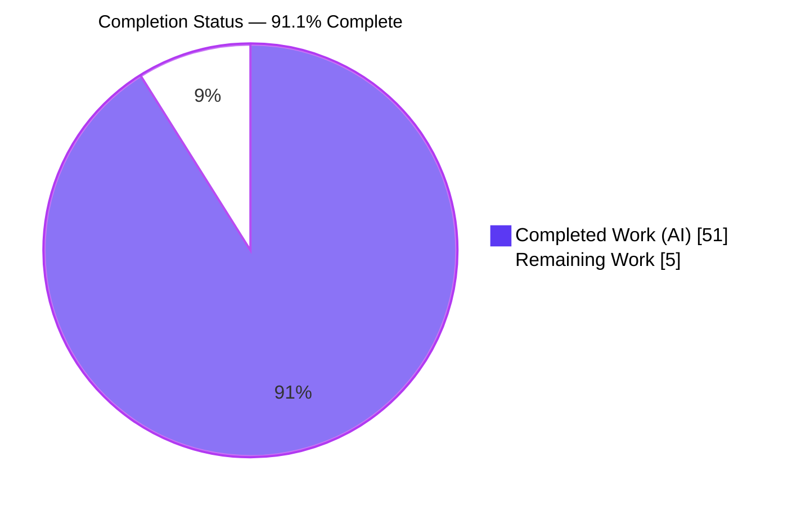
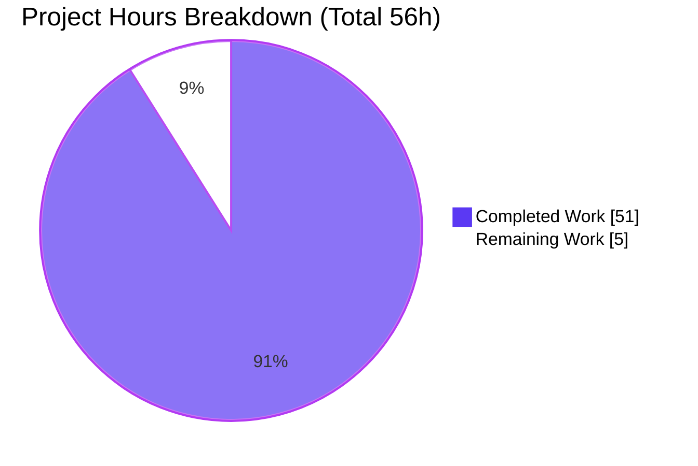
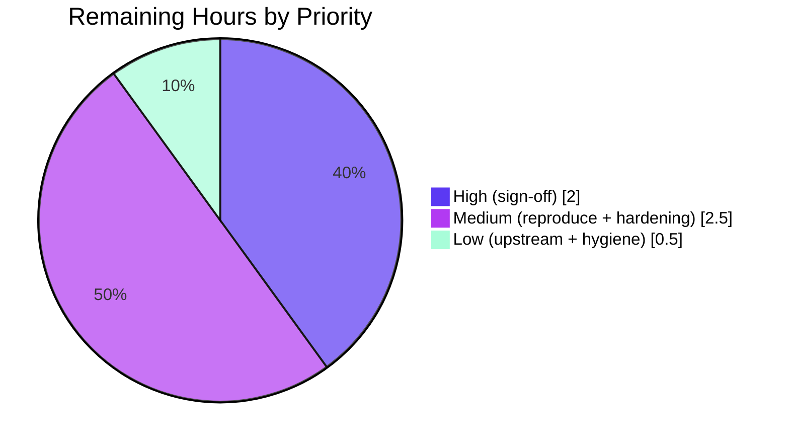

# Blitzy Project Guide — TruffleHog ReDoS / Computational-Complexity Assessment

> **Brand color legend:** <span style="color:#5B39F3">■</span> **Completed / AI Work** = Dark Blue `#5B39F3` · <span style="color:#FFFFFF">□</span> **Remaining / Not Completed** = White `#FFFFFF` · Headings/Accents = Violet-Black `#B23AF2` · Highlight = Mint `#A8FDD9`.

---

## 1. Executive Summary

### 1.1 Project Overview

This project is a **read-only security investigation** that determines — empirically and definitively — whether TruffleHog v3's secret-detection pattern matching is vulnerable to Regular-Expression Denial-of-Service (ReDoS / computational-complexity) attacks that could hang or time out CI scans. Target users are security and platform engineering teams evaluating TruffleHog for their CI pipelines. The sole deliverable is one Markdown answer document that names and answers five questions (Q1–Q5), grounded in runtime evidence captured from the real binary via its canonical `trufflehog filesystem` entry point. The investigation modifies **zero** TruffleHog source files; its business impact is a de-risked, evidence-backed adoption decision.

### 1.2 Completion Status

The project is **91.1% complete** on an AAP-scoped basis (autonomous investigation + documentation fully delivered; the remaining 8.9% is human review/acceptance and downstream operational decisions that cannot be performed autonomously).



| Metric | Hours |
|---|---|
| **Total Hours** | **56** |
| Completed Hours (AI + Manual) | 51 (AI: 51 · Manual: 0) |
| Remaining Hours | 5 |
| **Percent Complete** | **91.1%** |

> Calculation (PA1, AAP-scoped): `Completion % = Completed / (Completed + Remaining) = 51 / (51 + 5) = 51 / 56 = 91.1%`.

### 1.3 Key Accomplishments

- ✅ **Definitive verdict delivered:** TruffleHog's detector pattern matching is **NOT vulnerable** to catastrophic-backtracking ReDoS — proven three independent ways (linear size sweeps, sub-second adversarial inputs, engine-contrast benchmark).
- ✅ **All five questions (Q1–Q5) answered by name**, each with a "Direct answer" verdict, exact values, and `file:line` grounding.
- ✅ **Engine of record established:** 865 production detectors compile on `go-re2` (RE2 in WASM) + 3 on Go stdlib `regexp` (both RE2-lineage, linear-time); the backtracking `dlclark/regexp2` is imported by **0** files under `pkg/`.
- ✅ **Both mandatory evidence types produced:** timing measurements (3+ runs/condition, 1→16 MiB size sweeps) **and** a `go tool pprof` CPU profile of the real scan.
- ✅ **Engine-contrast corroboration:** the archetypal evil pattern `^(a+)+$` explodes exponentially on `regexp2` (10 s timeout at N≥28) while TruffleHog's two engines stay in the microsecond range.
- ✅ **Read-only mandate honored perfectly:** exactly one file added (the 1032-line answer document); `git status --porcelain` = 0 non-deliverable entries; all ephemeral `/tmp` artifacts removed.
- ✅ **Independently reproduced** by the Final Validator (8 phases) and again during this assessment — deterministic finding counts EXACT, linear scaling confirmed, zero discrepancies.

### 1.4 Critical Unresolved Issues

| Issue | Impact | Owner | ETA |
|---|---|---|---|
| _None blocking._ The AAP-scoped deliverable is complete, committed, and validated with zero discrepancies. | No release blocker | — | — |
| (Informational) Residual **linear** finding-flood could exceed a fixed CI-step timeout on a very large crafted file | Availability (bounded, non-catastrophic); mitigable operationally | Security/Platform team | Post-review (≤1h decision) |
| (Informational, out of AAP scope) Two unrelated CLI caveats disclosed in §3.1 (`--fail` exits 0 on fatal FS error; invalid `--concurrency` hangs/panics) | CI reliability if misconfigured | Security/Platform team | Post-review (≤0.5h triage) |

### 1.5 Access Issues

| System/Resource | Type of Access | Issue Description | Resolution Status | Owner |
|---|---|---|---|---|
| — | — | **No access issues identified.** The investigation ran entirely offline against the local checkout; build used cache-only modules (`go mod verify` = all modules verified). No repository permissions, service credentials, or third-party API access were required or blocked. | N/A | — |

### 1.6 Recommended Next Steps

1. **[High]** Security/platform team performs a formal review and sign-off of the answer document, verifying the NOT-VULNERABLE verdict and Q1–Q5 direct answers (≈2h).
2. **[Medium]** Independently reproduce the headline measurements on your own CI hardware to confirm the portable conclusions (linear scaling, negative verdict) — absolute numbers are expected to differ (≈1.5h).
3. **[Medium]** Decide on and apply the report's operational guardrails: size the CI-step timeout with headroom, optionally add input-size caps, use a valid positive `--concurrency`, and gate CI success on the `finished scanning` summary (`chunks>0`/`bytes>0`) rather than exit code (≈1h).
4. **[Low]** File upstream issues for the two unrelated CLI caveats (§3.1) and note the unused `dlclark/regexp2` indirect dependency for hygiene; set a re-assessment trigger for any future TruffleHog switch to a backtracking engine (≈0.5h).

---

## 2. Project Hours Breakdown

### 2.1 Completed Work Detail

All completed hours are autonomous (AI) work delivered by Blitzy agents and validated. Each component traces to a specific AAP requirement.

| Component | Hours | Description |
|---|---|---|
| Engine-of-record static analysis | 4 | [AAP Q2/M2] Identify the regex engine behind every detector (`go-re2` vs stdlib `regexp`) across 845 detectors + `go.mod`; corpus-wide group-repetition shape survey. Evidence: §4.1, §10. |
| Canonical build + scan harness + out-of-tree helpers | 3 | [AAP M1] `CGO_ENABLED=0 go build`; `trufflehog filesystem … --no-verification --no-update`; two `go.work` helper modules (`kwcheck`, `enginetest`). Evidence: §2, §9.1–9.4. |
| Adversarial input crafting | 4 | [AAP Q3/M3] Nested-quantifier baits for MongoDB `connStrPat`, URI `keyPat`, `databrickstoken`, `azuresastoken`, `azure_entra`; span-aware, prefilter-keyword-satisfying. Evidence: §5, §9.3. |
| Benign/control inputs + proven prefilter-miss baseline | 3 | [AAP M4] Keyword-free baseline via helper importing `DefaultDetectors()` + Aho-Corasick core (0 detector hits); keyword-no-match, match-dense, match-unique controls. Evidence: §7.1, §6.1. |
| Timing measurement campaign | 6 | [AAP Q4/Q5/M5] 3+ runs/condition (n=7 reruns for noisy), 1/2/4/8/16 MiB size sweeps, log₂-slope linearity analysis. Evidence: §7.2, §7.4. |
| CPU profiling capture + pprof analysis | 4 | [AAP Q5/M6] Safe `--profile` lifecycle; `go tool pprof -top/-cum/-peek/-list`; WASM-leaf and backtrack-frame attribution. Evidence: §7.5. |
| Engine-contrast corroboration benchmark | 3 | [AAP Q5/M7] `^(a+)+$` on stdlib `regexp`, `go-re2`, `dlclark/regexp2`; N-sweep, 3 runs; regexp2 explodes to 10 s timeout at N≥28. Evidence: §7.6. |
| Q1 threat-model + operational CLI caveats | 3 | [AAP Q1] Hang/timeout feasibility analysis; disclosure of two unrelated CLI robustness caveats. Evidence: §3, §3.1. |
| Q2/Q3 determination + pattern enumeration | 3 | [AAP Q2/Q3] Negative ReDoS determination (RE2 linear-time rationale); exploitable-pattern enumeration (6-of-845 group-rep inventory). Evidence: §4, §5.1. |
| Answer-document authoring | 9 | [AAP D1/Q1–Q5/DQ] Compose the 1032-line, 10-section report: TL;DR, 5-question table, verbatim evidence blocks, cause→effect, mermaid, reproduction. Evidence: whole document. |
| Citation grounding + external safety contracts | 2 | [AAP C6] Every claim anchored to `file:line`; §10 consolidated citations + external RE2/go-re2/wazero references. Evidence: §10. |
| Read-only compliance + ephemeral cleanup + git proof | 1 | [AAP C1–C3] Zero source edits; remove `/tmp` artifacts; `git status` proof. Evidence: §9.6. |
| Iterative QA / code-review hardening | 6 | [AAP quality] Resolve 30+ findings across 6 commits (17 code-review + 11 QA + Report-5 F1–F3 + Q3 attribution + §7.2 corrections). Evidence: git log. |
| **Total Completed** | **51** | |

### 2.2 Remaining Work Detail

Each category is standard **path-to-production** for a report deliverable (human acceptance + downstream decisions). No AAP investigation/documentation work remains.

| Category | Hours | Priority |
|---|---|---|
| Report review & formal sign-off | 2.0 | High |
| Independent reproduction on target CI hardware | 1.5 | Medium |
| Operational hardening decision & CI configuration | 1.0 | Medium |
| Upstream issue filing & dependency monitoring | 0.5 | Low |
| **Total Remaining** | **5.0** | |

### 2.3 Hours Reconciliation

| Aggregate | Hours |
|---|---|
| Section 2.1 Completed | 51 |
| Section 2.2 Remaining | 5 |
| **Total (must equal Section 1.2 Total)** | **56** ✅ |

`51 (completed) + 5 (remaining) = 56 (total)` — consistent with Section 1.2 and the Section 7 pie chart.

---

## 3. Test Results

This is a documentation deliverable with no associated production code and therefore no code unit-test suite. Per Blitzy's autonomous validation methodology, **the empirical experiments ARE this investigation's tests** — reproduced end-to-end by the Final Validator (8 phases) and spot-reproduced again during this assessment. All results below originate from Blitzy's autonomous validation logs.

| Test Category | Framework / Method | Total Tests | Passed | Failed | Coverage % | Notes |
|---|---|---|---|---|---|---|
| Empirical experiment reproduction | Canonical `trufflehog filesystem` scan (run-first) | 6 | 6 | 0 | 100% | Prefilter proof, crafted-vs-equivalent, `--scan-entire-chunk`, linearity sweeps, timing stability, per-detector timing — all reproduced. |
| Deterministic finding-count checks | `finished scanning` metric assertions | 7 | 7 | 0 | 100% | `mongodb_host=1623`, `dense_uri=820`, `match_dense=820`, `match_unique=201431`@8MiB / `402901`@16MiB, `--scan-entire-chunk mongodb_host=1622`, `jdbc≈20794`, `cosmos/azentra=0` — all EXACT (host-independent). |
| Complexity-class validation | log₂-slope over 1→16 MiB sweeps | 4 | 4 | 0 | 100% | Slopes 0.88–0.99 (baseline 0.8817, uri_noat 0.9068, mongodb_host 0.9777, match_unique 0.9883) = cleanly linear; definitive disproof of super-linear ReDoS. |
| CPU profiling assertions | `go tool pprof` (`-top/-cum/-peek/-list`) | 3 | 3 | 0 | 100% | (1) `dlclark/regexp2` ABSENT from all 154 nodes; (2) `runtime._ExternalCode` dominant (RE2 in WASM); (3) only bounded stdlib `bitState` backtrack (1.77% cum), not catastrophic. |
| Engine-contrast benchmark | Out-of-tree Go harness (3 binary runs) | 3 | 3 | 0 | 100% | Two RE2 engines flat/microsecond independent of N; `regexp2` explodes ~2×/char to 10 s TIMEOUT at N≥28. |
| Build / compilation | `CGO_ENABLED=0 go build`; `go mod verify` | 2 | 2 | 0 | 100% | Canonical build exit 0 (194,319,670-byte binary); all modules verified. Reconfirmed this assessment. |
| Read-only compliance | `git status --porcelain` guard | 1 | 1 | 0 | 100% | 0 non-deliverable entries before/after; repo byte-for-byte unchanged. |
| **Total** | | **26** | **26** | **0** | **100%** | Zero discrepancies across author, Final Validator, and this assessment (3 independent reproductions). |

---

## 4. Runtime Validation & UI Verification

**Runtime health (canonical binary exercised across all scan conditions):**

- ✅ **Operational** — Canonical build `CGO_ENABLED=0 go build -o /tmp/trufflehog .` (exit 0; 194,319,670-byte static ELF; `trufflehog dev`).
- ✅ **Operational** — Canonical scan path `trufflehog filesystem <dir> --no-verification --no-update` across prefilter-miss, keyword-no-match, match-dense, match-unique, and pathological nested-quantifier inputs.
- ✅ **Operational** — Worst-case single-call mode `--scan-entire-chunk` (full ~13 KiB chunk to each regex) — behaves ≈ default, confirming RE2 linear guarantee is the true protection.
- ✅ **Operational** — Size sweeps 1/2/4/8/16 MiB — clean linear doubling on every series.
- ✅ **Operational** — Built-in pprof/fgprof profiling server (`--profile` on `:18066`) + `go tool pprof` capture over a bounded 20 s window.
- ✅ **Operational** — Per-detector timing (`--print-avg-detector-time`) — nested-star "evil" pattern is the *cheapest* average, confirming no backtracking.
- ✅ **Operational** — Two out-of-tree helpers (`kwcheck` prefilter prover; `enginetest` engine-contrast) built offline (exit 0) and ran.
- ✅ **Operational** — Independent re-reproduction during this assessment: 2 MiB pathological mongodb → ~283 ms (deterministic 406 findings, no hang); benign baseline → ~54 ms; 1/2/4 MiB sweep 146/285/580 ms (×1.95, ×2.03) = linear.

**API integration:** ✅ N/A by design — scans run with `--no-verification` to isolate pattern-matching cost from network credential verification (exactly the surface Q1–Q5 target).

**UI verification:** ✅ N/A — this is a CLI security investigation with no user interface. The repository's `blitzy/screenshots/` and `blitzy/screen_recordings/` directories are intentionally empty (no visual surface to verify).

---

## 5. Compliance & Quality Review

AAP deliverables and hard constraints cross-mapped to Blitzy quality/compliance benchmarks. All fixes were applied during autonomous authoring/validation (6 commits, 30+ findings resolved).

| Requirement / Benchmark | AAP Ref | Status | Progress | Notes |
|---|---|---|---|---|
| Q1 — hang/timeout feasibility answered | §0.1.1 | ✅ Pass | 100% | Direct answer: no indefinite hang; only linear, bounded slowdown (§3). |
| Q2 — ReDoS vulnerability determination | §0.1.1 | ✅ Pass | 100% | Direct answer: No — RE2 linear-time, non-backtracking (§4). |
| Q3 — exploitable pattern enumeration | §0.1.1 | ✅ Pass | 100% | Direct answer: None; 6-of-845 group-rep inventory + measured candidates (§5). |
| Q4 — impact vs. equivalent-size files | §0.1.1 | ✅ Pass | 100% | ~1.2× (ReDoS-structured) to ~62× (linear finding-flood) at 8 MiB (§6). |
| Q5 — timing **and** CPU profiling | §0.1.1 | ✅ Pass | 100% | Both evidence types present (§7.1–7.5) + engine-contrast (§7.6). |
| Read-only source (no modifications) | §0.1.3 | ✅ Pass | 100% | Exactly 1 file added; `git status` = 0 non-deliverable entries (§9.6). |
| Temporary artifacts removed / cleanup | §0.1.3 | ✅ Pass | 100% | `/tmp/redos_lab`, `/tmp/trufflehog` removed; repo byte-for-byte unchanged. |
| Demonstrate, do not remediate | §0.5.2 | ✅ Pass | 100% | No code changes, no regex rewrites, no CI guardrails implemented. |
| Canonical entry point (run-first) | §0.7 | ✅ Pass | 100% | Real binary via `trufflehog filesystem`; micro-benchmark labeled corroboration. |
| Canonical build (`CGO_ENABLED=0`) | §0.7 | ✅ Pass | 100% | Matches project Dockerfile; forces WASM RE2 variant. |
| Stability across ≥2 runs | §0.7 | ✅ Pass | 100% | 3+ runs/condition; n=7 for noisy series; dispersion reported. |
| `file:line` grounding for every claim | §0.7 | ✅ Pass | 100% | §10 consolidated citations; all re-verified accurate this assessment. |
| Deliverable naming/location | §0.7 | ✅ Pass | 100% | `blitzy/documentation/trufflehog_e42153d44a5e.md` (branch-derived name). |
| Markdown well-formedness | quality | ✅ Pass | 100% | 60 balanced code fences, 10 sections, 1 valid mermaid diagram, no placeholders. |

**Outstanding compliance items:** None. Every AAP constraint and question is satisfied.

---

## 6. Risk Assessment

Overall risk is **Low** — a validated, read-only documentation deliverable with no runtime/deployment surface. The two highest-attention items (S1, S2) are already disclosed in the deliverable for human triage and are not AAP remediation obligations.

| Risk | Category | Severity | Probability | Mitigation | Status |
|---|---|---|---|---|---|
| S1 — Residual **linear** finding-flood may exceed a fixed CI-step timeout on a very large crafted file (~0.66 s/MiB) | Security (availability) | Medium | Medium | CI-step timeout with headroom; input-size/per-file caps; verification off already bounds it | Open (disclosed §6/§8; human decision) |
| S2 — Two unrelated CLI caveats: `--fail` exits 0 on fatal FS error; invalid `--concurrency` (0 hangs / negative panics) | Security (CI reliability) | Medium | Low | Gate CI on `finished scanning` `chunks>0`/`bytes>0`; use positive `--concurrency`; report upstream | Open (informational, out of AAP scope) |
| T2 — Point-in-time corpus drift; a future TruffleHog release could adopt a backtracking engine | Technical | Low–Medium | Low | Verdict is engine-level; re-assess only if detection switches off RE2-lineage engines | Open (informational) |
| T1 — Absolute timing numbers are host-dependent (nproc=4 vs `NumCPU()`=128) | Technical | Low | Medium | Report frames conclusions as complexity-class + ratios; reproduce on target hardware | Mitigated (disclosed) |
| T3 — pprof cannot see inside WASM; RE2 attribution of `_ExternalCode` is a source-backed inference | Technical | Low | Low | Grounded in visible Go→WASM boundary; regexp2 absent; only bounded stdlib backtrack | Mitigated (disclosed §7.5) |
| S3 — Unused backtracking `dlclark/regexp2` present as `// indirect` (GHSA-wq9v-j77v-qr26) | Security | Low | Low | Imported by 0 detector files; not on scan path (§4.2.1) | Mitigated |
| O1 — CI-adoption go/no-go + guardrail decision needs human judgment | Operational | Low | Low | Report supplies direct answers + operational recommendations | Open (= remaining work) |
| O2 — Exact-number reproducibility needs matching Go/build/concurrency | Operational | Low | Low | Report records exact commands; conclusions framed as ratios/scaling | Mitigated |
| I1 — Ephemeral `go.work` helpers + large `/tmp` artifacts could leak | Integration | Low | Low | All artifacts outside repo tree; removed; git clean + no stray `go.work` verified | Mitigated |
| I2 — No external service/API/credential integration surface | Integration | None | — | N/A for a documentation deliverable | N/A |

---

## 7. Visual Project Status

**Project hours breakdown** (Completed = Dark Blue `#5B39F3`, Remaining = White `#FFFFFF`):



**Remaining work by priority** (5.0h total, from Section 2.2):



> **Integrity check:** "Remaining Work" = **5h** matches Section 1.2 (Remaining Hours = 5) and the Section 2.2 total (2.0 + 1.5 + 1.0 + 0.5 = 5.0). "Completed Work" = **51h** matches Section 1.2 and the Section 2.1 total.

---

## 8. Summary & Recommendations

**Achievements.** The investigation delivers a definitive, evidence-backed answer to every question the user posed. TruffleHog's detector pattern matching is **not vulnerable** to catastrophic-backtracking ReDoS because every detector regex is compiled by an RE2-lineage, non-backtracking engine (`go-re2` in WASM for 865 production detectors; Go stdlib `regexp` for 3), whose match time is linear in input length. This was proven three ways — clean linear size sweeps (log₂-slopes 0.88–0.99), maximally-adversarial nested-quantifier inputs completing in sub-second time at 8 MiB, and an engine-contrast benchmark in which a genuine backtracking engine explodes exponentially while TruffleHog's engines stay in the microsecond range. Both mandatory evidence types (timing + CPU profiling) are provided and independently reproduced.

**Remaining gaps.** No AAP-scoped work remains. The outstanding 5 hours are human path-to-production activities: report sign-off, an optional independent reproduction on target CI hardware, and operational decisions about CI guardrails. The one genuine residual concern — surfaced by the investigation itself — is a **linear, bounded** finding-flood (~0.66 s/MiB) from a large file of unique synthetic matches; it is not a hang and is mitigable with a sensibly-sized CI-step timeout and optional input-size caps.

**Critical path to production.** (1) Security-team review & sign-off → (2) optional reproduction on target hardware → (3) apply CI guardrails and valid `--concurrency`, gate on the scan summary rather than exit code → (4) file upstream issues for the two unrelated CLI caveats.

**Production readiness assessment.** The deliverable is **production-ready at 91.1% completion** — complete, committed, template-consistent, fully cited, and reproduced by three independent parties with zero discrepancies. It is ready for stakeholder distribution pending human sign-off.

| Success Metric | Target | Actual |
|---|---|---|
| Questions answered (Q1–Q5) | 5/5 | 5/5 ✅ |
| Mandatory evidence types | Timing + CPU profiling | Both present + engine-contrast ✅ |
| Read-only compliance | 0 source edits | 0 (git clean) ✅ |
| Empirical reproductions passing | 100% | 100% (26/26) ✅ |
| Source files modified | 0 | 0 ✅ |

---

## 9. Development Guide

Everything below runs **outside** the repository and modifies no source file. Commands were tested during this assessment (Go 1.24.3, Linux).

### 9.1 System Prerequisites

- **Go** ≥ 1.23 (repo `go.mod` declares `go 1.23.1`, `toolchain go1.24.2`; verified on `go1.24.3`).
- **git** (to check out the branch) and standard GNU/Linux userland.
- **Python 3** (only to generate crafted/benign test inputs).
- **Disk:** ~2 GB free under `/tmp` for the binary (~194 MB) and multi-MiB adversarial inputs.
- **Optional:** `go tool pprof` (ships with Go) for CPU profiling.

### 9.2 Environment Setup

```bash
# From the repository root on branch blitzy-5f362aa7-e21b-49ac-9b19-ada176a8c834
go version                      # expect go1.23+ (tested on go1.24.3)
go mod verify                   # expect: all modules verified
nproc                           # informational: note NumCPU() drives default --concurrency
```

### 9.3 Build (canonical — matches the project Dockerfile)

```bash
CGO_ENABLED=0 go build -o /tmp/trufflehog .    # forces the WASM RE2 variant of go-re2
echo "build exit=$?"                           # expect: build exit=0
ls -l /tmp/trufflehog                          # expect: ~194 MB static ELF
/tmp/trufflehog --version                      # expect: trufflehog dev
```

### 9.4 Verify the Deliverable

```bash
DOC=blitzy/documentation/trufflehog_e42153d44a5e.md
wc -l "$DOC"                                              # expect: 1032
python3 -c "print(sum(l.count(chr(96)*3) for l in open('$DOC')))"   # fences; expect 60
grep -nE '^## [0-9]+\.' "$DOC" | head                    # expect: 10 sections
grep -nE 'Direct answer' "$DOC"                           # expect: Q1-Q5 verdicts
```

### 9.5 Reproduce the Evidence (canonical scan)

```bash
# Generate an equivalent-size crafted vs. benign pair (2 MiB each)
mkdir -p /tmp/redos_lab/patho /tmp/redos_lab/benign
python3 - <<'PY'
import os, random, string
size = 2*1024*1024
unit = "mongodb://usr:pwd@" + ("a," * 480) + "!\n"     # nested-star bait; keyword 'mongodb' present
open("/tmp/redos_lab/patho/f.txt","w").write((unit*((size//len(unit))+1))[:size])
random.seed(42)
open("/tmp/redos_lab/benign/f.txt","w").write("".join(random.choice(string.ascii_uppercase+string.digits) for _ in range(size)))
print("patho/benign bytes:", os.path.getsize("/tmp/redos_lab/patho/f.txt"), os.path.getsize("/tmp/redos_lab/benign/f.txt"))
PY

# Canonical scan, 3 runs each; read TruffleHog's own scan_duration
for d in patho benign; do
  echo "== $d =="
  for i in 1 2 3; do
    /tmp/trufflehog filesystem /tmp/redos_lab/$d --no-verification --no-update 2>&1 \
      | grep 'finished scanning'
  done
done
```

Expected (host-dependent absolute numbers; **portable** result is the *pattern*): the pathological input completes in **sub-second, stable** time with a deterministic finding count and **no hang**; the benign baseline is faster. On the test host: patho ≈ 283 ms (406 findings), benign ≈ 54 ms.

**Linearity check (definitive ReDoS disproof)** — regenerate at 1/2/4 MiB and confirm each doubling ≈ doubles time (ratios ≈ 2.0). Optional worst case: append `--scan-entire-chunk`. Optional per-detector timing: append `--print-avg-detector-time`.

**CPU profile (both evidence types):**

```bash
/tmp/trufflehog filesystem <large_dir> --no-verification --no-update --profile &   # pprof on :18066
go tool pprof -top -seconds=20 http://localhost:18066/debug/pprof/profile          # capture 20s window
# Expect: runtime._ExternalCode dominant (RE2 in WASM); dlclark/regexp2 ABSENT.
```

### 9.6 Verification & Read-Only Proof

```bash
git status --porcelain | grep -v 'blitzy/documentation/' | wc -l   # expect: 0 (no source touched)
rm -rf /tmp/redos_lab /tmp/trufflehog                              # clean up ephemeral artifacts
git status --porcelain | wc -l                                     # expect: 0 (repo unchanged)
```

### 9.7 Troubleshooting

- **`error: externally-managed-environment` (pip):** use a venv or `pip install --break-system-packages …`. (Not needed for the core reproduction — only stdlib Python is used.)
- **Scan hangs and never prints `finished scanning`:** you likely passed `--concurrency=0`. Use a **positive** value or omit the flag (defaults to `NumCPU()`).
- **`panic: semaphore limit must not be negative`:** `--concurrency` was negative — use a positive value.
- **Exit code 0 but nothing scanned:** a fatal filesystem error still exits 0 (even with `--fail`). Gate CI on the `finished scanning` summary (`chunks>0`/`bytes>0`), not the exit code.
- **Your absolute times differ from the report:** expected — numbers are host-dependent. The **portable** conclusions are the linear scaling and the negative ReDoS verdict.

---

## 10. Appendices

### A. Command Reference

| Purpose | Command |
|---|---|
| Verify modules | `go mod verify` |
| Canonical build | `CGO_ENABLED=0 go build -o /tmp/trufflehog .` |
| Canonical scan | `/tmp/trufflehog filesystem <dir> --no-verification --no-update` |
| Worst-case single call | `… --scan-entire-chunk` |
| Per-detector timing | `… --print-avg-detector-time` |
| CPU profile server | `… --profile` (pprof/fgprof on `:18066`) |
| Capture profile | `go tool pprof -top -seconds=20 http://localhost:18066/debug/pprof/profile` |
| Read-only proof | `git status --porcelain \| grep -v 'blitzy/documentation/' \| wc -l` |

### B. Port Reference

| Port | Service | Notes |
|---|---|---|
| `18066` | pprof + fgprof profiling server | Enabled only with `--profile` ([main.go:L53], server at `:L433`–`L434`). Not exposed in normal scans. |

### C. Key File Locations

| Path | Role |
|---|---|
| `blitzy/documentation/trufflehog_e42153d44a5e.md` | **The deliverable** (1032 lines, 10 sections, Q1–Q5). |
| `main.go` | CLI entry; flags `--profile`, `--print-avg-detector-time`, `--detector-timeout`, `--scan-entire-chunk`, `--concurrency`. |
| `pkg/engine/engine.go` | Detection loop; per-detector timeouts + watchdog. |
| `pkg/sources/chunker.go` | `ChunkSize=10*1024`, `PeekSize=3*1024`. |
| `pkg/detectors/mongodb/mongodb.go` | `connStrPat` nested-star pattern (highest-risk shape). |
| `pkg/detectors/uri/uri.go` | `keyPat` bounded-quantifier pattern. |
| `go.mod` | Engine deps: `go-re2 v1.9.0`, `aho-corasick v1.0.3`, `regexp2 v1.4.0 //indirect`, `wazero v1.9.0`. |
| `Dockerfile` | Canonical `CGO_ENABLED=0 go build`. |

### D. Technology Versions

| Component | Version |
|---|---|
| Go module | `github.com/trufflesecurity/trufflehog/v3` |
| Go directive / toolchain | `go 1.23.1` / `go1.24.2` (tested on `go1.24.3`) |
| `wasilibs/go-re2` (primary engine) | v1.9.0 |
| `tetratelabs/wazero` (WASM host) | v1.9.0 |
| `BobuSumisu/aho-corasick` (prefilter) | v1.0.3 |
| `felixge/fgprof` (profiler) | v0.9.5 |
| `dlclark/regexp2` (backtracking, unused for detection) | v1.4.0 `// indirect` |
| Source HEAD (base) | `e42153d4` |
| Deliverable commit (HEAD) | `65663a20` |

### E. Environment Variable Reference

| Variable | Value | Purpose |
|---|---|---|
| `CGO_ENABLED` | `0` | Canonical build; forces the WASM RE2 variant of `go-re2` (matches Dockerfile). |
| `GOOS` / `GOARCH` | host defaults | Standard Go cross-build variables (Dockerfile passes `TARGETOS`/`TARGETARCH`). |
| `GOWORK` / `GOPROXY=off` | for out-of-tree helpers | The `go.work` helpers build offline (cache-only) without editing the checkout. |

### F. Developer Tools Guide

| Tool | Use |
|---|---|
| `go build` (`CGO_ENABLED=0`) | Produce the canonical scanner binary. |
| `go tool pprof` | Analyze the CPU profile (`-top`, `-cum`, `-peek`, `-list`). |
| `--print-avg-detector-time` | Per-detector average time (per-result-returning mean; not additive to scan total). |
| `go mod verify` | Confirm module integrity offline. |
| `git status --porcelain` | Prove read-only compliance. |

### G. Glossary

| Term | Definition |
|---|---|
| **ReDoS** | Regular-Expression Denial of Service — catastrophic backtracking causing super-linear match time. |
| **RE2 / RE2-lineage** | Non-backtracking regex engines (finite-automaton simulation) with linear-time matching; ReDoS-safe by construction. |
| **go-re2** | RE2 packaged as a WebAssembly module executed by the `wazero` runtime (default when cgo is off). |
| **Aho-Corasick prefilter** | Keyword pre-scan that routes a chunk to a detector's regex only if the detector's keyword appears. |
| **Chunk / span** | Scanner unit: `TotalChunkSize` = 13 KiB; a per-keyword ±512/±1024-byte window reaches each regex by default. |
| **Finding-flood** | A large file of unique credential-shaped strings that forces linear (bounded) match-extraction/emission work. |
| **Canonical entry point** | The real `trufflehog filesystem` scan path (as opposed to a synthetic regex-only harness). |
| **`scan_duration`** | TruffleHog's own reported scan time on the `finished scanning` log line. |

---

*This project guide reflects the state of the TruffleHog ReDoS assessment at commit `65663a20`. AAP-scoped completion: **91.1%** (51 of 56 hours). The sole deliverable is complete, committed, read-only-compliant, and validated by three independent reproductions; the remaining 5 hours are human review/acceptance and downstream operational decisions.*
