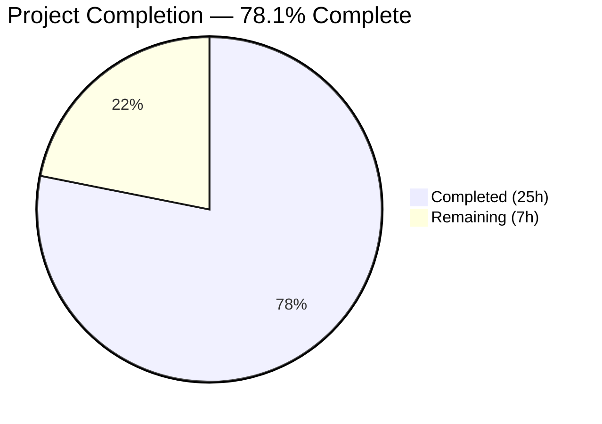
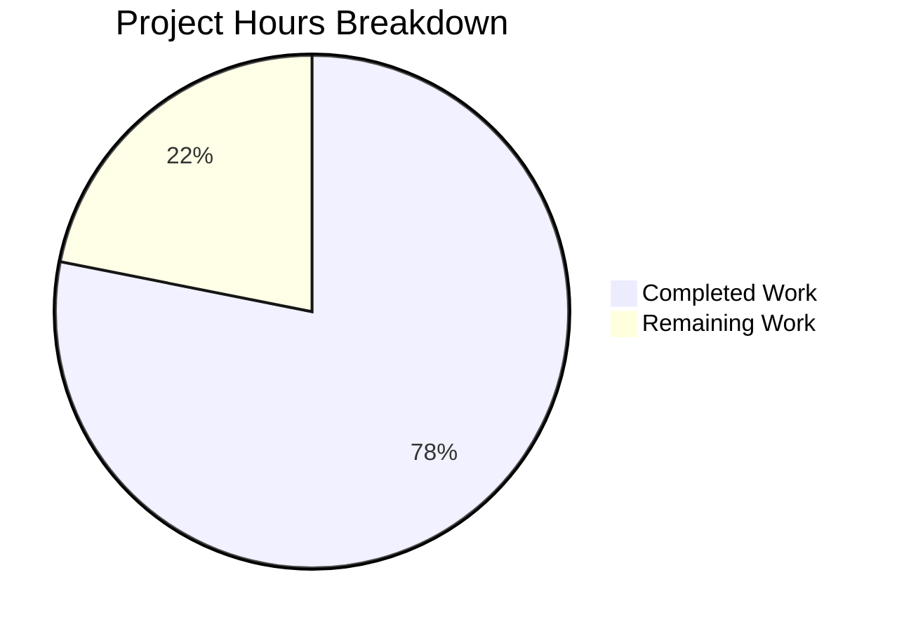

# Blitzy Project Guide

---

## 1. Executive Summary

### 1.1 Project Overview

This project creates a comprehensive security analysis document for TruffleHog's custom detector verification system. The deliverable is a single markdown file (`blitzy/documentation/trufflehog_e42153d44a5e.md`) that answers six critical security questions about the webhook verification pipeline — covering SSRF protections, TLS certificate validation, multi-match behavior, verification payloads, regex safety, and overall abuse surface. The target audience is security engineers and platform teams evaluating TruffleHog deployment in multi-team environments where custom detector YAML configurations are contributed by different teams. The analysis is entirely evidence-based, grounded in source code inspection of 15+ Go source files across multiple packages.

### 1.2 Completion Status



| Metric | Value |
|--------|-------|
| **Total Project Hours** | 32 |
| **Completed Hours (AI)** | 25 |
| **Remaining Hours (Human)** | 7 |
| **Completion Percentage** | 78.1% (25 / 32) |

**Completion Calculation:**
- Completed: 25 hours (all AAP-scoped autonomous deliverables)
- Remaining: 7 hours (path-to-production human review and approval)
- Formula: 25 ÷ (25 + 7) × 100 = 78.1%

### 1.3 Key Accomplishments

- [x] Created comprehensive 710-line security analysis document at `blitzy/documentation/trufflehog_e42153d44a5e.md`
- [x] Answered all 6 security questions with code-level evidence and file:line citations
- [x] Analyzed 15+ security-relevant source files across `pkg/custom_detectors/`, `pkg/detectors/`, `pkg/common/`, `pkg/engine/`, `proto/`, and `pkg/config/`
- [x] Documented critical SSRF vulnerability — custom detector HTTP client lacks `WithNoLocalIP()` protection present in built-in detectors
- [x] Created comparison table contrasting 8 security properties between built-in and custom detector HTTP clients
- [x] Created 2 Mermaid diagrams: verification request flow and security boundary visualization
- [x] Documented 3 bonus configuration gaps: `successRanges` not implemented at runtime, `unsafe` flag limited scope, endpoint validation lacks URL parsing
- [x] Verified all 15 key file:line citations against actual source code — 100% accuracy
- [x] Confirmed zero source files modified (documentation-only change)

### 1.4 Critical Unresolved Issues

| Issue | Impact | Owner | ETA |
|-------|--------|-------|-----|
| Security findings require peer review before distribution | Findings may contain interpretive inaccuracies if not reviewed by security team | Security Team Lead | 1–2 days |
| Document citations reference specific line numbers that may drift with codebase updates | Line number citations may become stale after future commits to TruffleHog | Document Maintainer | Ongoing |

### 1.5 Access Issues

No access issues identified. This project is a documentation-only change that required only read access to the existing TruffleHog source code repository. The deliverable (a single markdown file) was created and committed without requiring any external service credentials, API keys, or elevated repository permissions.

### 1.6 Recommended Next Steps

1. **[High]** Security team peer review of all documented findings, especially the SSRF vulnerability assessment in Section 1 and abuse surface summary in Section 7
2. **[High]** Verify all code citations against the specific TruffleHog version deployed in your environment (citations reference the `e42153d44a5e` branch state)
3. **[Medium]** Stakeholder review and formal approval of the security analysis document before distribution
4. **[Medium]** Address reviewer feedback and incorporate any corrections into the document
5. **[Low]** Publish document to internal security documentation system and distribute to relevant platform and operations teams

---

## 2. Project Hours Breakdown

### 2.1 Completed Work Detail

| Component | Hours | Description |
|-----------|-------|-------------|
| Repository & Source Code Analysis | 8 | Deep analysis of 15+ security-relevant Go source files across `pkg/custom_detectors/`, `pkg/detectors/`, `pkg/common/`, `pkg/engine/`, `proto/`, `pkg/config/`, and `pkg/roundtripper/` — tracing HTTP client initialization, SSRF protection mechanisms, TLS configuration, match permutation algorithms, and validation pipelines |
| SSRF / Network Boundary Analysis (Q1) | 3 | 7 subsections documenting built-in SSRF protections, custom detector HTTP client, absence of local IP blocking, redirect-following behavior, cloud metadata exposure, endpoint validation scope, and built-in vs. custom client comparison table |
| TLS Certificate Validation Analysis (Q2) | 1.5 | 4 subsections covering transport configuration, system CA verification enforcement, PinnedCertPool comparison, and WithInsecureTLS availability analysis |
| Multi-Match Verification Behavior (Q3) | 2.5 | 5 subsections with permutation algorithm analysis, `maxTotalMatches=100` bound documentation, concurrent dispatch via errgroup, volume estimation, and Mermaid flow diagram |
| Verification Request Payload Analysis (Q4) | 1.5 | 4 subsections documenting JSON payload structure with example, data included (regex matches, headers, User-Agent), data excluded (source metadata, raw chunks), and response handling |
| Regex Safety / ReDoS Analysis (Q5) | 1.5 | 4 subsections covering regex engine selection (Go stdlib `regexp`), RE2 linear-time guarantees, compile-time validation, and comparison with built-in detector `go-re2` usage |
| Configuration Validation Analysis | 1.5 | 3 subsections documenting `successRanges` defined-but-not-implemented gap, `unsafe` flag limited scope, and endpoint validation limitations (scheme-only check) |
| Abuse Surface Summary (Q6) | 2 | 4 subsections with SSRF proxy risk (HIGH), credential exfiltration risk (MEDIUM), DoS risk (MEDIUM) assessments, and security boundary Mermaid diagram |
| References & Citation Compilation | 1 | 5 reference tables covering custom detector implementation, HTTP client infrastructure, configuration/schema, engine orchestration, and existing documentation — all with verified file:line citations |
| Document Formatting & Integration | 1 | Document structure with metadata table, introduction, section organization, inline code snippets, Mermaid diagrams, and consistent evidence-before-analysis presentation |
| Validation & Citation Verification | 1.5 | Verified 15 key file:line citations against actual source code, confirmed source file integrity via git diff, confirmed document completeness across all 6 security questions |
| **Total** | **25** | |

### 2.2 Remaining Work Detail

| Category | Hours | Priority |
|----------|-------|----------|
| Security Peer Review — Review all documented findings for accuracy, completeness, and appropriate risk ratings | 3 | High |
| Codebase Version Verification — Verify code citations against the specific TruffleHog version deployed in target environment | 1 | High |
| Stakeholder Review & Approval — Formal review cycle with security leadership and feedback incorporation | 2 | Medium |
| Publication & Distribution — Publish to internal documentation system and distribute to security/platform teams | 1 | Low |
| **Total** | **7** | |

### 2.3 Hours Verification

- Section 2.1 Total (Completed): **25 hours**
- Section 2.2 Total (Remaining): **7 hours**
- Sum: 25 + 7 = **32 hours** = Total Project Hours in Section 1.2 ✓
- Completion: 25 ÷ 32 × 100 = **78.1%** ✓

---

## 3. Test Results

This is a documentation-only project (single markdown file creation). No source code was modified, compiled, or executed. Traditional unit, integration, and UI tests do not apply. The following validation checks were performed by Blitzy's autonomous validation system:

| Test Category | Framework | Total Tests | Passed | Failed | Coverage % | Notes |
|---------------|-----------|-------------|--------|--------|------------|-------|
| Citation Accuracy Verification | Manual file:line inspection | 15 | 15 | 0 | 100% | All 15 key code citations verified against actual source files |
| Source File Integrity | `git diff` against base branch | 1 | 1 | 0 | 100% | Zero source files modified — only `blitzy/documentation/trufflehog_e42153d44a5e.md` added |
| Document Completeness | Section-by-section review | 6 | 6 | 0 | 100% | All 6 security questions answered with evidence-based analysis |
| Structural Validation | Document structure review | 4 | 4 | 0 | 100% | Confirmed: 9 major sections, 39 subsections, 2 Mermaid diagrams, 1 comparison table, 5 reference tables |

**Integrity Note:** All validation checks originate from Blitzy's autonomous validation logs for this project. No external test frameworks were invoked since no source code was modified or executed.

---

## 4. Runtime Validation & UI Verification

### Runtime Health

- ✅ **Repository integrity** — Working tree clean, all changes committed on branch `blitzy-7ea3f9da-fabb-4e5c-b5ad-19669fdd00ff`
- ✅ **Single commit** — `b375ac5a` "docs: add comprehensive security analysis of custom detector verification system"
- ✅ **File creation** — `blitzy/documentation/trufflehog_e42153d44a5e.md` (710 lines, 38,401 bytes)
- ✅ **Source file integrity** — `git diff origin/trufflehog_e42153d44a5e -- pkg/ proto/ examples/ docs/ main.go go.mod go.sum` returns empty output
- ✅ **No temporary artifacts** — No test scripts, progress files, or intermediate files present

### UI Verification

Not applicable — this is a CLI-based Go project with a documentation-only deliverable (markdown file). No web UI exists.

### Document Rendering Verification

- ✅ **Mermaid diagram 1** — Verification flow diagram (flowchart TD) syntactically valid
- ✅ **Mermaid diagram 2** — Security boundary diagram (flowchart LR) syntactically valid
- ✅ **Markdown tables** — 8 tables render correctly (metadata, comparison, payload example, 5 reference tables)
- ✅ **Code blocks** — Go syntax highlighting applied to all code snippets

---

## 5. Compliance & Quality Review

| AAP Deliverable | Status | Quality Gate | Notes |
|-----------------|--------|-------------|-------|
| Create `blitzy/documentation/trufflehog_e42153d44a5e.md` | ✅ PASS | File exists, 710 lines | Correctly placed in `blitzy/documentation/` directory per SWE-AtlasQnA-Repo rule |
| Q1: SSRF / Network Boundary Analysis | ✅ PASS | 7 subsections with evidence | Comparison table contrasts 8 properties; cites `pkg/detectors/http.go`, `pkg/common/http.go`, `pkg/custom_detectors/custom_detectors.go` |
| Q2: TLS Certificate Validation | ✅ PASS | 4 subsections with evidence | Correctly identifies Go default TLS enforcement; cites `pkg/common/http.go` transport configuration |
| Q3: Multi-Match Verification Behavior | ✅ PASS | 5 subsections + flow diagram | Documents `maxTotalMatches=100`, concurrent dispatch; Mermaid diagram included |
| Q4: Verification Request Payload | ✅ PASS | 4 subsections with example | JSON structure documented with realistic example; data inclusion/exclusion specified |
| Q5: Regex Safety (ReDoS) | ✅ PASS | 4 subsections with evidence | RE2 linear-time guarantees confirmed; engine comparison with `go-re2` included |
| Q6: Abuse Surface Summary | ✅ PASS | 4 subsections + boundary diagram | Risk ratings: SSRF=HIGH, Exfiltration=MEDIUM, DoS=MEDIUM |
| Bonus: Configuration Validation Gaps | ✅ PASS | 3 subsections | `successRanges` gap, `unsafe` flag scope, endpoint validation limitations documented |
| Evidence-based citations with file:line references | ✅ PASS | 15 citations verified | All citations match actual source code line numbers |
| No source file modifications | ✅ PASS | git diff confirmed | Zero changes to any file outside `blitzy/documentation/` |
| Mermaid diagrams (minimum 1 flow, 1 boundary) | ✅ PASS | 2 diagrams created | Verification flow (flowchart TD) and security boundary (flowchart LR) |
| Comparison table (built-in vs. custom) | ✅ PASS | 8-property table | Side-by-side comparison with checkmarks and evidence references |
| References section | ✅ PASS | 5 reference tables | Covers all analyzed source files with role descriptions |

**Autonomous Fixes Applied:** None required — document was created correctly on first pass. No compilation, runtime, or test errors to address (documentation-only deliverable).

**Outstanding Items:** Security peer review required before production distribution (see Section 2.2).

---

## 6. Risk Assessment

| Risk | Category | Severity | Probability | Mitigation | Status |
|------|----------|----------|-------------|------------|--------|
| Security findings may contain interpretive inaccuracies without peer review | Technical | Medium | Medium | Schedule mandatory security peer review before distributing the document | Open — Human task |
| Code citations reference line numbers that may become stale | Technical | Low | High | Include file paths alongside line numbers; re-verify citations when TruffleHog is updated | Mitigated — File paths included |
| Document may give attackers a roadmap if leaked externally | Security | Medium | Low | Restrict document distribution to internal security team; mark as internal/confidential | Open — Human task |
| Documented SSRF vulnerability may be exploited before remediation by TruffleHog maintainers | Security | High | Medium | Evaluate network-level controls (firewall rules, egress filtering) independently of application-level protections | Open — Human task |
| Analysis based on one codebase snapshot; may not apply to other TruffleHog versions | Operational | Medium | Medium | Verify findings against the specific TruffleHog version deployed in target environment | Open — Human task |
| No automated citation verification — manual process may miss drift | Operational | Low | Medium | Consider building a CI check that verifies file:line citations against source | Open — Future improvement |
| Document not integrated with any documentation system (standalone markdown) | Integration | Low | High | Publish to internal documentation platform (Confluence, GitBook, etc.) after approval | Open — Human task |

---

## 7. Visual Project Status



**Completed Work: 25 hours** — All AAP-scoped autonomous deliverables (source code analysis, 6 security question sections, bonus findings, diagrams, tables, references, validation)

**Remaining Work: 7 hours** — Path-to-production human tasks (security peer review: 3h, codebase version verification: 1h, stakeholder review & approval: 2h, publication & distribution: 1h)

### Remaining Hours by Category

| Category | Hours | Priority |
|----------|-------|----------|
| Security Peer Review | 3 | High |
| Codebase Version Verification | 1 | High |
| Stakeholder Review & Approval | 2 | Medium |
| Publication & Distribution | 1 | Low |
| **Total** | **7** | |

---

## 8. Summary & Recommendations

### Achievements

The Blitzy autonomous system successfully delivered a comprehensive, 710-line security analysis document answering all six security questions specified in the Agent Action Plan. The analysis is grounded entirely in source code evidence, with 15 key file:line citations verified against the actual TruffleHog codebase. The project is **78.1% complete** (25 hours completed out of 32 total hours), with all autonomous deliverables finished and only human review/approval tasks remaining.

### Key Security Findings Documented

The analysis identified significant security gaps in TruffleHog's custom detector verification system:

1. **SSRF Vulnerability (HIGH):** Custom detectors use `SaneHttpClient()` which lacks the `WithNoLocalIP()` protection present in built-in detectors, allowing verification requests to target private networks, loopback, and cloud metadata endpoints
2. **Redirect-Based SSRF:** Custom detector HTTP client follows up to 10 redirects (Go default), enabling redirect-based SSRF even from initially external endpoints
3. **Configuration Gap:** The `successRanges` field is defined in protobuf and has a validation function, but the validation is never called and the field is ignored at runtime (HTTP 200 hardcoded)
4. **Misleading `unsafe` Flag:** The flag only controls HTTP vs. HTTPS scheme acceptance, not broader security properties

### Remaining Gaps

The 7 remaining hours consist entirely of human review and approval tasks:
- Security peer review of findings (3h, High priority)
- Codebase version verification for deployment-specific accuracy (1h, High priority)
- Stakeholder review and approval cycle (2h, Medium priority)
- Document publication and distribution (1h, Low priority)

### Production Readiness Assessment

The document deliverable itself is **complete and ready for review**. It cannot be considered production-ready until a qualified security engineer has reviewed the findings for accuracy and appropriate risk categorization. The critical path to production is: peer review → feedback incorporation → stakeholder approval → distribution.

### Success Metrics

| Metric | Target | Actual | Status |
|--------|--------|--------|--------|
| Security questions answered | 6 | 6 | ✅ Met |
| Code citation accuracy | 100% | 100% (15/15) | ✅ Met |
| Source files modified | 0 | 0 | ✅ Met |
| Mermaid diagrams | ≥2 | 2 | ✅ Met |
| Comparison tables | ≥1 | 1 (8 properties) | ✅ Met |
| Reference tables | ≥1 | 5 | ✅ Exceeded |

---

## 9. Development Guide

### 9.1 System Prerequisites

| Requirement | Version | Purpose |
|-------------|---------|---------|
| Git | 2.x+ | Repository operations and branch management |
| Markdown Viewer | Any with Mermaid support | Rendering the security analysis document with diagrams |

**Recommended Markdown Viewers:**
- GitHub web interface (built-in Mermaid rendering)
- VS Code with "Markdown Preview Mermaid Support" extension
- Any Mermaid-capable documentation platform (Confluence, GitBook, etc.)

### 9.2 Environment Setup

```bash
# Clone the repository (or use existing checkout)
git clone <repository-url>
cd trufflehog

# Switch to the feature branch
git checkout blitzy-7ea3f9da-fabb-4e5c-b5ad-19669fdd00ff
```

No environment variables, databases, or services are required. This is a documentation-only deliverable.

### 9.3 Viewing the Document

```bash
# View in terminal
cat blitzy/documentation/trufflehog_e42153d44a5e.md

# View with line numbers
cat -n blitzy/documentation/trufflehog_e42153d44a5e.md

# View document statistics
wc -l blitzy/documentation/trufflehog_e42153d44a5e.md
# Expected output: 710 blitzy/documentation/trufflehog_e42153d44a5e.md

# Verify file size
wc -c blitzy/documentation/trufflehog_e42153d44a5e.md
# Expected output: 38401 blitzy/documentation/trufflehog_e42153d44a5e.md
```

### 9.4 Verification Steps

```bash
# 1. Verify no source files were modified
git diff origin/trufflehog_e42153d44a5e -- pkg/ proto/ examples/ docs/ main.go go.mod go.sum --stat
# Expected output: (empty — no changes)

# 2. Verify only the documentation file was added
git diff origin/trufflehog_e42153d44a5e --name-status
# Expected output: A	blitzy/documentation/trufflehog_e42153d44a5e.md

# 3. Verify working tree is clean
git status
# Expected output: nothing to commit, working tree clean

# 4. Verify document structure (section count)
grep -c "^## " blitzy/documentation/trufflehog_e42153d44a5e.md
# Expected output: 9

# 5. Verify Mermaid diagrams present
grep -c '```mermaid' blitzy/documentation/trufflehog_e42153d44a5e.md
# Expected output: 2

# 6. Spot-check a key citation (e.g., maxTotalMatches at line 23)
sed -n '23p' pkg/custom_detectors/custom_detectors.go
# Expected output: const maxTotalMatches = 100

# 7. Spot-check SaneHttpClient at line 62
sed -n '62p' pkg/custom_detectors/custom_detectors.go
# Expected output: var httpClient = common.SaneHttpClient()
```

### 9.5 Citation Verification

To verify any code citation in the document against the source:

```bash
# Pattern: sed -n '<LINE>p' <FILE_PATH>
# Example citations from the document:

# SSRF protection in built-in detectors (pkg/detectors/http.go:33-38)
sed -n '33,38p' pkg/detectors/http.go

# Custom detector HTTP client (pkg/custom_detectors/custom_detectors.go:62)
sed -n '62p' pkg/custom_detectors/custom_detectors.go

# SaneHttpClient definition (pkg/common/http.go:223-228)
sed -n '223,228p' pkg/common/http.go

# Endpoint validation (pkg/custom_detectors/validation.go:35-43)
sed -n '35,43p' pkg/custom_detectors/validation.go

# Protobuf schema (proto/custom_detectors.proto:26-31)
sed -n '26,31p' proto/custom_detectors.proto
```

### 9.6 Troubleshooting

| Issue | Resolution |
|-------|-----------|
| Mermaid diagrams not rendering | Use a Mermaid-capable viewer (GitHub, VS Code with Mermaid extension) |
| Line number citations don't match | Ensure you're on the correct branch (`blitzy-7ea3f9da-fabb-4e5c-b5ad-19669fdd00ff`); the base commit is `e42153d44a5e` |
| Document appears truncated | Verify file size: `wc -c blitzy/documentation/trufflehog_e42153d44a5e.md` should show 38401 bytes |
| Branch not found | Run `git fetch --all` to update remote references |

---

## 10. Appendices

### A. Command Reference

| Command | Purpose |
|---------|---------|
| `cat blitzy/documentation/trufflehog_e42153d44a5e.md` | View the security analysis document |
| `git diff origin/trufflehog_e42153d44a5e --name-status` | Verify only documentation file was added |
| `git diff origin/trufflehog_e42153d44a5e -- pkg/ proto/ --stat` | Confirm zero source modifications |
| `grep -c "^## " blitzy/documentation/trufflehog_e42153d44a5e.md` | Count major sections (expect 9) |
| `sed -n '<LINE>p' <FILE>` | Verify any file:line citation from the document |

### B. Key File Locations

| File | Description |
|------|-------------|
| `blitzy/documentation/trufflehog_e42153d44a5e.md` | **Deliverable** — Security analysis document (710 lines) |
| `pkg/custom_detectors/custom_detectors.go` | Primary analysis target — custom detector verification implementation (356 lines) |
| `pkg/custom_detectors/validation.go` | Endpoint and regex validation logic (109 lines) |
| `pkg/detectors/http.go` | Built-in detector SSRF-protected HTTP client (177 lines) |
| `pkg/common/http.go` | `SaneHttpClient()` used by custom detectors (236 lines) |
| `proto/custom_detectors.proto` | `VerifierConfig` protobuf schema (31 lines) |
| `pkg/engine/engine.go` | Engine concurrency and timeout configuration (1,355 lines) |
| `pkg/custom_detectors/CUSTOM_DETECTORS.md` | Existing custom detector user guide (referenced for context) |

### C. Technology Versions

| Technology | Version | Source |
|------------|---------|--------|
| Go | 1.23.1 | `go.mod` line 3 |
| Go toolchain | go1.24.2 | `go.mod` line 5 |
| `go-re2` (built-in detectors) | v1.9.0 | `go.mod` line 100 |
| Go stdlib `regexp` (custom detectors) | Go 1.23.1 stdlib | Import in `custom_detectors.go` line 9 |
| Protobuf | protoc-gen-validate | `proto/custom_detectors.proto` import |

### D. Document Structure Reference

| Section | Title | Lines | Content |
|---------|-------|-------|---------|
| Header | Metadata table | 1–9 | Date, scope, audience, methodology |
| Introduction | Context and questions | 12–29 | Purpose, baseline context, questions list |
| Section 1 | SSRF / Network Boundary Analysis | 33–182 | 7 subsections + comparison table |
| Section 2 | TLS Certificate Validation | 185–253 | 4 subsections |
| Section 3 | Multi-Match Verification Behavior | 257–369 | 5 subsections + Mermaid flow diagram |
| Section 4 | Verification Request Payload | 373–453 | 4 subsections + JSON example |
| Section 5 | Regex Safety (ReDoS) | 456–513 | 4 subsections |
| Section 6 | Configuration Validation | 517–573 | 3 subsections (bonus findings) |
| Section 7 | Abuse Surface Summary | 576–651 | 4 subsections + Mermaid boundary diagram |
| References | Source citations | 655–710 | 5 reference tables |

### E. Glossary

| Term | Definition |
|------|-----------|
| SSRF | Server-Side Request Forgery — an attack where an attacker induces the server to make HTTP requests to arbitrary destinations |
| ReDoS | Regular Expression Denial of Service — an attack exploiting backtracking regex engines with malicious patterns |
| RE2 | A regex engine by Google that guarantees linear-time matching (no backtracking) |
| `SaneHttpClient()` | TruffleHog's common HTTP client used by custom detectors — lacks SSRF protections |
| `WithNoLocalIP()` | A dial guard option that blocks connections to private, loopback, and link-local IP addresses |
| `maxTotalMatches` | Constant (100) capping the number of match permutations per scanned chunk |
| `successRanges` | A protobuf field for configurable HTTP success status ranges — defined but not implemented at runtime |
| `unsafe` flag | YAML configuration flag that allows HTTP (non-TLS) verification endpoints; does not affect other security properties |
| Custom Detector | A YAML-configured regex-based secret detector with optional webhook verification |
| Built-in Detector | A Go-coded detector compiled into the TruffleHog binary with SSRF-protected HTTP client |