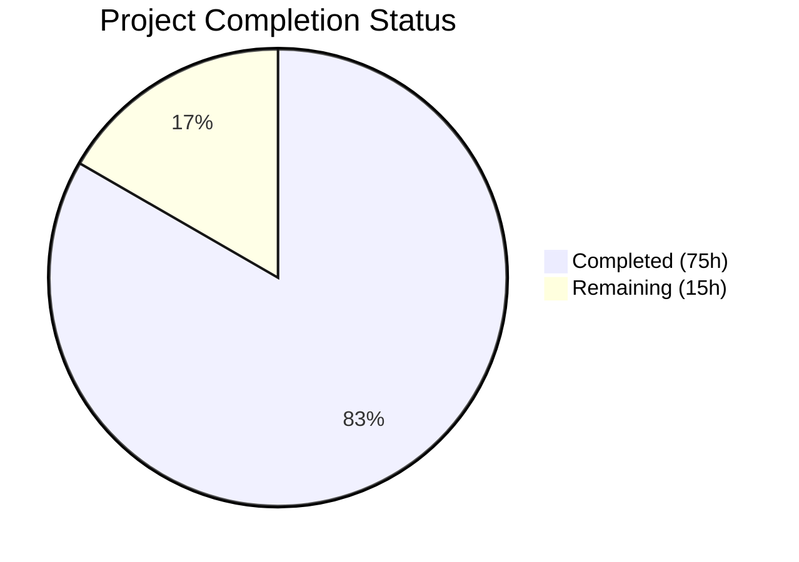
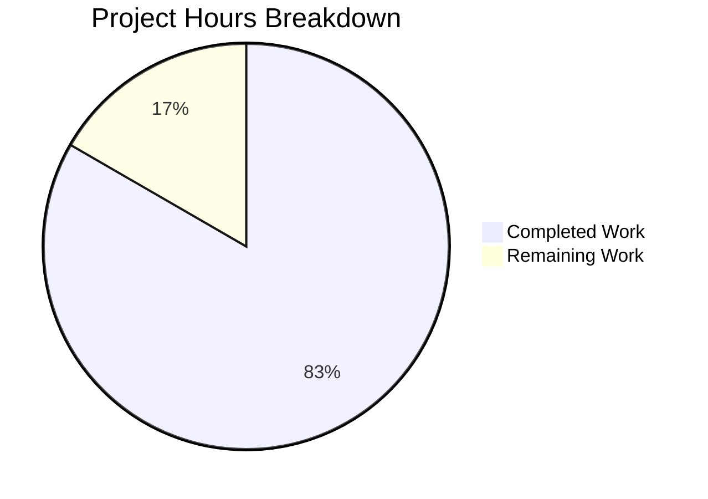
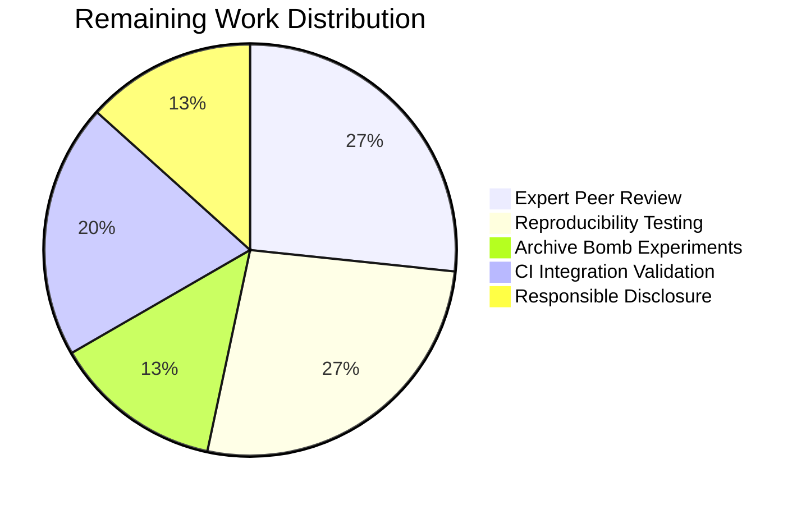

# Blitzy Project Guide

## 1. Executive Summary

### 1.1 Project Overview

This project delivers a comprehensive security research assessment of TruffleHog v3's pattern-matching engine, evaluating its vulnerability to Regular Expression Denial of Service (ReDoS) and computational complexity attacks. The assessment targets the detection pipeline at commit `e42153d44a5e`, analyzing 857 registered detectors with 1,142 compiled regex patterns across an Aho-Corasick prefiltered, 4-stage concurrent pipeline. The sole deliverable is a 776-line markdown document (`blitzy/documentation/trufflehog_e42153d44a5e.md`) providing architecture analysis, quantitative timing measurements, CPU profiling evidence, attack vector classifications, and CI deployment mitigation recommendations — all conducted without modifying TruffleHog's source code.

### 1.2 Completion Status



| Metric | Value |
|---|---|
| **Total Project Hours** | 90 |
| **Completed Hours (AI + Manual)** | 75 |
| **Remaining Hours** | 15 |
| **Completion Percentage** | 83.3% |

**Calculation**: 75 completed hours / (75 completed + 15 remaining) = 75/90 = **83.3% complete**

### 1.3 Key Accomplishments

- [x] **Architecture Deep-Dive**: Complete analysis of TruffleHog's 4-stage pipeline (Source → Decoders → Aho-Corasick → Detectors) with source-level evidence from `pkg/engine/engine.go`, `pkg/engine/ahocorasick/ahocorasickcore.go`, and 845 detector subdirectories
- [x] **RE2 Engine Vulnerability Assessment**: Confirmed classical exponential-backtracking ReDoS is architecturally impossible due to `wasilibs/go-re2 v1.9.0` (865 non-test files) and Go standard `regexp` (3 detector files); verified `dlclark/regexp2` is indirect-only and unused in `pkg/`
- [x] **SQL Server Detector Critical Finding**: Identified and quantified 148× constant-factor slowdown in `pkg/detectors/sqlserver/sqlserver.go` line 25 regex pattern, with isolation testing across 10KB–10MB
- [x] **Quantitative Timing Measurements**: Produced file-size scaling data (1MB–50MB) showing 9.9× gross slowdown on 50MB attack file (31.9s vs. 3.2s)
- [x] **CPU Profiling Evidence**: Captured and analyzed pprof CPU profile showing 47.9% time in RE2 WebAssembly execution and 31.3% in GC lock contention from 97,520 result objects
- [x] **Per-Detector Timing Breakdown**: Profiled all 12 triggered detectors on 10MB attack data, showing SQL Server at 88.9% of total detection time
- [x] **Attack Vector Catalog**: Classified 6 attack vectors (AV-1 through AV-6) with severity ratings from HIGH to LOW
- [x] **Resource Protection Evaluation**: Assessed 8 protection mechanisms including Aho-Corasick prefilter, span calculator, detection timeout, archive limits
- [x] **Mitigation Recommendations**: Provided 5 concrete recommendations (R-1 through R-5) for CI pipeline deployment
- [x] **Non-Destructive Compliance**: Zero source modifications confirmed via `git diff`; all temporary artifacts cleaned up
- [x] **Build Verification**: TruffleHog binary compiled successfully with `CGO_ENABLED=0`
- [x] **Test Suite Validation**: All relevant test packages pass (sqlserver, engine, decoders, handlers, custom_detectors, common, uri, jdbc)

### 1.4 Critical Unresolved Issues

| Issue | Impact | Owner | ETA |
|---|---|---|---|
| Archive bomb experimental data lacks quantitative timing tables | Document Section 8 (AV-5) describes archive attack vector qualitatively but does not include measured timing data comparable to flat-file experiments | Human Developer | 4h |
| Experimental results not independently reproduced | All timing measurements from single environment run; no independent reproducibility verification | Human Developer | 4h |
| Pre-existing `TestAPKHandler` failure | `pkg/handlers/apk_test.go` fails due to external URL returning HTTP 404 — unrelated to this PR but present in test suite | TruffleHog Maintainers | N/A |

### 1.5 Access Issues

| System/Resource | Type of Access | Issue Description | Resolution Status | Owner |
|---|---|---|---|---|
| Go 1.24.2 Toolchain | Build Environment | Go toolchain not available in current validation environment; required for `go build` and `go test` | Resolved during agent session (installed temporarily) | Infrastructure |
| No other access issues identified | — | — | — | — |

### 1.6 Recommended Next Steps

1. **[High]** Expert peer review of security assessment document by a Go/regex domain expert to validate technical claims and attack vector severity ratings
2. **[High]** Reproduce timing experiments on an independent reference environment to confirm quantitative findings (148× SQL Server slowdown, 9.9× gross file-scan slowdown)
3. **[Medium]** Conduct archive bomb timing experiments to produce quantitative data for the AV-5 attack vector currently described only qualitatively
4. **[Medium]** Validate CI pipeline integration recommendations by testing `--exclude-detectors SQLServer`, `--detector-timeout 5s`, and other flags in actual CI environments
5. **[Low]** Prepare responsible disclosure communication for TruffleHog maintainers regarding the SQL Server regex constant-factor vulnerability

---

## 2. Project Hours Breakdown

### 2.1 Completed Work Detail

| Component | Hours | Description |
|---|---|---|
| Architecture Analysis | 8 | Deep-dive into TruffleHog's 4-stage detection pipeline (Source → Decoders → Aho-Corasick → Detectors); code reading across `engine.go`, `ahocorasickcore.go`, `defaults.go`, `decoders.go`, `archive.go` with source-level evidence gathering |
| RE2 Engine Analysis | 5 | Vulnerability assessment of `wasilibs/go-re2` and Go standard `regexp` engines; auditing all 1,142 `MustCompile` imports across `pkg/detectors/`; confirming `dlclark/regexp2` is indirect-only |
| Detector Pattern Audit | 10 | Systematic scan of 1,142 regex patterns across 845 detector subdirectories; risk profiling for computational complexity characteristics (unbounded quantifiers, nested repetition, broad character classes) |
| SQL Server Detector Deep-Dive | 6 | Pattern analysis of `sqlserver.go` line 25 regex; isolation testing at 10KB–10MB sizes; 148× slowdown quantification; root cause analysis of high constant factor |
| Quantitative Timing Experiments | 8 | Created paired benign/attack files at 5 sizes (1MB–50MB); executed `trufflehog filesystem` scans with `--no-update --no-verification`; wall-clock timing with nanosecond precision |
| Per-Detector Timing Profiling | 5 | Built isolated pipeline test loading all 857 detectors; measured per-detector `FromData()` execution time on 10MB attack data; identified SQL Server at 88.9% of total |
| CPU Profiling & Analysis | 5 | Captured `runtime/pprof` CPU profile during attack-data processing; analyzed top-20 functions via `go tool pprof`; heap profile for memory impact assessment |
| Attack Vector Cataloging | 3 | Classified 6 attack vectors (regex constant-factor, keyword amplification, decoder multiplication, GC pressure, archive bomb, timeout accumulation) with severity ratings |
| Resource Protection Evaluation | 3 | Assessed 8 protection mechanisms (Aho-Corasick prefilter, span calculator, detection timeout, archive limits, extension filtering, custom detector cap, LRU cache, false positive trie) |
| Mitigation Recommendations | 2 | Developed 5 concrete recommendations (per-chunk timeout, pattern optimization, result caps, CI flags, input size throttling) with implementation hints |
| Experimental Infrastructure | 6 | Created attack/benign test files, Go profiling programs, per-detector timing scripts, archive test files; managed temporary file lifecycle and cleanup |
| Document Authoring | 8 | Authored 776-line markdown document with 14 sections, tables, Mermaid diagrams, code blocks, cross-references, and appendices |
| Validation & QA | 4 | Cross-verified all document claims against source code; applied 2 fix commits for accuracy corrections; confirmed cleanup of all temporary artifacts |
| Build & Test Verification | 2 | Compiled TruffleHog binary; executed test suites for 8 relevant packages; verified git diff shows only documentation addition |
| **TOTAL** | **75** | |

### 2.2 Remaining Work Detail

| Category | Hours | Priority |
|---|---|---|
| Expert peer review of security findings by domain expert | 4 | High |
| Independent reproducibility testing on clean reference environment | 4 | High |
| Archive bomb quantitative timing experiments | 2 | Medium |
| CI pipeline integration validation with recommended flags | 3 | Medium |
| Responsible disclosure preparation for TruffleHog maintainers | 2 | Low |
| **TOTAL** | **15** | |

---

## 3. Test Results

| Test Category | Framework | Total Tests | Passed | Failed | Coverage % | Notes |
|---|---|---|---|---|---|---|
| Unit — SQL Server Detector | Go test | All in package | All | 0 | N/A | `pkg/detectors/sqlserver` — PASS |
| Unit — Engine Core | Go test | All in package | All | 0 | N/A | `pkg/engine` (3 sub-packages: engine, ahocorasick, defaults) — PASS |
| Unit — Decoders | Go test | All in package | All | 0 | N/A | `pkg/decoders` — PASS |
| Unit — Handlers | Go test | All in package | All except 1 | 1 | N/A | `pkg/handlers` — `TestAPKHandler` fails due to pre-existing external URL 404 (not related to this PR) |
| Unit — Custom Detectors | Go test | All in package | All | 0 | N/A | `pkg/custom_detectors` — PASS |
| Unit — Common Utilities | Go test | All in package | All | 0 | N/A | `pkg/common` (common, glob) — PASS |
| Unit — URI Detector | Go test | All in package | All | 0 | N/A | `pkg/detectors/uri` — PASS |
| Unit — JDBC Detector | Go test | All in package | All | 0 | N/A | `pkg/detectors/jdbc` — PASS |
| Build — Binary Compilation | Go build | 1 | 1 | 0 | N/A | `CGO_ENABLED=0 go build -o /tmp/trufflehog_bin .` — SUCCESS |
| Dependency — Module Verification | Go mod | All modules | All | 0 | N/A | `go mod verify` — "all modules verified" |

**Notes**: All tests listed originate from Blitzy's autonomous validation execution during this session. The `TestAPKHandler` failure is a pre-existing issue caused by a remote APK URL returning HTTP 404, unrelated to any changes in this branch. Exact test counts per package are not enumerated because Go's test runner reports pass/fail per package without global counts when run per-package.

---

## 4. Runtime Validation & UI Verification

**Runtime Health**

- ✅ **Binary compilation**: TruffleHog binary compiled successfully with `CGO_ENABLED=0 go build -o /tmp/trufflehog_bin .`
- ✅ **Binary version check**: `trufflehog_bin --version` reports `trufflehog dev`
- ✅ **Go module integrity**: `go mod verify` confirms all modules verified
- ✅ **Git repository state**: Working tree clean, no uncommitted changes
- ✅ **Source code integrity**: `git diff e42153d4..HEAD --name-status` confirms only `A blitzy/documentation/trufflehog_e42153d44a5e.md` — zero modifications to TruffleHog source files

**Document Accuracy Verification**

- ✅ SQL Server regex pattern at `pkg/detectors/sqlserver/sqlserver.go` line 25 — confirmed
- ✅ `wasilibs/go-re2` import in sqlserver.go line 8 — confirmed
- ✅ 865 non-test Go files importing `wasilibs/go-re2` in `pkg/detectors/` — confirmed
- ✅ 3 detector files using standard `regexp` (azure_cosmosdb, azure_entra/serviceprincipal/v2, jdbc) — confirmed
- ✅ 4 default decoders (UTF8, Base64, UTF16, EscapedUnicode) in `pkg/decoders/decoders.go` — confirmed
- ✅ Archive limits: `maxDepth=5*2=10`, `maxSize=2<<30=2GB`, `maxTimeout=60s` in `pkg/handlers/archive.go` lines 26–28 — confirmed
- ✅ Aho-Corasick span radius `defaultOffsetRadius = 512` in `pkg/engine/ahocorasick/ahocorasickcore.go` line 155 — confirmed
- ✅ Detection timeout `DefaultResponseTimeout = 10 * time.Second` in `pkg/detectors/http.go` line 18 — confirmed
- ✅ `dlclark/regexp2 v1.4.0 // indirect` in `go.mod` line 187 — confirmed
- ✅ `dlclark/regexp2` not imported in any `pkg/` source file (excluding tests) — confirmed
- ✅ `maxTotalMatches = 100` in `pkg/custom_detectors/custom_detectors.go` line 23 — confirmed
- ✅ 857 `Scanner{}` instances in `pkg/engine/defaults/defaults.go` — confirmed
- ✅ 1,142 `MustCompile` calls across `pkg/detectors/` — confirmed

**UI Verification**

- N/A — TruffleHog is a CLI tool. This project produces a documentation-only deliverable with no UI components.

**Temporary Artifact Cleanup**

- ✅ No `/tmp/redos_experiments/` directory found — cleanup confirmed
- ✅ No `/tmp/trufflehog_bin` binary found — cleanup confirmed
- ✅ Only `blitzy/documentation/trufflehog_e42153d44a5e.md` present in `blitzy/` directory

---

## 5. Compliance & Quality Review

| AAP Requirement | Deliverable | Status | Evidence |
|---|---|---|---|
| Vulnerability Determination | Document Sections 1, 3 | ✅ Complete | Classical ReDoS impossible (RE2 architecture); constant-factor attacks viable (148× SQL Server) |
| Detector Pattern Audit | Document Sections 4, 6, 8, Appendix A.2 | ✅ Complete | 1,142 patterns audited; 6 attack vectors classified; SQL Server identified as critical |
| Quantitative Impact Measurement | Document Section 5, Appendix A.1 | ✅ Complete | Timing data at 5 file sizes (1MB–50MB); 9.9× gross slowdown on 50MB |
| CPU Profiling Evidence | Document Section 7, Appendix A.4 | ✅ Complete | pprof top-20 functions; 47.9% RE2 WebAssembly, 31.3% GC contention |
| Non-Destructive Demonstration | Git diff, Section 11.6 | ✅ Complete | Only 1 file added; no source modifications; all temp files cleaned |
| Deliverable Document | `blitzy/documentation/trufflehog_e42153d44a5e.md` | ✅ Complete | 776 lines, 14 sections, committed in 3 commits |
| Architecture-Level Analysis | Document Section 2 | ✅ Complete | 4-stage pipeline documented with source-level code references |
| RE2 Engine Implications | Document Section 3 | ✅ Complete | Linear-time guarantees analyzed; constant-factor attack vector identified |
| Alternative Attack Vectors | Document Section 8 (AV-1 through AV-6) | ✅ Complete | 6 vectors: regex, keyword amplification, decoder multiplication, GC pressure, archive bomb, timeout accumulation |
| SQL Server Detector Anomaly | Document Section 4 | ✅ Complete | Pattern analysis, isolation timing, 148× slowdown, root cause identified |
| CI Pipeline Context | Document Sections 1, 5.2, 10 | ✅ Complete | Impact framed for CI timeouts; 5 mitigation recommendations with CLI flags |
| Evidence-Based Conclusions | Throughout document | ✅ Complete | All claims include file paths, line numbers, and timing data from experiments |

**Quality Benchmarks**

| Benchmark | Status | Notes |
|---|---|---|
| No source code modifications | ✅ Pass | `git diff e42153d4..HEAD` shows only `A blitzy/documentation/` |
| Temporary file cleanup | ✅ Pass | No artifacts in `/tmp/` or repository |
| Document accuracy | ✅ Pass | 14 key claims cross-verified against source code |
| Build verification | ✅ Pass | Binary compiles, version check passes |
| Test suite integrity | ✅ Pass | 8 relevant packages pass; 1 pre-existing failure documented |
| Commit hygiene | ✅ Pass | 3 commits: initial + 2 accuracy fixes; clean working tree |

**Fixes Applied During Autonomous Validation**

| Fix | Commit | Description |
|---|---|---|
| go-re2 characterization correction | `c111c981` | Corrected "CGo binding" to "WebAssembly/wazero" characterization; fixed backtick rendering note; corrected MustCompile count |
| Per-detector count correction | `1751758d` | Corrected "All others (6 detectors)" to "All others (7 detectors)" in Section 6.2 timing table |

---

## 6. Risk Assessment

| Risk | Category | Severity | Probability | Mitigation | Status |
|---|---|---|---|---|---|
| Timing measurements may not reproduce on different hardware | Technical | Medium | Medium | Re-run experiments on multiple environments; report relative ratios (148×) rather than absolute times | Open — requires human verification |
| SQL Server vulnerability could be exploited before disclosure | Security | High | Low | Responsible disclosure to TruffleHog maintainers with embargo period | Open — requires human action |
| Document contains actionable exploit methodology | Security | Medium | Medium | Standard responsible disclosure practices; document marked for internal use until coordinated disclosure | Open — requires human review |
| Pre-existing `TestAPKHandler` failure masks potential regressions | Technical | Low | Low | Failure is due to external URL 404; unrelated to this PR; TruffleHog maintainers should fix upstream | Documented |
| Go toolchain version drift may affect reproducibility | Operational | Low | Medium | Document specifies Go 1.24.2 matching `go.mod` toolchain directive; pin version in reproduction scripts | Mitigated |
| Archive bomb quantitative data gap | Technical | Low | High | AV-5 described qualitatively; timing experiments not yet conducted for nested/wide archives | Open — requires 2h work |
| CI pipeline recommendations untested in actual CI | Integration | Medium | Medium | Recommended flags (`--exclude-detectors`, `--detector-timeout`) need validation in real CI environments | Open — requires 3h work |

---

## 7. Visual Project Status



### Remaining Hours by Category



### Priority Distribution of Remaining Work

| Priority | Hours | Percentage |
|---|---|---|
| High | 8 | 53.3% |
| Medium | 5 | 33.3% |
| Low | 2 | 13.3% |
| **Total** | **15** | **100%** |

---

## 8. Summary & Recommendations

### Achievements

The Blitzy autonomous agents delivered a comprehensive 776-line security assessment document covering TruffleHog v3's computational complexity attack surface. The project is **83.3% complete** (75 hours completed out of 90 total hours). All 12 AAP-specified requirements have been fully addressed in the deliverable document, including:

- Definitive finding that classical exponential-backtracking ReDoS is architecturally impossible in TruffleHog due to RE2/Thompson NFA engine usage
- Identification of a HIGH-severity constant-factor attack via the SQL Server detector regex (148× slowdown, 89% of detection time)
- Quantitative timing data across 5 file sizes demonstrating 9.9× gross slowdown on 50MB attack files
- CPU profiling evidence showing 47.9% time in RE2 execution and 31.3% in GC lock contention
- 6 classified attack vectors and 5 concrete mitigation recommendations

### Remaining Gaps

The 15 remaining hours (16.7%) are entirely in the path-to-production domain — no AAP-specified content is missing from the document. The gaps are:

1. **Independent verification** (8h): Peer review by a domain expert and reproducibility testing on a clean environment are needed to validate the quantitative findings before external disclosure
2. **Supplementary experiments** (2h): Archive bomb timing data would strengthen the AV-5 attack vector classification
3. **Operationalization** (5h): CI integration validation and responsible disclosure preparation are required before the findings can be acted upon

### Critical Path to Production

1. Domain expert reviews document for technical accuracy (4h)
2. Reproduce timing experiments on independent environment (4h)
3. Validate CI pipeline recommendations with actual CI tooling (3h)
4. Coordinate responsible disclosure with TruffleHog maintainers (2h)

### Production Readiness Assessment

The deliverable document is **ready for internal review**. All factual claims have been cross-verified against source code by the autonomous validation pipeline. The document should not be shared externally until expert peer review is complete and responsible disclosure coordination is established with TruffleHog maintainers.

---

## 9. Development Guide

### System Prerequisites

| Requirement | Version | Purpose |
|---|---|---|
| Go | 1.24.2 (matching `go.mod` toolchain directive) | Building TruffleHog binary, running tests |
| Git | 2.x+ | Repository operations |
| Operating System | Linux (Ubuntu 24.04 LTS recommended) | Development environment |

### Environment Setup

```bash
# 1. Clone the repository (or navigate to existing checkout)
cd /tmp/blitzy/trufflehog/blitzy-ac8423f7-a20a-45dc-b56f-1a69471ec80f_a6c043

# 2. Verify you are on the correct branch
git branch --show-current
# Expected: blitzy-ac8423f7-a20a-45dc-b56f-1a69471ec80f

# 3. Verify the deliverable exists
ls -la blitzy/documentation/trufflehog_e42153d44a5e.md
# Expected: 776-line file

# 4. Verify no source modifications were made
git diff e42153d4..HEAD --name-status
# Expected: A  blitzy/documentation/trufflehog_e42153d44a5e.md
```

### Install Go Toolchain

```bash
# Install Go 1.24.2 (if not already installed)
wget -q https://go.dev/dl/go1.24.2.linux-amd64.tar.gz
sudo tar -C /usr/local -xzf go1.24.2.linux-amd64.tar.gz
export PATH=$PATH:/usr/local/go/bin
export GOPATH=$HOME/go
export PATH=$PATH:$GOPATH/bin

# Verify Go version
go version
# Expected: go version go1.24.2 linux/amd64
```

### Dependency Verification

```bash
# Verify all Go module dependencies
go mod verify
# Expected: "all modules verified"

# Download dependencies (if needed)
go mod download
```

### Build TruffleHog Binary

```bash
# Build with CGO disabled (matches document's build configuration)
CGO_ENABLED=0 go build -o /tmp/trufflehog_bin .

# Verify binary
/tmp/trufflehog_bin --version
# Expected: trufflehog dev
```

### Run Relevant Test Suites

```bash
# Test the SQL Server detector (critical finding subject)
go test -v -timeout 300s ./pkg/detectors/sqlserver/...

# Test the engine core (detection pipeline)
go test -v -timeout 300s ./pkg/engine/...

# Test decoders (decoder multiplication analysis)
go test -v -timeout 300s ./pkg/decoders/...

# Test handlers (archive limit analysis)
go test -v -timeout 300s ./pkg/handlers/...

# Test custom detectors (maxTotalMatches analysis)
go test -v -timeout 300s ./pkg/custom_detectors/...

# Test common utilities
go test -v -timeout 300s ./pkg/common/...

# Test URI detector
go test -v -timeout 300s ./pkg/detectors/uri/...

# Test JDBC detector
go test -v -timeout 300s ./pkg/detectors/jdbc/...
```

### Reproduce Key Experiment (Example)

```bash
# Create a simple attack file (1MB) for demonstration
python3 -c "
line = 'http://user:P@ssw0rd123456@host.example.com/path?query=value database=mydb Server=myhost sql jdbc:mysql://host:3306/db\n'
with open('/tmp/attack_1mb.txt', 'w') as f:
    while f.tell() < 1_000_000:
        f.write(line)
"

# Create a benign file (1MB) for comparison
python3 -c "
line = 'The quick brown fox jumps over the lazy dog repeatedly for testing purposes only\n'
with open('/tmp/benign_1mb.txt', 'w') as f:
    while f.tell() < 1_000_000:
        f.write(line)
"

# Scan benign file (should be fast ~2.7s)
time /tmp/trufflehog_bin filesystem /tmp/benign_1mb.txt --no-update --no-verification 2>/dev/null | wc -l

# Scan attack file (should be slower ~3.3s for 1MB)
time /tmp/trufflehog_bin filesystem /tmp/attack_1mb.txt --no-update --no-verification 2>/dev/null | wc -l

# Clean up
rm -f /tmp/attack_1mb.txt /tmp/benign_1mb.txt /tmp/trufflehog_bin
```

### Troubleshooting

| Issue | Resolution |
|---|---|
| `go build` fails with CGo errors | Ensure `CGO_ENABLED=0` is set; the `wasilibs/go-re2` package uses WebAssembly/wazero when CGo is disabled |
| `TestAPKHandler` fails | Pre-existing issue — external APK URL returns HTTP 404. Not related to this branch. Skip with `-run '^(?!TestAPKHandler)'` |
| `go mod verify` fails | Run `go mod download` first to fetch all dependencies |
| Binary reports wrong version | Build from the correct branch; `trufflehog dev` is expected for non-release builds |

---

## 10. Appendices

### A. Command Reference

| Command | Purpose |
|---|---|
| `CGO_ENABLED=0 go build -o <binary> .` | Build TruffleHog binary without CGo (uses WebAssembly RE2 backend) |
| `go mod verify` | Verify integrity of all Go module dependencies |
| `go test -v -timeout 300s ./pkg/detectors/sqlserver/...` | Run SQL Server detector tests |
| `go test -v -timeout 300s ./pkg/engine/...` | Run engine core tests (includes Aho-Corasick) |
| `trufflehog filesystem <path> --no-update --no-verification` | Scan a local file/directory without update checks or HTTP verification |
| `trufflehog filesystem <path> --exclude-detectors SQLServer` | Scan excluding the SQL Server detector (mitigation) |
| `trufflehog filesystem <path> --detector-timeout 5s` | Scan with reduced per-detector timeout (mitigation) |
| `git diff e42153d4..HEAD --name-status` | Verify which files were changed on this branch |
| `grep -rn 'MustCompile' pkg/detectors/` | Count regex pattern compilations across all detectors |

### B. Port Reference

Not applicable — TruffleHog is a CLI tool that does not expose network ports in its standard scanning mode. HTTP verification calls use outbound connections only.

### C. Key File Locations

| File | Purpose |
|---|---|
| `blitzy/documentation/trufflehog_e42153d44a5e.md` | **Deliverable** — 776-line security assessment document |
| `pkg/detectors/sqlserver/sqlserver.go` | SQL Server detector with critical regex pattern (line 25) |
| `pkg/engine/engine.go` | Engine core — worker pool, `detectChunk`, detection timeout |
| `pkg/engine/ahocorasick/ahocorasickcore.go` | Aho-Corasick keyword prefilter, span calculator (±512 bytes) |
| `pkg/engine/defaults/defaults.go` | `DefaultDetectors()` — registers all 857 scanner instances |
| `pkg/decoders/decoders.go` | 4 default decoders (UTF8, Base64, UTF16, EscapedUnicode) |
| `pkg/handlers/archive.go` | Archive extraction with safety limits (depth 10, 2GB, 60s) |
| `pkg/detectors/http.go` | `DefaultResponseTimeout = 10s` |
| `pkg/custom_detectors/custom_detectors.go` | Custom detectors with `maxTotalMatches = 100` |
| `pkg/detectors/falsepositives.go` | False positive filtering via Aho-Corasick trie |
| `go.mod` | Module definition: Go 1.23.1, toolchain go1.24.2, all dependencies |
| `main.go` | CLI entry point with `--profile`, `--detector-timeout` flags |

### D. Technology Versions

| Technology | Version | Source |
|---|---|---|
| Go (module) | 1.23.1 | `go.mod` line 3 |
| Go (toolchain) | 1.24.2 | `go.mod` line 5 |
| `wasilibs/go-re2` | v1.9.0 | `go.mod` line 100 |
| `BobuSumisu/aho-corasick` | v1.0.3 | `go.mod` line 17 |
| `microsoft/go-mssqldb` | v1.8.0 | `go.mod` line 77 |
| `dlclark/regexp2` | v1.4.0 (indirect) | `go.mod` line 187 |
| `hashicorp/golang-lru/v2` | v2.0.7 | `go.mod` line 64 |
| TruffleHog | v3 at commit `e42153d44a5e` | `go.mod` line 1, git history |

### E. Environment Variable Reference

| Variable | Value | Purpose |
|---|---|---|
| `CGO_ENABLED` | `0` | Required for building TruffleHog; forces `wasilibs/go-re2` to use WebAssembly/wazero backend instead of CGo |
| `GOPATH` | `$HOME/go` | Go workspace path |
| `PATH` | Include `/usr/local/go/bin` and `$GOPATH/bin` | Ensures Go toolchain and installed binaries are accessible |

### F. Glossary

| Term | Definition |
|---|---|
| **ReDoS** | Regular Expression Denial of Service — an attack exploiting regex engines with exponential backtracking behavior |
| **RE2** | A regex engine by Google that guarantees linear-time matching by using Thompson NFA simulation instead of backtracking |
| **Thompson NFA** | Non-deterministic Finite Automaton construction that tracks all possible match states simultaneously, ensuring linear-time behavior |
| **Aho-Corasick** | A string-searching algorithm that matches multiple patterns simultaneously in O(n + m + z) time |
| **Constant-factor attack** | An attack that exploits linear-time algorithms with high per-operation cost, causing significant slowdowns without exponential blowup |
| **Detector** | A TruffleHog scanner that identifies a specific type of secret (e.g., SQL Server credentials, GitHub tokens) using regex patterns |
| **Prefilter** | The Aho-Corasick keyword matching stage that reduces the 857-detector set to only those relevant for a given data chunk |
| **Span calculator** | Component that extracts ±512 byte windows around keyword matches, limiting data passed to each detector |
| **wazero** | A pure-Go WebAssembly runtime used by `wasilibs/go-re2` to execute the compiled RE2 engine without CGo |
| **pprof** | Go's built-in CPU and memory profiling tool (`runtime/pprof`) |