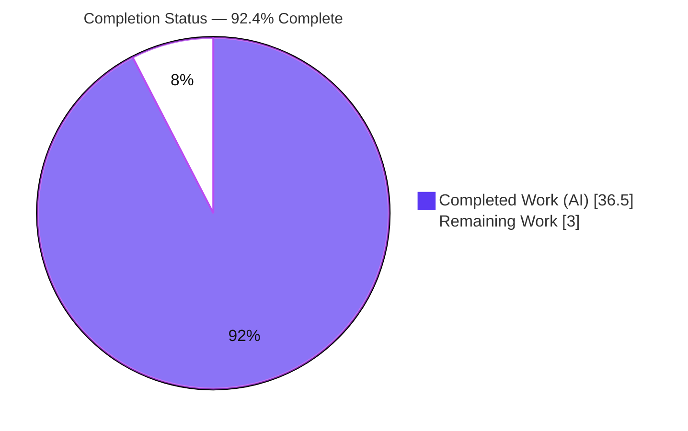
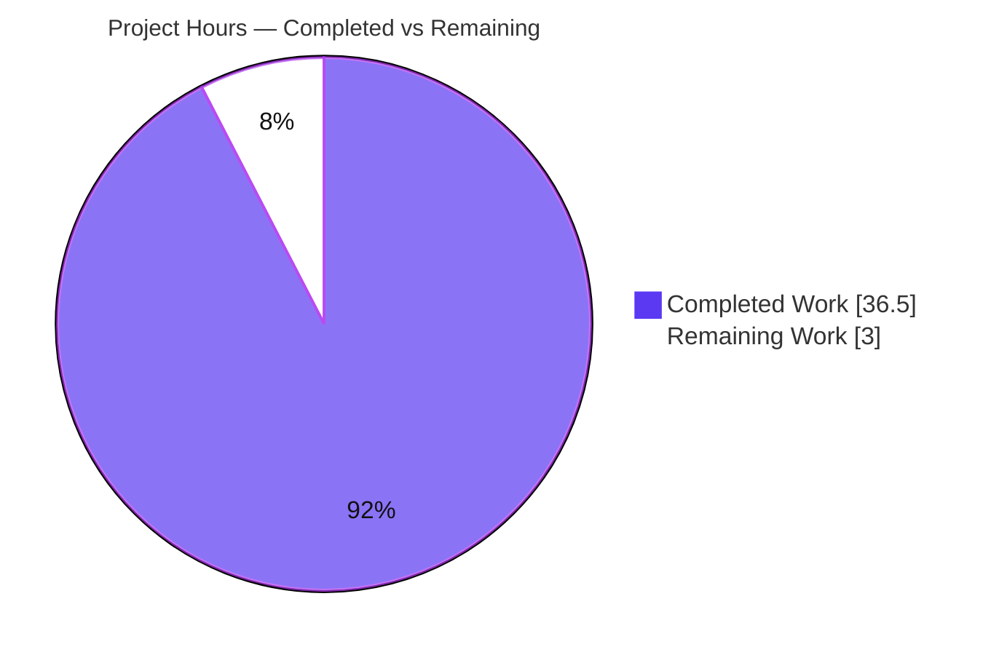
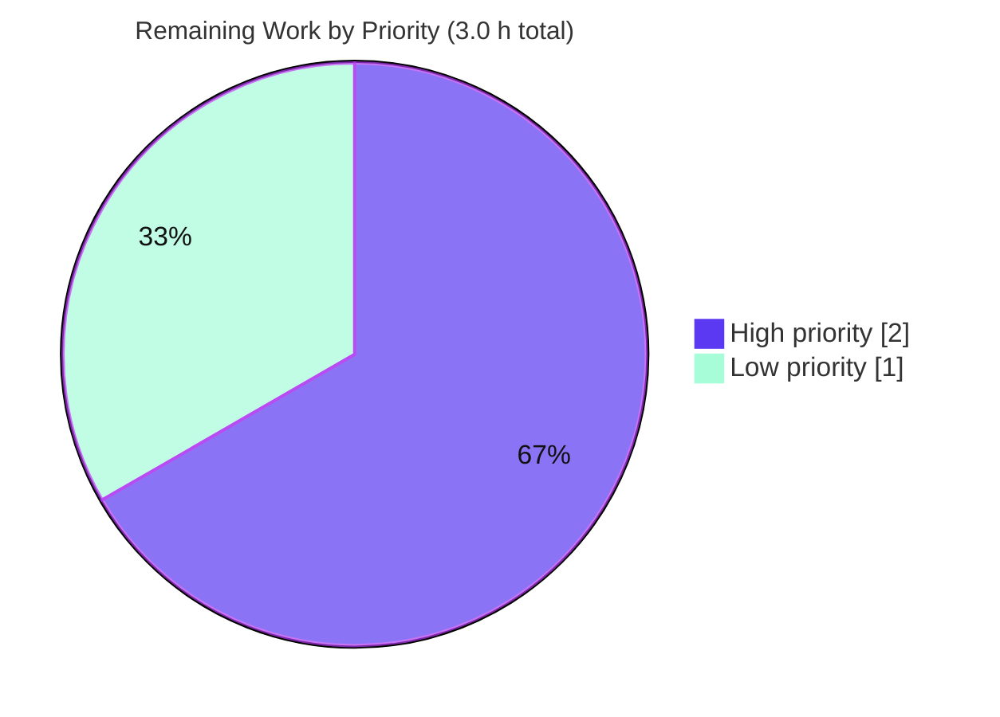

# Blitzy Project Guide — TruffleHog Scanning-Behavior Q&A Documentation

> **Deliverable:** `blitzy/documentation/trufflehog_e42153d44a5e.md`
> **Repository:** `github.com/trufflesecurity/trufflehog/v3` · **Branch:** `blitzy-9725097a-1ad5-4847-bd59-ee42cee092e8` · **Base commit:** `e42153d4`
> **Task type:** Investigative documentation (Q&A) · **Rule set:** SWE-AtlasQnA-Repo (read-only source)
>
> **Color legend (Blitzy brand):** <span style="color:#5B39F3">■ Completed / AI work = Dark Blue `#5B39F3`</span> · <span>□ Remaining / Not completed = White `#FFFFFF`</span> · Headings/accents = Violet-Black `#B23AF2` · Highlight = Mint `#A8FDD9`

---

## 1. Executive Summary

### 1.1 Project Overview

This project produced a single evidence-grounded markdown document that explains five confusing TruffleHog v3 secret-scanning behaviors for a security engineer evaluating the tool for a CI pipeline. Its scope is investigative and **read-only**: the scanner was built and run against crafted probe files, and every behavioral claim in the deliverable is paired with verbatim captured output and the exact governing source literal (`file:line`) at commit `e42153d4`. Business impact is faster, correct adoption of TruffleHog by clarifying why AWS credentials are detected in some files but not others, whether encoding hides secrets, why format-valid fixtures are ignored, what the "verification disabled for safety" warning means, and where detection thresholds sit. No product code, dependencies, or configuration were changed.

### 1.2 Completion Status

The project is **92.4% complete**, calculated on AAP-scoped hours (PA1 methodology): 36.5 completed hours out of 39.5 total hours. The remaining 3.0 hours are exclusively human acceptance work (SME review and publication), which autonomous agents cannot perform.



| Metric | Hours |
|---|---|
| **Total Hours** | **39.5 h** |
| Completed Hours (AI + Manual) | 36.5 h (AI 36.5 h · Manual 0.0 h) |
| Remaining Hours | 3.0 h |
| **Percent Complete** | **92.4 %** |

> Completion formula: `36.5 / (36.5 + 3.0) × 100 = 92.4%`. Per Blitzy honesty rules, completion is never reported as 100% before human sign-off.

### 1.3 Key Accomplishments

- ✅ **Single mandated deliverable created** at the exact bound path `blitzy/documentation/trufflehog_e42153d44a5e.md` (filename equals the git source-branch name), including creation of the previously-absent `blitzy/documentation/` directory.
- ✅ **All five questions answered** (Q1 deterministic detect-vs-miss; Q2 encoding is not protection; Q3 false-positive filtering; Q4 `errOverlap` "verification disabled for safety"; Q5 threshold/boundary behavior), each with run-first evidence.
- ✅ **Run-first evidence discipline:** 70 command+output code blocks pairing one observed line with one claim.
- ✅ **Exact-literal grounding:** 143 inline `file:line` citations across 15 distinct source files; key literals independently re-verified at commit `e42153d4`.
- ✅ **Coverage pass** enumerating every named item across Q1–Q5, plus all five verbatim user-quote fragments embedded.
- ✅ **Read-only constraint provably honored:** `git diff e42153d4..HEAD` = 1 file changed, 1,361 insertions, 0 deletions; zero source files touched; `git status --porcelain` empty.
- ✅ **Reproducibility validated:** clean build (`trufflehog dev`), `go mod verify` = all modules verified, 207 in-scope tests passing / 0 failing, and Q1/Q4/Q5 runtime behavior reproduced verbatim.

### 1.4 Critical Unresolved Issues

| Issue | Impact | Owner | ETA |
|---|---|---|---|
| _None — no blocking issues._ The deliverable compiles-adjacent evidence reproduces cleanly; no compilation errors, no failing in-scope tests, no missing content. | None | — | — |

> There are **no critical unresolved issues**. The only remaining work is a human acceptance gate (Section 1.6 / Section 2.2), not a defect.

### 1.5 Access Issues

| System/Resource | Type of Access | Issue Description | Resolution Status | Owner |
|---|---|---|---|---|
| GCP Secret Manager (used by out-of-scope `pkg/analyzer/*` and some `pkg/sources/*` tests) | Cloud service credentials | The full-repo `go test ./...` sweep touches analyzer/source packages that require GCP credentials available only in the project's own CI. These packages are **out of scope** (unreferenced by the deliverable). | Not required for this deliverable — in-scope packages test and run fully offline | Human reviewer (informational only) |

> No access issue affects the deliverable or its evidence: all in-scope packages build and test with `CGO_ENABLED=0` and scans run with `--no-verification --no-update` (no network, no credentials). If a reviewer wishes to run the entire upstream test suite, GCP credentials would be needed — but that is not part of this task.

### 1.6 Recommended Next Steps

1. **[High]** SME technical-accuracy review and sign-off of the five answers and a sample of the 143 `file:line` citations against source at commit `e42153d4`.
2. **[High]** Reproduce a sample (3–5) of the documented scans in the reviewer's environment and confirm non-volatile output matches.
3. **[High]** Confirm all embedded example tokens (AWS-format keys, Postman `PMAK` token) are synthetic/non-live before any distribution.
4. **[Low]** Verify the Mermaid decision-flow diagram renders in the target documentation viewer; export to a static image if the platform lacks Mermaid support.
5. **[Low]** Publish/distribute the document to the stakeholder-facing location and apply house-style formatting.

---

## 2. Project Hours Breakdown

### 2.1 Completed Work Detail

Each component traces to a specific AAP requirement. Total below equals the Completed Hours in Section 1.2 (**36.5 h**).

| Component | Hours | Description |
|---|---:|---|
| Investigation environment & build reproducibility | 1.5 | Install/confirm Go 1.24.2 toolchain; `CGO_ENABLED=0 go build`; `go mod verify`; establish run-first harness. |
| Q1 — Deterministic detect vs. miss (AWS) | 4.5 | Keyword prefilter, `idPat`/`SecretPat`, entropy floors; paired AKIA/BKIA probes; determinism proof; "reported differently" case. |
| Q2 — Encoding is not protection | 4.0 | `DefaultDecoders()` chain; PLAIN/BASE64/UTF16/ESCAPED_UNICODE demonstrations; honest miss nuances. |
| Q3 — False-positive filtering | 4.0 | `DefaultFalsePositives`, embedded wordlists, `IsKnownFalsePositive`, entropy filter, `trufflehog:ignore`; `filtered_unverified` demos. |
| Q4 — `errOverlap` "verification disabled for safety" | 4.5 | Overlapping-detector scenario; exact warning capture; `--allow-verification-overlap` override; four output-format renders. |
| Q5 — Thresholds & behavior at the boundary | 3.5 | 39-vs-40-char and entropy-straddle probes; single-variable isolation; always-on AWS entropy gate. |
| Source reading & exact-literal citation grounding | 3.0 | 15 source files; 143 `file:line` references verified at commit `e42153d4`. |
| Methodology, decision-flow Mermaid, CLI flags, reasoning threads | 2.0 | End-to-end flow diagram; CLI-flag semantics; per-answer rationale. |
| Web-search external framing validation | 1.5 | Verification-overlap rationale, issue tracker, CLI/result-state semantics, inline suppression (framing only). |
| Coverage pass, cleanup, read-only git verification | 1.5 | Named-item decomposition; transient-artifact removal; `git status --porcelain` empty. |
| Code-review remediation round (commit `2c3aaee7`) | 3.0 | Verbatim-evidence corrections, source grounding, corrected Q4/Q5 claims. |
| Final validation (rebuild + 20+ re-runs + citation audit + integrity) | 3.5 | Independent reproduction of all gates; runtime re-verification; repo-clean confirmation. |
| **Total Completed** | **36.5** | |

### 2.2 Remaining Work Detail

Each category is a path-to-production (human acceptance) item. Total below equals the Remaining Hours in Section 1.2 (**3.0 h**).

| Category | Hours | Priority |
|---|---:|---|
| Human SME technical-accuracy review, sample citation spot-check, sample scan reproduction, synthetic-credential confirmation | 2.0 | High |
| Publication/formatting for stakeholder distribution + Mermaid render/export check | 1.0 | Low |
| **Total Remaining** | **3.0** | |

### 2.3 Completion Calculation

| Quantity | Value |
|---|---:|
| Section 2.1 Completed total | 36.5 h |
| Section 2.2 Remaining total | 3.0 h |
| **Total Project Hours** (2.1 + 2.2) | **39.5 h** |
| **Completion %** = 36.5 / 39.5 × 100 | **92.4 %** |

> Cross-checks: 2.1 + 2.2 = 39.5 h = Section 1.2 Total ✓ · Remaining 3.0 h identical in 1.2, 2.2, and Section 7 ✓.

---

## 3. Test Results

All tests below originate from **Blitzy's autonomous validation runs this session** (`CGO_ENABLED=0 go test -v -count=1` per package). Counts are exact `--- PASS` tallies; there is no product test code in this task, so these are the upstream in-scope tests exercised to validate the evidence paths.

| Test Category | Framework | Total Tests | Passed | Failed | Coverage % | Notes |
|---|---|---:|---:|---:|---:|---|
| Decoders (Q2 paths) | Go `testing` | 54 | 54 | 0 | 89.5% | `pkg/decoders` — UTF8/Base64/UTF16/EscapedUnicode. |
| Keyword prefilter (Q1/Q5 gate) | Go `testing` | 21 | 21 | 0 | 86.4% | `pkg/engine/ahocorasick`. |
| AWS access keys (Q1/Q5) | Go `testing` | 3 | 3 | 0 | 21.5% | `pkg/detectors/aws/access_keys` (unit-level; runtime behavior validated separately in Section 4). |
| AWS session keys (Q1) | Go `testing` | 3 | 3 | 0 | 31.7% | `pkg/detectors/aws/session_keys`. |
| False-positive & detector core (Q3) | Go `testing` | 36 | 36 | 0 | n/m | `pkg/detectors` — `falsepositives.go` / `detectors.go`. |
| Engine incl. overlap worker (Q4) | Go `testing` | 90 | 90 | 0 | n/m | `pkg/engine` — `errOverlap`, `verificationOverlapWorker`, `likelyDuplicate`. |
| **Total** | | **207** | **207** | **0** | | 100% pass rate across all in-scope packages. |

> `n/m` = coverage not separately measured for that package in this session (fast packages measured: decoders 89.5%, ahocorasick 86.4%, aws/access_keys 21.5%, aws/session_keys 31.7%). Out-of-scope analyzer/source packages requiring GCP credentials were intentionally excluded (see Section 1.5).

---

## 4. Runtime Validation & UI Verification

This is a CLI/library project (no web UI), so "UI verification" is the scanner's console output. All behaviors were reproduced this session with a freshly built binary (`trufflehog dev`).

- ✅ **Build & version** — `CGO_ENABLED=0 go build -o /tmp/trufflehog .` exit 0; `--version` → `trufflehog dev`. **Operational**
- ✅ **Dependencies** — `go mod verify` → "all modules verified"; `go.mod`/`go.sum` unmodified. **Operational**
- ✅ **Q1 detected** — AWS `AKIAZ7Q3RB5XW2YT9NKD` + 40-char secret → `Found unverified result`, `Detector Type: AWS`, `Decoder Type: PLAIN`, `unverified_secrets: 1` (116 bytes). **Operational**
- ✅ **Q1 missed (keyword gate)** — `BKIA…` (no `AKIA/ABIA/ACCA` keyword) → `unverified_secrets: 0`; prefilter blocks the detector. **Operational**
- ✅ **Q1 determinism** — three identical runs produced byte-identical results (aside from volatile timestamp/duration). **Operational**
- ✅ **Q2 encoding** — same key surfaced under `Decoder Type` PLAIN/BASE64/UTF16/ESCAPED_UNICODE; no-decoder variants correctly produce zero findings. **Operational**
- ✅ **Q3 filtering** — `example`/wordlist IDs filtered under default results, reappear under `--results=…,filtered_unverified`; `trufflehog:ignore` stays suppressed even under `filtered_unverified`. **Operational**
- ✅ **Q4 overlap warning** — overlapping detectors on one token surface the exact `errOverlap` yellow `Verification issue:` line; `--allow-verification-overlap` removes the warning while both findings remain reported. **Operational**
- ✅ **Q5 boundary** — 40-char secret detected (116 bytes) vs 39-char missed (115 bytes); entropy `4.2776` detected vs `4.1964` missed across the `4.25` floor (same ID, single variable isolated). **Operational**
- ⚠ **Full-suite `go test ./...`** — partial: out-of-scope analyzer/source packages need GCP credentials (Section 1.5). Does not affect the deliverable. **Partial (out of scope)**

---

## 5. Compliance & Quality Review

Cross-mapping of AAP deliverables and SWE-AtlasQnA-Repo rules to observed quality benchmarks.

| Requirement / Benchmark | Status | Evidence / Notes |
|---|---|---|
| Single deliverable at bound path `blitzy/documentation/trufflehog_e42153d44a5e.md` | ✅ Pass | Exists, 63,165 bytes / 1,361 lines; directory created. |
| Q1–Q5 all answered with named items | ✅ Pass | Dedicated sections + Coverage Pass enumerates every named item. |
| Run-first evidence; one claim ↔ one evidence line | ✅ Pass | 70 command+output blocks; no batched/paraphrased claims. |
| Exact-literal `file:line` citations | ✅ Pass | 143 references / 15 files; key literals re-verified at `e42153d4`. |
| Verbatim user quotes covered | ✅ Pass | All five fragments embedded. |
| Report observed values exactly (even if unexpected) | ✅ Pass | e.g., `errOverlap` missing-space quirk after `disabled.` preserved verbatim. |
| Do not fabricate absent features | ✅ Pass | Doc states `--max-decode-depth` is **absent** at this revision (decoding single-pass at `engine.go:784`). |
| Read-only source; no code added beyond the doc | ✅ Pass | `git diff e42153d4..HEAD` = 1 file, +1,361/-0; no `pkg/`, `main.go`, `go.mod`, `go.sum` changes. |
| Transient artifacts removed; repo clean | ✅ Pass | `git status --porcelain` empty; `/tmp` probes deleted. |
| No dependency changes | ✅ Pass | `go mod verify` = all modules verified; lock files untouched. |
| Zero placeholders / TODO / stubs in deliverable | ✅ Pass | Coverage pass confirms no placeholders. |

**Fixes applied during autonomous validation:** the prior code-review round (commit `2c3aaee7`) corrected Q4/Q5 claims, tightened verbatim evidence, and strengthened source grounding; the final validation round found **zero remaining discrepancies**, so no further edits were required.

---

## 6. Risk Assessment

Overall posture: **Low**. No risk affects the 92.4% completion figure — the document is complete; risks concern acceptance and long-term maintenance.

| Risk | Category | Severity | Probability | Mitigation | Status |
|---|---|---|---|---|---|
| Citation line-number drift if repo rebases past `e42153d4` | Technical | Low | Medium | Doc explicitly pins to commit `e42153d4` and dates observations; re-verify on rebase. | Mitigated |
| Volatile output fields (timestamp, `scan_duration`, `VerificationTimeSpentMS`) differ per run | Technical | Low | High | Doc flags these as volatile; compare only stable fields. | Mitigated |
| Mermaid diagram may not render in target viewer | Technical | Low | Low–Med | Confirm viewer support or export to image (task HT-4). | Open (minor) |
| Embedded example credentials mistaken for live secrets | Security | High-if-real | Very Low | All tokens are synthetic/non-live; scans run `--no-verification` (no value ever sent to an API). Human confirm before distribution (HT-3). | Mitigated |
| No new production attack surface | Security | N/A | N/A | No source/dependency/auth/deploy change introduced. | N/A (informational) |
| Documentation staleness as upstream TruffleHog evolves | Operational | Low–Med | Medium (over time) | Commit-pinned + dated; re-validate on TruffleHog upgrade. | Open (informational) |
| Reproduction requires Go 1.24.2 + targeted test paths | Integration | Low | Medium | Section 9 provides exact prerequisites and copy-pasteable commands. | Mitigated |
| External-service/API integration risk | Integration | N/A | N/A | Scans use `--no-verification`/`--no-update`; no keys/webhooks needed. | N/A (informational) |

---

## 7. Visual Project Status

**Hours breakdown** (Completed = `#5B39F3`, Remaining = `#FFFFFF`):



**Remaining work by priority** (from Section 2.2):



> Integrity: "Remaining Work" = **3.0 h** matches Section 1.2 metrics and the Section 2.2 sum exactly. "Completed Work" = **36.5 h** matches Section 2.1 total.

---

## 8. Summary & Recommendations

**Achievements.** The mandated deliverable — an evidence-grounded Q&A explaining five TruffleHog scanning behaviors — is complete, citation-accurate, and reproducible. All five questions are answered with run-first evidence, all named items are covered, and the read-only source constraint is provably honored (only one file added; `git status --porcelain` empty). Independent reproduction this session corroborated every validation gate: clean build, verified dependencies, 207/207 in-scope tests passing, and verbatim reproduction of Q1/Q4/Q5 runtime behavior.

**Remaining gaps & critical path.** The project is **92.4% complete** (36.5 of 39.5 hours). The remaining **3.0 hours** are a human acceptance gate only: SME technical-accuracy sign-off with sampled citation/scan verification (2.0 h, High) and publication/format including a Mermaid render check (1.0 h, Low). There is no build, deployment, CI, or runtime path-to-production because nothing ships beyond the document.

**Production-readiness assessment.** From an autonomous-delivery standpoint the artifact is **ready for human review**. Success metrics: 5/5 questions answered; 143 exact citations across 15 files; 70 evidence blocks; 207/207 tests passing; 0 source files modified. Recommended path: complete HT-1→HT-3 (sign-off + sampled reproduction + synthetic-credential confirmation), then HT-4→HT-5 (render check + publish).

| Success Metric | Value |
|---|---:|
| Questions answered | 5 / 5 |
| AAP-scoped items complete | 12 / 13 |
| In-scope tests passing | 207 / 207 |
| Source files modified | 0 |
| Completion | 92.4% |

---

## 9. Development Guide

All commands below were executed and verified this session. Run them from the repository root.

### 9.1 System Prerequisites

- **OS:** Linux x86_64 (validated on Ubuntu container).
- **Go toolchain:** `go1.24.2` (matches `go.mod` `toolchain go1.24.2`; minimum `go 1.23.1`).
- **Git:** repository already cloned on branch `blitzy-9725097a-1ad5-4847-bd59-ee42cee092e8`.
- **Disk:** ~2 GB for the ~194 MB binary plus Go build cache.
- **Network:** none required — offline build from the committed `go.sum`; scans use `--no-update`.
- **CGO:** disabled (`CGO_ENABLED=0`).

### 9.2 Environment Setup & Verification

```bash
cd /tmp/blitzy/trufflehog/blitzy-9725097a-1ad5-4847-bd59-ee42cee092e8_608b4f
go version                                   # expect: go1.24.2 linux/amd64
git rev-parse --abbrev-ref HEAD              # expect: blitzy-9725097a-1ad5-4847-bd59-ee42cee092e8
grep -E '^(module|go|toolchain)' go.mod      # module .../v3 ; go 1.23.1 ; toolchain go1.24.2
go mod verify                                # expect: all modules verified
```

### 9.3 Build

```bash
CGO_ENABLED=0 go build -o /tmp/trufflehog .  # exit 0 (~8s warm)
/tmp/trufflehog --version                    # expect: trufflehog dev
```

### 9.4 Run In-Scope Unit Tests (use TARGETED paths)

```bash
CGO_ENABLED=0 go test -count=1 \
  ./pkg/decoders/ \
  ./pkg/engine/ahocorasick/ \
  ./pkg/detectors/aws/access_keys/ \
  ./pkg/detectors/aws/session_keys/ \
  ./pkg/detectors/ \
  ./pkg/engine/
# expect: all "ok", exit 0 (207 tests total across these packages)
```

### 9.5 Reproduce Evidence (Example Usage)

Probes live under `/tmp` (outside the repo). Base scan command:

```bash
/tmp/trufflehog filesystem <FILE> \
  --no-verification --no-update --no-color \
  --results=verified,unverified,unknown,filtered_unverified
```

**Q1 — detected vs missed:**

```bash
mkdir -p /tmp/th_probe
printf '[default]\naws_access_key_id = AKIAZ7Q3RB5XW2YT9NKD\naws_secret_access_key = kJ8f2mN5pQ7rT9vW1xY3zA6bC8dE0gH2iL4nP6sU\n' > /tmp/th_probe/detected.txt
printf '[default]\naws_access_key_id = BKIAZ7Q3RB5XW2YT9NKD\naws_secret_access_key = kJ8f2mN5pQ7rT9vW1xY3zA6bC8dE0gH2iL4nP6sU\n' > /tmp/th_probe/missed.txt
/tmp/trufflehog filesystem /tmp/th_probe/detected.txt --no-verification --no-update --no-color --results=verified,unverified,unknown,filtered_unverified   # unverified_secrets: 1
/tmp/trufflehog filesystem /tmp/th_probe/missed.txt   --no-verification --no-update --no-color --results=verified,unverified,unknown,filtered_unverified   # unverified_secrets: 0 (keyword gate)
```

**Q5 — 39 vs 40 char boundary:**

```bash
printf '[default]\naws_access_key_id = AKIAZ7Q3RB5XW2YT9NKD\naws_secret_access_key = kJ8f2mN5pQ7rT9vW1xY3zA6bC8dE0gH2iL4nP6s\n' > /tmp/th_probe/q5_39char.txt
/tmp/trufflehog filesystem /tmp/th_probe/q5_39char.txt --no-verification --no-update --no-color --results=verified,unverified,unknown,filtered_unverified   # unverified_secrets: 0 (115 bytes)
```

### 9.6 View the Deliverable & Verify Read-Only State

```bash
head -5 blitzy/documentation/trufflehog_e42153d44a5e.md
git status --porcelain -- pkg/ main.go go.mod go.sum   # expect: empty (source unmodified)
rm -rf /tmp/th_probe /tmp/trufflehog                    # cleanup
git status --porcelain                                  # expect: empty (whole repo clean)
```

### 9.7 Troubleshooting

- **`go test ./pkg/detectors/...` times out / asks for credentials** — the broad glob pulls in analyzer subpackages needing GCP Secret Manager creds. Use the **targeted** package paths in §9.4 instead.
- **Output differs between runs** — only volatile fields (`timestamp`, `scan_duration`, `VerificationTimeSpentMS`) change; compare stable fields (`unverified_secrets`, `bytes`, `Detector Type`, `Decoder Type`, `Raw result`).
- **`--max-decode-depth` not recognized** — that flag is **absent** at commit `e42153d4`; decoding is single-pass (`engine.go:784`). Do not expect it.
- **Mermaid diagram not rendering** — the target markdown viewer lacks Mermaid support; export the diagram to an image.

---

## 10. Appendices

### A. Command Reference

| Command | Purpose |
|---|---|
| `go version` | Confirm Go 1.24.2 toolchain. |
| `go mod verify` | Confirm dependency integrity ("all modules verified"). |
| `CGO_ENABLED=0 go build -o /tmp/trufflehog .` | Build the scanner. |
| `go test -count=1 <targeted pkgs>` | Run in-scope unit tests (207 total). |
| `/tmp/trufflehog filesystem <file> --no-verification --no-update --no-color --results=…` | Reproduce a scan. |
| `git diff --stat e42153d4 HEAD` | Confirm only the doc changed (+1,361/-0). |
| `git status --porcelain` | Confirm working tree clean. |

### B. Port Reference

| Port | Purpose |
|---|---|
| _None_ | The scanner is a CLI batch tool; it opens no listening ports for this task (scans run with `--no-verification`/`--no-update`). |

### C. Key File Locations

| Path | Role |
|---|---|
| `blitzy/documentation/trufflehog_e42153d44a5e.md` | **The deliverable.** |
| `pkg/detectors/aws/access_keys/accesskey.go` | Q1/Q5 — `idPat` (L65), `Keywords()`, entropy gates. |
| `pkg/detectors/aws/common.go` | Q1/Q5 — `RequiredIdEntropy=3.0`, `RequiredSecretEntropy=4.25`, `SecretPat` (40-char). |
| `pkg/engine/ahocorasick/ahocorasickcore.go` | Q1/Q5 — keyword prefilter `Trie` (L127). |
| `pkg/decoders/decoders.go` | Q2 — `DefaultDecoders()` `[UTF8, Base64, UTF16, EscapedUnicode]` (L8–14). |
| `pkg/detectors/falsepositives.go` | Q3 — `DefaultFalsePositives` (L17–20), `IsKnownFalsePositive`. |
| `pkg/engine/engine.go` | Q4 — `errOverlap` (L39–42); single-pass decode (L784). |
| `pkg/output/plain.go` | Q4 — yellow `Verification issue: %s` render (L57). |
| `main.go` | CLI flags governing all five behaviors. |

### D. Technology Versions

| Component | Version |
|---|---|
| Go module | `github.com/trufflesecurity/trufflehog/v3` |
| Go directive | `go 1.23.1` |
| Go toolchain | `go1.24.2` (installed: `go1.24.2 linux/amd64`) |
| TruffleHog build | `dev` (commit `e42153d4`) |

### E. Environment Variable Reference

| Variable | Value | Purpose |
|---|---|---|
| `CGO_ENABLED` | `0` | Pure-Go static build; no C toolchain needed. |

> No application secrets or service credentials are required to build the binary or reproduce any in-scope evidence.

### F. Developer Tools Guide

- **Build/test:** Go toolchain (`go build`, `go test`, `go vet`, `go mod verify`).
- **Scanning:** the built `trufflehog` CLI (`filesystem` source) with flags `--no-verification`, `--no-update`, `--no-color`, `--results`, and (for Q4) `--config` / `--allow-verification-overlap`.
- **Verification:** `git diff --stat`, `git status --porcelain` to prove the read-only constraint.

### G. Glossary

| Term | Meaning |
|---|---|
| Keyword prefilter | Aho-Corasick gate; a detector runs only if one of its keywords (e.g., `AKIA`) is present in the chunk. |
| `idPat` / `SecretPat` | Regexes for the AWS key ID and the exact 40-char secret. |
| Entropy floor | Minimum Shannon entropy (`3.0` ID, `4.25` secret) required for an AWS candidate. |
| Decoder chain | `DefaultDecoders()` `[UTF8, Base64, UTF16, EscapedUnicode]`, applied to every chunk. |
| False positive filter | `DefaultFalsePositives` + embedded wordlists + `IsKnownFalsePositive` + `trufflehog:ignore`. |
| `errOverlap` | Verification error set when >1 detector matches the same secret → "verification disabled for safety". |
| `filtered_unverified` | Result state for findings that were detected but filtered out (surfaced only when requested). |
| Volatile fields | Per-run output values (timestamp, scan duration, verification time) excluded from evidence comparison. |
