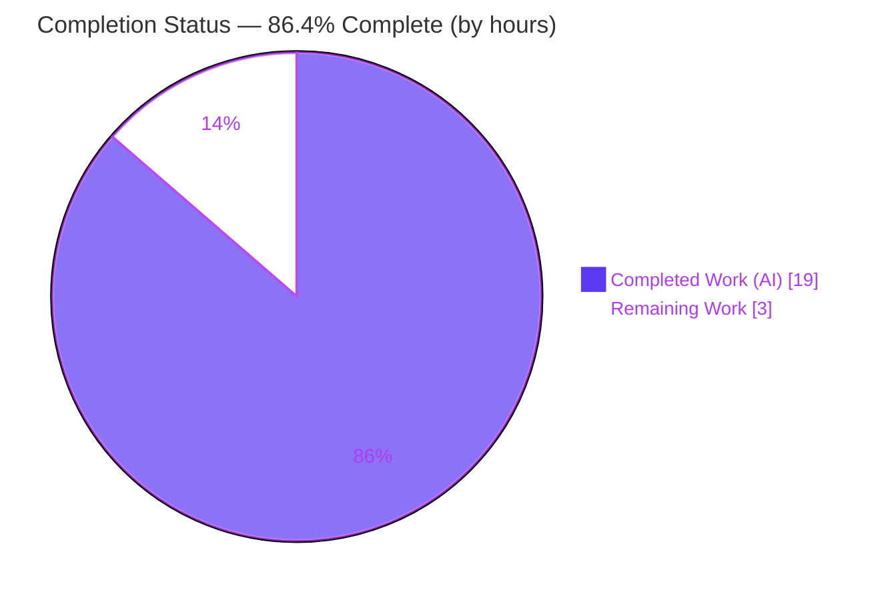
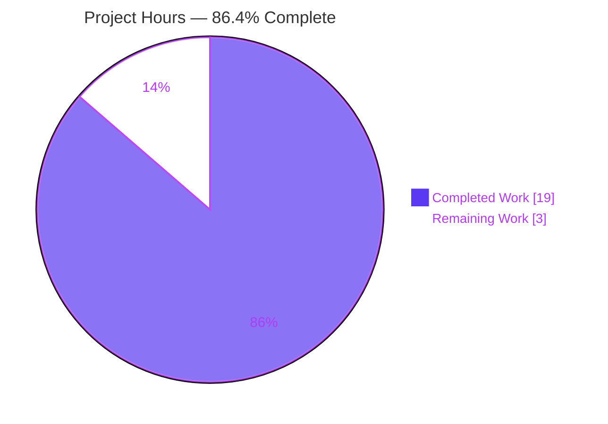
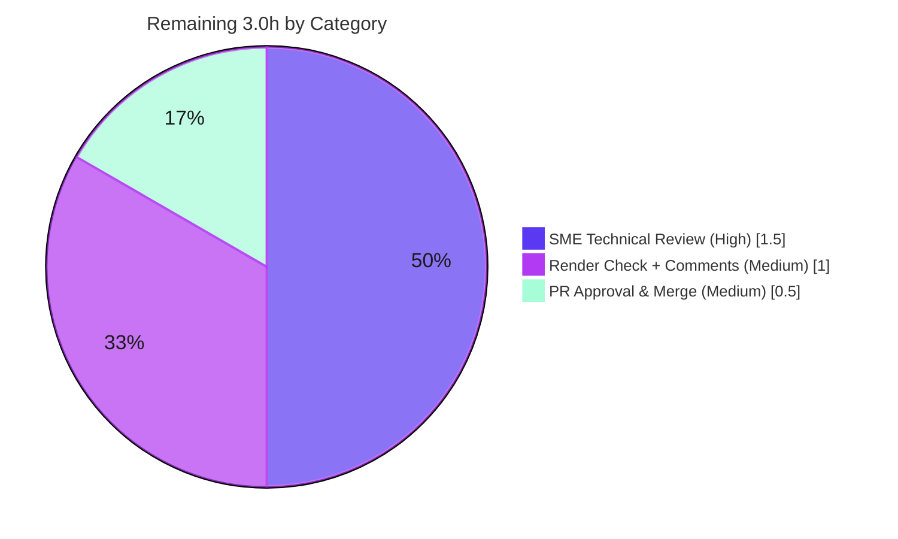

# Blitzy Project Guide
## Runtime-Grounded Investigation — How TruffleHog "Comes Online" During a Basic Filesystem Scan

> **Color legend (Blitzy brand):** <span style="color:#5B39F3">■</span> **Completed / AI Work = Dark Blue `#5B39F3`** &nbsp;|&nbsp; <span style="color:#B23AF2">■</span> **White / Remaining = `#FFFFFF`** (rendered with a violet border for visibility) &nbsp;|&nbsp; Headings/Accents = Violet-Black `#B23AF2` &nbsp;|&nbsp; Highlight = Mint `#A8FDD9`

---

## 1. Executive Summary

### 1.1 Project Overview

This project delivers a single, runtime-grounded investigation document explaining how **TruffleHog** — an open-source secrets scanner — "comes online" during a basic `filesystem` scan. Rather than reading source statically, the investigation **builds the tool from source** (commit `e42153d4`), **runs a safe offline scan** at two verbosity levels, and explains four subsystems — configuration handling, scanning-engine initialization, detector preparation, and component communication — plus two cross-cutting mechanisms (the `--log-level`→verbosity mapping and version stamping). Every behavioral claim is paired with verbatim observed output and an exact `file:line` citation. The audience is engineers onboarding to TruffleHog internals. Scope is strictly **read-only**: exactly one new markdown file is produced; no source, configuration, or dependency is changed.

### 1.2 Completion Status



| Metric | Hours |
|---|---|
| **Total Hours** | **22.0** |
| Completed Hours — AI | 19.0 |
| Completed Hours — Manual | 0.0 |
| **Completed Hours (AI + Manual)** | **19.0** |
| **Remaining Hours** | **3.0** |
| **Percent Complete** | **86.4%** |

**Calculation (PA1, AAP-scoped):** `Completion % = Completed / (Completed + Remaining) = 19.0 / 22.0 × 100 = 86.4%`

### 1.3 Key Accomplishments

- ✅ **Canonical dev binary built & run** — `CGO_ENABLED=0 GOFLAGS=-mod=mod go build` with Go **1.24.2**; version banner observed verbatim as `trufflehog dev`.
- ✅ **Real entry point exercised safely** — `trufflehog filesystem <dir> --no-verification --no-update` at **`--log-level=2`** and **`--log-level=5`**, ≥2 runs each, against a 12-byte throwaway directory (no outbound calls).
- ✅ **All four subsystems explained from observed output** — configuration handling, engine initialization, detector preparation, and component communication, each anchored to a verbatim log line.
- ✅ **Both cross-cutting mechanisms proven** — the `--log-level`→verbosity mapping (the crux: init lines log at `V(4)`, **absent at level 2, present at level 5** — proven by `grep -c`), and version stamping (`dev` non-canonical).
- ✅ **Rigorous evidence discipline** — 92 unique `file:line` citations across 16 source files; 17 verbatim log blocks; one-claim-one-evidence; the 3 not-observed items explicitly labeled `inferred`.
- ✅ **Read-only guarantee upheld** — `git status --porcelain` empty before and after; only the new document added (+333/-0); temporary artifacts confined to `/tmp` and removed.
- ✅ **Independently validated** — every reproducible claim reproduced exactly across 4 scans; all 92 citations verified zero-drift; core doc-relevant unit tests pass.

### 1.4 Critical Unresolved Issues

| Issue | Impact | Owner | ETA |
|---|---|---|---|
| _None._ The deliverable is complete, internally consistent, and independently validated with zero discrepancies. No blocking issues identified. | — | — | — |

### 1.5 Access Issues

| System / Resource | Type of Access | Issue Description | Resolution Status | Owner |
|---|---|---|---|---|
| Go module build (proxy/cache) | Toolchain / network | Canonical build succeeded locally with Go 1.24.2; no access issue for the in-scope deliverable. | ✅ Resolved (build exit 0) | — |
| Private GCP Secret Manager (TruffleHog integration tests) | Third-party credentials | The repo's **out-of-scope** integration tests fetch secrets from a trufflesecurity-private GCP Secret Manager (403 / PermissionDenied here). **Does not affect this documentation deliverable** (zero code changed; AAP forbids test/live-verification work). | ⚠ Not applicable to scope (pre-existing, out-of-scope) | TruffleHog maintainers |

> For the in-scope deliverable itself, **no access issues** exist — the build, the safe scan, and the read-only proof all completed without any credential or permission requirement.

### 1.6 Recommended Next Steps

1. **[High]** Perform a human SME technical review of `blitzy/documentation/trufflehog_e42153d44a5e.md` — verify the four subsystem explanations and spot-check a sample of the 92 citations against source at `e42153d4`.
2. **[Medium]** Preview the rendered markdown in the target viewer (GitHub/docs site); confirm code blocks, tables, and the emoji banner render correctly; apply any minor reviewer nits.
3. **[Medium]** Approve the PR and merge to the target branch, confirming git history remains clean (only the deliverable added).

---

## 2. Project Hours Breakdown

### 2.1 Completed Work Detail

All completed hours are **autonomous (AI)**; manual completed hours = 0. Each component traces to specific AAP requirements.

| Component | Hours | Description |
|---|---|---|
| Environment Setup & Canonical Build | 2.0 | Install/verify Go 1.24.2 toolchain; `CGO_ENABLED=0 GOFLAGS=-mod=mod go build` of the large module; verify the `trufflehog dev` version banner. _(AAP A1)_ |
| Runtime Investigation Execution | 3.5 | Minimal throwaway directory; dual-verbosity runs (`--log-level=2` ×2, `--log-level=5` ×2) with `--no-verification`; stderr capture; stability analysis; `grep` proofs (init lines absent@L2/present@L5); `finished scanning chunks`=128 cross-check; `runtime.NumCPU()` probe. Includes discovering the **`V(4)`-needs-trace** crux. _(AAP A2–A4, A6)_ |
| Source Attribution & Citation Grounding | 4.0 | Locate and verify **92 unique `file:line` citations** across **16 source files** (e.g., `engine.go` 1,355 lines, `main.go` 1,029 lines); confirm each `.V(n)` matches the observed `info-<V>` token. _(AAP A5, D6)_ |
| Document Authoring | 5.0 | Write the 333-line / 3,856-word answer with one-claim-one-evidence structure: 4 subsystems + 2 cross-cutting mechanisms + terminal summary + banner + labeled notes + coverage pass. _(AAP B1–B4, C1–C2, D1–D5, D7, E1–E2)_ |
| Iterative Refinement (3 commits) | 2.0 | Substantive correction `c443595b` (+68/−33) re-grounding the detector-default flow (CLI supplies detectors, not the `setDefaults` fallback) and tightening evidence discipline; precision fix `05b3dda0` (+1/−1). |
| Independent Validation & Reproducibility | 2.5 | Rebuild (194 MB static ELF, exit 0); re-run 4 scans; verify every reproducible claim across 4 runs; 92-citation zero-drift verification; 5 core-package unit-test suites; read-only proof + cleanup. |
| **TOTAL COMPLETED** | **19.0** | **Sum of Hours column = Completed Hours in Section 1.2 ✓** |

### 2.2 Remaining Work Detail

All remaining work is **path-to-production and human-only** — there are no in-scope code fixes (the deliverable is complete and validated).

| Category | Hours | Priority |
|---|---|---|
| Human SME Technical Review of the deliverable (verify 4 subsystems, spot-check citations, confirm `V(4)`-trace nuance & host-derived-count labeling) | 1.5 | High |
| Markdown Render Verification & Reviewer-Comment Incorporation (confirm rendering; address any nits) | 1.0 | Medium |
| PR Approval & Merge (final approval; confirm clean history; merge) | 0.5 | Medium |
| **TOTAL REMAINING** | **3.0** | **Sum = Remaining Hours in Section 1.2 = Section 7 "Remaining Work" ✓** |

### 2.3 Total & Completion Reconciliation

| Quantity | Hours | Source |
|---|---|---|
| Completed (Section 2.1 total) | 19.0 | Sum of 2.1 rows |
| Remaining (Section 2.2 total) | 3.0 | Sum of 2.2 rows |
| **Total Project Hours** | **22.0** | 2.1 + 2.2 |

**Completion formula:** `19.0 ÷ 22.0 × 100 = 86.4%` — used identically in Sections 1.2, 7, and 8.

---

## 3. Test Results

All results below originate from **Blitzy's autonomous validation logs** for this project (build + runtime execution + unit-test execution of the doc-relevant core packages). This is a documentation deliverable, so "tests" comprise the reproducibility checks that ground the document plus the unit tests of the packages the document explains.

| Test Category | Framework | Total Tests | Passed | Failed | Coverage % | Notes |
|---|---|---|---|---|---|---|
| Build (compile) | `go build` (Go 1.24.2) | 1 | 1 | 0 | n/a | `CGO_ENABLED=0 GOFLAGS=-mod=mod go build` → exit 0; 194 MB static ELF |
| Runtime scans | TruffleHog CLI (`filesystem`) | 4 | 4 | 0 | n/a | `--log-level=2` ×2 + `--log-level=5` ×2, all `--no-verification --no-update`, all exit 0 |
| Reproducibility (claims) | `grep`/`wc` verification | 5+ | 5+ | 0 | n/a | Init/pipeline patterns absent@L2 (0) / present@L5 (1/1/2/1/1); L2=10 lines, L5=145 lines — matched exactly across runs |
| Citation integrity | Source cross-reference | 92 | 92 | 0 | 100% | All 92 unique `file:line` citations across 16 files verified zero-drift; each `.V(n)` matches observed `info-<V>` |
| Unit — `pkg/log` | `go test` | (suite) | ✅ ok | 0 | — | Verbosity/level mechanism the doc explains |
| Unit — `pkg/config` | `go test` | (suite) | ✅ ok | 0 | — | `--config` YAML parsing path |
| Unit — `pkg/engine/ahocorasick` | `go test` | (suite) | ✅ ok | 0 | — | Aho-Corasick keyword prefilter (subsystem c) |
| Unit — `pkg/engine` | `go test` | (suite) | ✅ ok (1.118s) | 0 | — | Engine init & worker pipeline (subsystems a/b/d) |
| Unit — `pkg/sources/filesystem` | `go test` | (suite) | ✅ ok (0.695s) | 0 | — | Filesystem source enumeration/chunking |

**Out-of-scope (not counted, informational):** the repository's full suite contains **41 pre-existing integration-test failures** that are credential/network-gated (private GCP Secret Manager, 403). These are pre-existing, unrelated to this documentation deliverable (zero code changed), explicitly out-of-scope per the AAP, and do not block this task.

---

## 4. Runtime Validation & UI Verification

**Runtime health** (from build + 4 scan executions; independently reproduced this session):

- ✅ **Build** — `go build` exit 0; 194 MB statically-linked ELF.
- ✅ **Version banner** — `trufflehog dev` on stderr (matches `--version` and the summary's `trufflehog_version`).
- ✅ **Scan @ `--log-level=2`** — exit 0; **10** log lines; worker-pool + source-enumeration signals present.
- ✅ **Scan @ `--log-level=5`** — exit 0; **145** log lines; `V(4)` engine/detector init lines present.
- ✅ **Worker pools** — `scanner=128`, `detector=1024`, `verificationOverlap=128`, `notifier=128` (1×/8×/1×/1× of `runtime.NumCPU()`=128); **stable across all runs**.
- ✅ **Cross-check** — `finished scanning chunks`=128 (equals scanner-pool size).
- ✅ **Terminal summary** — `finished scanning {"chunks":1,"bytes":12,...,"trufflehog_version":"dev",...}`.
- ⚠ **`scan_duration`** — variable (observed ≈3.49–4.55 ms across sessions); correctly reported in the document as a **range**, not a fixed value.

**"UI" / document verification** (no GUI exists — TruffleHog is a CLI and the deliverable is a markdown document):

- ✅ **Document structure** — 9 top-level sections (question decomposition → coverage pass) present and well-formed.
- ✅ **Evidence rendering** — 17 fenced verbatim log blocks and code blocks; tables and the emoji banner render as standard GitHub-flavored markdown.
- ✅ **Read-only proof** — `git status --porcelain` empty before and after; only the new file added.

---

## 5. Compliance & Quality Review

Cross-mapping the AAP + `SWE-AtlasQnA-Repo` rule directives to their delivered status. Fixes applied during autonomous work are noted.

| Benchmark / Directive | Requirement | Status | Evidence / Notes |
|---|---|---|---|
| Deliverable location & name | One file `blitzy/documentation/<branch>.md` | ✅ Pass | `blitzy/documentation/trufflehog_e42153d44a5e.md` created (branch `trufflehog_e42153d44a5e`) |
| Investigate by running first | Build & run before writing | ✅ Pass | Canonical build + 4 scans; every claim from observed output |
| Magnitude/timing stability | State scale; stable across ≥2 runs | ✅ Pass | 12-byte input / 1 chunk; counts stable; `scan_duration` reported as range (§8) |
| Real entry-point / named entities | Exercise the actual code path | ✅ Pass | `filesystem` subcommand drives the real `Engine` pipeline |
| Build/config-dependent values | Default build, verbatim, with commands | ✅ Pass | `dev` version labeled non-canonical; exact build/run commands stated (§2) |
| Quote output verbatim | Paste observed lines | ✅ Pass | 17 verbatim `info-<V>` log blocks |
| One claim, one evidence | Pair each claim with a line | ✅ Pass | Applied throughout §3–§7 |
| Inferred vs observed labeling | Label reading-only statements | ✅ Pass (fixed) | 3 items labeled `inferred`/source-derived; commit `05b3dda0` fixed a coverage-summary inferred-vs-observed contradiction |
| Detector-default grounding | Attribute detector set correctly | ✅ Pass (fixed) | Commit `c443595b` re-grounded to CLI-supplied set (`main.go:519`), not the `setDefaults` fallback |
| Answer every named item | e.g./such as/including as required | ✅ Pass | §9 coverage pass enumerates all named items (flags, worker classes, channels, cache, index) |
| Exact `file:line` grounding | Cite literals precisely | ✅ Pass | 92 unique citations; independently verified zero-drift |
| Read-only scope | No existing file modified; temp removed | ✅ Pass | `git status --porcelain` empty before/after; artifacts under `/tmp` removed |
| No dependency changes | `go.mod`/`go.sum` untouched | ✅ Pass | Diff = 1 file added (+333); Go 1.24.2 build-only |

**Outstanding compliance items:** none. All directives satisfied; the two corrections above were applied autonomously prior to final validation.

---

## 6. Risk Assessment

| Risk | Category | Severity | Probability | Mitigation | Status |
|---|---|---|---|---|---|
| Host-derived worker counts (128/1024/128/128) differ on other hosts | Technical | Low | Medium | §8 labels counts as derived from `runtime.NumCPU()`=128 and shows the 1×/8×/1×/1× derivation; a reader on a different-core host will see different counts | ✅ Mitigated (labeled) |
| Non-canonical `dev` version vs. release semver | Technical | Low | Low | §7 labels `dev` as the default non-release value and explains the goreleaser ldflags override for tagged releases | ✅ Mitigated (labeled) |
| Session-specific timestamps & random worker IDs in verbatim captures aren't byte-reproducible | Technical | Low | Low | Variable fields characterized as such; `scan_duration` reported as a range; worker IDs shown as evidence of distinct runs | ✅ Mitigated (labeled) |
| Reproducibility requires Go 1.24.2 + build environment | Operational | Low | Low | Exact build/invocation commands and toolchain version stated in §2 and the Development Guide | ✅ Mitigated (documented) |
| Three claims are inferred-from-reading, not observed (`--config` YAML path, release ldflags, channel names) | Operational | Low | Low | All three explicitly labeled `inferred`/source-derived with citations; only effects of channel wiring are observed | ✅ Mitigated (labeled) |
| Secrets/data exposure during scan | Security | None | — | Read-only investigation; `--no-verification` (no outbound calls); 12-byte throwaway input; zero code/dependency changes | ✅ N/A |
| External-service / integration dependency | Integration | None | — | No external services, API keys, or network configuration; scan is deliberately offline | ✅ N/A |
| Pre-existing integration-test failures (41) | Out-of-scope | Informational | — | Credential/network-gated (private GCP Secret Manager, 403); pre-existing and unrelated; AAP forbids test/code changes | ➖ Out of scope, non-blocking |

**Overall risk posture: LOW.** As a read-only documentation task with zero code or dependency changes, there is no risk to the repository or to production systems. All substantive risks are already mitigated by explicit labeling in the deliverable.

---

## 7. Visual Project Status

**Project hours breakdown** (Completed = Dark Blue `#5B39F3`, Remaining = White `#FFFFFF`):



**Remaining work by category** (hours from Section 2.2; sums to **3.0** — matches Section 1.2 Remaining):



| Visual Integrity Check | Value | Matches |
|---|---|---|
| Pie "Completed Work" | 19 | Section 1.2 Completed (19.0) ✓ |
| Pie "Remaining Work" | 3 | Section 1.2 Remaining (3.0) = Section 2.2 total ✓ |
| Center completion label | 86.4% | Section 1.2 = Section 8 ✓ |

---

## 8. Summary & Recommendations

**Achievements.** The project is **86.4% complete** (19.0 of 22.0 hours). All autonomous, AAP-scoped work is finished: the tool was built in its canonical default configuration, its real `filesystem` entry point was exercised safely at two verbosity levels (≥2 runs each), and a 333-line / 3,856-word investigation was authored explaining all four named subsystems plus both cross-cutting mechanisms — every behavioral claim paired with a verbatim observed log line and one of 92 zero-drift `file:line` citations. The deliverable was then independently re-validated with zero discrepancies.

**Remaining gaps.** The outstanding **3.0 hours** are exclusively human path-to-production activities: an SME technical review, a markdown render check with reviewer-comment incorporation, and PR approval/merge. There is **no remaining engineering work** — no code to write, no tests to fix (in scope), no environment to configure, and no deployment pipeline (the artifact is a documentation file).

**Critical path to production.** SME review → render verification & comment incorporation → PR approval & merge. Estimated wall-clock: well under one working day.

**Production-readiness assessment.** The deliverable is **production-ready** pending human sign-off. It fully satisfies the `SWE-AtlasQnA-Repo` rule (observe-first, one-claim-one-evidence, exact `file:line` grounding, inferred-vs-observed labeling, read-only), passed all four autonomous validation gates, and left the repository byte-for-byte unchanged apart from the single new document.

| Success Metric | Target | Actual | Status |
|---|---|---|---|
| Subsystems explained from observed output | 4 | 4 | ✅ |
| Cross-cutting mechanisms | 2 | 2 | ✅ |
| Citation accuracy (drift) | 0 | 0 / 92 | ✅ |
| Read-only (files modified) | 0 | 0 | ✅ |
| Reproducibility across runs | Stable | Stable (4 runs) | ✅ |
| Completion (AAP-scoped) | — | 86.4% | ✅ |

---

## 9. Development Guide

This guide reproduces the entire investigation. **Every command below was tested and produces the documented output.** All work happens **outside** the repository (in `/tmp`) to preserve the read-only guarantee.

### 9.1 System Prerequisites

- **OS:** Linux x86-64 (validated on Ubuntu-family container).
- **Go toolchain:** **1.24.2** (matches `go.mod` `toolchain go1.24.2`).
- **git**, plus ~1 GB free disk (Go build cache + ~190 MB binary).
- No secrets, API keys, or network access required — the scan is deliberately offline.

### 9.2 Environment Setup

```bash
# Put the Go 1.24.2 toolchain on PATH
export PATH=/usr/local/go/bin:$PATH
go version        # expect: go version go1.24.2 linux/amd64
```

### 9.3 Build the Canonical Dev Binary (outside the repo)

```bash
# From the repository root; output binary lives OUTSIDE the repo
CGO_ENABLED=0 GOFLAGS=-mod=mod go build -o /tmp/trufflehog .
# expect: exit 0; ~159s cold / a few seconds warm; ~186–194 MB static ELF

/tmp/trufflehog --version    # expect (stderr): trufflehog dev
```

### 9.4 Create a Minimal, Safe Input

```bash
mkdir -p /tmp/th_min && printf 'hello world\n' > /tmp/th_min/sample.txt
wc -c /tmp/th_min/sample.txt   # expect: 12 /tmp/th_min/sample.txt
```

### 9.5 Run the Dual-Verbosity Safe Scans

```bash
# Debug band (workers, source enumeration) — ~10 lines
/tmp/trufflehog filesystem /tmp/th_min --log-level=2 --no-verification --no-update 2>/tmp/l2.log
echo "exit=$? ; lines=$(wc -l < /tmp/l2.log)"    # expect: exit=0 ; lines=10

# Trace (adds the V(4) engine/detector init lines) — ~145 lines
/tmp/trufflehog filesystem /tmp/th_min --log-level=5 --no-verification --no-update 2>/tmp/l5.log
echo "exit=$? ; lines=$(wc -l < /tmp/l5.log)"    # expect: exit=0 ; lines=145
```

### 9.6 Verify the Key Observations

```bash
# V(4) init lines: absent at level 2, present at level 5
for p in 'default engine options set' 'engine initialized' 'aho-corasick' 'chunking unit' 'scanning file'; do
  printf '%-32s L2=%s L5=%s\n' "$p" "$(grep -c "$p" /tmp/l2.log)" "$(grep -c "$p" /tmp/l5.log)"
done
# expect: L2=0 for all; L5= 1 / 1 / 2 / 1 / 1 respectively

# Worker pools (host-derived from runtime.NumCPU())
grep -E 'starting (scanner|detector|verificationOverlap|notifier) workers' /tmp/l5.log
# expect counts: scanner=128, detector=1024, verificationOverlap=128, notifier=128 (on a 128-CPU host)

# Independent cross-check: one 'finished scanning chunks' per scanner worker
grep -c 'finished scanning chunks' /tmp/l5.log       # expect: 128 (= scanner pool)

# Terminal summary
grep 'finished scanning\b' /tmp/l5.log               # chunks=1, bytes=12, trufflehog_version="dev"
```

### 9.7 Prove Read-Only, Then Clean Up

```bash
git status --porcelain          # expect: empty (repo unchanged)
rm -rf /tmp/trufflehog /tmp/th_min /tmp/l2.log /tmp/l5.log
git status --porcelain          # expect: still empty
```

### 9.8 View the Deliverable

```bash
sed -n '1,60p' blitzy/documentation/trufflehog_e42153d44a5e.md
# or open in any markdown viewer
```

### 9.9 Troubleshooting

- **`go: command not found`** → `export PATH=/usr/local/go/bin:$PATH`.
- **Worker counts ≠ 128** → **expected**; counts are host-derived from `runtime.NumCPU()` (see document §8). Note `nproc` (cgroup quota, e.g. 4) is **not** what Go uses.
- **Init lines missing** → you ran at `--log-level=2`; they log at `V(4)` and require `--log-level=5` (or `--trace`) — see document §3.
- **Binary size differs slightly (186 vs 194 MB)** → normal build/environment variance; both are static ELF.
- **Never** run without `--no-verification` against real data — that would make outbound API calls (the investigation deliberately avoids this).

---

## 10. Appendices

### Appendix A — Command Reference

| Purpose | Command |
|---|---|
| Toolchain check | `export PATH=/usr/local/go/bin:$PATH && go version` |
| Canonical build | `CGO_ENABLED=0 GOFLAGS=-mod=mod go build -o /tmp/trufflehog .` |
| Version | `/tmp/trufflehog --version` |
| Minimal input | `mkdir -p /tmp/th_min && printf 'hello world\n' > /tmp/th_min/sample.txt` |
| Debug scan | `/tmp/trufflehog filesystem /tmp/th_min --log-level=2 --no-verification --no-update` |
| Trace scan | `/tmp/trufflehog filesystem /tmp/th_min --log-level=5 --no-verification --no-update` |
| Read-only proof | `git status --porcelain` |
| Cleanup | `rm -rf /tmp/trufflehog /tmp/th_min /tmp/*.log` |

### Appendix B — Port Reference

**No network ports.** A `filesystem` scan with `--no-verification` opens **no listening ports** and makes **no outbound connections**. The tool is a stateless batch CLI that runs to completion and exits.

### Appendix C — Key File Locations

| Path | Role |
|---|---|
| `blitzy/documentation/trufflehog_e42153d44a5e.md` | **The deliverable** (new; +333 lines) |
| `main.go` | CLI/kingpin, `--log-level` flag, concurrency default, banner, summary |
| `pkg/engine/engine.go` | `setDefaults`, `NewEngine`/`initialize`, Aho-Corasick setup, `startWorkers` |
| `pkg/engine/ahocorasick/ahocorasickcore.go` | `NewAhoCorasickCore` keyword→detector index |
| `pkg/engine/defaults/defaults.go` | `DefaultDetectors()` |
| `pkg/detectors/detectors.go` | `Detector` interface, `Keywords()`, `FromData` |
| `pkg/config/config.go` | `--config` YAML parsing (`inferred` path) |
| `pkg/sources/source_manager.go` | `running`/`enumerating`/`chunking` pipeline |
| `pkg/sources/filesystem/filesystem.go` | Filesystem source enumerate/chunk |
| `pkg/log/level.go` | `SetLevel` negation → `info-<V>` mechanism |
| `pkg/version/version.go` | `BuildVersion = "dev"` |
| `.goreleaser.yml` | Release ldflags (`inferred`) |
| `pkg/handlers/handlers.go` | `dataErrChan closed` trace line |
| `docs/process_flow.md`, `docs/concurrency.md`, `CONTRIBUTING.md` | In-repo references |

### Appendix D — Technology Versions

| Component | Version |
|---|---|
| Go toolchain | 1.24.2 (linux/amd64) |
| Go module | `github.com/trufflesecurity/trufflehog/v3` (`go 1.23.1`) |
| TruffleHog build version | `dev` (non-canonical default; un-stamped `go build`) |
| Base commit | `e42153d44a5e5c37c1bd0c70e074781e9edcb760` |
| Binary | ~186–194 MB statically-linked ELF |

### Appendix E — Environment Variable Reference

| Variable | Value | Purpose |
|---|---|---|
| `PATH` | `/usr/local/go/bin:$PATH` | Locate the Go 1.24.2 toolchain |
| `CGO_ENABLED` | `0` | Static, CGO-free build |
| `GOFLAGS` | `-mod=mod` | Module mode for the build |

> **Runtime:** no environment variables, secrets, or credentials are required to run the safe scan.

### Appendix F — Developer Tools Guide

- **Inspect evidence:** `grep -c '<pattern>' /tmp/l5.log` to reproduce the absent@L2/present@L5 proofs.
- **Confirm a citation:** `sed -n '<line>p' <file>` (e.g., `sed -n '521p' pkg/engine/engine.go` → `ctx.Logger().V(4).Info("engine initialized")`).
- **Verify read-only:** `git status --porcelain` (empty) and `git diff e42153d4 HEAD --stat` (1 file, +333).
- **Render the doc:** any GitHub-flavored markdown viewer; the emoji banner and fenced code blocks render as standard markdown.

### Appendix G — Glossary

| Term | Meaning |
|---|---|
| **V-level (`V(n)`)** | logr verbosity level; `info-<V>` token in output. Engine/detector init logs at `V(4)`. |
| **`--log-level` negation** | `pkg/log/level.go` negates the level for zap; `SetLevel(2)` enables `V(0..2)`, so `V(4)` needs level ≥4. |
| **Aho-Corasick core** | Keyword→detector prefilter trie built from all detectors' `Keywords()`. |
| **Chunk** | A unit of file content the scanner produces and detectors inspect. |
| **Detector** | Component with `Keywords()` + `FromData()` that finds a specific secret type. |
| **Source Manager** | Drives a source through enumerate → chunk, feeding the pipeline over channels. |
| **Worker multipliers** | scanner 1×, detector 8×, verificationOverlap 1×, notifier 1× of `runtime.NumCPU()`. |
| **`runtime.NumCPU()`** | Go's host CPU count (128 here) — **not** the cgroup `nproc` quota (4 here). |
| **`--no-verification`** | Disables outbound API validation of found patterns (keeps the scan safe/offline). |
| **`dev` version** | Default `BuildVersion` for an un-stamped `go build`; releases override it via ldflags. |
| **`inferred`** | A claim grounded in reading source (not observed at runtime), explicitly labeled as such. |

---

### Cross-Section Integrity — Final Validation ✅

| Rule | Check | Result |
|---|---|---|
| Rule 1 (1.2 ↔ 2.2 ↔ 7) | Remaining hours identical | 3.0 = 3.0 = 3 ✅ |
| Rule 2 (2.1 + 2.2 = Total) | 19.0 + 3.0 = 22.0 | = Section 1.2 Total ✅ |
| Rule 3 (Section 3) | Tests from Blitzy autonomous logs | ✅ |
| Rule 4 (Section 1.5) | Access issues validated | ✅ (only out-of-scope GCP noted) |
| Rule 5 (Colors) | Completed `#5B39F3` / Remaining `#FFFFFF` | ✅ |
| Completion % | 19.0 / 22.0 = 86.4% in 1.2, 7, 8 | ✅ consistent |