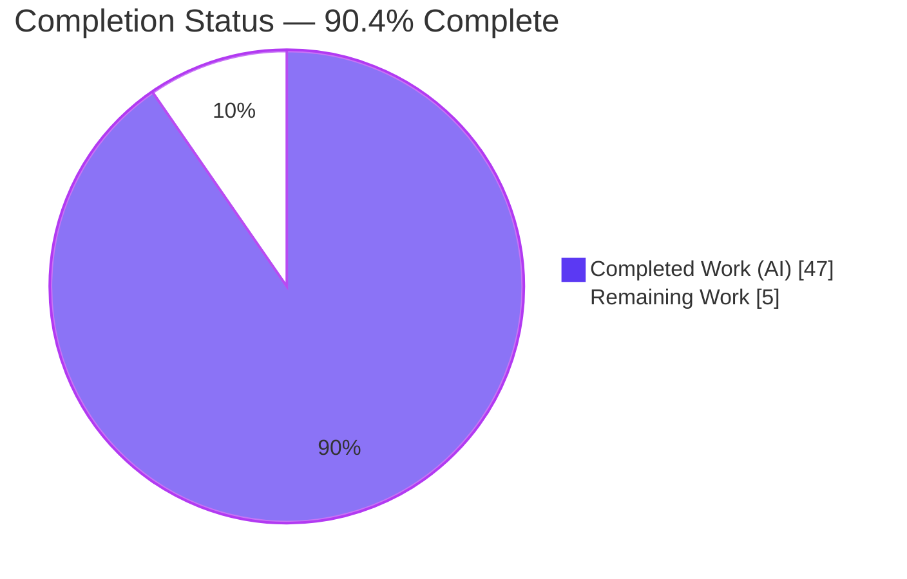
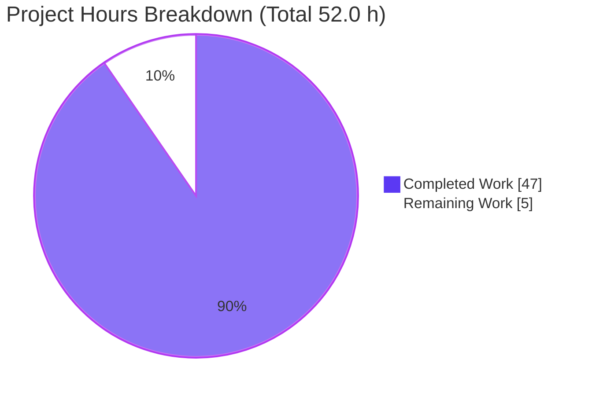
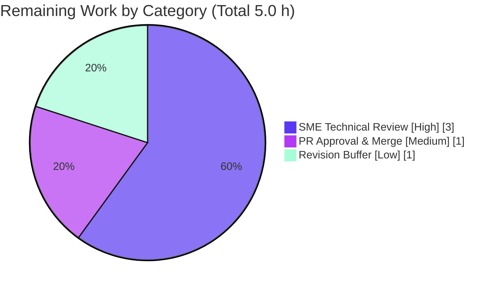

# Blitzy Project Guide — TruffleHog Detection-Behavior Q&A

> **Deliverable:** `blitzy/documentation/trufflehog_e42153d44a5e.md` — a single, runtime-verified technical answer document.
> **Task type:** Read-only, investigative **documentation** for TruffleHog (`github.com/trufflesecurity/trufflehog/v3`).
> **Branch:** `blitzy-7e8842aa-404b-4396-ab50-44171534dd25` · **Base commit:** `e42153d4` · **HEAD:** `f2708997`
>
> **Color legend (Blitzy brand):** <span style="color:#5B39F3">■</span> **Completed / AI Work = Dark Blue `#5B39F3`** · <span style="color:#B23AF2">■</span> Headings/Accents = Violet-Black `#B23AF2` · Remaining / Not Completed = White `#FFFFFF` · <span style="color:#A8FDD9">■</span> Highlight = Mint `#A8FDD9`

---

## 1. Executive Summary

### 1.1 Project Overview

This project delivers one comprehensive, **runtime-verified** answer document explaining *why* the open-source secrets scanner **TruffleHog** detects some credentials but misses or treats others differently. It targets security engineers and TruffleHog users who need an evidence-backed account of five behaviors: per-file detection consistency, base64 as false protection, test-fixture credentials that never flag, the "verification disabled for safety" warning, and the exact detection boundaries. The technical scope is deliberately **read-only**: the scanner is built and exercised, but no source is changed. The sole artifact is `blitzy/documentation/trufflehog_e42153d44a5e.md`, in which every claim is grounded in unedited command output and exact `file:line` citations at commit `e42153d4`.

### 1.2 Completion Status



<sub><span style="color:#5B39F3">■</span> Completed = Dark Blue `#5B39F3` · Remaining = White `#FFFFFF`</sub>

| Metric | Hours |
|--------|-------|
| **Total Hours** | **52.0** |
| **Completed Hours (AI + Manual)** | **47.0** (AI 47.0 · Manual 0.0) |
| **Remaining Hours** | **5.0** |
| **Percent Complete** | **90.4%** |

> **Completion formula (PA1, AAP-scoped):** `Completed ÷ (Completed + Remaining) × 100 = 47.0 ÷ 52.0 × 100 = 90.4%`.
> All 12 AAP-specified requirements are complete; the remaining 5.0 h is the human path-to-production gate (technical review + merge), which cannot be autonomously completed.

### 1.3 Key Accomplishments

- ✅ **Single deliverable created** at the exact required path/name — `blitzy/documentation/trufflehog_e42153d44a5e.md` (1,412 lines, ~8,856 words).
- ✅ **Canonical binary built** exactly as the Dockerfile does (`CGO_ENABLED=0 GOTOOLCHAIN=local go build`), exit 0; `--version` → `trufflehog dev` (documented as the expected default).
- ✅ **All five questions answered** with 39 runtime scan experiments and unedited output.
- ✅ **Q1 determinism** proven with 3 identical runs; the AWS **±1024-byte** window pinpointed at the exact 1-byte flip (gap 963 detected → gap 964 missed).
- ✅ **Q2** shows base64 is transparent (finding labeled `Decoder Type: BASE64`); hex/ROT13 evade; gzip defeated by the archive layer (honestly attributed).
- ✅ **Q3** isolates the `example` word list (not entropy) via a 2×2 matrix and independently computed Shannon entropy.
- ✅ **Q4** captures the byte-exact "verification has been disabled" message and the `--allow-verification-overlap` contrast (Misses 1→2).
- ✅ **Q5** documents all ten detection boundaries with detected-vs-missed pairs.
- ✅ **145 `file:line` citations** (81 unique across 22 files) — 0 missing, 0 out-of-range at `e42153d4`.
- ✅ **Read-only mandate honored** — zero source files modified; all temporary artifacts removed; working tree clean.

### 1.4 Critical Unresolved Issues

| Issue | Impact | Owner | ETA |
|-------|--------|-------|-----|
| _None._ No unresolved defects block release or validation. The single defect found during validation (Boundary 8 `UrlEncodedReplacer` prose) was fixed in commit `f2708997` and re-verified. | — | — | — |

### 1.5 Access Issues

| System/Resource | Type of Access | Issue Description | Resolution Status | Owner |
|-----------------|----------------|-------------------|-------------------|-------|
| Truffle Security `trufflehog-testing` GCP project | `secretmanager.versions.access` | ~35 analyzer/source **integration** test packages (and live-verification of the redacted `AKIAZAVB…` key) require Truffle Security's private GCP Secret Manager secrets, unavailable outside their CI. **External-by-design; irrelevant to this read-only documentation deliverable** — the build and CLI runtime, which this task depends on, both succeed. | Accepted (no action needed) | Truffle Security CI |

> All other systems required by this task (Go toolchain, git, filesystem source) are fully accessible. No repository-permission or credential blockers exist for the deliverable.

### 1.6 Recommended Next Steps

1. **[High]** Have a security SME read the full document and validate the five answers against knowledge of TruffleHog behavior (see Section 9 to rebuild and reproduce).
2. **[High]** Spot-check a sample of the 145 `file:line` citations at commit `e42153d4` (e.g., `accesskey.go:L65`, `common.go:L6-7`, `engine.go:L39-42`).
3. **[High]** Optionally rebuild `/tmp/trufflehog` and re-run 2–3 key experiments (Q1 gap 963/964, Q4 default-vs-override) to confirm reproducibility.
4. **[Medium]** Approve the PR and merge the single documentation file; confirm read-only via `git diff --name-status`.
5. **[Low]** Apply any minor review-driven revisions (typos, clarifications, optional added depth).

---

## 2. Project Hours Breakdown

### 2.1 Completed Work Detail

Every component traces to a specific AAP requirement and was delivered autonomously (AI).

| Component | Hours | Description |
|-----------|-------|-------------|
| Canonical build & environment baseline (AAP-1) | 3.0 | Built `/tmp/trufflehog` with `CGO_ENABLED=0 GOTOOLCHAIN=local go build`; recorded version banner (`trufflehog dev`), ELF details, `filesystem --help` flags, and the release-stamping explanation. |
| Q1 — determinism & proximity investigation (AAP-2) | 6.0 | Discovered the AWS **±1024-byte** window (via `MaxCredentialSpan`, not the generic 512); built byte-exact fixtures; demonstrated gap 963 detected / 964 missed, beyond-window miss, chunk straddle, and 3× determinism. |
| Q2 — encoding investigation (AAP-3) | 4.0 | Base64 decode-before-detect (still detected); contrasted raw hex and ROT13 (evade); gzip via the archive layer; enumerated the four decoders. |
| Q3 — false-positive fixtures investigation (AAP-4) | 5.0 | 2×2 real/example × ID/secret matrix; independently computed Shannon entropy to prove the `example` word list (not entropy) is the cause; trace-level capture; `Raw = idMatch`. |
| Q4 — verification-overlap investigation (AAP-5) | 5.0 | Constructed a two-built-in-detector overlap (IpStack + MadKudu on one 32-hex value); captured the byte-exact safety message and the `--allow-verification-overlap` contrast. |
| Q5 — detection boundaries, ten boundaries (AAP-6) | 10.0 | Ten detected-vs-missed studies: ID entropy 3.0, secret entropy 4.25, uppercase-only `idPat`, `--filter-entropy`, ±1024 window, chunk/peek, hex `[a-f0-9]{40}`, `UrlEncodedReplacer`, word list, canary path. |
| Coverage pass + literal inventory + summary tables (AAP-7) | 2.0 | Per-question and canonical-key coverage tables; literal inventory of every key/secret used. |
| Web research — terminology validation (AAP-8) | 2.0 | Confirmed verification-overlap (v3.67.0), the four-decoder set, `--filter-entropy` guidance ("Start with 3.0"), and `--results` defaults against public sources. |
| Document authoring & structure (AAP-9/12) | 5.0 | Authored 1,412 lines of GFM prose, the pipeline Mermaid diagram, and wove in all citations with byte-exact evidence. |
| Code-review-fix cycles (validation) | 4.0 | Addressed review findings F1–F8 (major revision), completed unedited output for two blocks, and corrected the Boundary 8 mechanism. |
| Read-only compliance + temporary cleanup (AAP-10/11) | 1.0 | Kept all fixtures/binary outside the repo tree; removed every temporary artifact; verified byte-for-byte repository integrity. |
| **Total Completed** | **47.0** | |

### 2.2 Remaining Work Detail

All remaining work is human path-to-production; none is autonomously completable.

| Category | Hours | Priority |
|----------|-------|----------|
| Human SME Technical Review (read doc, validate 5 answers, spot-check citations, sanity-check runtime) | 3.0 | High |
| PR Approval & Merge (approve, merge the single file, confirm read-only) | 1.0 | Medium |
| Review-Driven Revision Buffer (typos, clarifications, optional added depth) | 1.0 | Low |
| **Total Remaining** | **5.0** | |

> **Cross-section check:** 2.1 (47.0) + 2.2 (5.0) = **52.0** = Total Hours in §1.2. Remaining **5.0** is identical in §1.2, §2.2, and §7. ✅

### 2.3 Hours Basis & Confidence

- **Methodology:** PA1 (AAP-scoped) + PA2 (engineering-hours). The work universe = the 12 AAP deliverables + documentation path-to-production (human review + merge). No out-of-scope items are counted.
- **Confidence:** **High** for completed work (all deliverables are directly evidenced by committed content, git history, and reproduced runtime output). **High** for remaining work (a well-scoped human review + merge).
- **Completed-hours rationale:** 39 distinct runtime experiments (each requiring fixture construction, execution, and unedited capture) plus deep code reading to surface subtle behaviors (±1024 window, two-detector overlap, entropy-vs-word-list distinction) and 1,412 lines of authored prose.

---

## 3. Test Results

All entries below originate from **Blitzy's autonomous validation logs** for this project and were corroborated by independent re-verification during this review. Because the task is read-only documentation, no application unit tests were authored; the "tests" are the autonomous **build, static-analysis, runtime-experiment, citation-resolution, and coverage** checks that validate the deliverable.

| Test Category | Framework / Tool | Total | Passed | Failed | Coverage | Notes |
|---------------|------------------|-------|--------|--------|----------|-------|
| Build / Compilation | `go build` (CGO_ENABLED=0, Go 1.24.2) | 1 | 1 | 0 | n/a | Canonical binary, exit 0; **reproduced this session in 8.3 s** (warm cache). |
| Static Analysis | `go vet` | key in-scope pkgs | pass | 0 | n/a | Clean (VET_EXIT=0) on AWS / decoders / engine packages. |
| Runtime Scan Experiments | `trufflehog filesystem` CLI | 39 | 39 | 0 | n/a | Q1–Q5 detected/missed pairs; stable output fields; **Q1 adjacent re-reproduced byte-for-byte** (bytes 106, `unverified_secrets` 1). |
| Citation Resolution | `git show e42153d4:<file>` + `sed` | 145 (81 unique) | 145 | 0 | 22/22 files | 0 missing files, 0 out-of-range lines; sample independently re-verified (`idPat`, entropy thresholds, `errOverlap`, `verifyCanary`). |
| Coverage Verification | grep sweep / manual | 29 | 29 | 0 | 100% | 5/5 question headers + 5/5 conclusions + 24/24 named mechanisms present. |
| Boundary-8 Fix Re-test | Fresh Go test (`strings.NewReplacer`) | 2 | 2 | 0 | n/a | Confirmed `UrlEncodedReplacer` is a targeted token replacer; ran twice. |

> **Integrity note:** No traditional pass/fail unit suite applies to a documentation deliverable; the ~35 analyzer/source **integration** packages that fail externally require Truffle Security's private GCP secrets (see §1.5) and are **not** part of this task's test universe.

---

## 4. Runtime Validation & UI Verification

Status legend: ✅ Operational · ⚠ Partial · ❌ Failing

**Runtime health (scanner CLI):**
- ✅ Canonical build produces a statically-linked ELF binary (exit 0; reproduced this session).
- ✅ `trufflehog --version` → `trufflehog dev` (expected default for a plain `go build`).
- ✅ `trufflehog filesystem <path>` runs successfully and emits deterministic detection output.

**Behavioral verification (per question):**
- ✅ **Q1** — Determinism (3 identical runs); ±1024-byte boundary flip at gap 963→964; beyond-window miss; chunk straddle.
- ✅ **Q2** — Base64 detected (`Decoder Type: BASE64`); hex/ROT13 evade; gzip detected via archive layer.
- ✅ **Q3** — 2×2 matrix (example ID dropped, example secret + real ID kept); trace shows `contains term: example`.
- ✅ **Q4** — Default: safety warning printed, verification withheld; override: verification re-enabled (Misses 1→2).
- ✅ **Q5** — All ten boundaries show the expected detected-vs-missed behavior.

**API integration:** ✅ Not applicable by design — every experiment runs with `--no-verification` (or documents the overlap safeguard); no external credential-verification APIs are contacted.

**UI verification:** ⚠ **N/A** — this project has **no web/GUI component**. The only interfaces are the `trufflehog` CLI and the Markdown deliverable; no browser/UI verification is applicable.

---

## 5. Compliance & Quality Review

Cross-mapping the AAP rule set ("SWE-AtlasQnA-Repo") and quality benchmarks to observed outcomes.

| Benchmark / Rule | Status | Progress | Evidence |
|------------------|--------|----------|----------|
| Single deliverable, fixed name & location | ✅ Pass | 100% | `git diff --name-status e42153d4 HEAD` → `A blitzy/documentation/trufflehog_e42153d44a5e.md` only. |
| RUN-first methodology (build & run before writing) | ✅ Pass | 100% | Canonical `/tmp/trufflehog` build + 39 scan experiments; outputs embedded unedited. |
| Read-only source repository (zero source modified) | ✅ Pass | 100% | Only one added file; no source diffs; working tree clean. |
| Reproduce inconsistency with same input (≥2 runs) | ✅ Pass | 100% | Q1 determinism run 3× with identical `unverified_secrets`. |
| Canonical entry point exercised | ✅ Pass | 100% | All experiments use `trufflehog filesystem` (`main.go:L143`). |
| Default/canonical configuration reported | ✅ Pass | 100% | `trufflehog dev` documented as expected default; release-stamping via goreleaser explained. |
| Every condition, not just happy path | ✅ Pass | 100% | Detected **and** missed cases for all boundaries; edge/error paths shown. |
| Complete, unedited output for every claim | ✅ Pass | 100% | Full command + output blocks throughout; two blocks completed during validation (`37af718d`). |
| Exact `file:line` grounding | ✅ Pass | 100% | 145 citations (81 unique, 22 files); 0 missing/out-of-range at `e42153d4`. |
| Coverage pass before finishing | ✅ Pass | 100% | Per-question + canonical-key coverage tables; 24/24 named mechanisms. |
| Cleanup of temporary artifacts | ✅ Pass | 100% | `/tmp/trufflehog`, `/tmp/thqa`, `/tmp/urltest` all absent. |
| Intellectual honesty (label non-canonical / limits) | ✅ Pass | 100% | Synthetic 32-hex labeled non-canonical; gzip attributed to archive layer; redacted key labeled "referenced, not scanned". |

**Fixes applied during autonomous validation:** F1–F8 review findings addressed (`49161019`); complete unedited output restored for two blocks (`37af718d`); Boundary 8 `UrlEncodedReplacer` mechanism corrected to "targeted token replacer" (`f2708997`).

**Outstanding compliance items:** None. All rule-set requirements are satisfied.

---

## 6. Risk Assessment

Overall posture: **LOW.** A read-only, additive documentation change structurally avoids the compilation/test/integration risk classes. No High-severity or blocking risks.

| Risk | Category | Severity | Probability | Mitigation | Status |
|------|----------|----------|-------------|------------|--------|
| Citation line-drift if read against a different commit | Technical | Low | Low | Commit `e42153d4` pinned in the doc; all 145 citations swept | Mitigated |
| Runtime-output reproducibility (timestamps/worker-IDs/durations vary per run) | Technical | Low | Medium | Only detection fields are deterministic; determinism shown 3×; version=dev noted | Mitigated |
| Commit-scoped behaviors (4 decoders, ±1024 window) differ in future versions | Technical | Low | Medium | Explicitly scoped to `e42153d4` | Accepted |
| Credential literals in the doc could be mistaken for live secrets | Security | Medium | Very Low | Uses repo test keys / AWS-doc example / redacted key; all non-functional and shown unverified | Mitigated |
| Doc explains evasion vectors (hex, ROT13, beyond-window) | Security | Low | Low | Behaviors already public in OSS code; defensive/educational value | Accepted |
| Build-environment dependency (Go 1.24.2 + module cache) | Operational | Low | Medium | Exact toolchain documented; no `go.sum` pollution; builds to `/tmp` | Mitigated |
| No CI gate for Markdown (correctness relies on review) | Operational | Low | Medium | Planned human SME review (PROD-1) | Mitigated |
| Private GCP test-secret dependency (integration suite / redacted-key verify) | Integration | Low | N/A (external-by-design) | Transparently documented; irrelevant to doc scope | Accepted |
| No downstream integration (zero runtime deps / importers) | Integration | None | None | Read-only doc has no import graph impact | N/A |

---

## 7. Visual Project Status



<sub><span style="color:#5B39F3">■</span> Completed Work = Dark Blue `#5B39F3` (47.0 h) · Remaining Work = White `#FFFFFF` (5.0 h)</sub>

**Remaining hours by category (from §2.2):**



> **Integrity check:** "Remaining Work" = **5.0 h** = §1.2 Remaining Hours = sum of §2.2 Hours column. "Completed Work" = **47.0 h** = §1.2 Completed Hours = sum of §2.1. ✅

---

## 8. Summary & Recommendations

**Achievements.** The project is **90.4% complete** (47.0 of 52.0 AAP-scoped hours). All 12 AAP-specified requirements are delivered and validated: the canonical binary was built exactly as the Dockerfile does, all five questions are answered with 39 unedited runtime experiments, 145 `file:line` citations resolve cleanly at `e42153d4`, and the read-only mandate is fully honored (one file added, zero source modified, all temporary artifacts removed).

**Remaining gaps.** The outstanding 5.0 h (≈9.6%) is entirely the **human path-to-production** for a documentation deliverable: an SME technical review of the answers and citations, PR approval and merge, and a small revision buffer. No code changes and no defect fixes are required.

**Critical path to production.** (1) SME reads and validates the document → (2) spot-checks citations and, optionally, re-runs 2–3 experiments → (3) approves and merges. Section 9 provides the exact, tested commands.

**Success metrics.** Deterministic detection reproduced (3/3); ±1024-byte boundary demonstrated to the byte; base64 transparency confirmed; `example` word-list suppression proven distinct from entropy; verification-overlap safeguard toggled on/off; all ten Q5 boundaries shown as detected-vs-missed pairs.

**Production-readiness assessment.** **Ready for human review.** The deliverable is accurate, complete, coverage-verified, and committed; the repository is byte-for-byte identical to base commit `e42153d4` except for the single documentation file. Per Blitzy policy, autonomous completion is capped below 100% pending human sign-off — hence 90.4%.

| Metric | Value |
|--------|-------|
| AAP requirements complete | 12 / 12 |
| Completion (AAP-scoped) | 90.4% |
| Source files modified | 0 |
| Runtime experiments reproduced | 39 |
| Citations verified @ `e42153d4` | 145 (0 failing) |
| Blocking issues | 0 |

---

## 9. Development Guide

All commands below were **tested during this review**. Build outside the repository tree to preserve the read-only mandate.

### 9.1 System Prerequisites

- OS: Linux or macOS (validated on Linux x86-64).
- **Go 1.24.2** (matches `go.mod` `toolchain go1.24.2` and CI). Verify:
  ```bash
  go version
  # expected: go version go1.24.2 linux/amd64
  ```
- `git`; ~26 MB checkout; a warm Go module cache (first cold build fetches modules per `go.sum`).
- No CGO, system libraries, databases, services, or network ports are required.

### 9.2 Environment Setup

```bash
# From the repository root (branch blitzy-7e8842aa-...-dd25 @ HEAD f2708997)
git rev-parse --abbrev-ref HEAD      # blitzy-7e8842aa-404b-4396-ab50-44171534dd25
git rev-parse --short HEAD           # f2708997
```
No environment variables are required to read or reproduce the document.

### 9.3 Build the Canonical Binary

```bash
# Build EXACTLY as the Dockerfile does, writing OUTSIDE the repo tree:
CGO_ENABLED=0 GOTOOLCHAIN=local go build -o /tmp/trufflehog .
echo "exit=$?"                       # exit=0

/tmp/trufflehog --version            # trufflehog dev  (expected default; not an error)
file /tmp/trufflehog                 # ELF 64-bit LSB executable, x86-64 ... statically linked
```
> `GOTOOLCHAIN=local` pins the installed Go 1.24.2 and prevents any toolchain download. A plain `go build` prints `trufflehog dev` because release version stamping is applied only by goreleaser ldflags (`.goreleaser.yml`).

### 9.4 Reproduce an Experiment (verified this session)

```bash
mkdir -p /tmp/pgtest/adj
printf 'aws_access_key_id = ABIAS9L8MS5IPHTZPPUQ\naws_secret_access_key = v2QPKHl7LcdVYsjaR4LgQiZ1zw3MAnMyiondXC63\n' \
  > /tmp/pgtest/adj/creds.txt
/tmp/trufflehog filesystem /tmp/pgtest/adj --no-verification --results=verified,unverified,unknown
```
Expected (key fields): `Detector Type: AWS`, `Decoder Type: PLAIN`, `Raw result: ABIAS9L8MS5IPHTZPPUQ`, and a summary with `"bytes": 106, "unverified_secrets": 1, "trufflehog_version": "dev"`.

Useful flags for the other questions: `--log-level=2` (trace filter decisions), `--allow-verification-overlap` (Q4), `--filter-entropy=<n>` (Q5).

### 9.5 Verify the Document & Citations

```bash
wc -l blitzy/documentation/trufflehog_e42153d44a5e.md          # 1412
# Resolve any file:line citation at the base commit:
git show e42153d4:pkg/detectors/aws/common.go | sed -n '6,7p'  # RequiredIdEntropy=3.0 / RequiredSecretEntropy=4.25
git show e42153d4:pkg/engine/engine.go        | sed -n '39,42p' # errOverlap message
```

### 9.6 Confirm Read-Only Compliance & Clean Up

```bash
git diff --name-status e42153d4 HEAD    # A  blitzy/documentation/trufflehog_e42153d44a5e.md   (only)
rm -rf /tmp/trufflehog /tmp/pgtest      # remove temporary artifacts
git status --porcelain                  # (empty = clean)
```

### 9.7 Troubleshooting

- **`--version` shows a real version string** → you ran a release build; a plain `go build` yields `trufflehog dev` (expected).
- **Go attempts to download a toolchain** → ensure Go 1.24.2 is installed and set `GOTOOLCHAIN=local`.
- **Integration/analyzer tests fail** → expected outside Truffle Security CI (private GCP secrets, see §1.5); not needed to build or run the scanner.
- **Cold module cache** → the first build fetches modules per `go.sum`; do **not** run `go mod download all` (it can churn `go.sum`).
- **"externally-managed-environment"** → that is a *pip* message and is irrelevant here; this project uses Go, not Python.

---

## 10. Appendices

### A. Command Reference

| Purpose | Command |
|---------|---------|
| Check Go version | `go version` |
| Canonical build | `CGO_ENABLED=0 GOTOOLCHAIN=local go build -o /tmp/trufflehog .` |
| Version banner | `/tmp/trufflehog --version` |
| Scan a path | `/tmp/trufflehog filesystem <path> --no-verification --results=verified,unverified,unknown` |
| Trace filter decisions | `/tmp/trufflehog filesystem <path> --log-level=2` |
| Toggle overlap (Q4) | `/tmp/trufflehog filesystem <path> --allow-verification-overlap` |
| Engine entropy filter (Q5) | `/tmp/trufflehog filesystem <path> --filter-entropy=3.0` |
| Read-only check | `git diff --name-status e42153d4 HEAD` |
| Resolve a citation | `git show e42153d4:<file> \| sed -n '<line>p'` |

### B. Port Reference

| Port | Use | Required? |
|------|-----|-----------|
| 18066 | pprof/fgprof server, only if `--profile` is passed | No (not used by this task) |

> No network ports are required to build, run, or reproduce the deliverable.

### C. Key File Locations

| Path | Role |
|------|------|
| `blitzy/documentation/trufflehog_e42153d44a5e.md` | **The deliverable** (1,412 lines) |
| `main.go` | CLI entry point; `filesystem` subcommand |
| `Dockerfile` | Canonical build recipe (`go build -o trufflehog .`) |
| `pkg/detectors/aws/access_keys/accesskey.go` | `idPat` (L65), `Raw = idMatch` (L138) — Q1/Q3/Q5 |
| `pkg/detectors/aws/common.go` | Entropy thresholds 3.0/4.25 (L6–7), `SecretPat` (L10) — Q1/Q5 |
| `pkg/detectors/aws/utils.go` | `UrlEncodedReplacer` (L33–42), `FalsePositiveSecretPat` (L47) — Q5 |
| `pkg/detectors/aws/access_keys/canary.go` | `verifyCanary` (L49) — Q5 |
| `pkg/detectors/falsepositives.go` | `DefaultFalsePositives` (L17–19) — Q3 |
| `pkg/decoders/decoders.go` | `DefaultDecoders()` (four decoders) — Q2 |
| `pkg/engine/engine.go` | `errOverlap` (L39–42), `likelyDuplicate`, `verificationOverlapWorker` — Q4 |
| `pkg/engine/ahocorasick/ahocorasickcore.go` | Extraction window / `MaxCredentialSpan` — Q1/Q5 |
| `pkg/sources/chunker.go` | `ChunkSize`/`PeekSize` — Q1/Q5 |

### D. Technology Versions

| Component | Version | Source |
|-----------|---------|--------|
| Go toolchain | 1.24.2 | `go.mod` (`go 1.23.1`, `toolchain go1.24.2`); CI pins 1.24 |
| Module | `github.com/trufflesecurity/trufflehog/v3` | `go.mod` |
| RE2 regex | `github.com/wasilibs/go-re2 v1.9.0` | detector patterns |
| Aho-Corasick | `github.com/BobuSumisu/aho-corasick v1.0.3` | keyword prefilter |
| String similarity | `github.com/adrg/strutil v0.3.1` | `likelyDuplicate` (Q4) |
| CLI parser | `github.com/alecthomas/kingpin/v2 v2.4.0` | flags |
| Base commit | `e42153d4` | citation anchor |
| Deliverable HEAD | `f2708997` | final commit |

### E. Environment Variable Reference

| Variable | Value | Purpose |
|----------|-------|---------|
| `CGO_ENABLED` | `0` | Pure-Go static build (matches Dockerfile) |
| `GOTOOLCHAIN` | `local` | Pin the installed Go 1.24.2; no toolchain download |

> No application/runtime environment variables (API keys, DB URLs, service endpoints) are required — the task is read-only and offline.

### F. Developer Tools Guide

This is a CLI + documentation project with **no web/UI surface**, so browser-based developer tools are not applicable. The relevant "developer tools" are the TruffleHog CLI flags used as evidence instruments:

| Flag | Effect |
|------|--------|
| `--no-verification` | Skip live credential verification (used for most experiments) |
| `--results=verified,unverified,unknown` | Show all result classes |
| `--log-level=0..5` | Raise verbosity; level 2+ exposes filter/duplicate decisions |
| `--allow-verification-overlap` | Disable the verification-overlap safeguard (Q4 contrast) |
| `--filter-entropy=<n>` | Engine-level Shannon-entropy filter (distinct from detector thresholds) |
| `--no-color` | Disable ANSI color (useful for capturing clean output) |

### G. Glossary

| Term | Meaning |
|------|---------|
| **AAP** | Agent Action Plan — the authoritative scope for this project |
| **`idPat` / `SecretPat`** | Regexes for the AWS access-key ID and 40-char secret |
| **Entropy thresholds** | `RequiredIdEntropy = 3.0`, `RequiredSecretEntropy = 4.25` (AWS detector internal gates) |
| **Proximity window** | The byte radius around a keyword within which ID+secret must co-occur; **±1024** for AWS |
| **Chunk / peek** | 10 KiB scan chunk + 3 KiB look-ahead so nearby pairs aren't split |
| **`DefaultDecoders()`** | The four active decoders: UTF8 → Base64 → UTF16 → EscapedUnicode |
| **Verification overlap** | Safeguard that withholds verification when ≥2 detectors match one secret |
| **Canary** | canarytokens.org AKIA key routed to `verifyCanary` |
| **`Raw` field** | The value word-list-checked for false positives; for AWS it is the **ID** |
| **`trufflehog dev`** | The default `--version` banner for a non-release local `go build` |

---

*This guide reports **AAP-scoped** completion only: 47.0 h completed of 52.0 h total = **90.4%**, with the remaining 5.0 h being the human review + merge path-to-production. All figures are consistent across §1.2, §2.1, §2.2, §7, and §8. Completed = Dark Blue `#5B39F3`; Remaining = White `#FFFFFF`.*