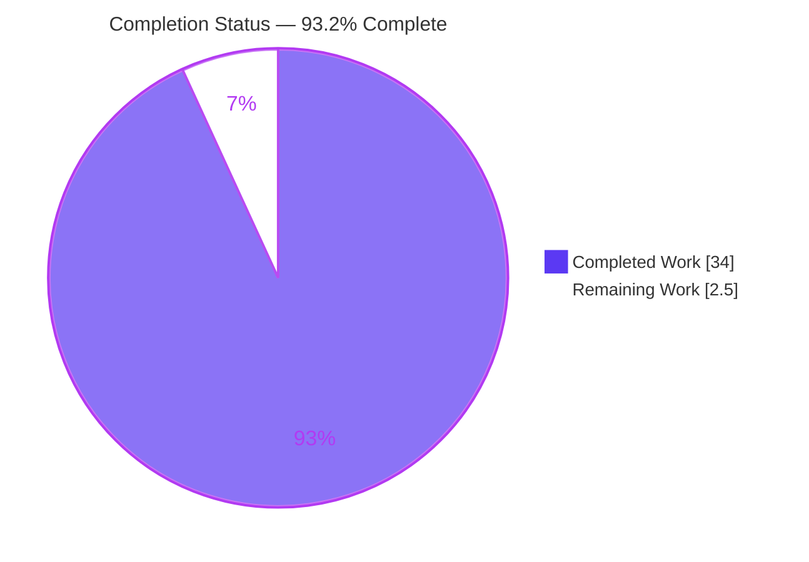

# Blitzy Project Guide — TruffleHog v3 Startup Investigation

> **Brand color legend.** Completed / AI Work = **Dark Blue `#5B39F3`** · Remaining / Not Completed = **White `#FFFFFF`** · Headings / Accents = **Violet-Black `#B23AF2`** · Highlight / Soft Accent = **Mint `#A8FDD9`**. These colors are applied to every chart in this guide.

---

## 1. Executive Summary

### 1.1 Project Overview

This is a **read-only investigative documentation** engagement on **TruffleHog v3**, the Go-based secret-scanning CLI in this repository. The objective was to author **one evidence-grounded markdown answer document** explaining — strictly from **observed runtime behavior** — how four subsystems come online during a basic filesystem scan: **configuration handling, scanning-engine initialization, detector preparation, and inter-component communication**. The target audience is engineers onboarding to TruffleHog's runtime architecture. The work was performed **run-first**: a canonical `trufflehog dev` binary was compiled from source and executed against a benign fixture at escalating log verbosity, and the captured output is the primary evidence. Business impact: faster, trustworthy architectural onboarding. **Zero source files were modified.**

### 1.2 Completion Status



> Pie colors: **Completed Work = Dark Blue `#5B39F3`**, **Remaining Work = White `#FFFFFF`** (violet-black outline for visibility).

| Metric | Hours |
|--------|-------|
| **Total Hours** | **36.5** |
| Completed Hours (AI + Manual) | 34.0 |
| Remaining Hours | 2.5 |
| **Percent Complete** | **93.2%** |

Completion is computed from AAP-scoped hours only: `34.0 / (34.0 + 2.5) = 34.0 / 36.5 = 93.2%`.

### 1.3 Key Accomplishments

- ✅ **Canonical binary built and verified** — `CGO_ENABLED=0 go build` produced a statically-linked ELF reporting version **`trufflehog dev`** (the default, non-goreleaser build).
- ✅ **Run-first evidence captured at four verbosity levels** — `--log-level=2/3/4/5` dry-runs against an 87-byte benign fixture, with results (stdout) and logs+banner (stderr) captured separately.
- ✅ **All four subsystems answered** — each with a direct answer, verbatim observed output, the exact command, a `file:line`-grounded mechanism, and a cause → effect explanation.
- ✅ **Rigorous evidence discipline** — every claim tagged `[observed]` / `[source-grounded]` / `[computed]` / `[inferred]`; 50 classification tags applied across the document.
- ✅ **144 `file:line` citations verified** across 11 source files; 2 off-by-one references tightened to the exact statement lines.
- ✅ **Read-only constraint upheld** — the cumulative branch diff is exactly one new file; no existing source file was touched; working tree clean; no stray artifacts.
- ✅ **Independently reproduced this session** — build (exit 0, static ELF), line counts L2=10/L3=14/L4=146/L5=148, L4 info-level breakdown (2/6/4/132), worker counts 128/1024/128/128, and dry-run summary (chunks=2, bytes=87, 0 verified / 0 unverified) all matched byte-for-byte.

### 1.4 Critical Unresolved Issues

| Issue | Impact | Owner | ETA |
|-------|--------|-------|-----|
| _None._ No blocking or release-critical issues. All five autonomous production-readiness gates passed; the deliverable is complete and validated. | — | — | — |

### 1.5 Access Issues

| System/Resource | Type of Access | Issue Description | Resolution Status | Owner |
|-----------------|----------------|-------------------|-------------------|-------|
| _None_ | — | No access issues identified. The Go 1.24.2 toolchain is pre-provisioned; the scan is fully offline (`--no-verification` performs zero outbound provider calls); no credentials, network, or third-party services are required for this filesystem-scan investigation. | N/A | — |

**No access issues identified.**

### 1.6 Recommended Next Steps

1. **[High]** Perform SME technical review and acceptance of the answer document — confirm all four subsystems are answered correctly, spot-check a sample of the 144 `file:line` citations, and (optionally) re-run the self-contained reproducible workflow.
2. **[Medium]** Merge/publish the documentation to the target branch (single additive file; near-zero conflict surface).
3. **[Low]** Optionally future-proof citations by annotating them with the investigated commit SHA to guard against upstream line-drift (mitigates risk T2).

---

## 2. Project Hours Breakdown

### 2.1 Completed Work Detail

Each component traces to specific AAP requirements (R1–R6, implicit prerequisites, the five SWE-AtlasQnA rules, and the deliverable-content requirements).

| Component | Hours | Description |
|-----------|-------|-------------|
| Environment setup + canonical build _(R1, R2, prereqs)_ | 2.0 | Activate/verify Go 1.24.2 toolchain; `CGO_ENABLED=0 go build`; confirm `trufflehog dev` banner; place caches/artifacts outside the checkout. |
| Instrumented dry-run + evidence capture _(R3, Rule 2)_ | 4.0 | Design the reproducible workflow; create the 87-byte fixture; run `--log-level=2/3/4/5` with `--no-verification`; capture stdout/stderr separately; disclose volatile-field normalizations and the 128-line collapse. |
| Subsystem 1 — Configuration handling narrative _(R4)_ | 3.0 | kingpin flag surface, optional `config.Read`/`NewYAML`, feature flags, `engine.Config` assembly, banner/version-to-stderr; observed output + `file:line`. |
| Subsystem 2 — Engine initialization narrative _(R4)_ | 3.5 | `NewEngine` → `setDefaults` → `initialize`; concurrency/multiplier defaults; 512-entry LRU; V(4) signals; observed-absence and non-event tracing. |
| Subsystem 3 — Detector preparation narrative _(R4)_ | 3.0 | Default-set pre-seed vs. unexercised fallback; include/exclude filtering; Aho-Corasick keyword prefilter construction and its scanner-pool use. |
| Subsystem 4 — Inter-component communication narrative _(R4)_ | 4.5 | Four worker pools with count arithmetic (128/1024/128/128); buffered-channel capacities (6400/3200/6400); SourceManager fan-out/fan-in; mermaid pipeline diagram. |
| Supporting analysis sections _(Rule 4)_ | 4.0 | Host-dependent-vs-fixed table; progressive-verbosity coverage; dry-run confirmation; no-verification safety control path (4-step source trace); coverage check; classification summary. |
| Methodology + grounding discipline + read-only compliance _(R5, R6, Rules 1 & 3, MainRule)_ | 2.5 | Four-way classification legend applied throughout; run-first framing; explanatory-not-enumerative discipline; read-only verification; artifact hygiene; branch-derived filename. |
| Web-research architecture validation _(§0.2.2)_ | 1.5 | Validate observed architecture against public TruffleHog documentation; reconcile the third-party "20 workers" claim against the canonical `runtime.NumCPU()` default. |
| Autonomous validation + QA cycle _(path-to-production for the doc)_ | 6.0 | Five-gate validation: byte-for-byte evidence checks, 144-citation verification + 2 tightenings, markdown hygiene (MD025/MD009/MD012/MD047), evidence-provenance QA, self secret-scan, fresh end-to-end smoke test, 5 commits. |
| **Total Completed** | **34.0** | |

### 2.2 Remaining Work Detail

All remaining work is **human path-to-production** for a documentation deliverable; there is no outstanding autonomous engineering work.

| Category | Hours | Priority |
|----------|-------|----------|
| Human SME technical review & acceptance (Verification) | 2.0 | High |
| Merge / publish documentation to target branch (Deployment) | 0.5 | Medium |
| **Total Remaining** | **2.5** | |

### 2.3 Hours Reconciliation

| Quantity | Hours | Source |
|----------|-------|--------|
| Completed (Section 2.1) | 34.0 | Sum of 10 completed components |
| Remaining (Section 2.2) | 2.5 | Sum of 2 remaining categories |
| **Total Project** | **36.5** | 34.0 + 2.5 |
| **Completion** | **93.2%** | 34.0 ÷ 36.5 × 100 |

`Completed (34.0) + Remaining (2.5) = Total (36.5)` — consistent with the Section 1.2 metrics table and the Section 7 pie chart.

---

## 3. Test Results

All entries below originate from **Blitzy's autonomous validation logs** for this project (Final Validator gates GATE1–GATE3) and were **independently reproduced during this assessment**. This is a documentation deliverable that introduces no executable code, so code-coverage percentages are **N/A**; "tests" here are the discrete, reproducible validation assertions and the corroborating credential-free unit suites.

| Test Category | Framework | Total | Passed | Failed | Coverage % | Notes |
|---------------|-----------|-------|--------|--------|------------|-------|
| Runtime evidence reproduction | Blitzy validation harness (bash capture) | 10 | 10 | 0 | N/A | Build exit 0 + static ELF; version `dev`; line counts L2=10/L3=14/L4=146/L5=148; L4 info-N breakdown 2/6/4/132; worker counts 128/1024/128/128; V(4)-gating (absent @L2, present @L4); dry-run summary 0/0. Reproduced byte-for-byte this session. |
| Citation verification | Source grep vs. `file:line` | 144 | 144 | 0 | N/A | 142 initially exact; 2 off-by-one tightened during validation (`engine.go` L1116→L1117, L517→L516). 11 tokens re-spot-checked this session — all exact. |
| Corroborating unit tests | `go test` | 5 | 5 | 0 | N/A | Package-level exit 0 for credential-free, directly-cited packages: `pkg/config`, `pkg/verificationcache`, `pkg/engine`, `pkg/engine/ahocorasick`, `pkg/engine/defaults`. (Count = packages; per-test counts not enumerated in logs.) |
| Markdown hygiene | markdownlint (MD rules) | 4 | 4 | 0 | N/A | MD025, MD009, MD012, MD047 clean; 44 balanced code fences; pure LF (satisfies `*.md eol=lf`). |
| Secret scan of deliverable | TruffleHog (self-scan) | 1 | 1 | 0 | N/A | 0 verified / 0 unverified secrets — repo pre-commit hook would pass. |
| **Total** | | **164** | **164** | **0** | N/A | 100% pass rate across all autonomous validation checks. |

> **Integrity note.** No tests were invented for this guide. Every row derives from the autonomous validation logs; where the logs do not enumerate a count (unit-test internals), the honest package-level result is reported and annotated.

---

## 4. Runtime Validation & UI Verification

Status legend: ✅ Operational · ⚠ Partial · ❌ Failing

**Runtime health (canonical `trufflehog dev` build):**

- ✅ **Canonical build** — `CGO_ENABLED=0 go build` completes in ~7.8 s (exit 0); output is a statically-linked ELF (confirms `CGO_ENABLED=0`).
- ✅ **Version banner** — `--version` writes `trufflehog dev` (15 bytes) to **stderr**; stdout is empty (0 bytes).
- ✅ **Engine initialization signals** — `default engine options set` and `engine initialized` observed at `--log-level=4` (V(4)); correctly absent at `--log-level=2`.
- ✅ **Detector preparation signals** — `setting up aho-corasick core` / `set up aho-corasick core` observed at V(4).
- ✅ **Worker pools** — `starting scanner/detector/verificationOverlap/notifier workers` observed with counts **128 / 1024 / 128 / 128** (host-dependent, from `runtime.NumCPU()=128`).
- ✅ **Source lifecycle** — `running source` → `enumerating source` → per-file `chunking unit` / `scanning file` observed at the expected verbosity levels.
- ✅ **Dry-run summary** — `finished scanning {chunks: 2, bytes: 87, verified_secrets: 0, unverified_secrets: 0, trufflehog_version: "dev"}`.
- ✅ **Stream separation** — results → stdout (empty here), logs + banner → stderr; verified at all four levels.

**API integration:**

- ✅ **No outbound provider calls (by design)** — `--no-verification` sets `Verify=false`, short-circuiting each detector's verification path; the run is fully offline. Guaranteed by a source-grounded control path (CLI flag → per-chunk gate → detector invocation → verification-cache facade), not by the zero result counts.

**UI verification:**

- ⚠ **Not applicable** — TruffleHog is a CLI tool and the deliverable is a markdown document; there is no graphical UI to verify. The "interface" validated here is the CLI's stdout/stderr contract and log output, all confirmed ✅ above.

---

## 5. Compliance & Quality Review

Cross-mapping AAP deliverables and the five binding rules to quality/compliance benchmarks. Fixes applied during autonomous validation are noted.

| Benchmark / Rule | Requirement | Status | Progress | Notes / Fixes Applied |
|------------------|-------------|--------|----------|-----------------------|
| Rule 1 — Run-First Investigation | Build & run first; canonical build; state exact commands | ✅ Pass | 100% | `trufflehog dev` build; exact build/run commands documented and re-verified. |
| Rule 2 — Exhaustive Evidence Coverage | Exercise all conditions; include complete unedited output | ✅ Pass | 100% | Levels 2–5 captured in full; only disclosed volatile normalizations + one disclosed 128-line collapse. |
| Rule 3 — Observed-Output Discipline | Honor instructions; show observed output beside each claim; label inferred | ✅ Pass | 100% | 4-way classification (50 tags); read-only + no file-by-file summary honored. |
| Rule 4 — Complete, Grounded Answering | Answer every named item; exact values; `file:line`; cause→effect; coverage pass | ✅ Pass | 100% | All 4 subsystems answered by name; exact constants (128/1024/128/128, LRU 512, buffers 6400/3200/6400); coverage checklist present. |
| MainRule — Deliverable & Scope | One md doc in `blitzy/documentation`; no source modified; temp scripts removed | ✅ Pass | 100% | Exactly one file added; working tree clean; no stray artifacts. |
| Canonical build | Default `trufflehog dev` (no goreleaser ldflags) | ✅ Pass | 100% | Version string is the default `BuildVersion = "dev"`. |
| Citation accuracy | Verified `file:line` references | ✅ Pass | 100% | 144 tokens verified; **2 off-by-one references tightened** during validation. |
| Markdown quality | Lint-clean, balanced fences, LF endings | ✅ Pass | 100% | MD025/MD009/MD012/MD047 clean; 44 balanced fences; **whitespace hygiene fixed** during validation. |
| Secret hygiene | No secrets in the deliverable | ✅ Pass | 100% | Self secret-scan: 0 verified / 0 unverified. |
| Evidence provenance | Consistent provenance across evidence blocks | ✅ Pass | 100% | **Evidence-provenance consistency fixed** during validation (QA Issue 2). |

**Outstanding compliance items:** None. All benchmarks pass.

---

## 6. Risk Assessment

Risks are categorized per PA3 (technical, security, operational, integration). For a validated, read-only documentation deliverable, all risks are **Low severity**.

| Risk | Category | Severity | Probability | Mitigation | Status |
|------|----------|----------|-------------|------------|--------|
| **T1** Host-dependent runtime values (worker counts 128/1024/128/128, channel buffers 6400/3200/6400 derive from `NumCPU()=128`) | Technical | Low | Low | Dedicated "host-dependent vs. fixed" table + explicit Host note; fixed constants (multipliers 8/1/1, LRU 512, channel mult 50/25/50) called out separately | Mitigated |
| **T2** Citation line-drift over time (144 `file:line` refs pinned to the investigated revision) | Technical | Low | Medium (long-term) | Document is a point-in-time investigation; optional commit-SHA pinning recommended (Next Step 3) | Open (low-impact) |
| **T3** Collapsed-evidence readability (128 identical `finished scanning chunks` lines shown once) | Technical | Low | Low | Collapse explicitly disclosed; total line counts stated (L4=146/L5=148) so completeness is verifiable | Mitigated |
| **S1** Accidental secret in a secret-scanner doc | Security | Low | Low | Benign 87-byte fixture (no secrets); repo's own TruffleHog scan of the deliverable returns 0/0 | Mitigated |
| **S2** Attack-surface change | Security | Low | Low | None introduced — read-only task adds no code, no dependencies (`go.mod`/`go.sum` untouched) | N/A |
| **O1** Reproducibility toolchain dependence (needs Go 1.24.2) | Operational | Low | Low | Document provides both the environment activation and fresh-machine install commands | Mitigated |
| **O2** Volatile-field normalization (timestamps, worker IDs, `$WORK`, `scan_duration`) | Operational | Low | Low | Every normalization explicitly disclosed; underlying capture is genuine | Mitigated |
| **I1** No integration surface (standalone markdown; no API/imports) | Integration | Low | Low | N/A — nothing to integrate | N/A |
| **I2** Merge/publication of the deliverable | Integration | Low | Low | Additive single-file change in `blitzy/documentation/`; zero existing files touched; near-zero conflict surface | Open (pending human merge) |

**Overall risk posture:** **Low.** No High- or Medium-severity risks; no blockers. The only open items are inherent point-in-time citation drift (T2) and the pending human merge (I2).

---

## 7. Visual Project Status

**Project hours breakdown (AAP-scoped).** Completed = Dark Blue `#5B39F3`, Remaining = White `#FFFFFF`.


**Remaining work by category (2.5 h total):**

| Category | Hours | Priority | Relative size |
|----------|-------|----------|---------------|
| Human SME review & acceptance | 2.0 | High | ████████ |
| Merge / publish to target branch | 0.5 | Medium | ██ |
| **Total** | **2.5** | | |

> **Integrity check.** The pie chart "Remaining Work" (2.5) equals the Section 1.2 Remaining Hours (2.5) and the Section 2.2 "Hours" total (2.5). "Completed Work" (34) equals the Section 1.2 Completed Hours (34.0).

---

## 8. Summary & Recommendations

**Achievements.** The engagement delivered a rigorously evidence-grounded, run-first investigation of TruffleHog v3's startup. All four named subsystems — configuration handling, scanning-engine initialization, detector preparation, and inter-component communication — are answered by name, each leading with a direct answer and backed by verbatim observed output, the exact reproducing command, verified `file:line` grounding, and a cause → effect explanation. Evidence was captured at four verbosity levels and every claim is classified as observed, source-grounded, computed, or inferred. The read-only mandate was upheld absolutely: the entire branch adds exactly one file and touches no existing source.

**Remaining gaps.** None on the autonomous side. The **2.5 remaining hours** are purely human path-to-production: an SME review/acceptance pass (2.0 h) and the merge/publish step (0.5 h).

**Critical path to production.** SME technical review → merge the single additive documentation file. There is no build, deployment, or integration work outstanding because the deliverable is a self-contained document validated against a fully offline, canonical build.

**Success metrics.** Five autonomous production-readiness gates passed; 164/164 validation checks passed; 144/144 citations verified (2 tightened); byte-for-byte evidence reproduced independently this session.

**Production readiness assessment.** The project is **93.2% complete** (34.0 of 36.5 AAP-scoped hours). The deliverable is production-ready pending routine human sign-off; the residual 6.8% reflects standard human review and merge that, by policy, are not performed autonomously. Confidence: **High** — the deliverable's claims were independently reproduced end-to-end.

| Metric | Value |
|--------|-------|
| AAP-scoped completion | 93.2% |
| AAP requirements completed | 100% (R1–R6 + prerequisites + all 5 rules) |
| Autonomous validation gates passed | 5 of 5 |
| Validation checks passed | 164 / 164 |
| Source files modified | 0 (read-only upheld) |
| Confidence level | High |

---

## 9. Development Guide

This guide reproduces the exact build-and-run workflow the investigation used. **Every command below was tested during this assessment.** To honor the read-only constraint, all build/scan artifacts are placed **outside** the repository checkout.

### 9.1 System Prerequisites

- **OS:** Linux (validated on `linux/amd64`).
- **Go toolchain:** **Go 1.24.2** (`go.mod` `toolchain go1.24.2`; module directive `go 1.23.1`).
- **Git:** for repository operations.
- **CGO:** not required — builds use `CGO_ENABLED=0` (static binary).
- **Disk:** ~2 GB for the Go module/build cache.
- **Services:** none — a filesystem scan needs no database, cache, or message queue.

### 9.2 Environment Setup

```bash
# Option A — activate the pre-provisioned toolchain (this environment):
source /etc/profile.d/go.sh        # puts /usr/local/go/bin on PATH; sets CGO_ENABLED=0, caches outside repo
go version                          # => go version go1.24.2 linux/amd64

# Option B — fresh machine:
#   curl -fsSLO https://go.dev/dl/go1.24.2.linux-amd64.tar.gz
#   sudo tar -C /usr/local -xzf go1.24.2.linux-amd64.tar.gz
#   export PATH=/usr/local/go/bin:$PATH

# Keep all artifacts OUTSIDE the checkout to preserve the read-only constraint:
WORK="$(mktemp -d)"                 # e.g. /tmp/tmp.XXXXXXXXXX
BIN="$WORK/trufflehog"; TARGET="$WORK/scan_target"; CAP="$WORK/captures"
mkdir -p "$TARGET" "$CAP"
```

### 9.3 Dependency Installation

No manual dependency installation is required. `go build` resolves the pinned module graph automatically from `go.mod` / `go.sum`:

```bash
# (Optional) pre-download modules to verify the graph resolves cleanly:
go mod download        # populates the module cache; no repository files change
```

### 9.4 Build (Canonical `trufflehog dev`)

```bash
# Run from the repository root; write the binary OUTSIDE the checkout:
CGO_ENABLED=0 go build -o "$BIN" .
test -x "$BIN" && echo "Built: $BIN"
file "$BIN"            # => ELF 64-bit ... statically linked (confirms CGO_ENABLED=0)
```

*Expected:* build completes in ~8 s (exit 0); the binary is a statically-linked ELF.

### 9.5 Verification

```bash
"$BIN" --version 1>"$CAP/v.out" 2>"$CAP/v.err"
wc -c < "$CAP/v.out"   # => 0   (stdout empty)
cat   "$CAP/v.err"     # => trufflehog dev   (15 bytes on stderr)
```

*Expected:* version string `trufflehog dev` on **stderr**; **stdout empty** — confirming the results/diagnostics stream split.

### 9.6 Example Usage (Safe Dry-Run)

```bash
# Create a minimal, benign fixture (87 bytes total) OUTSIDE the repo:
printf 'Welcome to the demo project.\nNothing sensitive lives here.\n' > "$TARGET/readme.txt"   # 59 B
printf '[settings]\ndebug = false\nok\n'                            > "$TARGET/config.ini"    # 28 B

# Dry-run at level 4 to surface engine-init & detector-prep signals:
"$BIN" filesystem "$TARGET" --no-verification --log-level=4 \
    1>"$CAP/l4.out" 2>"$CAP/l4.err"

wc -c < "$CAP/l4.out"                 # => 0     (no findings -> empty stdout)
wc -l < "$CAP/l4.err"                 # => 146   (stderr log lines)
grep 'starting.*workers' "$CAP/l4.err"          # => counts 128 / 1024 / 128 / 128
grep 'finished scanning\b' "$CAP/l4.err" | tail -1   # => chunks:2 bytes:87 0 verified / 0 unverified
```

*Expected (level 4):* banner `🐷🔑🐷`, version `trufflehog dev`, the four V(4) signals (`default engine options set`, `engine initialized`, `setting up`/`set up aho-corasick core`), four worker-start lines (128/1024/128/128), and a `finished scanning` summary with `verified_secrets: 0, unverified_secrets: 0`.

Escalate verbosity to observe progressively more of the pipeline — observed stderr line counts: **level 2 → 10, level 3 → 14, level 4 → 146, level 5 → 148**.

### 9.7 Cleanup (Preserve Read-Only Guarantee)

```bash
rm -rf "$WORK"                         # remove ALL artifacts (binary, fixture, captures)
git status --porcelain                 # => empty (clean working tree; nothing written in-repo)
```

### 9.8 Troubleshooting

- **`go: command not found`** → run `source /etc/profile.d/go.sh`, or install Go 1.24.2 (Option B).
- **Engine-init / detector-prep signals missing** → they are **V(4)-gated**; use `--log-level=4` or higher (they do not appear at level 2).
- **Findings not visible / logs mixed with output** → results go to **stdout**, logs + banner to **stderr**; redirect the two streams separately (`1>out 2>err`).
- **Repository shows as dirty** → you built or scanned inside the checkout; always write the binary and fixture under `$WORK` (outside the repo) and never leave a binary in the repo root.
- **Worker counts differ from 128/1024/128/128** → expected; they scale with `runtime.NumCPU()` on your host (host-dependent, not universal constants).
- **Unexpected outbound network activity** → ensure `--no-verification` is present; without it, detectors may attempt live verification.

---

## 10. Appendices

### Appendix A — Command Reference

| Purpose | Command |
|---------|---------|
| Activate toolchain | `source /etc/profile.d/go.sh` |
| Check Go version | `go version` |
| Canonical build | `CGO_ENABLED=0 go build -o "$BIN" .` |
| Show version banner | `"$BIN" --version` |
| Safe dry-run (level N) | `"$BIN" filesystem "$TARGET" --no-verification --log-level=N` |
| Confirm read-only | `git status --porcelain` (expect empty) |
| Branch diff vs. base | `git diff --name-only e42153d4..HEAD` |
| Cleanup artifacts | `rm -rf "$WORK"` |

### Appendix B — Port Reference

Not applicable. A local filesystem scan opens no listening ports and, with `--no-verification`, makes no outbound network connections.

### Appendix C — Key File Locations

| Path | Role |
|------|------|
| `blitzy/documentation/trufflehog_e42153d44a5e.md` | **The deliverable** (only file added; 432 lines) |
| `main.go` | CLI/kingpin surface, `run()`, config load, engine assembly, banner |
| `pkg/engine/engine.go` | `NewEngine`, `setDefaults`, `initialize`, channels, `startWorkers` |
| `pkg/config/config.go` | `config.Read` / `NewYAML` custom-detector parsing |
| `pkg/sources/source_manager.go` | source run/enumerate/chunking worker signals |
| `pkg/sources/filesystem/filesystem.go` | per-file `scanning file` signal |
| `pkg/version/version.go` | `BuildVersion = "dev"` (canonical version) |
| `go.mod` | module path, Go/toolchain versions, dependency pins |
| `Dockerfile` / `Makefile` / `.goreleaser.yml` | canonical build recipe & release ldflags reference |

### Appendix D — Technology Versions

| Component | Version | Notes |
|-----------|---------|-------|
| Go toolchain | 1.24.2 | `go.mod` `toolchain go1.24.2` |
| Go module directive | 1.23.1 | `go.mod` `go 1.23.1` |
| TruffleHog | `dev` | canonical from-source `BuildVersion` |
| kingpin/v2 | 2.4.0 | CLI parsing |
| go-logr/logr | 1.4.2 | logging facade (`info-N` V-levels) |
| uber/zap | 1.27.0 | logging backend |
| hashicorp/golang-lru/v2 | 2.0.7 | 512-entry dedup cache |
| BobuSumisu/aho-corasick | 1.0.3 | keyword prefilter |

### Appendix E — Environment Variable Reference

| Variable | Value / Purpose |
|----------|-----------------|
| `CGO_ENABLED` | `0` — canonical static build (set by the toolchain profile) |
| `PATH` | includes `/usr/local/go/bin` |
| `GOPATH` / `GOCACHE` | set **outside** the repository checkout to keep the working tree clean |
| `WORK` (guide-local) | `mktemp -d` directory holding the binary, fixture, and captures |

### Appendix F — Developer Tools Guide

| Tool | Use |
|------|-----|
| `go build` | compile the canonical binary |
| `go test` | run credential-free unit suites for cited packages |
| `git status --porcelain` / `git diff` | verify the read-only constraint |
| `file` | confirm the static ELF (CGO disabled) |
| `wc -c` / `wc -l` | measure fixture byte sizes and log line counts |
| `grep` | extract worker-start and summary signals from captures |

### Appendix G — Glossary

| Term | Meaning |
|------|---------|
| **Canonical / dev build** | A plain `go build` from source; version reads `trufflehog dev` (no goreleaser ldflags). |
| **Dry-run** | A scan with `--no-verification`; detectors never contact providers (fully offline). |
| **V-level (`info-N`)** | logr verbosity level; `--log-level=N` emits messages up to V(N). |
| **Aho-Corasick core** | A keyword prefilter (trie) that cheaply pre-screens chunks before detector regexes run. |
| **Worker pools** | Four concurrent pools — scanner / detector / verificationOverlap / notifier — connected by buffered channels. |
| **Fan-out/fan-in** | The concurrency pattern where the SourceManager produces chunks that many workers consume and results converge to the notifier. |
| **`[observed]` / `[source-grounded]` / `[computed]` / `[inferred]`** | The document's four-way evidence classification for every claim. |

---

*This Project Guide reflects AAP-scoped completion only: 34.0 completed hours + 2.5 remaining hours = 36.5 total hours = 93.2% complete.*