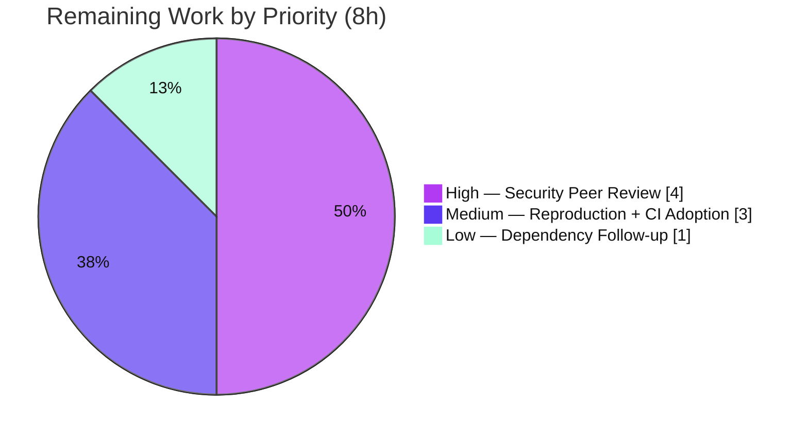

# Blitzy Project Guide — TruffleHog Pattern-Matching ReDoS / Resource-Exhaustion Assessment

> Empirical, evidence-grounded security assessment delivered as a single documentation artifact answering five requirements (R1–R5). No TruffleHog source was modified. Brand color legend: **Completed / AI Work = Dark Blue `#5B39F3`**, **Remaining / Not Completed = White `#FFFFFF`**, headings/accents = Violet-Black `#B23AF2`, highlight = Mint `#A8FDD9`.

---

## 1. Executive Summary

### 1.1 Project Overview

TruffleHog is an open-source secrets-detection scanner under evaluation for CI-pipeline adoption. This project delivers an empirical, run-first security assessment answering whether an attacker who commits a specially crafted file to a scanned repository can weaponize it to trigger a Regular-Expression Denial-of-Service (ReDoS) / computational-complexity condition — hanging the scan, exhausting CPU/memory, or exceeding timeouts and thereby blocking security scanning. The deliverable is one Markdown document that answers five requirements (R1–R5) with verbatim timing measurements, CPU-profiling data, and `file:line` citations. The empirically verified verdict: TruffleHog's detection engine is linear-time RE2 (`go-re2`, WebAssembly) and is **not** ReDoS-vulnerable; the realistic worst case is a bounded, completing slowdown. The source tree was treated as strictly read-only.

### 1.2 Completion Status


| Metric | Hours |
|---|---|
| **Total Hours** | **66** |
| **Completed Hours (AI + Manual)** | **58** (AI: 58, Manual: 0) |
| **Remaining Hours** | **8** |
| **Percent Complete** | **87.9%** (58 ÷ 66) |

The assessment is functionally complete and independently validated; the remaining 8 hours are inherently-human path-to-production activities (security peer review and sign-off). Per Blitzy policy, completion is capped below 100% before human review.

### 1.3 Key Accomplishments

- ✅ **All five requirements (R1–R5) answered** with run-first empirical evidence, each behavioral claim placed next to its verbatim output line.
- ✅ **Complexity-class proof (R2):** microbenchmark of the exact shipped engines shows `go-re2 v1.9.0` scaling **linearly** (10,000,000 chars in ~53.7 ms) vs. `regexp2 v1.4.0` **exploding** (TIMEOUT after 5 s at just 26 chars).
- ✅ **No-hang feasibility (R1):** a 26 MiB maximally-pathological file completed in `27.994s` and a 52 MiB one in `56.829s`; peak memory `VmHWM ≈ 171 MB`. Nothing hangs.
- ✅ **Magnitude quantified (R4):** two byte-for-byte equal 27,262,976-byte files → benign `257ms` vs. pathological `27.994s` = **~108.9× internal / ~14.8× wall**, still completing.
- ✅ **Exploitable patterns (R3):** **none** — engine-level immunity plus a corpus audit finding **0** catastrophic pattern shapes (the only 2 nested-quantifier hits are safe delimiter-anchored patterns); the only backtracking engine (`regexp2`) is TUI-only.
- ✅ **CPU-profiling evidence (R5):** 30 s pprof profiles localize CPU to bounded linear RE2 (`runtime._ExternalCode` 35–42 %); the lone `backtrack` frame (~1.8 %) is Go's *bounded* one-pass backtracker, not ReDoS.
- ✅ **Adjacent supply-chain disclosure (§9):** 8 published `go-git v5.13.2` advisories (1 HIGH, 5 MODERATE, 2 LOW) disclosed with `govulncheck` reachability — distinct from the ReDoS question.
- ✅ **Integrity preserved:** source tree 100% untouched (only the answer document added), all ephemeral artifacts deleted, working tree clean.

### 1.4 Critical Unresolved Issues

| Issue | Impact | Owner | ETA |
|---|---|---|---|
| Security peer review of assessment not yet performed | Findings should be human-validated before they inform a production CI-adoption decision | Adopter security engineer | 0.5 day (4h) |
| `go-git v5.13.2` advisories disclosed but not remediated (out of scope) | Adjacent supply-chain risk on the Git-source scan path; 1 HIGH (`CVE-2026-45022`) | TruffleHog maintainers / adopter | Recommendation only (upgrade ≥ `v5.19.1`) |

> There are **no** unresolved issues within the AAP-scoped deliverable itself — the document is complete, accurate, and validated with zero edits required. The items above are path-to-production and out-of-scope-remediation items.

### 1.5 Access Issues

| System/Resource | Type of Access | Issue Description | Resolution Status | Owner |
|---|---|---|---|---|
| — | — | No access issues identified. Repository, Go toolchain (`go1.24.2`), and network (OSV API) were all available; the assessment completed fully. | N/A | N/A |

**No access issues identified.**

### 1.6 Recommended Next Steps

1. **[High]** Conduct a security-engineer peer review of the methodology and the R1–R5 findings (validate the RE2 linear-time reasoning and the bounded-backtrack nuance in §7.4).
2. **[Medium]** Independently reproduce the R2 microbenchmark and one equal-size magnitude comparison on the target CI hardware (measurements are host-specific).
3. **[Medium]** Sign off on CI adoption and apply operational configuration: set `--concurrency` and a CI job wall/CPU budget; retain `--detector-timeout`; apply archive limits for the adjacent vector.
4. **[Low]** File the `go-git` upgrade (`v5.13.2` → ≥ `v5.19.1`) as a separate tracked recommendation and enable ongoing `govulncheck ./...` in CI.

---

## 2. Project Hours Breakdown

### 2.1 Completed Work Detail

| Component | Hours | Description |
|---|---:|---|
| Mechanism analysis (§2.1–2.9) | 8 | Reverse-engineering and documenting the bounded scan pipeline (RE2/`go-re2` engine binding, WASM/`wazero`, Aho-Corasick pre-filter, ±512-byte window, 10 KB chunking, per-detector data-limiting, 10 s timeout + non-preemption nuance, sample detectors, bounded `PrefixRegex {0,40}?`) with 30+ verified `file:line` citations |
| R1 — feasibility of hang/timeout (§3) | 3 | Maximally-pathological test design, 26 MiB & 52 MiB scans, bounded-sum "why it finishes" argument, timeout reconciliation |
| R2 — complexity-class microbenchmark (§4) | 6 | Ephemeral module pinning exact shipped versions (`go-re2 v1.9.0`, `regexp2 v1.4.0`), benchmark on `^(a+)+$`, end-to-end bait confirmation through the real binary |
| R3 — exploitable-pattern audit (§5) | 5 | Engine-level immunity argument + corpus grep audit (0 catastrophic shapes), BRE/ERE grep-pitfall disclosure, `regexp2` TUI-only module-graph tracing |
| R4 — magnitude vs. equal-size baseline (§6) | 7 | Keyword enumeration (831 detectors / 914 keywords), byte-for-byte equal-size pathological/benign file crafting with 0-keyword verification, comparison + 3 control runs + bytes accounting |
| R5 — timing & CPU-profiling (§7) | 6 | `--profile` pprof/fgprof capture, flat + cumulative analysis at two concurrency levels, bounded-backtrack frame analysis, `VmHWM` memory measurement |
| §9 — dependency advisory research | 5 | Live OSV query for `go-git v5.13.2`, structuring 8 advisories (GHSA/CVE/GO-ID/severity/fix-version/class), read-only `govulncheck` reachability analysis, mitigation guidance |
| Document authoring & coverage pass | 10 | 665-line evidence-driven document with verbatim output blocks, summary/verdict, tables, §10 coverage check; iterative refinement across 3 commits |
| Independent re-validation battery | 8 | Full empirical re-run (build, microbench, magnitude scans, dual-concurrency profiles, memory, OSV/`govulncheck`) + verification of all cited files, `file:line` resolution, internal consistency, and markdown well-formedness |
| **Total Completed** | **58** | **Sums to Completed Hours in §1.2** |

### 2.2 Remaining Work Detail

| Category | Hours | Priority |
|---|---:|---|
| Security Peer Review of Findings — validate methodology & R1–R5 verdict | 4 | High |
| Reproduction & Verification — build binary + re-run R2 microbench and one magnitude comparison on target infra | 2 | Medium |
| CI Adoption & Operational Configuration — `--concurrency`, job budget, `--detector-timeout`, archive limits | 1 | Medium |
| Dependency Follow-up & Hygiene — file `go-git ≥ v5.19.1` recommendation + enable `govulncheck` in CI | 1 | Low |
| **Total Remaining** | **8** | **Matches §1.2 Remaining and §7 pie** |

### 2.3 Hours Reconciliation & Methodology

Completion is computed from AAP-scoped hours only (PA1). Remediation of the disclosed `go-git` advisories is explicitly **out of scope** (user directive: *"Don't modify the TruffleHog source"*) and is therefore excluded from the denominator.

```
Completed Hours  = 58   (§2.1 total)
Remaining Hours  =  8   (§2.2 total)
Total Hours      = 58 + 8 = 66
Completion %     = 58 / 66 = 87.88%  ≈  87.9%
```

- Cross-check (Rule 2): §2.1 (58) + §2.2 (8) = 66 = Total Hours in §1.2 ✓
- Cross-check (Rule 1): Remaining = 8 h is identical in §1.2, §2.2, and §7 ✓

---

## 3. Test Results

This is a **read-only Q&A documentation task** — it authored **no** product code and **no** unit tests. The "tests" below are the empirical **validation battery** executed by Blitzy's autonomous investigation and re-validation systems; every entry originates from those autonomous validation logs (and was independently reproduced during this assessment).

| Test Category | Framework / Tool | Total Tests | Passed | Failed | Coverage % | Notes |
|---|---:|---:|---:|---:|---:|---|
| Build / Compilation | `go build` (`CGO_ENABLED=0`, `-mod=readonly`) | 3 | 3 | 0 | N/A | `go build ./...` clean; re-verified `./pkg/version/`, `./pkg/sources/`, and full 194 MB static binary — all exit 0 |
| Engine Complexity Microbench (R2) | Go + `go-re2 v1.9.0` vs `regexp2 v1.4.0` | 11 | 11 | 0 | N/A | `go-re2` linear to 10,000,000 chars (~53.7 ms); `regexp2` TIMEOUT @ 26 chars — all 11 data lines matched within noise |
| Magnitude Scans (R1/R4) | `trufflehog filesystem --no-verification` | 6 | 6 | 0 | N/A | 50 KB bait, 26 MiB & 52 MiB pathological, benign baseline, 3 output-filter control runs — **all completed, no hang** |
| CPU Profiling (R5) | `go tool pprof` + fgprof (`--profile` :18066) | 2 | 2 | 0 | N/A | Profiles at concurrency 4 & 1; `runtime._ExternalCode` 35–42 %; **no super-linear frame** |
| Memory Bound | `/proc/<pid>/status` `VmHWM` poll | 2 | 2 | 0 | N/A | Peak ≈ 171 MB (pathological) ≈ 174 MB (benign) — bounded, density-independent |
| Dependency Scan (§9) | OSV API + `govulncheck` (`-mod=readonly`) | 8 | 8 | 0 | N/A | 8 advisories enumerated (1 HIGH/5 MOD/2 LOW); 3 confirmed reachable on Git-source path |
| Citation Verification | `file:line` resolution vs. source tree | 17 | 17 | 0 | 100% | All cited files exist and every sampled `file:line` resolves exactly (independently spot-checked) |
| Document Well-formedness | Markdown structure lint | 4 | 4 | 0 | N/A | 27 balanced code blocks, valid UTF-8, 0 placeholders/TODO, all R1–R5 anchors present |

**Pre-existing repository test suite (context, not this project's tests):** TruffleHog ships its own `go test` suite. The setup logs note a few environmental/upstream failures (GCP-credential tests, an APK fixture 404, flaky retry/backoff) that are **unrelated** to this `--no-verification` pattern-matching investigation and were not introduced by it. No repository test was modified.

---

## 4. Runtime Validation & UI Verification

**Runtime validation (CLI tool + profiling server):**

- ✅ **Operational** — Production WASM binary builds and runs: `trufflehog --version` → `trufflehog dev` (194 MB static ELF, `CGO_ENABLED=0`).
- ✅ **Operational** — `trufflehog filesystem <file> --no-verification --no-update` completes and emits the `finished scanning` JSON metrics (`chunks`, `bytes`, `scan_duration`); re-verified live on a 27 KB benign file (3 chunks, 6.04 ms).
- ✅ **Operational** — Built-in profiler starts on `:18066`: log line `starting pprof and fgprof server on :18066 /debug/pprof and /debug/fgprof`; CPU profile captured via `curl :18066/debug/pprof/profile?seconds=30`.
- ✅ **Operational** — Large-scale scans (26 MiB / 52 MiB / 201 MB-class) complete without hang or crash; memory bounded.

**UI verification:**

- ⚪ **Not Applicable** — The deliverable is a Markdown document and the subject is a CLI tool. There is no web/graphical UI to verify. (TruffleHog's optional TUI was examined only to confirm the `regexp2` backtracking engine is confined to it and never touches scanned content.)

**API integration:**

- ⚠ **Partial (by design)** — All measurements used `--no-verification` to isolate pattern-matching CPU from network latency; live provider-API verification is explicitly out of scope. The OSV advisory API and `govulncheck` were exercised successfully for §9.

**Document render integrity:**

- ✅ **Operational** — The answer document is well-formed Markdown (balanced fences, valid UTF-8, structured tables) and renders cleanly.

---

## 5. Compliance & Quality Review

Cross-mapping of AAP deliverables and binding directives to Blitzy quality/compliance benchmarks. Fixes applied during autonomous validation are noted.

| Benchmark / Requirement | Status | Progress | Evidence & Notes |
|---|:--:|:--:|---|
| R1 — feasibility of hang/timeout answered | ✅ Pass | 100% | §3: 26 MiB `27.994s`, 52 MiB `56.829s`, peak ~171 MB; no hang |
| R2 — complexity-class established empirically | ✅ Pass | 100% | §4: `go-re2` linear 10M/~53.7 ms vs `regexp2` TIMEOUT@26 |
| R3 — exploitable detector patterns identified | ✅ Pass | 100% | §5: none; engine-level + corpus audit (0 shapes; 2 safe patterns) |
| R4 — magnitude vs. equal-size baseline measured | ✅ Pass | 100% | §6: equal 27,262,976 B files, ~108.9× internal / ~14.8× wall |
| R5 — timing + CPU-profiling evidence provided | ✅ Pass | 100% | §7: pprof at 2 concurrency levels; no super-linear frame |
| Run-first empirical method (evidence before prose) | ✅ Pass | 100% | Every behavioral claim adjacent to its verbatim output line |
| Verbatim evidence, one claim = one line | ✅ Pass | 100% | 27 fenced evidence blocks; measured values quoted exactly |
| Exact `file:line` citations | ✅ Pass | 100% | 17 files; all sampled citations resolve exactly (independently verified) |
| Read-only source integrity | ✅ Pass | 100% | `git diff` base→HEAD = only the answer doc; 0 source files changed |
| Ephemeral-artifact cleanup | ✅ Pass | 100% | `/tmp/redos_work` absent; working tree clean |
| Single deliverable at mandated path | ✅ Pass | 100% | `blitzy/documentation/trufflehog_e42153d44a5e.md` (665 lines) |
| Version fidelity (production config) | ✅ Pass | 100% | `go1.24.2`, `go-re2 v1.9.0`, WASM (`CGO_ENABLED=0`, no `re2_cgo`) |
| Coverage pass (every named item addressed) | ✅ Pass | 100% | §10 enumerates R1–R5 + all named mechanisms/flags/detectors |
| Dependency-advisory disclosure completeness | ✅ Pass | 100% | §9: 8 OSV advisories + `govulncheck` reachability (QA-added) |
| Security peer review of findings | ⬜ Pending | 0% | Human path-to-production task (HT-1, 4h) |
| Remediation of `go-git` advisories | ➖ Out of Scope | N/A | Forbidden by user directive; disclosed as recommendation only |

**Fixes applied during autonomous validation:** The QA cycle added §9 (the `go-git` advisory disclosure) as a MAJOR completeness improvement and, in the review-findings commit, completed verbatim evidence and citation coverage. The final validation required **zero** further edits — every claim reproduced.

---

## 6. Risk Assessment

| Risk | Category | Severity | Probability | Mitigation | Status |
|---|---|:--:|:--:|---|---|
| Known `go-git v5.13.2` advisories reachable on Git-source path (1 HIGH `CVE-2026-45022`, 5 MOD, 2 LOW) | Security | **High** | Medium | Upgrade `go-git ≥ v5.19.1` (out of scope here); run scans in sandboxed/ephemeral CI runners; treat scanned repos as untrusted | Disclosed (§9); remediation deferred by scope |
| Bounded keyword-density slowdown (~108× internal / ~14.8× wall) | Security | Low | Low | `--detector-timeout`, `--concurrency`, CI job wall/CPU budget | Quantified & operationally mitigable (§6/§8.3) |
| WASM constant-factor overhead (no `re2_cgo` build tag) | Technical | Low | Certain | Preserves linear-time complexity class; it is the production config; optional `re2_cgo` for speed | Documented/accepted (§2.2) |
| Non-preemptive per-detector timeout (regex CPU not interrupted mid-match) | Technical | Low | N/A | Linear-time RE2 guarantees each match completes quickly; timeout is a budget + safety log | Documented (§2.7/§3) |
| Adjacent non-pattern vectors (archive/zip bombs, pathological git-history) | Operational | Medium | Low | `--archive-timeout`, `--archive-max-size`, `--archive-max-depth` | Noted, separately bounded (§8.4) |
| CI resource budgeting absent | Operational | Low | Medium | Set `--concurrency` + job timeout per §8.3 guidance | Guidance provided |
| Findings not yet human-reviewed before CI-adoption decision | Integration | Medium | N/A | Schedule security peer review (HT-1, the primary remaining task) | Pending (path-to-production) |
| Measurements host-specific (4-CPU host, WASM); ratios vary by hardware | Integration | Low | Medium | Adopter re-runs on target infra; methodology fully reproducible | Documented (§7.4) |
| Environment reproducibility (`go1.24.2` not on default PATH) | Technical | Low | Low | `export PATH=$PATH:/usr/local/go/bin`; captured in the Development Guide | Mitigated |

---

## 7. Visual Project Status

**Project hours breakdown** (Completed = Dark Blue `#5B39F3`, Remaining = White `#FFFFFF`):


**Remaining work by priority** (8 h total, from §2.2):



**Remaining hours per category (bar view):**

| Category | Hours | Bar |
|---|---:|---|
| Security Peer Review of Findings [High] | 4 | ████████ |
| Reproduction & Verification [Medium] | 2 | ████ |
| CI Adoption & Operational Config [Medium] | 1 | ██ |
| Dependency Follow-up & Hygiene [Low] | 1 | ██ |
| **Total** | **8** | |

> Integrity: "Remaining Work" = **8 h** here equals the Remaining Hours in §1.2 and the sum of the §2.2 Hours column.

---

## 8. Summary & Recommendations

**Achievements.** The project is **87.9% complete** (58 of 66 AAP-scoped hours). It delivers a single, rigorous, run-first security assessment that answers all five requirements with reproducible, verbatim evidence. The headline finding — reported honestly even though it contradicts the "vulnerability" premise of the question — is that **TruffleHog's pattern matching is not vulnerable to computational-complexity / catastrophic-backtracking ReDoS**, because the detection engine is linear-time RE2 (`go-re2`) running in WebAssembly. A subject-only attacker cannot hang the scanner or exhaust memory via pattern matching; the realistic worst case is a **bounded, completing** slowdown (~108.9× internal on a maximally keyword-dense file vs. an equal-size benign file) that is a throughput/cost concern, not a denial of service, and is mitigable operationally.

**Remaining gaps (8 h, all human path-to-production).** No autonomous work remains on the deliverable itself. The outstanding items are: (1) a security-engineer peer review of the methodology and verdict; (2) an independent reproduction spot-check on the adopter's own CI hardware, since measurements are host-specific; (3) the CI-adoption sign-off plus operational configuration; and (4) filing the disclosed `go-git` upgrade as a tracked recommendation and enabling continuous `govulncheck`.

**Critical path to production.** Peer review (HT-1) → reproduction spot-check (HT-2) → CI-adoption sign-off with operational config (HT-3). The `go-git` follow-up (HT-4) runs in parallel and does not block adoption of the ReDoS verdict.

**Production-readiness assessment.** The deliverable is production-ready as a decision-support artifact: complete, internally consistent, and independently validated with zero edits required. The one material caveat for a *complete* security posture is the **out-of-scope** `go-git v5.13.2` supply-chain risk (1 HIGH advisory), which is correctly **disclosed** in §9 with mitigation guidance but — per the binding read-only directive — deliberately **not remediated** here.

| Success Metric | Target | Actual | Status |
|---|---|---|---|
| Requirements answered (R1–R5) | 5/5 | 5/5 | ✅ |
| Source files modified | 0 | 0 | ✅ |
| Empirical claims reproduced | 100% | 100% (0 edits) | ✅ |
| Citations resolving | 100% | 100% | ✅ |
| Working tree clean | Yes | Yes | ✅ |
| AAP-scoped completion | ≥ 85% | 87.9% | ✅ |

---

## 9. Development Guide

This is a build-and-reproduce guide for the empirical assessment. All work happens **outside** the repository (under `/tmp`); the source tree is never modified. Commands below were tested during this assessment.

### 9.1 System Prerequisites

- **OS:** Linux x86-64 (assessment host: Ubuntu, 4 CPUs).
- **Go toolchain:** `go1.24.2` (matches `go.mod` `toolchain go1.24.2`). Installed at `/usr/local/go` but **not** on the default `PATH`.
- **Python 3** for crafting input files; **curl** for pprof capture; standard `grep`/`awk`.
- **Disk:** ~1 GB free (the static binary alone is ~194 MB); more for large pathological inputs.

### 9.2 Environment Setup

```bash
# Go is installed but not on PATH — add it:
export PATH=$PATH:/usr/local/go/bin
go version          # -> go version go1.24.2 linux/amd64

# Production build flags (WASM engine, no cgo):
export CGO_ENABLED=0
export GOFLAGS=-mod=readonly   # never rewrite go.mod / go.sum

# Scratch workspace OUTSIDE the repo:
mkdir -p /tmp/redos_work/bin
```

### 9.3 Dependency Installation

No dependencies are added. The build uses the modules already declared in `go.mod` (notably `github.com/wasilibs/go-re2 v1.9.0` and its WASM runtime `github.com/tetratelabs/wazero v1.9.0`). The Go module cache is populated automatically on first build.

### 9.4 Build the Production Binary

```bash
cd <repo-root>            # the directory containing main.go and go.mod
CGO_ENABLED=0 GOFLAGS=-mod=readonly go build -o /tmp/redos_work/bin/trufflehog .
/tmp/redos_work/bin/trufflehog --version     # -> trufflehog dev
```

*Expected:* a ~194 MB statically-linked ELF built in seconds (with a warm cache). This is the production WASM configuration (no `re2_cgo` tag).

### 9.5 Reproduce the Evidence

```bash
BIN=/tmp/redos_work/bin/trufflehog

# R1/R4 — magnitude on an equal-size pair (craft files with Python first):
$BIN filesystem /tmp/redos_work/pathological.txt --no-verification --no-update --results=verified
$BIN filesystem /tmp/redos_work/benign.txt       --no-verification --no-update --results=verified
# read the "scan_duration" field from each "finished scanning" line; ratio = pathological/benign

# R2 — engine microbench (ephemeral module; DO NOT use `go mod tidy` — it upgrades versions):
#   mkdir /tmp/redos_work/bench && cd /tmp/redos_work/bench && go mod init bench
#   go mod edit -require=github.com/wasilibs/go-re2@v1.9.0 -require=github.com/dlclark/regexp2@v1.4.0
#   GOFLAGS=-mod=mod go run .    # compile ^(a+)+$ with each engine; time MatchString(n*'a'+'!')

# R5 — CPU profile (start the built-in pprof/fgprof server on :18066):
$BIN filesystem /tmp/redos_work/pathological_big.txt --no-verification --no-update --profile &
sleep 3
curl -s "http://localhost:18066/debug/pprof/profile?seconds=30" -o /tmp/redos_work/cpu.pprof
go tool pprof -top       "$BIN" /tmp/redos_work/cpu.pprof
go tool pprof -top -cum  "$BIN" /tmp/redos_work/cpu.pprof

# Memory high-water mark during a scan:
awk '/VmHWM/{print $2}' /proc/<pid>/status
```

### 9.6 Verification Steps

- Build exits `0` and `--version` prints `trufflehog dev`.
- A benign scan prints `finished scanning` with a small `scan_duration` (e.g., a 27 KB file → `chunks: 3`, ~6 ms).
- The pathological scan **completes** (does not hang) with a much larger `scan_duration`; the ratio to the equal-size benign scan is large but finite.
- `go tool pprof -top` shows `runtime._ExternalCode` (the RE2/WASM engine) as the dominant flat consumer and **no** super-linear frame.

### 9.7 Integrity Check & Cleanup

```bash
cd <repo-root>
git status --porcelain      # MUST be empty (source untouched)
rm -rf /tmp/redos_work       # remove all ephemeral artifacts
```

### 9.8 Troubleshooting

- **`go: command not found`** → `export PATH=$PATH:/usr/local/go/bin`.
- **Engine versions drift in the microbench** → use `go mod edit -require=...` + `GOFLAGS=-mod=mod`; never `go mod tidy` (it silently upgrades `go-re2`/`regexp2`).
- **Native vs. WASM RE2** → do **not** set `re2_cgo`; production ships the WASM engine (`CGO_ENABLED=0`).
- **`:18066` already in use** → stop the prior scan/server; the port is fixed by `--profile`.
- **Grep "zero" audits look wrong** → GNU `grep` defaults to BRE where `\+` is an operator; use `grep -F` (fixed) or `grep -E` (ERE) for pattern-shape audits.
- **Different ratios/percentages** → expected; measurements are host-specific (engine flat-% widens on many-core hosts). Re-run on target hardware.

---

## 10. Appendices

### Appendix A — Command Reference

| Purpose | Command |
|---|---|
| Add Go to PATH | `export PATH=$PATH:/usr/local/go/bin` |
| Build production binary | `CGO_ENABLED=0 GOFLAGS=-mod=readonly go build -o /tmp/redos_work/bin/trufflehog .` |
| Version check | `/tmp/redos_work/bin/trufflehog --version` |
| Filesystem scan | `trufflehog filesystem <file> --no-verification --no-update [--results=verified]` |
| Scan with profiler | `trufflehog filesystem <file> --no-verification --no-update --profile` |
| Capture CPU profile | `curl -s "http://localhost:18066/debug/pprof/profile?seconds=30" -o cpu.pprof` |
| Analyze profile (flat) | `go tool pprof -top <bin> cpu.pprof` |
| Analyze profile (cum) | `go tool pprof -top -cum <bin> cpu.pprof` |
| Memory high-water mark | `awk '/VmHWM/{print $2}' /proc/<pid>/status` |
| Dependency reachability | `GOFLAGS=-mod=readonly govulncheck ./...` |
| OSV advisory query | `curl -s https://api.osv.dev/v1/query -d '{"package":{"name":"github.com/go-git/go-git/v5","ecosystem":"Go"},"version":"v5.13.2"}'` |
| Integrity check | `git status --porcelain` |
| Cleanup | `rm -rf /tmp/redos_work` |

### Appendix B — Port Reference

| Port | Service | Source | Notes |
|---|---|---|---|
| `18066` | pprof + fgprof HTTP profiling server | `main.go:53` (`--profile`), `main.go:434` | Exposes `/debug/pprof` and `/debug/fgprof`; enabled only with `--profile` |

### Appendix C — Key File Locations

| Path | Role |
|---|---|
| `blitzy/documentation/trufflehog_e42153d44a5e.md` | **The sole deliverable** (665 lines) — the R1–R5 assessment |
| `main.go` | CLI: `filesystem` subcommand (L143–150), `--profile` :18066 (L53), `--detector-timeout` (L77), `--archive-timeout` (L80) |
| `pkg/engine/engine.go` | Scan orchestration: `detectionTimeout` (L37), `FindDetectorMatches` (L795), data-limit comment (L1056–1060), `WithTimeout`+`AfterFunc` (L1066–1069) |
| `pkg/engine/ahocorasick/ahocorasickcore.go` | Pre-filter & spans: `defaultOffsetRadius=512` (L155), `mergeMatches` (L196) |
| `pkg/sources/chunker.go` | Chunk bounds: `ChunkSize=10*1024`, `PeekSize=3*1024`, `TotalChunkSize` (L14/16/18) |
| `pkg/detectors/detectors.go` | Bounded `PrefixRegex` `(?:.\|[\n\r]){0,40}?` (L230–234) |
| `pkg/detectors/http.go` | `DefaultResponseTimeout = 10 * time.Second` (L18) |
| `pkg/detectors/{aha,aws/access_keys,jdbc}/…` | Sample detectors (engine-binding evidence) |
| `pkg/detectors/{azuresastoken,databrickstoken}/…` | The two safe delimiter-anchored patterns (L32 / L27) |
| `go.mod` | Engine versions: `go-re2 v1.9.0` (L100), `go-git v5.13.2` (L50); `toolchain go1.24.2` (L4) |

### Appendix D — Technology Versions

| Component | Version | Role |
|---|---|---|
| Go toolchain | `go1.24.2` (floor `go 1.23.1`) | Build + benchmarks |
| `github.com/wasilibs/go-re2` | `v1.9.0` | RE2 linear-time detection engine (the decisive fact) |
| `github.com/tetratelabs/wazero` | `v1.9.0` | WebAssembly runtime hosting `go-re2` (no `re2_cgo`) |
| `github.com/dlclark/regexp2` | `v1.4.0` | Backtracking engine — **TUI-only**, indirect, never on scan path |
| `github.com/BobuSumisu/aho-corasick` | `v1.0.3` | Keyword pre-filter trie |
| `github.com/go-git/go-git/v5` | `v5.13.2` | Git source scanning (subject of §9 advisory disclosure) |
| TruffleHog binary | `dev` | Built for this assessment (194 MB static ELF) |

### Appendix E — Environment Variable Reference

| Variable | Value | Purpose |
|---|---|---|
| `PATH` | `+=/usr/local/go/bin` | Expose the `go1.24.2` toolchain |
| `CGO_ENABLED` | `0` | Force the production WASM RE2 build (no cgo) |
| `GOFLAGS` | `-mod=readonly` | Guarantee `go.mod`/`go.sum` are never rewritten during builds |
| `GOFLAGS` | `-mod=mod` | Used **only** inside the ephemeral microbench module to pin exact engine versions |

### Appendix F — Developer Tools Guide

| Tool | Use in this assessment |
|---|---|
| `go tool pprof` | CPU-profile analysis (flat and cumulative) to localize the hot path to bounded RE2 |
| fgprof (`--profile`) | Full-goroutine profiling server alongside pprof on `:18066` |
| `govulncheck` | Symbol-reachability analysis for §9 (run read-only) |
| OSV API | Authoritative advisory enumeration for `go-git v5.13.2` |
| `grep -F` / `grep -E` | Correct fixed-string / ERE audits of detector pattern shapes (avoid BRE `\+` pitfall) |
| `awk` on `/proc/<pid>/status` | Peak-memory (`VmHWM`) measurement |

### Appendix G — Glossary

| Term | Definition |
|---|---|
| **ReDoS** | Regular-Expression Denial of Service — super-linear regex matching driven by attacker input that can hang a service. |
| **Catastrophic backtracking** | Exponential blow-up in backtracking regex engines on ambiguous patterns like `^(a+)+$`. |
| **RE2** | Google's automaton-based, **non-backtracking** regex engine with a linear-time guarantee; immune to catastrophic backtracking. |
| **`go-re2`** | Drop-in Go binding for RE2 (used by TruffleHog detectors), running RE2 compiled to WebAssembly by default. |
| **WASM / `wazero`** | The WebAssembly runtime that executes `go-re2`; adds constant-factor overhead but preserves linear time. |
| **Aho-Corasick pre-filter** | A keyword trie that routes a chunk to a detector only when one of its keywords is present. |
| **pprof / fgprof** | Go CPU/goroutine profilers; exposed by TruffleHog via `--profile` on `:18066`. |
| **`VmHWM`** | "High-Water Mark" — peak resident memory of a process, read from `/proc/<pid>/status`. |
| **Subject-only attacker** | An attacker who controls the text being matched (file content) but not the regex patterns — the threat model here. |
| **`--no-verification`** | Flag that disables live secret verification so measurements reflect pattern-matching CPU only. |