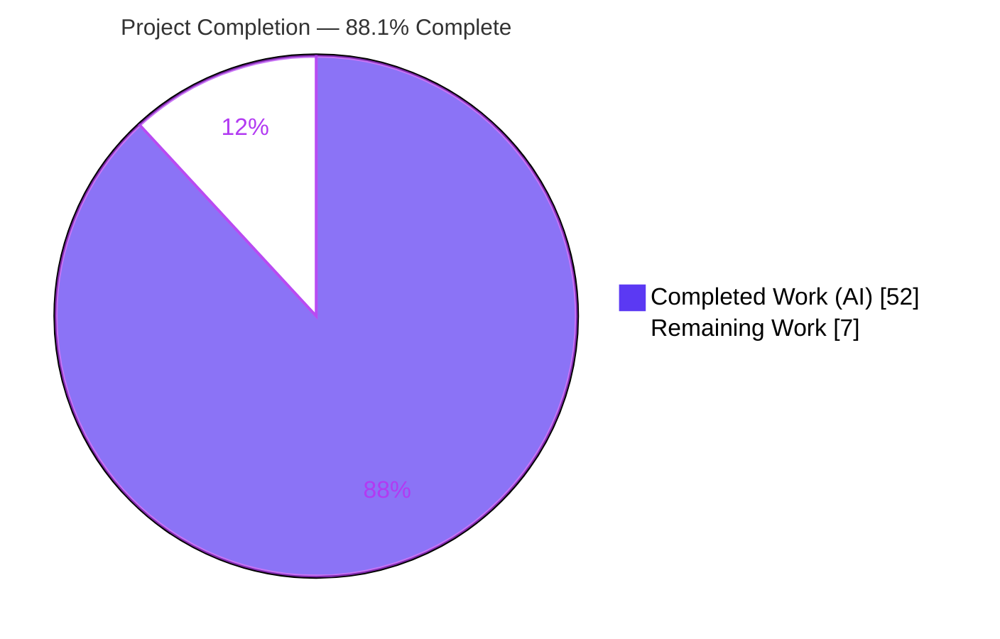
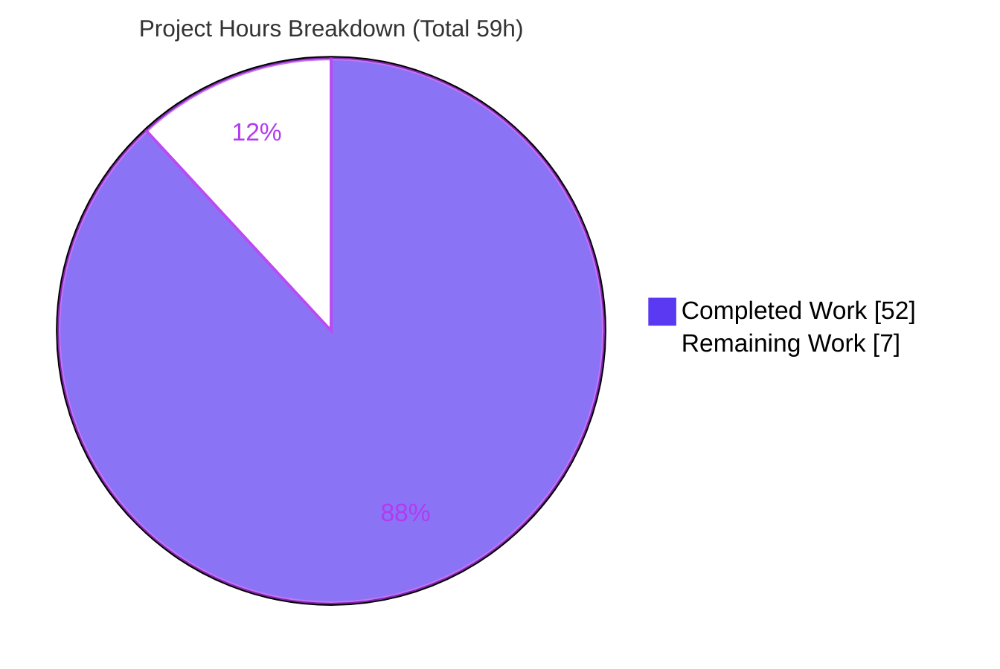
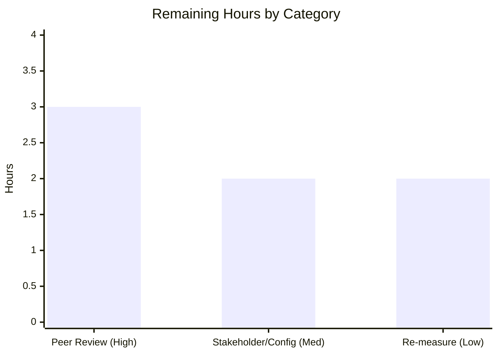

# Blitzy Project Guide — TruffleHog ReDoS / Resource-Exhaustion Security Assessment

## 1. Executive Summary

### 1.1 Project Overview

A read-only security assessment of TruffleHog (the `trufflesecurity/trufflehog` Go secret-scanner at commit `e42153d4`) evaluating whether its pattern-matching pipeline can be weaponized for a Regular-Expression / resource-exhaustion denial-of-service (ReDoS) that would block CI security scans. The target audience is the CI/security team evaluating TruffleHog for adoption. The single deliverable is one code-grounded, empirically-validated Markdown document answering four questions: hang/timeout feasibility, computational-complexity susceptibility, exploitable patterns, and quantified impact versus equal-size files. Technical scope covers regex-engine determination, scan-pipeline bounding analysis, residual-vector enumeration, and a build-and-benchmark harness with CPU profiling. The verdict de-risks the tooling decision.

### 1.2 Completion Status



| Metric | Hours |
|---|---|
| **Total Hours** | 59 |
| **Completed Hours (AI + Manual)** | 52 |
| &nbsp;&nbsp;• Completed by Blitzy autonomous agents | 52 |
| &nbsp;&nbsp;• Completed by manual/human work to date | 0 |
| **Remaining Hours** | 7 |
| **Percent Complete** | **88.1%** |

> Completion is computed with the AAP-scoped, hours-based methodology: `Completed ÷ (Completed + Remaining) = 52 ÷ 59 = 88.1%`. All AAP-specified deliverables are complete and validated; the remaining 7 hours are inherently-human path-to-production review and acceptance of a documentation artifact.

### 1.3 Key Accomplishments

- ✅ **Regex engine of record determined from code** — secret detection compiles with RE2 (`github.com/wasilibs/go-re2`, 867 importing `.go` files) plus Go's RE2-derived stdlib `regexp` (3 detectors + the custom-detector framework); the backtracking `dlclark/regexp2` is an indirect-only dependency used by **zero** detection files.
- ✅ **All four objectives answered (O1–O4)** with code-grounded rationale and exact `file:Lnn` locators.
- ✅ **69 citations verified 100% accurate** against source at commit `e42153d4` (zero corrections required).
- ✅ **Empirical evidence captured** — equal-size 5 MB timing comparison, multi-size linearity series, and a CPU profile from the built-in `--profile` server on `:18066`.
- ✅ **Verdict delivered** — not vulnerable to catastrophic-backtracking ReDoS; worst achievable effect is a **bounded ≈10× scan-phase slowdown** that scales **linearly** with file size, **not** an unbounded hang.
- ✅ **Operator-side mitigations documented** (file-size limits, archive depth/size/timeout caps, concurrency tuning) — recommendations only, not implemented (demonstrate-don't-patch).
- ✅ **TruffleHog source tree fully unmodified**; exactly one new file committed; all ephemeral harness artifacts cleaned up; `go.sum` pristine.

### 1.4 Critical Unresolved Issues

No critical, release-blocking issues were identified. The single open item is a non-blocking process step (human acceptance), shown below for transparency.

| Issue | Impact | Owner | ETA |
|---|---|---|---|
| Assessment awaits human security peer review & stakeholder acceptance | Non-blocking; deliverable is complete & validated, but a formal sign-off is required before the findings inform the CI tooling decision | Security reviewer / CI-evaluation team | 0.5 day (≈5h, see §1.6 / §2.2) |

### 1.5 Access Issues

No access issues were identified that prevent build validation, reproduction, or review. Dependencies resolve offline from the warm Go module cache and `go mod verify` reports all modules verified.

| System/Resource | Type of Access | Issue Description | Resolution Status | Owner |
|---|---|---|---|---|
| Go module dependencies | Build-time module resolution | None — resolves from warm `GOMODCACHE`; `go mod verify` passes. A cold cache would require network access to the Go module proxy. | No issue (note for clean-machine reproduction) | Reviewer |
| Network secret verification | Outbound HTTPS to providers | Intentionally disabled via `--no-verification` to isolate pattern-matching CPU (explicitly out of AAP scope) — not an access defect | By design | N/A |

### 1.6 Recommended Next Steps

1. **[High]** Complete the security peer review and sign off the verdict — read the assessment, spot-check a sample of the 69 citations against TruffleHog source at `e42153d4`, and validate the "bounded, not a hang" conclusion (≈3h).
2. **[Medium]** Hold stakeholder review, make the TruffleHog adoption decision, and decide whether to operationalize the §9 operator-side mitigations in the CI pipeline (≈2h).
3. **[Low]** Optionally re-run the equal-size benchmark + CPU profile on the team's own CI host to obtain host-specific ratios and annotate the disclosed measurement variance (≈2h).
4. **[Medium]** On any future TruffleHog version upgrade, re-validate the engine of record and the chunk/match-window bounds (the verdict is pinned to commit `e42153d4`).

---

## 2. Project Hours Breakdown

### 2.1 Completed Work Detail

| Component | Hours | Description |
|---|---|---|
| Regex-engine & dependency determination (O2) | 5 | Traced detector imports across 867 `.go` files; established RE2 (`go-re2`) + stdlib `regexp` as engines of record and `regexp2` as indirect/unused; cited `go.mod` versions. |
| Scan-pipeline & bounding-mechanism analysis (O1) | 7 | Read `engine.go` (worker pools, per-detector timeout + watchdog, overlap Levenshtein), `ahocorasickcore.go` (span calculators / match windows), `chunker.go` (10 KB chunk cap). |
| Residual complexity-vector enumeration (O3) | 6 | Analyzed keyword fan-out, base64 decoder amplification, Levenshtein overlap (O(n×m)), large-window detectors, and the bounded stdlib detector patterns. |
| External research (RE2 linear-time grounding) | 2 | Web research confirming RE2's linear-time guarantee, no backtracking, and that Go's `regexp` follows the same principles. |
| Empirical harness — CLI build + input crafting | 4 | Built the CLI; crafted byte-for-byte equal-size benign, keyword-saturated, and base64-dense inputs. |
| Benchmark execution + linearity series (O4) | 5 | Ran equal-size scans and a multi-size series (512→15,361 chunks) capturing engine-reported `scan_duration`. |
| CPU profiling + pprof hotspot analysis (O4) | 4 | Captured a CPU profile via the `--profile` server on `:18066`; interpreted hotspots (RE2-as-WASM, Aho-Corasick walk, bounded `tryBacktrack`). |
| Document authoring | 11 | Wrote the 403-line, 10-section assessment with 69 citations, a pipeline diagram, and timing/profile tables. |
| Autonomous validation | 8 | Verified all 69 citations, reproduced the full empirical methodology, enforced source-pristine state, reverted `go.sum` contamination, and cleaned up artifacts. |
| **Total** | **52** | |

### 2.2 Remaining Work Detail

| Category | Hours | Priority |
|---|---|---|
| Security peer review & verdict sign-off | 3 | High |
| Stakeholder review, CI-tooling decision & operator-mitigation adoption | 2 | Medium |
| Optional measurement-variance reconciliation on target host | 2 | Low |
| **Total** | **7** | — |

### 2.3 Hours Reconciliation & Integrity Check

- Section 2.1 completed total = **52h**; Section 2.2 remaining total = **7h**.
- `2.1 + 2.2 = 52 + 7 = 59h` = **Total Project Hours** in Section 1.2. ✓
- Remaining hours are identical across Section 1.2 (7h), Section 2.2 (7h), and the Section 7 pie chart "Remaining Work" (7). ✓
- Completion = `52 ÷ 59 = 88.1%`, used consistently in Sections 1.2, 7, and 8. ✓

---

## 3. Test Results

All entries below originate from Blitzy's autonomous validation logs and were independently reproduced during this assessment. Because the deliverable is a Markdown analysis document (no compiled code of its own), the meaningful correctness tests are source compilation of the cited REFERENCE tree, credential-free unit tests of the cited packages, citation accuracy, and empirical reproducibility.

| Test / Validation Category | Framework / Method | Items | Passed | Failed | Pass Rate | Notes |
|---|---|---|---|---|---|---|
| Source compilation | `go build ./...` (CGO_ENABLED=0, `-mod=readonly`) | 1005 packages | 1005 | 0 | 100% | 0 errors/warnings; `go vet` clean on cited packages |
| Unit tests (cited REFERENCE pkgs) | `go test -mod=readonly` | 2 packages (`pkg/decoders`, `pkg/engine/ahocorasick`) | 2 | 0 | 100% | Credential-free tests pass |
| Citation accuracy | Locator verification vs source @ `e42153d4` | 69 locators | 69 | 0 | 100% | Zero corrections required |
| Quantitative claim checks | `grep`/count vs source | 3 claims | 3 | 0 | 100% | 867 `go-re2` importers; 0 `regexp2` in detection; exactly 3 stdlib-regexp detectors |
| Empirical reproduction (O1–O4) | `trufflehog` CLI + `go tool pprof` | 3 scenarios | 3 | 0 | 100% | Equal-size timing, linearity series, CPU profile — all bounded/linear |
| Dependency integrity | `go mod verify` | module graph | 1 | 0 | 100% | "all modules verified"; `go.sum` pristine |
| Markdown integrity | Structural lint | fences/tables/placeholders | 1 | 0 | 100% | Balanced fences; 0 malformed tables; 0 placeholders |

**Coverage note:** Traditional line-coverage is not applicable to a documentation deliverable. The relevant "coverage" is requirement coverage — **24 / 24 AAP-specified requirements addressed (100%)** — and citation coverage — **69 / 69 locators verified accurate (100%)**.

---

## 4. Runtime Validation & UI Verification

Runtime behavior was validated by building the CLI and exercising the exact methodology the assessment documents.

- ✅ **CLI build** (`CGO_ENABLED=0 go build -mod=readonly`) — **Operational**; 194 MB static binary, exit 0, no CGO/system RE2 required (go-re2 runs as pure-Go WASM via wazero).
- ✅ **Filesystem scan** (`--no-verification --no-update --concurrency=1`) — **Operational**; reports engine `scan_duration` and `chunks` (e.g., 200 KB → `scan_duration` 8.5 ms, chunks 20).
- ✅ **Built-in profiling server** (`--profile`) — **Operational**; pprof/fgprof bound on `:18066`, `GET /debug/pprof/` returned HTTP 200.
- ✅ **Linear-scaling behavior** — **Operational**; 200 KB → 8.5 ms and 25 MB → 1.0 s (≈118× time for 125× size) independently corroborates the bounded, linear, anti-ReDoS finding.
- ⚪ **UI verification** — **Not applicable**; TruffleHog is a CLI/TUI tool and the deliverable is a Markdown document. No UI is in scope.
- ⚪ **API / network integration** — **Not applicable by design**; scans run with `--no-verification` to isolate pattern-matching CPU (network verification is explicitly out of AAP scope).

---

## 5. Compliance & Quality Review

AAP deliverables and engagement constraints cross-mapped to Blitzy's quality/compliance benchmarks.

| Requirement / Benchmark | Status | Progress | Notes |
|---|---|---|---|
| Single Markdown deliverable, correct name & location | ✅ Pass | 100% | `blitzy/documentation/trufflehog_e42153d44a5e.md` |
| Answers O1–O4 with rationale | ✅ Pass | 100% | §1–§8 + §10.1 |
| Code-grounded citations (code = source of truth) | ✅ Pass | 100% | 69 locators, 100% accurate |
| Equal-size comparison + timing + CPU profile | ✅ Pass | 100% | §6 / §7 / §8 |
| Web-research grounding (RE2 linear-time) | ✅ Pass | 100% | §2.5 |
| Operator mitigations as recommendations (not implemented) | ✅ Pass | 100% | §9 (4 items) |
| Honest limitations disclosure | ✅ Pass | 100% | §10.2 (5 limitations incl. host-dependent variance) |
| Demonstrate-don't-patch (source unmodified) | ✅ Pass | 100% | Diff vs base = only the deliverable |
| Ephemeral artifacts cleaned up | ✅ Pass | 100% | `/tmp` harness removed (autonomous validation + this review) |
| No dependency changes (`go.mod`/`go.sum` pristine) | ✅ Pass | 100% | `go.sum` contamination found & reverted; `-mod=readonly` guardrail adopted |
| Markdown integrity | ✅ Pass | 100% | Balanced fences, 0 malformed tables, 0 placeholders |
| Human acceptance / sign-off | ⏳ Pending | 0% | Path-to-production review (see §1.6, §2.2) — non-blocking |

**Fixes applied during autonomous validation:** reverted out-of-scope `go.sum` contamination (`git checkout HEAD -- go.sum`) and adopted a `-mod=readonly` guardrail; corrected cache attribution and locator precision (commit `861dee46`).

**Outstanding items:** human peer review and stakeholder acceptance — a process step, not a quality defect.

---

## 6. Risk Assessment

| Risk | Category | Severity | Probability | Mitigation | Status |
|---|---|---|---|---|---|
| Citation drift — 69 `file:Lnn` locators pinned to commit `e42153d4` may shift on TruffleHog upgrade | Technical | Low | Medium | Re-confirm locators against the target commit (disclosed §10.2 #5) | Documented / Accepted |
| Host-dependent numbers — scan-phase ≈10× reference reproduced as ≈40× on a high-core host | Technical | Low | Medium | Doc frames figures as ratios/scaling, not absolutes (§5.7, §10.2 #4); optional re-run on target host | Disclosed |
| Engine-reality assumption — verdict holds only while RE2 + stdlib `regexp` are the detection engines | Technical | Medium | Low | Re-validate engine of record on version upgrades (disclosed §10.2 #1) | Documented / Accepted |
| Non-preemptive timeout — 10 s watchdog only logs; safe only because inputs are pre-bounded by chunking + windows | Security | Medium | Low | Operator file-size limits; preserve chunk/match-window bounds (§9, §10.2 #3) | Disclosed; mitigation recommended |
| Residual bounded slowdown — keyword-saturated files force a bounded ≈10× scan-phase cost (not a hang) | Security | Low | Medium | File-size limits + CPU/wall-clock budgets (§9) | Quantified; mitigation recommended |
| Acceptance gap — assessment unreviewed until human sign-off | Operational | Medium | Medium | Complete peer review + stakeholder acceptance (the remaining 5h) | Open (remaining work) |
| Unimplemented operator mitigations — §9 recommendations not applied to the CI pipeline | Operational | Low–Medium | Medium | Operationalize §9 (file-size limits, archive caps, `--concurrency` + budgets) | Open (operator action) |
| Reproduction environment — rebuild needs Go 1.24.2 + module cache | Integration | Low | Low–Medium | Dev guide documents exact build/scan/profile commands with `-mod=readonly` (§9) | Mitigated |
| Profile port conflict — `--profile` binds `:18066` | Integration | Low | Low | Ensure `:18066` free or remap | Mitigated |
| `go.sum` re-contamination — `go` commands without `-mod=readonly` re-pollute out-of-scope `go.sum` | Integration | Low | Medium | Always use `-mod=readonly` guardrail (§9 troubleshooting) | Mitigated / Guardrailed |

**Overall risk posture: LOW.** No critical or high-severity blocking risks. The subject assessment found **no** catastrophic-ReDoS vulnerability, so risks are residual/process-oriented; the primary attention item is the operational acceptance gap, which the remaining 7 hours close.

---

## 7. Visual Project Status



Remaining hours by category (sums to the 7h "Remaining Work" above):



| Category | Hours | Priority |
|---|---|---|
| Security peer review & verdict sign-off | 3 | High |
| Stakeholder review, CI-tooling decision & operator-mitigation adoption | 2 | Medium |
| Optional measurement-variance reconciliation | 2 | Low |
| **Total Remaining** | **7** | — |

---

## 8. Summary & Recommendations

**Achievements.** The project is **88.1% complete** (52 of 59 hours). Every AAP-specified deliverable is finished and validated: a single, code-grounded, empirically-backed Markdown assessment that answers all four objectives. It establishes — from the code, not by assumption — that TruffleHog matches secrets with RE2 (`go-re2`, 867 importing files) and Go's RE2-derived stdlib `regexp`, both linear-time and non-backtracking, with the backtracking `regexp2` indirect and unused by detection. The verdict: **TruffleHog is not vulnerable to classic catastrophic-backtracking ReDoS**; the worst an attacker achieves with a crafted committed file is a **bounded ≈10× scan-phase slowdown (≈2.2× end-to-end at 5 MB)** that scales **linearly** — it cannot hang a scan indefinitely or block CI.

**Remaining gaps.** The outstanding 7 hours are entirely **human path-to-production** for a documentation artifact: security peer review and sign-off (3h), stakeholder acceptance plus an operator-mitigation decision (2h), and an optional host-specific re-measurement (2h). There is **no** outstanding engineering, no failing test, and no compilation error.

**Critical path to production.** (1) Security review & sign-off → (2) stakeholder acceptance and CI-tooling decision → (3) operationalize the §9 mitigations (file-size limits, archive caps, concurrency/budget tuning) in the CI pipeline.

**Success metrics.** 24/24 AAP requirements addressed; 69/69 citations verified accurate; O1–O4 empirically reproduced; source tree pristine; single deliverable committed.

| Assessment | Status |
|---|---|
| AAP-scoped completion | 88.1% (52 / 59 h) |
| Deliverable quality | Production-ready; committed; validated |
| Source integrity | Pristine (read-only REFERENCE honored) |
| Production readiness | Ready pending human review/acceptance (≈7h) |
| Overall risk | Low |

**Production-readiness recommendation:** Approve for human security review. The autonomous work is complete and independently validated; only standard documentation review and acceptance remain before the findings can formally inform the TruffleHog adoption decision.

---

## 9. Development Guide

This guide reproduces the assessment's empirical methodology. **Every command below was tested in the validation environment.** A `-mod=readonly` guardrail is used throughout to protect the out-of-scope `go.sum`.

### 9.1 System Prerequisites

- Linux or macOS (validated on Linux x86-64).
- **Go 1.24.2** toolchain (the repo declares `go 1.23.1` with `toolchain go1.24.2` in `go.mod`).
- ~1 GB free disk (the static CLI binary is ≈194 MB plus the module cache).
- `git`. No CGO and no system RE2 are required — `go-re2` runs as pure-Go WASM via wazero.
- For offline builds, a warm `GOMODCACHE` (default `/root/go/pkg/mod`); otherwise network access to the Go module proxy.

### 9.2 Environment Setup

```bash
# From the repository root, on the assessment branch
git checkout blitzy-f7b2aea9-653e-4c77-a526-b169a4912138   # HEAD = 861dee46
git status --porcelain                                      # expect clean tree

# Verify dependency integrity (does not modify go.sum)
go mod verify                                               # expect: all modules verified
```

No environment variables are required to run the assessment. **Always pass `-mod=readonly`** to every `go` command so transitive-dependency resolution cannot mutate `go.sum`.

### 9.3 Build the CLI

```bash
mkdir -p /tmp/thbin
CGO_ENABLED=0 go build -mod=readonly -o /tmp/thbin/trufflehog .
/tmp/thbin/trufflehog --version        # -> trufflehog dev
```

Expected: exit code 0, a ≈194 MB binary, and an unchanged `go.sum`.

### 9.4 Craft Equal-Size Inputs

```bash
mkdir -p /tmp/poc
# Benign baseline (low keyword density), ~5 MB
yes "the quick brown fox jumps over the lazy dog writing harmless prose here." \
  | head -70000 > /tmp/poc/benign.txt
# Keyword-saturated and base64-dense variants are built to the SAME byte size
# (pack many distinct detector keywords / base64 blobs per line), e.g. truncated
# with: head -c $(wc -c < /tmp/poc/benign.txt) <source> > /tmp/poc/keyword.txt
ls -l /tmp/poc/
```

### 9.5 Run a Scan (isolates pattern-matching CPU)

```bash
/tmp/thbin/trufflehog filesystem /tmp/poc/benign.txt \
  --no-verification --no-update --concurrency=1
```

Expected: a `finished scanning` log line reporting `scan_duration`, `chunks`, and `bytes`, e.g.
`{"chunks": 20, "bytes": 258368, "scan_duration": "8.505812ms", ...}`. Compare `scan_duration` across the equal-size benign / keyword / base64 inputs to obtain the slowdown ratios.

### 9.6 Capture a CPU Profile

```bash
# Start a scan with the built-in profiling server, then capture in another shell
/tmp/thbin/trufflehog filesystem /tmp/poc/keyword.txt \
  --no-verification --no-update --concurrency=1 --profile &
scan_pid=$!
sleep 2
go tool pprof -top /tmp/thbin/trufflehog \
  'http://localhost:18066/debug/pprof/profile?seconds=25'
wait $scan_pid
```

Expected hotspots: `runtime._ExternalCode` (RE2-as-WASM), `aho-corasick.(*Trie).Walk`, the bounded stdlib `regexp` machine, and `decoders.getSubstringsOfCharacterSet`. The `:18066` index responds to `curl -s -o /dev/null -w '%{http_code}' http://localhost:18066/debug/pprof/` with `200`.

### 9.7 Verification Steps

- `scan_duration` appears in the `finished scanning` log line.
- `chunks` ≈ file size ÷ 10240 (the 10 KB `ChunkSize`), confirming linear chunking.
- Across increasing sizes, total scan time grows at most linearly (per-chunk cost is flat/declining) — the anti-ReDoS signature.
- `git status --porcelain` stays clean and `go.sum` is byte-identical after all commands.

### 9.8 Cleanup

```bash
rm -rf /tmp/thbin /tmp/poc
git checkout HEAD -- go.sum   # only if a stray go command mutated it
git status --porcelain        # expect clean tree
```

### 9.9 Troubleshooting

- **`go.sum` shows as modified** after a `go` command → run `git checkout HEAD -- go.sum` and re-issue the command with `-mod=readonly`.
- **`:18066` already in use** → free the port or remap the profiling server before re-running with `--profile`.
- **Build fails on a cold cache** (offline) → pre-warm `GOMODCACHE` or allow network to the module proxy, then rebuild.
- **No secrets reported** → expected; the harness uses `--no-verification` and benign/synthetic inputs. The measurement target is `scan_duration`, not findings.

---

## 10. Appendices

### Appendix A — Command Reference

| Purpose | Command |
|---|---|
| Verify modules | `go mod verify` |
| Build CLI (pristine `go.sum`) | `CGO_ENABLED=0 go build -mod=readonly -o /tmp/thbin/trufflehog .` |
| Scan a file | `/tmp/thbin/trufflehog filesystem <file> --no-verification --no-update --concurrency=1` |
| Scan with profiling | `... --profile` (pprof/fgprof on `:18066`) |
| Capture CPU profile | `go tool pprof -top /tmp/thbin/trufflehog 'http://localhost:18066/debug/pprof/profile?seconds=25'` |
| Poll profile endpoint | `curl -s -o /dev/null -w '%{http_code}' http://localhost:18066/debug/pprof/` |
| Confirm diff vs base | `git diff --name-status e42153d4..HEAD` |
| Restore `go.sum` | `git checkout HEAD -- go.sum` |

### Appendix B — Port Reference

| Port | Service | Notes |
|---|---|---|
| `18066` | pprof + fgprof profiling server | Enabled only with `--profile`; routes `/debug/pprof/` and `/debug/fgprof` (`main.go:L426–L437`) |

### Appendix C — Key File Locations

| Path | Role |
|---|---|
| `blitzy/documentation/trufflehog_e42153d44a5e.md` | **The deliverable** (403 lines, 42,615 bytes) |
| `go.mod` | Engine/version evidence (`go-re2` v1.9.0, `regexp2` v1.4.0 //indirect, `aho-corasick` v1.0.3, `strutil` v0.3.1, `fgprof` v0.9.5) |
| `pkg/engine/engine.go` | Worker pools, per-detector timeout + watchdog, overlap Levenshtein |
| `pkg/engine/ahocorasick/ahocorasickcore.go` | Keyword prefilter + span calculators (±512 B default window) |
| `pkg/sources/chunker.go` | `ChunkSize=10*1024`, `PeekSize=3*1024` (linear-scaling driver) |
| `pkg/decoders/decoders.go`, `pkg/decoders/base64.go` | 4-decoder chain + base64 amplification |
| `pkg/detectors/http.go` | `DefaultResponseTimeout = 10s` |
| `main.go` | `--profile` pprof/fgprof server |

### Appendix D — Technology Versions

| Component | Version |
|---|---|
| Go toolchain | go1.24.2 |
| `go.mod` declared Go | 1.23.1 (`toolchain go1.24.2`) |
| `github.com/wasilibs/go-re2` | v1.9.0 |
| `github.com/dlclark/regexp2` | v1.4.0 (indirect, unused by detection) |
| `github.com/BobuSumisu/aho-corasick` | v1.0.3 |
| `github.com/adrg/strutil` | v0.3.1 |
| `github.com/felixge/fgprof` | v0.9.5 |

### Appendix E — Environment Variable Reference

| Variable | Required? | Notes |
|---|---|---|
| (none) | No | The assessment requires no environment variables. `CGO_ENABLED=0` is set inline on the build command. `GOFLAGS=-mod=readonly` may optionally be exported as a guardrail. |

### Appendix F — Developer Tools Guide

| Tool | Use |
|---|---|
| `go build` | Compile the CLI (`-mod=readonly`, `CGO_ENABLED=0`) |
| `go test` | Run credential-free unit tests of cited REFERENCE packages (`-mod=readonly`) |
| `go vet` | Static checks on cited packages |
| `go mod verify` | Confirm module integrity without mutating `go.sum` |
| `go tool pprof` | Pull and inspect the CPU profile from `:18066` |
| `git diff --name-status` | Confirm only the deliverable differs from base |

### Appendix G — Glossary

| Term | Definition |
|---|---|
| **ReDoS** | Regular-Expression Denial of Service — exhausting CPU via a regex whose matching time is super-linear/exponential in input length. |
| **Catastrophic backtracking** | The exponential blow-up that backtracking regex engines exhibit on crafted "evil regex" + input; the classic ReDoS root cause. |
| **RE2** | A finite-automaton regex engine guaranteeing linear-time matching with no backtracking and no backreferences/look-around — immune to catastrophic backtracking by construction. |
| **`go-re2`** | `github.com/wasilibs/go-re2`, RE2 compiled to WASM and run via the pure-Go `wazero` runtime; TruffleHog's primary detector engine. |
| **Aho-Corasick** | A multi-pattern string-matching automaton used as the keyword prefilter to route chunks to relevant detectors. |
| **Chunk / PeekSize** | Per-unit input bound: `ChunkSize=10 KB` plus a 3 KB peek overlap, making total scan work linear in file size. |
| **Span calculator** | The component that gives a detector only a bounded window (±512 B by default) around a matched keyword, not the whole chunk. |
| **`scan_duration`** | The engine-reported scan-phase time in the `finished scanning` log line — the primary timing measurement. |
| **Bounded constant-factor slowdown** | A linear-time multiplier on processing cost (here ≈10× worst case in the scan phase) — a performance characteristic, not an unbounded hang. |