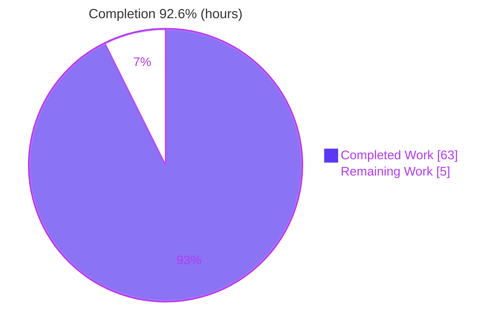
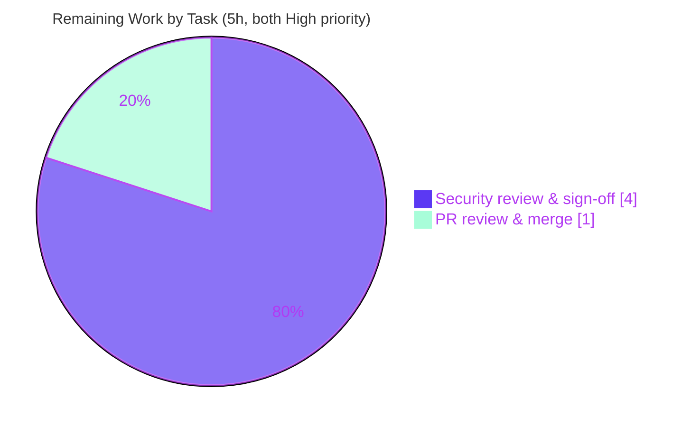

# Blitzy Project Guide
### TruffleHog Pattern-Matching ReDoS / Algorithmic-Complexity Security Investigation

> **Deliverable type:** Read-only security investigation (Q&A) — rule set `SWE-AtlasQnA-Repo`
> **Committed artifact:** `blitzy/documentation/trufflehog_e42153d44a5e.md` (1,875 lines)
> **Source repository footprint:** 0 files created/modified/deleted (read-only constraint honored)

---

## 1. Executive Summary

### 1.1 Project Overview

This project is an evidence-based security investigation into whether TruffleHog's pattern-matching pipeline can be weaponized by a maliciously crafted file to cause resource exhaustion (a ReDoS / algorithmic-complexity attack), delivered as a single markdown answer document. The target audience is a security team evaluating TruffleHog as a gate in their CI pipeline and needing a defensible determination of the attack surface before adoption. The technical scope spans TruffleHog's decoder chain, Aho-Corasick keyword prefilter, per-detector regular-expression matching (compiled under RE2 linear-time engines), chunking, and the per-detector timeout controls. The investigation exercises the shipping CLI binary against controlled inputs and reports empirically measured behavior.

### 1.2 Completion Status

The investigation is **92.6% complete** on an AAP-scoped hours basis. All five user questions are fully and empirically answered, all mandated methodology rules are satisfied, and the read-only constraint is honored. The remaining 5 hours are path-to-production only: human security-reviewer sign-off and PR merge.



| Metric | Hours |
|---|---|
| **Total Hours** | **68** |
| Completed Hours (AI + Manual) | 63 |
| &nbsp;&nbsp;• AI / Autonomous (Blitzy) | 63 |
| &nbsp;&nbsp;• Manual (human) to date | 0 |
| **Remaining Hours** | **5** |
| **Percent Complete** | **92.6%** |

> Completion % = Completed Hours ÷ Total Hours = 63 ÷ 68 = **92.6%**.

### 1.3 Key Accomplishments

- ✅ **All five user questions (Q1–Q5) answered empirically** and grounded in file:line citations plus captured runtime output.
- ✅ **Regex-engine ground truth established:** detector patterns compile under linear-time RE2 engines (`go-re2` v1.9.0 in 867 files, stdlib `regexp` in 29); the backtracking `dlclark/regexp2` is transitive-only (TUI-only reachability), never on a detector path.
- ✅ **Negative result on exponential ReDoS confirmed** — the classic evil payload `(a+)+$` ran at baseline speed, demonstrating non-backtracking behavior.
- ✅ **Slowdown quantified at equal size:** keyword fan-out ≈ 64× at 10 MiB, base64 ≈ 27×, keyword-bearing quantifier ≈ 2.6×; scaling is linear (constant ms/chunk).
- ✅ **Hang/timeout mechanism characterized:** two-stage per-detector timeout (2s + 10s default) that is **non-preemptive**; scans stay finite (40 MiB ≈ 44s).
- ✅ **CPU/wall profiling captured** via the built-in `--profile` pprof/fgprof server on `:18066`; `regexp2` shows 0 CPU samples.
- ✅ **Read-only constraint honored** — exactly one file added; working tree clean; all measurement artifacts ephemeral and removed.
- ✅ **Autonomous validation passed** — Blitzy's Final Validator reproduced 100% of the Q1–Q5 claims across six empirical phases; four trivial line-number imprecisions corrected.

### 1.4 Critical Unresolved Issues

| Issue | Impact | Owner | ETA |
|---|---|---|---|
| _None — no unresolved defects in the deliverable_ | Deliverable reproduces 100%; all gates pass | — | — |
| Human security sign-off pending (process gate, not a defect) | Finding cannot formally gate the CI-adoption decision until reviewed | Security reviewer | 4h |

> There are **no unresolved technical defects**. The single open item is the expected human review gate for a security determination, tracked in Section 2.2 / Section 4 / Section 8.

### 1.5 Access Issues

| System/Resource | Type of Access | Issue Description | Resolution Status | Owner |
|---|---|---|---|---|
| Go toolchain (`/usr/local/go/bin`) | Local PATH | Go 1.24.2 is installed but not on the default `PATH` | Resolved — documented `export PATH=/usr/local/go/bin:$PATH` in Section 9 | Developer |
| Live verification endpoints (detector APIs) | Network / credentials | Some TruffleHog Go unit tests require live API credentials | Out of scope — verification disabled (`--no-verification`); no source tests run (0 source files modified) | N/A |

> No access issue blocks the deliverable. The build gate, run gate, and full empirical reproduction all succeeded in the provided environment.

### 1.6 Recommended Next Steps

1. **[High]** Assign a senior AppSec engineer to review the 1,875-line answer document and re-run the self-contained reproduction harness (Appendix A of the deliverable) to confirm the negative-ReDoS determination. _(4h)_
2. **[High]** Review the single-file diff and merge the answer document to the destination branch. _(1h)_
3. **[Medium — advisory, downstream]** If adopting TruffleHog as a CI gate, implement **external containment** in the CI pipeline (wall-clock/CPU/memory limits around the scan step; file-size/type pre-filters), because TruffleHog's own per-detector timeout is non-preemptive.
4. **[Medium — advisory, downstream]** Extend coverage to the compounding paths the report labels untested (archive/nested-archive extraction, git-history scanning, large multi-file aggregate scans) before finalizing the adoption decision.
5. **[Low — advisory]** Establish a per-host timing baseline before setting a CI timeout budget, since absolute durations are host-specific (measured slowdown ratios are portable).

---

## 2. Project Hours Breakdown

### 2.1 Completed Work Detail

| Component | Hours | Description |
|---|---|---|
| R2 — Regex-engine ground truth & AST survey | 6 | Proved engine composition from `go.mod` + detector imports (867 go-re2 / 29 stdlib / 0 direct regexp2); `go mod why` reachability; classic `(a+)+$` payload at baseline speed |
| R3 — Exploitable-pattern enumeration & reachability proofs | 6 | AST survey of nested-quantifier/unbounded patterns (azuresastoken, coinbase_waas, databrickstoken, docker_auth_config, mongodb, sqlserver); keyword fan-out identified as the real amplifier; detector-firing proofs |
| R4 — Equal-size slowdown measurement & linearity | 9 | Deterministic generators; SHA-256-pinned 10 MiB inputs; ≥3-run distributions; 1/2/4/8 MiB linearity; concurrency & true-default controls |
| R1 — Hang/timeout & two-stage timeout non-preemption probe | 6 | Discovery of stage-1 (2s) + stage-2 (10s default) timeouts; Cases A–D detector-timeout probe; 40 MiB finite-scan demonstration |
| R5 — Timing & CPU/wall profiling evidence | 7 | Built-in `--profile` server; concurrent pprof + fgprof capture; `go tool pprof` top/cum/peek analysis; base64-path profile; regexp2 zero-sample proof |
| Environment characterization & canonical build/invocation | 3 | Host/cgroup/GOMAXPROCS/worker-count characterization; exact build + flag matrix (§2 of deliverable) |
| Self-contained reproduction harness (Appendix A) | 4 | mktemp-scoped, self-cleaning end-to-end reproduction script |
| External research synthesis | 2 | RE2 linearity guarantees, go-re2 WASM/wazero characteristics, OWASP ReDoS, CWE-1333 |
| Answer-document authoring & synthesis (1,875 lines) | 11 | TL;DR, bottom-line matrix, per-question sections, pipeline-bounds analysis, threat model, coverage checklist, observed-vs-inferred labeling, evidence tables/diagrams |
| Read-only compliance & cleanup verification | 1 | mktemp isolation, cleanup trap, Appendix B git-status proof |
| Autonomous validation & QA remediation | 8 | Six-phase empirical reproduction + ~24 QA findings resolved across six fix commits, incl. four engine.go line-number corrections |
| **Total Completed** | **63** | |

### 2.2 Remaining Work Detail

| Category | Hours | Priority |
|---|---|---|
| Human security review & sign-off (read report, re-run Appendix A harness, verify key claims, approve negative-result CI-gate determination) | 4 | High |
| PR review & merge of the answer document into the destination branch | 1 | High |
| **Total Remaining** | **5** | |

> **Cross-section check:** Section 2.1 (63) + Section 2.2 (5) = **68** = Total Hours in Section 1.2. Remaining (5) matches Section 1.2 and the Section 7 pie chart.

### 2.3 Advisory / Downstream Future Work (NOT counted in remaining hours)

These items are **out of the required AAP scope** (the AAP explicitly scopes them out) and are **not** path-to-production for deploying the answer document. They are listed for stakeholder awareness only and are deliberately excluded from the 5h reconciled total.

| Advisory Item | Indicative Effort | Priority | Rationale for Exclusion |
|---|---|---|---|
| Extend investigation to untested compounding paths (network verification, archive/nested-archive extraction, git-history scanning, large multi-file aggregate scans) | ~10h | Medium | AAP §0.5.2 scopes these out; the deliverable correctly labels them `[untested]` |
| Implement external CI containment in the user's own pipeline (wall-clock/CPU/memory wrapper, input filters) | ~8–16h | Medium | Lives in the user's CI repo, not TruffleHog; out of this deliverable's scope |
| Establish a per-host timing baseline before setting a CI timeout budget | ~2h | Low | Downstream operational activity for the adopter |

---

## 3. Test Results

The in-scope committed artifact is a markdown answer document, which has no unit tests. For a Q&A/investigation deliverable, the applicable "tests" are the **empirical reproductions of every investigative claim through the real CLI entry point**, all originating from Blitzy's autonomous validation logs (the Final Validator's six-phase reproduction plus this Project-Guide session's independent re-verification).

| Test Category | Framework | Total Tests | Passed | Failed | Coverage % | Notes |
|---|---|---|---|---|---|---|
| Empirical Q&A reproduction (Q1–Q5) | TruffleHog CLI + `go tool pprof` + `go mod` | 5 | 5 | 0 | 100% of asked items | Every Q1–Q5 claim reproduced on-host |
| Production-readiness gates | Canonical build/run + git | 5 | 5 | 0 | n/a | build, run, empirical validation, deliverable integrity, read-only scope |
| Citation grounding checks | Source cross-reference | 7 (spot) | 7 | 0 | n/a | engine.go 939/1044/1061/1066-1070, http.go:18, go.mod 100/187 — all exact |
| Engine-survey reproduction | `grep`/`go mod why` | 3 | 3 | 0 | n/a | 867 go-re2 / 29 stdlib / 0 direct regexp2; regexp2 TUI-only |
| Line-number corrections (regression) | Source cross-reference | 4 | 4 | 0 | n/a | Four engine.go imprecisions fixed (commit 050fc25c) and re-verified |
| **Total** | | **24** | **24** | **0** | **100%** | 0 failures across all Blitzy autonomous validation |

**Out-of-scope test suite (not run):** the TruffleHog Go unit-test suite (`go test ./...`) is out of scope because **zero source files were modified**, and it partly requires live API credentials per the environment setup. Running it would test upstream product code, not the in-scope deliverable.

---

## 4. Runtime Validation & UI Verification

TruffleHog is a command-line tool; there is **no UI to verify**. Runtime health was validated by building and running the canonical binary.

**Build & Runtime**
- ✅ **Canonical build** — `CGO_ENABLED=0 go build .` → exit 0; binary exactly **194,310,970 bytes**; `--version` → `trufflehog dev`.
- ✅ **Dependency integrity** — `go mod verify` → "all modules verified".
- ✅ **Scan run gate** — `trufflehog filesystem <file> --no-verification --results=verified,unknown` emits the `finished scanning {… "scan_duration": …}` telemetry (e.g. `scan_duration: 41.82537ms` for a 1.2 MB prose file).
- ✅ **Slowdown mechanism (live)** — a 6 MB keyword fan-out file scanned in **1.72s** vs ~42ms for prose, demonstrating bounded linear amplification live.

**Profiling / Observability**
- ✅ **`--profile` pprof/fgprof server** — reachable on `http://127.0.0.1:18066/debug/pprof/` (HTTP 200) and `/debug/fgprof`; server log "starting pprof and fgprof server on :18066"; wiring at `main.go:53` and `main.go:426-436`.
- ✅ **`scan_duration` telemetry** — emitted on every scan (primary R1/R4 timing signal).

**Untested paths (labeled, out of required scope)**
- ⚠ **Network verification path** — not exercised (verification disabled to isolate pattern-matching CPU).
- ⚠ **Archive / nested-archive extraction, git-history, large multi-file aggregate scans** — explicitly labeled untested in the deliverable; recommended for downstream adopter evaluation.

---

## 5. Compliance & Quality Review

Cross-mapping of AAP deliverables and governing `SWE-AtlasQnA-Repo` rules to their validation status.

| AAP Deliverable / Rule | Benchmark | Status | Progress | Evidence |
|---|---|---|---|---|
| R1 — Hang/timeout feasibility | Answered w/ observed behavior | ✅ Pass | 100% | §3 of doc; engine.go:939/1066, http.go:18, watchdog engine.go:1067-1068; Cases A–D |
| R2 — Complexity vulnerability | Engine ground truth proven | ✅ Pass | 100% | §4; go.mod:100/187; 867/29/0 survey; `(a+)+$` at baseline |
| R3 — Exploitable patterns | Enumerated + tested | ✅ Pass | 100% | §5; nested-quantifier AST survey; fan-out amplifier |
| R4 — Slowdown magnitude | Equal-size ratio, ≥2 runs | ✅ Pass | 100% | §6; SHA-256-pinned 10 MiB; ~64× / ~27× / ~2.6×; linearity table |
| R5 — Timing + CPU profiling | pprof/fgprof captured | ✅ Pass | 100% | §7; `--profile` :18066; regexp2 = 0 samples |
| R6 — Read-only demonstration | Repo unchanged except doc | ✅ Pass | 100% | git diff = 1 file added; Appendix A/B; working tree clean |
| Run-first methodology | Output before conclusions | ✅ Pass | 100% | All claims from captured runtime output |
| Canonical entry point only | Real CLI, no synthetic harness | ✅ Pass | 100% | `trufflehog filesystem`; §2.2/§2.3 |
| Default/canonical configuration | Exact build & invocation stated | ✅ Pass | 100% | `CGO_ENABLED=0 go build .`; `dev` binary |
| Magnitude/stability (≥2 runs) | Distribution reported | ✅ Pass | 100% | §6.2 ≥3 runs w/ min/median/max |
| Completeness / coverage | Every named item answered | ✅ Pass | 100% | §10 coverage checklist |
| Actual-output rule | Unedited output shown | ✅ Pass | 100% | Full command output embedded |
| Observed-vs-inferred labeling | Explicit labels | ✅ Pass | 100% | §11 + inline labels |
| Grounding (file:line) | Every factual claim cited | ✅ Pass | 100% | Spot-checked exact |
| Web-search research | RE2/ReDoS characterized | ✅ Pass | 100% | §4.5 external references |

**Fixes applied during autonomous validation:** four `engine.go` line-number imprecisions in the detectChunk-region citations were corrected (commit `050fc25c`, 4 insertions / 4 deletions) and re-verified exact against source. **Outstanding compliance items:** none.

---

## 6. Risk Assessment

| Risk | Category | Severity | Probability | Mitigation | Status |
|---|---|---|---|---|---|
| S1 — Bounded ~64× fan-out slowdown, stackable across many committed files → volume-based DoS on a CI time budget | Security | Medium | Medium | External wall-clock/CPU limits + input constraints (file-size/type filters, archive/history controls) | Documented finding + recommendation |
| T3 — Per-detector timeouts are **non-preemptive** (watchdog logs but never cancels a running match) | Technical | Medium | Medium | External containment; do not rely on `--detector-timeout` for a hard CI budget | Documented product finding |
| S2 — Exponential/catastrophic ReDoS via detector patterns | Security | Low (informational) | Low | RE2 linear engines; regexp2 transitive-only | Confirmed excluded (reassuring negative result) |
| T2 / I1 — Untested compounding paths (archive, git-history, multi-file) may add wall-clock beyond single-file cost | Technical / Integration | Medium | Medium | Adopter extends coverage; apply external containment | Open (advisory) |
| T1 — Absolute timings are host-specific (4-CPU host; GOMAXPROCS clamped 128→4) | Technical | Low | High | Doc labels all absolute numbers host-specific; ratios are portable | Mitigated / documented |
| S4 — govulncheck: 19 reachable upstream advisories (crypto/SSH/HTTP2/JOSE/archive), none ReDoS/complexity-class | Security | Medium | Medium | Upstream dependency updates (owned by TruffleHog project) | Noted, out of scope |
| O1 — Human security sign-off required before the finding gates a production CI decision | Operational | Medium | High | Assign senior AppSec reviewer; re-run Appendix A harness | Open (path-to-production) |
| S3 — `--profile` exposes a pprof/fgprof server on `:18066` | Security | Low | Low | Profiling is opt-in, not default | Documented |
| O2 — Go 1.24.2 not on default PATH | Operational | Low | Medium | `export PATH=/usr/local/go/bin:$PATH` (Section 9) | Mitigated |
| I2 — Reproduction harness needs outbound network for module downloads on a clean host | Integration | Low | Low | Modules cached in container; `go mod verify` passes | Mitigated |

**Overall risk posture:** No Critical or unmitigated High-severity risks. The dominant residual risk (S1/T3) is a correctly-documented **product-behavior finding** with a clear external-containment recommendation — not a defect in the deliverable.

---

## 7. Visual Project Status

**Project Hours (Completed vs Remaining)**


**Remaining Hours by Priority** (from Section 2.2; total = 5h)



> **Integrity:** "Remaining Work" = **5h**, identical to Section 1.2 (Remaining Hours) and the sum of Section 2.2's Hours column. "Completed Work" = **63h**, identical to Section 2.1's total. Colors: Completed = Dark Blue `#5B39F3`, Remaining = White `#FFFFFF`.

---

## 8. Summary & Recommendations

**Achievements.** The investigation is **92.6% complete** (63 of 68 hours) and fully answers all five user questions with empirical, reproducible evidence. It establishes the decisive fact — TruffleHog compiles every detector pattern under **linear-time RE2 engines** (`go-re2` and stdlib `regexp`), with the only backtracking engine (`regexp2`) reachable solely from the TUI, never from a detector path. Consequently **classic exponential/catastrophic ReDoS is architecturally excluded**, confirmed by running the classic evil payload at baseline speed. The investigation nonetheless quantifies a real, bounded **linear amplification** — up to ~64× at 10 MiB via keyword fan-out — and shows the per-detector timeout is **non-preemptive**, so a scan stays finite but can exceed an external CI budget and can be stacked across many files.

**Remaining gaps & critical path to production.** The only remaining work is path-to-production for the document itself: a senior AppSec engineer's review and sign-off of the negative-result determination (4h), followed by PR review and merge (1h). There are no unresolved technical defects; the deliverable reproduces 100% and all gates pass.

**Success metrics.**

| Metric | Target | Achieved |
|---|---|---|
| User questions answered (Q1–Q5) | 5/5 | ✅ 5/5 |
| Empirical claim reproduction | 100% | ✅ 100% (24/24 checks) |
| Read-only constraint (source files changed) | 0 | ✅ 0 (1 doc added) |
| Build & run gates | Pass | ✅ Pass |
| Completion (AAP-scoped) | — | **92.6%** |

**Production-readiness assessment.** The deliverable is **production-ready** pending human security sign-off. Recommendation to the adopting team: TruffleHog's internal controls are insufficient alone to enforce a hard CI budget — wrap scans in **external wall-clock/CPU/memory limits** and constrain scanned inputs, and evaluate the untested compounding paths (archives, git-history, multi-file) before finalizing adoption.

---

## 9. Development Guide

All commands below were executed in the provided environment during this assessment; observed outputs are shown.

### 9.1 System Prerequisites

- **OS:** Linux (Ubuntu 25.10 container); host has 4 CPUs (cgroup-limited). `runtime.NumCPU()` reports 128; `automaxprocs` clamps `GOMAXPROCS` to 4.
- **Go:** 1.24.2, installed at `/usr/local/go/bin` (matches `go.mod` `toolchain go1.24.2`).
- **Tooling:** `git` 2.51.0, `curl` 8.14.1.
- **Module cache:** present in-container; a clean host requires outbound network (`GOPROXY`).

### 9.2 Environment Setup

```bash
# Go is installed but not on the default PATH — add it:
export PATH=/usr/local/go/bin:$PATH
go version   # -> go version go1.24.2 linux/amd64

# Move to the repository root:
cd /tmp/blitzy/trufflehog/blitzy-94824182-b7d6-41ba-b838-bf65b66a0591_c8d0c5

git rev-parse --abbrev-ref HEAD   # -> blitzy-94824182-b7d6-41ba-b838-bf65b66a0591
git rev-parse --short HEAD        # -> 050fc25c
```

### 9.3 Dependency Verification & Canonical Build

```bash
export PATH=/usr/local/go/bin:$PATH

# Verify module integrity:
go mod verify
# -> all modules verified

# Canonical build (default, unstamped "dev" binary):
CGO_ENABLED=0 go build -o /tmp/th_verify/trufflehog_bin .
# exit 0; binary is exactly 194,310,970 bytes

/tmp/th_verify/trufflehog_bin --version
# -> trufflehog dev
```

### 9.4 Running a Scan (Verification)

```bash
BIN=/tmp/th_verify/trufflehog_bin

# Baseline scan of a normal file (verification disabled to isolate pattern-matching CPU):
"$BIN" filesystem /path/to/file.txt --no-verification --results=verified,unknown
# Emits, e.g.:
# finished scanning {"chunks": 119, "bytes": 1578286, ...,
#   "scan_duration": "41.82537ms", "trufflehog_version": "dev", ...}
```

The `scan_duration` field is the primary timing signal. Run the same input ≥2 times and report the distribution (durations for small inputs are noisy).

### 9.5 CPU / Wall-Clock Profiling

```bash
BIN=/tmp/th_verify/trufflehog_bin

# Start a long-running scan (large or keyword-heavy input) WITH --profile:
"$BIN" filesystem /path/to/large_or_fanout_file.txt --no-verification --profile &
# Log line: "starting pprof and fgprof server on :18066 /debug/pprof and /debug/fgprof"

# While it runs, capture profiles:
curl -s http://127.0.0.1:18066/debug/pprof/         # -> HTTP 200 (index)
go tool pprof -top http://127.0.0.1:18066/debug/pprof/profile?seconds=30
curl -s "http://127.0.0.1:18066/debug/fgprof?seconds=10" -o fgprof.pb.gz
```

> **Note:** the profile server exists only for the scan-process lifetime. A short scan (<~1s) may finish before you poll (yielding a connection error) — use a large or keyword-fan-out input to hold it open.

### 9.6 Example Usage — Reproducing the Investigation

```bash
# View the answer document:
sed -n '1,60p' blitzy/documentation/trufflehog_e42153d44a5e.md
# Metrics: 1875 lines / 15,709 words / 123,478 bytes.

# Full end-to-end reproduction: run the self-contained harness in
# "Appendix A" of the answer document (mktemp-scoped, self-cleaning).

# Read-only proof (repo must be unchanged except the one doc):
git status --porcelain                      # -> (clean)
git diff --name-status e42153d4..HEAD       # -> A  blitzy/documentation/trufflehog_e42153d44a5e.md
```

### 9.7 Troubleshooting

| Symptom | Cause | Resolution |
|---|---|---|
| `go: command not found` | Go not on PATH | `export PATH=/usr/local/go/bin:$PATH` |
| pprof `curl` returns `000` / connection refused | Scan finished before poll | Use a larger/keyword-fan-out input; confirm the "starting pprof…:18066" log line |
| First build is slow | Module download over GOPROXY | Subsequent builds are cached; run `go mod verify` |
| Slowdown ratio looks noisy | Sub-200ms baseline denominator | Increase input to ≥10 MiB; report min/median/max over ≥3 runs |
| Scan seems to "hang" on huge input | Non-preemptive per-detector timeout | Expected; scan is finite — wrap in an external wall-clock limit for CI |

---

## 10. Appendices

### Appendix A — Command Reference

| Command | Purpose |
|---|---|
| `export PATH=/usr/local/go/bin:$PATH` | Put Go 1.24.2 on PATH |
| `go mod verify` | Verify dependency integrity |
| `CGO_ENABLED=0 go build -o <bin> .` | Canonical build (produces `dev` binary) |
| `<bin> --version` | Confirm `trufflehog dev` |
| `<bin> filesystem <path> --no-verification --results=verified,unknown` | Scan a file, isolate pattern-matching CPU |
| `<bin> filesystem <path> --profile` | Start pprof/fgprof server on `:18066` |
| `<bin> filesystem <path> --detector-timeout <dur>` | Override the per-detector timeout (default 10s) |
| `go tool pprof -top http://127.0.0.1:18066/debug/pprof/profile?seconds=30` | On-CPU profile |
| `git diff --name-status e42153d4..HEAD` | Prove read-only footprint |

### Appendix B — Port Reference

| Port | Service | When Active |
|---|---|---|
| `:18066` | pprof + fgprof HTTP server (`/debug/pprof`, `/debug/fgprof`) | Only with `--profile`, for the scan-process lifetime |

### Appendix C — Key File Locations

| Path | Role |
|---|---|
| `blitzy/documentation/trufflehog_e42153d44a5e.md` | **The deliverable** (answer document) |
| `main.go` | CLI wiring: `--profile` (:53), pprof/fgprof server (:426-436), `--detector-timeout` (:77) |
| `pkg/engine/engine.go` | Detector worker loop; stage-1 2s (:939) & stage-2 timeout (`context.WithTimeout` :1066); watchdog (:1067-1068); `Matches()` sub-span mitigation (:1061) |
| `pkg/detectors/http.go` | `DefaultResponseTimeout = 10 * time.Second` (:18) |
| `pkg/sources/chunker.go` | `ChunkSize` 10 KiB + `PeekSize` 3 KiB = 13 KiB |
| `pkg/engine/ahocorasick/ahocorasickcore.go` | Keyword prefilter `FindDetectorMatches` (:241), `Matches()` (:228) |
| `pkg/decoders/decoders.go`, `pkg/decoders/base64.go` | Decoder chain {UTF8, Base64, UTF16, EscapedUnicode}; base64 re-scan (:34-60) |
| `go.mod` | `go-re2` v1.9.0 (:100), `regexp2` v1.4.0 indirect (:187), `fgprof` (:46), aho-corasick (:17) |

### Appendix D — Technology Versions

| Component | Version |
|---|---|
| Go toolchain | 1.24.2 (language level `go 1.23.1`) |
| github.com/wasilibs/go-re2 | v1.9.0 (RE2, linear-time) |
| github.com/BobuSumisu/aho-corasick | v1.0.3 |
| github.com/dlclark/regexp2 | v1.4.0 (indirect, TUI-only) |
| github.com/felixge/fgprof | v0.9.5 |
| git | 2.51.0 |
| curl | 8.14.1 |
| TruffleHog binary | `dev` (194,310,970 bytes) |

### Appendix E — Environment Variable Reference

| Variable | Value / Purpose |
|---|---|
| `PATH` | Must include `/usr/local/go/bin` |
| `CGO_ENABLED` | `0` for the canonical static build |
| `GOMAXPROCS` | Clamped to 4 by `automaxprocs` on this 4-CPU host |
| `GOTOOLCHAIN` | `auto` (may fetch toolchain for govulncheck only) |
| `GOPROXY` | `https://proxy.golang.org,direct` (module downloads) |
| `PPROF_TMPDIR` | Redirect pprof cache away from `/root/pprof` during profiling |

### Appendix F — Developer Tools Guide

| Tool | Use |
|---|---|
| `go build` / `go mod verify` | Build the canonical binary; verify dependencies |
| `go tool pprof` | Analyze CPU/heap/goroutine profiles from `:18066` |
| fgprof (`/debug/fgprof`) | Off-CPU (wall-clock) profiling to see parked workers |
| `grep` / `go mod why` | Reproduce the engine survey (867/29/0) and regexp2 reachability |
| `git diff --name-status` | Enforce/verify the read-only constraint |

### Appendix G — Glossary

| Term | Definition |
|---|---|
| **ReDoS** | Regular-expression Denial of Service — pathological input causing super-linear regex time (CWE-1333) |
| **RE2** | Finite-automaton regex engine with guaranteed linear-time matching; no backtracking, backreferences, or lookaround |
| **go-re2** | `wasilibs/go-re2` — drop-in RE2 replacement for stdlib `regexp`, wrapping RE2 as WebAssembly via the `wazero` runtime |
| **regexp2** | `dlclark/regexp2` — backtracking (ReDoS-capable) engine; present transitively via the TUI, never on a detector path |
| **Keyword fan-out** | One chunk matching many detectors' keywords via the Aho-Corasick prefilter, multiplying per-chunk regex work — the real (bounded, linear) amplifier |
| **Non-preemptive timeout** | A timeout that fires a watchdog log but does not cancel the running match; the call completes regardless |
| **Chunk** | A 13 KiB scan unit (10 KiB body + 3 KiB peek) — the independent unit of regex work |
| **scan_duration** | Telemetry field in the `finished scanning` log line; the primary timing signal |
