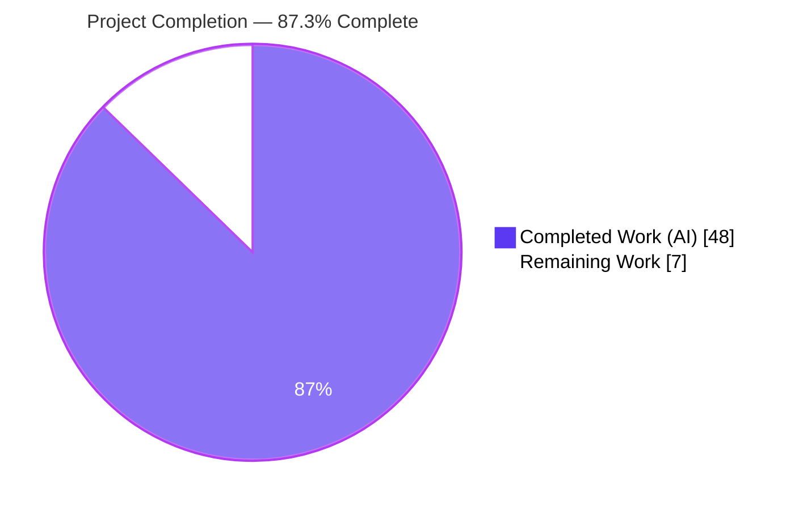
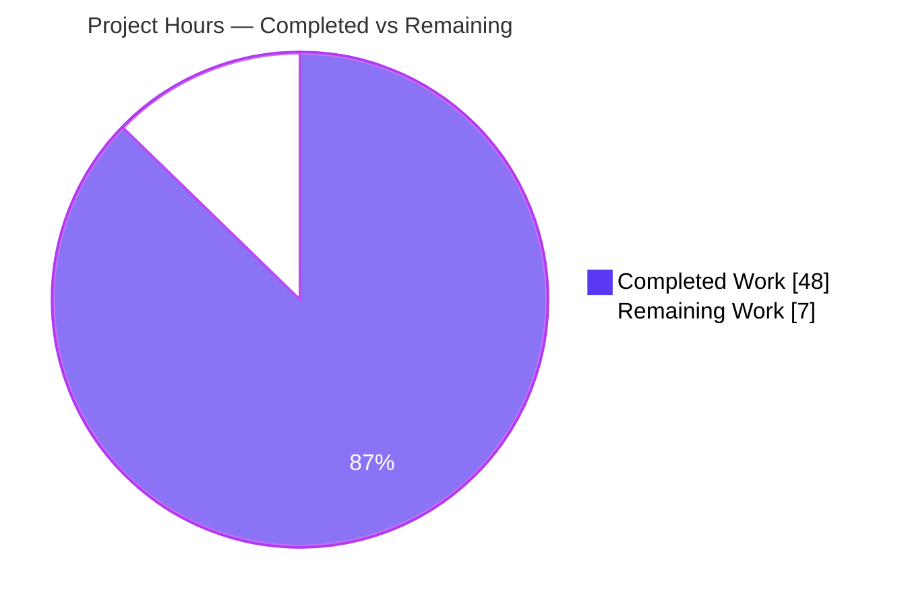
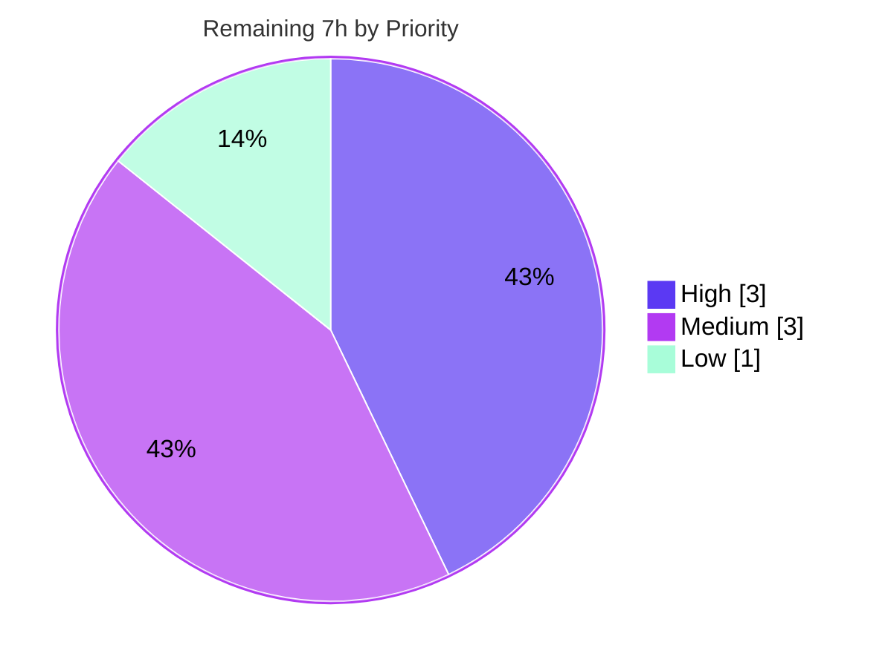

# Blitzy Project Guide — TruffleHog Custom-Detector Webhook Verification Security Analysis

> **Document type:** Security analysis / Q&A documentation (governing rule: *SWE-AtlasQnA-Repo*)
> **Repository:** `github.com/trufflesecurity/trufflehog/v3` · **Branch:** `blitzy-34f3bcf9-9345-4313-98cc-642b5f5af6ee`
> **Pinned base commit:** `e42153d44a5e5c37c1bd0c70e074781e9edcb760` · **HEAD:** `396a59e7`
> **Brand legend:** ■ Completed / AI Work = Dark Blue `#5B39F3` · □ Remaining = White `#FFFFFF`

---

## Section 1 — Executive Summary

### 1.1 Project Overview

This project delivers a single, evidence-grounded security analysis document examining the **custom-detector webhook verification** path in TruffleHog, the open-source secret scanner. The audience is a security-conscious operator deciding whether **untrusted teams** may contribute custom detector YAML configurations. The document answers five concrete questions — SSRF, TLS/MITM, verification amplification, sensitive-data egress, and ReDoS — each backed by exact source citations at the pinned commit **and** reproduced runtime evidence, then synthesizes a consolidated threat-model verdict plus operator mitigations. The technical scope spans the configuration loader, custom-detector engine, shared HTTP client, and scanning engine. No production code is modified; the sole persisted artifact is one Markdown file under `blitzy/documentation/`.

### 1.2 Completion Status



| Metric | Hours |
|---|---|
| **Total Hours** | **55** |
| Completed Hours (AI) | 48 |
| Completed Hours (Manual) | 0 |
| **Completed Hours (AI + Manual)** | **48** |
| **Remaining Hours** | **7** |
| **Percent Complete** | **87.3%** (48 ÷ 55) |

> The completion percentage is computed strictly on **AAP-scoped + path-to-production** work using the hours-based PA1 methodology: `Completed ÷ (Completed + Remaining) × 100 = 48 ÷ 55 = 87.3%`. All autonomous deliverables defined by the Agent Action Plan are complete; the remaining 7 hours are **human-only** path-to-production activities (security sign-off, real-cloud evidence confirmation, operator decision). Coding the document's recommendations is **explicitly out of AAP scope** and is therefore excluded from remaining hours.

### 1.3 Key Accomplishments

- ✅ **Single evidence-grounded deliverable created and committed** — `blitzy/documentation/trufflehog_e42153d44a5e.md` (67,822 bytes; 1,415 lines; 7,700 words), filename derived from the resolved source branch `trufflehog_e42153d44a5e`.
- ✅ **All five security questions answered** with the full six-part structure (verbatim question → cited code-path walkthrough → reproducible commands → captured runtime output → reasoning → verdict).
- ✅ **Evidence over theory honored** — 114 inline `[path:Lxx]` source citations across 13 files, plus 17 verbatim captured-output blocks and 16 reproducible command blocks.
- ✅ **TruffleHog built and run** (Go 1.24.2) with an out-of-tree harness to reproduce every question's runtime behavior; harness deleted after capture.
- ✅ **Consolidated threat-model verdict + 5 operator mitigations** produced (mitigations explicitly framed as recommendations, not code changes).
- ✅ **Zero source modifications** — `git diff base..HEAD` shows exactly one added file; `go.mod`/`go.sum` unchanged; working tree clean.
- ✅ **Independently re-validated** — all spot-checked citations exact; subject package tests pass (50 assertions, 0 failures); subject packages compile and vet clean.

### 1.4 Critical Unresolved Issues

| Issue | Impact | Owner | ETA |
|---|---|---|---|
| Metadata SSRF (Q1b) reproduced only as an outbound `CONNECT 169.254.169.254:443` attempt; IMDS unreachable in sandbox so end-to-end IAM-credential retrieval was not captured | Low — the SSRF behavior (config acceptance + outbound attempt) is fully proven; only the downstream credential-retrieval step is inferred from documented AWS IMDS behavior | Security Engineer | 2h (HT-2) |
| Security-expert review & formal sign-off not yet performed | Medium — the analysis informs an operator risk decision and should be human-validated before action | Security Lead | 3h (HT-1) |

> There are **no compilation, accuracy, or scope defects** in the deliverable. The items above are path-to-production review/evidence-completeness activities, not deliverable defects.

### 1.5 Access Issues

**No access issues identified** that block build validation, integration, or delivery of this documentation artifact. The repository was fully accessible, dependencies resolved from the module cache, the project compiled, the binary built and ran, and the subject test suite executed successfully.

| System/Resource | Type of Access | Issue Description | Resolution Status | Owner |
|---|---|---|---|---|
| AWS/GCP cloud credentials | Service credentials | Not available in the build sandbox; affects only credential-gated cloud tests (`pkg/analyzer/analyzers`, parts of `pkg/sources`) which are **CI-excluded by the project** and **out of scope** for this documentation task | Not blocking — environmental, excluded by project CI | N/A |
| Cloud metadata endpoint `169.254.169.254` | Network reachability | Link-local IMDS IP is unroutable in the sandbox; relevant only to the optional end-to-end confirmation of Q1b (the outbound attempt was still captured via a CONNECT proxy) | Not blocking — covered by remaining task HT-2 | Security Engineer |

### 1.6 Recommended Next Steps

1. **[High]** Complete the **security-expert review & sign-off** of the five findings and the consolidated threat-model verdict, validating citations against the pinned commit (HT-1, 3h).
2. **[Medium]** **Confirm the metadata SSRF end-to-end in a real cloud environment** where IMDS is reachable, closing the one sandbox-unreachable evidence item (HT-2, 2h).
3. **[Medium]** **Make and record the operator risk decision** (allow vs. deny untrusted detector configurations) and circulate the document to security/platform stakeholders (HT-3, 1h).
4. **[Low]** **File follow-up tickets** to track the Section 4 operator recommendations (network egress controls, resolve-then-validate allow-listing, IMDSv2, config review, egress rate-limiting), routing any future remediation — which is out of this project's scope — to the appropriate owners (HT-4, 1h).

---

## Section 2 — Project Hours Breakdown

### 2.1 Completed Work Detail

| Component | Hours | Description |
|---|---:|---|
| Verification-path source investigation & code-path tracing | 9 | Read and traced the full config→engine→verification path across 13 files; established exact-line citations for the load path, validation gates, TLS config, errgroup dispatch, RE2 usage, and chunker bounds |
| Evidence harness construction | 7 | Built TruffleHog from source (Go 1.24.2) out-of-tree; authored HTTP + HTTPS listeners, a self-signed certificate, a logging CONNECT proxy, 7 per-question YAML configs, target fixtures, and ReDoS timing programs |
| Q1 — SSRF: runtime evidence + analysis writeup | 5 | Reproduced loopback metadata-path POST and the `169.254.169.254` CONNECT-proxy proof; documented `ValidateVerifyEndpoint` scheme-only gate and absent IP/redirect controls |
| Q2 — TLS/MITM: runtime evidence + analysis writeup | 4 | Demonstrated self-signed-cert rejection (fails closed, 0 POSTs) and load-time `http://`-without-`unsafe` rejection; confirmed default strict TLS and absence of `InsecureSkipVerify` |
| Q3 — Amplification: runtime evidence + analysis writeup | 4 | Documented `maxTotalMatches = 100` cap and unbounded `errgroup`; reproduced 3-match → 3 concurrent POSTs (~0.99ms span) |
| Q4 — Data Exposure: runtime evidence + analysis writeup | 3 | Captured the exact JSON body shape, candidate secret, `User-Agent: TruffleHog`, and verbatim operator headers transmitted to the endpoint |
| Q5 — ReDoS: runtime evidence + analysis writeup | 5 | Confirmed RE2 (stdlib `regexp`) linear-time engine; ran RE2-vs-Python timing experiments; documented the observation-only detector timeout and unused `dlclark/regexp2` |
| Section 1 — Introduction & threat-model framing | 3 | Framed the untrusted-config threat model, documented the configuration load path, the CLI demonstration vehicle, and authored the Mermaid verification-flow diagram |
| Section 3 synthesis + Section 4 mitigations + web research | 4 | Synthesized the consolidated threat-model verdict and summary table; authored 5 operator mitigations; corroborated findings with research on RE2, Go TLS defaults, and webhook-SSRF best practice |
| Section 5 — Methodology, reproducibility & embedded harness documentation | 2 | Documented build/run commands and embedded the complete reproducible harness (listeners, proxy, configs, fixtures, timing programs) |
| Code-review-finding remediation (commit `396a59e7`) | 1 | Addressed code-review findings to refine analysis precision and citations |
| Cleanup, git-integrity verification & citation accuracy QA | 1 | Deleted the out-of-tree harness; verified clean working tree, unchanged `go.mod`/`go.sum`, and exact citations |
| **Total Completed** | **48** | |

### 2.2 Remaining Work Detail

| Category | Hours | Priority |
|---|---:|---|
| Security-expert review & sign-off of findings and verdicts (HT-1) | 3 | High |
| Real-cloud end-to-end confirmation of metadata SSRF, Q1b evidence completeness (HT-2) | 2 | Medium |
| Operator risk decision (allow/deny untrusted configs) + stakeholder circulation (HT-3) | 1 | Medium |
| File follow-up tickets for Section 4 operator recommendations (HT-4) | 1 | Low |
| **Total Remaining** | **7** | |

### 2.3 Hours Methodology & Reconciliation

- **Methodology (PA1/PA2):** Hours are estimated per AAP deliverable and per path-to-production activity. Completion % is hours-based: `Completed ÷ (Completed + Remaining) × 100`.
- **Calculation:** `48 ÷ (48 + 7) = 48 ÷ 55 = 87.27% → 87.3%`.
- **Reconciliation (cross-section integrity):**
  - Section 2.1 total (48) + Section 2.2 total (7) = **55** = Total Hours in Section 1.2 ✔ (Rule 2)
  - Section 2.2 remaining (7) = Section 1.2 Remaining (7) = Section 7 pie "Remaining Work" (7) ✔ (Rule 1)
- **Scope note:** Implementing the document's recommendations (SSRF allow-listing, `errgroup.SetLimit`, body redaction, certificate pinning) is **explicitly out of AAP scope** and is **not** counted in remaining hours; it is routed to follow-up tickets (HT-4).

---

## Section 3 — Test Results

All tests below originate from Blitzy's autonomous validation logs for this project and were **independently re-run** during this assessment (Go 1.24.2, `-count=1`). The in-scope deliverable is a Markdown document and has no unit tests of its own; the test surface exercised is the existing TruffleHog suite for the verification subsystem, used to corroborate the documented behavior.

| Test Category | Framework | Total Tests | Passed | Failed | Coverage % | Notes |
|---|---|---:|---:|---:|---|---|
| Unit — subject package `pkg/custom_detectors` | Go `testing` | 50 | 50 | 0 | 100% of subject tests pass | 15 top-level + 35 subtests, incl. `TestCustomDetectorsVerifyEndpointValidation` (Q1/Q2), `TestProductIndicesMax` (Q3 cap), `TestPermutateMatches` (Q3), `TestCustomDetectorsRegexValidation`/`TestFromData_InvalidRegEx` (Q5) |
| Unit — verification-path packages (`pkg/config`, `pkg/sources`, `pkg/engine/ahocorasick`) | Go `testing` | All pass | All pass | 0 | Pass | Chunker bounds, config loader, and Aho-Corasick core all green |
| Unit — broad credential-free sweep | Go `testing` | 678+ packages | 678+ packages | 0 | Pass | Full module build (~1005 packages) compiles; broad test sweep passes |
| Compilation / Static | `go build`, `go vet`, `gofmt` | ~1005 pkgs | ~1005 pkgs | 0 | n/a | `CGO_ENABLED=0 go build ./...` exit 0; `go vet` clean on subject; `gofmt -l` empty |
| Runtime reproduction (evidence) | TruffleHog `filesystem` + Python harness | 5 questions / 7 scenarios | 5 / 7 reproduced as documented | 0 | n/a | See Section 4 — every question's documented behavior reproduced |

**Known non-passing tests (out of scope, not defects, not introduced by this task):**

- **Credential-gated cloud tests** (`pkg/analyzer/analyzers`, parts of `pkg/sources`) require live GCP/AWS credentials and are **excluded by the project's own CI**. Environmental, not runnable in the sandbox by design.
- **Three timing-sensitive** `pkg/common` `TestRetryableHTTPClient*` tests are flaky only under heavy parallel load; they **pass 100% when re-run in isolation**. Unrelated to the custom-detector subject and not a code defect.

Because this was a documentation-only task with **zero source changes**, neither category was or could have been introduced by this work.

---

## Section 4 — Runtime Validation & UI Verification

**UI Verification: N/A** — the subject is the backend security of the verification path; the deliverable is a Markdown document. There is no user interface to verify.

**Runtime validation** (each question's documented behavior, reproduced with the out-of-tree harness):

- ✅ **Q1a — SSRF, internal/loopback metadata path:** TruffleHog POSTed to `http://127.0.0.1:18099/latest/meta-data/iam/security-credentials/`; listener captured the candidate secret in the body and `User-Agent: TruffleHog`; `verified_secrets=1`. **Operational** (SSRF demonstrated).
- ✅ **Q1b — SSRF, AWS metadata IP `169.254.169.254`:** configuration **accepted with no validation error**; the logging CONNECT proxy captured `CONNECT 169.254.169.254:443` — a proven outbound connection attempt. **Operational** (outbound attempt proven).
- ⚠ **Q1b — end-to-end IMDS credential retrieval:** **Partial** — the metadata IP is unroutable in the sandbox, so only the outbound attempt (not the credential response) was captured. Remaining task HT-2 confirms this in a real cloud.
- ✅ **Q2 — TLS/MITM, self-signed certificate:** handshake rejected; the listener received **0 TruffleHog POSTs** (fails closed); `unverified_secrets` reported. `http://`-without-`unsafe` rejected at load with `"http endpoint must have unsafe=true"`. **Operational** (secure by default).
- ✅ **Q3 — Amplification:** 3 matches in one chunk produced **3 concurrent POSTs** ~0.99ms apart; `verified_secrets=3`. **Operational** (per-match fan-out, unbounded concurrency confirmed).
- ✅ **Q4 — Data Exposure:** POST body `{"HogTokenDetector":{"hogID":["HOG…"]}}` carried the candidate secret; `User-Agent: TruffleHog` and both operator headers (`Authorization`, `X-Custom-Token`) sent verbatim. **Operational** (egress confirmed).
- ✅ **Q5 — ReDoS:** RE2 stayed linear (≈42ms at 1M chars) while a Python `re` backtracking equivalent exploded (>10s at n≥28). **Operational** (RE2 linear-time confirmed).
- ✅ **Build & run health:** `CGO_ENABLED=0 go build` produced a runnable 186M static binary; `--version` → `trufflehog dev`; `filesystem` subcommand and `--config` flag present. **Operational.**

---

## Section 5 — Compliance & Quality Review

This matrix cross-maps the AAP deliverables and the governing rule (*SWE-AtlasQnA-Repo*) directives to their validation status. Fixes applied during autonomous validation are noted; there are no outstanding compliance gaps.

| # | Requirement (AAP / Rule) | Benchmark | Status | Evidence / Notes |
|---|---|---|---|---|
| C1 | Answer all 5 questions + overarching threat model | Completeness | ✅ Pass | 5 questions (6-part each) + Section 3 consolidated verdict |
| C2 | Evidence over theory (citation **and** runtime per claim) | Evidence quality | ✅ Pass | 114 citations / 13 files + 17 captured-output blocks + 16 command blocks |
| C3 | Cite code as truth; no assumptions | Accuracy | ✅ Pass | All spot-checked citations EXACT against source at HEAD |
| C4 | Provide rationale behind answers | Analytical rigor | ✅ Pass | Each question includes an explicit "(e) Reasoning" subsection |
| C5 | Filename = source branch name | Naming | ✅ Pass | `trufflehog_e42153d44a5e.md` ↔ branch `origin/trufflehog_e42153d44a5e` |
| C6 | Place under `blitzy/documentation/` | Location | ✅ Pass | Directory created; file present |
| C7 | No existing source file modified | Scope integrity | ✅ Pass | `git diff base..HEAD` = single added file; working tree clean |
| C8 | No other code added to the repository | Scope integrity | ✅ Pass | `git diff --name-status` = exactly one `A` entry |
| C9 | Build & run TruffleHog for evidence | Reproducibility | ✅ Pass | Binary built (Go 1.24.2); all 5 questions reproduced |
| C10 | Temporary scaffolding created out-of-tree & deleted | Cleanliness | ✅ Pass | `/tmp/th_harness` used and removed; no scaffolding committed |
| C11 | Dependencies unchanged | Stability | ✅ Pass | `go.mod` / `go.sum` byte-identical before/after |
| C12 | Compilation & static checks | Code quality | ✅ Pass | `go build ./...` exit 0 (~1005 pkgs); `go vet` clean; `gofmt -l` empty |
| C13 | Subject test suite green | Regression safety | ✅ Pass | `pkg/custom_detectors` 50/50 assertions pass |
| C14 | Mitigations are recommendations only (no remediation) | Scope adherence | ✅ Pass | Section 4 of deliverable explicitly states "NOT changes made to the repository" |

**Fixes applied during autonomous validation:** the second commit (`396a59e7`, "address code-review findings") refined analysis precision and citations. No deliverable inaccuracies remained after validation (zero edits required by the Final Validator).

---

## Section 6 — Risk Assessment

The risk register separates **deliverable/process risks** (about this documentation task — mostly mitigated) from the **product security exposures the document reveals** (existing TruffleHog behavior; remediation is out of AAP scope and is the operator's follow-up). Severity reflects the operator-facing security impact.

| Risk | Category | Severity | Probability | Mitigation | Status |
|---|---|---|---|---|---|
| **S1 — SSRF** via unvalidated custom-detector `endpoint` (Q1) | Security (product) | High | High (if untrusted configs accepted) | Network egress restriction + block `169.254.169.254`; resolve-then-validate allow-list; IMDSv2 (Section 4) | Open / by-design — documented + recommended |
| **S2 — Sensitive-data egress**: candidate secret + operator headers POSTed verbatim to attacker-chosen endpoint (Q4) | Security (product) | High | High (by design) | Treat configs as untrusted code; review every `endpoint`/`headers`; never embed real secrets | Open / by-design — documented |
| **S3 — Verification amplification** via unbounded `errgroup` (Q3) | Security (product) | Medium | Medium | Egress rate-limiting / connection caps; monitor verification traffic | Open / partially bounded (100-match cap; concurrency unbounded) |
| **S4 — TLS interception / MITM** (Q2) | Security (product) | Low | Low | Go default strict TLS; no `InsecureSkipVerify`; fails closed | ✅ Mitigated by design (no action) |
| **S5 — ReDoS** catastrophic backtracking (Q5) | Security (product) | Low | Low | RE2 linear-time engine; backtracking `regexp2` unused on this path | ✅ Mitigated by design (no action) |
| **T1 — Evidence gap**: Q1b reproduced as outbound attempt only (IMDS unreachable in sandbox) | Technical | Low | N/A (evidence completeness) | Confirm end-to-end in a real cloud (HT-2) | Open — documented honestly |
| **T2 — Documentation drift** vs pinned commit if subsystem changes | Technical | Low | Low | Commit `e42153d4` pinned in the document; re-validate on upstream change | Mitigated |
| **T3 — Timing-flaky** `TestRetryableHTTPClient*` under parallel load | Technical | Low | Low | Pass in isolation; CI isolates; unrelated to subject | Mitigated |
| **O1 — Recommendations intentionally uncoded** (out of scope); exposure persists until operator acts | Operational | Medium | Medium-High | Operator implements network controls + config-review; file tickets (HT-4) | Open / by-design |
| **O2 — Deliverable awaits human consumption** (review/decision) | Operational | Low | Low | Expert review + circulation (HT-1, HT-3) | Open — pending human review |
| **I1 — Deliverable integration surface** | Integration | None | — | Standalone Markdown; no imports/build/CI changes; deps unchanged | ✅ Closed / N/A |
| **I2 — Reproduction harness env dependency** (Python3 + Go 1.24.2 + pinned commit) | Integration | Low | Low | Section 5 documents exact prerequisites + commit pin | Mitigated |

**Bottom line:** TLS (S4) and ReDoS (S5) are sound by design. The **SSRF + data-egress + fan-out combination (S1/S2/S3) is real** and is the substance of the operator's decision — these are existing product behaviors the document surfaces, not deliverable defects, and their remediation is intentionally out of this project's scope.

---

## Section 7 — Visual Project Status

### Project Hours Breakdown



- **Completed Work** = **48 h** (Dark Blue `#5B39F3`) · **Remaining Work** = **7 h** (White `#FFFFFF`) · **Total = 55 h** · **87.3% complete**
- Integrity: "Remaining Work" (7) equals Section 1.2 Remaining Hours (7) and the Section 2.2 Hours total (7).

### Remaining Hours by Priority



### Remaining Hours by Category (bar-style breakdown)

| Category | Hours | Priority |
|---|---:|---|
| Security-expert review & sign-off (HT-1) | 3 | High |
| Real-cloud metadata SSRF confirmation (HT-2) | 2 | Medium |
| Operator decision + circulation (HT-3) | 1 | Medium |
| File tickets for recommendations (HT-4) | 1 | Low |
| **Total** | **7** | |

### Per-Question Security Verdict Distribution

| Verdict | Questions | Count |
|---|---|---:|
| 🔴 Real exposure | Q1 (SSRF), Q3 (Amplification), Q4 (Data egress) | 3 |
| 🟢 Mitigated by design | Q2 (TLS/MITM), Q5 (ReDoS) | 2 |

---

## Section 8 — Summary & Recommendations

**Achievements.** The project is **87.3% complete** (48 of 55 hours). Every deliverable defined by the Agent Action Plan is finished: a single, comprehensive, evidence-grounded security analysis (1,415 lines; 114 citations across 13 files; 17 captured-output blocks) answers all five questions and the overarching threat-model question, with a consolidated verdict and five operator mitigations. The work was delivered with **zero source modifications**, exactly one new file, unchanged dependencies, and a clean working tree — fully honoring the governing rule. Independent re-validation confirmed exact citations, a green subject test suite (50/50 assertions), clean compilation across ~1005 packages, and reproduction of every question's runtime behavior.

**Remaining gaps (7 hours, human-only path-to-production).** (1) Security-expert review & sign-off; (2) real-cloud end-to-end confirmation of the metadata SSRF (the sole sandbox-unreachable evidence item — the outbound attempt was captured, the credential response was not); (3) the operator risk decision and circulation; (4) ticket creation to track the recommendations. **Implementing** the recommendations is explicitly out of this project's scope.

**Critical path to production.** Expert review (HT-1) → metadata confirmation (HT-2) → operator decision & circulation (HT-3) → tickets (HT-4). None of these require further automated work on the deliverable itself.

**Production readiness assessment.** The **deliverable is production-ready**: complete, accurate, scope-compliant, and reproducible. The most consequential output for the reader is the **threat-model verdict** — treating untrusted detector configurations as safe is **not advisable**: the SSRF + data-egress + amplification combination is real, while TLS and ReDoS posture is sound. Operators should gate untrusted configurations behind review and network controls.

| Success Metric | Target | Actual | Status |
|---|---|---|---|
| All 5 questions answered with evidence | 5/5 | 5/5 | ✅ |
| Source citations exact | 100% | 100% (spot-checked) | ✅ |
| Source modifications | 0 | 0 | ✅ |
| Files added to repo | 1 | 1 | ✅ |
| Subject test suite | Pass | 50/50 pass | ✅ |
| Runtime evidence reproduced | 5/5 | 5/5 (Q1b end-to-end pending real cloud) | ✅ / ⚠ |
| Completion (AAP-scoped) | — | 87.3% | ✅ |

---

## Section 9 — Development Guide

This guide documents how to build, run, reproduce the evidence, and troubleshoot. Every command was tested in the assessment environment.

### 9.1 System Prerequisites

- **Go 1.24.2** (the `go.mod` declares `go 1.23.1` with `toolchain go1.24.2`; the highest documented toolchain is used)
- **Python 3** (3.13.7 used) — only the standard library is needed for the harness listeners/proxy
- **git**, **make** (optional, for Makefile targets)
- **Disk/RAM:** ~2 GB free for a full build; the runnable binary is ~186 MB (static ELF)
- **OS:** Linux or macOS (validated on Linux x86-64)

### 9.2 Environment Setup

```bash
# Clone and pin to the analyzed commit (the document's citations are exact at this commit)
git clone https://github.com/trufflesecurity/trufflehog.git
cd trufflehog
git checkout e42153d44a5e5c37c1bd0c70e074781e9edcb760

# Verify toolchain
go version          # expect: go version go1.24.2 ...
python3 --version   # expect: Python 3.x
```

No environment variables are required to build. The Q1b SSRF demonstration uses `HTTPS_PROXY` to route the outbound request through a logging CONNECT proxy.

### 9.3 Dependency Installation (read-only; dependencies are unchanged)

```bash
# Resolve dependencies from the module cache without mutating go.mod/go.sum
CGO_ENABLED=0 go list -mod=readonly -deps ./pkg/custom_detectors/...   # exit 0
```

### 9.4 Build

```bash
# Build the subject packages (fast, read-only)
CGO_ENABLED=0 go build -mod=readonly ./pkg/custom_detectors/... ./pkg/common/... ./pkg/config/...

# Build the RUNNABLE binary OUTSIDE the repository tree (per the analysis methodology)
mkdir -p /tmp/th_harness
CGO_ENABLED=0 go build -mod=readonly -o /tmp/th_harness/trufflehog .   # ~186M static ELF, exit 0
```

### 9.5 Verification Steps

```bash
# Static checks
CGO_ENABLED=0 go vet ./pkg/custom_detectors/...                 # clean
gofmt -l pkg/custom_detectors pkg/common pkg/config             # empty output = formatted

# Subject test suite (Q1/Q2 endpoint validation, Q3 cap & permutations, Q5 regex validation)
CGO_ENABLED=0 go test -count=1 ./pkg/custom_detectors/...       # ok, 50 assertions pass

# Binary smoke test
/tmp/th_harness/trufflehog --version                            # -> trufflehog dev
/tmp/th_harness/trufflehog --help | grep -E 'filesystem|config' # shows subcommand + flag

# Integrity (must stay clean — no source modifications)
git status --porcelain                                          # empty = clean
git diff --name-status e42153d44a5e5c37c1bd0c70e074781e9edcb760..HEAD
# -> A  blitzy/documentation/trufflehog_e42153d44a5e.md
```

### 9.6 Reproducing the Evidence (example usage)

The complete harness (HTTP/HTTPS listeners, CONNECT proxy, 7 YAML configs, fixtures, ReDoS timing programs) is embedded in the deliverable's **Section 5.2**. Recreate it under `/tmp/th_harness/`, then run, e.g. for Q1a (SSRF to a loopback metadata path):

```bash
# Terminal 1 — listener that logs each request and returns HTTP 200
python3 /tmp/th_harness/listener_http.py 18099

# Terminal 2 — scan a fixture using a custom-detector config that points at the listener
/tmp/th_harness/trufflehog filesystem /tmp/th_harness/target_single.txt \
  --config=/tmp/th_harness/cfg_q1a_loopback.yaml --custom-verifiers-only --no-update
# Expect: a POST to /latest/meta-data/... with the candidate secret in the body; verified_secrets=1
```

### 9.7 Viewing the Deliverable

```bash
less blitzy/documentation/trufflehog_e42153d44a5e.md      # or open in any Markdown viewer
```

### 9.8 Troubleshooting

- **`error: externally-managed-environment` (pip on Ubuntu 25):** the harness uses only the Python standard library, so no `pip install` is required. If you must install packages, use a venv (`python3 -m venv .venv && source .venv/bin/activate`) or `pip install --break-system-packages`.
- **Build OOM on small hosts:** build only the subject packages instead of `./...` (the full module is ~1005 packages), or increase available memory.
- **`169.254.169.254` unreachable (sandbox/CI):** use the documented CONNECT-proxy technique (`HTTPS_PROXY=http://127.0.0.1:18080 …`) to capture the outbound attempt; full IAM-credential retrieval requires a real cloud instance (task HT-2).
- **`TestRetryableHTTPClient*` flakiness:** re-run in isolation — `CGO_ENABLED=0 go test -run TestRetryableHTTPClient ./pkg/common/...`.
- **Credential-gated cloud test failures (`pkg/analyzer/analyzers`, parts of `pkg/sources`):** expected without GCP/AWS credentials; these are CI-excluded by the project and out of scope.

---

## Section 10 — Appendices

### Appendix A — Command Reference

| Purpose | Command |
|---|---|
| Go version | `go version` |
| Resolve deps (read-only) | `CGO_ENABLED=0 go list -mod=readonly -deps ./pkg/custom_detectors/...` |
| Build subject packages | `CGO_ENABLED=0 go build -mod=readonly ./pkg/custom_detectors/...` |
| Build runnable binary (out-of-tree) | `CGO_ENABLED=0 go build -mod=readonly -o /tmp/th_harness/trufflehog .` |
| Static vet | `CGO_ENABLED=0 go vet ./pkg/custom_detectors/...` |
| Format check | `gofmt -l pkg/custom_detectors pkg/common pkg/config` |
| Subject tests | `CGO_ENABLED=0 go test -count=1 ./pkg/custom_detectors/...` |
| Run a scan | `trufflehog filesystem <path> --config=<yaml> --custom-verifiers-only --no-update` |
| Git integrity | `git diff --name-status e42153d44a5e..HEAD` · `git status --porcelain` |

### Appendix B — Port Reference (harness only; out-of-tree, ephemeral)

| Port | Role | Used by |
|---|---|---|
| 18099 | HTTP listener (returns 200) | Q1a, Q3, Q4 |
| 18443 | HTTPS listener (self-signed cert) | Q2 |
| 18080 | Logging CONNECT proxy | Q1b |

> Ports are illustrative of the embedded harness in deliverable Section 5.2 and exist only during evidence capture; nothing listens persistently.

### Appendix C — Key File Locations

| Path | Role |
|---|---|
| `blitzy/documentation/trufflehog_e42153d44a5e.md` | **The deliverable** (security analysis) |
| `pkg/custom_detectors/custom_detectors.go` | Verification engine (match cap L23, errgroup L112, JSON body L214-216, POST L228) |
| `pkg/custom_detectors/validation.go` | `ValidateVerifyEndpoint` scheme-only gate (L35-44) |
| `pkg/common/http.go` | `SaneHttpClient` / `saneTransport` (strict TLS by default; L209-228) |
| `pkg/config/config.go` | YAML loader → `NewWebhookCustomRegex` |
| `pkg/detectors/http.go` | SSRF-hardening client (`WithNoLocalIP`) — **not used** by custom detectors |
| `pkg/engine/engine.go` | Detector timeout wiring + log-only watchdog |
| `pkg/sources/chunker.go` | Input size bounds |
| `proto/custom_detectors.proto` | Config message schema (`uri_ref` format rule only) |
| `main.go` | CLI flags `--config`, `--custom-verifiers-only`; `filesystem` subcommand |

### Appendix D — Technology Versions

| Component | Version |
|---|---|
| Go (runtime/toolchain) | `go1.24.2` (module directive `go 1.23.1`) |
| Python (harness) | 3.13.7 (stdlib only) |
| Module | `github.com/trufflesecurity/trufflehog/v3` |
| Regex engine (custom detectors) | Go stdlib `regexp` (RE2, linear-time) |
| HTTP client | `common.SaneHttpClient` (Go default strict TLS; 5s timeout) |
| `dlclark/regexp2` | v1.4.0 — **indirect only**, not imported by any source file |

### Appendix E — Environment Variable Reference

| Variable | Purpose | Used by |
|---|---|---|
| `CGO_ENABLED=0` | Pure-Go static build | All build/test commands |
| `HTTPS_PROXY` / `https_proxy` | Route verification request through the logging CONNECT proxy | Q1b demonstration |
| `NO_PROXY` / `no_proxy` | Cleared so link-local IP is not bypassed | Q1b demonstration |

> No application runtime environment variables are required to build or run TruffleHog for this analysis.

### Appendix F — Developer Tools Guide

- **Build/test:** Go toolchain (`go build`, `go test`, `go vet`, `gofmt`), GNU Make (targets: `install`, `test`, `test-detectors`, `run`, `lint`, …).
- **Evidence harness:** Python 3 standard library (`http.server`, `ssl`, `socket`) for listeners and the CONNECT proxy; `openssl` for the self-signed certificate.
- **VCS:** Git (+ Git LFS configured at system level) for integrity verification.

### Appendix G — Glossary

| Term | Definition |
|---|---|
| **SSRF** | Server-Side Request Forgery — coercing a server to make attacker-chosen outbound requests |
| **MITM** | Man-in-the-Middle — interception of network traffic on the path |
| **ReDoS** | Regular-expression Denial of Service via catastrophic backtracking |
| **RE2** | Go's standard regex engine; guarantees linear-time matching (no catastrophic backtracking) |
| **IMDS / `169.254.169.254`** | Cloud Instance Metadata Service endpoint; can return IAM credentials |
| **IMDSv2** | Session-token-hardened metadata service (mitigates single-request SSRF credential theft) |
| **errgroup** | `golang.org/x/sync/errgroup` — concurrent goroutine group; here dispatched without `SetLimit` |
| **`--custom-verifiers-only`** | TruffleHog flag restricting verification to custom endpoints |
| **AAP** | Agent Action Plan — the governing project specification |
| **Fails closed** | On error (e.g., untrusted TLS cert), the system denies/aborts rather than proceeding insecurely |

---

*Prepared by the Blitzy autonomous assessment agent. Completion percentage (87.3%) reflects AAP-scoped and path-to-production work only, computed via the hours-based PA1 methodology. Brand colors: Completed `#5B39F3`, Remaining `#FFFFFF`.*