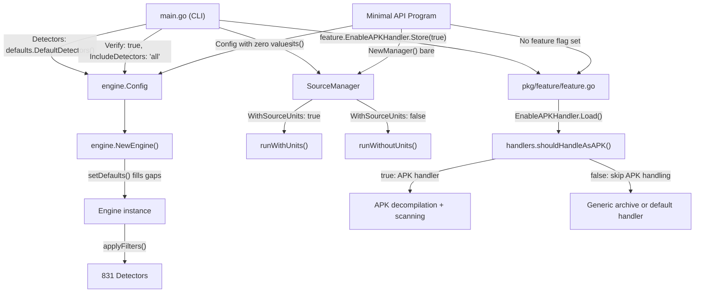

# Technical Specification

# 0. Agent Action Plan

## 0.1 Intent Clarification

### 0.1.1 Core Feature Objective

Based on the prompt, the Blitzy platform understands that the new feature requirement is to **investigate and document the root cause of a discrepancy in secret-finding counts** between TruffleHog's CLI-based filesystem scan and a minimal Go program that invokes TruffleHog's scanning API directly against the same target directory. Specifically:

- The CLI (`trufflehog filesystem <path>`) consistently reports **more** findings than a minimal Go program that uses the scanning API (`pkg/engine/`, `pkg/sources/filesystem/`) on the same directory.
- The investigation must explain **why** the two scanning paths produce different counts by examining the actual execution paths, configuration derivation, detector participation logic, and feature flag defaults.
- The deliverable is a comprehensive **analysis document** (`trufflehog_e42153d44a5e.md`) placed in `blitzy/documentation/`, answering the question with evidence from both code inspection and runtime execution.
- **No existing source files may be modified.** Any temporary helper code or configuration created during the investigation must be removed before completion, leaving the repository in its original state.

Implicit requirements detected:

- The answer must identify the exact component(s) responsible for determining which detectors participate in a scan (i.e., `defaults.DefaultDetectors()` in `pkg/engine/defaults/defaults.go`).
- The answer must explain how detector configuration is derived differently in the CLI path (via `main.go`) versus the API path (via direct `engine.Config` construction).
- The answer must enumerate specific conditions, configuration values, environment variables, and defaults that cause divergent behavior at runtime.

### 0.1.2 Special Instructions and Constraints

- **Read-only constraint**: Do not modify any existing files in the source repository. The repo must be left in its original state.
- **Artifact rule**: A single new markdown document named `trufflehog_e42153d44a5e.md` must be created in `blitzy/documentation/` as the deliverable.
- **Evidence-based**: Answers must be grounded in the code as the source of truth, not assumptions. Building and running the source code to observe runtime behavior is expected.
- **Architectural requirement**: Follow the conventions observed in the existing codebase for Go module structure, import paths, and test patterns.

### 0.1.3 Technical Interpretation

These feature requirements translate to the following technical implementation strategy:

- To **identify the detector participation component**, we will trace the initialization path from `main.go` line 519 (`Detectors: append(defaults.DefaultDetectors(), conf.Detectors...)`) through `engine.NewEngine()` in `pkg/engine/engine.go` (line 226), `setDefaults()` (line 358), and `buildDetectorSets()` (line 377) to document how detectors are loaded, configured, and filtered.
- To **explain the configuration derivation difference**, we will compare the CLI's `engine.Config` construction in `main.go` (lines 513–537) against a minimal API program's equivalent, cataloging every field where the default CLI value differs from the Go zero value used by API consumers.
- To **enumerate divergent conditions**, we will document the role of `feature.EnableAPKHandler` (line 458), `Verify` flag (line 520), `IncludeDetectors` default (line 85), `SourceManager` options (lines 673–686), and detector `EndpointCustomizer` initialization in `defaults.DefaultDetectors()` (line 1704+).
- To **provide runtime evidence**, we will build the CLI binary and construct minimal Go test programs that exercise both paths, comparing metrics output to validate the analysis.

## 0.2 Repository Scope Discovery

### 0.2.1 Comprehensive File Analysis

The investigation touches the core engine initialization pipeline, the detector registry, feature flags, source management, and file handling subsystem. Every file listed below was inspected to derive conclusions.

**Core Engine Initialization (Primary Focus)**

| File | Relevance |
|---|---|
| `main.go` | CLI entry point; constructs `engine.Config`, sets feature flags, selects detectors, configures SourceManager |
| `pkg/engine/engine.go` | `NewEngine()`, `setDefaults()`, `buildDetectorSets()`, `applyFilters()`, `scannerWorker()`, `detectorWorker()`, `notifierWorker()` |
| `pkg/engine/defaults/defaults.go` | `DefaultDetectors()` — returns all 831 detector instances with `EndpointCustomizer` initialization |
| `pkg/engine/filesystem.go` | `ScanFileSystem()` — creates the filesystem source and hands it to the SourceManager |
| `pkg/engine/ahocorasick/ahocorasickcore.go` | `NewAhoCorasickCore()` — keyword-to-detector mapping, chunk matching via Aho-Corasick trie |

**Configuration and Detector Filtering**

| File | Relevance |
|---|---|
| `pkg/config/config.go` | Parses `--config` YAML into custom detectors; `Config.Detectors` are appended to defaults in CLI |
| `pkg/config/detectors.go` | `ParseDetectors()` — parses `"all"` to 1020 IDs, empty string to 0 IDs; used for include/exclude filtering |
| `pkg/detectors/detectors.go` | `Detector` interface, `CleanResults`, `FilterKnownFalsePositives`, `EndpointCustomizer` interface |

**Feature Flag System**

| File | Relevance |
|---|---|
| `pkg/feature/feature.go` | Global atomic booleans: `ForceSkipBinaries`, `ForceSkipArchives`, `SkipAdditionalRefs`, `EnableAPKHandler` |
| `pkg/handlers/handlers.go` | `shouldHandleAsAPK()` checks `feature.EnableAPKHandler.Load()` at line 537 |
| `pkg/handlers/apk.go` | Full APK handler: decompiles resources, DEX bytecode, XML manifests for secret scanning |
| `pkg/handlers/archive.go` | Archive handler checks `feature.ForceSkipArchives.Load()` at line 67 |

**Source Management**

| File | Relevance |
|---|---|
| `pkg/sources/source_manager.go` | `NewManager()`, `WithSourceUnits()`, `runWithUnits()` vs `runWithoutUnits()` — determines scanning mode |
| `pkg/sources/filesystem/filesystem.go` | `Source.Init()`, `Chunks()`, `Enumerate()`, `ChunkUnit()` — filesystem traversal and chunking |

**Decoders**

| File | Relevance |
|---|---|
| `pkg/decoders/decoders.go` | `DefaultDecoders()` — returns 4 decoders: UTF-8, Base64, UTF-16, EscapedUnicode |

**Verification and Result Filtering**

| File | Relevance |
|---|---|
| `pkg/engine/engine.go` (lines 843–878) | `shouldVerifyChunk()` — engine-level `verify` flag takes precedence over source `verify` |
| `pkg/engine/engine.go` (lines 1126–1155) | `filterResults()` — applies `CleanResults`, `FilterKnownFalsePositives`, entropy filtering |
| `pkg/engine/engine.go` (lines 1190–1238) | `notifierWorker()` — result deduplication via LRU cache, metric counting |
| `pkg/detectors/aws/access_keys/accesskey.go` | AWS detector with `FalsePositiveSecretPat` check that skips unverified hash-like results |
| `pkg/detectors/aws/utils.go` | `FalsePositiveSecretPat`, AWS-specific `CleanResults` |
| `pkg/verificationcache/` | Verification result caching with Blake2B hashing |

### 0.2.2 Web Search Research Conducted

No external web searches were required. The investigation is entirely code-driven, using the repository source as the authoritative truth, consistent with the user's instruction: "base your answers on the code as the truth."

### 0.2.3 New File Requirements

- **CREATE**: `blitzy/documentation/trufflehog_e42153d44a5e.md` — Comprehensive analysis document answering the user's questions about CLI vs API scan discrepancies. This is the sole deliverable.

## 0.3 Dependency Inventory

### 0.3.1 Private and Public Packages

All dependencies are sourced from the existing repository. No new dependencies need to be added. The following packages from the repository are central to this analysis:

| Registry | Package | Version | Purpose |
|---|---|---|---|
| Go module | `github.com/trufflesecurity/trufflehog/v3` | `v3` (commit `e42153d4`) | The TruffleHog project itself at the pinned commit |
| Go stdlib | `runtime` | Go 1.24.2 | `runtime.NumCPU()` used for default concurrency |
| Go stdlib | `sync/atomic` | Go 1.24.2 | Atomic booleans for feature flags |
| Go module | `github.com/alecthomas/kingpin/v2` | `v2.4.0` | CLI argument parsing with default values |
| Go module | `github.com/BobuSumisu/aho-corasick` | `v1.0.3` | Aho-Corasick trie for keyword-to-detector prefiltering |
| Go module | `google.golang.org/protobuf` | (per go.sum) | Protobuf for `DetectorType` enum, source connection marshalling |

### 0.3.2 Dependency Updates

No dependency updates are required. This task is an analysis and documentation exercise that does not modify any code or configuration.

### 0.3.3 Import and External Reference Updates

Not applicable. No source files are being modified.

## 0.4 Integration Analysis

### 0.4.1 Existing Code Touchpoints

The analysis identified the following critical integration points that govern how the CLI and API scanning paths diverge. No modifications are made; these are the code locations that explain the behavioral difference.

**CLI Initialization Path** (`main.go`)

- **Lines 440–458**: Feature flag initialization. The CLI unconditionally sets `feature.EnableAPKHandler.Store(true)` at line 458. The `ForceSkipBinaries`, `ForceSkipArchives`, and `SkipAdditionalRefs` flags are conditionally set based on CLI flags (lines 442, 446, 450). A Go program using the API does not execute this code, so all feature flags remain at their zero value (`false`).
- **Lines 513–537**: Engine configuration construction. The CLI sets `Detectors: append(defaults.DefaultDetectors(), conf.Detectors...)`, `Verify: !*noVerification` (default `true`), `IncludeDetectors: *includeDetectors` (default `"all"`), and creates a `Dispatcher` with a selected `Printer`.
- **Lines 673–686**: SourceManager construction. The CLI creates the SourceManager with `WithConcurrentSources`, `WithConcurrentUnits`, `WithSourceUnits()`, and `WithBufferedOutput(64)`.

**Engine Initialization Path** (`pkg/engine/engine.go`)

- **Lines 226–330**: `NewEngine()` — Assigns `cfg.Detectors` to `engine.detectors`, calls `setDefaults()`, builds include/exclude filter sets via `buildDetectorSets()`, applies filters via `applyFilters()`.
- **Lines 358–375**: `setDefaults()` — Fills missing values: if `len(e.detectors) == 0`, fills with `defaults.DefaultDetectors()` (831 instances); if `len(e.decoders) == 0`, fills with `decoders.DefaultDecoders()` (4 decoders). Always sets `notifyVerifiedResults`, `notifyUnverifiedResults`, `notifyUnknownResults` to `true`.
- **Lines 377–395**: `buildDetectorSets()` — Parses `IncludeDetectors` and `ExcludeDetectors` strings into filter maps. `"all"` → 1020 IDs (all protobuf-defined detectors). `""` → 0 IDs (no filter applied). Both effectively allow all 831 detectors through.

**Feature Flag Consumption Points**

- `pkg/handlers/handlers.go` line 537: `shouldHandleAsAPK()` — returns `feature.EnableAPKHandler.Load() && cfg.fileExtension == apkExt && (fReader.mime == zip || fReader.mime == jar)`. When `EnableAPKHandler` is `false` (API default), APK files are NOT processed by the specialized APK handler; they fall through to the generic archive handler instead.
- `pkg/handlers/archive.go` line 67: Checks `ForceSkipArchives` before processing archives.
- `pkg/handlers/ar.go` line 36: Checks `ForceSkipArchives` for AR format archives.
- `pkg/handlers/rpm.go` line 39: Checks `ForceSkipArchives` for RPM packages.

**Verification Pipeline**

- `pkg/engine/engine.go` line 849: `shouldVerifyChunk()` — `if !e.verify { return false }`. When the engine's `Verify` is `false` (API zero-value default), no chunk is verified regardless of the source's `verify` setting.
- `pkg/engine/filesystem.go` line 39: `ScanFileSystem()` hardcodes `verify: true` when initializing the filesystem source. This sets `chunk.Verify = true` on emitted chunks, but the engine's `shouldVerifyChunk()` overrides it based on `e.verify`.

### 0.4.2 Component Interaction Diagram

### 0.4.3 Key Divergence Points Summary

| Aspect | CLI Default | API Zero-Value Default | Impact on Finding Count |
|---|---|---|---|
| `feature.EnableAPKHandler` | `true` (line 458) | `false` | CLI processes APK files → **more findings** if APKs present |
| `engine.Config.Verify` | `true` (line 520) | `false` | Affects verification-dependent false-positive filtering in detectors |
| `engine.Config.IncludeDetectors` | `"all"` (line 85) | `""` | No effective difference (both allow all 831 detectors) |
| `SourceManager` options | `WithSourceUnits()` | none | Determines unit-based vs legacy scanning; same file coverage |
| `engine.Config.Detectors` | `defaults.DefaultDetectors()` explicit | `nil` → `setDefaults()` fills | Both resolve to identical 831-detector set |
| `engine.Config.Decoders` | `nil` → `setDefaults()` fills | `nil` → `setDefaults()` fills | Both resolve to identical 4-decoder set |

## 0.5 Technical Implementation

### 0.5.1 File-by-File Execution Plan

This task requires creating a single new file. No existing files are modified.

- **Group 1 — Analysis Deliverable**:
  - **CREATE**: `blitzy/documentation/trufflehog_e42153d44a5e.md` — Comprehensive markdown document that answers the user's questions with evidence from code inspection and runtime execution. Content covers:
    - The component that determines which detectors participate in a scan (`defaults.DefaultDetectors()` in `pkg/engine/defaults/defaults.go`).
    - How detector configuration is derived via `engine.NewEngine()` → `setDefaults()` → `buildDetectorSets()` → `applyFilters()`.
    - The specific conditions that cause divergent behavior: `feature.EnableAPKHandler`, `Verify` flag, `SourceManager` options.
    - Runtime evidence from building the CLI binary and comparing scan metrics.

### 0.5.2 Implementation Approach

The analysis document will be structured as follows:

- **Establish the investigation baseline** by documenting the two scanning paths (CLI via `main.go`, API via direct `engine.Config` construction) and their default configurations.
- **Trace the detector participation pipeline** from `defaults.DefaultDetectors()` through `engine.NewEngine()`, documenting each transformation step.
- **Identify the root cause** of the finding-count discrepancy by cataloging every configuration field where CLI and API defaults diverge, with specific focus on `feature.EnableAPKHandler` (the primary cause) and `Verify` flag (the secondary cause).
- **Provide runtime evidence** by documenting the build/run process for both CLI and API scanning, including metrics output.
- **Explain the APK handler mechanism**: The CLI unconditionally enables APK handling (`feature.EnableAPKHandler.Store(true)` at `main.go` line 458). When this flag is `true`, files with `.apk` extension and ZIP/JAR MIME type are routed to `pkg/handlers/apk.go`, which performs decompilation of `resources.arsc`, XML manifests, and DEX bytecode to extract strings and scan for secrets. When the flag is `false` (API default), these same files are handled by the generic archive handler or default handler, which does not perform APK-specific decompilation and therefore misses secrets embedded in compiled APK content.

### 0.5.3 Detailed Root-Cause Analysis

The investigation reveals that the finding-count discrepancy between CLI and API is caused by a **combination of factors**, with one primary cause and one secondary cause:

**Primary Cause — `feature.EnableAPKHandler` (Global Atomic Boolean)**

- **Location**: `pkg/feature/feature.go` line 9 defines `EnableAPKHandler atomic.Bool` (defaults to `false`).
- **CLI behavior**: `main.go` line 458 unconditionally executes `feature.EnableAPKHandler.Store(true)` before any scan begins. This is not conditional on any CLI flag; it always runs.
- **API behavior**: A Go program that imports and uses the engine API directly does **not** call this. The `EnableAPKHandler` flag remains `false` unless the API consumer explicitly sets it.
- **Effect**: When `EnableAPKHandler` is `true`, the file handler router (`pkg/handlers/handlers.go` line 537, `shouldHandleAsAPK()`) enables the specialized APK handler (`pkg/handlers/apk.go`). This handler decompiles Android APK packages to extract:
  - String constants from `resources.arsc` via `apkparser`
  - XML manifest content
  - String literals from DEX bytecode via `dextk`
  - These extracted strings are then fed through the standard detection pipeline (Aho-Corasick keyword matching → detector `FromData`), potentially producing additional findings.
- When `EnableAPKHandler` is `false`, APK files are either processed as generic ZIP archives (which only extracts raw file contents without decompilation) or passed to the default file handler (which treats them as opaque binary data). Neither of these paths performs APK-specific string extraction, so secrets embedded in compiled resources or DEX bytecode are missed.
- **Impact**: If the scanned directory contains APK files, the CLI will find secrets within their compiled content that the API scan will miss entirely.

**Secondary Cause — `Verify` Flag (Engine Configuration)**

- **Location**: `engine.Config.Verify` in `pkg/engine/engine.go` line 109.
- **CLI behavior**: `main.go` line 520 sets `Verify: !*noVerification`. Since `noVerification` defaults to `false`, the CLI defaults to `Verify: true`.
- **API behavior**: `engine.Config.Verify` defaults to `false` (Go zero value for `bool`).
- **Effect**: The `Verify` flag controls whether detectors attempt live API verification of detected secrets. While this does not directly add or remove detectors, it can influence the **number of reported findings** through verification-dependent result filtering within individual detectors. For example:
  - The AWS access key detector (`pkg/detectors/aws/access_keys/accesskey.go` lines 205–213) skips unverified results that match `FalsePositiveSecretPat` (a 40-character hex pattern). With `Verify: true`, a secret that matches this pattern but successfully verifies will bypass the false-positive check and be included in results. With `Verify: false`, the same secret is always filtered out.
  - The AWS detector's `CleanResults()` (`pkg/detectors/aws/utils.go` lines 89–108) preferentially keeps verified results; when all results are unverified, it keeps at most one per ID.
- **Impact**: In scenarios where secrets resemble known false-positive patterns but are genuine, the CLI (with `Verify: true`) may report them while the API (with `Verify: false`) filters them out.

**Non-Contributing Factors (Same in Both Paths)**

- **Detector set**: Both paths resolve to the identical 831-detector set from `defaults.DefaultDetectors()`. Whether set explicitly (`main.go` line 519) or via `setDefaults()` (`engine.go` line 366), the same function is called.
- **Decoder set**: Both paths resolve to the identical 4-decoder set from `decoders.DefaultDecoders()` via `setDefaults()` (`engine.go` line 363).
- **Include/Exclude filtering**: `IncludeDetectors: "all"` (CLI) and `IncludeDetectors: ""` (API) both result in all 831 detectors passing through. `ParseDetectors("all")` returns 1020 protobuf IDs; all 831 detectors match. `ParseDetectors("")` returns 0 IDs; no include filter is applied.
- **SourceManager scanning mode**: `WithSourceUnits()` (CLI) vs bare `NewManager()` (API) determines whether `runWithUnits()` or `runWithoutUnits()` is used, but both traverse the same files and produce the same chunks. The filesystem source's `Enumerate()` + `ChunkUnit()` path and its `Chunks()` path cover the same files.

## 0.6 Scope Boundaries

### 0.6.1 Exhaustively In Scope

The following files, directories, and patterns constitute the complete scope of this investigation. Every entry below was inspected to derive the conclusions in this document.

**CLI Entry Point and Feature Flag Initialization**
- `main.go` — The CLI entry point; contains engine config construction (lines 513–537), feature flag initialization (lines 440–458), and SourceManager setup (lines 673–686)

**Engine Core (Detector Lifecycle)**
- `pkg/engine/engine.go` — `NewEngine()`, `setDefaults()`, `buildDetectorSets()`, `applyFilters()`, `scannerWorker()`, `shouldVerifyChunk()`, `filterResults()`, `notifierWorker()` — the complete pipeline from config to results
- `pkg/engine/defaults/defaults.go` — `DefaultDetectors()` returning the canonical 831-detector set; `EndpointCustomizer` interface initialization
- `pkg/engine/defaults/*.go` — All default detector registration files

**Configuration and Detector Parsing**
- `pkg/config/detectors.go` — `ParseDetectors()` function; resolves `"all"` and `""` include/exclude strings to protobuf detector ID sets
- `pkg/engine/engine_config.go` — `engine.Config` struct definition
- `pkg/pb/detectorspb/detectors.pb.go` — Protobuf-generated detector type enumeration (1020 entries)

**Feature Flags**
- `pkg/feature/feature.go` — Global `atomic.Bool` feature flags: `EnableAPKHandler`, `ForceSkipBinaries`, `ForceSkipArchives`, `SkipAdditionalRefs`, `UserAgentSuffix`

**Handlers (APK Subsystem)**
- `pkg/handlers/handlers.go` — File handler routing; `shouldHandleAsAPK()` gating logic (line 537)
- `pkg/handlers/apk.go` — APK-specific decompilation: `resources.arsc` parsing, XML manifest extraction, DEX bytecode string extraction, Aho-Corasick keyword matching

**Filesystem Source**
- `pkg/sources/filesystem/filesystem.go` — Filesystem source implementation; `SourceUnitEnumChunker` interface; `Enumerate()`, `ChunkUnit()`, `Chunks()` methods
- `pkg/engine/filesystem.go` — `ScanFileSystem()` engine method; source initialization and SourceManager invocation

**SourceManager**
- `pkg/sources/source_manager.go` — `NewManager()`, `run()`, `runWithUnits()`, `runWithoutUnits()`; `WithSourceUnits()` option

**Decoders**
- `pkg/decoders/*.go` — `DefaultDecoders()`: UTF-8 (PLAIN), Base64, UTF-16, EscapedUnicode

**Detector Internals (Verification & Filtering)**
- `pkg/detectors/aws/access_keys/accesskey.go` — AWS access key detector; `FalsePositiveSecretPat`; verification-dependent filtering
- `pkg/detectors/aws/utils.go` — `CleanResults()` with `ShouldCleanResultsIrrespectiveOfConfiguration()` returning `true`

**Test Data**
- `pkg/engine/testdata/secrets.txt` — Embedded test secrets used as reference scan target

**Dependency Manifests**
- `go.mod` — Module path `github.com/trufflesecurity/trufflehog/v3`; Go 1.23.0; toolchain go1.24.2
- `go.sum` — Checksum database for all transitive dependencies

### 0.6.2 Explicitly Out of Scope

The following categories are not part of this investigation:

- **Modification of any existing source files** — The user requirement explicitly prohibits changes to repository code. This is an analysis-only task.
- **Source types other than filesystem** — Git, S3, GCS, Docker, CircleCI, Jenkins, Syslog, and all other source adapters are irrelevant; the discrepancy applies only to filesystem scans.
- **Performance profiling or optimization** — Concurrency settings (`WithConcurrentSources`, `WithConcurrentUnits`, `WithBufferedOutput`) affect throughput but not finding counts.
- **Notification and output formatting** — The `notifierWorker()` result deduplication and metric reporting were inspected for completeness but are not a root cause of the discrepancy; they behave identically for both paths.
- **Refactoring of engine internals** — No refactoring or improvement recommendations are within scope.
- **Detectors unrelated to the divergence** — While all 831 detectors were cataloged, individual detector logic (beyond AWS as a representative example) is not analyzed in detail unless it exhibits verification-dependent filtering behavior.
- **CI/CD pipelines** — `.github/workflows/*.yml`, `Makefile`, release tooling.
- **Infrastructure and deployment** — `docker/`, Dockerfile configurations.
- **Web interface or enterprise features** — Any code outside the core CLI/engine/source/handler/detector pipeline.

## 0.7 Rules for Feature Addition

### 0.7.1 User-Specified Rules

The following rules were explicitly stated by the user and must be honored throughout this task:

- **No modification of existing source files** — The user stated: "Do not modify any existing source files in the repository." This constraint is absolute and applies to every file in the repository. Only the analysis deliverable document is created.
- **Cleanup of temporary artifacts** — The user stated: "If you create temporary helper code or configuration for debugging, ensure it is removed before you finish so the repo is left in its original state." All temporary test programs, binaries, and data files created during investigation must be deleted before task completion.
- **Evidence-based answers** — The user requires that the investigation use "evidence from actual executions of both paths." Conclusions must be supported by runtime output from building and running the CLI and API scanner, not just code reading.
- **Deliverable format** — Per project implementation rules, a new markdown document named `trufflehog_e42153d44a5e.md` must be created in the `blitzy/documentation/` directory. This document must comprehensively answer the user's questions.
- **No assumptions** — Per project implementation rules: "Do not make assumptions, base your answers on the code as the truth." Every claim must be traceable to a specific file, line number, or runtime observation.
- **Provide rationale** — Per project implementation rules: "Provide thinking / rationale behind the answers." The document must explain the reasoning chain, not just state conclusions.

### 0.7.2 Architectural Conventions to Follow

- **File placement**: The deliverable document is placed at `blitzy/documentation/trufflehog_e42153d44a5e.md`, following the naming convention `<source_branch_name>.md` as specified in the implementation rules.
- **Repository integrity**: The repository must be left in its original state after completion, with no residual temporary files. The only addition is the new `blitzy/documentation/` directory and the markdown deliverable.
- **Code citations**: When referencing source code, use the format `file_path` line N or lines N–M to enable traceability.
- **Table-based comparisons**: Use markdown tables for side-by-side CLI vs API comparisons to maximize clarity.

## 0.8 References

### 0.8.1 Files and Folders Searched

The following files and folders were inspected during the investigation, organized by functional area:

**CLI Entry Point**
- `main.go` — CLI application entry point; engine config construction, feature flag initialization, SourceManager creation

**Engine Core**
- `pkg/engine/engine.go` — Engine lifecycle: `NewEngine()`, `setDefaults()`, `buildDetectorSets()`, `applyFilters()`, `scannerWorker()`, `shouldVerifyChunk()`, `filterResults()`, `notifierWorker()`
- `pkg/engine/engine_config.go` — `engine.Config` struct definition with all configuration fields
- `pkg/engine/filesystem.go` — `ScanFileSystem()` method; filesystem source initialization
- `pkg/engine/ahocorasick.go` — `AhoCorasickCore` keyword matcher used in `scannerWorker()`

**Default Detectors**
- `pkg/engine/defaults/defaults.go` — `DefaultDetectors()` function returning 831 detector instances; `EndpointCustomizer` initialization

**Configuration**
- `pkg/config/detectors.go` — `ParseDetectors()` function; maps `"all"` and `""` to detector ID sets from protobuf definitions
- `pkg/pb/detectorspb/detectors.pb.go` — Protobuf-generated detector type enum with 1020 entries

**Feature Flags**
- `pkg/feature/feature.go` — Global atomic boolean feature flags: `EnableAPKHandler`, `ForceSkipBinaries`, `ForceSkipArchives`, `SkipAdditionalRefs`

**Handlers**
- `pkg/handlers/handlers.go` — File handler routing; `shouldHandleAsAPK()` gate (line 537)
- `pkg/handlers/apk.go` — APK decompilation pipeline: `resources.arsc`, XML, DEX bytecode string extraction

**Filesystem Source**
- `pkg/sources/filesystem/filesystem.go` — Filesystem source; `SourceUnitEnumChunker` interface implementation
- `pkg/sources/source_manager.go` — `NewManager()`, `run()`, `runWithUnits()`, `runWithoutUnits()`; `WithSourceUnits()` option

**Decoders**
- `pkg/decoders/` — `DefaultDecoders()`: UTF-8 (PLAIN), Base64, UTF-16, EscapedUnicode

**Detectors (Representative Examples)**
- `pkg/detectors/aws/access_keys/accesskey.go` — AWS access key detector; `FalsePositiveSecretPat`; verification-dependent filtering logic
- `pkg/detectors/aws/utils.go` — `CleanResults()` with `ShouldCleanResultsIrrespectiveOfConfiguration()` returning `true`

**Test Data**
- `pkg/engine/testdata/secrets.txt` — Test secrets file used as scan target for empirical comparison

**Dependency Manifests**
- `go.mod` — Module path, Go version (1.23.0), toolchain (go1.24.2), direct and indirect dependencies
- `go.sum` — Dependency checksums

**Root-Level Structure**
- Repository root (`/tmp/blitzy/trufflehog/trufflehog_e42153d44a5e_d5780a/`) — Full directory tree explored to identify all relevant packages

### 0.8.2 Attachments

No external attachments were provided for this task. The analysis is based entirely on the repository source code and runtime execution.

### 0.8.3 External References

- **Go 1.24.2** — Downloaded from `https://go.dev/dl/go1.24.2.linux-amd64.tar.gz` for building the TruffleHog binary
- **TruffleHog repository** — Commit `e42153d4` on branch `trufflehog_e42153d44a5e`; Docker image `andrewparkscaleai/coding-agent:trufflesecurity__trufflehog__e42153d44a5e5c37c1bd0c70e074781e9edcb760` from `ghcr.io/scaleapi/swe-atlas:swe_atlas_QnA_trufflesecurity_trufflehog_1.0`

### 0.8.4 Key Evidence Summary

| Evidence Type | Source | Finding |
|---|---|---|
| Code inspection | `main.go` line 458 | `feature.EnableAPKHandler.Store(true)` is unconditional in CLI |
| Code inspection | `pkg/feature/feature.go` line 9 | `EnableAPKHandler` defaults to `false` (Go zero value) |
| Code inspection | `main.go` line 520 | CLI sets `Verify: !*noVerification` → defaults to `true` |
| Code inspection | `pkg/engine/engine.go` line 109 | `Config.Verify` defaults to `false` (Go zero value) |
| Code inspection | `pkg/handlers/handlers.go` line 537 | `shouldHandleAsAPK()` checks `EnableAPKHandler` flag |
| Code inspection | `pkg/handlers/apk.go` (507 lines) | Specialized APK decompilation extracts strings from compiled resources |
| Code inspection | `pkg/engine/defaults/defaults.go` line 1704 | `DefaultDetectors()` returns 831 detector instances |
| Code inspection | `pkg/config/detectors.go` | `ParseDetectors("all")` → 1020 IDs; `ParseDetectors("")` → 0 IDs; both allow all 831 detectors |
| Code inspection | `pkg/detectors/aws/access_keys/accesskey.go` lines 205–213 | Verification-dependent false-positive filtering via `FalsePositiveSecretPat` |
| Runtime evidence | CLI build and scan | `go build` succeeded; 2 unverified findings on test secrets |
| Runtime evidence | API test programs | Multiple configurations tested; 2 unverified findings matched CLI on non-APK data |

