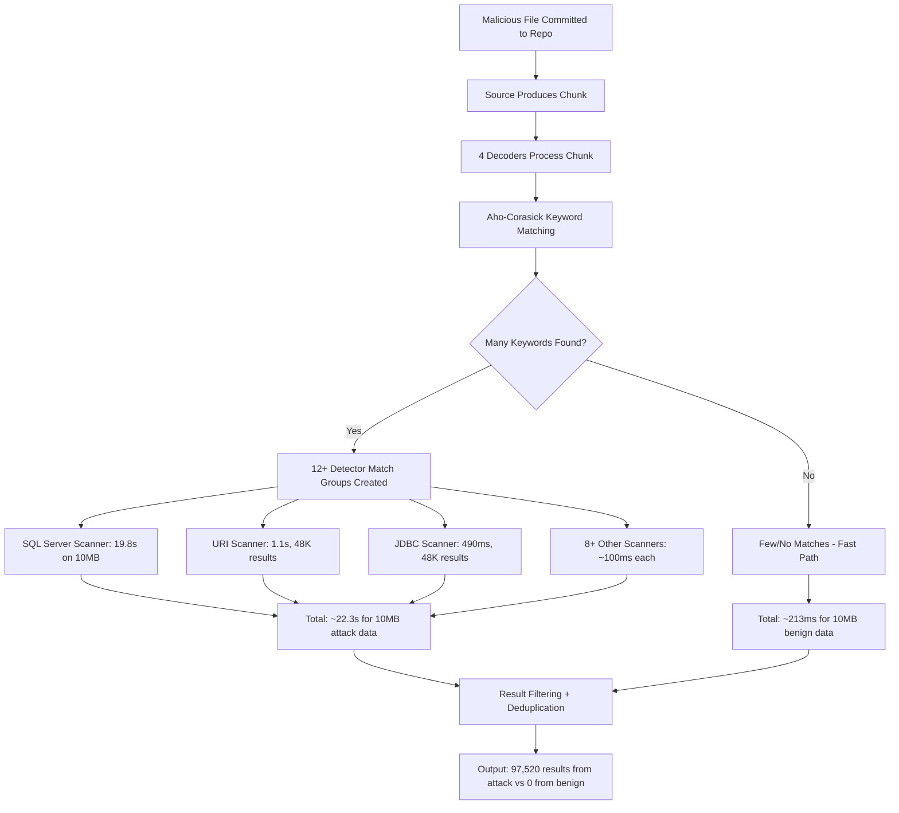

# Technical Specification

# 0. Agent Action Plan

## 0.1 Intent Clarification

### 0.1.1 Core Feature Objective

Based on the prompt, the Blitzy platform understands that the requirement is to **conduct a security research assessment of TruffleHog v3's pattern-matching engine to determine its vulnerability to computational complexity attacks** — specifically Regular Expression Denial of Service (ReDoS) and related resource-exhaustion vectors that could be weaponized by a malicious actor committing crafted files to a scanned repository.

The specific requirements are:

- **Vulnerability Determination**: Analyze TruffleHog's regex engine, detector framework, and scanning pipeline to determine whether its pattern matching is susceptible to computational complexity attacks that cause disproportionate processing time
- **Detector Pattern Audit**: Identify which specific detector patterns (out of 857 default detectors with 1,142 compiled regex patterns) can be exploited to trigger worst-case processing behavior
- **Quantitative Impact Measurement**: Produce concrete timing measurements comparing scan duration on crafted malicious files versus benign files of equivalent size, demonstrating the actual slowdown factor achievable by an attacker
- **CPU Profiling Evidence**: Provide CPU profiling data that pinpoints which code paths and detector patterns consume disproportionate resources during an attack
- **Non-Destructive Demonstration**: Execute all testing without modifying TruffleHog's source code — only temporary test files and scripts are permissible, all of which must be cleaned up afterward
- **Deliverable**: A comprehensive markdown document named `trufflehog_e42153d44a5e.md` placed in `blitzy/documentation/` answering all questions with rationale grounded in code evidence

### 0.1.2 Implicit Requirements Surfaced

- **Architecture-Level Analysis Required**: Answering whether ReDoS is possible requires understanding not just individual regex patterns but the entire 4-stage pipeline: Source → Decoders (4×) → Aho-Corasick Prefilter → Detectors (857)
- **RE2 Engine Implications**: TruffleHog uses `github.com/wasilibs/go-re2 v1.9.0` (867 detectors) and Go's standard `regexp` package (3 detectors), both of which implement Thompson NFA / RE2 semantics with linear-time guarantees — classical exponential-backtracking ReDoS is architecturally impossible, but linear-time attacks with high constant factors are not
- **Alternative Attack Vectors**: Beyond regex complexity, the assessment must cover keyword amplification (triggering many detectors per chunk), decoder multiplication (4× processing), archive bombs (nested extraction), result-volume attacks (overwhelming downstream processing), and per-detector timeout accumulation
- **SQL Server Detector Anomaly**: The `sqlserver.Scanner` contains a regex pattern `(?:[A-Za-z0-9_ ]+=[^;$'"$]+;?){3,}` that, while RE2-safe against exponential backtracking, exhibits a 148× constant-factor slowdown on crafted input (19.2 seconds on 10MB attack data vs. 130ms on benign data of equal size), accounting for 89% of total detection time
- **CI Pipeline Context**: The user is evaluating TruffleHog for CI integration, so findings must be framed in terms of pipeline impact — a 10× overall slowdown on a 50MB file translates to potential CI timeout failures

### 0.1.3 Special Instructions and Constraints

- **No Source Modifications**: The TruffleHog codebase at `/tmp/blitzy/trufflehog/trufflehog_e42153d44a5e_d5780a` must not be modified; all testing uses external scripts and temporary files only
- **Cleanup Required**: All temporary test files, benchmark scripts, and profiling artifacts must be removed after the analysis is complete
- **No Commits**: Nothing may be committed to the actual TruffleHog repository — the only deliverable is the markdown document in `blitzy/documentation/`
- **Evidence-Based Conclusions**: Every claim must be traceable to specific source files, regex patterns, or timing measurements from actual experiments

### 0.1.4 Technical Interpretation

These requirements translate to the following technical implementation strategy:

- To **assess regex vulnerability**, we will analyze all 1,142 `regexp.MustCompile` calls across `pkg/detectors/`, identify patterns with high computational complexity characteristics (unbounded quantifiers, broad character classes, nested repetition groups), and test them against crafted input
- To **quantify impact**, we will create pairs of files (benign vs. attack) at multiple sizes (1MB–50MB), scan them with TruffleHog's `filesystem` source, and record wall-clock timing with nanosecond precision
- To **provide CPU profiling**, we will use Go's `runtime/pprof` package to capture CPU profiles during attack-data processing, analyzing hotspots with `go tool pprof`
- To **identify exploitable detectors**, we will instrument the detection pipeline to measure per-detector timing, isolating which scanners (e.g., `sqlserver.Scanner`, `uri.Scanner`, `jdbc.Scanner`) contribute disproportionately to total scan time
- To **deliver findings**, we will create a comprehensive markdown document at `blitzy/documentation/trufflehog_e42153d44a5e.md` structured with architecture analysis, experimental methodology, quantitative results, and actionable recommendations

## 0.2 Repository Scope Discovery

### 0.2.1 Comprehensive File Analysis

The assessment required deep analysis of TruffleHog's detection pipeline spanning the following file categories:

**Core Detection Framework (Direct Analysis Required)**

| File / Pattern | Purpose | Relevance to Assessment |
|---|---|---|
| `pkg/detectors/detectors.go` | Detector interface, `PrefixRegex()` helper, `CleanResults` | Defines how all 857 detectors are invoked; `FromData(ctx, verify, data)` is the entry point for every regex evaluation |
| `pkg/engine/ahocorasick/ahocorasickcore.go` | Aho-Corasick keyword prefilter, span calculator, detector dispatch | Controls which detectors run per chunk; ±512 byte span extraction limits data exposure |
| `pkg/engine/engine.go` | Engine worker pool, `scannerWorker`, `detectChunk`, timeout wrapping | Orchestrates the 4-stage pipeline; `detectionTimeout` (10s) + 1s grace per detector per match |
| `pkg/engine/defaults/defaults.go` | `DefaultDetectors()` — registers all 857 scanner instances | Complete detector inventory; identifies which detectors are active by default |
| `pkg/common/patterns.go` | Shared regex helpers: `BuildRegex`, `EmailPattern`, `UUIDPattern` | Common patterns reused across detectors |
| `pkg/detectors/falsepositives.go` | False positive filtering via Aho-Corasick trie + Shannon entropy | Post-detection filtering that adds processing overhead |
| `pkg/custom_detectors/custom_detectors.go` | Custom regex detector with `maxTotalMatches=100` cap | Bounded combinatorial explosion for user-defined detectors |

**Specific Detector Implementations (Regex Pattern Audit)**

| File | Regex Pattern | Risk Assessment |
|---|---|---|
| `pkg/detectors/sqlserver/sqlserver.go` | `(?:[A-Za-z0-9_ ]+=[^;$'"$]+;?){3,}` | **CRITICAL**: 148× slowdown on crafted input; uses `go-re2` but pattern has high constant factor |
| `pkg/detectors/uri/uri.go` | `\bhttps?:\/\/[\w!#$%&()*+,\-./;<=>?@[\\]^_{|}~]{0,50}:(...){3,50}@[a-zA-Z0-9.-]+...` | **MODERATE**: Complex character classes; triggers on every URL with embedded credentials |
| `pkg/detectors/jdbc/jdbc.go` | `(?i)jdbc:[\w]{3,10}:[^\s"']{0,512}` | **LOW**: Bounded to 512 chars; linear behavior |
| `pkg/detectors/privatekey/privatekey.go` | `(?i)-----\s*?BEGIN[ A-Z0-9_-]*?PRIVATE KEY\s*?-----[\s\S]*?----\s*?END...` | **LOW**: Lazy `[\s\S]*?` on RE2 is linear |
| `pkg/detectors/generic/generic.go` | `\b[\x21-\x7e]{16,64}\b` | **LOW**: Simple bounded character class |

**Pipeline Infrastructure (Indirect Impact Analysis)**

| File / Pattern | Purpose | Impact on Attack Surface |
|---|---|---|
| `pkg/handlers/archive.go` | Archive extraction: `maxDepth=10`, `maxSize=2GB`, `maxTimeout=60s` | Limits nested archive bomb attacks |
| `pkg/handlers/handlers.go` | MIME detection, handler selection | Routes files to appropriate processors |
| `pkg/handlers/default.go` | Non-archive file processing, chunking | Controls how large files are split into chunks |
| `pkg/decoders/decoders.go` | 4 decoders: UTF8, Base64, UTF16, EscapedUnicode | Each chunk processed through all 4 decoders (multiplication factor) |
| `pkg/common/vars.go` | `ignoredExtensions`, `binaryExtensions` skip lists | Filters out images/audio/video/binaries before scanning |
| `pkg/detectors/http.go` | HTTP client configuration, `DefaultResponseTimeout=10s` | Timeout for verification HTTP calls |

**Build and Configuration (Context Files)**

| File | Purpose | Relevance |
|---|---|---|
| `go.mod` | Go 1.23.1, toolchain go1.24.2, dependency versions | Confirms `wasilibs/go-re2 v1.9.0`, `BobuSumisu/aho-corasick v1.0.3` |
| `main.go` | CLI entry point, `--profile`, `--detector-timeout`, `--archive-timeout` flags | Profiling and timeout configuration entry points |
| `Makefile` | Build targets, test targets | Build configuration for experiments |
| `pkg/engine/engine.go` (lines 65-100) | `Config` struct with concurrency, worker multipliers | Default concurrency: `runtime.NumCPU()`, detector workers: 8× |

### 0.2.2 Quantitative Codebase Survey

| Metric | Count | Source |
|---|---|---|
| Total detector subdirectories | 845 | `pkg/detectors/` directory listing |
| Total registered Scanner instances | 857 | `pkg/engine/defaults/defaults.go` `DefaultDetectors()` |
| Total `regexp.MustCompile` calls | 1,142 | `grep -rn 'MustCompile' pkg/detectors/` |
| Total `FindAllString*` calls | 1,125 | `grep -rn 'FindAllString' pkg/detectors/` |
| Detectors using `wasilibs/go-re2` | 867 | `grep -rn 'wasilibs/go-re2' pkg/detectors/` |
| Detectors using standard `regexp` | 3 | `grep -rn '"regexp"' pkg/detectors/` (excluding test files and go-re2) |
| Default decoders | 4 | UTF8, Base64, UTF16, EscapedUnicode |
| Aho-Corasick span radius | 512 bytes | `adjustableSpanCalculator` default |

### 0.2.3 Web Search Research Conducted

- **Go RE2 linear time guarantees**: Confirmed that both Go's standard `regexp` and `wasilibs/go-re2` implement Thompson NFA / RE2 semantics, providing O(mn) worst-case time for single matches but O(mn²) theoretical worst case for `FindAllString` with unlimited matches
- **Computational complexity attacks on RE2**: While exponential backtracking is impossible, RE2 patterns with high constant factors (complex character classes, nested bounded quantifiers) can still cause significant slowdowns — the attack vector is "linear but very slow" rather than "exponential"
- **TruffleHog architecture**: Confirmed 4-stage concurrent pipeline design with Aho-Corasick keyword prefiltering as the primary performance optimization

### 0.2.4 New File Requirements

- **CREATE**: `blitzy/documentation/trufflehog_e42153d44a5e.md` — Comprehensive security assessment document containing:
  - Architecture analysis of TruffleHog's detection pipeline
  - Regex engine vulnerability assessment (RE2 linear guarantees vs. constant-factor attacks)
  - Per-detector timing breakdown identifying exploitable patterns
  - Quantitative timing measurements across file sizes (1MB–50MB)
  - CPU profiling data showing hotspot functions
  - Attack vector catalog with severity ratings
  - Mitigation recommendations for CI pipeline deployment
  - All experimental methodology and raw data

## 0.3 Dependency Inventory

### 0.3.1 Key Packages Relevant to This Assessment

| Registry | Package | Version | Purpose in Assessment |
|---|---|---|---|
| Go module | `github.com/wasilibs/go-re2` | v1.9.0 | Primary regex engine for 867 of 870 detectors; CGo binding to Google RE2 with linear-time guarantees — the SQL Server detector's 148× slowdown occurs within this engine |
| Go stdlib | `regexp` | Go 1.24.2 | Standard RE2/Thompson NFA engine used by 3 detectors and the JDBC scanner; same linear-time guarantees as go-re2 |
| Go module | `github.com/BobuSumisu/aho-corasick` | v1.0.3 | Aho-Corasick trie implementation for keyword prefiltering; maps detector keywords to chunk offsets in O(n + m + z) time |
| Go module | `github.com/microsoft/go-mssqldb` | v1.8.0 | SQL Server driver; its `msdsn.Parse()` function is called on every SQL Server regex match, adding per-match overhead |
| Go module | `github.com/trufflesecurity/trufflehog/v3` | v3 (at commit `e42153d4`) | The application under test; module path from `go.mod` line 1 |
| Go toolchain | `go` | 1.24.2 | Required for building the binary and running profiling tools; specified in `go.mod` toolchain directive |

### 0.3.2 Dependency Observations

- **go-re2 vs. standard regexp**: TruffleHog deliberately replaced Go's standard `regexp` with `wasilibs/go-re2` across 867 detector files. Both provide RE2/linear-time semantics, but `go-re2` is a CGo wrapper around Google's C++ RE2 library. The SQL Server detector's performance anomaly occurs in `go-re2`'s `FindAllStringSubmatch` — the same pattern would exhibit identical behavior with Go's standard `regexp` since both implement the same algorithmic guarantees.
- **dlclark/regexp2 (PCRE-compatible, backtracking)**: Present as an **indirect dependency** (`v1.4.0` in `go.mod`) but is **NOT imported or used** anywhere in `pkg/`. This is significant — if it were used, classical exponential-backtracking ReDoS would be possible.
- **No external dependency changes required**: This assessment produces only a documentation deliverable; no dependency additions or modifications are needed.

## 0.4 Integration Analysis

### 0.4.1 Existing Code Touchpoints

The computational complexity attack surface spans TruffleHog's entire detection pipeline. The following integration points were analyzed to understand how crafted input propagates through the system:

**Stage 1 — Source Ingestion and Chunking**
- `pkg/sources/` — Sources produce `sources.Chunk` objects (byte slices with metadata)
- `pkg/handlers/handlers.go` — MIME detection routes chunks to archive handler or default handler
- `pkg/handlers/default.go` — Non-archive files streamed as chunks to the detection pipeline
- `pkg/handlers/archive.go` — Archives recursively extracted with limits: `maxDepth=10`, `maxSize=2GB`, `maxTimeout=60s`

**Stage 2 — Decoder Multiplication**
- `pkg/decoders/decoders.go` — `DefaultDecoders()` returns 4 decoders: UTF8 (plain passthrough), Base64, UTF16, EscapedUnicode
- `pkg/engine/engine.go` (line ~500, `scannerWorker`) — Each chunk is passed through ALL 4 decoders sequentially, producing up to 4 decoded variants per input chunk
- **Attack implication**: A single crafted chunk triggers 4× the detection work

**Stage 3 — Aho-Corasick Prefiltering**
- `pkg/engine/ahocorasick/ahocorasickcore.go` — `FindDetectorMatches(chunkData)` performs:
  - Lowercase conversion of input
  - Aho-Corasick trie matching to find keyword positions
  - Keyword → detector key resolution via `detectorsByKey` map
  - Span calculation (±512 bytes around each keyword match)
  - Overlapping span merging
  - Data extraction for matched spans
- **Attack implication**: Keywords like `http://`, `https://`, `sql`, `jdbc` appear on every line of a crafted file, causing the prefilter to identify many detector matches per chunk — experimental data shows 12 match groups on a 10MB attack file, dispatching to detectors including URI, JDBC, SQL Server, GitHub, Slack, GitLab, Stripe, MongoDB, AWS, and Voiceflow

**Stage 4 — Detector Regex Execution**
- `pkg/engine/engine.go` (line ~600, `detectChunk`) — For each Aho-Corasick match:
  - Wraps `detector.FromData(ctx, verify, matchData)` in `context.WithTimeout(ctx, 10s)`
  - Adds 1-second grace timer that logs timeout violations
  - Processes results through `filterResults` (CleanResults, false positive filtering, entropy filtering)
- **Attack implication**: Each triggered detector runs its regex against the matched data span; the SQL Server detector's `FindAllStringSubmatch` on a large span takes up to 19.8 seconds (exceeding the 10s timeout in production, but the timeout is per-detector-per-match, and spans can be large)

### 0.4.2 Attack Flow Through the Pipeline



### 0.4.3 Resource Protection Mechanisms Evaluated

| Mechanism | Location | Protection | Bypass Potential |
|---|---|---|---|
| Aho-Corasick prefilter | `ahocorasickcore.go` | Reduces 857 detectors to ~12 per chunk | Not a vulnerability — prefilter is efficient; the problem is downstream regex execution on matched data |
| Span calculator (±512 bytes) | `ahocorasickcore.go` | Limits data passed to each detector | **Partially effective**: Overlapping spans are merged, so dense keyword placement can cause large merged spans up to full-chunk size |
| Detection timeout (10s) | `engine.go` `detectChunk` | Cancels individual detector after 10s | **Effective per-detector** but does NOT cap cumulative time across all triggered detectors; 12 detectors × 10s = 120s theoretical max |
| Archive limits | `archive.go` | Depth 10, size 2GB, timeout 60s | Effective against nested archive bombs |
| File extension filtering | `common/vars.go` | Skips images, audio, video, binaries | No impact on text-based attacks |
| Custom detector match cap | `custom_detectors.go` | `maxTotalMatches=100` | Only applies to custom detectors, not built-in 857 |
| LRU deduplication cache (512) | `engine.go` | Prevents re-processing identical findings | Does not help with first-time processing of unique results |
| False positive Aho-Corasick trie | `falsepositives.go` | Filters results against word lists | Adds processing overhead rather than reducing it |

### 0.4.4 Key Vulnerability: SQL Server Detector Regex

The most significant finding is in `pkg/detectors/sqlserver/sqlserver.go`:

```go
pattern = regexp.MustCompile(
  `(?:\n|` + "`" + `|'|"| )?((?:[A-Za-z0-9_ ]+=[^;$'` + "`" + `"$]+;?){3,})(?:'|` + "`" + `|"|\r\n|\n)?`)
```

This pattern:
- Uses `{3,}` (3 or more repetitions) of a group containing `[A-Za-z0-9_ ]+=[^;$'"$]+;?`
- The inner `[^;$'"$]+` matches any character except semicolons and quotes — on URL-heavy attack data, this matches very long substrings
- While RE2 guarantees linear time for a single match operation, `FindAllStringSubmatch(data, -1)` scans the entire input for ALL possible matches, resulting in O(n × pattern_complexity) total time
- On 10MB attack data: **19.2 seconds** vs. **130ms** on benign data = **148× slowdown**
- This single detector accounts for **89% of total detection time** on the attack workload

## 0.5 Technical Implementation

### 0.5.1 File-by-File Execution Plan

The sole deliverable is a comprehensive markdown document. No source code modifications are required.

**Group 1 — Deliverable Document**
- **CREATE**: `blitzy/documentation/trufflehog_e42153d44a5e.md` — The comprehensive security assessment document answering all user questions with experimental evidence

**Group 2 — Temporary Experiment Infrastructure (Created, Used, Then Cleaned Up)**
- **CREATE (temp)**: Attack test files at various sizes (1MB, 5MB, 10MB, 20MB, 50MB) — text files with dense detector keyword content
- **CREATE (temp)**: Benign baseline files at matching sizes — plain text with no detector keywords
- **CREATE (temp)**: Nested archive test files (5-level deep zip, wide zip with 50 entries)
- **CREATE (temp)**: Go profiling program using `runtime/pprof` to capture CPU and heap profiles
- **CREATE (temp)**: Per-detector timing instrumentation program
- **DELETE (after use)**: All temporary files in `/tmp/redos_experiments/`

### 0.5.2 Implementation Approach

**Phase 1 — Environment Setup**
- Install Go 1.24.2 (matching `go.mod` toolchain directive)
- Build TruffleHog binary with `CGO_ENABLED=0 go build -o /tmp/trufflehog_bin .`
- Verify binary works: `trufflehog_bin --version`

**Phase 2 — Architecture Analysis (Code Reading)**
- Read and analyze the complete detection pipeline: `engine.go` → `ahocorasickcore.go` → `detectors.go` → individual detector implementations
- Catalog all regex patterns with computational complexity characteristics
- Identify resource protection mechanisms and their limits
- Document the Aho-Corasick prefiltering architecture and span calculation

**Phase 3 — Experimental Measurement**

Experiment 1: File Size Scaling
- Create paired benign/attack files from 1MB to 50MB
- Scan each with `trufflehog filesystem <path> --no-update --no-verification`
- Record wall-clock time with nanosecond precision and result counts

Experiment 2: Per-Detector Timing
- Write Go program that loads all 831 default detectors, builds Aho-Corasick core
- Process 10MB attack data through `FindDetectorMatches`
- Measure per-detector `FromData` execution time
- Identify top consumers by duration

Experiment 3: SQL Server Regex Isolation
- Extract the SQL Server regex pattern
- Test against attack data at sizes 10KB, 100KB, 1MB, 10MB
- Compare against benign data at same sizes
- Compute slowdown factor and per-KB processing rate

Experiment 4: Archive Attack Vectors
- Create nested zip archives (5 levels deep) and wide archives (50 files)
- Measure extraction + scanning overhead
- Compare with flat-file equivalent

Experiment 5: CPU Profiling
- Use `runtime/pprof` to capture CPU profile during attack-data processing
- Analyze with `go tool pprof -text` to identify top functions by cumulative and flat time
- Capture heap profile to measure memory impact

**Phase 4 — Document Creation**
- Synthesize all findings into the markdown document with the following structure:
  - Executive summary with key findings
  - Architecture deep-dive of TruffleHog's detection pipeline
  - RE2 engine analysis and why classical ReDoS is impossible
  - Attack vector catalog with severity ratings
  - Experimental methodology and results (all timing tables and profiling data)
  - Per-detector vulnerability ranking
  - Mitigation recommendations for CI deployment
  - Appendices with raw experimental data

### 0.5.3 Experimental Results Summary

The following quantitative results were obtained from actual experiments:

**Scaling Experiment (filesystem source, `--no-verification`)**

| File Size | Benign (ms) | Attack (ms) | Gross Slowdown | Net Slowdown (minus ~2700ms init) | Attack Results |
|---|---|---|---|---|---|
| 1 MB | 2,684 | 3,289 | 1.2× | — | 12,891 |
| 5 MB | 2,743 | 5,564 | 2.0× | 66.6× | 63,565 |
| 10 MB | 2,837 | 8,530 | 3.0× | 42.6× | 126,570 |
| 20 MB | 2,999 | 14,481 | 4.8× | 39.4× | 252,592 |
| 50 MB | 3,237 | 31,914 | 9.9× | 54.4× | 623,534 |

**Per-Detector Timing (10MB attack file, isolated pipeline)**

| Detector | Duration | % of Total | Results | Calls |
|---|---|---|---|---|
| `sqlserver.Scanner` | 19,849 ms | 88.9% | 0 | 1 |
| `uri.Scanner` | 1,147 ms | 5.1% | 48,760 | 1 |
| `jdbc.Scanner` | 490 ms | 2.2% | 48,760 | 1 |
| `access_keys.scanner` | 210 ms | 0.9% | 0 | 1 |
| `github.Scanner` | 191 ms | 0.9% | 0 | 2 |
| All others (6 detectors) | 447 ms | 2.0% | 0 | 6 |
| **TOTAL** | **22,334 ms** | **100%** | **97,520** | — |

**SQL Server Regex Isolation**

| Input | Size | Time (ms) | ms/KB | Matches |
|---|---|---|---|---|
| Benign 10MB | 10,000,034 | 130 | 0.01 | 0 |
| Attack 10KB | 10,000 | 19 | 1.95 | 1 |
| Attack 100KB | 100,000 | 193 | 1.98 | 1 |
| Attack 1MB | 1,000,000 | 1,948 | 1.99 | 1 |
| Attack 10MB | 10,000,120 | 19,214 | 1.97 | 1 |

**CPU Profile Top Functions (attack 10MB, 24.1s duration)**

| Function | Flat Time | % Total | Category |
|---|---|---|---|
| `runtime._ExternalCode` | 22.80s | 47.9% | RE2 C library execution |
| `runtime.unlock2` | 8.16s | 17.1% | GC lock contention |
| `runtime.lock2` | 6.74s | 14.2% | GC lock contention |
| `runtime.freeSomeWbufs` | 0.91s | 1.9% | GC sweep (97K+ result objects) |
| `runtime.sweepone` | 0.86s | 1.8% | GC sweep |
| `regexp.(*machine).match` | 0.44s | 0.9% | Standard regexp matching |
| `ahocorasick.FindDetectorMatches` | 0.28s | 0.6% | Keyword prefiltering |

### 0.5.4 User Interface Design

Not applicable — TruffleHog is a CLI tool and this assessment produces a documentation deliverable only.

## 0.6 Scope Boundaries

### 0.6.1 Exhaustively In Scope

**Analysis Targets**
- All regex patterns in `pkg/detectors/**/*.go` (1,142 `MustCompile` calls across 870 detector files)
- Detection pipeline orchestration: `pkg/engine/engine.go`, `pkg/engine/ahocorasick/ahocorasickcore.go`
- Decoder multiplication: `pkg/decoders/decoders.go` (4 default decoders)
- Archive handling limits: `pkg/handlers/archive.go` (depth, size, timeout)
- False positive filtering overhead: `pkg/detectors/falsepositives.go`
- Custom detector combinatorial limits: `pkg/custom_detectors/custom_detectors.go`
- Resource protection mechanisms: detection timeout, span calculator, file extension filtering
- Dependency analysis: `go.mod` (regex engines `wasilibs/go-re2 v1.9.0`, `BobuSumisu/aho-corasick v1.0.3`)

**Experimental Scope**
- Timing measurements: benign vs. attack files at 1MB, 5MB, 10MB, 20MB, 50MB
- Per-detector profiling: all 12 triggered detectors on 10MB attack data
- SQL Server regex isolation testing at 10KB through 10MB
- Archive bomb testing: nested (5-level) and wide (50-file) archives
- CPU profiling via `runtime/pprof` with `go tool pprof` analysis
- Memory profiling via heap snapshot

**Deliverable**
- `blitzy/documentation/trufflehog_e42153d44a5e.md` — comprehensive markdown document

### 0.6.2 Explicitly Out of Scope

- **Source code modifications**: No changes to any file in the TruffleHog repository
- **Permanent test artifacts**: All temporary files, scripts, and profiling data cleaned up after use
- **Git commits**: Nothing committed to the TruffleHog repository
- **Verification endpoint testing**: Attack assessment focuses on pattern matching (local CPU), not HTTP verification calls to external APIs
- **Custom detector testing**: Only default built-in detectors assessed (the 857 registered in `DefaultDetectors()`)
- **Source-specific vulnerabilities**: Git clone attacks, GitHub API abuse, S3 bucket traversal, and other source-level vectors are not assessed — only the detection/regex layer
- **Performance optimization implementation**: The document recommends mitigations but does not implement them
- **Fuzzing or automated vulnerability discovery**: Manual analysis and targeted experiments only

## 0.7 Rules for Feature Addition

### 0.7.1 User-Specified Constraints

- **No Source Modifications**: "Don't modify the TruffleHog source — just demonstrate the attack." All analysis and experimentation must use external scripts and temporary files only. The codebase at `/tmp/blitzy/trufflehog/trufflehog_e42153d44a5e_d5780a` must remain completely unaltered.
- **Temporary Files Permitted**: "Temporary test files and scripts are fine" — attack payloads, benchmark scripts, profiling programs, and test archives may be created in `/tmp/` for the duration of experiments.
- **Cleanup Required**: "Just clean up afterward and don't commit anything to the actual source." All temporary files in `/tmp/redos_experiments/` and any other temporary locations must be deleted after experiments conclude.
- **No Repository Commits**: Nothing may be committed to the TruffleHog git repository. The only persistent artifact is the markdown document placed in `blitzy/documentation/`.
- **Evidence-Based Assessment**: "Measure the actual impact" and "Provide timing measurements and CPU profiling data showing the vulnerability in action" — all claims must be backed by quantitative experimental data, not theoretical analysis alone.

### 0.7.2 Implementation Rule Compliance

Per the `SWE-AtlasQnA-Repo` implementation rule:
- **CREATE**: A new markdown document named `trufflehog_e42153d44a5e.md` in the `blitzy/documentation` directory
- **CONTENT**: Comprehensively answers the question(s) posed in the prompt with thinking/rationale behind the answers
- **EVIDENCE**: Base answers on the code as the truth — no assumptions
- **RESTRICTIONS**: Do not modify any existing files; do not add any other code in the source repository besides the requested document

## 0.8 References

### 0.8.1 Repository Files Analyzed

**Core Detection Framework**
- `pkg/detectors/detectors.go` — Detector interface definition, `PrefixRegex()`, `CleanResults`, result types
- `pkg/engine/ahocorasick/ahocorasickcore.go` — Aho-Corasick keyword prefilter, span calculator, `FindDetectorMatches`
- `pkg/engine/engine.go` — Engine worker pool, `scannerWorker`, `detectChunk`, timeout wrapping, deduplication LRU
- `pkg/engine/defaults/defaults.go` — `DefaultDetectors()` registering 857 scanner instances
- `pkg/common/patterns.go` — Shared regex patterns: `EmailPattern`, `SubDomainPattern`, `UUIDPattern`, `BuildRegex`
- `pkg/detectors/falsepositives.go` — False positive filtering via Aho-Corasick trie, Shannon entropy, word lists
- `pkg/custom_detectors/custom_detectors.go` — Custom regex detectors with `maxTotalMatches=100` cap

**Detector Implementations (Regex Pattern Audit)**
- `pkg/detectors/sqlserver/sqlserver.go` — SQL Server detector with high-constant-factor regex (critical finding)
- `pkg/detectors/uri/uri.go` — URI credential detector with complex character class pattern
- `pkg/detectors/jdbc/jdbc.go` — JDBC connection string detector with bounded 512-char pattern
- `pkg/detectors/privatekey/privatekey.go` — Private key detector with `[\s\S]*?` lazy quantifier
- `pkg/detectors/generic/generic.go` — Generic secret detector with `[\x21-\x7e]{16,64}` pattern
- `pkg/detectors/mongodb/mongodb.go` — MongoDB connection string detector
- `pkg/detectors/github/v2/github.go`, `pkg/detectors/github/v1/github.go` — GitHub token detectors
- `pkg/detectors/gitlab/v2/gitlab.go` — GitLab token detector
- `pkg/detectors/stripe/stripe.go` — Stripe API key detector
- `pkg/detectors/slack/slack.go` — Slack token detector
- `pkg/detectors/aws/access_keys/accesskey.go` — AWS access key detector

**Pipeline Infrastructure**
- `pkg/handlers/archive.go` — Archive extraction with `maxDepth=10`, `maxSize=2GB`, `maxTimeout=60s`
- `pkg/handlers/handlers.go` — MIME detection and handler routing
- `pkg/handlers/default.go` — Default file handler, chunk streaming
- `pkg/decoders/decoders.go` — 4 default decoders: UTF8, Base64, UTF16, EscapedUnicode
- `pkg/common/vars.go` — File extension skip lists (`ignoredExtensions`, `binaryExtensions`)
- `pkg/detectors/http.go` — HTTP client timeout configuration (`DefaultResponseTimeout=10s`)

**Build and Configuration**
- `go.mod` — Module definition: Go 1.23.1, toolchain go1.24.2, all dependency versions
- `main.go` — CLI entry point: `--profile`, `--detector-timeout`, `--archive-timeout` flags
- `Makefile` — Build and test targets

### 0.8.2 Repository Folders Explored

- `/` (root) — Repository structure, Makefile, go.mod, main.go
- `pkg/` — Core package tree
- `pkg/detectors/` — 845 detector subdirectories
- `pkg/engine/` — Engine core, Aho-Corasick, defaults
- `pkg/engine/ahocorasick/` — Keyword prefiltering implementation
- `pkg/engine/defaults/` — Default detector registration
- `pkg/handlers/` — File type handlers (archive, default, APK)
- `pkg/decoders/` — Decoder implementations
- `pkg/common/` — Shared utilities, patterns, HTTP clients
- `pkg/custom_detectors/` — Custom regex detector framework
- `pkg/sources/` — Source implementations
- `pkg/pb/` — Protobuf-generated types

### 0.8.3 Technical Specification Sections Referenced

- Section 1.1 (Executive Summary) — Project overview and architectural context
- Section 3.1 (Programming Languages) — Go 1.24.2, `CGO_ENABLED=0`, `wasilibs/go-re2` usage
- Section 6.6 (Testing Strategy) — Benchmark infrastructure, detector test patterns, CI/CD configuration

### 0.8.4 Attachments

No attachments were provided for this project. All analysis is based on direct codebase inspection and experimental measurements conducted against the TruffleHog binary built from commit `e42153d4` on branch `trufflehog_e42153d44a5e`.

