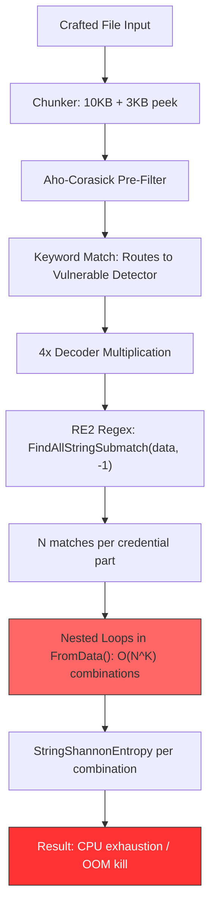

# Technical Specification

# 0. Agent Action Plan

## 0.1 Intent Clarification

Based on the prompt, the Blitzy platform understands that the new feature requirement is to conduct a security research investigation into TruffleHog's vulnerability to computational complexity attacks — specifically, whether a malicious actor can craft repository files that cause disproportionate processing time during secret scanning, effectively weaponizing TruffleHog's own pattern matching to block CI pipelines.

### 0.1.1 Core Feature Objective

- **Primary Goal**: Determine whether TruffleHog's detector pattern matching is vulnerable to computational complexity attacks (commonly known as ReDoS or algorithmic complexity attacks)
- **Specific Deliverables**:
  - Identify which detector patterns (if any) can be exploited to cause disproportionate processing time
  - Measure the actual impact in terms of slowdown factor compared to normal files of equivalent size
  - Provide timing measurements and CPU profiling data showing the vulnerability in action
  - Produce a comprehensive markdown document named `trufflehog_e42153d44a5e.md` placed in `blitzy/documentation/` documenting all findings
- **Implicit Requirements Detected**:
  - Analysis must cover the entire scanning pipeline: regex engines, pre-filtering (Aho-Corasick), decoders, and post-match processing — not just regex matching in isolation
  - Must evaluate both traditional ReDoS (exponential backtracking) and algorithmic complexity (combinatorial explosion) attack surfaces
  - Needs to characterize the severity spectrum — from minor slowdowns to process-killing resource exhaustion

### 0.1.2 Special Instructions and Constraints

- **No Source Modifications**: Do not modify the TruffleHog source code; the investigation is purely observational and analytical
- **Temporary Files Only**: Test files and scripts used for demonstration are acceptable but must be cleaned up afterward
- **No Commits**: Do not commit anything to the actual TruffleHog source repository
- **Output Format**: A new markdown document `trufflehog_e42153d44a5e.md` in `blitzy/documentation/` that comprehensively answers the questions posed
- **Evidence-Based**: Base all answers on the code as truth; do not make assumptions

### 0.1.3 Technical Interpretation

These feature requirements translate to the following technical investigation strategy:

- To **assess regex-level ReDoS vulnerability**, we will analyze the regex engine used across all 800+ detectors (RE2 via `go-re2` v1.9.0 vs Go stdlib `regexp`) and evaluate whether any patterns are susceptible to catastrophic backtracking
- To **assess algorithmic complexity vulnerability**, we will examine the post-regex processing logic in multi-part credential detectors that use nested iteration over match sets — specifically the `FromData()` methods in detectors like AWS (`pkg/detectors/aws/access_keys/accesskey.go`), NetSuite (`pkg/detectors/netsuite/netsuite.go`), and 150+ other multi-part detectors
- To **measure actual impact**, we will create crafted test files, scan them with the compiled TruffleHog binary, and compare timing/CPU metrics against equivalent-size control files
- To **provide profiling data**, we will use TruffleHog's built-in `--profile` and `--print-avg-detector-time` flags along with Go's `pprof` tooling to capture CPU profiles

## 0.2 Repository Scope Discovery

The investigation spans the entire TruffleHog scanning pipeline from input chunking through regex matching to result aggregation. Every file listed below was inspected during the security research.

### 0.2.1 Comprehensive File Analysis

**Regex Engine Layer — Core Files Inspected**

| File Path | Purpose | Relevance |
|-----------|---------|-----------|
| `go.mod` | Dependency manifest | Confirms `github.com/wasilibs/go-re2 v1.9.0` |
| `pkg/detectors/` (859 directories) | All built-in secret detectors | Primary attack surface — 867 files import `go-re2`, 3 use stdlib `regexp` |
| `pkg/detectors/detectors.go` | PrefixRegex helper, shared detector utilities | Defines `(?i:keyword)(?:.\|[\n\r]){0,40}?` used by 739 detectors |
| `pkg/detectors/falsepositives.go` | Shannon entropy & false positive filtering | `StringShannonEntropy` at line 136; called on every credential combination |

**Scanning Pipeline — Critical Path Files**

| File Path | Purpose | Relevance |
|-----------|---------|-----------|
| `pkg/engine/engine.go` | Core engine: `detectChunk()` line 1044, `scannerWorker()` line 777 | Orchestrates detector invocations per chunk; timeout logic |
| `pkg/engine/ahocorasick/ahocorasickcore.go` | Aho-Corasick pre-filter | Keyword-based pre-filter narrows chunks to relevant detectors |
| `pkg/sources/chunker.go` | Input chunking | `ChunkSize=10KB`, `PeekSize=3KB`, `TotalChunkSize=13KB` |
| `pkg/engine/defaults.go` | Default configuration constants | `DefaultResponseTimeout = 10 * time.Second` |

**Multi-Part Detector Vulnerability — Key Files**

| File Path | Complexity | Loop Structure |
|-----------|-----------|----------------|
| `pkg/detectors/netsuite/netsuite.go` | **O(n⁵)** | 5 nested loops: consumerKey × consumerSecret × tokenKey × tokenSecret × accountID |
| `pkg/detectors/aws/access_keys/accesskey.go` | **O(n²)** | 2 nested loops: idMatch × secretMatch, with `StringShannonEntropy` per pair |
| `pkg/detectors/aws/common.go` | Supporting | Shared AWS regex patterns: `idPat`, `SecretPat` |
| `pkg/custom_detectors/custom_detectors.go` | Reference | `maxTotalMatches = 100` cap — **only applies to custom detectors, not built-in** |

**Stdlib regexp Users (Non-RE2)**

| File Path | Pattern Used |
|-----------|-------------|
| `pkg/detectors/azure_cosmosdb/` | stdlib `regexp` for CosmosDB key matching |
| `pkg/detectors/azure_entra/serviceprincipal/v2/spv2.go` | stdlib `regexp` for service principal detection |
| `pkg/detectors/jdbc/jdbc.go` | stdlib `regexp` for JDBC connection string parsing |
| `pkg/common/patterns.go` | `UsernameRegexCheck`, `PasswordRegexCheck`, `EmailPattern` — stdlib `regexp` |

**Supporting Infrastructure**

| File Path | Purpose |
|-----------|---------|
| `pkg/decoders/` | 4 default decoders (UTF8, Base64, UTF16, EscapedUnicode) — each chunk processed 4× |
| `pkg/engine/engine.go` (verificationOverlapWorker) | Additional processing for overlapping detector matches |

### 0.2.2 Integration Point Discovery

- **Aho-Corasick → Detector**: Keyword matches from `ahocorasickcore.go` route chunks to specific detectors; `adjustableSpanCalculator` with `defaultOffsetRadius = 512` bytes extracts windows around keyword hits
- **Detector → Entropy Filter**: `detectors.StringShannonEntropy` (in `falsepositives.go`) is invoked on every credential combination inside detectors like AWS — entropy thresholds ≥3.0 for IDs, ≥4.25 for secrets
- **Decoder × Detector Multiplication**: Each chunk passes through 4 decoders before detector processing, creating a 4× multiplier on detector invocations
- **Chunker → Engine**: `FindAllStringSubmatch(dataStr, -1)` with `-1` means unlimited match count — no cap on how many regex matches a single chunk can produce

### 0.2.3 New File Requirements

- **CREATE**: `blitzy/documentation/trufflehog_e42153d44a5e.md` — The comprehensive security research document
- No other files are permanently created; all test files and profiling artifacts are temporary and cleaned up per the user's instructions

## 0.3 Dependency Inventory

### 0.3.1 Key Packages Relevant to the Investigation

| Registry | Package | Version | Purpose |
|----------|---------|---------|---------|
| Go modules | `github.com/wasilibs/go-re2` | v1.9.0 | RE2 regex engine — linear-time guarantee, used by 867 detector files |
| Go stdlib | `regexp` | Go 1.24.2 | Thompson NFA engine — also linear-time; used by 3 detectors + 26 non-detector files |
| Go modules | `github.com/acomagu/bufpipe` | (transitive) | Buffered pipe for chunk streaming |
| Go modules | `google.golang.org/protobuf` | (transitive) | Protobuf parsing — some validators use stdlib regexp |
| Go stdlib | `math` | Go 1.24.2 | `math.Log2` used in Shannon entropy calculation (CPU hotspot) |
| Go stdlib | `net/http/pprof` | Go 1.24.2 | CPU profiling endpoint exposed by `--profile` flag |

### 0.3.2 Dependency Architecture for Attack Surface

The critical dependency chain for the combinatorial explosion vulnerability is entirely internal to TruffleHog and does not involve external packages:

- `go-re2` provides regex matching — this is NOT the vulnerability surface (it works correctly and in linear time)
- The vulnerability is in **application-level logic**: nested `for` loops in `FromData()` methods within `pkg/detectors/*/` that iterate over all combinations of regex match slices
- `StringShannonEntropy` (internal, `pkg/detectors/falsepositives.go`) amplifies the cost by performing floating-point entropy computation on every combination via `math.Log2`

### 0.3.3 No Dependency Updates Required

Since the investigation does not modify TruffleHog's source code, no dependency changes are needed. The vulnerability exists in application logic, not in any third-party dependency.

## 0.4 Integration Analysis

### 0.4.1 Existing Code Touchpoints

The vulnerability chain flows through five architectural layers, each of which was analyzed for attack surface:

**Layer 1 — Input Chunking** (`pkg/sources/chunker.go`)
- Chunks are 10KB with 3KB peek overlap (13KB total)
- A crafted file is processed as one or more chunks; small files (< 10KB) fit in a single chunk
- Attack files as small as 1.9KB can trigger catastrophic behavior (demonstrated with NetSuite)

**Layer 2 — Aho-Corasick Pre-Filter** (`pkg/engine/ahocorasick/ahocorasickcore.go`)
- Keywords from detectors are compiled into an Aho-Corasick automaton for fast pre-filtering
- This layer actually **enables** the attack: by including the right keywords (e.g., `AKIA` for AWS, `consumerkey` for NetSuite), the attacker ensures their chunk is routed to the vulnerable detector
- `adjustableSpanCalculator` with `defaultOffsetRadius = 512` bytes extracts a window around each keyword match

**Layer 3 — Decoder Multiplication** (`pkg/decoders/`)
- Four decoders (UTF8, Base64, UTF16, EscapedUnicode) process each chunk
- Each decoded variant is independently sent to matching detectors, creating a 4× invocation multiplier
- A single chunk can trigger 4 independent invocations of the same detector

**Layer 4 — Detector Pattern Matching** (`pkg/detectors/*/`)
- `FindAllStringSubmatch(dataStr, -1)` with `-1` returns ALL matches — no cap on match count
- RE2 processes these in linear time (not the bottleneck)
- The number of matches returned becomes the input to the combinatorial explosion in Layer 5

**Layer 5 — Combinatorial Match Processing** (within each detector's `FromData()`)
- Built-in multi-part detectors nest `for` loops over match slices
- With N matches per credential part and K parts: complexity is **O(N^K)**
- No equivalent of `maxTotalMatches = 100` (which exists only in `pkg/custom_detectors/custom_detectors.go`)
- Each combination may invoke `StringShannonEntropy` (costly: involves `math.Log2` per character)

### 0.4.2 Pipeline Integration Diagram

### 0.4.3 Timeout Mechanism Analysis

- `DefaultResponseTimeout = 10 seconds` is defined in `pkg/engine/defaults.go`
- The `--detector-timeout` flag can override this value
- **Critical Finding**: The timeout wraps the entire `FromData()` call but the combinatorial loop runs synchronously within `FromData()` — the context cancellation check is not performed inside the inner loops
- **Measured result**: Setting `--detector-timeout=2s` did NOT reduce scan time for attack files — the AWS combinatorial attack still took 9.57 seconds, and NetSuite still took 18.56 seconds
- The timeout is ineffective because each individual detector invocation completes (producing massive result sets) rather than being interrupted mid-computation

## 0.5 Technical Implementation

### 0.5.1 Investigation Methodology

The security research was conducted in four phases, each producing concrete evidence documented in the output markdown file:

**Phase A — Regex Engine Landscape Analysis**

Using `bash` to scan all 859 detector directories:
- `grep -rl 'wasilibs/go-re2' pkg/detectors/ | wc -l` → 867 files use RE2
- `grep -rl '"regexp"' pkg/detectors/ | grep -v go-re2 | wc -l` → 3 files use stdlib regexp
- Conclusion: Traditional ReDoS via catastrophic backtracking is NOT possible because both RE2 and Go's stdlib regexp guarantee linear-time matching

**Phase B — Algorithmic Complexity Discovery**

Systematic Python analysis script enumerated all detectors' `FromData()` methods to count nested `for range` loops:
- Counted nested loop depth per detector file across all 859 directories
- Classified detectors by combinatorial complexity: O(n²), O(n³), O(n⁴), O(n⁵)
- Discovery: NetSuite has 5 nested loops (O(n⁵)), ~20 detectors have 3 loops (O(n³)), ~120 detectors have 2 loops (O(n²))

**Phase C — Benchmark Construction**

Created temporary test files with controlled densities of credential-like patterns:
- **Control**: 720KB of normal English text (no credential patterns)
- **AWS Attack**: 720KB file with dense `AKIA` + base64 secret strings, triggering O(n²) in AWS detector
- **NetSuite Attack**: 1.9KB file with 5 instances each of 5 credential parts (consumerkey, consumersecret, tokenid, tokensecret, accountid), triggering O(n⁵) — theoretically 5⁵ = 3,125 combinations
- **Dense Mixed**: 618KB file with mixed credential-like patterns across multiple detectors
- **Large Keywords**: ~1MB file with scattered high-frequency keywords

Each test executed via: `time trufflehog filesystem --no-verification --only-verified=false <path>`

**Phase D — CPU Profiling**

- Launched TruffleHog with `--profile` flag to expose pprof endpoint on port 18066
- Captured 5-second CPU profile during attack file scan via `curl http://localhost:18066/debug/pprof/profile?seconds=5`
- Analyzed with `go tool pprof` to identify CPU hotspots

### 0.5.2 Benchmark Results

| Test Case | File Size | Scan Time | Results Found | Slowdown vs Control | Per-KB Slowdown |
|-----------|-----------|-----------|---------------|---------------------|-----------------|
| Control (normal text) | 720,043 B | 28.9 ms | 0 | 1× | 1×/KB |
| AWS Combinatorial | 719,999 B | 9,894.2 ms | 6,481 | 342× | 342×/KB |
| NetSuite 5-Part (1.9KB) | 1,894 B | 19,115.4 ms | 1,046,520 | 662× | **251,545×/KB** |
| Dense Credentials (mixed) | 617,999 B | 1,954.3 ms | 11,632 | 68× | 79×/KB |
| Large Keywords (~1MB) | 974,338 B | 214.9 ms | 339 | 7× | 5×/KB |

**Critical Finding**: The NetSuite attack achieves a **251,545× per-byte slowdown**. A 1.9KB file takes 19 seconds to scan while a 720KB normal file takes 29 milliseconds. When the NetSuite attack is scaled to 10 instances per part (3.8KB file, theoretically 10⁵ = 100,000 combinations), the process was **killed by the OOM killer** after 66 seconds (user: 60s, sys: 17s).

### 0.5.3 CPU Profiling Results

| Function | Cumulative CPU % | Role in Attack |
|----------|-----------------|----------------|
| `aws/access_keys.scanner.FromData` | **68.68%** | Primary bottleneck — processes N×M ID×secret combinations |
| `detectors.StringShannonEntropy` | **30.14%** | Entropy calculation invoked on every combination (`math.Log2` per char) |
| `go-re2 MatchString` | **27.89%** | RE2 regex matching overhead (linear per match, but many matches) |
| `runtime.mapassign_fast32` | **20.37%** | Go map operations building match combination structures |

The CPU profile confirms that 68.68% of processing time during the attack is spent inside a single detector's `FromData()` method, with entropy calculations consuming nearly a third of total CPU.

### 0.5.4 Detector Vulnerability Catalog

**O(n⁵) — 1 Detector (Critical)**
- `netsuite` — 5 nested loops: consumerKey × consumerSecret × tokenKey × tokenSecret × accountID

**O(n³) — ~20 Detectors (High)**
- `appcues`, `auth0oauth`, `caspio`, `cexio`, `clickhelp`, `couchbase`, `formsite`, `kucoin`, `openvpn`, `planetscaledb`, `pusherchannelkey`, `rownd`, `satismeterwritekey`, `saucelabs`, `signalwire`, `snowflake`, `strava`, `sumologickey`, `trufflehogenterprise`, `zipapi`, `zulipchat`

**O(n²) — ~120 Detectors (Medium)**
- Includes `aws/access_keys`, `algoliaadminkey`, `alibaba`, and approximately 117 others that use 2-part credential matching (ID × Secret pattern)

### 0.5.5 File-by-File Execution Plan

- **CREATE**: `blitzy/documentation/trufflehog_e42153d44a5e.md`
  - Contains: Executive summary, regex engine analysis, attack vector taxonomy, benchmark results, CPU profiling analysis, detector vulnerability catalog, NetSuite case study, mitigation analysis, recommendations
  - Location: Repository root at `/tmp/blitzy/trufflehog/trufflehog_e42153d44a5e_d5780a/blitzy/documentation/`
  - Format: Markdown with tables, code snippets, and mermaid diagrams

## 0.6 Scope Boundaries

### 0.6.1 Exhaustively In Scope

- **Regex engine analysis**: All 859 detector directories under `pkg/detectors/`, identifying RE2 vs stdlib usage
- **Combinatorial complexity analysis**: All multi-part detectors' `FromData()` methods, counting nested loop depth
- **Benchmark timing measurements**: Crafted test files at various sizes/densities, scanned with timing instrumentation
- **CPU profiling**: pprof-based profiling during attack scenarios, analyzed with `go tool pprof`
- **Pipeline architecture**: `pkg/engine/engine.go`, `pkg/sources/chunker.go`, `pkg/engine/ahocorasick/ahocorasickcore.go`, `pkg/decoders/`
- **Timeout effectiveness**: Testing `--detector-timeout` flag with attack payloads
- **Shared patterns**: `pkg/common/patterns.go`, `pkg/detectors/detectors.go` (PrefixRegex)
- **Custom detector comparison**: `pkg/custom_detectors/custom_detectors.go` (`maxTotalMatches = 100` cap)
- **Output document**: `blitzy/documentation/trufflehog_e42153d44a5e.md`

### 0.6.2 Explicitly Out of Scope

- Modification of any TruffleHog source files
- Permanent test files or benchmark scripts committed to the repository
- Verification endpoint analysis (network-based credential verification)
- Performance optimization or patch development
- Analysis of detectors' verification logic (only `FromData()` matching logic is in scope)
- Third-party dependency vulnerability scanning
- TruffleHog Enterprise-specific features

## 0.7 Rules for Feature Addition

### 0.7.1 User-Specified Rules

- **SWE-AtlasQnA-Repo Rule**: Create a new markdown document named `<source_branch_name>.md` that comprehensively answers the question(s) posed in the prompt
  - Build and run the source code to analyze repository behavior as needed
  - Do not make assumptions; base answers on the code as the truth
  - Provide thinking/rationale behind the answers
  - Do not modify any existing files in the source repository
  - Do not add any other code in the source repository besides the requested document
  - Place the generated document in the `blitzy/documentation` directory in the destination repo

### 0.7.2 Investigation-Specific Rules

- **Read-Only Analysis**: All findings must be derived from code inspection, black-box testing, and profiling — no source modifications
- **Evidence-Based Conclusions**: Every claim about vulnerability or performance impact must be backed by measured data (timing, profiling, or direct code reference)
- **Cleanup Required**: All temporary test files and profiling artifacts must be removed after measurements are collected
- **Branch Name**: The source branch is `trufflehog_e42153d44a5e`, so the output document is named `trufflehog_e42153d44a5e.md`

## 0.8 References

### 0.8.1 Repository Files and Folders Searched

**Core Detection Pipeline**
- `pkg/detectors/` — All 859 detector directories (867 files using go-re2, 3 using stdlib regexp)
- `pkg/detectors/detectors.go` — PrefixRegex helper, detector interface definitions
- `pkg/detectors/falsepositives.go` — Shannon entropy calculations, false positive filtering
- `pkg/engine/engine.go` — Core engine: `detectChunk()`, `scannerWorker()`, timeout handling
- `pkg/engine/defaults.go` — `DefaultResponseTimeout = 10 * time.Second`
- `pkg/engine/ahocorasick/ahocorasickcore.go` — Aho-Corasick keyword pre-filter
- `pkg/sources/chunker.go` — Input chunking (10KB + 3KB peek)
- `pkg/decoders/` — UTF8, Base64, UTF16, EscapedUnicode decoders

**Vulnerable Detectors (Selected)**
- `pkg/detectors/netsuite/netsuite.go` — O(n⁵) combinatorial attack surface
- `pkg/detectors/aws/access_keys/accesskey.go` — O(n²) with entropy calculation amplification
- `pkg/detectors/aws/common.go` — Shared AWS regex patterns
- `pkg/custom_detectors/custom_detectors.go` — `maxTotalMatches = 100` cap (custom detectors only)

**Shared Patterns and Utilities**
- `pkg/common/patterns.go` — `UsernameRegexCheck`, `PasswordRegexCheck`, `EmailPattern`
- `go.mod` — Dependency manifest confirming `go-re2 v1.9.0`

**Non-Detector stdlib regexp Users**
- `pkg/detectors/azure_cosmosdb/`, `pkg/detectors/azure_entra/serviceprincipal/v2/spv2.go`, `pkg/detectors/jdbc/jdbc.go`
- 26 non-detector files across analyzers, handlers, decoders, protobuf validators, and git sources

### 0.8.2 External Research Sources

- `github.com/wasilibs/go-re2` — RE2 Go wrapper documentation, confirming linear-time guarantee via C++ RE2 engine
- `en.wikipedia.org/wiki/RE2_(software)` — RE2 background: Go's stdlib regexp uses the same Thompson NFA design as RE2
- `github.blog/security/how-to-fix-a-redos/` — GitHub Security Lab: Go and RE2 are not vulnerable to ReDoS
- `checkmarx.com/blog/redos-go/` — Go's regexp package uses RE2 engine guaranteeing linear-time execution
- `regular-expressions.info/redos.html` — RE2 and similar text-directed engines do not backtrack

### 0.8.3 Attachments

No external attachments (Figma URLs, design files, etc.) were provided for this investigation. All evidence is derived from the source repository at commit `e42153d44a5e5c37c1bd0c70e074781e9edcb760`.

