# TruffleHog Secret-Detection Pipeline — Runtime Behavior Q&A

## Introduction & Methodology

This document answers six runtime-behavior questions about TruffleHog's secret-detection
pipeline — the scanning **engine**, its **Aho-Corasick** keyword prefilter, the **decoder**
pipeline, the **verification cache**, the worker **concurrency** model, the notifier
**deduplication** cache, and the `--print-avg-detector-time` reporting path. Every answer is
grounded in the repository source (**code-as-truth**) and corroborated with **actual terminal
output** produced by building and running the scanner.

- **Repository / commit pin:** module `github.com/trufflesecurity/trufflehog/v3`, branch
  `trufflehog_e42153d44a5e`, commit `e42153d44a5e5c37c1bd0c70e074781e9edcb760` (short
  `e42153d4`). All cited line numbers and measured counts are valid for this commit and should be
  regarded as commit-specific.
- **Build method:** `CGO_ENABLED=0 go build -o /tmp/trufflehog .` with **Go 1.24.2**, mirroring the
  repository `Dockerfile`. `go.mod` declares `go 1.23.1` (L3) and `toolchain go1.24.2` (L5).
- **Demonstration environment:** the evidence-capture host had **128 CPUs**, so
  `runtime.NumCPU() = 128`. This matters because worker **counts** are driven by `--concurrency`
  (fully reproducible on any host), while the inter-stage channel **buffer sizes** scale with
  `runtime.NumCPU()` (host-dependent). Timing figures (milliseconds, scan durations) are
  environment- and network-dependent; the structural and code-derived conclusions are invariant for
  commit `e42153d4`.
- **Deterministic / offline flags used:** `--no-verification`, `--no-verification-cache`,
  `--results=verified,unknown,unverified`, `--log-level=2`, `--concurrency`,
  `--print-avg-detector-time`, `--no-update`.
- **No source files were modified.** The TruffleHog source tree was confirmed pristine
  (`git status --porcelain` produced no output; `HEAD` remained `e42153d44a5e…`). All scratch
  artifacts lived under `/tmp` and were deleted afterward. The unique-keyword count was measured
  with an **out-of-repo helper module** that imports the package via a local `replace` directive —
  never added to the source tree.
- **Test token (fake, used offline):** the fixtures reuse the 64-hex Sentry token already present in
  `pkg/engine/testdata/secrets.txt`:
  `27ac84f4bcdb4fca9701f4d6f6f58cd7d96b69c9d9754d40800645a51d668f90`. It is **not a real
  credential**; it is a syntactically valid value used purely to exercise the `SentryToken` detector.

### Table of Contents

1. [Q1 — Aho-Corasick keyword cardinality & sharing](#q1--aho-corasick-keyword-cardinality--sharing)
2. [Q2 — Decoder vs. keyword-match ordering](#q2--decoder-vs-keyword-match-ordering)
3. [Q3 — Verification-cache metrics & persistence](#q3--verification-cache-metrics--persistence)
4. [Q4 — Worker concurrency multipliers & backpressure](#q4--worker-concurrency-multipliers--backpressure)
5. [Q5 — Deduplication LRU key & cross-decoder behavior](#q5--deduplication-lru-key--cross-decoder-behavior)
6. [Q6 — `--print-avg-detector-time` scope & verification timing](#q6----print-avg-detector-time-scope--verification-timing)

---

## Q1 — Aho-Corasick keyword cardinality & sharing

### Answer

With the **default detector set (831 detectors)**, the engine loads **914 unique keywords**
(all lower-cased) into the Aho-Corasick prefilter trie. Keywords are **shared across detectors** —
a single keyword can map to **many** detectors (a many-to-many keyword→detector relationship), **not**
distinct-per-detector. There are **955** total keyword→detector pairs across the **914** unique keys;
**32** keywords map to more than one detector, and the most-shared keyword is **`"azure"` (6
detectors)**.

### Code citations

- `pkg/engine/ahocorasick/ahocorasickcore.go:L141` — `func NewAhoCorasickCore(allDetectors []detectors.Detector, opts ...CoreOption) *Core`.
- `pkg/engine/ahocorasick/ahocorasickcore.go:L142` — `keywordsToDetectors := make(map[string][]DetectorKey)`. The value is a **slice** of detector keys, which is what structurally permits many detectors per keyword.
- `pkg/engine/ahocorasick/ahocorasickcore.go:L149` — `kwLower := strings.ToLower(kw)` (every keyword is lower-cased).
- `pkg/engine/ahocorasick/ahocorasickcore.go:L150-L151` — `keywords = append(keywords, kwLower)` and `keywordsToDetectors[kwLower] = append(keywordsToDetectors[kwLower], key)` (the per-detector append that builds the many-to-many map).
- `pkg/engine/ahocorasick/ahocorasickcore.go:L159` — `prefilter: *ahocorasick.NewTrieBuilder().AddStrings(keywords).Build()` (the trie is built from the lower-cased keyword list).
- `pkg/engine/ahocorasick/ahocorasickcore.go:L302-L304` — `func (ac *Core) KeywordsToDetectors() map[string][]DetectorKey { return ac.keywordsToDetectors }` (the accessor measured empirically).
- `pkg/engine/defaults/defaults.go:L1704` — `func DefaultDetectors() []detectors.Detector` (the population that seeds the trie), fed into the engine at `main.go:L519` (`Detectors: append(defaults.DefaultDetectors(), conf.Detectors...)`).
- Library: `github.com/BobuSumisu/aho-corasick v1.0.3` (`go.mod:L17`; import at `ahocorasickcore.go:L7`).

### Terminal evidence

An out-of-repo helper (`/tmp/kwcount`) calls `len(core.KeywordsToDetectors())` on
`NewAhoCorasickCore(defaults.DefaultDetectors())` and tallies the slice lengths:

```text
default_detectors=831
unique_keywords=914
total_keyword_detector_pairs=955
keywords_shared_by_multiple_detectors=32
max_detectors_for_one_keyword=6 (keyword="azure")
top_shared_keywords (kw:numDetectors):
  "azure": 6
  "airtable": 3
  "cloudflare": 3
  "github": 3
  "teamwork": 3
  "twitter": 3
  "airbrake": 2
  "asana": 2
  "auth0": 2
  "box": 2
```

### Rationale

`len(KeywordsToDetectors())` = **914** is the number of *unique* keys in the
`map[string][]DetectorKey`. Summing the slice lengths gives **955** keyword→detector pairs. The
41-pair surplus over 914 exists precisely because **32** keywords map to more than one detector
(e.g., `"azure"` → 6 detectors, `"github"` → 3). Because the map value is a *slice* — appended to
once per detector at `L151` — and the keys are lower-cased at `L149`, the same keyword naturally
fans out to multiple detectors. That is the structural proof of keyword **sharing**, not
per-detector distinctness. The trie itself (`L159`) is built from the (possibly duplicated)
lower-cased `keywords` slice; the authoritative *unique* count is the map cardinality, **914**.

---

## Q2 — Decoder vs. keyword-match ordering

### Answer

**Decoding happens BEFORE keyword matching.** For each source chunk, the scanner worker iterates the
decoder list and, **per decoder**, first decodes the chunk and then runs the Aho-Corasick matcher on
the **decoded** bytes. So the sequence per chunk is:
`decode (decoder #1) → match → decode (decoder #2) → match → …`. A chunk that contains both a
plaintext secret and a Base64-encoded secret surfaces results attributed **per decoder pass**: the
UTF8 pass yields `Decoder Type: PLAIN`, and the Base64 pass yields `Decoder Type: BASE64`.

### Code citations

- `pkg/engine/engine.go:L777` — `func (e *Engine) scannerWorker(ctx context.Context)`.
- `pkg/engine/engine.go:L784` — `for _, decoder := range e.decoders {` (iterate the decoder list).
- `pkg/engine/engine.go:L786` — `decoded := decoder.FromChunk(chunk)` — the **DECODE** step.
- `pkg/engine/engine.go:L795` — `matchingDetectors := e.AhoCorasickCore.FindDetectorMatches(decoded.Chunk.Data)` — the **MATCH** step, run on the **decoded** bytes (note the argument is `decoded.Chunk.Data`, not the raw chunk).
- `pkg/engine/ahocorasick/ahocorasickcore.go:L241-L242` — `func (ac *Core) FindDetectorMatches(chunkData []byte)` → `matches := ac.prefilter.Match(bytes.ToLower(chunkData))` (the matcher runs on the lower-cased *decoded* data).
- `pkg/decoders/decoders.go:L8-L16` — `func DefaultDecoders() []Decoder { return []Decoder{ &UTF8{}, &Base64{}, &UTF16{}, &EscapedUnicode{} } }`, with the comment `// UTF8 must be first for duplicate detection` at `L10`. The decoder order is fixed: **UTF8, Base64, UTF16, EscapedUnicode**.

### Terminal evidence

First, the fixture construction proves the **raw** Base64 text contains no literal `sentry` keyword:

```bash
# Base64-only fixture = base64("sentry 27ac84f4...f90"); the RAW text has no literal "sentry"
$ cat /tmp/thscan/base64only.txt
c2VudHJ5IDI3YWM4NGY0YmNkYjRmY2E5NzAxZjRkNmY2ZjU4Y2Q3ZDk2YjY5YzlkOTc1NGQ0MDgwMDY0NWE1MWQ2NjhmOTA=
$ grep -c "sentry" /tmp/thscan/base64only.txt
0
```

Plaintext scan (`--concurrency=1 --no-verification --results=verified,unknown,unverified`) yields
`Decoder Type: PLAIN`:

```text
Found unverified result 🐷🔑❓
Detector Type: SentryToken
Decoder Type: PLAIN
Raw result: 27ac84f4bcdb4fca9701f4d6f6f58cd7d96b69c9d9754d40800645a51d668f90
File: /tmp/thscan/plaintext.txt
Line: 1
```

Base64-only scan — fires with `Decoder Type: BASE64` (full output):

```text
🐷🔑🐷  TruffleHog. Unearth your secrets. 🐷🔑🐷

2026-06-26T20:46:57Z	info-0	trufflehog	running source	{"source_manager_worker_id": "y0NPE", "with_units": true}
Found unverified result 🐷🔑❓
Detector Type: SentryToken
Decoder Type: BASE64
Raw result: 27ac84f4bcdb4fca9701f4d6f6f58cd7d96b69c9d9754d40800645a51d668f90
File: /tmp/thscan/base64only.txt
Line: 1

2026-06-26T20:46:57Z	info-0	trufflehog	finished scanning	{"chunks": 1, "bytes": 72, "verified_secrets": 0, "unverified_secrets": 1, "scan_duration": "2.16686ms", "trufflehog_version": "dev", "verification_caching": {"Hits":0,"Misses":0,"HitsWasted":0,"AttemptsSaved":0,"VerificationTimeSpentMS":0}}
```

### Rationale

The decisive proof is the Base64-only file. Its **raw** bytes contain no literal `sentry` substring
(`grep -c "sentry"` → `0`), so the Aho-Corasick prefilter — which matches the `"sentry"` keyword —
could not possibly fire on the raw chunk. Yet the scan reports `Detector Type: SentryToken` with
`Decoder Type: BASE64`. The only way this happens is the order in code: `decoder.FromChunk(...)`
(`engine.go:L786`) runs first and produces decoded bytes containing `sentry 27ac84f4…`, and only
**then** does `FindDetectorMatches(decoded.Chunk.Data)` (`engine.go:L795`) run the matcher on those
decoded bytes. The matcher's input is explicitly the *decoded* data, and it lower-cases it
(`ahocorasickcore.go:L242`). The `SentryToken` detector is ideal for this demonstration: its
prefilter keyword is `"sentry"` and its regex is `PrefixRegex(["sentry"]) + \b([a-f0-9]{64})\b`
(`pkg/detectors/sentrytoken/v1/sentrytoken.go:L33,L45`) — a value that requires the `sentry`
keyword to be physically present in whatever bytes the matcher sees.

---


## Q3 — Verification-cache metrics & persistence

### Answer

The verification cache reports **five** metrics in the `verification_caching` field of the
end-of-scan `finished scanning` log line: **`Hits`, `Misses`, `HitsWasted`, `AttemptsSaved`,
`VerificationTimeSpentMS`**. The cache is an **in-memory struct created fresh per process**, so the
hit/miss counters do **NOT persist across invocations**: an identical re-run reproduces the same
counters *from an empty cache* — it does **not** become "all hits".

### Code citations

- `pkg/verificationcache/in_memory_metrics.go:L9-L15` — the five counters:
  ```go
  type InMemoryMetrics struct {
      CredentialVerificationsSaved atomic.Int32
      FromDataVerifyTimeSpentMS    atomic.Int64
      ResultCacheHits              atomic.Int32
      ResultCacheHitsWasted        atomic.Int32
      ResultCacheMisses            atomic.Int32
  }
  ```
- `main.go:L511` — `verificationCacheMetrics := verificationcache.InMemoryMetrics{}` (a **fresh** instance per process).
- `main.go:L535-L536` — `if !*noVerificationCache { engConf.VerificationResultCache = simple.NewCache[detectors.Result]() }` (the simple in-memory result cache is enabled unless `--no-verification-cache`).
- `main.go:L551-L562` — the anonymous snapshot struct mapping the log field names to the metric fields: `Hits ← ResultCacheHits`, `Misses ← ResultCacheMisses`, `HitsWasted ← ResultCacheHitsWasted`, `AttemptsSaved ← CredentialVerificationsSaved`, `VerificationTimeSpentMS ← FromDataVerifyTimeSpentMS`.
- `main.go:L566,L573` — `logger.Info("finished scanning", …, "verification_caching", verificationCacheMetricsSnapshot)`.
- `pkg/verificationcache/verification_cache.go:L50` — `func (v *VerificationCache) FromData(...)`; `:L58` — `if v.resultCache == nil { … return detector.FromData(ctx, verify, data) }` (the cache facade is bypassed when there is no result cache); `:L136-L147` — `getResultCacheKey` builds the key as `Blake2b(Raw ‖ RawV2 ‖ DetectorType)` via `v.hasher.Hash(...)`.
- `pkg/hasher/blake2b.go:L3,L9-L10` — Blake2b (`blake2b.New256`) backs the result-cache key.
- `pkg/cache/simple/simple.go:L41` — `func NewCache[T any](...) *Cache[T]` (the in-memory cache implementation).
- Interfaces: `pkg/verificationcache/metrics_reporter.go` (`MetricsReporter`) and `pkg/verificationcache/result_cache.go` (`ResultCache`).

> **Key distinction (do not conflate with Q5):** the Q3 **result-cache key** is
> `Blake2b(Raw ‖ RawV2 ‖ DetectorType)` (`verification_cache.go:L136-L147`). This is **different**
> from the Q5 **notifier dedupe key** `DetectorType + Raw + RawV2 + SourceMetadata`
> (`engine.go:L1216`). They serve different subsystems (verification result caching vs. result
> deduplication) and are constructed differently (Blake2b hash vs. `fmt.Sprintf`).

### Terminal evidence

Twelve files each containing the same Sentry token, scanned at `--concurrency=1` (→ 8 detector
workers), with verification **on**, run **twice** (Sentry is reachable, so the fake token verifies
as invalid/unverified, but the verification *attempt* is cached):

```text
# RUN #1 (verification ON, cache ON)
finished scanning  {"chunks": 12, "bytes": 864, "verified_secrets": 0, "unverified_secrets": 12, "scan_duration": "5.003121835s", "trufflehog_version": "dev", "verification_caching": {"Hits":4,"Misses":8,"HitsWasted":0,"AttemptsSaved":4,"VerificationTimeSpentMS":5558}}

# RUN #2 (identical re-run, fresh process)
finished scanning  {"chunks": 12, "bytes": 864, "verified_secrets": 0, "unverified_secrets": 12, "scan_duration": "75.527687ms", "trufflehog_version": "dev", "verification_caching": {"Hits":4,"Misses":8,"HitsWasted":0,"AttemptsSaved":4,"VerificationTimeSpentMS":516}}
```

Two control runs isolate the cache and verification paths:

```text
# --no-verification  (verify=false ⇒ cache facade bypassed ⇒ all five are 0)
verification_caching: {"Hits":0,"Misses":0,"HitsWasted":0,"AttemptsSaved":0,"VerificationTimeSpentMS":0}

# --no-verification-cache  (resultCache==nil ⇒ no hits/misses/saved, but verification still runs and is timed)
verification_caching: {"Hits":0,"Misses":0,"HitsWasted":0,"AttemptsSaved":0,"VerificationTimeSpentMS":676}
```

### Rationale

Across the two identical runs the `Hits` / `Misses` / `HitsWasted` / `AttemptsSaved` counters are
**identical (4 / 8 / 0 / 4)**. If the cache persisted across invocations, run #2 would have started
warm and reported ~12 hits / 0 misses. Instead it again started **cold** (8 misses → 8 remote
verifications, then 4 hits once the result cache for `Blake2b(Raw ‖ RawV2 ‖ DetectorType)` was
populated within that process, saving 4 verification attempts). This is only possible if a brand-new
in-memory `InMemoryMetrics{}` and `simple.NewCache` are created per process
(`main.go:L511,L535-L536`). The `VerificationTimeSpentMS` differs between runs (5558 vs 516) — that
is wall-clock/network noise, not retained state.

The `--no-verification` control shows all five at 0 because `FromData` is called with `verify=false`,
so the caching path is bypassed; `--no-verification-cache` shows the four cache counters at 0 but a
non-zero `VerificationTimeSpentMS` (676) because verification still happens (the `resultCache == nil`
branch at `verification_cache.go:L58`) — it just is not cached. Note that the exact 8/4 split is a
function of detector-worker count vs. file count and is timing-dependent; the **invariant that
matters** is that the counters are identical across runs, which proves the cache does not persist.

---


## Q4 — Worker concurrency multipliers & backpressure

### Answer

Goroutine counts are `--concurrency` × a per-type multiplier: **scanner ×1, detector ×8,
verification-overlap ×1, notifier ×1**. So at **`--concurrency=4`** the engine starts **4 scanner,
32 detector, 4 verification-overlap, and 4 notifier** workers. Backpressure **does** occur: the
inter-stage channels are buffered (sizes are multiples of `runtime.NumCPU()`), and when a channel is
full the sending worker **blocks on send** — throttling upstream chunk production until consumers
catch up.

### Code citations

- `pkg/engine/engine.go:L344-L345` — `// bound by net i/o so it's higher than other workers` then `e.detectorWorkerMultiplier = 8` (the detector pool is 8× because detection/verification is network-bound).
- `pkg/engine/engine.go:L349` — `e.notificationWorkerMultiplier = 1`; `:L353` — `e.verificationOverlapWorkerMultiplier = 1`.
- `pkg/engine/engine.go:L663` — scanner: `ctx.Logger().V(2).Info("starting scanner workers", "count", e.concurrency)` (scanner count = `e.concurrency`, i.e., ×1).
- `pkg/engine/engine.go:L676` — `numWorkers := e.concurrency * e.detectorWorkerMultiplier` (detector); logged at `:L678`.
- `pkg/engine/engine.go:L691` — `numWorkers := e.concurrency * e.verificationOverlapWorkerMultiplier`; logged at `:L693`.
- `pkg/engine/engine.go:L706` — `numWorkers := e.notificationWorkerMultiplier * e.concurrency`; logged at `:L708`.
- `pkg/engine/engine.go:L503` — `detectableChunksChanMultiplier = 50`; `:L507` — `verificationOverlapChunksChanMultiplier = 25`; `:L508` — `resultsChanMultiplier = detectableChunksChanMultiplier` (= 50); buffers created at `:L515,L516,L519`.
- `pkg/engine/engine.go:L627` — `var defaultChannelBuffer = runtime.NumCPU()` (so, e.g., the `detectableChunksChan` buffer = `NumCPU × 50`).
- `main.go:L58` — `concurrency = cli.Flag("concurrency", …).Default(strconv.Itoa(runtime.NumCPU())).Int()`.
- Corroboration: `docs/concurrency.md` (the worker-startup sequence diagram).

### Terminal evidence

`--log-level=2` surfaces the worker-start counts (the counts depend only on `--concurrency`, so they
are reproducible on any host):

```text
# --concurrency=1
starting scanner workers              {"count": 1}
starting detector workers             {"count": 8}
starting verificationOverlap workers  {"count": 1}
starting notifier workers             {"count": 1}

# --concurrency=2
starting scanner workers              {"count": 2}
starting detector workers             {"count": 16}
starting verificationOverlap workers  {"count": 2}
starting notifier workers             {"count": 2}

# --concurrency=4
starting scanner workers              {"count": 4}
starting detector workers             {"count": 32}
starting verificationOverlap workers  {"count": 4}
starting notifier workers             {"count": 4}
```

### Rationale

The observed counts scale linearly with `--concurrency` and confirm the multipliers in code: scanner
uses `e.concurrency` directly (×1, `L663`); detector = `e.concurrency × 8` (`L676`);
verification-overlap = `e.concurrency × 1` (`L691`); notifier = `e.concurrency × 1` (`L706`). The
detector pool is intentionally 8× larger because detection + verification is **bound by network I/O**
(the comment at `L344`). Backpressure is structural: chunks flow scanner → `detectableChunksChan`
(buffer `NumCPU × 50`) → detector workers → `results` (buffer `NumCPU × 50`) → notifier; the
verification-overlap path uses `verificationOverlapChunksChan` (buffer `NumCPU × 25`). When a
downstream stage cannot keep up and its channel fills, the upstream goroutine blocks on the channel
send — a natural rate limiter. On the 128-CPU evidence host these buffers were large (e.g.,
`detectableChunksChan` = 128 × 50 = 6400), so backpressure is observable mainly under sustained
high-volume input; the *mechanism* is the bounded buffer plus blocking send, independent of host CPU
count.

---


## Q5 — Deduplication LRU key & cross-decoder behavior

### Answer

The deduplication LRU key is
`fmt.Sprintf("%s%s%s%+v", result.DetectorType.String(), result.Raw, result.RawV2, result.SourceMetadata)`
— i.e., **DetectorType + Raw + RawV2 + SourceMetadata**, with the **decoder type deliberately
EXCLUDED** from the key. The LRU *value* stores the decoder type
(`lru.Cache[string, detectorspb.DecoderType]`, size 512). Because the decoder type is excluded from
the key, deduplication **spans decoder types**: the same credential found both in plaintext and
Base64-encoded is **reported once** (the second occurrence, coming from a *different* decoder, is
suppressed).

**Honest nuance (measured):** the duplicate is reported exactly once in the overwhelming majority of
runs, but **which** decoder label survives is **nondeterministic** (sometimes `PLAIN`, sometimes
`BASE64`). This is a benign race: the 8-wide detector pool processes the PLAIN and BASE64
detectable-chunks concurrently, and the single notifier keeps whichever arrives first — so one should
**not** assume the survivor is always `PLAIN`. Very rarely, the `Get`-then-`Add` window lets both
results slip through and the secret is reported twice.

### Code citations

- `pkg/engine/engine.go:L1189` — `func (e *Engine) notifierWorker(ctx context.Context)`.
- `pkg/engine/engine.go:L1210-L1215` — the dedupe comment: avoid duplicate results with *different* decoder types, but include duplicate results with the *same* decoder type; and if the source type is Postman, dedupe regardless of decoder type.
- `pkg/engine/engine.go:L1216` — `key := fmt.Sprintf("%s%s%s%+v", result.DetectorType.String(), result.Raw, result.RawV2, result.SourceMetadata)` (decoder type excluded).
- `pkg/engine/engine.go:L1217-L1218` — `if val, ok := e.dedupeCache.Get(key); ok && (val != result.DecoderType || result.SourceType == sourcespb.SourceType_SOURCE_TYPE_POSTMAN) { continue }`.
- `pkg/engine/engine.go:L1221` — `e.dedupeCache.Add(key, result.DecoderType)`.
- `pkg/engine/engine.go:L209` — `dedupeCache *lru.Cache[string, detectorspb.DecoderType]`; `:L491` — `const cacheSize = 512`; `:L493` — `lru.New[string, detectorspb.DecoderType](cacheSize)`; import at `:L18` (`github.com/hashicorp/golang-lru/v2 v2.0.7`, `go.mod:L64`).
- Decoder order: `pkg/decoders/decoders.go:L10` comment `// UTF8 must be first for duplicate detection`. Corroboration: `docs/process_flow.md` (the "De-Dupe-Detectors" / notifier stage).

### Terminal evidence

A representative single run (`--concurrency=1`, the same token in both plaintext and Base64 in one
file) reports the secret **once**:

```text
🐷🔑🐷  TruffleHog. Unearth your secrets. 🐷🔑🐷

2026-06-26T20:46:59Z	info-0	trufflehog	running source	{"source_manager_worker_id": "WI2oQ", "with_units": true}
Found unverified result 🐷🔑❓
Detector Type: SentryToken
Decoder Type: PLAIN
Raw result: 27ac84f4bcdb4fca9701f4d6f6f58cd7d96b69c9d9754d40800645a51d668f90
File: /tmp/thscan/dup.txt
Line: 1

2026-06-26T20:46:59Z	info-0	trufflehog	finished scanning	{"chunks": 1, "bytes": 144, "verified_secrets": 0, "unverified_secrets": 1, "scan_duration": "2.133008ms", "trufflehog_version": "dev", "verification_caching": {"Hits":0,"Misses":0,"HitsWasted":0,"AttemptsSaved":0,"VerificationTimeSpentMS":0}}
```

The measured distributions over many runs:

```text
"reported once" frequency:  default concurrency (128): 20/20 runs;  --concurrency=1: 20/20 runs
                            (a separate 5-run sample at default concurrency showed 1 run reporting twice — rare race)
surviving Decoder Type label (nondeterministic):
   default concurrency (128), 12 runs:  10 × BASE64,  2 × PLAIN
   --concurrency=1,            6 runs:    5 × PLAIN,   1 × BASE64
```

### Rationale

Because the key (`L1216`) omits the decoder type, the plaintext (`PLAIN`) and Base64 (`BASE64`)
detections of the same secret in the same file hash to the **same** key (same `DetectorType`, same
`Raw` 64-hex, same `RawV2`, same `SourceMetadata`). The first result to reach the notifier stores
`key → its DecoderType` (`L1221`); when the second arrives, `dedupeCache.Get(key)` returns the
*other* decoder type, so `val != result.DecoderType` is true and the result is skipped (`continue`,
`L1217-L1218`) — hence **reported once across decoders**. The comment at `L1210-L1215` documents the
intent: suppress cross-decoder duplicates, keep same-decoder duplicates, and always dedupe for
Postman sources. The `decoders.go` comment "UTF8 must be first for duplicate detection" expresses the
*intended* ordering (UTF8/PLAIN first), but because detection runs across an 8-wide detector pool,
the arrival order at the single notifier is not strictly preserved — which is why the surviving label
is observably nondeterministic. The rare double-report is the classic check-then-act race between
`Get` (`L1217`) and `Add` (`L1221`) across concurrent notifier workers. As noted in Q3, this dedupe
key is **distinct** from the verification result-cache key.

---


## Q6 — `--print-avg-detector-time` scope & verification timing

### Answer

The `--print-avg-detector-time` output includes **only detectors that returned results** (i.e., that
matched something), **NOT all loaded detectors**. **Verification time IS folded into** those numbers
— the timer wraps the verification-aware `FromData` call, so the printed per-detector duration
includes remote-verification latency; it is not tracked separately in this figure.

### Code citations

- `pkg/engine/engine.go:L1044` — `func (e *Engine) detectChunk(ctx context.Context, data detectableChunk)`.
- `pkg/engine/engine.go:L1046-L1048` — `if e.printAvgDetectorTime { start = time.Now() }` (the timer starts **before** verification).
- `pkg/engine/engine.go:L1070` — `results, err := e.verificationCache.FromData(ctx, data.detector.Detector, data.chunk.Verify, data.chunk.SecretID != 0, matchBytes)` (the verification-aware call, inside the timed region).
- `pkg/engine/engine.go:L1092` — `if e.printAvgDetectorTime && len(results) > 0 {` (the **gate**: timing is recorded only when results were returned).
- `pkg/engine/engine.go:L1093` — `elapsed := time.Since(start)` (measured **after** `FromData`, so verification latency is included); appended to the per-detector accumulator at `:L1104` (`e.metrics.detectorAvgTime.Store(...)`).
- `pkg/engine/engine.go:L578` — `func (e *Engine) GetDetectorsMetrics() map[string]time.Duration` (the per-detector averages, populated only for matched detectors).
- `main.go:L72` — the `print-avg-detector-time` flag; `:L964` — `printAverageDetectorTime(eng)` (called when the flag is set); `:L1021-L1028` — `func printAverageDetectorTime` prints the header line, then `fmt.Fprintf(os.Stderr, "%s: %s\n", detectorName, duration)` for each entry of `GetDetectorsMetrics()`.

> **Note on where the data lives.** The live per-detector accumulator backing this stderr report is
> `detectorAvgTime sync.Map` on `runtimeMetrics` at `engine.go:L60`, and the externally-consumed
> snapshot is `Metrics.AvgDetectorTime map[string]time.Duration` at `engine.go:L50`. These are
> **distinct** from the Prometheus collectors defined in `pkg/engine/metrics.go` (for example,
> `detectorExecutionDuration` at `metrics.go:L38`), which are exported via the metrics endpoint and
> are not what `--print-avg-detector-time` prints.

### Terminal evidence

Scanning the single plaintext fixture — only `SentryToken` matched, even though 831 detectors are
loaded:

```text
# WITH verification
Average detector time is the measurement of average time spent on each detector when results are returned.
SentryToken: 75.841725ms

# WITHOUT verification (--no-verification)
Average detector time is the measurement of average time spent on each detector when results are returned.
SentryToken: 158.549µs

# number of per-detector lines printed = 1  (NOT 831)
```

### Rationale

Only `SentryToken` is printed even though the default set loads 831 detectors, because the
per-detector timing map is populated solely inside the `len(results) > 0` gate (`engine.go:L1092`):
detectors that matched nothing never record a duration, and `printAverageDetectorTime` simply ranges
over that map (`GetDetectorsMetrics()`, `main.go:L1026-L1028`). Verification latency is included
because `start` is captured at `L1048` (before `FromData` at `L1070`) and `elapsed` at `L1093` (after
it). The empirical gap proves it: **75.841725ms** with verification (a real round-trip to Sentry's authenticated verification endpoint at path
`/api/0/auth/validate/`, the API the `SentryToken` detector calls via `http.MethodGet` at
`pkg/detectors/sentrytoken/v1/sentrytoken.go:L84`; it requires authentication and returns HTTP 403
to unauthenticated requests, so it is recorded here as a code-truth endpoint string rather than a
browsable link) versus **158.549µs** with `--no-verification` (local regex
only) — a ~480× difference attributable entirely to the verification call being inside the timed
region. Timing values are environment- and network-dependent; the structural conclusion —
matched-only scope plus verification-inclusive timing — is invariant for commit `e42153d4`.

---


## Runtime-relationship diagram

The diagram below ties the six answers together — how a chunk flows from a source through decoding,
keyword matching, detection/verification, and deduplicated notification:

```mermaid
flowchart LR
    Chunk["Source Chunk"] --> Scanner["Scanner Workers (concurrency x 1)"]
    Scanner -->|"per decoder: decode THEN keyword-match"| AC["Aho-Corasick Core (~914 unique keywords)"]
    AC -->|"1 matching detector"| DetChan["detectableChunksChan (buffer NumCPU x 50)"]
    AC -->|">1 matching detector"| VOChan["verificationOverlapChunksChan (buffer NumCPU x 25)"]
    DetChan --> Detector["Detector Workers (concurrency x 8)"]
    VOChan --> VO["Verification-Overlap Workers (concurrency x 1)"]
    VO --> DetChan
    Detector -->|"FromData via Verification Cache"| Results["results chan (buffer NumCPU x 50)"]
    Results --> Notifier["Notifier Workers (concurrency x 1), dedupe LRU size 512"]
    Notifier --> Output["Reported Secrets"]
```



Decoding precedes keyword matching, and the matcher runs once per decoder on that decoder's output
(Q2). A chunk with a **single** matching detector goes straight to `detectableChunksChan`, while a
chunk with **more than one** matching detector routes through the verification-overlap path before
rejoining the detector queue (Q4). The single-stage notifier collapses cross-decoder duplicates via
the size-512 LRU keyed on `DetectorType + Raw + RawV2 + SourceMetadata` (Q5).

---

## Methodology & Cleanup

- **Build:** the binary was built to `/tmp/trufflehog` with `CGO_ENABLED=0 go build` (Go 1.24.2),
  mirroring the repository `Dockerfile`; `GOCACHE` and `GOPATH` were set under `/tmp`.
- **Keyword count:** measured with an out-of-repo helper module (`/tmp/kwcount`) that imports the
  package via a local `replace` directive pointing at the repository (plus the same three forked
  `replace` directives the module itself declares) — never added to the source tree. It prints
  `len(core.KeywordsToDetectors())` and the slice-length tally.
- **Scratch fixtures:** lived under `/tmp/thscan` (plaintext / Base64-only / duplicate) and
  `/tmp/thq3` (12 identical-token files).
- **No file in the TruffleHog source repository was created, modified, or deleted.** Verified:
  `git status --porcelain` produced no output and `HEAD` remained
  `e42153d44a5e5c37c1bd0c70e074781e9edcb760`.
- **Cleanup:** all scratch artifacts (`/tmp/trufflehog`, `/tmp/thscan`, `/tmp/thq3`, `/tmp/kwcount`,
  `/tmp/gocache`, `/tmp/gopath`, and any downloaded toolchain) were removed at the end, satisfying
  the cleanup directive.
- **Caveat on numbers:** timing figures (milliseconds, scan durations, hit/miss split) are
  environment- and network-dependent and were captured on a 128-CPU host; the structural and
  code-derived conclusions (decode-before-match ordering, the five metrics, the ×1/×8/×1/×1
  multipliers, the dedupe key composition, matched-only timing scope) are commit-invariant for
  `e42153d4`. The two commit-invariant quantities — the **914** unique-keyword count and the
  worker-count multipliers — were independently re-confirmed at this commit.

### How to reproduce

```bash
export PATH=$PATH:/usr/local/go/bin GOCACHE=/tmp/gocache GOPATH=/tmp/gopath GOFLAGS=-mod=mod
cd <repo>; CGO_ENABLED=0 go build -o /tmp/trufflehog .
# Q1: out-of-repo helper (replace github.com/trufflesecurity/trufflehog/v3 => <repo>) -> len(core.KeywordsToDetectors())
# Q2/Q5: scan /tmp fixtures (plaintext, base64-only, plaintext+base64) with --no-verification --results=verified,unknown,unverified
# Q3: scan a dir of 12 identical-token files twice; compare "verification_caching"
# Q4: --log-level=2 --concurrency=1|2|4 -> read "starting * workers" counts
# Q6: --print-avg-detector-time, compare with/without --no-verification
```

