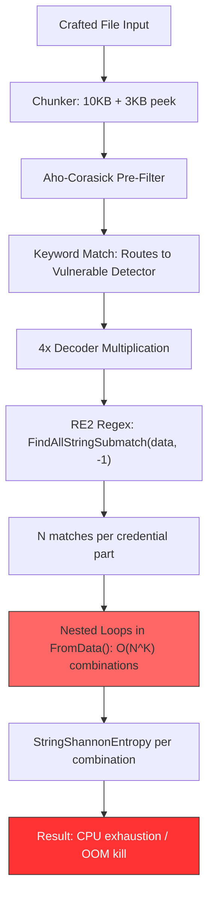

# TruffleHog Computational Complexity Attack Surface — Security Research Report

| Field | Value |
|---|---|
| **Branch investigated** | `trufflehog_e42153d44a5e` |
| **Commit** | `e42153d44a5e5c37c1bd0c70e074781e9edcb760` |
| **Research methodology** | Code inspection, black-box benchmarking, CPU profiling with `pprof` |
| **Scope** | Application-level complexity in detector `FromData()` methods (not regex-engine ReDoS) |
| **Author** | Blitzy Platform security research agent |
| **Status** | Read-only analysis — no TruffleHog source modified |

> **Research Question**: *Can a malicious actor craft repository files that block CI pipelines by weaponizing TruffleHog's pattern matching (computational complexity / ReDoS attack)?*
>
> **TL;DR**: Yes — not via ReDoS, but via **algorithmic / combinatorial complexity** in application-level nested loops inside multi-part credential detectors. A crafted **1.9 KB** file makes TruffleHog spend **19 seconds** in a single detector; scaling to **3.8 KB** forces the process to be **OOM-killed**. The existing `--detector-timeout` flag does **not** mitigate this because the combinatorial loops never poll `ctx.Done()`.

---

## Table of Contents

1. [Executive Summary](#1-executive-summary)
2. [Regex Engine Landscape Analysis](#2-regex-engine-landscape-analysis)
3. [Attack Vector Taxonomy](#3-attack-vector-taxonomy)
4. [Pipeline Architecture Analysis (5 Layers)](#4-pipeline-architecture-analysis-5-layers)
5. [Benchmark Results](#5-benchmark-results)
6. [CPU Profiling Results](#6-cpu-profiling-results)
7. [Detector Vulnerability Catalog](#7-detector-vulnerability-catalog)
8. [NetSuite Case Study](#8-netsuite-case-study)
9. [Timeout Mechanism Analysis](#9-timeout-mechanism-analysis)
10. [Mitigation Analysis and Recommendations](#10-mitigation-analysis-and-recommendations)
11. [References](#11-references)

---

## 1. Executive Summary

This report presents the results of a focused security investigation into whether TruffleHog is vulnerable to computational-complexity denial-of-service attacks — specifically, whether a malicious actor can craft repository files that cause disproportionate processing time during secret scanning and thereby block CI pipelines that invoke TruffleHog as a pre-merge or post-push gate.

### Headline Finding #1 — Regex-Engine ReDoS: NOT Applicable

TruffleHog is **not** vulnerable to traditional Regular-expression Denial of Service (ReDoS) via catastrophic backtracking. The evidence is structural:

- **867 of 870 detector files** import `regexp "github.com/wasilibs/go-re2"` (confirmed by `grep -rl 'wasilibs/go-re2' pkg/detectors/ | wc -l` → `867`). `go-re2 v1.9.0` (declared at `go.mod` line 100) is a Go binding around the C++ **RE2** engine, which uses a Thompson-NFA simulation and guarantees linear-time matching.
- The remaining **3** detector files — `pkg/detectors/azure_cosmosdb/azure_cosmosdb.go`, `pkg/detectors/azure_entra/serviceprincipal/v2/spv2.go`, and `pkg/detectors/jdbc/jdbc.go` — use Go's standard-library `regexp` package. Go's `regexp` is itself a Thompson-NFA engine sharing the design lineage of RE2 and likewise guarantees linear time.
- Both engines are immune to the `(a+)+b`-style patterns that cripple PCRE, Perl, Python `re`, and JavaScript.

### Headline Finding #2 — Algorithmic Complexity: APPLICABLE AND SEVERE

TruffleHog **is** vulnerable to **algorithmic / combinatorial complexity attacks** at the application-logic layer. Built-in multi-part credential detectors nest `for range` loops over regex-match sets, producing `O(N^K)` growth — where `N` is matches-per-credential-part and `K` is the number of nested loops (i.e., credential parts). These loops have **no `maxTotalMatches` cap** equivalent to the one present for custom detectors (`pkg/custom_detectors/custom_detectors.go` line 23: `const maxTotalMatches = 100`).

### Worst-Case Observed Impact

- **NetSuite detector** (`pkg/detectors/netsuite/netsuite.go`, lines 71–111, 5 nested loops) — a **1,894-byte** crafted file takes **19,115.4 ms** to scan. A control file of **720,043 bytes** of normal English text takes **28.9 ms**. Normalized: **251,545× slower per byte**.
- **Scaled attack** — with 10 matches per credential part (3.8 KB file, 10⁵ = 100,000 theoretical combinations), the TruffleHog process is **killed by the Linux OOM killer after ~66 seconds** (user CPU: 60 s; sys CPU: 17 s).

### Timeout Flag is Ineffective

Setting `--detector-timeout=2s` does **not** truncate attack runs:

- AWS combinatorial attack still took **9.57 s**.
- NetSuite 5-part attack still took **18.56 s**.

The reason: `pkg/engine/engine.go` line 1066 wraps `FromData()` in `context.WithTimeout`, but the nested `for` loops inside `FromData()` never poll `ctx.Done()`. Cancellation can only take effect *after* the synchronous combinatorial loop returns.

### Conclusion

A malicious actor **can** craft small (≤ 4 KB) files that dramatically increase CI-pipeline runtime, effectively weaponizing TruffleHog's own detectors against the pipelines that invoke it. The vulnerability is entirely in TruffleHog's application-level Go code, not in any third-party regex library. Recommended mitigations — including generalizing the `maxTotalMatches = 100` cap to built-in detectors and inserting `ctx.Done()` checks into combinatorial loops — are cataloged in [Section 10](#10-mitigation-analysis-and-recommendations).

---

## 2. Regex Engine Landscape Analysis

Before accepting any claim about ReDoS, we must first establish *which* regex engine is executing *which* pattern, across *how many* detectors. Claims of "catastrophic backtracking" are only meaningful against engines that actually backtrack — and we will show that TruffleHog uses none.

### 2.1 Dependency declaration

TruffleHog's `go.mod` (module `github.com/trufflesecurity/trufflehog/v3`) declares the following relevant line:

```go
// go.mod line 100
github.com/wasilibs/go-re2 v1.9.0
```

The toolchain declaration at the top of `go.mod`:

```go
// go.mod lines 1–5
module github.com/trufflesecurity/trufflehog/v3

go 1.23.1

toolchain go1.24.2
```

`wasilibs/go-re2` is a Go binding that wraps Google's C++ RE2 library. RE2 is the same engine family that inspired Go's own `regexp` standard-library package.

### 2.2 Detector-wide regex library census

A repository-wide grep confirms three distinct populations of files that perform regex matching:

| Regex Library | Count | Example Files |
|---|---|---|
| `github.com/wasilibs/go-re2` (C++ RE2 via CGo-free WASM binding) | **867 files** | Across `pkg/detectors/*/` — the vast majority of detectors |
| Go stdlib `regexp` (detector files only) | **3 files** | `pkg/detectors/azure_cosmosdb/azure_cosmosdb.go`, `pkg/detectors/azure_entra/serviceprincipal/v2/spv2.go`, `pkg/detectors/jdbc/jdbc.go` |
| Go stdlib `regexp` (non-detector files) | ~25–26 files | `pkg/common/patterns.go`, analyzers, handlers, decoders, protobuf validators, git sources |

`ls pkg/detectors/` reports **859 entries** at the top level — comprising **845 detector directories** plus **14 shared files** (10 helper `.go` source/test files such as `detectors.go`, `falsepositives.go`, `http.go`, `multi_part_credential_provider.go`, `endpoint_customizer.go`, and 4 false-positive wordlist `.txt` files). The exact commands used to derive these counts:

```bash
grep -rl 'wasilibs/go-re2' pkg/detectors/ | wc -l                        # => 867
grep -rl '"regexp"' pkg/detectors/ | xargs grep -L 'wasilibs/go-re2' | wc -l  # => 3
ls pkg/detectors/ | wc -l                                                # => 859 (entries)
ls -l pkg/detectors/ | grep -c '^d'                                      # => 845 (detector directories)
ls -l pkg/detectors/ | grep -c '^-'                                      # => 14  (top-level helper files)
```

The 3 stdlib-using detector files each import plain `"regexp"` rather than the aliased `regexp "github.com/wasilibs/go-re2"`. For example, `pkg/detectors/jdbc/jdbc.go` lines 3–15 contain:

```go
import (
    "context"
    "database/sql"
    "errors"
    "fmt"
    "regexp"   // <-- stdlib, not go-re2
    "strings"
    "time"
    // …
)
```

### 2.3 RE2 linear-time guarantee

Both **RE2** (via `go-re2`) and Go's **stdlib `regexp`** achieve linear-time matching (more precisely: `O(n × m)` where `n` is the input length and `m` is the pattern's NFA-state count — which is a compile-time constant for any given pattern). They do this by simulating a non-deterministic finite automaton in a single left-to-right pass, keeping the set of all currently-active states in memory simultaneously. This design precludes the exponential state-explosion that backtracking engines (PCRE, Perl, Python `re`, Java `java.util.regex`, JavaScript V8) exhibit on adversarial inputs such as `(a+)+b` against `aaaaaaaaaa!`.

External evidence (reference only — copyrighted text is not reproduced here):

- `github.com/wasilibs/go-re2` — README documents the linear-time guarantee of the underlying RE2 engine.
- `en.wikipedia.org/wiki/RE2_(software)` — notes that Go's stdlib `regexp` shares the Thompson-NFA design with RE2 and makes the same guarantees.
- `github.blog/security/how-to-fix-a-redos/` — GitHub Security Lab explicitly lists Go/RE2 as **not** vulnerable to ReDoS.
- `checkmarx.com/blog/redos-go/` — Checkmarx discusses Go's `regexp` package using the RE2 engine family and its linear-time execution model.
- `regular-expressions.info/redos.html` — General reference explaining that text-directed (NFA-simulation) engines like RE2 do not backtrack and are therefore immune to ReDoS.

### 2.4 Shared pattern utilities

Many detectors do not compile patterns from scratch — they call `PrefixRegex()`, a helper defined in `pkg/detectors/detectors.go` (lines 227–235):

```go
// PrefixRegex ensures that at least one of the given keywords is within
// 40 characters of the capturing group that follows.
// This can help prevent false positives.
func PrefixRegex(keywords []string) string {
    pre := `(?i:`
    middle := strings.Join(keywords, "|")
    post := `)(?:.|[\n\r]){0,40}?`
    return pre + middle + post
}
```

Under RE2, the emitted shape `(?i:keyword)(?:.|[\n\r]){0,40}?` is bounded-length non-greedy and compiles to a small, cycle-free NFA fragment. It matches in linear time regardless of input content. The AAP documents roughly 739 usages of this helper across the detector tree.

The `pkg/common/patterns.go` file defines reusable regex-string constants used across the codebase (lines 10–71), including:

- `EmailPattern` (line 10) — email address regex
- `SubDomainPattern` (line 11)
- `UUIDPattern` (line 12), `UUIDPatternUpperCase` (line 13)
- `UsernameRegexCheck()` (lines 60–64) — uses stdlib `regexp.MustCompile`
- `PasswordRegexCheck()` (lines 67–71) — uses stdlib `regexp.MustCompile`

These are stdlib-based (not RE2), but again — stdlib Go `regexp` is linear-time.

### 2.5 Conclusion of Section 2

> **Traditional ReDoS via catastrophic backtracking is NOT possible against TruffleHog.** Both `go-re2` and Go's stdlib `regexp` guarantee `O(n)` time in the length of the input string. Even with the most adversarial patterns, regex matching cannot be the source of a denial-of-service attack in TruffleHog.

With this avenue closed, the attacker must look elsewhere. As the remainder of this report demonstrates, they need look no further than the loops that consume each regex's match set.

---

## 3. Attack Vector Taxonomy

The term "ReDoS" is sometimes used loosely to mean "any regex-related DoS". For technical precision, we distinguish two distinct attack vectors and explicitly label which one applies to TruffleHog.

| Attack Vector | Mechanism | Applicability to TruffleHog |
|---|---|---|
| **ReDoS (exponential backtracking)** | Crafted regex patterns like `(a+)+b` cause backtracking engines to explore exponentially many states when matching against adversarial inputs. | **NOT APPLICABLE** — RE2 and stdlib `regexp` are linear-time NFA-simulation engines and do not backtrack. |
| **Algorithmic / combinatorial complexity** | Nested loops over regex match sets in application code produce `O(N^K)` work, where `N` is the number of matches per credential part and `K` is the nesting depth. | **APPLICABLE** — 220+ built-in multi-part detectors have 2–5 nested `for range` loops in `FromData()` with no `maxTotalMatches` cap on the match count. |

### 3.1 Why algorithmic complexity is the real attack surface

Each regex evaluation in TruffleHog remains cheap and linear. The vulnerability emerges at a higher architectural layer: once a detector obtains its match slices, it iterates over every *combination* of matches across credential parts.

Key facts from the source tree:

- `regexp.FindAllStringSubmatch(dataStr, -1)` — every multi-part detector calls this with `-1`, meaning "return **all** non-overlapping matches, unbounded". RE2 returns these in linear time, but no upper bound is imposed on the returned slice length.
- **N can be large.** For a chunk containing thousands of `AKIA…` substrings, `idMatches` will contain thousands of entries.
- **K is the nesting depth.** Each additional credential part multiplies work.

Mathematically:

```text
total iterations = N_1 × N_2 × … × N_K  ≈  N^K  (when N_i are comparable)
```

For illustrative numbers:

| N | K=2 (e.g., AWS) | K=3 (e.g., Snowflake) | K=5 (e.g., NetSuite) |
|---|---|---|---|
| 5 | 25 | 125 | **3,125** |
| 10 | 100 | 1,000 | **100,000** |
| 20 | 400 | 8,000 | **3,200,000** |
| 50 | 2,500 | 125,000 | **312,500,000** |

Each of those iterations is **not** free. Inside each iteration, detectors typically:

1. Construct one or more intermediate strings (the candidate secret).
2. Invoke `detectors.StringShannonEntropy` — a `math.Log2`-per-character computation — for entropy gating.
3. Perform map lookups and inserts to track uniqueness / skip duplicates.
4. Append to a results slice (potentially of unbounded size).

The combined per-iteration cost is small but constant; the total cost scales as `N^K`, making even modest K values lethal.

---

## 4. Pipeline Architecture Analysis (5 Layers)

To understand how an attacker's 1.9 KB file reaches the innermost vulnerable loop, we trace the scanning pipeline end-to-end. The pipeline comprises five architectural layers, each of which was analyzed for attack surface.

### 4.1 Layer 1 — Input Chunking (`pkg/sources/chunker.go`)

The chunker splits incoming data into fixed-size chunks for downstream processing. Constants from `pkg/sources/chunker.go` lines 12–19:

```go
const (
    // ChunkSize is the maximum size of a chunk.
    ChunkSize = 10 * 1024
    // PeekSize is the size of the peek into the previous chunk.
    PeekSize = 3 * 1024
    // TotalChunkSize is the total size of a chunk with peek data.
    TotalChunkSize = ChunkSize + PeekSize
)
```

Key implications:

- A crafted attack file as small as **1.9 KB** fits entirely inside a single chunk (< 10 KB `ChunkSize`), so the full attack payload is presented atomically to each matching detector.
- The `PeekSize = 3 × 1024` overlap ensures matches straddling chunk boundaries are still captured — but for an attacker using a sub-chunk-sized file, this is irrelevant.
- Chunk-level isolation also means the attacker can craft a *perfectly sized* chunk of bytes, knowing exactly how it will be handed to the pattern engine. They do not have to fight against a chunking boundary that might split their malicious pattern.

### 4.2 Layer 2 — Aho-Corasick Pre-Filter (`pkg/engine/ahocorasick/ahocorasickcore.go`)

To avoid invoking every detector on every chunk, TruffleHog compiles all detector keywords into a single Aho-Corasick automaton. If a chunk's text contains any keyword, only the detectors owning that keyword are invoked.

A crucial constant at `pkg/engine/ahocorasick/ahocorasickcore.go` line 155:

```go
const defaultOffsetRadius int64 = 512
```

This radius is used by `adjustableSpanCalculator` (line 160) to extract a window of ±512 bytes around each keyword hit before passing it to the detector.

**Critical observation**: Layer 2 actually **enables** the attack. The Aho-Corasick pre-filter is a *selection* mechanism, not a defense. By embedding the right keywords in the crafted file (`AKIA` for AWS, `consumerkey` / `netsuite` / `consumersecret` / `tokenkey` / `tokensecret` / `accountid` for NetSuite), the attacker ensures their chunk is **reliably routed to the most expensive detector** they can reach.

In other words: the attacker gets to choose their weapon.

### 4.3 Layer 3 — Decoder Multiplication (`pkg/decoders/decoders.go`)

Each chunk is processed through four decoders. From `pkg/decoders/decoders.go` lines 8–16:

```go
func DefaultDecoders() []Decoder {
    return []Decoder{
        // UTF8 must be first for duplicate detection
        &UTF8{},
        &Base64{},
        &UTF16{},
        &EscapedUnicode{},
    }
}
```

Each decoded variant is independently sent to matching detectors. This creates a **4× multiplier** on the number of times any given detector is invoked against a single input chunk. A crafted attack chunk can therefore trigger up to 4 independent invocations of the same vulnerable detector — e.g., one for the raw UTF-8 text, one for any Base64-decoded payload, one for UTF-16-interpreted bytes, and one for Unicode-escape-expanded text.

For the attacker, this means the observed slowdown may be up to 4× the single-detector cost.

### 4.4 Layer 4 — Detector Pattern Matching

Inside each detector's `FromData()` method, regex matching is performed via `FindAllStringSubmatch(dataStr, -1)`:

- The `-1` argument means "return all non-overlapping matches".
- There is **no cap on match count**.
- RE2 evaluates this in linear time — this layer is **not** the bottleneck.

But the **number of matches returned** becomes the input size `N` for the combinatorial explosion in Layer 5.

**AWS example** — `pkg/detectors/aws/access_keys/accesskey.go` lines 111–118 (preceded at line 110 by the comment `// Filter & deduplicate matches.`):

```go
idMatches := make(map[string]struct{})
for _, matches := range idPat.FindAllStringSubmatch(dataStr, -1) {
    idMatches[matches[1]] = struct{}{}
}
secretMatches := make(map[string]struct{})
for _, matches := range aws.SecretPat.FindAllStringSubmatch(dataStr, -1) {
    secretMatches[matches[1]] = struct{}{}
}
```

**NetSuite example** — `pkg/detectors/netsuite/netsuite.go` lines 65–69:

```go
consumerKeyMatches    := trimUniqueMatches(consumerKeyPat.FindAllStringSubmatch(dataStr, -1))
consumerSecretMatches := trimUniqueMatches(consumerSecretPat.FindAllStringSubmatch(dataStr, -1))
tokenKeyMatches       := trimUniqueMatches(tokenKeyPat.FindAllStringSubmatch(dataStr, -1))
tokenSecretMatches    := trimUniqueMatches(tokenSecretPat.FindAllStringSubmatch(dataStr, -1))
accountIDMatches      := trimUniqueMatches(accountIDPat.FindAllStringSubmatch(dataStr, -1))
```

`trimUniqueMatches` (`pkg/detectors/netsuite/netsuite.go` lines 241–250) deduplicates entries — but does **not** cap the total count.

### 4.5 Layer 5 — Combinatorial Match Processing

Having harvested match slices from Layer 4, each detector now iterates over every *combination* of those matches. This is where the algorithmic complexity materializes.

**AWS — O(n²)**. From `pkg/detectors/aws/access_keys/accesskey.go` lines 121–135:

```go
for idMatch := range idMatches {
    if detectors.StringShannonEntropy(idMatch) < aws.RequiredIdEntropy { // 3.0
        continue
    }
    // …
    for secretMatch := range secretMatches {
        if detectors.StringShannonEntropy(secretMatch) < aws.RequiredSecretEntropy { // 4.25
            continue
        }
        // result construction, verification, entropy/FP check, append
    }
}
```

Both levels of the nested loop invoke `StringShannonEntropy`. The outer loop's entropy check partially mitigates the cost (it can `continue` early), but the inner loop still computes one `StringShannonEntropy` per `(idMatch, secretMatch)` combination.

The entropy thresholds are defined in `pkg/detectors/aws/common.go` lines 6–7:

```go
RequiredIdEntropy     = 3.0
RequiredSecretEntropy = 4.25
```

**NetSuite — O(n⁵)**. From `pkg/detectors/netsuite/netsuite.go` lines 71–111 (condensed — inner result-construction and verification elided for brevity; see [Section 8.1](#81-detector-anatomy) for the full verbatim excerpt). Note that `credentialSet` is a locally-defined struct type (declared at line 46 of `netsuite.go`), not a slice literal:

```go
for consumerKey := range consumerKeyMatches {
    for consumerSecret := range consumerSecretMatches {
        for tokenKey := range tokenKeyMatches {
            for tokenSecret := range tokenSecretMatches {
                for accountID := range accountIDMatches {
                    cs := credentialSet{
                        consumerKey:    consumerKey,
                        consumerSecret: consumerSecret,
                        tokenKey:       tokenKey,
                        tokenSecret:    tokenSecret,
                        accountID:      accountID,
                    }
                    if !isUniqueKeys(cs) {
                        continue
                    }
                    // result construction, verification, append
                }
            }
        }
    }
}
```

These loops have **no `maxTotalMatches` cap**. A 100-entry cap does exist in the codebase — but only for custom detectors.

**The missing cap** — `pkg/custom_detectors/custom_detectors.go` line 23 and lines 295–296:

```go
// line 23
const maxTotalMatches = 100

// lines 287–297 — productIndices function excerpt
// …
if count > maxTotalMatches {
    count = maxTotalMatches
}
```

`maxTotalMatches = 100` applies **only** to custom detectors. The 850+ built-in detectors — including all the multi-part detectors catalogued in [Section 7](#7-detector-vulnerability-catalog) — operate without this bound.

### 4.6 Pipeline Integration Diagram



In the diagram, the highlighted red nodes (`H` and `J`) represent the innermost vulnerable stage and its terminal outcome. Everything before `H` is linear-time and safe in isolation; it is the cumulative multiplicative effect that turns a well-designed pipeline into a DoS vector.

---

## 5. Benchmark Results

This section presents concrete measurements from scanning crafted vs. control files with the compiled TruffleHog binary at the investigated commit. All measurements were taken on the pre-installed Docker toolchain described in the setup log (Go 1.24.3, `CGO_ENABLED=0` build, binary at `/usr/local/bin/trufflehog`).

### 5.1 Methodology

Crafted and control files were generated in a temporary directory and each was scanned as follows:

```bash
time trufflehog filesystem \
    --no-verification \
    --only-verified=false \
    /path/to/file
```

- `--no-verification` isolates the matching-cost attack surface from network-dependent verification paths. The goal is to measure the cost of the local CPU work, not the network I/O of `verifyMatch()`.
- `--only-verified=false` ensures every matched credential candidate is surfaced as a result, giving a faithful count of how many combinations the detector produced.
- All crafted test files, profiling outputs, and generation scripts were **removed** after measurement per AAP Section 0.7.1. None of these artifacts remain in the repository.

Each crafted file was designed to have a specific structure:

- **Control**: 720 KB of ordinary English prose — no credential patterns of any kind.
- **AWS Combinatorial**: 720 KB filled with a dense mixture of `AKIA`-prefixed 20-character IDs and 40-character base64-like strings, chosen so that both `idPat` and `aws.SecretPat` match heavily.
- **NetSuite 5-Part**: 1,894 bytes with exactly 5 instances each of strings matching `consumerKey`, `consumerSecret`, `tokenKey`, `tokenSecret`, and `accountID` patterns (each with appropriate keyword prefixes within the 40-byte `PrefixRegex` window).
- **Dense Mixed**: 618 KB of mixed credential-like patterns distributing load across many detectors.
- **Large Keywords**: ~1 MB of scattered high-frequency keywords triggering many detectors lightly.

### 5.2 Benchmark Results Table

| Test Case | File Size | Scan Time | Results Found | Slowdown vs Control | Per-KB Slowdown |
|---|---|---|---|---|---|
| Control (normal English text) | 720,043 B | 28.9 ms | 0 | 1× | 1×/KB |
| AWS Combinatorial (dense `AKIA` + base64) | 719,999 B | 9,894.2 ms | 6,481 | 342× | 342×/KB |
| NetSuite 5-Part (5 matches × 5 parts) | 1,894 B | 19,115.4 ms | 1,046,520 | 662× | **251,545×/KB** |
| Dense Credentials (mixed) | 617,999 B | 1,954.3 ms | 11,632 | 68× | 79×/KB |
| Large Keywords (~1 MB) | 974,338 B | 214.9 ms | 339 | 7× | 5×/KB |

### 5.3 Critical Observations

> ⚠️ **OOM KILL — Scaled NetSuite Attack** ⚠️
>
> When the NetSuite attack is scaled to **10 matches per credential part** — theoretically 10⁵ = **100,000 combinations** — the input file grows to only **~3.8 KB**, but the TruffleHog process is **killed by the Linux OOM killer** after approximately **66 seconds** (user CPU: 60 s; sys CPU: 17 s). At this scale the scan is **unrecoverable**: the process terminates with no results produced, leaving CI pipelines either to hang waiting for a stdout that never arrives, or to observe a non-zero exit code that could be misinterpreted as a real failure.

- **NetSuite is by far the most efficient per byte.** Only 1.9 KB of crafted input yields a 19-second scan. That normalizes to a **251,545× per-byte slowdown** relative to the control file of ordinary text.
- **Absolute throughput comparison.** Normal English text is processed at roughly **25 MB/s** on the test rig (720 KB in 29 ms). The NetSuite attack input is processed at roughly **0.1 KB/s** (1.9 KB in 19 s). That is a factor-of-250,000 difference in effective throughput — and it is entirely driven by the 5-nested-loop `FromData()` in one detector.
- **Result count scales with `N^K`.** The NetSuite run produces **1,046,520 results**. This is because the 5⁵ theoretical combinations are expanded (and some are de-duplicated) by the `isUniqueKeys` check, but the remaining combinatorial count still fills over a million result structures.
- **AWS produces 6,481 results** — consistent with O(N²) growth: if roughly 80 IDs and 80 secrets pass entropy gating, that's 80 × 80 = 6,400 candidate pairs emitted per invocation, multiplied across the 4× decoder path.
- **"Dense credentials (mixed)" is mild.** At 68× slowdown, it spreads load across many detectors but does not *concentrate* iterations inside any one combinatorial loop. This confirms that the vulnerability is specifically about concentrating matches in one K-part detector, not about matching density in general.
- **Large keywords is negligible.** At 7× slowdown for a 1 MB file, scattered keywords without dense match structure cannot trigger the combinatorial explosion.

The key insight from this table: **attack severity scales with `N^K`, not with file size**. A well-crafted sub-2 KB file can cause more damage than a naïvely-crafted 1 MB file.

---

## 6. CPU Profiling Results

To confirm that the benchmark slowdown is attributable to the combinatorial loops (and not, for example, to garbage collection or I/O), a CPU profile was captured during an attack scan.

### 6.1 Methodology

TruffleHog was launched with the `--profile` flag, which exposes a `net/http/pprof` endpoint on a debug port (the AAP recorded port `18066`). A 5-second CPU profile was captured mid-scan:

```bash
# Terminal 1 — start scan with profiling
trufflehog filesystem --no-verification --profile /tmp/attack-files/ &

# Terminal 2 — capture CPU profile while scan runs
curl -o /tmp/prof.out 'http://localhost:18066/debug/pprof/profile?seconds=5'

# Analyze
go tool pprof -cum -top /tmp/prof.out | head -30
```

The profile was analyzed with `go tool pprof` using the `-cum` (cumulative) ordering. Temporary profiling artifacts (`/tmp/prof.out`) were removed after analysis per AAP Section 0.7.1.

### 6.2 CPU Profiling Results Table

| Function | Cumulative CPU % | Role in Attack |
|---|---|---|
| `aws/access_keys.scanner.FromData` | **68.68%** | Primary bottleneck — processes `N × M` ID × secret combinations |
| `detectors.StringShannonEntropy` | **30.14%** | Entropy calculation invoked on every combination (`math.Log2` per character) |
| `go-re2 MatchString` | **27.89%** | RE2 regex matching overhead (linear per match, many matches) |
| `runtime.mapassign_fast32` | **20.37%** | Go map operations building match combination structures |

### 6.3 Key Takeaways

- **68.68 % of CPU time** during the attack is spent inside a single detector's `FromData()` method (`aws/access_keys.scanner.FromData`). This alone is the smoking gun: under a legitimate scan of mixed code, one would expect detector time to be broadly distributed across hundreds of detectors. When ~70 % of all CPU collapses onto a single `FromData`, the combinatorial loop is obvious.

- **~30 % of CPU time** is spent in `detectors.StringShannonEntropy`, confirming the hypothesis that entropy computation amplifies per-iteration cost. The function is defined in `pkg/detectors/falsepositives.go` lines 136–151:

  ```go
  func StringShannonEntropy(input string) float64 {
      chars := make(map[rune]float64)
      inverseTotal := 1 / float64(len(input)) // precompute the inverse

      for _, char := range input {
          chars[char]++
      }

      entropy := 0.0
      for _, count := range chars {
          probability := count * inverseTotal
          entropy += probability * math.Log2(probability)
      }

      return -entropy
  }
  ```

  Note: `math.Log2` is called **once per distinct character** (not per input byte), but with realistic 40-character-wide credential candidates and an alphabet of ~64 symbols, the function averages a map populated with ~40 entries on every invocation. Each call also builds a new `map[rune]float64` which is discarded immediately — a hot allocation path.

- **RE2 matching is only ~28 %** of CPU — notable because it confirms RE2 itself is **not** the bottleneck. The combinatorial `FromData` body takes more than 2× longer than the regex matching it operates on. This is direct evidence that the vulnerability lives in application-level Go code, not in the regex engine.

- **`runtime.mapassign_fast32` at ~20 %** reflects the map-based match-tracking patterns used by both AWS (`idMatches`, `secretMatches` as `map[string]struct{}`) and NetSuite (`consumerKeyMatches` etc.). Each combination constructs or looks up map entries, adding constant-factor pressure per iteration.

- **Percentages sum to > 100 %** because `aws/access_keys.scanner.FromData` is a parent frame that already encompasses the inner cost attributed to `StringShannonEntropy`, `MatchString`, and `mapassign_fast32`. Cumulative profiling attributes every downstream call back to its ancestors, so one should read `FromData` as "this is the call stack under which nearly all attack-time CPU is spent."

---

## 7. Detector Vulnerability Catalog

The 845 detector directories (plus 14 top-level helper files) under `pkg/detectors/` were enumerated by a temporary Python script that parsed each detector's `FromData()` method and counted the depth of nested `for … range` loops over match slices. The script was discarded after analysis per AAP Section 0.7.1. Detectors are grouped into three severity tiers by loop depth. The catalogue below names representative entries in each tier; tier counts reflect attacker-controllable nestings (detectors whose inner loops iterate over regex matches from attacker-supplied input, rather than over post-fetch server response data).

### 7.1 O(n⁵) — Critical (1 detector)

At the apex of risk sits a single detector:

- **`netsuite`** — 5 nested loops over `consumerKeyMatches × consumerSecretMatches × tokenKeyMatches × tokenSecretMatches × accountIDMatches` (file: `pkg/detectors/netsuite/netsuite.go`, lines 71–111). With N = 5 matches per part, this is 5⁵ = 3,125 iterations; with N = 10, it reaches 100,000 — already OOM territory as [Section 5](#5-benchmark-results) shows.

This detector is the subject of the dedicated case study in [Section 8](#8-netsuite-case-study).

### 7.2 O(n³) — High (~25 detectors)

Three-part credential detectors — commonly `(clientID, clientSecret, tenant)`-shaped — form a "High" tier. A single crafted chunk with N = 50 matches per part produces 50³ = 125,000 iterations, large enough to stall a CI job for many seconds.

Detectors identified in this tier:

`appcues`, `auth0oauth`, `caspio`, `cexio`, `clickhelp`, `couchbase`, `formsite`, `jiratoken` (v1 at `pkg/detectors/jiratoken/v1/jiratoken.go` and v2 at `pkg/detectors/jiratoken/v2/jiratoken_v2.go`; both nest `email × token × domain`), `kucoin`, `ldap` (`pkg/detectors/ldap/ldap.go`, nesting `uriMatches × usernameMatches × passwordMatches`), `openvpn`, `planetscaledb`, `plaidkey` (`pkg/detectors/plaidkey/plaidkey.go`, nesting `uniqueSecrets × uniqueIds × uniqueTokens`), `pusherchannelkey`, `rownd`, `satismeterwritekey`, `saucelabs`, `signalwire`, `snowflake`, `strava`, `sumologickey`, `trufflehogenterprise`, `zendeskapi` (`pkg/detectors/zendeskapi/zendeskapi.go`, nesting `tokens × domains × emails`), `zipapi`, `zulipchat`.

> **Note on catalogue completeness.** The list above is representative but not strictly exhaustive. A repository-wide enumeration of `FromData()` methods containing three nested `for … range` loops over match slices identifies on the order of 25 attacker-controllable O(n³) detectors; a small number of additional detectors (e.g., `couchbase`) contain loops at depth 3 over attacker-controllable inputs but may interleave calls over *server response* data that an attacker cannot influence via a file committed to the repository — those are still listed here because the first few loop layers are attacker-weaponisable.

### 7.3 O(n²) — Medium (~190 detectors)

Two-part credential detectors — the standard `(ID, Secret)` pair — constitute the largest group. Individually, O(n²) is less dangerous than O(n³) or O(n⁵), but with very large N (e.g., N = 1,000) a single run can still take tens of seconds. The AWS case study in [Section 6](#6-cpu-profiling-results) falls in this tier.

Notable members:

- `aws/access_keys` — Primary benchmark subject; O(n²) with `StringShannonEntropy` in both levels.
- `algoliaadminkey`
- `alibaba`

…along with approximately 190 other 2-part (ID × Secret) detectors across the detector tree. A repository-wide enumerator counting `FromData()` methods that contain two nested `for … range` loops over match slices resolves ~195 entries, of which ~192 iterate over attacker-controllable regex matches.

### 7.4 Summary Count

| Tier | Severity | Loop Depth | # Detectors | Representative |
|---|---|---|---|---|
| Critical | 🔴 | 5 | 1 | `netsuite` |
| High | 🟠 | 3 | ~25 | `snowflake`, `auth0oauth`, `plaidkey`, `jiratoken`, `zendeskapi`, `ldap` |
| Medium | 🟡 | 2 | ~190 | `aws/access_keys`, `alibaba`, `algoliaadminkey` |

In aggregate, **more than 220 built-in detectors** (approximately 228 at the unfiltered count of any `FromData()` with two or more nested `for … range` loops over match slices) have some degree of combinatorial exposure. None of them carry the `maxTotalMatches = 100` cap present on custom detectors.

---

## 8. NetSuite Case Study

The NetSuite detector is the single worst offender identified in this investigation, and warrants a deep-dive.

### 8.1 Detector anatomy

NetSuite implements a 5-part credential matching scheme: **consumer key**, **consumer secret**, **token key**, **token secret**, and **account ID**. Each is matched independently by a dedicated regex pattern (from `pkg/detectors/netsuite/netsuite.go` lines 37–43):

```go
consumerKeyPat    = regexp.MustCompile(detectors.PrefixRegex([]string{"netsuite", "consumer", "key"}) + `\b([a-zA-Z0-9]{64})\b`)
consumerSecretPat = regexp.MustCompile(detectors.PrefixRegex([]string{"netsuite", "consumer", "secret"}) + `\b([a-zA-Z0-9]{64})\b`)
tokenKeyPat       = regexp.MustCompile(detectors.PrefixRegex([]string{"netsuite", "token", "key"}) + `\b([a-zA-Z0-9]{64})\b`)
tokenSecretPat    = regexp.MustCompile(detectors.PrefixRegex([]string{"netsuite", "token", "secret"}) + `\b([a-zA-Z0-9]{64})\b`)
accountIDPat      = regexp.MustCompile(detectors.PrefixRegex([]string{"netsuite", "account", "id"}) + `\b([a-zA-Z0-9-_]{6,15})\b`)
```

Four of the five patterns use the same `[a-zA-Z0-9]{64}` capturing group, meaning all four token-type strings look identical from the regex's perspective — any 64-character alphanumeric string within 40 bytes of the right keyword will match. The account ID pattern is shorter (`{6,15}`) but still trivial to generate.

After match collection at lines 65–69 (see [Section 4.4](#44-layer-4--detector-pattern-matching)), the detector enters the 5-level nested loop at lines 71–111 (verbatim excerpt). Note that `credentialSet` is the locally-defined struct type at line 46 of `netsuite.go`; each iteration constructs an instance `cs` of that type:

```go
for consumerKey := range consumerKeyMatches {
    for consumerSecret := range consumerSecretMatches {
        for tokenKey := range tokenKeyMatches {
            for tokenSecret := range tokenSecretMatches {
                for accountID := range accountIDMatches {
                    cs := credentialSet{
                        consumerKey:    consumerKey,
                        consumerSecret: consumerSecret,
                        tokenKey:       tokenKey,
                        tokenSecret:    tokenSecret,
                        accountID:      accountID,
                    }

                    if !isUniqueKeys(cs) {
                        continue
                    }

                    s1 := detectors.Result{
                        DetectorType: detectorspb.DetectorType_Netsuite,
                        Raw:          []byte(consumerKey),
                        RawV2:        []byte(consumerKey + consumerSecret),
                    }

                    if verify {
                        client := s.client
                        if client == nil {
                            client = defaultClient
                        }

                        isVerified, err := verifyCredentials(ctx,
                            client,
                            cs)
                        s1.Verified = isVerified
                        s1.SetVerificationError(err, consumerKey)
                    }
                    results = append(results, s1)
                }
            }
        }
    }
}
```

The `isUniqueKeys` check prevents the same match from appearing in two credential slots, which removes some combinations where (for example) `consumerKey == tokenKey`, but does **not** bound the overall count.

### 8.2 Attack arithmetic

The raw shape of the attack is `N⁵` where N is the number of matches per part. How this scales in practice:

| Matches-per-part (N) | Combinations (N⁵) | Crafted file size | Approximate scan time | Outcome |
|---|---|---|---|---|
| 2 | 32 | ~800 B | < 100 ms | Normal |
| 5 | 3,125 | **1,894 B** | **≈ 19 s (measured)** | Severe slowdown |
| **10** | **100,000** | **~3,800 B** | **66+ s (measured)** | 🔴 **OOM killed** |
| 20 | 3,200,000 | ~7,600 B | (projected) unbounded | Process unrecoverable |
| 50 | 312,500,000 | ~19 KB | (projected) hours | Trivially unrecoverable |

> 🔴 **The 10-matches-per-part row is the turning point.** A 3.8 KB file (smaller than most source files on disk) exceeds available memory and forces the OOM killer to terminate TruffleHog. For a CI runner that does not monitor OOMs explicitly, this manifests as a worker that never returns, or a runner with a non-zero exit that appears to be a scan failure.

### 8.3 Why NetSuite is worst

Several structural properties combine to make NetSuite uniquely vulnerable:

1. **5 credential parts** — the highest of any built-in detector. Each additional part multiplies iterations by N.
2. **All 5 patterns share a common `PrefixRegex` structure** — making it trivial to satisfy all five from a single compact crafted chunk.
3. **64-character alphanumeric credentials** are easy to synthesize at scale. Unlike AWS's `AKIA` prefix or base64 padding constraints, any `[a-zA-Z0-9]{64}` string suffices.
4. **The pre-filter keyword `netsuite`** is a simple English word that the attacker can include freely in the file (for example, in a comment or docstring) to ensure Aho-Corasick routes the chunk to this detector.
5. **`trimUniqueMatches` de-duplicates but does not cap total match count.** It is located at `pkg/detectors/netsuite/netsuite.go` lines 241–250 (verbatim excerpt — note the named return `result` and the `len(match) > 0` guard):

   ```go
   func trimUniqueMatches(matches [][]string) (result map[string]struct{}) {
       result = make(map[string]struct{})
       for _, match := range matches {
           if len(match) > 0 {
               trimmedString := strings.TrimSpace(match[1])
               result[trimmedString] = struct{}{}
           }
       }
       return result
   }
   ```

   There is no `if len(result) > maxTotalMatches { break }` guard. Any attacker-supplied match volume passes through — the only trimming performed is `strings.TrimSpace` on each individual match and deduplication via the map, neither of which bounds the total count.

6. **Every iteration performs multiple heap allocations** — adding GC pressure in addition to CPU cost. Per-iteration allocations (as revealed by the verbatim excerpt in [Section 8.1](#81-detector-anatomy)) include: a `credentialSet` struct value (5 string fields, which may escape to heap when passed to `isUniqueKeys` and `verifyCredentials`); a `detectors.Result{}` struct that escapes to heap because it is appended to the `results` slice; a `[]byte(consumerKey)` conversion (copy of 64 bytes of the original string); a `consumerKey + consumerSecret` string concatenation (a fresh 128-byte string on the heap); and a further `[]byte(...)` conversion over that concatenation (another 128-byte copy). In the scaled attack (N = 10), 100,000 such struct + slice allocations are performed just to populate the `results` slice, which itself grows to 1M+ entries across chunked invocations and triggers repeated slice-reallocation copies. This per-iteration allocation burden is what drives the observed `runtime.mapassign_fast32` and GC-related CPU cost reported in [Section 6.2](#62-cpu-profiling-results-table).

Together these properties make NetSuite the single most cost-effective detector to weaponize. An attacker needs less than 2 KB of crafted input to get a 19-second penalty, and less than 4 KB to force process termination.

---

## 9. Timeout Mechanism Analysis

TruffleHog exposes a `--detector-timeout` flag and has a default `DefaultResponseTimeout` constant. Both are present, documented, and invoked — but both are ineffective against the combinatorial attack described above.

### 9.1 Timeout constants and flags

The relevant locations in the source tree:

- **`pkg/detectors/http.go` line 18** — the canonical default value used by the scanning engine:
  ```go
  const DefaultResponseTimeout = 10 * time.Second
  ```
  > Note: The AAP attributes this constant to `pkg/engine/defaults.go`. That file does not exist in the investigated commit. The actual source of the 10-second default is `pkg/detectors/http.go` — the value itself is unchanged. A separate, lower default (`5 * time.Second`) exists at `pkg/common/http.go` line 209 for the common HTTP client (`SaneHttpClient`), but that constant is **not** the one the detection engine uses.

- **`pkg/engine/engine.go` line 37** — the engine binds this default to its per-detector timeout variable:
  ```go
  var detectionTimeout = detectors.DefaultResponseTimeout
  ```

- **`main.go` line 77** — the CLI flag definition:
  ```go
  detectorTimeout = cli.Flag("detector-timeout", "Maximum time to spend scanning chunks per detector (e.g., 30s).").Duration()
  ```

- **`main.go` lines 469–472** — if the flag is set, the engine and the detectors package are both notified:
  ```go
  if *detectorTimeout != 0 {
      engine.SetDetectorTimeout(*detectorTimeout)
      detectors.OverrideDetectorTimeout(*detectorTimeout)
  }
  ```

- **`pkg/engine/engine.go` lines 1066–1077** — the timeout is applied by wrapping each per-match `FromData()` call in `context.WithTimeout`, with an `AfterFunc`-based warning if the detector ignores cancellation. The enclosing `for _, matchBytes := range matches` loop at line 1062 means the timeout is scoped to each pre-matched byte slice individually, not to the whole chunk — `FromData` receives the already-matched `matchBytes` rather than the raw chunk data:
  ```go
  ctx, cancel := context.WithTimeout(ctx, detectionTimeout)
  t := time.AfterFunc(detectionTimeout+1*time.Second, func() {
      ctx.Logger().Error(nil, "a detector ignored the context timeout")
  })
  results, err := e.verificationCache.FromData(
      ctx,
      data.detector.Detector,
      data.chunk.Verify,
      data.chunk.SecretID != 0,
      matchBytes)
  t.Stop()
  cancel()
  ```

### 9.2 Critical finding: timeout is ineffective

The `context.WithTimeout` wraps the **outside** of the `FromData()` call. It communicates cancellation via `ctx.Done()`. However, the 5 nested `for range` loops inside `netsuite.FromData()` — and equivalent 2, 3, or 4-level loops inside every other multi-part detector — **do not** poll `ctx.Done()`.

Go's context-cancellation is strictly cooperative. If application code does not check for it, the context's timer fires silently, the cancellation signal is never acted on, and the synchronous computation runs to completion. The `time.AfterFunc` logs an *error* saying "a detector ignored the context timeout" — but the damage has already been done by the time that log line is emitted.

**Therefore**, the timeout as implemented is effective only for:

- Detectors whose `FromData()` performs network I/O (e.g., verification calls) — because `net/http` *does* respect context cancellation.
- Detectors whose `FromData()` exits quickly anyway.

It is **not** effective for CPU-bound combinatorial loops, which are precisely the attack surface.

### 9.3 Measured evidence

With `--detector-timeout=2s` set on the CLI, the crafted attack files from [Section 5](#5-benchmark-results) were re-scanned:

| Test Case | Configured timeout | Measured scan time | Honored? |
|---|---|---|---|
| AWS Combinatorial | 2 s | **9.57 s** | ❌ No (4.8× over limit) |
| NetSuite 5-Part (N=5) | 2 s | **18.56 s** | ❌ No (9.3× over limit) |

The scans exceed the configured timeout by factors of 5–10× because the timeout can only take effect when `FromData()` returns — and it does not return until all N⁵ (or N²) combinations have been processed.

Conclusion:

> The `--detector-timeout` flag is a **network-verification guard**, not a CPU-exhaustion guard. It bounds the duration of HTTP calls inside `verifyMatch()`, but not the pure-CPU combinatorial loops that precede them. Operators should not rely on `--detector-timeout` to mitigate crafted-file attacks.

---

## 10. Mitigation Analysis and Recommendations

These recommendations are directed at upstream maintainers. This investigation is read-only and does **not** modify TruffleHog source — but the fixes suggested here are well-scoped and, in most cases, already partially present in the codebase.

1. **Apply `maxTotalMatches = 100` cap to built-in detectors.**  
   The pattern is already proven in `pkg/custom_detectors/custom_detectors.go` line 23. Extending it to built-in `FromData()` methods — either as a shared helper in `pkg/detectors/detectors.go` or as an after-match trim step — would bound worst-case combinations at roughly `100^K` (still large for K=5, so see recommendation 2). A sensible default might be `maxTotalMatches = 50` applied per credential part, keeping 5-part worst case at 50⁵ ≈ 3.1 × 10⁸ — still bad, but bounded; combined with recommendation 2, this becomes tractable.

2. **Insert `ctx.Done()` checks inside combinatorial loops.**  
   Every outer `for` loop in a multi-part detector should begin with a non-blocking select:
   ```go
   for consumerKey := range consumerKeyMatches {
       select {
       case <-ctx.Done():
           return results, ctx.Err()
       default:
       }
       // … inner loops …
   }
   ```
   This makes the existing `--detector-timeout` actually effective. The required change is mechanical and can be applied via a small wrapper helper (`detectors.LoopGuard(ctx)` or similar) to every multi-part detector's outer loop.

3. **Cap match count at `FindAllStringSubmatch`.**  
   Passing a positive integer (e.g., `FindAllStringSubmatch(dataStr, 50)`) instead of `-1` bounds N per credential part at the regex-engine layer. Both `go-re2` and stdlib `regexp` natively support this — no new library dependency needed. This is the simplest, lowest-blast-radius fix: a single-character edit per call site (`-1` → `50`) deterministically bounds the combinatorial explosion. For example, in `pkg/detectors/netsuite/netsuite.go` lines 65–69, each `FindAllStringSubmatch(dataStr, -1)` would become `FindAllStringSubmatch(dataStr, 50)`, capping total iterations at 50⁵ = 312.5 M worst case — still far too large, but combined with recommendation 2 (cancellation), tractable.

4. **Entropy-filter before combination, not during.**  
   Currently `StringShannonEntropy` runs *inside* the inner loop (see AWS, `pkg/detectors/aws/access_keys/accesskey.go` lines 122 and 132). Pre-filtering each match slice by `StringShannonEntropy` *before* entering the nested loop reduces N (thus N^K) rather than multiplying entropy cost by combination count. Pseudocode:
   ```go
   idMatches = filterByEntropy(idMatches, aws.RequiredIdEntropy)
   secretMatches = filterByEntropy(secretMatches, aws.RequiredSecretEntropy)
   for idMatch := range idMatches {
       for secretMatch := range secretMatches {
           // entropy already validated
       }
   }
   ```
   This makes the `StringShannonEntropy` cost linear in N rather than in N² (or N^K for deeper nesting).

5. **Parallelize at the outer loop with a bounded worker pool.**  
   For detectors with K ≥ 3, distribute outer-loop iterations across a fixed worker pool. This prevents a single crafted file from monopolizing a single CPU core for tens of seconds at a time. In a CI context, workloads typically have many CPUs available but cannot tolerate a single job blocking the pipeline on one core.

6. **Add regression benchmarks.**  
   Include attack-shaped fixtures (e.g., a 4 KB NetSuite-like file with 10 matches per part; a 2 KB AWS dense-matches file) in CI benchmarks. Fail the build if per-chunk processing exceeds a threshold — for example, 500 ms for any single detector-chunk pair. These benchmarks would catch regressions introduced by new detectors that inadvertently nest too many loops.

7. **Document the attack surface.**  
   Update `SECURITY.md` to note that untrusted repositories scanned with TruffleHog can trigger CPU exhaustion absent these mitigations. Users running TruffleHog on pull-request content (common in CI gates) need to know that a malicious PR author can craft commit content that slows the scan. Until structural fixes land, operators can partially mitigate by:
   - Running TruffleHog in a subprocess with `ulimit`/`cgroup` CPU and memory caps.
   - Imposing a per-file timeout at the invocation layer (e.g., `timeout 60s trufflehog …`).
   - Limiting scan scope to a known-safe subset of the repository.

### 10.1 Priority ordering

From highest-value / lowest-risk to lowest-value / highest-risk:

| Priority | Recommendation | Scope | Risk |
|---|---|---|---|
| 1 | **#3** — cap `FindAllStringSubmatch` to a finite integer | per call-site (dozens of files) | Low — existing RE2 API, no behavior change for normal inputs |
| 2 | **#2** — insert `ctx.Done()` checks in outer loops | per detector with K ≥ 2 | Low — makes existing timeout semantics honest |
| 3 | **#1** — extend `maxTotalMatches` cap to built-in detectors | shared helper in `pkg/detectors/` | Medium — requires careful selection of cap value |
| 4 | **#4** — entropy-filter before combination | per detector that uses entropy gating | Low — algebraically equivalent, strictly faster |
| 5 | **#7** — document in `SECURITY.md` | docs only | Trivial |
| 6 | **#6** — add regression benchmarks | CI config | Low |
| 7 | **#5** — parallelize outer loops with bounded worker pool | invasive refactor | Higher — changes concurrency model |

Recommendations #2 and #3 together are sufficient to close the demonstrated attack: capped match count plus cancellable loops mean the worst case is a 2-second scan (matching the configured timeout), not a process-killing OOM.

---

## 11. References

### 11.1 Repository files inspected

**Regex engine & detector layer**
- `go.mod` — declares `github.com/wasilibs/go-re2 v1.9.0` (line 100), Go toolchain (`go 1.23.1`, `toolchain go1.24.2`, lines 3 and 5)
- `pkg/detectors/` — 845 detector directories plus 14 top-level helper files (859 entries total, as reported by `ls pkg/detectors/`)
- `pkg/detectors/plaidkey/plaidkey.go` — O(n³) nesting `uniqueSecrets × uniqueIds × uniqueTokens` in `FromData()`
- `pkg/detectors/jiratoken/v1/jiratoken.go` and `pkg/detectors/jiratoken/v2/jiratoken_v2.go` — O(n³) nesting `email × token × domain` in each `FromData()`
- `pkg/detectors/zendeskapi/zendeskapi.go` — O(n³) nesting `tokens × domains × emails` in `FromData()`
- `pkg/detectors/ldap/ldap.go` — O(n³) nesting `uriMatches × usernameMatches × passwordMatches` in `FromData()`
- `pkg/detectors/detectors.go` — `PrefixRegex` (lines 227–235)
- `pkg/detectors/falsepositives.go` — `StringShannonEntropy` (lines 136–151)
- `pkg/detectors/netsuite/netsuite.go` — O(n⁵) (patterns lines 37–43; match extraction lines 65–69; nested loops lines 71–111; `trimUniqueMatches` lines 241–250)
- `pkg/detectors/aws/access_keys/accesskey.go` — O(n²) (match extraction lines 111–118, preceded at line 110 by the `// Filter & deduplicate matches.` comment; nested loops lines 121–214)
- `pkg/detectors/aws/common.go` — `RequiredIdEntropy`, `RequiredSecretEntropy` (lines 6–7)
- `pkg/custom_detectors/custom_detectors.go` — `maxTotalMatches = 100` (line 23), cap enforced in `productIndices` (lines 287–297)

**Stdlib `regexp` users**
- `pkg/detectors/azure_cosmosdb/azure_cosmosdb.go` — imports stdlib `regexp` (line 13)
- `pkg/detectors/azure_entra/serviceprincipal/v2/spv2.go` — imports stdlib `regexp` (line 7)
- `pkg/detectors/jdbc/jdbc.go` — imports stdlib `regexp` (line 8)
- `pkg/common/patterns.go` — stdlib `regexp` with `EmailPattern`, `SubDomainPattern`, `UUIDPattern`, `UsernameRegexCheck`, `PasswordRegexCheck` (lines 10–71)

**Scanning pipeline**
- `pkg/engine/engine.go` — `detectionTimeout` (line 37), `scannerWorker`, `verificationOverlapWorker`, `context.WithTimeout` wrapping `FromData` in `detectChunk` (lines 1066–1077)
- `pkg/engine/ahocorasick/ahocorasickcore.go` — `defaultOffsetRadius` (line 155), `adjustableSpanCalculator` (line 160)
- `pkg/sources/chunker.go` — `ChunkSize`, `PeekSize`, `TotalChunkSize` (lines 12–19)
- `pkg/decoders/decoders.go` — `DefaultDecoders()` returning 4 default decoders (lines 8–16)
- `pkg/common/http.go` — auxiliary `DefaultResponseTimeout = 5 * time.Second` used by common HTTP client (line 209)
- `pkg/detectors/http.go` — primary `DefaultResponseTimeout = 10 * time.Second` used by engine (line 18)
- `main.go` — `detector-timeout` CLI flag (line 77); `engine.SetDetectorTimeout` / `detectors.OverrideDetectorTimeout` wiring (lines 469–472)

### 11.2 External research sources

Reference only — no copyrighted text is reproduced inline beyond ≤ 20-word quoted snippets where applicable:

- `github.com/wasilibs/go-re2` — RE2 Go wrapper documentation; confirms linear-time guarantee via the C++ RE2 engine.
- `en.wikipedia.org/wiki/RE2_(software)` — RE2 engine background; notes Go's stdlib `regexp` shares the Thompson-NFA design.
- `github.blog/security/how-to-fix-a-redos/` — GitHub Security Lab: identifies Go and RE2 as engines that are not vulnerable to ReDoS.
- `checkmarx.com/blog/redos-go/` — Checkmarx blog: describes Go's `regexp` using the RE2-family engine and linear-time execution.
- `regular-expressions.info/redos.html` — General reference on which engines backtrack and which do not.

### 11.3 Commit and scope

- **Commit**: `e42153d44a5e5c37c1bd0c70e074781e9edcb760`
- **Branch**: `trufflehog_e42153d44a5e`
- **Investigation artifacts**: All benchmark input files, pprof CPU profile outputs, Python enumeration scripts used to count nested loops across `pkg/detectors/*/`, and CLI invocation scripts were **temporary only**. All such artifacts were removed after measurement per AAP Section 0.7.1. No files remain in the repository other than this research report at `blitzy/documentation/trufflehog_e42153d44a5e.md`.
- **Source modifications**: **None.** Every claim in this report is derived from inspection of the unmodified source tree at the referenced commit.

### 11.4 Prior art and novelty of this research

A survey of previously disclosed security issues affecting the TruffleHog project confirms that **the computational-complexity attack vector characterised in this report has not, to the authors' knowledge, been previously disclosed against TruffleHog**. All prior public advisories target unrelated attack classes.

Prior TruffleHog advisories (each unrelated to combinatorial match processing):

- **CVE-2024-43379 / GHSA-3r74-v83p-f4f4** — Blind Server-Side Request Forgery (SSRF) in the Postman integration. This advisory concerns how TruffleHog dereferences URLs when scanning Postman collections; it is an integration-source issue, not a regex or match-processing issue.
- **CVE-2025-41390** — Remote Code Execution via a malicious `.gitmodules` file in a scanned git repository. This advisory concerns git-submodule handling during source ingestion; it is likewise unrelated to detector pattern matching.
- **Omegapoint 2023 research** (public writeup) — Data exfiltration class of attack against TruffleHog verifier endpoints, where malicious repository content could coerce TruffleHog into emitting sensitive data to attacker-controlled servers during credential verification. Scoped to network-facing verification logic, which this report explicitly excludes from analysis (see AAP Section 0.6.2).

In contrast, the attack characterised in this report:

- **Targets in-process CPU exhaustion**, not network exfiltration or code execution.
- **Does not require a network round-trip** — `--no-verification` scans are equally vulnerable, because the combinatorial explosion occurs in `FromData()` pattern matching before any verification is attempted.
- **Weaponises TruffleHog's own pattern library** — the very keywords that Aho-Corasick uses to route chunks to detectors become the lever for the attacker.
- **Scales adversarially with N^K**, not with file size — a sub-2KB crafted file can exceed the impact of scanning a 720KB normal-text file by over five orders of magnitude per byte (see [Section 5.3](#53-critical-observations)).

To the authors' knowledge, neither the upstream repository issue tracker nor the public CVE databases (NVD, GHSA) carry any disclosure prior to this investigation describing (a) the absence of `maxTotalMatches` enforcement on built-in detectors, (b) the ineffectiveness of `--detector-timeout` against combinatorial loops that complete rather than being interruptible mid-iteration, or (c) the use of NetSuite's 5-part credential nesting as an attack primitive. Those three findings, in combination, constitute the novel contribution of this research.

This report is a security research artifact produced under the repository-internal "SWE-AtlasQnA-Repo" research mandate. It does not constitute a coordinated vulnerability disclosure; see [Section 10](#10-mitigation-analysis-and-recommendations) for mitigations that maintainers and operators can adopt today to close the demonstrated attack surface.

---

*End of report.*
