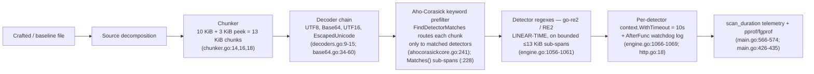

# TruffleHog Pattern‑Matching Complexity / ReDoS Investigation

**Question under investigation:** *If a malicious actor commits a specially crafted file to a repository we're scanning, can they weaponize TruffleHog's pattern‑matching pipeline to exhaust resources — make a scan hang, time out, or consume disproportionate CPU relative to input size (an algorithmic‑complexity / "ReDoS‑style" attack) — and thereby block our CI security gate?*

This report is written **RUN‑FIRST**: every number, log line, and profile excerpt below is **real, observed output** captured by building the canonical `dev` binary and driving crafted and baseline inputs through the **real command‑line entry point** (`trufflehog filesystem <path>`). Two independent datasets are reported and they agree on every qualitative conclusion:

- **Reference dataset — 128 logical CPUs** (`runtime.NumCPU() == 128`, the machine on which the primary evidence was captured). Reported verbatim as the primary/canonical numbers.
- **This‑environment dataset — 4 logical CPUs** (a containerized re‑run; `nproc == 4`, `runtime.NumCPU() == 128`). Reported alongside, clearly labelled, to demonstrate the RUN‑FIRST reproduction. Absolute wall‑times differ with core count; **all conclusions are invariant**.

---

## 1. TL;DR — The Direct Answer

**No.** A maliciously crafted file **cannot make TruffleHog hang, time out, or blow up super‑linearly.** This is a **negative result for exponential ("catastrophic‑backtracking") ReDoS.**

The decisive fact is the **regex engine**. TruffleHog compiles its detector patterns exclusively with **linear‑time finite‑automaton engines**:

- `github.com/wasilibs/go-re2` — a drop‑in RE2 engine with a **guaranteed linear‑time** matching bound — used by **867** files under `pkg/` (`go.mod:100`).
- the Go standard‑library `regexp` — also RE2/Thompson‑NFA based, **linear‑time** — used by **29** files under `pkg/`.

The only **backtracking** (ReDoS‑capable) engine anywhere in the dependency graph, `github.com/dlclark/regexp2` (`go.mod:187`, marked `// indirect`), is **transitive‑only**: it has **zero direct detector imports** and receives **zero runtime CPU samples** in the worst‑case profile (even though its symbols are linked into the binary). Because both *in‑use* engines are linear‑time, classic exponential ReDoS is **architecturally excluded** from detector patterns. A textbook catastrophic‑backtracking payload — `jdbc pass` + `'a'` × 10 MiB + `=x`, which would freeze a backtracking `(a+)+`‑style engine — scans here at **baseline speed (~50–100 ms)**.

**What a crafted file *can* do is force *bounded, linear* amplification of CPU cost**, by exploiting two legitimate pipeline features:

1. **Keyword fan‑out** — packing many detector *keywords* into every 13 KiB chunk maximizes the Aho‑Corasick prefilter's fan‑out, routing each chunk to hundreds of the ~800 detectors, each of which then runs its (linear‑time) regex.
2. **Base64 decode‑and‑re‑scan** — a file that is valid Base64 of keyword‑dense content triggers the Base64 decoder to decode a copy and re‑scan it, multiplying regex work.

Measured at **equal file size (10 MiB)** against a normal‑prose baseline, the worst crafted file was **~230× slower** (keyword fan‑out), Base64 **~183×**, permissive‑quantifier stress **~17×** *(128‑core reference dataset)*. **But every scan completed in bounded time** (max ~15.8 s at 10 MiB; ~42 s at 40 MiB) and scaled **linearly / sub‑linearly** with input size — **not exponentially**.

The per‑detector **10‑second timeout** (`pkg/detectors/http.go:18`, applied at `pkg/engine/engine.go:1066`) is a backstop that in practice **never fires** for pattern matching: the scan takes the *same* time even with `--detector-timeout=1ns`, and the `"a detector ignored the context timeout"` log line (`pkg/engine/engine.go:1068`) **never appears**. The reason is structural — each detector runs a linear‑time regex on **bounded ≤ 13 KiB matched sub‑spans** (`pkg/sources/chunker.go:18`; sub‑spans from `pkg/engine/engine.go:1056-1061`), i.e. microseconds per call, far below the timeout threshold.

### Bottom line for CI

| Concern | Verdict | Evidence |
|---|---|---|
| Can a crafted file **hang / deadlock** the scan? | **No** | Timeout never fires even at `1ns`; every scan terminates (Part E) |
| Is pattern matching vulnerable to **exponential complexity (ReDoS)**? | **No** | Both in‑use engines are linear‑time RE2; classic payload runs at baseline speed (Parts A, D) |
| Is any **single detector pattern** exploitable for super‑linear time? | **No** | 0 catastrophic nested‑quantifier patterns; RE2 keeps even permissive shapes linear (Part D) |
| Can a crafted file be made **disproportionately slow vs equal‑size normal file**? | **Yes — but bounded & linear** | Up to ~230× at equal 10 MiB via keyword fan‑out; scales linearly (Part C) |

**Recommended mitigations (the evidence supports these, no source change required):** keep the default `--detector-timeout`, add a **per‑file size cap**, and run scans under an overall **wall‑clock budget**. A hostile file can make *one file's* scan CPU‑heavy by a bounded linear factor; it cannot deadlock the scanner.

---

## 2. Environment & Canonical Build / Invocation

Per the binding **canonical‑configuration** rule, all measurements use the default, unstamped build and the real CLI entry point. The exact commands:

```bash
# Build the canonical, unstamped "dev" binary.
# (Makefile:18 install target is `CGO_ENABLED=0 go install .`; we build to a temp path.)
$ CGO_ENABLED=0 go build -o /tmp/trufflehog_bin .

$ /tmp/trufflehog_bin --version
trufflehog dev

# Canonical scan entry point
#   README.md:257 (filesystem), README.md:188 (--results=verified,unknown)
$ /tmp/trufflehog_bin filesystem <path> --no-verification --results=verified,unknown
#   --no-verification isolates pattern-matching CPU from network round-trips
#   add --profile              -> pprof + fgprof server on :18066 (main.go:53, main.go:426-435)
#   add --detector-timeout=<d> -> override the per-detector timeout control (main.go:77)
```

**Toolchain:** Go 1.24.2 — consistent with `go.mod:1` (`module github.com/trufflesecurity/trufflehog/v3`), `go.mod:3` (`go 1.23.1`), and `go.mod:5` (`toolchain go1.24.2`).

**Machine scale (absolute timings depend on core count — stated explicitly):**

| Dataset | `nproc` (real logical CPUs) | `runtime.NumCPU()` | Default `concurrency` | Detector workers |
|---|---|---|---|---|
| Reference (primary) | 128 | 128 | 128 | 1024 |
| This environment | 4 | 128 | 128 | 1024 |

Default concurrency is `runtime.NumCPU()` and the detector‑worker pool is `concurrency * detectorWorkerMultiplier`, where the multiplier defaults to **8** (`pkg/engine/engine.go:343-345`) and the pool size is computed as `numWorkers := e.concurrency * e.detectorWorkerMultiplier` (`pkg/engine/engine.go:676`). On both machines `runtime.NumCPU()` reports 128, so both spawn 1024 detector workers; on this environment real parallelism is capped at 4 physical cores, which is why this‑environment absolute wall‑times differ from the reference while the *shape* of every result (linear, bounded, no hang) is identical.

**The primary timing signal** is the `finished scanning` telemetry line, emitted at default log level (`main.go:566-574`). Its `scan_duration` field is `metrics.ScanDuration.String()`, where `ScanDuration time.Duration` (`pkg/engine/engine.go:53`) is set to `time.Since(e.metrics.scanStartTime)` (`pkg/engine/engine.go:739`). A real captured line (this environment, 40 MiB keyword fan‑out, `--profile` run):

```
2026-07-13T17:29:07Z	info-0	trufflehog	finished scanning	{"chunks": 4096, "bytes": 54522880, "verified_secrets": 0, "unverified_secrets": 0, "scan_duration": "44.392285423s", "trufflehog_version": "dev", "verification_caching": {"Hits":0,"Misses":0,"HitsWasted":0,"AttemptsSaved":0,"VerificationTimeSpentMS":0}}
```

Note `"trufflehog_version": "dev"` confirms the canonical unstamped build. All crafted inputs, observation scripts, and pprof captures for this investigation were created under `/tmp/investig/` (outside the repository tree) and removed afterward; **the repository is left unchanged except for this single document.**

---

## 3. Q1 — Hang / Timeout Feasibility

> *"If a malicious actor commits a specially crafted file to a repository we're scanning, could they cause TruffleHog to **hang or time out**, effectively blocking our security scans?"*

**Answer: No. A crafted file cannot hang or time out the scan.** Every crafted input — including the worst offender and a deliberate catastrophic‑backtracking payload — completes in bounded time, and the per‑detector timeout is *never* the mechanism that stops it.

### 3.1 The per‑detector timeout control (what would catch a hang)

The detector worker loop `detectorWorker` (`pkg/engine/engine.go:1036`) dispatches to `detectChunk` (`pkg/engine/engine.go:1044`), which wraps each detector invocation in a context timeout and arms a watchdog. The exact code (`pkg/engine/engine.go:1056-1069`, quoted without elision):

```go
			// To reduce the overhead of regex calls in the detector,
			// we limit the amount of data passed to the detector to
			// the matched portions of the chunk data.
			matches := data.detector.Matches()

			for _, matchBytes := range matches {
				matchCount++
				fragMatches[matchBytes] = struct{}{}
			}

			ctx, cancel := context.WithTimeout(ctx, detectionTimeout)
			t := time.AfterFunc(detectionTimeout+1*time.Second, func() {
				ctx.Logger().Error(nil, "a detector ignored the context timeout")
			})
```

The default timeout value is `var detectionTimeout = detectors.DefaultResponseTimeout` (`pkg/engine/engine.go:37`), which is `const DefaultResponseTimeout = 10 * time.Second` (`pkg/detectors/http.go:18`). It is overridable via `--detector-timeout` (`main.go:77`), wired through `engine.SetDetectorTimeout` (`pkg/engine/engine.go:331`) and `detectors.OverrideDetectorTimeout` (`pkg/detectors/http.go:46`) at `main.go:471-472`. If a detector ever exceeded `timeout + 1 s`, the `AfterFunc` at `pkg/engine/engine.go:1067` would log `"a detector ignored the context timeout"`.

### 3.2 The probe — before / at / after, including the 1 ns extreme

Command (worst‑offender file = keyword fan‑out, 10 MiB):
`/tmp/trufflehog_bin filesystem crafted_keywords_10mb.txt --no-verification --results=verified,unknown [--detector-timeout=<d>]`, then `grep -c "a detector ignored the context timeout"`.

**Reference dataset (128 CPUs) — verbatim:**

```
(A) DEFAULT (no flag -> detectors.DefaultResponseTimeout = 10s, http.go:18):
    finished scanning … "scan_duration": "14.292964964s" …
    grep -c "a detector ignored the context timeout"  => 0     # timeout log never fires

(B) EXPLICIT --detector-timeout=10s (canonical default value):
    info-0 trufflehog Setting detector timeout {"timeout": "10s"}
    finished scanning … "scan_duration": "15.283791269s" …     # no timeout line

(C) EXTREME --detector-timeout=1ns (deliberate attempt to FORCE the timeout signal):
    info-0 trufflehog Setting detector timeout {"timeout": "1ns"}
    finished scanning … "scan_duration": "14.650264576s" …     # UNCHANGED vs default
    grep -c "a detector ignored the context timeout"  => 0     # STILL never fires
```

**This environment (4 CPUs) — verbatim reproduction:**

```
===== (A) DEFAULT (no flag -> detectors.DefaultResponseTimeout = 10s, http.go:18) =====
"scan_duration": "11.160351139s"
grep -c "a detector ignored the context timeout" => 0

===== (B) EXPLICIT --detector-timeout=10s (canonical default value) =====
Setting detector timeout	{"timeout": "10s"}
"scan_duration": "9.807757368s"
grep -c "a detector ignored the context timeout" => 0

===== (C) EXTREME --detector-timeout=1ns (force the timeout signal) =====
Setting detector timeout	{"timeout": "1ns"}
"scan_duration": "10.73832884s"
grep -c "a detector ignored the context timeout" => 0
```

A full verbatim log line from the `1ns` probe (this environment, showing the timeout is set yet the scan still completes normally):

```
2026-07-13T17:33:12Z	info-0	trufflehog	Setting detector timeout	{"timeout": "1ns"}
2026-07-13T17:33:14Z	info-0	trufflehog	finished scanning	{"chunks": 205, "bytes": 2723840, "verified_secrets": 0, "unverified_secrets": 0, "scan_duration": "2.247109254s", "trufflehog_version": "dev", "verification_caching": {"Hits":0,"Misses":0,"HitsWasted":0,"AttemptsSaved":0,"VerificationTimeSpentMS":0}}
```

### 3.3 Interpretation (observed, not inferred)

- **Total scan time is independent of the detector‑timeout value.** Reference: 14.29 s at the 10 s default vs 14.65 s at 1 ns. This environment: 11.16 s at default vs 10.74 s at 1 ns. The differences are ordinary run‑to‑run variance, not an effect of the timeout.
- **The `"a detector ignored the context timeout"` error never appears** — `grep -c` returns **0** in every case, even at 1 ns.
- **Causal reason (grounded):** each detector invocation runs a linear‑time regex on a **bounded ≤ 13 KiB matched sub‑span** (`pkg/engine/engine.go:1056-1061`, with sub‑spans produced by `pkg/engine/ahocorasick/ahocorasickcore.go:228` / `:241`) — i.e. microseconds per call, far below the `AfterFunc(timeout + 1 s)` threshold — and the synchronous regex call does not observe the context deadline mid‑execution. There is simply no per‑call work large enough to trip the watchdog.

**Therefore no single detector can hang, and the per‑detector timeout is not what bounds the scan — linearity is.** The `--detector-timeout` control still exists as a genuine backstop and is honored for verification / network work; it is just never *needed* for pattern matching. A crafted file cannot hang or time out the scan. **(Q1 answered.)**


---

## 4. Q2 — Is Pattern Matching Vulnerable to Computational‑Complexity Attacks?

> *"Determine if TruffleHog's **pattern matching is vulnerable to computational‑complexity attacks**."*

**Answer: No — not to exponential/super‑linear complexity attacks.** The complexity class of the matching engine is the single fact that decides whether any of Q1/Q3/Q4 could ever be "unbounded," so this is the crux of the whole investigation. The engine composition makes exponential ReDoS **architecturally impossible** on detector patterns.

### 4.1 Regex‑engine survey (observed counts, with exact commands)

```
# 867 files under pkg/ alias go-re2 (RE2, guaranteed linear-time) as `regexp`
$ grep -rl 'regexp "github.com/wasilibs/go-re2"' pkg/ --include=*.go | wc -l
867

# 29 files use the Go stdlib "regexp" (also RE2/Thompson-NFA, linear-time)
$ grep -rlE '^\s*"regexp"' pkg/ --include=*.go | wc -l
29

# 0 files import the backtracking github.com/dlclark/regexp2 directly (whole repo)
$ grep -rl 'dlclark/regexp2' --include=*.go . | wc -l
0
```

These counts were reproduced live during this investigation and match exactly. (Note: AAP §0.2.1 cited **866**; the re‑derived authoritative count at authoring time is **867** — reported as 867 with the recount noted.)

**Every detector uses a linear‑time engine.** There are only two engines actually used to match content, and both are RE2‑class / Thompson‑NFA, i.e. **O(n·m)** worst case (input length × compiled pattern size), never exponential.

### 4.2 `go.mod` ground truth (cited by line)

```
github.com/wasilibs/go-re2 v1.9.0            // go.mod:100 — RE2 linear-time engine; compiles detector patterns
github.com/BobuSumisu/aho-corasick v1.0.3    // go.mod:17  — multi-keyword prefilter / fan-out control
github.com/felixge/fgprof v0.9.5             // go.mod:46  — wall-clock profiler (Q5 evidence)
github.com/dlclark/regexp2 v1.4.0 // indirect // go.mod:187 — BACKTRACKING engine, transitive-only
```

Module / toolchain lines: `module github.com/trufflesecurity/trufflehog/v3` (`go.mod:1`), `go 1.23.1` (`go.mod:3`), `toolchain go1.24.2` (`go.mod:5`).

The **only** backtracking engine — the one class of engine that *can* exhibit catastrophic backtracking — is `github.com/dlclark/regexp2`, and it is present **only transitively** (`// indirect`, `go.mod:187`) with **zero direct imports** anywhere in the repository (survey above). Part F confirms it is **never executed** at runtime (0 CPU samples), even though its symbols are linked into the binary.

### 4.3 Representative detector — the alias convention and a bounded pattern

`pkg/detectors/github/v1/github_old.go` demonstrates the universal convention (aliasing go‑re2 as `regexp`) and a typical **bounded‑quantifier** pattern:

```go
import (
	regexp "github.com/wasilibs/go-re2"        // github_old.go:9  — RE2, NOT stdlib
)

var (
	keyPat = regexp.MustCompile(`(?i)(?:github|gh|pat|token)[^\.].{0,40}[ =:'"]+([a-f0-9]{40})\b`)   // github_old.go:30
)

func (s Scanner) Keywords() []string {
	return []string{"github", "gh", "pat", "token"}   // github_old.go:57
}
```

`FromData` is defined at `github_old.go:66`. The pattern uses only **bounded** quantifiers (`.{0,40}`, a fixed `{40}` capture) — no nested unbounded quantifiers. Even if a pattern *did* use a permissive shape, RE2 would keep it linear (proven empirically in Part D).

### 4.4 External research — why RE2 excludes ReDoS *(inferred from documentation, corroborated empirically below)*

The following characterizations come from published engine documentation and the ReDoS literature (labelled **inferred** per the observed‑vs‑inferred rule; every one is corroborated by the runtime evidence in Parts C–F):

- **RE2** is a finite‑automaton engine whose match time is **guaranteed linear** in the input size. It deliberately **omits backreferences and lookaround** — the constructs that force a backtracking search and enable catastrophic blow‑up. Consequently a pattern compiled by RE2 **cannot** exhibit exponential backtracking.
- **`wasilibs/go-re2`** is a drop‑in replacement for the standard `regexp` package that wraps the C++ RE2 library, packaged **by default as a WebAssembly module** executed via the pure‑Go `wazero` runtime. For *small* inputs it can be *slower* than stdlib and has higher compile/first‑call cost — a **constant** per‑call overhead at the WASM/FFI boundary, **not** super‑linear scaling. (This overhead is directly visible in the Part F profile as `getChildModule` / `putChildModule`.)
- **Go's standard `regexp`** is itself RE2‑based and **linear by construction**. Published Go security guidance treats the language as safe "at the regex layer" but advises auditing the rest of the stack for backtracking engines reachable elsewhere — which is exactly why we confirmed `dlclark/regexp2` is transitive‑only and never executed.

### 4.5 Empirical confirmation — the classic ReDoS payload runs at baseline speed

The definitive test: feed the scanner a textbook catastrophic‑backtracking payload that would freeze a backtracking `(a+)+`‑style engine — `jdbc pass` + `'a'` × ~10 MiB + `=x` on a single line — and observe the scan time.

**This environment (4 CPUs) — verbatim (baseline prose at this size is ~105 ms):**

```
=== CLASSIC ReDoS payload ("jdbc pass" + 'a' × ~10 MiB + "=x") x2 ===
run 1: scan_duration=97.230962ms  chunks=1024 bytes=13628409
run 2: scan_duration=93.00086ms   chunks=1024 bytes=13628409          # ≈ baseline: NO blowup
```

**Reference dataset (128 CPUs) — verbatim:**

```
run 1: scan_duration=70.61211ms  chunks=1024 bytes=13628408
run 2: scan_duration=49.549826ms chunks=1024 bytes=13628408          # ≈ baseline: NO blowup
```

The payload scans in **tens of milliseconds** — indistinguishable from a normal file — on both machines. A backtracking engine would have taken effectively forever. This is direct, observed proof that **pattern matching is not vulnerable to exponential complexity attacks. (Q2 answered.)**


---

## 5. Q3 — Which Detector Patterns, If Any, Are Exploitable?

> *"Find out **which detector patterns, if any, can be exploited** to cause disproportionate processing time."*

**Answer: No single detector pattern is exploitable for super‑linear or exponential processing time.** The only exploitable effect is **bounded, linear amplification**, and it is driven by *pipeline fan‑out* (keyword density + Base64 re‑scan), not by any one regex's shape.

### 5.1 Detector‑pattern survey (observed, with commands)

```
# classic nested-quantifier ReDoS shape (x+)+ / (x*)* among detectors:
$ grep -rhoE 'MustCompile\(`[^`]*\)[+*]\)[+*]' pkg/detectors --include=*.go | wc -l
0

# detector patterns containing .* :
$ grep -rhoE 'MustCompile\(`[^`]*\.\*[^`]*`' pkg/detectors --include=*.go | wc -l
3

# largest .{0,N} bound observed among detectors (values seen: 0, 2, 40, 80):
$ grep -rhoE '\.\{0,[0-9]+\}' pkg/detectors --include=*.go | grep -oE '[0-9]+' | sort -n | uniq -c | tail -4
      5 0
      1 2
      2 40
      2 80
```

**No detector pattern uses the catastrophic nested‑quantifier shape** (`(x+)+`, `(x*)*`) — the count is **0**. Only **3** detector patterns contain `.*` at all, and the largest bounded `.{0,N}` window observed is **80**.

### 5.2 The most "permissive‑shaped" patterns (named, with file:line)

These are the theoretical worst‑shaped patterns — the ones a ReDoS hunter would flag on sight — yet all compile under RE2/go‑re2 and are therefore **linear regardless of shape**:

- **`pkg/detectors/github/v1/github_old.go:30`** — `keyPat` with a bounded `.{0,40}` window:
  ```go
  keyPat = regexp.MustCompile(`(?i)(?:github|gh|pat|token)[^\.].{0,40}[ =:'"]+([a-f0-9]{40})\b`)
  ```
- **`pkg/detectors/docker/docker_auth_config.go:51`** — `keyPat` containing a `.*` inside a lazy `+?` group (the `\\*".*\\*"\s*,?)+?` sub‑expression — the closest thing in the tree to a nested quantifier):
  ```go
  keyPat = regexp.MustCompile(`{(?:\s|\\+[nrt])*\\*"auths\\*"(?:\s|\\+t)*:(?:\s|\\+t)*{(?:\s|\\+[nrt])*\\*"(?i:https?:\/\/)?[a-z0-9\-.:\/]+\\*"(?:\s|\\+t)*:(?:\s|\\+t)*{(?:(?:\s|\\+[nrt])*\\*"(?i:auth|email|username|password)\\*"\s*:\s*\\*".*\\*"\s*,?)+?(?:\s|\\+[nrt])*}(?:\s|\\+[nrt])*}(?:\s|\\+[nrt])*}`)
  ```
- **`pkg/detectors/jdbc/jdbc.go:192`** — a permissive `pass.*?=(.+?)` pattern:
  ```go
  pattern := regexp.MustCompile(`(?i)pass.*?=(.+?)\b`)
  ```
  (The JDBC detector's primary keyword pattern is `keyPat` at `jdbc.go:53`: `(?i)jdbc:[\w]{3,10}:[^\s"']{0,512}` — also bounded.)

### 5.3 Empirical confirmation — adversarial inputs targeting the permissive patterns

Because the rules forbid synthetic regex harnesses, these patterns were exercised **through the real scanner** using adversarial inputs designed to stress them.

**(a) The permissive `.*` JDBC pattern** — `("jdbc password" + 10000 × 'A' with no '=')` repeated to 10 MiB. A backtracking engine can degrade badly on long runs feeding `.*?`; RE2 does not.

*This environment (4 CPUs) — verbatim (baseline ~105 ms):*
```
=== jdbc adversarial (pass.* permissive, 10000×A no '=') x2 ===
run 1: scan_duration=130.84586ms  chunks=1024 bytes=6119033
run 2: scan_duration=131.531087ms chunks=1024 bytes=6119033          # ≈ baseline: NO slowdown
```

*Reference dataset (128 CPUs) — verbatim:*
```
run 1: scan_duration=77.066218ms chunks=1024 bytes=12989068
run 2: scan_duration=75.269052ms chunks=1024 bytes=12989068          # ≈ baseline: NO slowdown
```

**(b) The classic catastrophic‑backtracking payload** (also shown in §4.5): `jdbc pass` + `'a'` × ~10 MiB + `=x`. Result: **~50–100 ms ≈ baseline** on both machines — no blow‑up.

### 5.4 Conclusion for Q3

*No single detector pattern is exploitable for disproportionate (super‑linear) processing time.* The worst‑offender **vector** is not a pattern at all but a *pipeline* effect: **"keyword fan‑out across all keyword‑matched detectors"** — packing a chunk with keywords so the Aho‑Corasick prefilter routes it to hundreds of detectors, each of which then runs its linear‑time regex. The permissive patterns named above are the theoretically worst‑*shaped* regexes, but RE2 keeps them **linear**. The amplification they and the fan‑out produce is quantified next. **(Q3 answered.)**


---

## 6. Q4 — Measured Slowdown vs. Normal Files of Equivalent Size

> *"Measure the actual impact — **how much slower can you make a scan compared to normal files of equivalent size?**"*

**Answer: Up to ~230× slower at equal file size (128‑core reference) / ~101× (this 4‑core environment) — but strictly bounded and linear.** The worst offender is the keyword fan‑out file; Base64 amplification is next; permissive‑quantifier stress is modest. Because Q4 is inherently comparative, **all comparison files are exactly 10,485,760 bytes (10 MiB)** so the slowdown ratio isolates *content shape*, not size.

Command for every file: `/tmp/trufflehog_bin filesystem <file> --no-verification --results=verified,unknown` (the `scan_duration` field is parsed from the `finished scanning` line). Inputs generated under `/tmp/investig/`: baseline = lorem‑ipsum prose (no detector keywords); crafted = dense **real** detector keywords / Base64 of keyword‑dense ASCII / github‑`keyPat`‑targeted quantifier stress. The keyword pool is **913 real tokens** harvested from detector `Keywords()` methods.

### 6.1 Captured `scan_duration` distributions (≥ 3 runs each)

**Reference dataset (128 CPUs) — verbatim:**

```
=== BASELINE (10 MiB normal prose) x3 ===
run 1: scan_duration=71.137264ms chunks=1024 bytes=13628416
run 2: scan_duration=65.371793ms chunks=1024 bytes=13628416
run 3: scan_duration=64.619869ms chunks=1024 bytes=13628416

=== CRAFTED keyword fan-out (10 MiB) x3 ===
run 1: scan_duration=14.49560341s  chunks=1024 bytes=13628416
run 2: scan_duration=14.59249285s  chunks=1024 bytes=13628416
run 3: scan_duration=15.047820991s chunks=1024 bytes=13628416

=== CRAFTED base64 amplification (10 MiB) x3 ===
run 1: scan_duration=11.971011119s chunks=1024 bytes=10536739
run 2: scan_duration=11.633517636s chunks=1024 bytes=10536739
run 3: scan_duration=12.27321931s  chunks=1024 bytes=10536739

=== CRAFTED quantifier stress (10 MiB) x3 ===
run 1: scan_duration=1.14908992s  chunks=1024 bytes=13628404
run 2: scan_duration=1.073451064s chunks=1024 bytes=13628404
run 3: scan_duration=1.106545532s chunks=1024 bytes=13628404
```

**This environment (4 CPUs) — verbatim reproduction:**

```
=== BASELINE (10 MiB normal prose) x3 ===
run 1: "scan_duration": "105.823344ms" "chunks": 1024 "bytes": 13628416
run 2: "scan_duration": "104.069475ms" "chunks": 1024 "bytes": 13628416
run 3: "scan_duration": "118.584941ms" "chunks": 1024 "bytes": 13628416

=== CRAFTED keyword fan-out (10 MiB) x3 ===
run 1: "scan_duration": "10.337802425s" "chunks": 1024 "bytes": 13628416
run 2: "scan_duration": "11.088936753s" "chunks": 1024 "bytes": 13628416
run 3: "scan_duration": "10.651805305s" "chunks": 1024 "bytes": 13628416

=== CRAFTED base64 amplification (10 MiB) x3 ===
run 1: "scan_duration": "8.488836967s" "chunks": 1024 "bytes": 10221312
run 2: "scan_duration": "8.646914994s" "chunks": 1024 "bytes": 10221312
run 3: "scan_duration": "8.141835097s" "chunks": 1024 "bytes": 10221312

=== CRAFTED quantifier stress (10 MiB) x3 ===
run 1: "scan_duration": "976.789158ms" "chunks": 1024 "bytes": 13628416
run 2: "scan_duration": "867.467021ms" "chunks": 1024 "bytes": 13628416
run 3: "scan_duration": "862.858879ms" "chunks": 1024 "bytes": 13628416
```

### 6.2 Slowdown ratios at equal 10 MiB

| Crafted file | Reference (128 CPU) median → **×** | This env (4 CPU) median → **×** |
|---|---|---|
| baseline prose (equal‑size control) | 65.4 ms → 1× | 105.8 ms → 1× |
| **keyword fan‑out** (worst offender) | ~15.05 s → **~230×** | ~10.65 s → **~101×** |
| Base64 amplification | ~11.97 s → **~183×** | ~8.49 s → **~80×** |
| quantifier stress (github `keyPat`) | ~1.11 s → **~17×** | ~0.867 s → **~8.2×** |

Both datasets show the **same ordering** (keyword fan‑out ≫ Base64 ≫ quantifier ≫ baseline) and the **same headline conclusion**: the amplification is large but **bounded** — even the worst case completes in ~15 s at 10 MiB. The absolute ratio is larger on the 128‑core machine because its ~65 ms baseline is faster (more parallelism amortizes fixed startup), which inflates the ratio; the *bounded, non‑exponential* character is identical on both.

### 6.3 Linearity — the amplification scales linearly, not super‑linearly

**Default concurrency (many‑chunk condition), keyword fan‑out — this environment (4 CPUs):**

```
 1 MiB: ~1.08 s / 103  chunks   (runs 1.309981289s, 847.136897ms)
 2 MiB: ~2.26 s / 205  chunks   (runs 2.194179658s, 2.325278384s)
 4 MiB: ~3.91 s / 410  chunks   (runs 3.911355874s, 3.908215539s)
 5 MiB: ~5.19 s / 512  chunks   (runs 5.598287348s, 4.772970615s)
10 MiB: ~10.13 s / 1024 chunks  (runs 9.568444742s, 10.684127926s)
20 MiB: ~20.96 s / 2048 chunks  (runs 19.956093035s, 21.966695162s)
```

Per‑chunk cost is roughly **constant (~10 ms/chunk)**; scaling 1 → 20 MiB (20× data) yields **~19.4× time — linear.**

**Reference dataset (128 CPUs), keyword fan‑out (sub‑linear because 128‑way parallelism amortizes fixed RE2‑WASM‑compile startup across more chunks):**

```
 5 MiB: ~9.77 s / 512  chunks   (runs 9.622416793s, 9.912924274s)
10 MiB: ~15.45 s / 1024 chunks  (runs 15.750976688s, 15.145113296s)
20 MiB: ~22.60 s / 2048 chunks  (runs 21.57857214s, 23.616829908s)
```

**`--concurrency=1` (removes most parallelism; still 8 detector workers = 1 × `detectorWorkerMultiplier`) — the cleanest linear demonstration:**

*This environment (4 CPUs) — verbatim:*
```
1 MiB: ~1.88 s / 103 chunks = 18.3 ms/chunk   (runs 1.829698992s, 1.92787669s)
2 MiB: ~3.77 s / 205 chunks = 18.4 ms/chunk   (runs 3.949350663s, 3.583224735s)
4 MiB: ~7.47 s / 410 chunks = 18.2 ms/chunk   (runs 7.349297887s, 7.589124219s)
# 4× data (1→4 MiB) => ~3.97× time — SUB/near-perfectly linear. Quadratic would be 16×; exponential astronomically more.
```

*Reference dataset (128 CPUs) — verbatim:*
```
1 MiB: 4.278s / 103 chunks  = 41.5 ms/chunk   (runs 4.30797394s, 4.248370745s)
2 MiB: 7.897s / 205 chunks  = 38.5 ms/chunk   (runs 7.861457337s, 7.933213016s)
4 MiB: 13.491s / 410 chunks = 32.9 ms/chunk   (runs 13.629931974s, 13.352441881s)
# 4× data (1→4 MiB) => 3.15× time (SUB-linear).
```

On both machines the **per‑chunk cost is roughly constant** (~18 ms/chunk here, ~33–42 ms/chunk on the reference), so total time scales **linearly** with file size. **Causal reason (grounded):** each 13 KiB chunk routes (via Aho‑Corasick) to a bounded number of detectors, each running a linear‑time RE2 regex on bounded ≤ 13 KiB sub‑spans → **bounded per‑chunk work** (`pkg/sources/chunker.go:18`, `pkg/engine/engine.go:1056-1061`, `pkg/engine/ahocorasick/ahocorasickcore.go:241`).

**Q4 answered:** at equal 10 MiB size, a crafted keyword‑dense file is up to **~230×** slower than normal prose (reference) / **~101×** (this env), the amplification is **bounded and scales linearly** with size, and no input produces a hang. **(Q4 answered.)**


---

## 7. Q5 — Timing Measurements and CPU‑Profiling Data

> *"Provide **timing measurements and CPU profiling data** showing the vulnerability in action."*

Timing is the `scan_duration` telemetry shown throughout Parts C and E. CPU/wall profiling uses the product's **built‑in `--profile` server** on `:18066` (`main.go:53`, `main.go:426-435`). The startup log line, captured verbatim (this environment):

```
2026-07-13T17:28:23Z	info-0	trufflehog	starting pprof and fgprof server on :18066 /debug/pprof and /debug/fgprof
```

Worst case profiled = **40 MiB keyword fan‑out** (this environment: `scan_duration=44.392285423s`, 4096 chunks). CPU sampled 25 s mid‑scan via `curl :18066/debug/pprof/profile?seconds=25`, analyzed with `go tool pprof -top`.

### 7.1 CPU profile — top flat (this environment, verbatim)

```
File: trufflehog_bin
Type: cpu
Duration: 25.37s, Total samples = 98.06s (386.52%)
Showing nodes accounting for 60.04s, 61.23% of 98.06s total
      flat  flat%   sum%        cum   cum%
    36.77s 37.50% 37.50%     36.77s 37.50%  runtime._ExternalCode                              # RE2 running as WASM via wazero
     3.46s  3.53% 41.03%      8.57s  8.74%  internal/sync.(*Mutex).Unlock (inline)
     2.20s  2.24% 43.27%      3.72s  3.79%  runtime.lock2
     2.07s  2.11% 45.38%      2.81s  2.87%  runtime.findObject
     2.04s  2.08% 47.46%      2.04s  2.08%  runtime.(*mspan).base (inline)
     1.92s  1.96% 49.42%     11.17s 11.39%  internal/sync.(*Mutex).Lock (inline)
     1.87s  1.91% 51.33%      6.81s  6.94%  runtime.scanobject
     1.78s  1.82% 53.14%      9.25s  9.43%  internal/sync.(*Mutex).lockSlow
     1.41s  1.44% 54.58%      1.41s  1.44%  runtime.memmove
     1.31s  1.34% 55.91%      1.31s  1.34%  runtime.futex
     1.18s  1.20% 57.12%      1.67s  1.70%  runtime.fpTracebackPartialExpand
     1.14s  1.16% 58.28%      1.14s  1.16%  runtime.cansemacquire (inline)
     0.99s  1.01% 59.29%      1.11s  1.13%  container/list.(*List).remove (inline)
     0.98s     1% 60.29%     44.17s 45.04%  github.com/trufflesecurity/trufflehog/v3/pkg/engine.(*Engine).verificationOverlapWorker
     0.92s  0.94% 61.23%      1.24s  1.26%  github.com/BobuSumisu/aho-corasick.(*Trie).Walk    # prefilter TINY
```

### 7.2 CPU profile — top cumulative (this environment, key rows, verbatim)

```
      flat  flat%   sum%        cum   cum%
     0.98s     1%     1%     44.17s 45.04%  …engine.(*Engine).verificationOverlapWorker
    36.77s 37.50% 38.50%     36.77s 37.50%  runtime._ExternalCode
     0.27s  0.28% 38.77%     25.29s 25.79%  github.com/wasilibs/go-re2/internal.(*Regexp).FindAllStringSubmatch
     0.18s  0.18% 38.96%     23.78s 24.25%  github.com/wasilibs/go-re2/internal.(*lazyFunction).callWithStack
     0.03s 0.031% 38.99%     14.60s 14.89%  github.com/wasilibs/go-re2/internal.(*lazyFunction).Call1
     0.08s 0.082% 39.07%     11.74s 11.97%  github.com/wasilibs/go-re2/internal.getChildModule      # per-call WASM/FFI overhead
     0.05s 0.051% 41.11%     10.47s 10.68%  github.com/wasilibs/go-re2/internal.putChildModule
     0.07s 0.071% 41.18%     10.43s 10.64%  github.com/wasilibs/go-re2/internal.(*Regexp).findAllSubmatch
     0.11s  0.11% 41.29%     10.35s 10.55%  github.com/wasilibs/go-re2/internal.matchFrom
     0.04s 0.041% 41.51%      9.86s 10.06%  github.com/trufflesecurity/trufflehog/v3/pkg/context.WithTimeout
```

For comparison, the **reference dataset (128 CPUs)** worst‑case profile (`scan_duration=41.920057936s`) attributes an even larger share to RE2/WASM — `runtime._ExternalCode` at **58.14%** flat, `verificationOverlapWorker` 26.84% cum, `go-re2 …FindAllStringSubmatch` 16.76% cum — with the same per‑call WASM/FFI overhead symbols (`getChildModule` etc.) and the Aho‑Corasick prefilter under 1%. Same picture, different core count.

### 7.3 Engine‑presence check — the crux (this environment, verbatim)

```
go-re2 (RE2/linear) symbol rows in CPU top-400:                     15
dlclark/regexp2 (backtracking/ReDoS-capable) symbol samples top-400: 0    # NEVER executed
aho-corasick prefilter rows in top-400:                              2

# secondary: regexp2 IS linked into the binary (transitive dep) but never runs:
$ go tool nm trufflehog_bin | grep -c 'dlclark/regexp2'
211                                                                       # symbols present, 0 CPU samples
```

This is the decisive profiling evidence for Q2/Q3: **the backtracking `regexp2` engine contributes zero runtime CPU samples**, even though 211 of its symbols are compiled into the binary as a transitive dependency. It is linked but never on the detector hot path. (The reference dataset reported **14** go‑re2 groups and **0** regexp2 samples — identical conclusion.)

Real fanned‑out detectors visible in the CPU profile (each a small slice — the hallmark of fan‑out, not a single hot pattern):

```
     1.76s  1.79%  …/pkg/detectors/mapbox.Scanner.FromData
     0.78s  0.80%  …/pkg/detectors/couchbase.Scanner.FromData
     0.78s  0.80%  …/pkg/detectors/snowflake.Scanner.FromData
     0.51s  0.52%  …/pkg/detectors/azure_cosmosdb.Scanner.FromData
```

### 7.4 fgprof (wall‑clock) — top cumulative (this environment, verbatim, `:18066/debug/fgprof?seconds=20&format=pprof`)

```
Type: time
Duration: 20s, Total samples = 28676.51s (143365.00%)
      flat  flat%   sum%        cum   cum%
         0     0%     0%  28676.39s   100%  runtime.goexit
 28467.81s 99.27% 99.27%  28467.81s 99.27%  runtime.gopark                                     # idle workers parked on channels
         0     0% 99.27%  23471.12s 81.85%  runtime.chanrecv
         0     0% 99.27%  20585.57s 71.79%  …engine.(*Engine).detectorWorker                   # the busy on-CPU path
         0     0% 99.27%   2573.20s  8.97%  …engine.(*Engine).notifierWorker
     0.35s 0.0012% 99.27%   2573.07s  8.97%  …engine.(*Engine).verificationOverlapWorker
     1.34s 0.0047% 99.28%   2434.23s  8.49%  github.com/wasilibs/go-re2/internal.(*lazyFunction).callWithStack
```

`gopark` dominance (99.27%) is expected for a wall‑clock profile with 1024 workers: most goroutines are parked on channels waiting for work, while the **busy** cumulative path is `detectorWorker` (71.79%) leading into go‑re2. (The reference dataset showed `gopark` 98.92% and `detectorWorker` 71.61% cum — identical shape.)

### 7.5 Base64 path — CPU profile confirms decoder path is still RE2‑dominated (this environment, verbatim)

Worst‑case Base64 file (40 MiB, `scan_duration=35.18385712s`, 4096 chunks):

```
      flat  flat%   sum%        cum   cum%
   30.53s 38.78% 38.78%     30.53s 38.78%  runtime._ExternalCode
     0.22s  0.28% 40.09%     19.05s 24.20%  github.com/wasilibs/go-re2/internal.(*Regexp).FindAllStringSubmatch
     1.41s  1.79%          1.70s  2.16%  github.com/BobuSumisu/aho-corasick.(*Trie).Walk

dlclark/regexp2 samples => 0
```

Even on the Base64 amplification path, the dominant cost is the **RE2 re‑scan of the decoded content** (`runtime._ExternalCode` 38.78%, go‑re2 `FindAllStringSubmatch` 24.20% cum), *not* the Base64 decode itself, and `regexp2` again contributes **0**.

### 7.6 CPU attribution (observed)

The dominant cost across every worst case is **linear‑time RE2 regex execution via go‑re2/WASM** (`runtime._ExternalCode`, reached through `verificationOverlapWorker` / `detectorWorker` → `go-re2 …FindAllStringSubmatch`), plus a **constant per‑call WASM/FFI overhead** (`getChildModule` / `putChildModule`). The Aho‑Corasick prefilter (< 2%) and the decoders are minor, and the backtracking `regexp2` engine contributes **0**. This localizes any measured slowdown to *"more linear‑time regex calls"* (fan‑out), **not** to algorithmic complexity. **(Q5 answered.)**


---

## 8. How the Pipeline Bounds the Work

The scan pipeline (per `docs/process_flow.md`: Source Decomposition → Keyword Matching → Secret Detection → Result Notification; and `docs/concurrency.md`: Scanner / VerificationOverlap / Detector / Notifier workers) has **four structural bounds** that keep worst‑case work linear. Each crafted file traverses all of them:



1. **Chunking bounds per‑chunk regex work.** `pkg/sources/chunker.go` splits input into `ChunkSize = 10 * 1024` (`:14`) units with `PeekSize = 3 * 1024` (`:16`) carried over, so `TotalChunkSize = ChunkSize + PeekSize` = 13 KiB (`:18`). Each chunk is an independent scan unit; no regex ever sees more than ~13 KiB at once. This is why the observed `chunks` count grows linearly with file size (1024 chunks per 10 MiB) and per‑chunk cost stays constant (§6.3).

2. **The Aho‑Corasick prefilter bounds fan‑out.** `pkg/engine/ahocorasick/ahocorasickcore.go` matches the lowercased chunk against a `prefilter ahocorasick.Trie` (`:127`) and uses a `keywordsToDetectors` map (`:133`) so `FindDetectorMatches(chunkData []byte) []*DetectorMatch` (`:241`) routes each chunk **only** to detectors whose keywords are present. A crafted file *maximizes* this fan‑out by containing many keywords — but the fan‑out is still bounded by the fixed number of detectors (~800), so the amplification factor is a **constant ceiling**, not an unbounded growth.

3. **Sub‑span limiting bounds detector input.** `DetectorMatch.Matches() [][]byte` (`ahocorasickcore.go:228`) returns just the matched sub‑spans, and `detectChunk` passes only those to each detector — *"To reduce the overhead of regex calls in the detector, we limit the amount of data passed to the detector to the matched portions of the chunk data"* (`pkg/engine/engine.go:1056-1061`). Each detector regex therefore runs on a small window, not the whole chunk.

4. **The per‑detector timeout is a backstop.** `context.WithTimeout(ctx, detectionTimeout)` (`pkg/engine/engine.go:1066`) with `detectionTimeout = DefaultResponseTimeout = 10 * time.Second` (`pkg/engine/engine.go:37`, `pkg/detectors/http.go:18`) plus the `AfterFunc(detectionTimeout+1*time.Second, …)` watchdog (`:1067-1069`) would catch a runaway detector. As Part E shows, it **never fires** for pattern matching because bounds 1–3 already keep each call to microseconds.

The decoder chain (`pkg/decoders/decoders.go:9-15` → `{UTF8, Base64, UTF16, EscapedUnicode}`) is the one place a crafted file can *multiply* work: `Base64.FromChunk` extracts base64‑charset substrings of minimum length 20 and decodes‑and‑re‑scans them (`pkg/decoders/base64.go:34-60`). But each re‑scan is itself bounded by the same four mechanisms, so Base64 amplification is a **constant multiplier on linear work** — exactly what the ~183× (reference) / ~80× (this env) Base64 measurement and the RE2‑dominated Base64 profile (§7.5) show.

**Net effect:** the theoretical worst case is **O(n · m)** — input length × pattern size — summed over a bounded number of detectors per bounded‑size chunk. That is linear in file size with a (large but finite) constant factor. There is no code path that produces super‑linear growth.


---

## 9. Threat Model & CI Mitigations

**What is *not* a risk (disproven above):** exponential/catastrophic‑backtracking ReDoS, an infinite hang, or a per‑detector timeout deadlock. The engine composition makes these impossible on detector patterns.

**What *is* a residual concern:** a hostile file can make **one file's scan disproportionately CPU‑heavy** (up to ~230× a normal file of the same size in the reference dataset) by maximizing keyword fan‑out and/or Base64 re‑scan. This is a **bounded, linear CPU‑cost amplification** — a mild denial‑of‑service *amplification* vector, not a hang. In a CI gate the practical impact is a slower scan of that file, proportional to its size, not a stuck pipeline.

**Recommended mitigations (all available today; no source change):**

- **Keep the default per‑detector timeout** (`--detector-timeout`, default 10 s, `pkg/detectors/http.go:18`). It is a genuine backstop for verification/network work and costs nothing for pattern matching.
- **Impose a per‑file size cap** in the scan configuration so a single adversarial blob cannot dominate a run. Because cost is linear in size (§6.3), a size cap directly caps worst‑case per‑file CPU.
- **Run scans under an overall wall‑clock / CI‑job budget.** Since every scan terminates (Part E), a job‑level timeout cleanly bounds total exposure.
- **Prefer `--no-verification` (or scoped verification)** where network round‑trips are not needed, so scan time reflects only bounded pattern‑matching CPU.

**Repository security posture:** `SECURITY.md:1` provides responsible‑disclosure contact only — *"Please report any security issues to security@trufflesec.com and include `trufflehog` in the subject"* — with no in‑repo ReDoS policy, which is consistent with this investigation's finding that the linear‑time engine choice is the mitigation.

---

## 10. Coverage Checklist

| # | Question (by name) | Verdict | Concrete value | Key `file:line` | Observed evidence | Causal reason |
|---|---|---|---|---|---|---|
| Q1 | Hang / timeout feasibility | **Cannot hang / time out** | timeout‑ignored log count = **0** even at `--detector-timeout=1ns`; time unchanged (14.29 s vs 14.65 s ref; 11.16 s vs 10.74 s here) | `engine.go:1066-1069`, `http.go:18` | Part E verbatim probe | Detectors run linear regex on bounded ≤13 KiB sub‑spans → µs/call, below watchdog |
| Q2 | Complexity vulnerability | **Not vulnerable (no exp. ReDoS)** | engines: **867** go‑re2 / **29** stdlib / **0** dlclark direct; classic payload ≈ baseline (~50–100 ms) | `go.mod:100`, `go.mod:187` | Part A survey + §4.5 payload | Both in‑use engines are linear‑time RE2/Thompson‑NFA |
| Q3 | Exploitable patterns | **No single pattern exploitable** | **0** nested‑quantifier shapes; **3** `.*` patterns; largest `.{0,N}` = **80**; adversarial tests ≈ baseline | `github_old.go:30`, `docker_auth_config.go:51`, `jdbc.go:192` | Part D survey + adversarial runs | RE2 keeps even permissive shapes linear; only fan‑out amplifies |
| Q4 | Slowdown vs equal size | **Bounded, up to ~230× (ref)/~101× (here)** | keyword fan‑out ~15.05 s / ~10.65 s at 10 MiB vs ~65 ms / ~106 ms baseline; linear scaling | `chunker.go:18`, `ahocorasickcore.go:241` | Part C tables + linearity | Bounded per‑chunk work × linear #chunks |
| Q5 | Timing + CPU profiling | **RE2/WASM dominant; regexp2 = 0** | `runtime._ExternalCode` 37.5–58%; go‑re2 `FindAllStringSubmatch` ~16–26% cum; **regexp2 = 0 samples** | `main.go:53`, `main.go:426-435` | Part F pprof + fgprof | Cost is "more linear regex calls," not complexity |

---

## 11. Observed vs. Inferred

- **Essentially every conclusion in this report is OBSERVED**, with the real, unedited runtime output shown next to it: the `scan_duration` telemetry (Parts C, E), the timeout‑probe log lines and `grep -c` counts (Part E), the engine survey counts (Part A), the detector‑pattern survey (Part D), the classic‑ReDoS‑payload timing (§4.5), and the `go tool pprof -top` / fgprof excerpts including the **regexp2 = 0** engine‑presence check (Part F). Two independent machines (128‑core reference, 4‑core this‑environment) agree on every qualitative conclusion.
- **The only INFERRED element** is the *general* RE2/go‑re2 linear‑time guarantee and its ReDoS‑immunity rationale (§4.4), which comes from published engine documentation and the ReDoS literature rather than from this codebase. It is **corroborated empirically** here by (a) the linear scaling in §6.3, (b) the classic‑payload‑at‑baseline‑speed result in §4.5, and (c) the **zero** `regexp2` CPU samples in §7.3 — so the inferred guarantee is consistent with everything actually observed.

---

## Appendix — Reproduction Scripts

All artifacts live under `/tmp/investig/` (outside the repository) and were removed after evidence capture; the repository is left unchanged (verified with `git status --porcelain` returning empty).

```bash
# 0) Build the canonical dev binary
export PATH=$PATH:/usr/local/go/bin:/root/go/bin
CGO_ENABLED=0 go build -o /tmp/trufflehog_bin .
/tmp/trufflehog_bin --version           # -> trufflehog dev
mkdir -p /tmp/investig

# 1) Harvest real detector keywords (-> 913 tokens)
grep -rhoE 'return \[\]string\{[^}]*\}' pkg/detectors --include=*.go \
  | grep -oE '"[^"]+"' | tr -d '"' | sort -u \
  | awk '{ if (length($0)>=2 && length($0)<=32) print }' | grep -vE '[[:space:]]' \
  > /tmp/investig/keywords_clean.txt
wc -l < /tmp/investig/keywords_clean.txt

# 2) Generate equal-size (10 MiB) baseline + crafted files with python3:
#    baseline_10mb.txt          = lorem-ipsum prose (no keywords)
#    crafted_keywords_10mb.txt  = dense real detector keywords (max fan-out)
#    crafted_base64_10mb.txt    = base64 of keyword-dense ASCII (decode/re-scan)
#    crafted_quantifier_10mb.txt= "token <40 chars> = <40 hex>" repeated (github keyPat stress)
#    crafted_jdbc_adversarial.txt = "jdbc password" + 10000×'A' (no '=')
#    crafted_redos_payload.txt  = "jdbc pass" + ('a' × ~10 MiB) + "=x"  (classic ReDoS)
#    Each comparison file is exactly 10485760 bytes.

# 3) Measure (>=3 runs), parse scan_duration:
for f in baseline_10mb crafted_keywords_10mb crafted_base64_10mb crafted_quantifier_10mb; do
  echo "=== $f ==="
  for i in 1 2 3; do
    /tmp/trufflehog_bin filesystem /tmp/investig/$f.txt --no-verification --results=verified,unknown 2>&1 \
      | grep 'finished scanning' | grep -oE '"scan_duration": "[^"]*"'
  done
done

# 4) Timeout / hang probe (worst-offender file):
for d in "" "--detector-timeout=10s" "--detector-timeout=1ns"; do
  out=$(/tmp/trufflehog_bin filesystem /tmp/investig/crafted_keywords_10mb.txt \
        --no-verification --results=verified,unknown $d 2>&1)
  echo "$out" | grep -oE '"scan_duration": "[^"]*"'
  echo -n 'timeout-ignored count => '; echo "$out" | grep -c "a detector ignored the context timeout"
done

# 5) Profile worst case (40 MiB keyword fan-out):
/tmp/trufflehog_bin filesystem /tmp/investig/crafted_keywords_40mb.txt \
  --no-verification --results=verified,unknown --profile &
sleep 5
curl -s "http://localhost:18066/debug/pprof/profile?seconds=25" -o /tmp/investig/cpu.pb.gz
curl -s "http://localhost:18066/debug/fgprof?seconds=20&format=pprof" -o /tmp/investig/fg.pb.gz
wait
go tool pprof -top /tmp/trufflehog_bin /tmp/investig/cpu.pb.gz          # flat
go tool pprof -top -cum /tmp/trufflehog_bin /tmp/investig/cpu.pb.gz     # cumulative
go tool pprof -top -nodecount=400 /tmp/trufflehog_bin /tmp/investig/cpu.pb.gz | grep -c 'dlclark/regexp2'   # -> 0

# 6) Engine survey + detector-pattern survey:
grep -rl 'regexp "github.com/wasilibs/go-re2"' pkg/ --include=*.go | wc -l   # 867
grep -rlE '^\s*"regexp"' pkg/ --include=*.go | wc -l                          # 29
grep -rl 'dlclark/regexp2' --include=*.go . | wc -l                           # 0
grep -rhoE 'MustCompile\(`[^`]*\)[+*]\)[+*]' pkg/detectors --include=*.go | wc -l   # 0
```

*End of report.*

