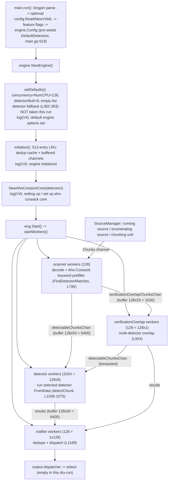

# How TruffleHog v3 Comes Online During a Basic Filesystem Scan

**A run-first, evidence-grounded walkthrough of four subsystems — configuration handling, scanning-engine initialization, detector preparation, and inter-component communication — as they are observed to start up during a safe, dry-run filesystem scan.**

This document answers how TruffleHog v3 (the Go secret-scanning CLI in this repository) brings four subsystems online at the start of a basic scan. The investigation is **run-first**: the canonical binary was built from source and run against a benign directory at escalating log verbosity, and the captured output is the primary evidence. To keep observation honest and never conflate it with source reading, **every claim below carries an explicit classification**:

- **[observed]** — the value or behavior literally appears in the captured runtime output (shown below, with the exact command that produced it).
- **[source-grounded]** — the mechanism is proven by a specific `file:line` in the read-only source; the runtime output does *not* print it directly.
- **[computed]** — a number derived arithmetically from observed values and fixed source constants (for example, a channel-buffer capacity).
- **[inferred]** — an interpretation of *purpose/intent* that is neither printed at runtime nor stated verbatim in source.

Each claim also carries a verified `file:line` citation and a cause → effect explanation. All reported values are **canonical**: they come from the default `trufflehog dev` build invoked exactly as a normal user would run it.

> **Host note.** The concrete worker counts and channel-buffer sizes reported here are **host-dependent**: they derive from `runtime.NumCPU()`, which is **128** on the machine used for this investigation. Worker counts are **[observed]** and channel buffers are **[computed]** from observed concurrency × fixed source constants; both are attributed to their host-dependent source and are **not** universal constants. The multipliers and cache sizes they derive from *are* fixed source constants.

---

## How this was observed

**Repository and toolchain.** [source-grounded] The module under investigation is `module github.com/trufflesecurity/trufflehog/v3` (`go.mod:L1`). Building requires the Go toolchain: the module directive is `go 1.23.1` (`go.mod:L3`) and the highest explicitly documented toolchain is `toolchain go1.24.2` (`go.mod:L5`). [observed] In this environment Go 1.24.2 is pre-provisioned at `/usr/local/go` and is activated by sourcing the environment profile before building; the same effect is achieved on a fresh machine by installing Go 1.24.2 and putting it on `PATH`:

```bash
# Activate the pre-provisioned toolchain (this environment):
source /etc/profile.d/go.sh        # puts /usr/local/go/bin on PATH; sets CGO_ENABLED=0, GOPATH, GOCACHE outside the repo
go version                          # => go version go1.24.2 linux/amd64
#
# Equivalent fresh-machine setup:
#   curl -fsSLO https://go.dev/dl/go1.24.2.linux-amd64.tar.gz
#   tar -C /usr/local -xzf go1.24.2.linux-amd64.tar.gz
#   export PATH=/usr/local/go/bin:$PATH
```

**Canonical build (`trufflehog dev`).** [observed] The binary was compiled with the project's canonical recipe — `CGO_ENABLED=0` (`Dockerfile:L5`) and `go build -o trufflehog .` (`Dockerfile:L9`); the `Makefile` `run`/`run-debug`/`install`/`dogfood` targets all use `CGO_ENABLED=0` as well (`Makefile:L14-L52`). The toolchain, binary, and Go caches all live **outside** the repository checkout so the working tree stays clean.

[source-grounded] The version string `dev` comes from `var BuildVersion = "dev"` (`pkg/version/version.go:L3`), surfaced to the `--version` flag by `cli.Version("trufflehog " + version.BuildVersion)` (`main.go:L270`). Release builds override it through the goreleaser ldflag — the exact current value is `-s -w -X 'github.com/trufflesecurity/trufflehog/v3/pkg/version.BuildVersion={{ .Version }}'` (`.goreleaser.yml:L6`) — so **`dev` is the canonical marker of a plain from-source build**.

[observed] **`--version` writes to stderr, not stdout.** Running `--version` emitted the string `trufflehog dev` to **stderr (15 bytes, including the trailing newline)** while **stdout was empty (0 bytes)** — the same stream discipline the scan itself uses (results → stdout, diagnostics → stderr):

```bash
/tmp/thog_build/trufflehog --version 1>version.stdout 2>version.stderr
# version.stdout: 0 bytes   |   version.stderr: 15 bytes
```

```
# --- version.stderr (the only stream with output) ---
trufflehog dev
```

**Minimal, safe scan target (87 bytes, outside the checkout).** Two tiny text files with no real secrets, created by the workflow below: `readme.txt` (59 bytes) and `config.ini` (28 bytes).

**Reproducible, self-contained workflow.** The whole investigation is reproduced by the fail-fast script below. It activates the toolchain, builds the canonical binary, creates the fixture and every capture file under a **single unique temporary directory outside the repository** (so the checkout is never touched or dirtied), verifies fixture byte sizes, relies on `set -euo pipefail` plus explicit tests to fail on any error, runs all four verbosity levels with stdout and stderr captured separately, removes every artifact via an `EXIT` trap, and ends with an explicit worktree-cleanliness assertion:

```bash
#!/usr/bin/env bash
set -euo pipefail

# 1. Activate the pre-provisioned Go 1.24.2 toolchain (see "Repository and toolchain" above).
source /etc/profile.d/go.sh
go version                                   # => go version go1.24.2 linux/amd64

# 2. Every build/scan artifact lives in ONE unique temp dir OUTSIDE the repo checkout.
WORK="$(mktemp -d)"                          # e.g. /tmp/tmp.XXXXXXXXXX (collision-safe, unpredictable)
BIN="$WORK/trufflehog"; TARGET="$WORK/scan_target"; CAP="$WORK/captures"
cleanup() { rm -rf "$WORK"; }                # remove ALL artifacts on ANY exit path
trap cleanup EXIT
mkdir -p "$TARGET" "$CAP"

# 3. Canonical build (run from the repository root); verify the binary and its version banner.
CGO_ENABLED=0 go build -o "$BIN" .
test -x "$BIN"
"$BIN" --version 1>"$CAP/version.stdout" 2>"$CAP/version.stderr"   # stderr => "trufflehog dev"; stdout empty

# 4. Create the minimal, benign fixture and verify its exact byte sizes.
printf 'Welcome to the demo project.\nNothing sensitive lives here.\n' > "$TARGET/readme.txt"
printf '[settings]\ndebug = false\nok\n'                            > "$TARGET/config.ini"
test "$(wc -c < "$TARGET/readme.txt")" -eq 59
test "$(wc -c < "$TARGET/config.ini")" -eq 28                       # total 87 bytes

# 5. Safe dry-run at each verbosity level; results -> stdout, logs+banner -> stderr, captured separately.
for N in 2 3 4 5; do
  "$BIN" filesystem "$TARGET" --no-verification --log-level="$N" \
      1>"$CAP/level$N.stdout" 2>"$CAP/level$N.stderr"
  printf 'level %s: stdout=%sB stderr=%sL\n' \
      "$N" "$(wc -c <"$CAP/level$N.stdout")" "$(wc -l <"$CAP/level$N.stderr")"
done

# 6. The EXIT trap removes $WORK; nothing was ever written inside the repository.
git status --porcelain                       # expected: empty output (clean working tree)
```

- [source-grounded] `--no-verification` (`main.go:L59`) sets `Verify: !*noVerification` to `false` (`main.go:L520`); that boolean — not the result count — is what makes the run a **safe dry-run** with no outbound provider API call (mechanism detailed under **No-verification safety** below).
- [source-grounded] `--log-level` (`main.go:L50`, *"Logging verbosity on a scale of 0 (info) to 5 (trace)"*) selects which logr **V-levels** are emitted; the logger renders them as `info-N` labels. [observed] The engine-initialization and detector-preparation signals are emitted at V(4) and are **absent** from the `--log-level=2` capture, which is the decisive reason verbosity was escalated to `--log-level=4` — so those signals were *observed*, not inferred.

**Disclosure of every transformation applied to the raw captures.** Each stderr log line is a single **TAB-separated** record of the form `<timestamp>⇥info-N⇥trufflehog⇥<message>⇥<json-fields>` (⇥ marks one literal TAB, which is preserved verbatim in the fenced blocks below). Exactly two volatile values are redacted and **no other byte is altered**:

1. the leading RFC3339 **timestamp** → `<timestamp>`;
2. the random **5-character worker IDs** (`source_manager_worker_id`, `scanner_worker_id`) → `<id>`.

Everything else is verbatim — the real absolute target path (`/tmp/thog_scan_target/...` on this host), the `scan_duration` value (a genuine per-run measurement, itself volatile), the field order, and the TAB separators. **One structural transformation is disclosed here and applied only to levels 4 and 5:** each of those captures contains **128 byte-identical** `finished scanning chunks` records (one per scanner worker; after worker-ID redaction they are indistinguishable). To avoid printing 128 identical lines, that block is shown **once, in its correct position**, and the total line count is stated so completeness stays verifiable. **Levels 2 and 3 are shown in full — every line.**

---

## The complete captured evidence (levels 2–5)

The blocks below are the **complete stderr captures** at each verbosity level, produced by the workflow above; the exact command is repeated with each. (In the captured run, the workflow variables resolved to `$BIN` = `/tmp/thog_build/trufflehog` and `$TARGET` = `/tmp/thog_scan_target`, both outside the checkout — which is why that absolute path appears verbatim in the records.) **stdout was empty (0 bytes) at every level** (no secrets found), so there is no stdout block to show. Observed stderr line counts: **level 2 → 10, level 3 → 14, level 4 → 146, level 5 → 148** (the level-4 count breaks down as 2 `info-0` + 6 `info-2` + 4 `info-3` + 132 `info-4`, the last comprising 4 signal lines and 128 `finished scanning chunks`).

**`--log-level=2` — 10 stderr lines, shown in full:**

```bash
"$BIN" filesystem "$TARGET" --no-verification --log-level=2 1>level2.stdout 2>level2.stderr
```

```
<timestamp>	info-2	trufflehog	trufflehog dev
🐷🔑🐷  TruffleHog. Unearth your secrets. 🐷🔑🐷

<timestamp>	info-2	trufflehog	starting scanner workers	{"count": 128}
<timestamp>	info-2	trufflehog	starting detector workers	{"count": 1024}
<timestamp>	info-2	trufflehog	starting verificationOverlap workers	{"count": 128}
<timestamp>	info-2	trufflehog	starting notifier workers	{"count": 128}
<timestamp>	info-0	trufflehog	running source	{"source_manager_worker_id": "<id>", "with_units": true}
<timestamp>	info-2	trufflehog	enumerating source	{"source_manager_worker_id": "<id>"}
<timestamp>	info-0	trufflehog	finished scanning	{"chunks": 2, "bytes": 87, "verified_secrets": 0, "unverified_secrets": 0, "scan_duration": "3.929297ms", "trufflehog_version": "dev", "verification_caching": {"Hits":0,"Misses":0,"HitsWasted":0,"AttemptsSaved":0,"VerificationTimeSpentMS":0}}
```

**`--log-level=3` — 14 stderr lines, shown in full; adds the four V(3) per-file `chunking unit` / `scanning file` records:**

```bash
"$BIN" filesystem "$TARGET" --no-verification --log-level=3 1>level3.stdout 2>level3.stderr
```

```
<timestamp>	info-2	trufflehog	trufflehog dev
🐷🔑🐷  TruffleHog. Unearth your secrets. 🐷🔑🐷

<timestamp>	info-2	trufflehog	starting scanner workers	{"count": 128}
<timestamp>	info-2	trufflehog	starting detector workers	{"count": 1024}
<timestamp>	info-2	trufflehog	starting verificationOverlap workers	{"count": 128}
<timestamp>	info-2	trufflehog	starting notifier workers	{"count": 128}
<timestamp>	info-0	trufflehog	running source	{"source_manager_worker_id": "<id>", "with_units": true}
<timestamp>	info-2	trufflehog	enumerating source	{"source_manager_worker_id": "<id>"}
<timestamp>	info-3	trufflehog	chunking unit	{"source_manager_worker_id": "<id>", "unit_kind": "unit", "unit": "/tmp/thog_scan_target/config.ini"}
<timestamp>	info-3	trufflehog	scanning file	{"source_manager_worker_id": "<id>", "unit_kind": "unit", "unit": "/tmp/thog_scan_target/config.ini", "path": "/tmp/thog_scan_target/config.ini"}
<timestamp>	info-3	trufflehog	chunking unit	{"source_manager_worker_id": "<id>", "unit_kind": "unit", "unit": "/tmp/thog_scan_target/readme.txt"}
<timestamp>	info-3	trufflehog	scanning file	{"source_manager_worker_id": "<id>", "unit_kind": "unit", "unit": "/tmp/thog_scan_target/readme.txt", "path": "/tmp/thog_scan_target/readme.txt"}
<timestamp>	info-0	trufflehog	finished scanning	{"chunks": 2, "bytes": 87, "verified_secrets": 0, "unverified_secrets": 0, "scan_duration": "4.336817ms", "trufflehog_version": "dev", "verification_caching": {"Hits":0,"Misses":0,"HitsWasted":0,"AttemptsSaved":0,"VerificationTimeSpentMS":0}}
```

**`--log-level=4` — 146 stderr lines; adds the four V(4) engine-init / detector-prep signals and 128 per-worker `finished scanning chunks`.** Per the disclosed collapse, the 128 identical `finished scanning chunks` lines (raw positions 18–145) are represented by the single line shown in position:

```bash
"$BIN" filesystem "$TARGET" --no-verification --log-level=4 1>level4.stdout 2>level4.stderr
```

```
<timestamp>	info-2	trufflehog	trufflehog dev
🐷🔑🐷  TruffleHog. Unearth your secrets. 🐷🔑🐷

<timestamp>	info-4	trufflehog	default engine options set
<timestamp>	info-4	trufflehog	engine initialized
<timestamp>	info-4	trufflehog	setting up aho-corasick core
<timestamp>	info-4	trufflehog	set up aho-corasick core
<timestamp>	info-2	trufflehog	starting scanner workers	{"count": 128}
<timestamp>	info-2	trufflehog	starting detector workers	{"count": 1024}
<timestamp>	info-2	trufflehog	starting verificationOverlap workers	{"count": 128}
<timestamp>	info-2	trufflehog	starting notifier workers	{"count": 128}
<timestamp>	info-0	trufflehog	running source	{"source_manager_worker_id": "<id>", "with_units": true}
<timestamp>	info-2	trufflehog	enumerating source	{"source_manager_worker_id": "<id>"}
<timestamp>	info-3	trufflehog	chunking unit	{"source_manager_worker_id": "<id>", "unit_kind": "unit", "unit": "/tmp/thog_scan_target/config.ini"}
<timestamp>	info-3	trufflehog	scanning file	{"source_manager_worker_id": "<id>", "unit_kind": "unit", "unit": "/tmp/thog_scan_target/config.ini", "path": "/tmp/thog_scan_target/config.ini"}
<timestamp>	info-3	trufflehog	chunking unit	{"source_manager_worker_id": "<id>", "unit_kind": "unit", "unit": "/tmp/thog_scan_target/readme.txt"}
<timestamp>	info-3	trufflehog	scanning file	{"source_manager_worker_id": "<id>", "unit_kind": "unit", "unit": "/tmp/thog_scan_target/readme.txt", "path": "/tmp/thog_scan_target/readme.txt"}
<timestamp>	info-4	trufflehog	finished scanning chunks	{"scanner_worker_id": "<id>"}
<timestamp>	info-0	trufflehog	finished scanning	{"chunks": 2, "bytes": 87, "verified_secrets": 0, "unverified_secrets": 0, "scan_duration": "4.777549ms", "trufflehog_version": "dev", "verification_caching": {"Hits":0,"Misses":0,"HitsWasted":0,"AttemptsSaved":0,"VerificationTimeSpentMS":0}}
```

**`--log-level=5` — 148 stderr lines; adds two V(5) `dataErrChan closed, all chunks processed` traces (one per file).** Same disclosed collapse of the 128 identical `finished scanning chunks` lines (raw positions 20–147):

```bash
"$BIN" filesystem "$TARGET" --no-verification --log-level=5 1>level5.stdout 2>level5.stderr
```

```
<timestamp>	info-2	trufflehog	trufflehog dev
🐷🔑🐷  TruffleHog. Unearth your secrets. 🐷🔑🐷

<timestamp>	info-4	trufflehog	default engine options set
<timestamp>	info-4	trufflehog	engine initialized
<timestamp>	info-4	trufflehog	setting up aho-corasick core
<timestamp>	info-4	trufflehog	set up aho-corasick core
<timestamp>	info-2	trufflehog	starting scanner workers	{"count": 128}
<timestamp>	info-2	trufflehog	starting detector workers	{"count": 1024}
<timestamp>	info-2	trufflehog	starting verificationOverlap workers	{"count": 128}
<timestamp>	info-2	trufflehog	starting notifier workers	{"count": 128}
<timestamp>	info-0	trufflehog	running source	{"source_manager_worker_id": "<id>", "with_units": true}
<timestamp>	info-2	trufflehog	enumerating source	{"source_manager_worker_id": "<id>"}
<timestamp>	info-3	trufflehog	chunking unit	{"source_manager_worker_id": "<id>", "unit_kind": "unit", "unit": "/tmp/thog_scan_target/readme.txt"}
<timestamp>	info-3	trufflehog	chunking unit	{"source_manager_worker_id": "<id>", "unit_kind": "unit", "unit": "/tmp/thog_scan_target/config.ini"}
<timestamp>	info-3	trufflehog	scanning file	{"source_manager_worker_id": "<id>", "unit_kind": "unit", "unit": "/tmp/thog_scan_target/readme.txt", "path": "/tmp/thog_scan_target/readme.txt"}
<timestamp>	info-3	trufflehog	scanning file	{"source_manager_worker_id": "<id>", "unit_kind": "unit", "unit": "/tmp/thog_scan_target/config.ini", "path": "/tmp/thog_scan_target/config.ini"}
<timestamp>	info-5	trufflehog	dataErrChan closed, all chunks processed	{"source_manager_worker_id": "<id>", "unit_kind": "unit", "unit": "/tmp/thog_scan_target/config.ini", "path": "/tmp/thog_scan_target/config.ini", "mime": "text/plain; charset=utf-8", "timeout": 60}
<timestamp>	info-5	trufflehog	dataErrChan closed, all chunks processed	{"source_manager_worker_id": "<id>", "unit_kind": "unit", "unit": "/tmp/thog_scan_target/readme.txt", "path": "/tmp/thog_scan_target/readme.txt", "mime": "text/plain; charset=utf-8", "timeout": 60}
<timestamp>	info-4	trufflehog	finished scanning chunks	{"scanner_worker_id": "<id>"}
<timestamp>	info-0	trufflehog	finished scanning	{"chunks": 2, "bytes": 87, "verified_secrets": 0, "unverified_secrets": 0, "scan_duration": "5.005877ms", "trufflehog_version": "dev", "verification_caching": {"Hits":0,"Misses":0,"HitsWasted":0,"AttemptsSaved":0,"VerificationTimeSpentMS":0}}
```

The four subsystem sections below read this sequence top-to-bottom, mapping each observed signal to the source statement that emits it.

---

## Subsystem 1 — Configuration handling

**Direct answer.** Configuration is handled entirely up front in the CLI layer, *before* any engine object exists. The command line is parsed by **kingpin**; an in-memory `config.Config{}` is created and, **only if** `--config` is supplied, populated from a YAML file via `config.Read` → `NewYAML` (which parses *custom* detectors); a handful of feature flags are set from CLI flags; and finally an `engine.Config` value is assembled from the parsed flags plus the always-present default detector list. The startup banner and the version line are written to **stderr** (never stdout), which is why results and diagnostics never intermix.

**Observed output** [observed] (from the `--log-level=2` run; the same two lines head every level — verbatim in **The complete captured evidence** above):

```bash
"$BIN" filesystem "$TARGET" --no-verification --log-level=2 1>level2.stdout 2>level2.stderr
```

```
<timestamp>	info-2	trufflehog	trufflehog dev
🐷🔑🐷  TruffleHog. Unearth your secrets. 🐷🔑🐷
```

**Mechanism (cause → effect).** *The bullets below are **[source-grounded]** — each is proven by the cited `file:line` in the read-only source and is **not** printed by the runtime — except where a bullet explicitly quotes an **[observed]** signal (the version line and banner). Runtime output does not expose flag parsing, the feature-flag stores, config loading, or engine-config assembly; those are established from source, not observation.*

- **CLI surface.** The root command is created as `kingpin.New("TruffleHog", "TruffleHog is a tool for finding credentials.")` (`main.go:L47`). Global flags are declared right after, including `--log-level` (`main.go:L50`, `Default("0")`), `--concurrency` (`main.go:L58`, `Default(strconv.Itoa(runtime.NumCPU()))`), `--no-verification` (`main.go:L59`), `--config` (`main.go:L70`, `ExistingFile()`), and `--include-detectors` (`main.go:L81`, `Default("all")`). *Effect:* flag defaults are resolved by kingpin before `run()` executes — this is why `--concurrency` already equals `128` (the host CPU count) with no flag passed, a fact that becomes visible later in the worker counts.
- **Version line + banner to stderr.** [observed] The `info-2` version line is emitted by `logger.V(2).Info(fmt.Sprintf("trufflehog %s", version.BuildVersion))` (`main.go:L410`) — hence it appears at `--log-level=2` and above. The banner is written by `fmt.Fprintf(os.Stderr, "🐷🔑🐷  TruffleHog. Unearth your secrets. 🐷🔑🐷\n\n")` (`main.go:L498`), guarded by `if !*jsonLegacy && !*jsonOut` (`main.go:L497`). *Effect:* the pig-emoji banner and version go to **stderr**, and are suppressed in JSON modes; results would go to stdout (empty here, since nothing was found).
- **Feature flags.** Inside `run()`, feature toggles are applied via `feature.*.Store(...)` — for example `feature.EnableAPKHandler.Store(true)` (`main.go:L458`), plus conditional stores around `main.go:L442-L454`. *Effect:* process-wide behavior (e.g. APK handling) is fixed before the engine is built.
- **Config load (only with `--config`).** `conf := &config.Config{}` (`main.go:L460`) starts empty; when `--config` is provided, `conf, err = config.Read(*configFilename)` (`main.go:L463`) runs. `Read` (`pkg/config/config.go:L18`) reads the file and delegates to `NewYAML` (`pkg/config/config.go:L27`), which unmarshals the YAML and converts each entry into a custom detector, returning them in `Config{Detectors: d}` (`pkg/config/config.go:L13-L14,L43`). *Effect:* in this dry-run **no `--config` was passed**, so `conf.Detectors` stays empty and only the built-in defaults are used — consistent with the observed absence of any custom-detector activity.
- **Engine-config assembly.** The CLI finishes by building `engConf := engine.Config{ ... }` (`main.go:L513`) with `Concurrency: *concurrency` (`main.go:L514`), `Detectors: append(defaults.DefaultDetectors(), conf.Detectors...)` (`main.go:L519`), and `Verify: !*noVerification` (`main.go:L520`). *Effect:* the engine always receives the full default detector set (optionally extended by custom detectors), and `--no-verification` flips `Verify` to `false`, which is what makes the run a dry-run.

---

## Subsystem 2 — Scanning-engine initialization

**Direct answer.** The engine is built by `engine.NewEngine(ctx, &cfg)`, which runs two internal phases in order: `setDefaults()` fills in unset options (defaulting concurrency to `runtime.NumCPU()`, the detector-worker multiplier to `8`, and the notifier/verificationOverlap multipliers to `1`); it *also* contains a **fallback** that would load the default detector set only if the engine had been handed an empty detector list — a branch this run does **not** take, because the CLI already pre-seeded the defaults into `engine.Config` (see Subsystem 1 and the note below). Then `initialize()` allocates a fixed **512-entry LRU deduplication cache** and constructs the buffered inter-stage channels. Each phase emits a distinct `V(4)` signal, so the whole initialization is only visible at `--log-level=4` and above.

**Observed output** [observed] (only present at `--log-level=4`+; verbatim in **The complete captured evidence** above):

```bash
"$BIN" filesystem "$TARGET" --no-verification --log-level=4 1>level4.stdout 2>level4.stderr
```

```
<timestamp>	info-4	trufflehog	default engine options set
<timestamp>	info-4	trufflehog	engine initialized
```

**Observed absence (evidence at `--log-level=2`).** At `--log-level=2` these two lines do **not** appear at all — the level-2 capture is only 10 lines and contains no `info-4` entries. That absence is itself evidence that engine-init lives at higher verbosity, which is precisely why the capture was escalated to level 4.

**Mechanism (cause → effect).** *The `V(4)` signals quoted below (`default engine options set`, `engine initialized`) are **[observed]**; the internals they bracket — the default-value resolution, the empty-list detector fallback, and the 512-entry LRU size — are **[source-grounded]** (proven by `file:line`, not printed), and the LRU's de-duplication *purpose* is **[inferred]**.*

- **Entry point.** `eng, err := engine.NewEngine(ctx, &cfg)` (`main.go:L688`) calls `func NewEngine(ctx context.Context, cfg *Config) (*Engine, error)` (`pkg/engine/engine.go:L226`). *Effect:* a single engine object is constructed that will own all worker pools, channels, and the detector prefilter.
- **`setDefaults()`** (`pkg/engine/engine.go:L336`) resolves defaults only where a value is unset:
  - Concurrency: guarded by `if e.concurrency == 0` (`pkg/engine/engine.go:L337`) → `runtime.NumCPU()` (`pkg/engine/engine.go:L338`). *Effect:* here the branch is **skipped** because `--concurrency` was already defaulted to `128` by the CLI (see the observed absence below), so `e.concurrency` stays `128`.
  - `detectorWorkerMultiplier = 8` (`pkg/engine/engine.go:L345`), with the source comment *"bound by net i/o so it's higher than other workers"* — the detector pool is intentionally the largest.
  - `notificationWorkerMultiplier = 1` (`pkg/engine/engine.go:L349`) and `verificationOverlapWorkerMultiplier = 1` (`pkg/engine/engine.go:L353`).
  - Default detectors — **[source-grounded] fallback that this run does NOT exercise**: `if len(e.detectors) == 0 { e.detectors = defaults.DefaultDetectors() }` (`pkg/engine/engine.go:L362-L363`). *Effect:* this branch loads the defaults **only** when the engine received an empty list. In the observed CLI path the list is already **non-empty** — `main.go:L519` passed `append(defaults.DefaultDetectors(), conf.Detectors...)` into `engine.Config.Detectors` before `NewEngine` ran — so `len(e.detectors) != 0` and the branch is **skipped**. Its existence is proven by reading the source; it is *not* observed to fire in this run.
  - The phase closes by emitting `ctx.Logger().V(4).Info("default engine options set")` (`pkg/engine/engine.go:L373`) → the observed `info-4  default engine options set`.
- **`initialize()`** (`pkg/engine/engine.go:L489`):
  - `const cacheSize = 512` (`pkg/engine/engine.go:L491`) → `lru.New[string, detectorspb.DecoderType](cacheSize)` (`pkg/engine/engine.go:L493`). *Effect:* a 512-entry LRU cache is created and later assigned as `e.dedupeCache` (`pkg/engine/engine.go:L520`) to de-duplicate results. `[inferred]` The *purpose* of de-duplication is not printed; it is inferred from the cache's name and use.
  - The buffered channels are constructed (detailed in Subsystem 4) and the phase emits `ctx.Logger().V(4).Info("engine initialized")` (`pkg/engine/engine.go:L521`) → the observed `info-4  engine initialized`.

**Observed non-event (traced to cause).** The line `No concurrency specified, defaulting to max` (`pkg/engine/engine.go:L339`) **never appeared** at any level (grep count `0` across levels 2–5). *Cause:* `--concurrency` is pre-set to `runtime.NumCPU()` by the CLI flag default (`main.go:L58`), so `e.concurrency` is already `128` (non-zero) when `setDefaults()` runs, and the `if e.concurrency == 0` fallback at `pkg/engine/engine.go:L337` is skipped. This is a clean example of tracing an observed behavior — and a meaningful *non*-event — back to its exact source cause.


---

## Subsystem 3 — Detector preparation

**Direct answer.** Detectors are prepared as part of engine initialization. In this run the detector list is the **default detector set**, which the CLI pre-seeded into `engine.Config` *before* the engine was built (the engine also carries a source-grounded fallback that would load the defaults if it were handed an empty list, but that branch is **not** taken here — see Subsystem 2). The engine narrows the list with include/exclude filtering (`--include-detectors` defaults to `all`, so nothing is filtered out in a basic run), and then compiles the resulting detector list into an **Aho-Corasick keyword prefilter** — a fast, string-matching "core" that lets the engine cheaply decide which detectors *might* apply to a chunk before running their (more expensive) regular expressions. Building that core is bracketed by two `V(4)` log lines.

**Observed output** [observed] (only present at `--log-level=4`+; verbatim in **The complete captured evidence** above):

```bash
"$BIN" filesystem "$TARGET" --no-verification --log-level=4 1>level4.stdout 2>level4.stderr
```

```
<timestamp>	info-4	trufflehog	setting up aho-corasick core
<timestamp>	info-4	trufflehog	set up aho-corasick core
```

**Mechanism (cause → effect).** *The `setting up`/`set up aho-corasick core` signals are **[observed]**; the detector-set resolution and the include/exclude filtering that select which detectors enter the core are **[source-grounded]** — the runtime does not print the detector list or the filtering decision.*

- **Default set — observed CLI pre-seed vs. source-grounded fallback.** [source-grounded] The list is populated by the CLI: `engine.Config.Detectors = append(defaults.DefaultDetectors(), conf.Detectors...)` (`main.go:L519`), so the engine already holds the full default set when `NewEngine` runs. `setDefaults()` additionally guards `if len(e.detectors) == 0 { e.detectors = defaults.DefaultDetectors() }` (`pkg/engine/engine.go:L362-L363`), but because the list is already non-empty this fallback is **not** exercised in this run. *Effect:* the engine has a fully-populated detector list even though the user named none.
- **Include/exclude filtering.** Selection is resolved by `buildDetectorSets(cfg)` (`pkg/engine/engine.go:L376`), which parses the include/exclude flags through `config.ParseDetectors(cfg.IncludeDetectors)` (`pkg/engine/engine.go:L377`) and `config.ParseDetectors(cfg.ExcludeDetectors)` (`pkg/engine/engine.go:L381`). Because `--include-detectors` defaults to `all` (`main.go:L81`) and no `--exclude-detectors` was given, *effect:* the full default set survives filtering unchanged in this run.
- **Aho-Corasick core.** [source-grounded] The prefilter is compiled by `e.AhoCorasickCore = ahocorasick.NewAhoCorasickCore(e.detectors, ahoCOptions...)` (`pkg/engine/engine.go:L530`), bracketed by `ctx.Logger().V(4).Info("setting up aho-corasick core")` (`pkg/engine/engine.go:L529`) and `ctx.Logger().V(4).Info("set up aho-corasick core")` (`pkg/engine/engine.go:L531`). *Effect:* [observed] the pair of `info-4` lines marks the keyword trie being built from every detector's keywords. [source-grounded] That the core is used to *pre-screen* chunks with fast keyword matching ahead of the detectors' regexes is proven directly by the local implementation, not by any external source: `scannerWorker` calls `e.AhoCorasickCore.FindDetectorMatches(decoded.Chunk.Data)` (`pkg/engine/engine.go:L795`) and enqueues **only** the matched detectors for detection (`pkg/engine/engine.go:L807-L816`).

*This section deliberately stays at the mechanism level: it explains how the detector set is loaded, filtered, and compiled into the prefilter, and does not enumerate the individual default detectors.*


---

## Subsystem 4 — Inter-component communication

**Direct answer.** Once initialized, the engine starts **four worker pools** — scanner, detector, verificationOverlap, and notifier — and connects them with **buffered Go channels**. A `SourceManager` produces the data: it *runs* the filesystem source, *enumerates* its units (files), and *chunks* each unit onto the shared `Chunks` channel. From there [source-grounded] the responsibilities are:

- **scanner workers** decode each chunk and run the **Aho-Corasick keyword prefilter** — `matchingDetectors := e.AhoCorasickCore.FindDetectorMatches(decoded.Chunk.Data)` (`pkg/engine/engine.go:L795`, inside `scannerWorker` at `pkg/engine/engine.go:L777`) — then **enqueue detector-specific work**: one `detectableChunk` per matching detector onto `detectableChunksChan` (`pkg/engine/engine.go:L807-L816`), or, when a chunk matches more than one detector, a `verificationOverlapChunk` onto `verificationOverlapChunksChan` (`pkg/engine/engine.go:L796-L804`);
- **detector workers** consume `detectableChunksChan` and **execute the selected detector's logic** — `detectorWorker` (`pkg/engine/engine.go:L1036`) calls `detectChunk` (`pkg/engine/engine.go:L1044`) → `e.verificationCache.FromData(...)` → the detector's own `FromData` (`pkg/engine/engine.go:L1069-L1075`) — emitting any results onto the `results` channel via `processResult` (`pkg/engine/engine.go:L1116,L1186`);
- **verificationOverlap workers** consume `verificationOverlapChunksChan` and run detection for the multi-detector case while reconciling cross-detector overlap (`verificationOverlapWorker`, `pkg/engine/engine.go:L924`);
- **notifier workers** consume the `results` channel (`ResultsChan()` returns `e.results`, `pkg/engine/engine.go:L748-L749`), deduplicate against the LRU cache (`e.dedupeCache.Get`/`.Add`, `pkg/engine/engine.go:L1217,L1221`), and dispatch each surviving result via `e.dispatcher.Dispatch(...)` (`notifierWorker` at `pkg/engine/engine.go:L1189`, dispatch call at `pkg/engine/engine.go:L1229`). [source-grounded] The default dispatcher wired by the CLI is `engine.NewPrinterDispatcher(printer)` (`main.go:L525`), whose `Dispatch` (`pkg/engine/engine.go:L92-L93`) invokes the printer's `Print` — for the default plain output that is `PlainPrinter.Print` (`pkg/output/plain.go:L31`).

**The keyword prefilter therefore runs in the *scanner* pool, not the detector pool** — the detector pool executes the detectors that the scanner's prefilter has already selected. This is a classic fan-out/fan-in pipeline: many workers pull from shared channels, and the channel buffers decouple producers from consumers.

**Observed output.** [observed] The four worker-pool starts are `V(2)` (visible from `--log-level=2`); the source-lifecycle lines are mixed `V(0)`/`V(2)`/`V(3)`. All appear verbatim in **The complete captured evidence** above; the four worker-start records — the signals most relevant here — are reproduced (from the `--log-level=4` capture):

```bash
"$BIN" filesystem "$TARGET" --no-verification --log-level=4 1>level4.stdout 2>level4.stderr
```

```
<timestamp>	info-2	trufflehog	starting scanner workers	{"count": 128}
<timestamp>	info-2	trufflehog	starting detector workers	{"count": 1024}
<timestamp>	info-2	trufflehog	starting verificationOverlap workers	{"count": 128}
<timestamp>	info-2	trufflehog	starting notifier workers	{"count": 128}
```

**Mechanism (cause → effect).** *The four `starting … workers` lines and their `{"count": …}` fields are **[observed]**; the per-pool arithmetic is checked against those observed counts. The channel-buffer capacities are **[computed]** (never printed), the workers' responsibilities and the source-lifecycle mechanics are **[source-grounded]**, and the "large buffers let producers outpace consumers" rationale is **[inferred]**.*

- **Pool launch order.** `eng.Start(ctx)` (`main.go:L692`) drives `startWorkers()` (`pkg/engine/engine.go:L646`), which launches the pools in a fixed order: scanner → detector → verificationOverlap → notifier. The four observed `starting … workers` lines appear in exactly that order.
- **Worker-count arithmetic** (all derived from `e.concurrency = 128` on this host):
  - **scanner** — `ctx.Logger().V(2).Info("starting scanner workers", "count", e.concurrency)` (`pkg/engine/engine.go:L663`); count = `e.concurrency` = **128**.
  - **detector** — `numWorkers := e.concurrency * e.detectorWorkerMultiplier` (`pkg/engine/engine.go:L676`), logged at `pkg/engine/engine.go:L678`; count = 128 × 8 = **1024** (the deliberately-largest pool).
  - **verificationOverlap** — `numWorkers := e.concurrency * e.verificationOverlapWorkerMultiplier` (`pkg/engine/engine.go:L691`), logged at `pkg/engine/engine.go:L693`; count = 128 × 1 = **128**.
  - **notifier** — `numWorkers := e.notificationWorkerMultiplier * e.concurrency` (`pkg/engine/engine.go:L706`), logged at `pkg/engine/engine.go:L708`; count = 1 × 128 = **128**.
  - *Effect:* the observed `{"count": 128 / 1024 / 128 / 128}` values are exactly these products.
- **Buffered channels connect the stages.** Buffer capacities are `var defaultChannelBuffer = runtime.NumCPU()` (`pkg/engine/engine.go:L627`, = 128 here) times fixed per-channel multipliers declared in `initialize()`: `detectableChunksChanMultiplier = 50` (`pkg/engine/engine.go:L503`), `verificationOverlapChunksChanMultiplier = 25` (`pkg/engine/engine.go:L507`), and `resultsChanMultiplier = 50` (`pkg/engine/engine.go:L508`). The channels are created as `e.detectableChunksChan` (`pkg/engine/engine.go:L515`), `e.verificationOverlapChunksChan` (`pkg/engine/engine.go:L517`), and `e.results` (`pkg/engine/engine.go:L519`). *Effect:* effective buffers on this host are **6400** (128×50), **3200** (128×25), and **6400** (128×50) respectively — the large buffers let fast producers stay ahead of consumers `[inferred]` (per the source comments).
- **Source production drives the data.** The `SourceManager` emits `running source` with `{"with_units": true}` via `ctx.Logger().Info("running source", "with_units", true)` (`pkg/sources/source_manager.go:L363-L364`) — `V(0)`, hence `info-0`. Because the filesystem source supports **source units**, this takes the `runWithUnits` path (`pkg/sources/source_manager.go:L511`), which then logs `enumerating source` via `ctx.Logger().V(2).Info("enumerating source")` (`pkg/sources/source_manager.go:L531`) and, per unit, `chunking unit` via `ctx.Logger().V(3).Info("chunking unit")` (`pkg/sources/source_manager.go:L557`). The filesystem source logs each file with `fileCtx.Logger().V(3).Info("scanning file")` (`pkg/sources/filesystem/filesystem.go:L179`). *Effect:* the observed `running source` → `enumerating source` → per-file `chunking unit` / `scanning file` lines trace one file being enumerated, chunked, and fed into the pipeline.
- **Completion signals.** Each scanner worker logs `ctx.Logger().V(4).Info("finished scanning chunks")` (`pkg/engine/engine.go:L840`) when its input channel drains — observed as **128 identical `info-4` lines** (one per scanner worker; `info-4` lines totaled 132 = 4 header signals + 128). The final tally is `logger.Info("finished scanning", ...)` (`main.go:L566`), the `info-0  finished scanning` summary.




---

## Worker counts & channel buffers — host-dependent vs. fixed

To keep the reported numbers honest, it is worth separating what is **fixed in source** from what is **derived from the host**:

| Item | Value (128-CPU host) | Classification | Origin (`file:line`) |
|------|----------------------|----------------|----------------------|
| Base concurrency | 128 | **[observed]** · host-dependent | appears in every `{"count": …}` worker-start log; `runtime.NumCPU()` via `--concurrency` default (`main.go:L58`) |
| scanner workers | 128 | **[observed]** · host-dependent | log field `{"count": 128}`; `e.concurrency` (`pkg/engine/engine.go:L663`) |
| detector workers | 1024 | **[observed]** · host-dependent | log field `{"count": 1024}`; `e.concurrency * 8` (`pkg/engine/engine.go:L676`) |
| verificationOverlap workers | 128 | **[observed]** · host-dependent | log field `{"count": 128}`; `e.concurrency * 1` (`pkg/engine/engine.go:L691`) |
| notifier workers | 128 | **[observed]** · host-dependent | log field `{"count": 128}`; `1 * e.concurrency` (`pkg/engine/engine.go:L706`) |
| `detectableChunksChan` buffer | 6400 | **[computed]** · host-dependent (never printed at runtime) | `128 × 50` = `defaultChannelBuffer` (`pkg/engine/engine.go:L627`) × multiplier (`pkg/engine/engine.go:L503`); channel created at `pkg/engine/engine.go:L515` |
| `verificationOverlapChunksChan` buffer | 3200 | **[computed]** · host-dependent (never printed at runtime) | `128 × 25` = `defaultChannelBuffer` × multiplier (`pkg/engine/engine.go:L507`); channel created at `pkg/engine/engine.go:L517` |
| `results` buffer | 6400 | **[computed]** · host-dependent (never printed at runtime) | `128 × 50` = `defaultChannelBuffer` × multiplier (`pkg/engine/engine.go:L508`); channel created at `pkg/engine/engine.go:L519` |
| detector-worker multiplier | 8 | **[source-grounded]** · fixed constant | `pkg/engine/engine.go:L345` |
| notifier / verificationOverlap multipliers | 1 / 1 | **[source-grounded]** · fixed constant | `pkg/engine/engine.go:L349,L353` |
| channel multipliers | 50 / 25 / 50 | **[source-grounded]** · fixed constant | `pkg/engine/engine.go:L503,L507,L508` |
| LRU dedup cache size | 512 | **[source-grounded]** · fixed constant | `pkg/engine/engine.go:L491` |

On a machine with a different CPU count, the **multipliers, LRU size, and channel multipliers stay the same**, while every host-dependent value scales with `runtime.NumCPU()`.

## Progressive verbosity — exhaustive condition coverage

Escalating `--log-level` reveals progressively more of the pipeline, which is why more than the happy path was exercised. Observed stderr line counts: **level 2 → 10 lines, level 3 → 14, level 4 → 146, level 5 → 148.**

- **`--log-level=2`** — version line + pig banner, the four `starting … workers` counts, and the `running source` / `enumerating source` / `finished scanning` source lifecycle. (No `info-3` or `info-4` lines — the observed absence that motivates escalation.)
- **`--log-level=3`** — adds the `V(3)` per-unit lines: two `chunking unit` and two `scanning file` (one pair per file).
- **`--log-level=4`** — adds the `V(4)` engine-init/detector-prep signals (`default engine options set`, `engine initialized`, `setting up`/`set up aho-corasick core`) and the 128 per-worker `finished scanning chunks`.
- **`--log-level=5`** — adds two `V(5)` trace lines, one per file (`dataErrChan closed, all chunks processed`), shown verbatim in the level-5 block of **The complete captured evidence** above. [source-grounded] That trace is emitted by `ctx.Logger().V(5).Info("dataErrChan closed, all chunks processed")` (`pkg/handlers/handlers.go:L413`).

[observed] The delta between levels is itself evidence of the V-level gating: each higher level is a strict superset of the one below, and the engine-init/detector-prep signals appear only from level 4 upward — the observed absence at level 2 is what motivated escalation.

[observed] **Ordering stability.** Across repeated runs the **high-level phases are stable and always appear in the same order**: version line + banner → the four `starting … workers` pools (scanner → detector → verificationOverlap → notifier) → `running source` → `enumerating source` → per-file `chunking unit`/`scanning file` → `finished scanning`. The **per-file ordering *within* the `V(3)`/`V(5)` lines is not stable**, however: because source units (files) are processed **concurrently** by the worker pools, repeated runs interleave the two files differently — some runs log `config.ini`'s `chunking unit`/`scanning file` before `readme.txt`'s, others the reverse (this was observed directly across repeated level-3 runs). The evidence blocks above therefore show *one* representative interleaving; the *set* of lines is identical run-to-run, but the relative order of the two files' `V(3)`/`V(5)` records may differ. This is expected from concurrent source-unit processing and affects no reported count or signal.

## Dry-run confirmation

The scan verified nothing and found nothing, exactly as a `--no-verification` dry-run should. Observed final summary (`--log-level=4`), and an **empty stdout** at every level:

```
<timestamp>	info-0	trufflehog	finished scanning	{"chunks": 2, "bytes": 87, "verified_secrets": 0, "unverified_secrets": 0, "scan_duration": "4.777549ms", "trufflehog_version": "dev", "verification_caching": {"Hits":0,"Misses":0,"HitsWasted":0,"AttemptsSaved":0,"VerificationTimeSpentMS":0}}
```

[observed] `verified_secrets: 0` and `unverified_secrets: 0` confirm **this fixture produced no findings** — there was nothing to report or verify. **These zero counts do not, by themselves, prove that no verification network call occurred:** a fixture containing no secrets would show the same zeros even with verification *enabled*. The *no-outbound-call* guarantee instead rests on the source-grounded control path in **No-verification safety** below, not on the result counts. [observed] `chunks: 2` / `bytes: 87` match the two-file, 87-byte target, `trufflehog_version: "dev"` confirms the canonical build, and the 0-byte stdout confirms results and logs are on separate streams.

## No-verification safety (source-grounded control path)

[source-grounded] What actually guarantees the dry-run makes **no outbound provider API call** is a boolean threaded from the CLI flag all the way down to each detector invocation — *not* the zero result counts. The control path is:

1. **CLI flag → engine config.** `--no-verification` (`main.go:L59`) is negated into the engine config as `Verify: !*noVerification` (`main.go:L520`). With the flag present, `*noVerification` is `true`, so `Verify` is `false`; `NewEngine` stores it as `e.verify`.
2. **Per-chunk gate.** Before any detector runs, the scanner sets each chunk's verify flag from `decoded.Chunk.Verify = e.shouldVerifyChunk(...)` (`pkg/engine/engine.go:L808`). `shouldVerifyChunk` (`pkg/engine/engine.go:L843`) short-circuits with `if !e.verify { return false }` (`pkg/engine/engine.go:L849-L850`) — so every chunk carries `Verify == false`.
3. **Detector invocation receives `false`.** `detectChunk` passes that flag straight into `e.verificationCache.FromData(ctx, data.detector.Detector, data.chunk.Verify, …)` (`pkg/engine/engine.go:L1070-L1075`) — i.e., `verify == false`.
4. **Cache facade calls the detector with `verify=false`.** `VerificationCache.FromData` (`pkg/verificationcache/verification_cache.go:L50`) is documented to call the detector "with `verify=false`" on its non-remote path (`pkg/verificationcache/verification_cache.go:L46-L48`); the code returns `detector.FromData(ctx, verify /*false*/, data)` directly when the result cache is nil (`pkg/verificationcache/verification_cache.go:L57-L67`), and returns the un-verified results without any remote call when `!verify` (`pkg/verificationcache/verification_cache.go:L69-L76`). A detector performs remote verification **only** when its `verify` argument is `true`; receiving `false` means it never contacts the provider.

*Effect:* the dry-run's safety is established by this `Verify == false` path (steps 1–4), which is **[source-grounded]**. The zero `verified_secrets` / `unverified_secrets` counts are only **[observed]** evidence that *this particular fixture produced no findings* — they are not, on their own, proof that verification was disabled.

---

## Coverage check

All four named subsystems were answered by name, each leading with a direct answer and grounded in observed output + exact command + verified `file:line` + cause → effect:

- [x] **Configuration handling** — kingpin flags (`main.go:L47-L81`), optional `config.Read`/`NewYAML` (`pkg/config/config.go:L18,L27`), feature flags (`main.go:L442-L458`), `engine.Config` assembly (`main.go:L513-L520`), banner + version to stderr (`main.go:L410,L498`). Observed: `trufflehog dev` + pig banner.
- [x] **Scanning-engine initialization** — `NewEngine` → `setDefaults` → `initialize` (`pkg/engine/engine.go:L226,L336,L489`); concurrency = `NumCPU`, **detector multiplier = 8**, notifier/verificationOverlap multipliers = **1/1**, **LRU cache = 512**. Observed: `default engine options set` + `engine initialized` (V4); absent at level 2.
- [x] **Detector preparation** — default set **pre-seeded by the CLI** (`main.go:L519`; the engine's empty-list fallback at `pkg/engine/engine.go:L362-L363` is **not** exercised this run), include/exclude filtering with `--include-detectors=all` (`pkg/engine/engine.go:L376-L381`, `main.go:L81`), Aho-Corasick prefilter (`pkg/engine/engine.go:L529-L531`). Observed: `setting up`/`set up aho-corasick core` (V4).
- [x] **Inter-component communication** — four pools **128 / 1024 / 128 / 128** (`pkg/engine/engine.go:L663,L678,L693,L708`), **channel multipliers 50 / 25 / 50** → buffers 6400/3200/6400 (`pkg/engine/engine.go:L503-L519`), SourceManager fan-out/fan-in (`pkg/sources/source_manager.go:L363-L557`, `pkg/sources/filesystem/filesystem.go:L179`). Observed: the four worker starts + source lifecycle + 128 `finished scanning chunks`.

Exact constants present and correct: worker counts **128/1024/128/128**; detector multiplier **8**; notifier/verificationOverlap multipliers **1/1**; LRU **512**; channel multipliers **50/25/50** (buffers 6400/3200/6400, host-dependent); `defaultChannelBuffer = NumCPU() = 128`. Build command `CGO_ENABLED=0 go build`; run command `trufflehog filesystem <dir> --no-verification --log-level=N`; version `trufflehog dev`; banner uses the pig `🐷`.

## Classification summary (observed / source-grounded / computed / inferred)

Every claim above carries one of the four classifications from the legend. The runtime **signals** are **[observed]** (the version line and banner, the four worker-start counts, the source-lifecycle lines, the 128 completion lines, and the final summary); the **internals the runtime never prints** are **[source-grounded]** (flag parsing, config load, feature-flag stores, engine-config assembly, the default-detector pre-seed and unexercised fallback, include/exclude filtering, the worker responsibilities, and the verification-disabled control path); the **channel-buffer capacities** are **[computed]**. Only a handful of *purpose/intent* claims remain **[inferred]** — listed here with their classifications (two are genuine interpretations; the middle one was reclassified to **[source-grounded]** once the code path proved it):

- `[inferred]` The 512-entry LRU cache's role is result **de-duplication** — inferred from its name (`dedupeCache`, `pkg/engine/engine.go:L520`) and placement, not from a printed message.
- `[source-grounded]` The Aho-Corasick core acts as a **keyword prefilter run ahead of the detectors' regexes** — this is proven directly by the local implementation, not by any external source: `scannerWorker` calls `e.AhoCorasickCore.FindDetectorMatches(...)` (`pkg/engine/engine.go:L795`) and enqueues **only** the matched detectors for detection (`pkg/engine/engine.go:L807-L816`). The `V(4)` logs themselves only state that the core is being *set up*; the *pre-screen-ahead-of-regexes* behavior comes from that code path.
- `[inferred]` The large channel buffers exist to **let producers outpace consumers** — inferred from the source comments at `pkg/engine/engine.go:L497-L508`, not from runtime output.

The **[observed]** items — the log lines, stream behavior, worker counts (the `{"count": …}` fields), and the non-event (`No concurrency specified` never firing) — are reproducible on this 128-CPU host. The **channel-buffer capacities** (6400 / 3200 / 6400) are **[computed]**, *not* observed: they never appear in any runtime line and are derived arithmetically from the observed concurrency (128) times fixed source multipliers. Internal mechanisms that the runtime output does **not** print — configuration parsing, the feature-flag stores, detector include/exclude filtering, the 512-entry LRU size, the channel capacities, and each worker's responsibilities — are labeled **[source-grounded]** (or **[computed]**) at their point of use above, never **[observed]**.

