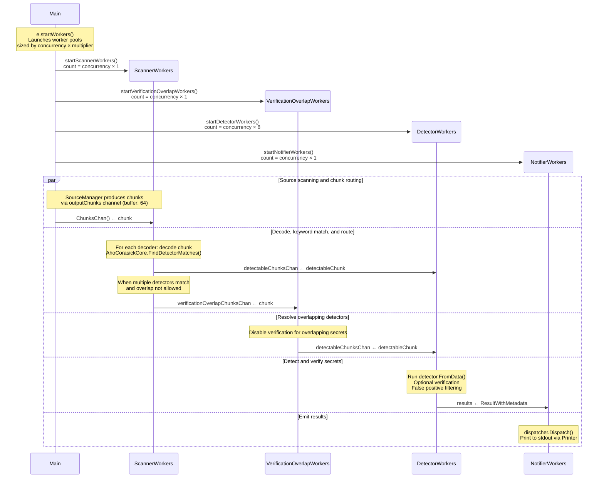
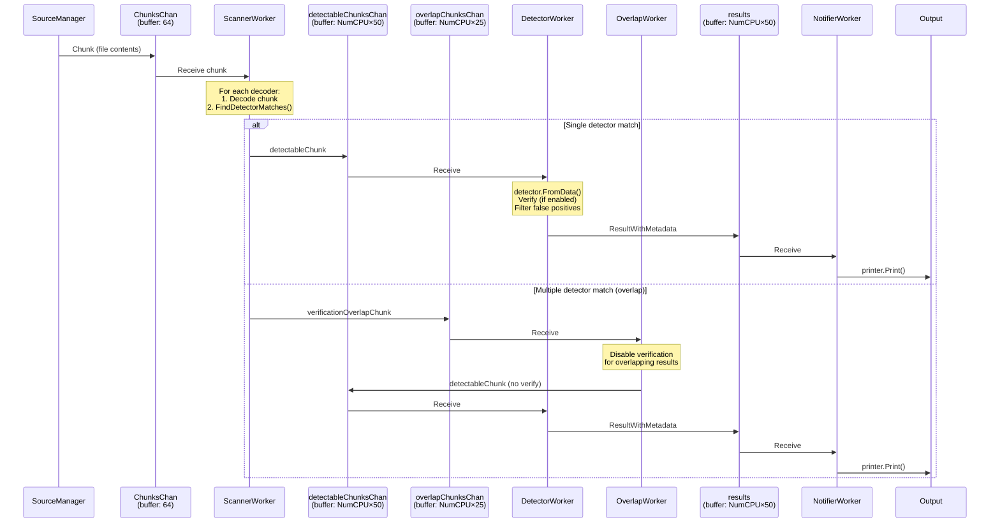
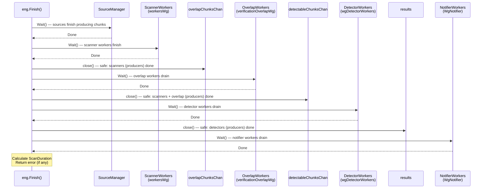

# TruffleHog v3 — Runtime Architecture and Startup Flow

## 1. Introduction and Objective

This document explains how **TruffleHog v3** actually behaves at runtime — from the moment the Go binary starts up through the completion of a scan. Rather than offering a passive file-by-file code summary, it presents a **cohesive, narrative-driven walkthrough** grounded in observable behavior: log output, initialization messages, and runtime signals produced by building and running the tool with trace-level verbosity (`--log-level=5`).

### What This Document Covers

- **Configuration handling** — how CLI flags, log levels, feature flags, and YAML custom detectors are processed before scanning begins
- **Scanning engine initialization** — how the engine assembles its defaults, builds the Aho-Corasick keyword trie, allocates channels, and prepares for work
- **Detector preparation** — how 845+ secret detectors are instantiated, filtered, and organized for efficient matching
- **Component communication during a basic run** — how source chunks flow through scanner workers, detector workers, verification overlap workers, and notifier workers via buffered channels

### Methodology

All explanations are derived from **runtime observation** using trace-level logging (`--log-level=5`) on a freshly built binary, correlated with source code reading for context. Every technical claim references the specific source file and function that produces the observed behavior.

**No source files were modified during this analysis.** This is a purely observational exercise.

---

## 2. Environment Setup and Build

### Go Toolchain Requirement

TruffleHog v3 requires Go with a minimum language version of `go 1.23.1` and a toolchain version of `go1.24.2`, as specified in the module definition.

> Source: `go.mod:L3-L5`

```
go 1.23.1
toolchain go1.24.2
```

### Building from Source

The binary is built with CGo disabled for maximum portability:

```bash
CGO_ENABLED=0 go build -o trufflehog .
```

This produces a **~194 MB** statically-linked binary. Because no `-ldflags` are provided to set `version.BuildVersion`, the binary reports its version as `"dev"` — observable as the very first log message at startup.

### Dry-Run Scan Command

To observe the full startup and scanning lifecycle with maximum verbosity, the following command was used:

```bash
./trufflehog filesystem /tmp/test-scan \
  --no-verification --no-update --local-dev --log-level=5
```

Each flag serves a specific purpose:

| Flag | Purpose | Source Reference |
|------|---------|-----------------|
| `--no-verification` | Skips live secret verification against external services | `main.go:L59` |
| `--no-update` | Disables the auto-updater (overseer fetcher) | `main.go:L73` |
| `--local-dev` | Bypasses the `overseer` process supervision model, calling `run()` directly | `main.go:L54`, `main.go:L340-L343` |
| `--log-level=5` | Sets trace-level verbosity, enabling V(0) through V(5) log output | `main.go:L50`, `main.go:L310-L322` |

---

## 3. CLI Bootstrap and Entry Point

TruffleHog's startup sequence flows through three functions in `main.go`: `init()` → `main()` → `run()`. Each performs a distinct phase of preparation before the scanning engine takes over.

### 3.1 `init()` — Flag Normalization, TUI Detection, Command Parsing

The `init()` function executes before `main()` and handles three critical setup tasks.

**GOMAXPROCS auto-tuning** — The very first action is a call to `maxprocs.Set()` at `main.go:L260`, which automatically adjusts `GOMAXPROCS` to match container CPU limits. This is significant because `runtime.NumCPU()` is later used to size worker pools and channel buffers; in containerized environments, this call ensures the concurrency model respects cgroup constraints.

**Flag normalization** — A loop at `main.go:L262-L268` iterates over `os.Args` and replaces underscores with hyphens in any `--`-prefixed flag. This allows users to use either `--log_level` or `--log-level` interchangeably:

```go
for i, arg := range os.Args {
    if strings.HasPrefix(arg, "--") {
        split := strings.SplitN(arg, "=", 2)
        split[0] = strings.ReplaceAll(split[0], "_", "-")
        os.Args[i] = strings.Join(split, "=")
    }
}
```

> Source: `main.go:L262-L268`

**Version string** — The CLI version is set from `version.BuildVersion` at `main.go:L270`. For development builds, this is `"dev"`.

**TUI auto-launch** — At `main.go:L276-L299`, the init function checks whether to launch the interactive TUI:

1. It reads the `TUI_PARENT` environment variable to detect if this is a re-exec
2. If stdout is a terminal AND no subcommand is provided (or the `analyze` subcommand), it launches `tui.Run()`
3. On success, it re-executes via `syscall.Exec` with `TUI_PARENT=true` to prevent recursive TUI launches
4. As a fallback, it overwrites `os.Args` with the TUI-generated arguments

For our observation run, we bypass the TUI entirely by providing the `filesystem` subcommand directly.

**Command parsing** — At `main.go:L301`, `kingpin.MustParse(cli.Parse(os.Args[1:]))` parses the resolved CLI arguments. This is the `kingpin/v2` library (`github.com/alecthomas/kingpin/v2`) that handles all flag definitions declared as package-level variables (lines 46–256 of `main.go`).

**Log level configuration** — Immediately after parsing, at `main.go:L304-L323`, the log level is determined:

- `--trace` → level 5 (ultimate verbosity)
- `--debug` → level 2 (debugging)
- `--log-level=N` → level N (validated: -1 to 5)
- Level `-1` → disables logging by passing -5 to the zap backend (fatal-only)

The `log.SetLevel()` call at `pkg/log/level.go:L21-L23` invokes `SetLevelForControl()`, which **negates** the user-facing level before passing it to zap. This inversion is necessary because zap's verbosity increases as numbers decrease — so user level 5 becomes zap level -5, enabling `V(0)` through `V(5)`.

> Source: `pkg/log/level.go:L26-L31`

```go
func SetLevelForControl(control levelSetter, level int8) {
    control.SetLevel(zapcore.Level(-level))
}
```

### 3.2 `main()` — Logger Creation and Overseer Decision

The `main()` function at `main.go:L330-L368` creates the production logger and decides whether to use process supervision.

**Logger creation** — At `main.go:L332-L338`:

```go
logFormat := log.WithConsoleSink
if *jsonOut {
    logFormat = log.WithJSONSink
}
logger, sync := log.New("trufflehog", logFormat(os.Stderr, log.WithGlobalRedaction()))
context.SetDefaultLogger(logger)
```

This creates a named `"trufflehog"` logger using `log.New()` from `pkg/log/log.go:L28-L55`. The logger:
- Uses a **console-encoded sink** writing to stderr by default (or a JSON-encoded sink if `--json` is specified)
- Applies **global redaction** via `log.WithGlobalRedaction()` to filter sensitive values from log output
- Is installed as the **default context logger** via `context.SetDefaultLogger()` — ensuring all subsequent `context.Background().Logger()` calls return this logger

> Source: `pkg/log/log.go:L28-L55`, `pkg/context/context.go:L47-L52`

**The `--local-dev` bypass** — At `main.go:L340-L343`:

```go
if *localDev {
    run(overseer.State{})
    os.Exit(0)
}
```

When `--local-dev` is set, the `run()` function is called directly with an empty `overseer.State{}`, completely bypassing the `overseer` process supervision model. This is the path used during development and in our observation run.

**Overseer setup (production path)** — Without `--local-dev`, at `main.go:L348-L367`, an `overseer.Config` is constructed with:
- `Program: run` — the `run` function as the supervised program
- `RestartSignal: syscall.SIGTERM` — SIGTERM triggers restart
- If `--no-update` is NOT set and the version is NOT `"dev"`, an `updater.Fetcher` is configured for binary auto-updates
- `overseer.RunErr(updateCfg)` wraps the `run` function in a supervised process that can be gracefully restarted

> Source: `main.go:L348-L367`

### 3.3 `run()` — Scan Lifecycle Orchestration

The `run()` function at `main.go:L381-L580` is the heart of TruffleHog's lifecycle. It orchestrates everything from context creation through scan execution to final metrics reporting.

**Context creation** — At `main.go:L383`:

```go
ctx, cancel := context.WithCancelCause(context.Background())
```

This creates a logging-aware context from `pkg/context/context.go:L72-L80` that propagates the default logger to all downstream components.

**Temporary artifact cleanup** — A background goroutine at `main.go:L386-L390` calls `cleantemp.CleanTempArtifacts(ctx)` to remove stale temporary files from previous runs.

**Signal handling** — At `main.go:L395-L408`, a signal handler listens for `SIGINT`, `SIGTERM`, and `SIGQUIT`:

```go
killSignal := make(chan os.Signal, 1)
signal.Notify(killSignal, syscall.SIGINT, syscall.SIGTERM, syscall.SIGQUIT)
go func() {
    <-killSignal
    logger.Info("Received signal, shutting down.")
    cancel(fmt.Errorf("canceling context due to signal"))
    // ... cleanup and os.Exit(0)
}()
```

**Version announcement** — At `main.go:L410`:

```go
logger.V(2).Info(fmt.Sprintf("trufflehog %s", version.BuildVersion))
```

This is the **first visible log message** at verbosity ≥2, and it is indeed the first line we see in our trace output:

```
2026-04-09T22:31:36Z  info-2  trufflehog  trufflehog dev
```

**Feature flag initialization** — At `main.go:L441-L458`, atomic feature flags are set from CLI flags:

```go
if *forceSkipBinaries { feature.ForceSkipBinaries.Store(true) }
if *forceSkipArchives { feature.ForceSkipArchives.Store(true) }
if *skipAdditionalRefs { feature.SkipAdditionalRefs.Store(true) }
if *userAgentSuffix != "" { feature.UserAgentSuffix.Store(*userAgentSuffix) }
feature.EnableAPKHandler.Store(true) // Always on in OSS
```

> Source: `main.go:L441-L458`, `pkg/feature/feature.go:L5-L11`

**YAML config loading** — At `main.go:L460-L467`, if a `--config` file is specified, `config.Read()` reads it and `config.NewYAML()` parses it via `protoyaml.UnmarshalStrict()` into custom `WebhookCustomRegex` detectors.

> Source: `pkg/config/config.go:L17-L45`

**Printer selection** — At `main.go:L486-L495`, the output printer is chosen based on flags:
- `--json-legacy` → `LegacyJSONPrinter`
- `--json` → `JSONPrinter`
- `--github-actions` → `GitHubActionsPrinter`
- Default → `PlainPrinter`

**TruffleHog banner** — At `main.go:L497-L498`, for non-JSON output:

```
🐷🔑🐷  TruffleHog. Unearth your secrets. 🐷🔑🐷
```

**Engine configuration** — At `main.go:L513-L533`, the `engine.Config` is assembled:
- `Concurrency`: defaults to `runtime.NumCPU()` (set at `main.go:L58`)
- `Detectors`: `defaults.DefaultDetectors()` **plus** any custom detectors from the config file (`main.go:L519`)
- All remaining fields mapped from CLI flags

**Scan execution** — At `main.go:L546`, `runSingleScan()` is called, which creates the `SourceManager`, builds the engine, starts it, runs the source-specific scan, and then calls `eng.Finish()`.

---

## 4. Configuration Handling

### 4.1 Log Level Configuration

TruffleHog uses a 7-level verbosity scale, documented in `CONTRIBUTING.md:L29-L37`:

| Level | Description | When to Use |
|-------|-------------|-------------|
| 0 | Logs we always want to see | Critical operational messages |
| 1 | Logs we could possibly want to turn off | Routine operational messages |
| 2 | Logs useful for debugging | Debug-level diagnostics |
| 3 | Frequently called logs that may produce a lot of output | High-frequency operations |
| 4 | Extremely verbose logs or logs containing sensitive information | Engine internals |
| 5 | Ultimate verbosity | Full trace output |
| -1 | Logging disabled | Silent mode |

**The zap level inversion**: TruffleHog uses the `go-logr/zapr` bridge, where zap's levels get more verbose as numbers decrease. The `SetLevelForControl` function at `pkg/log/level.go:L30` negates the user-facing level:

- User sets `--log-level=5` → `SetLevel(5)` → zap level becomes `-5`
- This enables `V(0)` through `V(5)` — all verbosity levels

The **log encoding format** is determined by the sink selection in `main()`:
- Console sink (`pkg/log/log.go:L104-L111`): human-readable format with `info-N` level labels
- JSON sink (`pkg/log/log.go:L94-L101`): structured JSON output

The level label encoding at `pkg/log/log.go:L118-L124` formats non-error levels as `info-N` where N is the absolute verbosity:

```go
enc.AppendString(fmt.Sprintf("info-%d", -int8(level)))
```

This is why we see `info-2`, `info-4`, `info-0` in the trace output.

### 4.2 Feature Flag Initialization

TruffleHog uses an atomic feature flag system defined in `pkg/feature/feature.go`:

| Flag | Type | Purpose | Default |
|------|------|---------|---------|
| `ForceSkipBinaries` | `atomic.Bool` | Skip binary file scanning | `false` |
| `ForceSkipArchives` | `atomic.Bool` | Skip archive file scanning | `false` |
| `SkipAdditionalRefs` | `atomic.Bool` | Skip additional git references | `false` |
| `EnableAPKHandler` | `atomic.Bool` | Enable APK handler | **`true`** (hardcoded in OSS) |
| `UserAgentSuffix` | `AtomicString` | Custom User-Agent suffix | `""` |

These flags are set in `run()` at `main.go:L441-L458` **before** engine initialization, ensuring they take effect for the entire scan lifecycle. The `AtomicString` type provides thread-safe string operations via `sync/atomic.Value`.

> Source: `pkg/feature/feature.go:L5-L35`

### 4.3 YAML Custom Detector Loading

When a `--config` file is provided, TruffleHog loads custom detectors through a two-stage pipeline:

1. **`config.Read(filename)`** at `pkg/config/config.go:L18-L24` reads the file from disk
2. **`config.NewYAML(input)`** at `pkg/config/config.go:L27-L45` performs strict YAML parsing:
   - Parses via `protoyaml.UnmarshalStrict()` into a `custom_detectorspb.CustomDetectors` protobuf message
   - Converts each detector configuration into a `WebhookCustomRegex` detector via `custom_detectors.NewWebhookCustomRegex()`
3. The resulting detectors are **appended** to the default detector list at `main.go:L519`:

```go
Detectors: append(defaults.DefaultDetectors(), conf.Detectors...),
```

The strict YAML parsing ensures that any unrecognized fields cause an error, preventing silent misconfiguration.

---

## 5. Engine Initialization

### 5.1 `NewEngine()` — Defaults and Detector Assembly

`NewEngine()` at `pkg/engine/engine.go:L226-L328` is the factory function that constructs a fully configured scanning engine. Its execution is a carefully sequenced pipeline:

1. **Struct creation** (L229-L247) — The `Engine` struct is populated from the `Config`, including concurrency, decoders, detectors, dispatcher, and all behavioral flags.

2. **Source manager validation** (L248-L250) — Returns an error if `SourceManager` is nil. This is a hard requirement because the engine cannot scan without a source.

3. **`setDefaults(ctx)`** (L252) — Fills in any configuration gaps with production defaults (see Section 5.2).

4. **Detector set construction** (L255-L258) — `buildDetectorSets(cfg)` parses the `--include-detectors` and `--exclude-detectors` flags via `config.ParseDetectors()` into include/exclude sets.

5. **Filter application** (L260-L305) — `applyFilters()` applies three types of filters to the detector list:
   - Include filter: keeps only detectors in the include set
   - Exclude filter: removes detectors in the exclude set
   - Custom verifier endpoints: configures endpoint customization for detectors that support it

6. **`initialize(ctx)`** (L323) — Sets up internal data structures (see Section 5.2).

> Source: `pkg/engine/engine.go:L226-L328`

### 5.2 `setDefaults()` — Populating Production Defaults

`setDefaults()` at `pkg/engine/engine.go:L336-L374` ensures the engine is robust to incomplete configuration:

| Property | Default Value | Rationale |
|----------|---------------|-----------|
| `concurrency` | `runtime.NumCPU()` | Match available CPU cores |
| `detectorWorkerMultiplier` | `8` | "bound by net i/o" — detector workers spend time waiting on network, so more workers per CPU are efficient |
| `notificationWorkerMultiplier` | `1` | Notification is lightweight (just printing) |
| `verificationOverlapWorkerMultiplier` | `1` | Overlap resolution is infrequent |
| `decoders` | `decoders.DefaultDecoders()` | UTF-8, Base64, UTF-16, EscapedUnicode |
| `detectors` | `defaults.DefaultDetectors()` | 845+ built-in secret detectors |
| `dispatcher` | `PlainPrinter` | Console output |
| Notify flags | all `true` | Show verified, unverified, and unknown results |

**Observable log**: At the end of `setDefaults()`, line L373:

```
info-4  trufflehog  default engine options set
```

> Source: `pkg/engine/engine.go:L336-L374`

### 5.3 `initialize()` — Channels, Cache, and Aho-Corasick Trie

`initialize()` at `pkg/engine/engine.go:L489-L534` builds the engine's internal plumbing:

**LRU dedup cache** (L491-L496) — A 512-entry LRU cache (`github.com/hashicorp/golang-lru/v2`) prevents duplicate results from being emitted.

**Channel allocation** (L497-L519) — Three buffered channels are created with sizes proportional to `defaultChannelBuffer` (`runtime.NumCPU()`, defined at L627):

```go
const (
    detectableChunksChanMultiplier             = 50
    verificationOverlapChunksChanMultiplier     = 25
    resultsChanMultiplier                       = detectableChunksChanMultiplier // 50
)
```

**Observable logs** (L521, L529, L531) — Three log messages mark initialization progress:

```
info-4  trufflehog  engine initialized
info-4  trufflehog  setting up aho-corasick core
info-4  trufflehog  set up aho-corasick core
```

**Aho-Corasick trie construction** (L529-L531) — The `ahocorasick.NewAhoCorasickCore(e.detectors)` call builds an Aho-Corasick automaton from all detector keywords for efficient multi-pattern matching (detailed in Section 7.3).

### 5.4 Observed Log Messages During Initialization

The following log messages appear in order during initialization, providing a clear picture of the engine coming online:

| Order | Log Level | Message | Source | Phase |
|-------|-----------|---------|--------|-------|
| 1 | V(2) | `trufflehog dev` | `main.go:L410`, `run()` | Version announcement |
| 2 | V(4) | `default engine options set` | `engine.go:L373`, `setDefaults()` | Engine defaults |
| 3 | V(4) | `engine initialized` | `engine.go:L521`, `initialize()` | Channel/cache setup |
| 4 | V(4) | `setting up aho-corasick core` | `engine.go:L529`, `initialize()` | Trie construction start |
| 5 | V(4) | `set up aho-corasick core` | `engine.go:L531`, `initialize()` | Trie construction complete |

Note that messages 2–5 are at V(4) and only appear with `--log-level=4` or higher. The version announcement at V(2) is visible with `--debug` or `--log-level=2`.

---

## 6. Scanning Engine Startup

### 6.1 `eng.Start()` — Worker Pool Launch

`Start()` at `pkg/engine/engine.go:L621-L625` activates the processing pipeline:

```go
func (e *Engine) Start(ctx context.Context) {
    e.metrics = runtimeMetrics{Metrics: Metrics{scanStartTime: time.Now()}}
    e.sanityChecks(ctx)
    e.startWorkers(ctx)
}
```

1. **Metrics initialization** — Records the scan start time for duration calculation
2. **Sanity checks** (L632-L641) — Detects duplicate detector configurations by iterating the detector list and logging warnings for non-CustomRegex duplicates
3. **Worker startup** — Launches all four worker pools via `startWorkers(ctx)` at L646-L660

> Source: `pkg/engine/engine.go:L621-L625`

### 6.2 Worker Sizing Formula and Observed Counts

`startWorkers()` at `pkg/engine/engine.go:L646-L660` launches workers in a specific order:

```go
func (e *Engine) startWorkers(ctx context.Context) {
    e.startScannerWorkers(ctx)      // L648
    e.startDetectorWorkers(ctx)     // L651
    e.startVerificationOverlapWorkers(ctx) // L655
    e.startNotifierWorkers(ctx)     // L659
}
```

Each worker type has a formula based on `concurrency` (which defaults to `runtime.NumCPU()`):

| Worker Type | Formula | Multiplier | Observed Count (128 CPU) | Log Message (V2) |
|-------------|---------|------------|--------------------------|-------------------|
| Scanner | `concurrency × 1` | 1 | 128 | `starting scanner workers {"count": 128}` |
| Detector | `concurrency × detectorWorkerMultiplier` | 8 | 1024 | `starting detector workers {"count": 1024}` |
| VerificationOverlap | `concurrency × verificationOverlapWorkerMultiplier` | 1 | 128 | `starting verificationOverlap workers {"count": 128}` |
| Notifier | `concurrency × notificationWorkerMultiplier` | 1 | 128 | `starting notifier workers {"count": 128}` |

All four worker log messages appear at V(2) and include a `"count"` field showing the number of workers launched. On an 8-CPU system, the counts would be 8, 64, 8, and 8 respectively.

> Source: `pkg/engine/engine.go:L662-L717`

### 6.3 Channel Architecture and Buffer Sizing

The channels connecting these workers are sized proportionally to `defaultChannelBuffer` (`runtime.NumCPU()`):

| Channel | Formula | Buffer Size (128 CPU) | Buffer Size (8 CPU) | Purpose |
|---------|---------|----------------------|---------------------|---------|
| `outputChunks` (ChunksChan) | `defaultOutputBufferSize` (hardcoded 64) | 64 | 64 | Source → Scanner workers |
| `detectableChunksChan` | `NumCPU × 50` | 6400 | 400 | Scanner → Detector workers |
| `verificationOverlapChunksChan` | `NumCPU × 25` | 3200 | 200 | Scanner → Overlap workers |
| `results` | `NumCPU × 50` | 6400 | 400 | Detector → Notifier workers |

The `outputChunks` channel buffer size is set at `main.go:L672`:
```go
const defaultOutputBufferSize = 64
```

The other channels are allocated in `initialize()` at `engine.go:L515-L519`.

> Source: `pkg/engine/engine.go:L489-L519`, `main.go:L672-L678`

---

## 7. Detector Preparation

### 7.1 `DefaultDetectors()` — 845+ Scanner Instantiation

`defaults.DefaultDetectors()` from `pkg/engine/defaults/defaults.go` returns a slice of 845+ detector instances. The `buildDetectorList()` function instantiates each detector scanner, including special initialization for detectors implementing two key interfaces:

- **`detectors.EndpointCustomizer`** — Allows detectors to accept custom verification endpoints (e.g., for self-hosted API instances)
- **`detectors.CloudProvider`** — Enables cloud-specific initialization for detectors that verify against cloud APIs

Each detector provides:
- A `Type()` identifying the detector (e.g., `DetectorType_AWS`)
- `Keywords()` for Aho-Corasick trie registration
- `FromData()` for secret extraction and optional verification

The exact detector count depends on the codebase version, as new detectors are regularly added.

> Source: `pkg/engine/defaults/defaults.go`

### 7.2 Detector Filtering (Include/Exclude)

After instantiation, detectors pass through a filtering pipeline:

1. **`buildDetectorSets()`** at `engine.go:L376-L400` — Parses `--include-detectors` and `--exclude-detectors` via `config.ParseDetectors()` from `pkg/config/detectors.go:L61-L86`

2. **`ParseDetectors()`** accepts comma-separated input that can be:
   - The special group `"all"` (default for `--include-detectors`, per `main.go:L81`)
   - Case-insensitive protobuf detector names
   - Numeric detector type IDs
   - Ranges (e.g., `1-10`)

3. **`applyFilters()`** at `engine.go:L470-L474` applies filters sequentially:
   - Include filter: keeps only matching detectors
   - Exclude filter: removes matching detectors
   - Custom verifier endpoints: configures endpoint customization

> Source: `pkg/config/detectors.go:L61-L86`, `pkg/engine/engine.go:L376-L400`

### 7.3 Aho-Corasick Core Construction

The Aho-Corasick prefilter is the critical optimization that makes scanning 845+ detectors efficient. Instead of running every detector's regex against every chunk, TruffleHog first performs a **keyword scan** using an Aho-Corasick automaton to determine which detectors are potentially relevant.

`NewAhoCorasickCore()` at `pkg/engine/ahocorasick/ahocorasickcore.go:L141-L168`:

1. Iterates all detectors, collecting their lowercase keywords
2. Builds a `keywordsToDetectors` map (keyword → `[]DetectorKey`)
3. Builds a `detectorsByKey` map (`DetectorKey` → detector instance)
4. Constructs an Aho-Corasick trie from all keywords using `ahocorasick.NewTrieBuilder().AddStrings(keywords).Build()`

The **`DetectorKey`** struct at L14-L25 uniquely identifies a detector:

```go
type DetectorKey struct {
    detectorType       detectorspb.DetectorType
    version            int
    customDetectorName string
}
```

The **`spanCalculator`** interface (L43-L45) controls how much of the chunk is passed to a matched detector:
- **`EntireChunkSpanCalculator`** (L57-L63) — Passes the entire chunk (used when `--scan-entire-chunk` is set)
- **`adjustableSpanCalculator`** (L68-L111) — Passes a window around the keyword match with a default radius of 512 bytes, adjustable per-detector via `MultiPartCredentialProvider`, `MaxSecretSizeProvider`, and `StartOffsetProvider` interfaces

> Source: `pkg/engine/ahocorasick/ahocorasickcore.go:L14-L168`

### 7.4 Decoder Chain

`DefaultDecoders()` at `pkg/decoders/decoders.go:L8-L16` returns four decoders in a specific order:

| Order | Decoder | Type | Purpose |
|-------|---------|------|---------|
| 1 | `UTF8` | Plain text | **Must be first** — establishes the baseline for duplicate detection |
| 2 | `Base64` | Base64-encoded | Decodes base64-encoded content to expose embedded secrets |
| 3 | `UTF16` | UTF-16 encoded | Handles UTF-16 encoded text (common in Windows environments) |
| 4 | `EscapedUnicode` | Escaped Unicode | Handles `\uXXXX` escape sequences |

```go
func DefaultDecoders() []Decoder {
    return []Decoder{
        // UTF8 must be first for duplicate detection
        &UTF8{},
        &Base64{},
        &UTF16{},
        &EscapedUnicode{},
    }
}
```

**Why UTF-8 must be first**: The comment at L10 explains that UTF-8 must be the first decoder to enable deduplication. When a chunk is processed, each decoder attempts to decode it. By processing UTF-8 first, the engine establishes a canonical representation that subsequent decoders can be compared against to avoid emitting duplicate results from different decoded representations of the same data.

The **`Decoder` interface** at L25-L28:
```go
type Decoder interface {
    FromChunk(chunk *sources.Chunk) *DecodableChunk
    Type() detectorspb.DecoderType
}
```

`FromChunk()` returns `nil` if the decoder doesn't understand the chunk, allowing the scanner worker to skip non-applicable decoders silently.

> Source: `pkg/decoders/decoders.go:L8-L28`

---

## 8. Component Communication During a Scan

### 8.1 Source Manager — Unit Enumeration and Chunking

The `SourceManager` from `pkg/sources/source_manager.go` orchestrates how data flows into the scanning pipeline.

**Creation** — `NewManager()` at L107-L120 initializes with functional options:

```go
opts := []func(*sources.SourceManager){
    sources.WithConcurrentSources(cfg.Concurrency),
    sources.WithConcurrentUnits(cfg.Concurrency),
    sources.WithSourceUnits(),
    sources.WithBufferedOutput(defaultOutputBufferSize), // 64
}
cfg.SourceManager = sources.NewManager(opts...)
```

> Source: `main.go:L672-L686`

**Enumeration** — `EnumerateAndScan()` at `source_manager.go:L129-L170`:
1. Performs preflight checks
2. Acquires a semaphore slot (limiting concurrent sources)
3. Spawns a goroutine that calls `s.run()` to execute the source

**The Source → Unit → Chunk model** (from `docs/process_flow.md`):
- **Source**: A top-level data location (filesystem, git repository, GitHub org, etc.)
- **Unit**: A natural subdivision (directory for filesystem, repository for GitHub)
- **Chunk**: The smallest scannable unit (file contents, git diff hunks)

For a filesystem scan, directories are units and file contents are chunks.

**Observable log messages** during source execution:

```
info-0  trufflehog  running source       {"source_manager_worker_id": "...", "with_units": true}
info-2  trufflehog  enumerating source   {"source_manager_worker_id": "..."}
```

### 8.2 Scanner Workers — Decoding and Keyword Matching

`scannerWorker()` at `pkg/engine/engine.go:L777-L841` is the first processing stage for each chunk:

```
ChunksChan → [scannerWorker] → detectableChunksChan / verificationOverlapChunksChan
```

The per-chunk processing loop:

1. **Receive** a chunk from `e.ChunksChan()` (the `outputChunks` channel from SourceManager)
2. **For each decoder** in `e.decoders`:
   a. Attempt `decoder.FromChunk(chunk)` — returns nil if decoder doesn't apply
   b. If decoded: call `e.AhoCorasickCore.FindDetectorMatches(decoded.Chunk.Data)` to find matching detectors
3. **Route based on match count**:
   - If **multiple detectors** match AND `!e.verificationOverlap`: send to `verificationOverlapChunksChan` for overlap resolution
   - Otherwise: send each detector-chunk pair to `detectableChunksChan`
4. **Update metrics**: increment `ChunksScanned` and `BytesScanned` atomic counters

When the `ChunksChan` closes (source complete), each scanner worker waits for its verification overlap and detect wait groups, then logs:

```
info-4  trufflehog  finished scanning chunks  {"scanner_worker_id": "..."}
```

> Source: `pkg/engine/engine.go:L777-L841`

### 8.3 Detector Workers — Secret Verification

Detector workers consume from `detectableChunksChan` and apply detector-specific logic:

1. **Receive** a `detectableChunk` containing the chunk data, matched detector, and decoder type
2. **Apply** the detector's `FromData()` method, which performs regex matching and optionally verifies secrets against live services
3. **Filter**: if a result is a false positive, log `"Skipping result: false positive"` with the `reason` field
4. **Emit**: valid results are sent to `e.results` channel as `detectors.ResultWithMetadata`

When `--no-verification` is set, the `Verify` flag on each chunk is false, and detectors skip the verification step.

> Source: `pkg/engine/engine.go` — detector worker implementation

### 8.4 Verification Overlap Workers

When multiple detectors match the same chunk and `--allow-verification-overlap` is NOT set, the chunk is routed to verification overlap workers instead of directly to detector workers:

1. **Receive** from `verificationOverlapChunksChan`
2. **Disable verification** for the overlapping secrets — using the `errOverlap` message at `engine.go:L39-L42`:

```go
var errOverlap = errors.New(
    "More than one detector has found this result. For your safety, verification has been disabled." +
    "You can override this behavior by using the --allow-verification-overlap flag.",
)
```

3. **Forward** resolved chunks to `detectableChunksChan` for normal detector processing

This safety mechanism prevents the same secret from being verified by multiple detectors simultaneously, which could generate suspicious multi-source API calls.

> Source: `pkg/engine/engine.go:L39-L42`

### 8.5 Notifier Workers — Result Emission

Notifier workers are the final stage of the pipeline:

1. **Receive** from `e.results` channel
2. **Dispatch** via `e.dispatcher.Dispatch(ctx, result)`, which calls the configured `Printer`:
   - `PlainPrinter` → formatted text to stdout
   - `JSONPrinter` → JSON-encoded output to stdout
   - `GitHubActionsPrinter` → GitHub Actions annotation format
   - `LegacyJSONPrinter` → pre-v3.0 JSON format

### 8.6 False Positive Filtering (Observed)

When scanning files that contain common patterns (like test data with placeholder secrets), both detector and verification overlap workers produce observable log messages:

```
info-2  trufflehog  Skipping result: false positive  {"reason": "contains term: abcde"}
```

The `reason` field indicates the specific false positive filter that triggered. Common filters include matching against known placeholder terms and entropy checks.

---

## 9. Scan Completion and Shutdown

### 9.1 `eng.Finish()` — Cascading Close Sequence

`Finish()` at `pkg/engine/engine.go:L723-L742` orchestrates a precise, ordered shutdown that ensures no data is lost:

```go
func (e *Engine) Finish(ctx context.Context) error {
    defer common.RecoverWithExit(ctx)
    err := e.sourceManager.Wait()                    // 1. Wait for sources
    e.workersWg.Wait()                               // 2. Wait for scanner workers
    close(e.verificationOverlapChunksChan)            // 3. Close overlap channel
    e.verificationOverlapWg.Wait()                    // 4. Wait for overlap workers
    close(e.detectableChunksChan)                     // 5. Close detectable chunks channel
    e.wgDetectorWorkers.Wait()                        // 6. Wait for detector workers
    close(e.results)                                  // 7. Close results channel
    e.WgNotifier.Wait()                               // 8. Wait for notifier workers
    e.metrics.ScanDuration = time.Since(e.metrics.scanStartTime) // 9. Calculate duration
    return err
}
```

The **cascading close order** is critical:

| Step | Action | Why |
|------|--------|-----|
| 1 | `sourceManager.Wait()` | Sources must finish producing chunks before scanner workers can know they're done |
| 2 | `workersWg.Wait()` | Scanner workers must finish before their downstream channels are closed |
| 3 | `close(verificationOverlapChunksChan)` | Safe to close because scanner workers (the only producers) have finished |
| 4 | `verificationOverlapWg.Wait()` | Overlap workers must drain before they can feed into `detectableChunksChan` |
| 5 | `close(detectableChunksChan)` | Safe to close because both scanner workers and overlap workers have finished |
| 6 | `wgDetectorWorkers.Wait()` | Detector workers must drain before the results channel is closed |
| 7 | `close(results)` | Safe to close because detector workers (the only producers) have finished |
| 8 | `WgNotifier.Wait()` | Notifier workers must finish printing all results |
| 9 | Calculate `ScanDuration` | Final timing measurement |

> Source: `pkg/engine/engine.go:L723-L742`

### 9.2 Final Metrics and Summary

After `Finish()` returns, `run()` at `main.go:L566-L574` logs the final summary:

```go
logger.Info("finished scanning",
    "chunks", metrics.ChunksScanned,
    "bytes", metrics.BytesScanned,
    "verified_secrets", metrics.VerifiedSecretsFound,
    "unverified_secrets", metrics.UnverifiedSecretsFound,
    "scan_duration", metrics.ScanDuration.String(),
    "trufflehog_version", version.BuildVersion,
    "verification_caching", verificationCacheMetricsSnapshot,
)
```

The **verification cache metrics** reported at `main.go:L551-L563`:

| Metric | Description |
|--------|-------------|
| `Hits` | Number of verification results served from cache |
| `Misses` | Number of cache misses requiring fresh verification |
| `HitsWasted` | Cache hits where the result was not useful |
| `AttemptsSaved` | Verification attempts avoided due to caching |
| `VerificationTimeSpentMS` | Total time spent on verification in milliseconds |

Observed in our trace output:

```
info-0  trufflehog  finished scanning  {"chunks": 0, "bytes": 0, "verified_secrets": 0,
  "unverified_secrets": 0, "scan_duration": "4.236196ms", "trufflehog_version": "dev",
  "verification_caching": {"Hits":0,"Misses":0,"HitsWasted":0,"AttemptsSaved":0,
  "VerificationTimeSpentMS":0}}
```

---

## 10. Annotated Log Trace (Full Example)

The following is a complete trace-level log output from a filesystem dry-run scan of an empty test directory, annotated with the source file, function, lifecycle phase, and behavioral significance of each message.

```
2026-04-09T22:31:36Z  info-2  trufflehog  trufflehog dev
```
↳ **Source**: `main.go:L410`, `run()`
↳ **Phase**: Version announcement
↳ **Significance**: First visible log message at V(2). Confirms the binary version is `"dev"` (no ldflags set). This is the earliest observable signal that `run()` has been entered.

```
🐷🔑🐷  TruffleHog. Unearth your secrets. 🐷🔑🐷
```
↳ **Source**: `main.go:L498`, `run()`
↳ **Phase**: Banner output
↳ **Significance**: Written directly to stderr via `fmt.Fprintf`. Only appears for non-JSON output modes.

```
2026-04-09T22:31:36Z  info-4  trufflehog  default engine options set
```
↳ **Source**: `pkg/engine/engine.go:L373`, `setDefaults()`
↳ **Phase**: Engine initialization — defaults
↳ **Significance**: Confirms that `setDefaults()` has completed. At this point, the engine has concurrency set, decoder/detector lists populated, and multipliers configured.

```
2026-04-09T22:31:36Z  info-4  trufflehog  engine initialized
```
↳ **Source**: `pkg/engine/engine.go:L521`, `initialize()`
↳ **Phase**: Engine initialization — channels and cache
↳ **Significance**: The LRU dedup cache (512 entries) and all buffered channels (`detectableChunksChan`, `verificationOverlapChunksChan`, `results`) have been allocated.

```
2026-04-09T22:31:36Z  info-4  trufflehog  setting up aho-corasick core
```
↳ **Source**: `pkg/engine/engine.go:L529`, `initialize()`
↳ **Phase**: Engine initialization — trie construction start
↳ **Significance**: The Aho-Corasick prefilter trie construction is about to begin. This involves collecting keywords from all 845+ detectors and building the automaton.

```
2026-04-09T22:31:36Z  info-4  trufflehog  set up aho-corasick core
```
↳ **Source**: `pkg/engine/engine.go:L531`, `initialize()`
↳ **Phase**: Engine initialization — trie construction complete
↳ **Significance**: The trie is built and ready for keyword matching. The engine is now fully initialized.

```
2026-04-09T22:31:36Z  info-2  trufflehog  starting scanner workers    {"count": 128}
```
↳ **Source**: `pkg/engine/engine.go:L663`, `startScannerWorkers()`
↳ **Phase**: Worker pool launch
↳ **Significance**: 128 scanner worker goroutines spawned (= `runtime.NumCPU()` on this 128-CPU system). Each will read from `ChunksChan()`.

```
2026-04-09T22:31:36Z  info-2  trufflehog  starting detector workers   {"count": 1024}
```
↳ **Source**: `pkg/engine/engine.go:L678`, `startDetectorWorkers()`
↳ **Phase**: Worker pool launch
↳ **Significance**: 1024 detector worker goroutines (128 × 8 multiplier). The 8× multiplier reflects that detector workers are network-I/O bound during verification.

```
2026-04-09T22:31:36Z  info-2  trufflehog  starting verificationOverlap workers  {"count": 128}
```
↳ **Source**: `pkg/engine/engine.go:L693`, `startVerificationOverlapWorkers()`
↳ **Phase**: Worker pool launch
↳ **Significance**: 128 overlap workers (128 × 1 multiplier). These handle the less common case of multi-detector chunk matches.

```
2026-04-09T22:31:36Z  info-2  trufflehog  starting notifier workers   {"count": 128}
```
↳ **Source**: `pkg/engine/engine.go:L708`, `startNotifierWorkers()`
↳ **Phase**: Worker pool launch
↳ **Significance**: 128 notifier workers (128 × 1 multiplier). These dispatch results to the configured printer.

```
2026-04-09T22:31:36Z  info-0  trufflehog  running source  {"source_manager_worker_id": "cpSGc", "with_units": true}
```
↳ **Source**: `pkg/sources/source_manager.go`, source execution
↳ **Phase**: Source scanning
↳ **Significance**: The source manager has acquired a semaphore slot and is now running the filesystem source. `"with_units": true` confirms source unit enumeration is enabled.

```
2026-04-09T22:31:36Z  info-2  trufflehog  enumerating source  {"source_manager_worker_id": "cpSGc"}
```
↳ **Source**: `pkg/sources/source_manager.go`, source enumeration
↳ **Phase**: Source scanning — enumeration
↳ **Significance**: The filesystem source is enumerating units (directories) within the scan target. For our empty directory, this completes instantly.

```
2026-04-09T22:31:36Z  info-4  trufflehog  finished scanning chunks  {"scanner_worker_id": "..."}
```
↳ **Source**: `pkg/engine/engine.go:L840`, `scannerWorker()`
↳ **Phase**: Scanner worker completion
↳ **Significance**: This message repeats 128 times (once per scanner worker) as each worker drains its channel and exits. Each includes a unique `scanner_worker_id`.

```
2026-04-09T22:31:36Z  info-0  trufflehog  finished scanning  {"chunks": 0, "bytes": 0,
  "verified_secrets": 0, "unverified_secrets": 0, "scan_duration": "4.236196ms",
  "trufflehog_version": "dev", "verification_caching": {"Hits":0,"Misses":0,
  "HitsWasted":0,"AttemptsSaved":0,"VerificationTimeSpentMS":0}}
```
↳ **Source**: `main.go:L566-L574`, `run()`
↳ **Phase**: Scan completion — final metrics
↳ **Significance**: The entire scan completed in ~4ms. Zero chunks were scanned (empty directory). All verification cache metrics are zero because `--no-verification` was used. This is the final log message before the process exits.

---

## Mermaid Diagrams

### Diagram 1: Startup Flow Chart

```mermaid
flowchart TD
    Init["init()"]
    MaxProcs["maxprocs.Set()<br/>Auto-tune GOMAXPROCS"]
    FlagNorm["Flag Normalization<br/>Replace _ with - in args"]
    Version["Set CLI version string"]
    
    Init --> MaxProcs --> FlagNorm --> Version
    
    TUICheck{stdout is terminal<br/>AND no subcommand?}
    Version --> TUICheck
    TUICheck -- Yes --> TUI["tui.Run()<br/>Launch interactive TUI"]
    TUI --> ReExec["syscall.Exec with TUI_PARENT=true"]
    TUI --> FallbackArgs["Overwrite os.Args"]
    TUICheck -- No --> Parse
    ReExec --> Parse
    FallbackArgs --> Parse
    
    Parse["kingpin.MustParse()<br/>Parse CLI arguments"]
    LogLevel["Configure log level<br/>--trace/--debug/--log-level"]
    Parse --> LogLevel

    MainFn["main()"]
    LogLevel --> MainFn
    Logger["Create logger<br/>log.New('trufflehog', sink)"]
    SetDefault["context.SetDefaultLogger(logger)"]
    MainFn --> Logger --> SetDefault

    LocalDev{--local-dev?}
    SetDefault --> LocalDev
    LocalDev -- Yes --> RunDirect["run(overseer.State{})"]
    LocalDev -- No --> Overseer["overseer.RunErr(config)<br/>Supervised execution"]
    Overseer --> RunFn["run(state)"]
    RunDirect --> RunFn

    RunFn --> Ctx["Create context with cancel"]
    Ctx --> Signals["Setup signal handlers<br/>SIGINT, SIGTERM, SIGQUIT"]
    Signals --> VersionLog["logger.V(2).Info('trufflehog dev')"]
    VersionLog --> FeatureFlags["Set feature flags"]
    FeatureFlags --> ConfigLoad["Load YAML config (if --config)"]
    ConfigLoad --> PrinterSel["Select output printer"]
    PrinterSel --> Banner["Print TruffleHog banner"]
    Banner --> EngConfig["Build engine.Config"]
    EngConfig --> NewEngine["engine.NewEngine()"]
    NewEngine --> SetDefaults["setDefaults()"]
    SetDefaults --> Initialize["initialize()"]
    Initialize --> AhoCorasick["Build Aho-Corasick trie"]
    AhoCorasick --> Start["eng.Start()"]
    Start --> Workers["startWorkers()"]
```



### Diagram 2: Worker Pool Architecture



### Diagram 3: Channel Data Flow Sequence



### Diagram 4: Shutdown Cascade Sequence



---

## 11. Thinking and Rationale

This section explains the reasoning behind the architectural conclusions drawn from runtime observation.

### Why is the Detector Worker Multiplier 8×?

The comment at `pkg/engine/engine.go:L344` states the multiplier is higher than others because detector workers are **"bound by net i/o"**. During secret verification, each detector worker makes HTTP calls to external APIs (e.g., AWS, GitHub, Twilio) to confirm whether a candidate secret is live. Network round-trips dominate the execution time, so having 8× more detector workers than scanner workers ensures the pipeline doesn't bottleneck at verification — CPU cores can be time-shared across many I/O-waiting goroutines.

With `--no-verification`, this multiplier still applies because it's set as a default before the verification flag is evaluated. Even without verification, the higher count doesn't cause issues because idle goroutines consume minimal resources in Go's M:N scheduling model.

### Why Must UTF-8 Be the First Decoder?

The comment at `pkg/decoders/decoders.go:L10` says **"UTF8 must be first for duplicate detection."** The reasoning is:

1. The LRU dedup cache in `initialize()` (512 entries) tracks which results have already been emitted
2. A secret like `AKIA...` might exist as raw UTF-8 text AND as a base64-encoded string in the same chunk
3. By processing UTF-8 first, the engine establishes the "canonical" representation of the chunk
4. When subsequent decoders (Base64, UTF-16, EscapedUnicode) decode alternative representations, the dedup cache can recognize and suppress duplicates
5. If UTF-8 were processed later, the canonical representation wouldn't be established first, and deduplication would be unreliable

### Why Does the Cascading Close Order Matter?

The `Finish()` method at `engine.go:L723-L742` implements a precise producer-consumer shutdown sequence. Each channel is only closed **after all its producers have finished**:

- `verificationOverlapChunksChan` is produced by scanner workers → closed after scanner workers finish
- `detectableChunksChan` is produced by both scanner workers AND overlap workers → closed after both finish
- `results` is produced by detector workers → closed after detector workers finish

If channels were closed out of order (e.g., closing `detectableChunksChan` before overlap workers finish), it would cause **panics** from writing to a closed channel, or **data loss** from goroutines exiting prematurely. The cascading wait-then-close pattern ensures every result makes it through the pipeline before shutdown.

### Why Does the Aho-Corasick Prefilter Exist?

With 845+ detectors, running every detector's regex against every chunk would be computationally prohibitive. The Aho-Corasick algorithm provides **O(n + m)** multi-pattern matching (where n is the chunk length and m is the total match output), compared to **O(n × k)** for k individual regex scans.

Each detector provides keywords (e.g., `"AKIA"` for AWS, `"ghp_"` for GitHub). These keywords are compiled into a single trie at initialization (`NewAhoCorasickCore()` at `ahocorasickcore.go:L141-L168`). During scanning, a single pass over each chunk identifies which detectors have matching keywords, and only those detectors are activated.

The `spanCalculator` further optimizes by limiting the data passed to each detector — the `adjustableSpanCalculator` with a default 512-byte radius extracts just the relevant window around each keyword match, reducing the regex search space.

### How Does `overseer` Process Supervision Work?

The `overseer` library (forked at `github.com/trufflesecurity/overseer`) implements a parent-child process model:

1. The **parent process** (overseer) starts and monitors the child
2. The **child process** executes the `run()` function (the actual scan)
3. The parent can restart the child on `SIGTERM`
4. If auto-update is enabled, the parent can download a new binary and restart the child with the updated version

The `--local-dev` flag at `main.go:L340-L343` bypasses this entirely by calling `run(overseer.State{})` directly and exiting. This is necessary for development because:
- The overseer model adds complexity for debugging (two processes instead of one)
- Auto-updates would interfere with local development builds
- The supervised restart behavior is unnecessary in a development environment

For production (released binaries with version != `"dev"`), overseer provides graceful binary updates without manual restart — the parent detects a new version, downloads it, and restarts the child process seamlessly.

### Why is the Source Manager Channel Buffer Only 64?

The `outputChunks` channel buffer (64, at `main.go:L672`) is intentionally smaller than the detection channels (NumCPU × 50). This creates **natural backpressure**: if scanner workers can't consume chunks fast enough, the source manager blocks when the buffer fills. This prevents unbounded memory growth from fast sources (like filesystem scans) outpacing slower detector workers.

The detection channels use larger buffers (50× NumCPU) because they sit between multiple producer/consumer stages and need to absorb bursts without blocking the pipeline.
