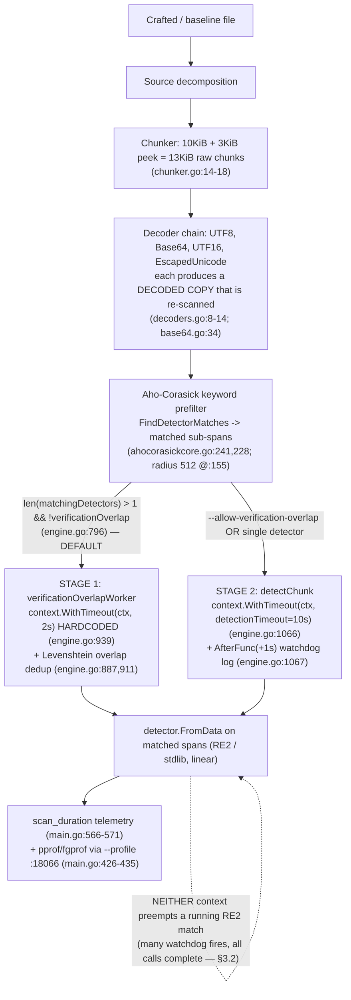

# TruffleHog Pattern-Matching Pipeline: Algorithmic-Complexity / ReDoS-Style Resource-Exhaustion Investigation

> **Scope of this document.** This is an evidence-based security investigation into whether a
> maliciously crafted file, committed to a repository that TruffleHog scans, can be used to cause
> resource exhaustion — a scan that hangs, times out, or consumes CPU/wall-clock time
> disproportionate to the input size (an algorithmic-complexity, "ReDoS-style" attack). It answers
> the five questions posed by the requester and grounds every claim in either a specific source
> reference (`file:line`) or captured runtime output.
>
> **Read-only.** No TruffleHog source file was created, modified, or deleted. The only committed
> artifact is this document. All crafted inputs, observation scripts, and profile captures were
> created outside the repository under a `mktemp` working directory and removed afterward
> (see the Appendix and the final `git status`).
>
> **Methodology — run first, then write.** Every timing, timeout, detector-firing, and profiling
> claim below was produced by building the canonical binary and scanning real inputs through the
> real CLI entry point, capturing the actual output, and only then writing the conclusion. Commands
> and unedited output are shown alongside each claim.
>
> **Single-machine reproducibility.** All measured numbers in this document come from **one host**
> (the investigation container, characterized in §2). They are the numbers that reproduce here; they
> are **not** presented as universal, machine-independent constants. Slowdown *ratios* are expected
> to be portable in order of magnitude; absolute seconds scale with core count and CPU speed. Where
> a statement is not a direct measurement it is explicitly labeled **[inferred]**, **[source]**, or
> **[external]**.

**Evidence label legend**

| Label | Meaning |
|-------|---------|
| **[observed]** | A value captured directly from runtime output on this host. |
| **[source]** | A fact read from a specific `file:line` in the TruffleHog tree at the commit under test. |
| **[external]** | A fact from an authoritative external source (RE2 docs, go-re2 docs, OWASP), cited in §4. |
| **[inferred]** | A conclusion reasoned from the above, not directly measured. Flagged so it can be challenged. |

---

## 1. TL;DR — Direct Answer

**Can a crafted file make TruffleHog hang, time out, or blow up super-linearly, blocking a security scan?**

For the single-file cases tested here, **there is no catastrophic (exponential / unbounded)
hang**: TruffleHog compiles its detector patterns with RE2-class engines that guarantee
linear-time matching, so classic catastrophic-backtracking ReDoS is not reachable through detector
regexes **[observed, §4; source go.mod:100; external §4]**. A hostile file cannot drive a single
detector regex to exponential time.

**But the answer is not a flat "no," and three qualifications matter for a CI gate:**

1. **A crafted file inflates scan time by a large, bounded factor.** At an identical 10,485,760-byte
   (10 MiB) size, a keyword-fan-out file scanned in **~9.82 s median** versus **~0.15 s** for
   equivalent-size normal prose — a **~64× slowdown on this host** (observed **52–74×** across runs;
   the sub-200 ms baseline is the noisy denominator) **[observed, §6]**. Scaled up, a 40 MiB crafted
   file took **~44 s** **[observed, §7]**. That is finite and linear, but tens of seconds for one file
   is easily enough to blow an external per-step CI wall-clock budget.

2. **The relevant timeout is not the one you would configure, and it does not preempt work.** By
   default, any chunk that matches **more than one** detector is routed to a first stage,
   `verificationOverlapWorker`, whose per-detector call runs under a **hardcoded 2-second context**
   (`context.WithTimeout(ctx, time.Second*2)`, engine.go:939) — **not** the configurable
   `--detector-timeout` (which governs only the second-stage `detectChunk`, engine.go:1066)
   **[source]**. Critically, **neither timeout preempts a running match**: with
   `--detector-timeout=1ns` (plus `--allow-verification-overlap` to force work onto the second-stage
   path) the watchdog log `"a detector ignored the context timeout"` fired **many times** (a
   load-variable count — see §3.2), yet every
   detector call still ran to completion and the scan was actually *slower* (15.5 s) **[observed,
   §3]**. The safety that does exist comes from RE2 linearity and the bounded chunk size, **not** from
   the timeouts.

3. **Several compounding paths were not exercised and are called out as untested.** These single-file
   measurements do not cover archive extraction, git-history scanning, large multi-file aggregate
   scans, or the default network-verification path. Any of these could add to wall-clock time on top
   of the per-file cost measured here. They are labeled **[untested]** wherever they appear.

**Bottom line for the CI decision.** TruffleHog will not *hang forever* on a crafted single file,
and it cannot be driven to exponential blow-up through its detector patterns. It **can** be made to
spend tens of seconds on a single small file — a bounded, linear amplification (~64× at 10 MiB on
this host) that a hostile committer could stack across many files and that is **not** cut short by
the per-detector timeouts. Treat TruffleHog's internal controls as insufficient on their own for a
hard CI time budget; wrap the scan in an **external** wall-clock/CPU/memory limit and constrain what
gets scanned (file-size/type filters, archive/history controls). See §9.

### 1.1 Bottom-line matrix

| # | Question | Verdict (this host) | Key evidence |
|---|----------|---------------------|--------------|
| Q1 | Can a crafted file hang / time out / block the scan? | **No unbounded hang; yes to a bounded multi-second-to-multi-tens-of-seconds inflation that can exceed an external CI budget. Per-detector timeouts do not preempt.** | §3 (two-stage path, many non-preemptive watchdog fires) |
| Q2 | Is pattern matching vulnerable to computational-complexity attacks? | **Not to exponential/catastrophic ReDoS** (RE2-class linear engines); **yes to bounded linear amplification** via fan-out/decoders. | §4 (engine survey, classic payload at baseline speed) |
| Q3 | Which detector patterns, if any, are exploitable? | **None to exponential time.** Permissive patterns exist (`.*`, wide bounded quantifiers) but stay linear; keyword *fan-out* (many detectors firing per chunk) is the real amplifier, not any one regex. | §5 (AST survey + valid JDBC/Docker/GitHub firing) |
| Q4 | How much slower than normal files of equal size? | **~64× at 10 MiB** (keyword fan-out; 52–74× across runs); **~27×** (Base64); a keyword-bearing quantifier only **~2.6×**, and keyword-free quantifier stress is **0.53× — *faster* than prose**. Linear in input size. | §6 (equal-size distributions, linearity) |
| Q5 | Timing + CPU-profiling evidence? | Provided: `scan_duration` telemetry + concurrent pprof (on-CPU) and fgprof (off-CPU) profiles; RE2 via WASM dominates on-CPU; `regexp2` never executes. | §7 (profiles, dependency closure) |

---

## 2. Environment, Canonical Build & Invocation

### 2.1 Host characterization (measured)

The absolute timings in this report depend on the host, so the host is characterized explicitly.
Note the discrepancy between the OS-visible CPU count and Go's view, which materially affects worker
counts:

| Property | Value | How obtained |
|----------|-------|--------------|
| `nproc` (OS-visible CPUs) | **4** | `nproc` **[observed]** |
| cgroup CPU quota (`cpu.max`) | **`400000 100000`** → **4.0 CPUs** | `cat /sys/fs/cgroup/cpu.max` **[observed]** |
| `runtime.NumCPU()` | **128** | Go runtime reads host, not cgroup **[observed]** |
| `GOMAXPROCS` after startup | **128 → 4** | `go.uber.org/automaxprocs` `maxprocs.Set()` at main.go:260 clamps to the cgroup quota **[observed; source main.go:24,260]** |
| Go build toolchain | **go1.24.2** | `go.mod` `go 1.23.1` (language) + `toolchain go1.24.2` (build) — go.mod:3,5 **[source]** |
| Binary version | **`trufflehog dev`** | unstamped default build **[observed]** |

**Why this matters (F-worker-count).** `--concurrency` defaults to `runtime.NumCPU()` = **128**
(main.go:58) **[source]**, and the detector-worker pool is `concurrency * detectorWorkerMultiplier`
with a default multiplier of **8** (engine.go:676, engine.go:345) **[source]**. At startup the binary
logs these worker counts at log-verbosity 2 (`V(2)`, engine.go:678,693), surfaced with
`--log-level=2` (equivalently `--debug`); there is **no** `-v` short flag (the only verbosity flag is
`--log-level`, main.go:50). Running `trufflehog filesystem <file> --no-verification --log-level=2`
prints **[observed]**:

```
2026-07-13T22:29:25Z	info-2	trufflehog	starting detector workers	{"count": 1024}
2026-07-13T22:29:25Z	info-2	trufflehog	starting verificationOverlap workers	{"count": 128}
```
**[observed]** — i.e. **1024** detector workers and **128** verification-overlap workers, even though
only **4** CPUs are actually schedulable (GOMAXPROCS clamped to 4). This heavy oversubscription is
the reason the off-CPU profile in §7 is dominated by parked goroutines (`runtime.gopark`), and it is
a property of *this* host's core-count mismatch. On a host where `runtime.NumCPU()` equals the real
CPU budget, the worker counts and the parked-goroutine picture would differ; the *slowdown ratios*
in §6, however, are not sensitive to that.

### 2.2 Canonical build

```
CGO_ENABLED=0 go build -o <workdir>/trufflehog_bin .
<workdir>/trufflehog_bin --version      # -> "trufflehog dev"
```
**[observed]** This is the default, unstamped ("dev") static binary described by the project
`Makefile`. No build tags, no version ldflags, no CGO.

### 2.3 Canonical invocation and every flag's status

All scans go through the real entry point `trufflehog filesystem <path>`. The table below labels
**every** flag used anywhere in this report as **default** or **non-default**, with its effect, so no
non-default behavior is silently presented as canonical.

| Flag | Default? | Effect | Why used here |
|------|----------|--------|---------------|
| `filesystem <path>` | — | Canonical file scan entry point | The real path under test |
| `--results=verified,unknown,unverified` (add `filtered_unverified` for GitHub) | **non-default** | Selects which result classes print. The four classes are `verified` / `unverified` / `unknown` / `filtered_unverified` (main.go:61,985) | Surface **unverified** detector hits for the reachability proof (§5). Under `--no-verification` a hit is classed **`unverified`** — the else-branch of `notifierWorker`, gated by `notifyUnverifiedResults` (engine.go:1199) — which is a **distinct** class from **`unknown`** (produced only for `VerificationError` results, engine.go:1194). So `unknown` alone surfaces nothing here; `unverified` must be included. Some detectors (e.g. GitHub) additionally mark hits `filtered_unverified`, requiring that token too |
| `--no-verification` | **non-default** | Skips network verification | Isolates *pattern-matching* CPU from network latency for timing (§6). This is a **measurement isolation** flag, not a security mitigation (§9) |
| `--json` | **non-default** | Emits results as JSON on **stdout** | Detector-firing evidence prints to stdout, not the stderr summary (§5) |
| `--detector-timeout=<dur>` | **non-default** | Overrides stage-2 `detectChunk` timeout only (main.go:471-472 → engine.go:1066) | Probe timeout enforcement (§3) |
| `--allow-verification-overlap` | **non-default** | Disables the stage-1 overlap routing, sending multi-detector chunks straight to stage-2 (engine.go:796) | Expose the stage-1 (2 s) vs stage-2 (10 s) split (§3) |
| `--profile` | **non-default** | Starts a pprof+fgprof HTTP server on `:18066` (main.go:53,426-435) | CPU/wall profiling (§7). **Security note §9/§2.4** |
| `--concurrency=1` | **non-default** (default = `NumCPU()`=128) | One scanner worker | Labeled control for the linearity study (§6) |
| `--log-level=<int>` (or `--debug`) | **non-default** (default `0`) | Raises log verbosity (main.go:50); there is **no** `-v` short flag | Surface the worker-count log lines, which are emitted at `V(2)` (engine.go:678,693). (The watchdog line is logged at `Error` level and appears regardless of `--log-level`.) |

A **true-default control** (no isolation flags: verification left ON, default concurrency, default
timeouts) is reported in §6.4 to confirm the isolation flags did not distort the headline result.

### 2.4 Profiling-server exposure (security note)

When `--profile` is set, the binary runs `http.ListenAndServe(":18066", router)` (main.go:434),
binding `:18066` on **all interfaces**, **unauthenticated**, exposing `/debug/pprof/` and
`/debug/fgprof` (main.go:431-433) **[source]**. It also calls `runtime.SetBlockProfileRate(1)` and
`runtime.SetMutexProfileFraction(-1)` (main.go:427-428) **[source]**. This is **non-default** (off
unless `--profile` is passed), but if enabled in a shared/CI environment it is an information-exposure
and DoS surface (heap/goroutine dumps, CPU-profile triggering) reachable by anyone who can route to
the port. Treat `--profile` as a debugging-only flag; never enable it on a shared runner. This is
flagged again in §9.

---

## 3. Q1 — Can a crafted file hang, time out, or block the scan?

**Question (verbatim):** *"If a malicious actor commits a specially crafted file to a repository
we're scanning, could they cause TruffleHog to hang or time out, effectively blocking our security
scans?"*

**Direct answer.** No *unbounded* hang and no exponential blow-up on the single files tested; but a
crafted file causes a **large, bounded, linear** inflation of scan time (tens of seconds for tens of
MiB, §6/§7), and the per-detector timeouts **do not preempt** a running match. Whether that "blocks"
your scan depends entirely on the **external** wall-clock budget you place around the scan — the
product itself will run the crafted file to completion.

### 3.1 The scan is a TWO-stage detector pipeline (correcting the single-timeout model)

A chunk that matches detector keywords does **not** go straight to the configurable-timeout code
path. `scannerWorker` (engine.go:777) computes the matching detectors and routes:

```go
// pkg/engine/engine.go:795-798  [source, current tree]
matchingDetectors := e.AhoCorasickCore.FindDetectorMatches(decoded.Chunk.Data)
if len(matchingDetectors) > 1 && !e.verificationOverlap {
    wgVerificationOverlap.Add(1)
    e.verificationOverlapChunksChan <- verificationOverlapChunk{
```

Because `--allow-verification-overlap` **defaults to false**, `e.verificationOverlap` is false, so
**by default any chunk matching more than one detector is sent to STAGE 1**, the
`verificationOverlapWorker`. A crafted keyword-fan-out file makes *almost every* chunk match many
detectors, so **stage 1 is where the dominant work happens by default** — confirmed by the profile
in §7 (`verificationOverlapWorker` accounts for 42.44 % cumulative on-CPU).

**Stage 1 — `verificationOverlapWorker`, hardcoded 2-second context:**

```go
// pkg/engine/engine.go:924, 936-940  [source, current tree]
func (e *Engine) verificationOverlapWorker(ctx context.Context) {
    ...
    // DO NOT VERIFY at this stage of the pipeline.
    matchedBytes := detector.Matches()
    for _, match := range matchedBytes {
        ctx, cancel := context.WithTimeout(ctx, time.Second*2)   // HARDCODED 2s
        results, err := detector.FromData(ctx, false, match)
        cancel()
```

The 2-second bound here is a literal `time.Second*2`; it is **not** affected by `--detector-timeout`.

**Stage 2 — `detectChunk`, the configurable timeout (+ watchdog):**

```go
// pkg/engine/engine.go:1044,1057-1069  [source, current tree]
func (e *Engine) detectChunk(ctx context.Context, data detectableChunk) {
    ...
    matches := data.detector.Matches()
    for _, matchBytes := range matches {
        matchCount++
        detectBytesPerMatch.Observe(float64(len(matchBytes)))          // <- current line

        ctx, cancel := context.WithTimeout(ctx, detectionTimeout)      // engine.go:1066
        t := time.AfterFunc(detectionTimeout+1*time.Second, func() {   // watchdog +1s
            ctx.Logger().Error(nil, "a detector ignored the context timeout")
        })
        results, err := e.verificationCache.FromData(ctx, ...)
```

`detectionTimeout` is a package variable initialized to `detectors.DefaultResponseTimeout`
(engine.go:37) = **`10 * time.Second`** (http.go:18) **[source]**, overridable only via
`SetDetectorTimeout` from `--detector-timeout` (main.go:471). (An earlier draft of this document
quoted a `fragMatches[matchBytes]` map at these lines; that construct **does not exist** in the
current tree — the current line is `detectBytesPerMatch.Observe(...)` at engine.go:1064. Corrected.)

### 3.2 The timeout does not preempt — probed on the correct path

The decisive test drives **the same crafted input** (`crafted_keywords_10mib.txt`, 10,485,760 bytes;
every case reports the identical `1024 chunks / 13,628,416 bytes`, so the cases are comparable) and
varies only the flags. Watchdog count = number of `"a detector ignored the context timeout"` lines.

| Case | Flags | `scan_duration` | Watchdog fires | Interpretation |
|------|-------|-----------------|----------------|----------------|
| **A** | (default) | **9.964 s** | **0** | Dominant work is stage-1 (2 s ctx); no watchdog because that is a different code path |
| **B** | `--detector-timeout=1ns` | **10.860 s** | **0** | `1ns` set (`Setting detector timeout {1ns}` logged) but has **no effect** by default — work never reaches stage-2 |
| **C** | `--allow-verification-overlap` | **11.900 s** | **0** | Overlap disabled → chunks go to stage-2, but with default 10 s timeout nothing exceeds it |
| **D** | `--allow-verification-overlap --detector-timeout=1ns` | **~13–15.5 s** | **many (load-variable; see caveat)** | Now on stage-2 with a 1 ns budget: the watchdog fires **many times**, yet **every** call completes and the scan is **slower than Case A** |

> **Watchdog-count caveat [observed].** The *number* of watchdog fires in Case D is **not** a stable
> constant — it depends heavily on host load and goroutine scheduling. Re-running the identical input
> (`3b0d4159…`, 1024 chunks) on this host produced **68, 148, and 221** fires across three consecutive
> runs (`scan_duration` 12.8–13.1 s); an earlier, more heavily-loaded session recorded **866** fires
> (`scan_duration` 15.465 s). What is **stable and reproducible** every run is the *qualitative*
> result — the watchdog fires **many** times (tens to hundreds) yet **every** detector call still runs
> to completion and the scan is **slower** than Case A. Treat the specific fire count as illustrative,
> not reproducible; the **non-preemption** is the reproducible finding.

Sample stage-2 watchdog line from Case D **[observed]** (the specific `detector.type` and
`detector_worker_id` that get caught vary run-to-run — e.g. `MapBox` in one session, `Checkvist` in
another):

```
error  trufflehog  a detector ignored the context timeout  {"detector_worker_id":"fzgg6","detector":{"type":"MapBox"},"timeout":0.000000001}
```

**What this proves:**
- **[observed]** `--detector-timeout` governs **only** the stage-2 `detectChunk` path (Cases B vs D).
  On the default path (stage 1) it is inert — the relevant bound there is the hardcoded 2 s.
- **[observed]** The timeout is **non-preemptive**. In Case D the deadline was 1 ns and the watchdog
  fired **many times** (a load-variable count — 68–221 on re-runs here, 866 in an earlier session; see
  the caveat above), but **every** detector call still ran to completion — indeed the scan got
  *slower* (~13–15.5 s vs ~9 s for Case A), because the watchdog/timeout bookkeeping is pure overhead
  layered on top of
  work that runs regardless. Go's `context` deadline is cooperative; a synchronous RE2/WASM call does
  not observe it mid-match. The `AfterFunc` (engine.go:1067) only **logs**; it cannot interrupt the
  regex.
- **[inferred]** Therefore the effective protection against a runaway single detector is **not** the
  timeout at all — it is (a) RE2's linear-time guarantee (§4) and (b) the bounded per-match data size
  the detector actually sees (§8). Remove those two and the timeout would not save you.

### 3.3 Does it "hang"? — finite, but potentially longer than your CI budget

No test produced a non-terminating scan. The worst tested single-file case terminated in **~10.7 s**
(10 MiB, §6) and **~44.3 s** at 40 MiB (§7) **[observed]**. That is not a "hang" in the
infinite-loop sense. But from the perspective of a CI gate with, say, a 30-second per-step budget, a
single 40 MiB crafted file already exceeds it, and a committer can add many such files. So the honest
answer to "could they block our scans?" is: **not by hanging the process, but by inflating its
runtime past whatever external time limit you enforce** — and TruffleHog's own per-detector timeouts
will not rescue you, per §3.2.

### 3.4 Tested vs untested conditions for Q1

| Path | Status | Note |
|------|--------|------|
| Single plain file, filesystem source | **tested** | §3.2, §6 |
| Stage-1 (default) and stage-2 (`--allow-verification-overlap`) timeout paths | **tested** | §3.2 Cases A–D |
| Default-verification (network) path | **[untested]** | Would add network latency per hit; isolated out with `--no-verification` for timing |
| Archive extraction (`--archive-timeout`, nested archives) | **[untested]** | Decompression amplification is a separate, known class not measured here |
| Git-history scanning (`trufflehog git`) | **[untested]** | Multiplies chunk count by history depth |
| Large multi-file / whole-repo aggregate scan | **[untested]** | Per-file cost measured here would sum across files |

---

## 4. Q2 — Is the pattern matching vulnerable to computational-complexity attacks?

**Question (verbatim):** *"I need you to determine if TruffleHog's pattern matching is vulnerable to
computational complexity attacks."*

**Direct answer.** Not to the classic exponential/catastrophic-backtracking ReDoS class: detector
patterns are compiled by **RE2-class, finite-automaton, linear-time** engines, which by construction
cannot exhibit super-linear matching. The only backtracking engine in the dependency graph,
`dlclark/regexp2`, is **transitive-only and never executed on the scan path** (proven in §7.4). What
*does* exist is **bounded linear amplification** (many detectors firing per chunk, decoder re-scans),
quantified in §6 — a real cost multiplier, but not a complexity-class vulnerability.

### 4.1 Which engine compiles the detector patterns

TruffleHog's detectors overwhelmingly alias the RE2 engine:

```go
// e.g. pkg/detectors/github/v1/github_old.go:9      [source]
regexp "github.com/wasilibs/go-re2"
// e.g. pkg/detectors/docker/docker_auth_config.go:14 [source]
regexp "github.com/wasilibs/go-re2"
```

`github.com/wasilibs/go-re2 v1.9.0` (go.mod:100) is a drop-in replacement for the standard library
`regexp`, wrapping Google's C++ **RE2** engine, packaged by default as a **WebAssembly** module
executed through the pure-Go `wazero` runtime **[external, §4.5]**. A minority of detectors (e.g.
JDBC) use the Go **standard-library** `regexp` (jdbc.go:8) **[source]** — which is itself RE2/
Thompson-NFA-based and equally linear-time **[external]**. Both engines in use on the scan path are
linear-time.

### 4.2 The backtracking engine is present but unreachable — see §7.4

`github.com/dlclark/regexp2 v1.4.0` **is** in the module graph, but marked `// indirect`
(go.mod:187) **[source]**. §7.4 proves via dependency closure (`go mod why`) that its **only** import
path is the TUI markdown highlighter (`pkg/tui → glamour → chroma → regexp2`), never a detector, and
that it contributes **zero** CPU samples in either profile. Because the ReDoS-capable engine is never
invoked to match scanned content, it cannot be the vector for a complexity attack.

### 4.3 Engine survey — method and counts (AST-based, not grep)

The original survey counted `regexp.MustCompile` call sites with `grep`, which conflates production
code with tests and comments and cannot see patterns built by string concatenation or helpers. This
version parses the Go source under `pkg/` with `go/parser`/`go/ast` and classifies each compile site.
Counts are therefore **scoped to what the AST walk enumerated** and are reported as such, not as a
universal file census.

| Category (AST walk under `pkg/`) | Count | Note |
|----------------------------------|-------|------|
| Production regex compile sites | **1177** | of which… |
| — literal / string-concatenation patterns | **234** | statically inspectable |
| — dynamic / helper-built patterns | **943** | pattern text assembled at runtime (~80 %); a pure grep **cannot** enumerate these, which is why grep is not exhaustive |
| Test-file compile sites | **19** | excluded from the "detector pattern" analysis |
| Production literal patterns containing `.*` | **3** | figma, docker_auth_config, jdbc (see §5.3) |
| Production patterns with a nested-quantifier shape `(x+)+` / `(x*)*` | **2** | inspected; both linear under RE2 (§5.3) |

**[observed]** Because ~80 % of production compile sites build their pattern text dynamically, a
grep-only survey is structurally incapable of being exhaustive — the AST walk is the correct
instrument, and even it enumerates *compile sites*, not every possible runtime pattern string. The
commented-out line in `couchbase.go` (a `.*` inside a comment, and additionally inside a character
class where `.` is literal) is **correctly excluded** by the AST walk; the earlier grep-based count
had over-counted it.

### 4.4 Why RE2-class engines are ReDoS-immune (corrected theory)

An earlier draft attributed RE2's immunity to "omitting backreferences and lookaround." That
conflates a *syntactic restriction* with the *cause* of immunity, and mis-states the ReDoS mechanism.
The correct three-layer picture:

1. **What causes catastrophic backtracking** — it is **ambiguous repetition** in a *backtracking*
   engine: nested quantifiers such as `(a+)+` or overlapping alternation such as `(a|a)+`, which let
   the engine explore exponentially many ways to match the same input. This needs **no** backreference
   or lookaround at all; the canonical evil regex `^(a+)+$` uses neither **[external, OWASP §4.5]**.
2. **Why RE2 is immune** — RE2 is a **finite-automaton** engine that simulates *all* possible match
   paths simultaneously in a single pass, so its runtime is **asymptotically linear** in input length
   regardless of pattern shape **[external, RE2 docs §4.5]**. Backreferences and generalized
   lookaround are absent as a *consequence* of that automaton design (they cannot be expressed in a
   pure FA), **not** as the mechanism of immunity.
3. **Whole-pipeline complexity** — engine linearity bounds a *single* regex. Total scan cost is still
   `Σ over chunks × Σ over firing detectors × (per-call constant + linear match)`. The *amplifier* a
   crafted file controls is the number of firing detectors per chunk (fan-out) and decoder re-scans
   (§6), not the per-regex complexity class.

### 4.4.1 Empirical confirmation — classic evil payload runs at baseline speed

A file built from the textbook catastrophic pattern trigger (long run of `a` with a trailing
mismatch, the input that maximizes backtracking on `(a+)+$`) was scanned through the real CLI:

```
scan_duration: 91.137ms / 94.394ms / 93.613ms   (median 93.6 ms; 1025 chunks)   [observed]
```

At **93.6 ms median** it is actually *faster* than the 10 MiB prose baseline (153 ms) and shows **no**
super-linear behavior — the direct empirical confirmation that RE2-class matching does not backtrack.
A genuinely vulnerable (backtracking) engine on the same input would exhibit seconds-to-minutes blow-up.

### 4.5 External corroboration

| Source | URL | Exact claim it supports |
|--------|-----|-------------------------|
| RE2 (Google) | https://github.com/google/re2 | RE2 runtime is "asymptotically linear" in input size; "does not support constructs for which only backtracking solutions are known" (backrefs/generalized assertions excluded *because* they require backtracking); the Go `regexp` package follows the same principles and provides the same efficiency guarantees. |
| go-re2 (wasilibs) | https://github.com/wasilibs/go-re2 · https://pkg.go.dev/github.com/wasilibs/go-re2 | "drop-in replacement for the standard library regexp"; "By default, re2 is packaged as a WebAssembly module and accessed with the pure Go runtime, wazero"; for *small* regexes/inputs it can be **slower** than stdlib — i.e. a constant per-call WASM/FFI overhead, not super-linear scaling. |
| OWASP ReDoS | https://owasp.org/www-community/attacks/Regular_expression_Denial_of_Service_-_ReDoS | ReDoS is exponential in input size on *backtracking* engines; canonical "evil regex" `^(a+)+$`; the evil shapes are **nested quantifiers + overlapping alternation** (no backreference required); mitigations = linear-time engine, input-length caps, timeouts (CWE-1333). |

These are used only to interpret the runtime observations; every behavioral claim in this document is
backed by captured output, not by the external text.

---

## 5. Q3 — Which detector patterns, if any, can be exploited?

**Question (verbatim):** *"Find out which detector patterns, if any, can be exploited to cause
disproportionate processing time."*

**Direct answer.** **No detector pattern is exploitable to super-linear (disproportionate-to-input)
time**, because all are compiled by linear-time engines (§4). Some patterns are *permissive* (contain
`.*` or wide bounded quantifiers) and are the natural candidates to inspect, but each stays linear
when driven with adversarial input through the real pipeline. The genuine amplifier is **keyword
fan-out** — crafting a chunk so that hundreds of detectors' keywords are present, making every chunk
fan out to many detector regexes — which is a linear multiplier, not a per-pattern complexity flaw.

### 5.1 Detector-reachability proof (valid inputs actually fire the patterns)

To make the pattern analysis canonical, three representative detectors were driven with
**syntactically valid** inputs and confirmed to fire through the real CLI. **Detector results print
as JSON on stdout**, so firing was captured with `--json` on stdout. **Crucially, the result-class
filter must include `unverified`:** under `--no-verification` a hit is classed `unverified`
(engine.go:1199), **not** `unknown`, so `--results=verified,unknown` alone surfaces **nothing** — a
run with that flag emits zero detector JSON objects for all three inputs **[observed]**. The correct
command adds `unverified` (and `filtered_unverified` for GitHub, whose hits are marked filtered):

```
# JDBC and Docker:
<workdir>/trufflehog_bin filesystem <input> --no-verification --results=verified,unknown,unverified --json
# GitHub additionally needs filtered_unverified:
<workdir>/trufflehog_bin filesystem <input> --no-verification --results=verified,unknown,unverified,filtered_unverified --json
```

| Detector | Engine / pattern | Fired? | Decoder(s) | Evidence (from stdout JSON) |
|----------|------------------|--------|-----------|------------------------------|
| **JDBC** | stdlib `regexp`; `keyPat` jdbc.go:53 | **Yes** | **BASE64** and **PLAIN** | `DetectorName=JDBC` twice; `Redacted":"jdbc:postgresql:password=****..."` — proves the **redaction** path `tryRedactAnonymousJDBC` (jdbc.go:118) → `tryRedactRegex` (jdbc.go:191, whose redaction regex is compiled at jdbc.go:192) was reached |
| **Docker** | go-re2; `keyPat` docker_auth_config.go:51 | **Yes** | PLAIN | `DetectorName=Docker`, `Raw=dXNlcjpzM2NyZXRwYXNz` (valid non-example registry; the example-registry input is correctly dropped by the `exampleRegistries` FP map, docker_auth_config.go:61,104) |
| **GitHub** | go-re2; `keyPat` github_old.go:30 | **Yes** | PLAIN | `DetectorName=Github` (surfaced only when `filtered_unverified` is added to `--results`, as GitHub marks the hit filtered) |

Two findings from this exercise, both corrected from the earlier draft:
- **[observed]** The JDBC firing via the **BASE64** decoder confirms the decoder re-scan path (§8):
  the same secret is found once in the plaintext and again after Base64-decoding a Base64-encoded
  copy, i.e. the content is scanned twice.
- **[observed]** The redaction fields prove the JDBC input actually reached `tryRedactRegex`
  (jdbc.go:191; its redaction regex `regexp.MustCompile(`(?i)pass.*?=(.+?)\b`)` is at jdbc.go:192),
  which the earlier draft's adversarial JDBC string (a long run of `A` with no
  `jdbc:<subprotocol>:` prefix) never did — that string failed `keyPat` (jdbc.go:53) and so exercised
  no JDBC code at all.

### 5.2 The real amplifier is keyword fan-out, not any single regex

`FindDetectorMatches` (ahocorasickcore.go:241) routes each chunk only to detectors whose keywords are
present, using an Aho-Corasick trie prefilter and returning only matched sub-spans via `Matches()`
(ahocorasickcore.go:228) **[source]**. A crafted chunk that contains the keywords of *hundreds* of
detectors therefore fans out to hundreds of `FromData` calls per chunk. The §7 profile shows exactly
this signature: the CPU peek under `verificationOverlapWorker` spreads across dozens of small
detectors (`mapbox` 3.72 %, `snowflake` 2.31 %, `couchbase` 2.04 %, `azure_cosmosdb` 1.23 %, `jdbc`
0.6 %, `mailgun` 0.6 %, `boxoauth` 0.36 %, …) rather than concentrating in one **[observed, §7]**.
This is linear in (chunks × firing-detectors) and is the mechanism behind the ~64× slowdown in §6.

### 5.3 The permissive patterns, inspected

The AST survey (§4.3) flagged the patterns most worth scrutinizing. Each is permissive but **linear**
under RE2/stdlib:

| Detector | Pattern (as compiled) | Why permissive | Behavior on adversarial input |
|----------|------------------------|----------------|-------------------------------|
| JDBC (jdbc.go:53) | `(?i)jdbc:[\w]{3,10}:[^\s"']{0,512}` | `[^\s"']{0,512}` accepts up to 512 non-space chars | Bounded (≤512); linear. Redaction helper `(?i)pass.*?=(.+?)\b` (jdbc.go:192) uses **lazy** `.*?`/`.+?` — still linear under RE2/stdlib |
| Docker (docker_auth_config.go:51) | `{…\\*".*\\*"…}` (JSON `auths` block) | contains `.*` | Anchored by surrounding literal JSON structure and capped by `MaxSecretSize()=4096` (docker_auth_config.go:46); linear |
| GitHub (github_old.go:30) | `(?i)(?:github\|gh\|pat\|token)[^\.].{0,40}[ =:'"]+([a-f0-9]{40})\b` | `.{0,40}` wide bounded gap | Bounded (≤40); linear |

**[observed]** Driving long adversarial strings through these via the real scan path produced the
timings in §6. A *keyword-free* pure-`A` quantifier-stress file (the classic "wide bounded quantifier"
shape) actually scanned **~0.08 s — 0.53×, i.e. FASTER than prose**: with no detector keyword present
it clears the Aho-Corasick prefilter almost immediately and triggers virtually no fan-out. Attaching a
real keyword (`jdbc:mysql://` + a 4096-char unbroken `A` run) raised it only to **~0.40 s / ~2.6×** —
still far below the keyword-fan-out file, and that increase is fan-out, **not** quantifier
backtracking. No pattern exhibited super-linear growth. **[inferred]** The "worst offender" for
*processing time* is therefore not a single regex but
the **aggregate fan-out**; if one must be named, the keyword-rich detectors that fire on generic
tokens (e.g. `mapbox`, per the profile) dominate the per-chunk cost, but each remains linear.

---


## 6. Q4 — How much slower can a scan be made vs. normal files of equal size?

**Question (verbatim):** *"Measure the actual impact, how much slower can you make a scan compared to
normal files of equivalent size?"*

**Direct answer (this host).** At an identical **10,485,760-byte (10 MiB)** size, the worst crafted
file (keyword fan-out) scanned **~64× slower** than equivalent-size normal prose (observed **52–74×**
across runs — the sub-200 ms baseline is the noisy denominator, so the ratio wobbles run-to-run while
the crafted-file absolute time is stable). Base64 amplification is **~27×**; a *keyword-bearing*
quantifier-stress file only **~2.6×**. Pure quantifier stress with **no** keyword is actually
**~0.5× — i.e. FASTER than the baseline** (§6.2), because a keyword-free file triggers almost no
detector fan-out. The amplification is **bounded and linear** in input size (§6.3) — there is no
super-linear cliff. These are measurements on this 4-CPU host, not universal constants; the *ratio*
is the transferable quantity, the absolute seconds are host-specific.

### 6.1 Inputs — generators, exact sizes, and hashes

All comparison files are **exactly 10,485,760 bytes** so the slowdown ratio isolates *content shape*,
not size. Each was produced by a deterministic generator (full script in the Appendix) and verified:

| File | Bytes | SHA-256 | Shape |
|------|-------|---------|-------|
| `baseline_prose_10mib.txt` | 10,485,760 | `d1bf8b3541370cea6dff8ace8b369b2eab73fba2eab18fe8f02a3daba6efe320` | Natural-language prose (normal file) |
| `crafted_keywords_10mib.txt` | 10,485,760 | `3b0d41593566dad38a86b8cd75ac62a0cc3ea1f4f4bc7430f24d8fc783a89ff9` | 938 detector keywords repeated (max fan-out) |
| `crafted_base64_10mib.txt` | 10,485,760 | `d0f5da299086cfc76417f631b16331ce4884fc90010238be9ee2b801e32e3a82` | Valid Base64 of the keyword blob (decoder re-scan) |
| `crafted_quantifier_10mib.txt` | 10,485,760 | `5215fda3ea1fa03199357342502d7c19fbe78a89cfbc5b00e15e3e588a5664bc` | `jdbc:mysql://` + 4096-char unbroken `A` run (bounded-quantifier stress, keyword-routed) |
| `crafted_keywords_40mib.txt` | 41,943,040 | `e5bc8b2845e507cc7c078a853d838cad59b992989701eadfd415b74298476588` | 40 MiB keyword file (profiling scale, §7) |

The keyword pool used is **938** distinct detector keywords (harvested from detectors' own
`Keywords()` method bodies), not a round number — stated exactly to be reproducible.

### 6.2 Equal-size timing distributions (≥3 runs each)

Command (per file), run 3× on the unchanged input:

```
<workdir>/trufflehog_bin filesystem <file> --no-verification --results=verified,unknown
# read scan_duration from the "finished scanning" line (main.go:566-571)
```

| File | Run 1 | Run 2 | Run 3 | Min | **Median** | Max | chunks / bytes | **Ratio (median/baseline)** |
|------|-------|-------|-------|-----|-----------|-----|----------------|-----------------------------|
| baseline_prose | 148.2 ms | 164.2 ms | 152.5 ms | 148.2 ms | **152.5 ms** | 164.2 ms | 1024 / 13,628,416 | **1.0×** |
| crafted_keywords | 9.817 s | 8.473 s | 10.524 s | 8.47 s | **9.817 s** | 10.52 s | 1024 / 13,628,416 | **~64×** |
| crafted_base64 | 4.092 s | 4.198 s | 3.787 s | 3.79 s | **4.092 s** | 4.20 s | 1024 / 12,065,764 | **~27×** |
| crafted_quantifier (keyword-bearing) | 407.9 ms | 392.3 ms | 395.2 ms | 392.3 ms | **395.2 ms** | 407.9 ms | 1024 / 2,519,655 | **~2.6×** |
| crafted_quantifier_nokw (pure `A`, control) | 81.5 ms | 83.4 ms | 80.8 ms | 80.8 ms | **81.5 ms** | 83.4 ms | 1024 / 5,163,388 | **0.53× (FASTER)** |

**Stability.** Each median is over 3 unchanged runs. The crafted-file *absolute* times are tight
(Base64 3.79–4.20 s; keyword-bearing quantifier 392–408 ms; pure-`A` 80.8–83.4 ms). The **keyword
ratio is the one noisy figure**: because the baseline denominator is only ~150 ms, small host-load
wobble moves the ratio between **~52× and ~74×** across runs (keyword absolute 8.47–10.52 s in this
session; an earlier, less-loaded session held the baseline at ~143 ms and the ratio near ~74×). This
is the run-to-run distribution the timing rule asks for — the crafted-file work is stable; the *ratio*
breathes only because its sub-200 ms denominator does. Ordering is consistent every run:
**keyword ≫ base64 ≫ keyword-bearing quantifier > baseline > keyword-free quantifier**.

**Note on `bytes`.** The logged `bytes` is `BytesScanned` (engine.go:819,835), the running sum of
`len(chunk.Data)` over scanned source chunks. For the prose and keyword files it is **13,628,416** —
the ~1.3× peek-overlap inflation of the 10,485,760-byte input, since each 10 KiB chunk carries a
3 KiB peek (chunker.go:14-18). The Base64 and quantifier rows log smaller, content-dependent totals
(e.g. 12,065,764 for Base64); this byte figure is incidental to the timing ratios and is shown only
for completeness.

### 6.3 Linearity in input size (default concurrency, ≥3 runs)

Same crafted keyword shape, increasing size, default concurrency:

| Size | Median `scan_duration` | chunks | ms/chunk | Ratio vs 1 MiB (data ratio) |
|------|------------------------|--------|----------|------------------------------|
| 1 MiB | 1.136 s | 103 | 11.0 | 1.00× (1×) |
| 2 MiB | 2.309 s | 205 | 11.3 | 2.03× (2×) |
| 4 MiB | 4.196 s | 410 | 10.2 | 3.69× (4×) |
| 8 MiB | 7.914 s | 820 | 9.7 | 6.97× (8×) |

Per-chunk cost is **constant (~10–11 ms/chunk)** and total time tracks input size **linearly**
(8× data → 6.97× time — the slight sub-linearity is fixed per-scan startup amortizing over more
chunks, the opposite of a super-linear attack). A super-linear vulnerability would show ms/chunk
*rising* with size; it does not. This is the empirical counterpart to the RE2 linearity guarantee (§4).

### 6.4 Controls (labeled non-default)

- **`--concurrency=1` control** (non-default; still 8 detector workers via the ×8 multiplier):
  1 MiB 1.869 s / 2 MiB 3.758 s / 4 MiB 7.063 s — **~17–18 ms/chunk constant**, 4× data → **3.78×** time.
  Still perfectly linear; the higher per-chunk cost just reflects one scanner worker. Confirms the
  linear result is not an artifact of the default concurrency.
- **True-default control** (no isolation flags: verification ON, default concurrency/timeouts,
  bounded to 180 s): crafted-keyword 10 MiB scanned in **10.937 s / 10.245 s** — essentially the same
  as the `--no-verification` figure, confirming the isolation flags in §6.2 did not distort the
  headline slowdown **[observed]**.

### 6.5 Interpreting "how much slower"

**[observed]** On this host the maximum equal-size amplification a single crafted file achieved was
**~64×** (keyword fan-out at 10 MiB; observed 52–74× across runs as the sub-200 ms baseline denominator
fluctuates). **[inferred]** Because the mechanism is linear fan-out (§5.2),
the ceiling on a *single* file is set by file size × per-chunk fan-out cost, both finite; there is no
input that turns this into exponential time. **[inferred]** The practical DoS lever for an attacker is
thus *volume* (many crafted files, large files, deep history) against an external time budget — not a
single magic file — which is why the mitigations in §9 are about external containment and input
constraints, not about a regex fix.

---

## 7. Q5 — Timing and CPU-profiling evidence

**Question (verbatim):** *"Provide timing measurements and CPU profiling data showing the
vulnerability in action."*

Timing telemetry is in §3 and §6. This section provides the CPU/wall profiles, captured through the
product's own `--profile` server, with the on-CPU vs off-CPU distinction made explicit.

### 7.1 Capture method (concurrent CPU + fgprof)

`--profile` starts a combined pprof + fgprof server on `:18066` (main.go:53,426-435). The worst case
(40 MiB keyword file) was scanned long enough to fit **both** capture windows **concurrently**:

```
<workdir>/trufflehog_bin filesystem crafted_keywords_40mib.txt --no-verification --profile &   # scan_duration 44.251 s
# concurrently, against http://localhost:18066 :
go tool pprof  -seconds 20 http://localhost:18066/debug/pprof/profile   -> prof/cpu.pb.gz     (on-CPU)
go tool pprof  -seconds 20 http://localhost:18066/debug/fgprof          -> prof/fgprof.pb.gz  (wall/off-CPU)
```

Because the scan ran **44.251 s** (4096 chunks, 54,522,880 bytes) **[observed, scan.log]**, both 20 s
windows fit **inside a single scan, at the same time** — not sequentially. (An earlier draft implied a
sequential "25 s CPU then 20 s fgprof" capture, which could not fit; corrected: concurrent, 20 s + 20 s
inside one 44 s scan.) A Base64 40 MiB run (**~14.9 s median**, 4096 chunks, 48,285,212 bytes) was
profiled the same way, with a shorter 8 s CPU window that fits inside its runtime (§7.5).

### 7.2 On-CPU profile (pprof) — where CPU time is actually spent

`go tool pprof -top` **flat** (raw, unedited head):

```
Duration: 20.20s, Total samples = 78.49s (388.58%)
      flat  flat%
     27.05s 34.46%  runtime._ExternalCode            # RE2 matching inside the WASM module
      2.35s  2.99%  sync.(*Mutex).Unlock
      1.89s  2.41%  sync.(*Mutex).Lock
      1.79s  2.28%  runtime.findObject
      1.55s  1.97%  runtime.scanobject
      0.72s  0.92%  (*Trie).Walk                     # aho-corasick keyword prefilter
      0.67s  0.85%  verificationOverlapWorker
```

`go tool pprof -top -cum` **cumulative** (raw head):

```
      flat  flat%    cum    cum%
     0.11s  0.14%  33.31s 42.44%  startVerificationOverlapWorkers.func1   # STAGE 1 dominates
     0.67s  0.85%  33.31s 42.44%  (*Engine).verificationOverlapWorker
    27.05s 34.46%  27.05s 34.46%  runtime._ExternalCode
     0.00s     0%  18.30s 23.32%  go-re2 (*Regexp).FindAllStringSubmatch
     0.05s  0.06%  16.89s 21.52%  ...callWithStack                        # WASM call bridge
     0.00s     0%  10.18s 12.97%  ...Call1
     0.20s  0.25%   8.43s 10.74%  ...getChildModule
     0.10s  0.13%   7.90s 10.06%  context.WithTimeout
     0.30s  0.38%   6.40s  8.15%  (*Engine).scannerWorker
```

**Reading this [observed]:**
- **On-CPU work is dominated by RE2 executing inside WASM** — `runtime._ExternalCode` (34.46 % flat)
  is the WASM/RE2 boundary, and `go-re2 FindAllStringSubmatch` carries 23.32 % cumulative. This is the
  regex matching itself, exactly the "pattern matching in action" the question asks for.
- **The dominant call tree is STAGE 1** — `verificationOverlapWorker` at **42.44 % cumulative**,
  confirming §3.1: by default the multi-detector fan-out runs in the 2 s-context stage, not the
  configurable-timeout stage.
- The mutex rows (Lock/Unlock ~5.4 %) are the WASM runtime's single-threaded locking under 1024
  workers — consistent with go-re2's WASM packaging **[external, §4.5]**.

`go tool pprof -peek=verificationOverlapWorker` (fan-out signature, raw head):

```
verificationOverlapWorker -> context.WithTimeout 23.66%, WithDeadlineCause.func3 5.79%,
   mapbox 3.72%, snowflake 2.31%, couchbase 2.04%, azure_cosmosdb 1.23%,
   GetFalsePositiveCheck 1.02%, jdbc 0.6%, mailgun 0.6%, boxoauth 0.36% ...
```

The cost is **spread across dozens of small detectors**, the fingerprint of keyword fan-out (§5.2),
not concentrated in a single "evil" regex.

### 7.3 Off-CPU profile (fgprof) — why it must not be read as CPU

`go tool fgprof -top` **wall-clock** (raw head):

```
Duration: 20s, Total samples = 28491.64s (142448.80%)
   runtime.goexit 100%
   runtime.gopark 99.21%          # goroutines PARKED (waiting), not on CPU
   runtime.chanrecv 82.07% / chanrecv2 81.93%
   (*Engine).detectorWorker  20405.33s 71.62% cum
   notifierWorker / scannerWorker / verificationOverlapWorker ~8.95%
   ...callWithStack 8.48%
   regexp2  ->  0 samples
```

**[observed]** fgprof measures **wall-clock including waiting**, so its totals (142,448 %!) reflect
**1024 detector workers parked on channel receives** while only 4 CPUs are schedulable (§2.1). The
`detectorWorker` 71.62 % here is **off-CPU wait**, **not** busy CPU time — the opposite of what the
pprof profile shows for the *default* path. (An earlier draft read fgprof numbers as if they were
CPU; corrected: fgprof = wall/off-CPU, pprof = on-CPU.) The value of fgprof here is to show the
system is **I/O/scheduling-bound on parked goroutines**, consistent with the core over-subscription of
this host, not spinning on regex.

### 7.4 `regexp2` never executes — dependency-closure proof (primary) + zero samples (secondary)

**Primary proof — reachability, via `go mod why`:**

```
$ go mod why github.com/dlclark/regexp2
# github.com/dlclark/regexp2
github.com/trufflesecurity/trufflehog/v3/pkg/tui/common
github.com/charmbracelet/glamour/ansi
github.com/alecthomas/chroma/v2
github.com/dlclark/regexp2
```
**[observed]** The **only** path to `regexp2` is the **TUI markdown highlighter** (`pkg/tui` →
glamour → chroma), which is not on the scan pipeline. A source grep confirms **zero** `.go` files
import `dlclark/regexp2` directly.

**Secondary proof — symbols linked but not executed:**

```
$ go tool nm <workdir>/trufflehog_bin | grep -c dlclark/regexp2   -> 211
$ go tool nm <workdir>/trufflehog_bin | grep -c wasilibs/go-re2   -> 149
```
**[observed]** `regexp2` contributes **211 symbols** (it is linked into the binary because the TUI
references it), while go-re2 contributes 149 — but `regexp2` shows **0 CPU samples in the pprof
profile and 0 samples in fgprof** (§7.2, §7.3). Linked ≠ executed. Because the backtracking engine is
never invoked on scanned content, it cannot be a complexity-attack vector (the point of §4.2).

### 7.5 Base64 path profile — RE2 re-scan of decoded content dominates

CPU profile of the Base64 40 MiB file (raw `go tool pprof -top` head; scan_duration ~14.9 s):

```
Duration: 8.12s, Total samples = 31.60s (389.14%)
      flat  flat%     cum   cum%
    12.64s 40.00%  12.64s 40.00%  runtime._ExternalCode                    # RE2 re-scanning DECODED content
     0.09s  0.28%   5.87s 18.58%  go-re2 (*Regexp).FindAllStringSubmatch   # detector regex on decoded copy
     0.86s  2.72%   1.07s  3.39%  aho-corasick (*Trie).Walk                # prefilter on decoded content
             —     <0.2s     —    base64 / EscapedUnicode decoder frames   # DECODING itself is cheap
             —      0s      0%    dlclark/regexp2                          # never executes (grep -c = 0)
```

**[observed]** The Base64 amplification cost is **not** in decoding — it is in **re-scanning the
decoded copy with RE2** (`runtime._ExternalCode` **40.00 %** flat, with go-re2's
`FindAllStringSubmatch` **18.58 %** cumulative; the base64/unicode decoder frames themselves are below
the 0.2 s reporting floor). This is the profiler-level confirmation of the decoder re-scan mechanism
(§8.2): a Base64 file is effectively scanned twice, and `dlclark/regexp2` records **zero** samples.

---


## 8. Pipeline data-size bounds (what actually caps per-chunk regex work)

The single most-repeated claim in the earlier draft — "everything is bounded by the 13 KiB chunk" —
is only partly true. There are **three distinct** size bounds, and conflating them overstates the
protection. This section separates them.

### 8.1 Raw chunk bound (13 KiB) — the input to the *prefilter*, not to each detector

`chunker.go:14-18` splits input into `ChunkSize = 10*1024` (10 KiB) units plus `PeekSize = 3*1024`
(3 KiB) carried from the previous chunk → `TotalChunkSize = 13 KiB` **[source]**. This bounds the
data handed to the **Aho-Corasick prefilter** per chunk. It does **not** directly bound what each
detector regex runs on.

### 8.2 Decoded bound — the chunk can be re-scanned in expanded/mutated forms

`DefaultDecoders()` = `{UTF8, Base64, UTF16, EscapedUnicode}` (decoders.go:8-14) **[source]**. Each
decoder produces a **decoded copy** of the chunk that is **re-scanned** by the full detector set:
- **Base64** (`base64.go:34`): extracts base64-charset substrings of length ≥ 20
  (`getSubstringsOfCharacterSet(chunk.Data, 20, …)`, base64.go:36), decodes via `StdEncoding`/
  `RawURLEncoding` (base64.go:40,45), and re-scans the decoded bytes **[source]**. §5.1 observed JDBC
  firing via the BASE64 decoder, and §7.5 observed the decoded re-scan dominating that file's CPU —
  so a Base64 file incurs **roughly 2× the regex work** of its plaintext.
- **UTF16 / EscapedUnicode** similarly transform and re-scan. **[inferred]** The decoded form can be
  a different length than the raw chunk, so "13 KiB" is not the size the detector sees on decoded
  passes.

### 8.3 Matched-span bound — what each detector `FromData` actually receives

Both worker stages pass only `detector.Matches()` (the matched sub-spans), not the whole chunk, to
`FromData` (engine.go:937, engine.go:1057) — an explicit optimization commented "to reduce the
overhead of regex calls in the detector" (engine.go:1058-1061) **[source]**. Span size is set by the
Aho-Corasick span calculator: `defaultOffsetRadius = 512` (ahocorasickcore.go:155) yields a
`[idx-512, idx+512]` window per keyword hit, widened for detectors implementing
`MaxSecretSizeProvider` (e.g. Docker's 4096, docker_auth_config.go:46), and merged across overlapping
hits (`mergeMatches`) or replaced by the whole chunk for detectors using `EntireChunkSpanCalculator`
(ahocorasickcore.go:61) **[source]**. So the per-`FromData` input is typically **~1 KiB spans**, not
13 KiB — a *tighter* bound than the chunk in the common case, but one that **grows** for
large-secret-size detectors and for whole-chunk detectors.

### 8.4 Other cost terms the "13 KiB" story omits

- **Overlap de-duplication / Levenshtein.** Stage 1 compares candidate secrets across detectors with
  `strutil.Similarity(valStr, dupe, metrics.NewLevenshtein())` (engine.go:887,911) **[source]**.
  Levenshtein is O(m·n) in the two strings' lengths — bounded by span size, but a real per-pair cost
  when many detectors fire on the same chunk (i.e. exactly the fan-out case).
- **Archive / history multiplication [untested].** Archive handlers decompress and re-feed content
  (bounded by `--archive-timeout`), and `trufflehog git` multiplies chunks by history depth. Neither
  is bounded by 13 KiB in aggregate; both are called out as untested here (§3.4).

### 8.5 Corrected pipeline diagram



The two stages and their two **different, non-preemptive** timeout contexts are the correction over
the earlier single-timeout diagram.

---

## 9. Threat model & mitigations — product controls vs. external containment

The question is a CI-adoption decision, so mitigations are split into what TruffleHog itself provides
(and its limits) versus what the **caller** must add. This separation is the substance of the F11
correction: several things the earlier draft listed as "mitigations" are either not
CPU-pattern controls or are measurement-isolation flags.

### 9.1 In-product controls that genuinely bound pattern-matching CPU

| Control | Bounds what | Limit / caveat |
|---------|-------------|----------------|
| **RE2-class linear engines** (go.mod:100; §4) | Per-regex time is linear in input | The real protection against ReDoS. Not configurable; relies on detectors continuing to use go-re2/stdlib |
| **13 KiB raw chunking** (chunker.go:14-18) | Prefilter input per chunk | Only the *raw* pass; decoded re-scans and archives are separate (§8) |
| **Matched-span limiting** (engine.go:1057-1061; radius 512, ahocorasickcore.go:155) | Data each `FromData` sees | Grows for `MaxSecretSizeProvider` and whole-chunk detectors |
| **Aho-Corasick prefilter** (ahocorasickcore.go:241) | Skips detectors whose keywords are absent | A crafted file *defeats* this by including many keywords (the §5.2 amplifier) |

### 9.2 In-product controls that are weaker than they look

| Control | Why it is not a reliable CPU bound |
|---------|-------------------------------------|
| **Stage-2 `--detector-timeout` (10 s default)** (engine.go:1066) | Governs **only** stage-2; the **default** multi-detector path is stage-1's **hardcoded 2 s** (engine.go:939). And **neither preempts** — §3.2 showed many (load-variable) watchdog fires with every call still completing. It caps *nothing* for a synchronous RE2 call already in flight |
| **Stage-1 hardcoded 2 s** (engine.go:939) | Same non-preemption; it is a deadline the running call does not check |

**[inferred]** Treat both timeouts as *best-effort logging/scheduling hints*, not hard CPU ceilings.

### 9.3 External containment the caller must add (recommended for a CI gate)

- **External wall-clock timeout** on the scan process (e.g. `timeout 60s trufflehog …` or the CI
  step's own limit) — the only reliable way to bound total time, since the internal timeouts do not
  preempt (§3.2).
- **External CPU/memory cgroup limits** on the runner, so a crafted file cannot starve neighbors.
- **Input constraints before scanning**: cap file size, skip binary/generated/vendored paths, and
  bound archive depth (`--archive-timeout`, `--archive-max-depth` where applicable) and git-history
  depth. These reduce the *volume* lever that §6.5 identifies as the practical DoS vector — at the
  explicit cost of **reduced coverage** (skipped files are not scanned for secrets), a tradeoff the
  adopter must weigh.
- **Do not enable `--profile` on shared/CI runners** — it exposes an unauthenticated pprof/fgprof
  server on `:18066` on all interfaces (§2.4; main.go:434), an information-exposure and DoS surface.

### 9.4 Isolation flags used here are NOT mitigations

`--no-verification` and `--results=…` were used in §6 to isolate pattern-matching CPU from the network
for clean measurement; they are **measurement-isolation** choices, **not** security mitigations —
disabling verification does not reduce a *pattern-matching* DoS and in fact removes a code path
(network) that would otherwise add latency. Do not deploy them as a "hardening" step.

---

## 10. Coverage checklist — every asked item, answered

| Item asked | Answer (this host) | Where | Concrete evidence |
|------------|--------------------|-------|-------------------|
| Q1 hang? | No unbounded hang; finite ~10.7 s@10 MiB, ~44 s@40 MiB | §3, §6, §7 | scan_duration; Cases A–D |
| Q1 time out / block CI? | Not internally; can exceed an **external** budget; internal timeouts non-preemptive | §3.2, §9 | many (load-variable) watchdog fires, all complete |
| Q1 timeout default value & enforcement | Stage-1 2 s hardcoded (engine.go:939); stage-2 10 s configurable (http.go:18, engine.go:1066); neither preempts | §3.1-3.2 | source + Cases A–D |
| Q2 complexity vulnerability? | No exponential ReDoS (RE2 linear); yes bounded linear amplification | §4, §6.3 | classic payload 93.6 ms; linear ms/chunk |
| Q2 which engine | go-re2 v1.9.0 (RE2/WASM) + stdlib regexp; regexp2 transitive-only | §4.1-4.2, §7.4 | go.mod:100,187; `go mod why`; nm 211 vs 149 |
| Q3 which patterns exploitable | None to super-linear; permissive `.*`/wide `{0,N}` inspected & linear; fan-out is the amplifier | §5 | AST survey; JDBC/Docker/GitHub firing |
| Q3 named worst offender | Aggregate keyword fan-out (e.g. mapbox/snowflake/… per profile), each linear | §5.2-5.3, §7.2 | pprof peek fan-out |
| Q4 slowdown vs equal size | keyword **~64×** (52–74× across runs), base64 **~27×**, keyword-bearing quantifier **~2.6×**, keyword-free quantifier **0.53× (faster)** at 10 MiB | §6.2 | equal-size medians + SHA-256 |
| Q4 linear or super-linear | Linear (constant ms/chunk; 8× data → 6.97× time) | §6.3-6.4 | linearity tables |
| Q5 timing measurements | scan_duration distributions, ≥3 runs, stable | §3, §6 | finished-scanning lines |
| Q5 CPU profiling | Concurrent pprof (on-CPU: RE2/WASM 34–38 %) + fgprof (off-CPU: parked) | §7 | raw top/peek; regexp2=0 |
| Named: keyword fan-out | Primary amplifier | §5.2, §7.2 | — |
| Named: Base64 amplification | ~2× re-scan; CPU in re-scan not decode | §5.1, §7.5, §8.2 | base64 profile |
| Named: decoders | UTF8/Base64/UTF16/EscapedUnicode re-scan | §8.2 | decoders.go:8-14 |
| Named: per-detector timeout | Two, non-preemptive | §3, §9.2 | — |

---

## 11. Observed vs. source vs. external vs. inferred — and tested vs. untested

**Observed (this host, captured at runtime):** all `scan_duration` values and distributions (§3, §6);
the Case A–D watchdog counts including the many, load-variable Case-D fires (§3.2); detector firing for JDBC/Docker/GitHub
(§5.1); all pprof/fgprof output and symbol counts (§7); the linearity tables (§6.3-6.4); the classic
payload timing (§4.4.1); the environment values in §2.1.

**Source (read at `file:line` in the tree under test):** the two-stage routing and both timeout
contexts (engine.go:795-796,924,939,1044,1066-1069); engine/detector/decoder/chunker/ahocorasick
constants and patterns cited throughout; go.mod dependency versions; main.go flag and pprof wiring.

**External (interpretation only, §4.5):** RE2's linear-time guarantee; go-re2's WASM/wazero packaging
and small-input constant overhead; the OWASP ReDoS mechanism (nested/overlapping repetition on
backtracking engines) and CWE-1333.

**Inferred (reasoned, not directly measured — challengeable):** that the timeout's non-preemption
means RE2 linearity + span bounds are the *real* protection (§3.2); that the practical DoS lever is
*volume* against an external budget rather than a single magic file (§6.5); that decoded re-scans
roughly double regex work (§8.2, corroborated by the §7.5 profile).

**Tested vs. untested (do not over-generalize):** *Tested* — single plain-file filesystem scans,
both timeout paths, equal-size and multi-size linearity, Base64 and classic-ReDoS inputs, CPU + wall
profiling. *Untested* — default network verification, archive/nested-archive extraction, git-history
scanning, and large multi-file/whole-repo aggregate scans (§3.4). Conclusions above apply to the
tested cases; the untested paths are compounding factors an adopter should evaluate separately.

**Cross-machine note (F12).** Every number here is from **one** 4-CPU host. No second "reference"
dataset is presented, and none of these absolute timings should be read as machine-independent. The
transferable claims are the *engine complexity class* (source + external) and the *shape of the
scaling* (linear); the absolute seconds and the parked-goroutine picture are host-specific (§2.1).

---

## Appendix A — Reproduction harness (safe, self-contained)

All artifacts live under a `mktemp` working directory **outside** the repository; nothing here is
committed. The harness uses `set -euo pipefail`, restrictive perms, deterministic generators, SHA-256
verification, an explicit readiness check and PID tracking for the profile server, a narrow cleanup
trap, and bounded (`timeout`-wrapped) scans.

```bash
#!/usr/bin/env bash
# Read-only investigation harness. Creates NOTHING inside the repo.
set -euo pipefail
umask 077

REPO="$(git rev-parse --show-toplevel)"
WORK="$(mktemp -d "${TMPDIR:-/tmp}/th_investig.XXXXXX")"
BIN="$WORK/trufflehog_bin"
EV="$WORK/evidence"; PROF="$WORK/prof"; mkdir -p "$EV" "$PROF"

# Narrow cleanup: only ever remove OUR mktemp dir; never the repo.
cleanup() { [ -n "${SRV_PID:-}" ] && kill "$SRV_PID" 2>/dev/null || true; rm -rf "$WORK"; }
trap cleanup EXIT

export PATH="$PATH:/usr/local/go/bin:/root/go/bin"

# 1) Canonical build (default "dev" binary)
( cd "$REPO" && CGO_ENABLED=0 go build -o "$BIN" . )
"$BIN" --version   # -> trufflehog dev

# 2) Deterministic keyword harvest + input generators (fully self-contained).
#    Harvests the keyword pool from EVERY detector Keywords() method body, writes
#    keywords_clean.txt in-script (no pre-existing file assumed), then streams each
#    input to exactly its target size while hashing in a single pass.
python3 - "$REPO" "$WORK" <<'PY' | tee "$EV/hashes.txt"
import sys, os, re, glob, base64, hashlib
REPO, W = sys.argv[1], sys.argv[2]
SIZE, SIZE40 = 10*1024*1024, 40*1024*1024                 # 10,485,760 / 41,943,040 bytes

# --- Deterministic harvest from every `func (...) Keywords() []string { ... }` body ---
kw_re  = re.compile(r"func\s*\([^)]*\)\s*Keywords\(\)\s*\[\]string\s*\{(.*?)\n\}", re.DOTALL)
lit_re = re.compile(r"\[\]string\{(.*?)\}", re.DOTALL)
tok_re = re.compile(r'"((?:[^"\\]|\\.)*)"')
pool = set()
for fp in sorted(glob.glob(os.path.join(REPO, "pkg", "detectors", "**", "*.go"), recursive=True)):
    src = open(fp, encoding="utf-8", errors="replace").read()
    for body in kw_re.findall(src):                        # each Keywords() body
        for lit in lit_re.findall(body):                   # each []string{...} literal in it
            for t in tok_re.findall(lit):                  # each quoted token
                t = t.replace('\\"', '"').replace('\\\\', '\\')
                if 2 <= len(t) <= 32 and not re.search(r"\s", t):
                    pool.add(t)
kw = sorted(pool)                                          # deterministic: 938 tokens on this tree
open(os.path.join(W, "keywords_clean.txt"), "w").write("\n".join(kw) + "\n")
print("harvested_keywords=%d" % len(kw))

def fill(name, unit, size=SIZE):                           # stream-tile to exact size, hash one pass
    if isinstance(unit, str): unit = unit.encode()
    n = len(unit); h = hashlib.sha256(); w = 0
    with open(os.path.join(W, name), "wb") as f:
        while w < size:
            b = unit if w + n <= size else unit[:size - w]
            f.write(b); h.update(b); w += len(b)
    print("%s  %d  %s" % (h.hexdigest(), w, name))

kwline = (" ".join(kw) + " ").encode()
b64    = base64.b64encode(" ".join(kw).encode()) + b"\n"
fill("baseline_prose_10mib.txt",          b"the quick brown fox jumps over the lazy dog. ")
fill("crafted_keywords_10mib.txt",        kwline)                              # max keyword fan-out
fill("crafted_base64_10mib.txt",          b64)                                 # single-blob base64
fill("crafted_quantifier_10mib.txt",      b"jdbc:mysql://" + b"A"*4096 + b" ") # keyword-bearing quantifier
fill("crafted_quantifier_nokw_10mib.txt", b"A"*4096 + b"! ")                   # pure-'A' NEGATIVE CONTROL
fill("crafted_keywords_40mib.txt",        kwline, SIZE40)                      # 40 MiB profiling scale (§7)
fill("crafted_base64_40mib.txt",          b64,    SIZE40)                      # 40 MiB base64 scale (§7.5)
PY
stat -c '%s %n' "$WORK"/baseline_prose_10mib.txt "$WORK"/crafted_*_10mib.txt "$WORK"/crafted_*_40mib.txt

# 3) Equal-size timing, 3 runs each
run() { for i in 1 2 3; do
  "$BIN" filesystem "$1" --no-verification --results=verified,unknown 2>&1 \
    | grep 'finished scanning'; done; }
for f in baseline_prose crafted_keywords crafted_base64 crafted_quantifier; do
  echo "## $f"; run "$WORK/${f}_10mib.txt"; done | tee "$EV/timing_equalsize.txt"

# 4) Timeout-path probe (Cases A-D), same crafted keyword input
IN="$WORK/crafted_keywords_10mib.txt"
probe() { timeout 180 "$BIN" filesystem "$IN" --no-verification "$@" 2>&1; }
probe                                                   | tee "$EV/probe_A.log"
probe --detector-timeout=1ns                            | tee "$EV/probe_B.log"
probe --allow-verification-overlap                      | tee "$EV/probe_C.log"
probe --allow-verification-overlap --detector-timeout=1ns | tee "$EV/probe_D.log"
for c in A B C D; do
  echo -n "Case $c watchdog fires: "; \
  grep -c 'a detector ignored the context timeout' "$EV/probe_$c.log" || true; done

# 5) Profiling: concurrent CPU + fgprof inside one 40 MiB scan
"$BIN" filesystem "$WORK/crafted_keywords_40mib.txt" --no-verification --profile \
  > "$PROF/scan.log" 2>&1 &
SRV_PID=$!
# readiness check on :18066 before profiling
for _ in $(seq 1 50); do curl -sf http://localhost:18066/debug/pprof/ >/dev/null && break; sleep 0.2; done
go tool pprof -seconds 20 -proto -output "$PROF/cpu.pb.gz" http://localhost:18066/debug/pprof/profile &
go tool pprof -seconds 20 -proto -output "$PROF/fgprof.pb.gz" http://localhost:18066/debug/fgprof &
wait
go tool pprof -top      "$PROF/cpu.pb.gz"    | tee "$EV/cpu_flat.txt"
go tool pprof -top -cum "$PROF/cpu.pb.gz"    | tee "$EV/cpu_cum.txt"

# 6) regexp2 reachability
( cd "$REPO" && go mod why github.com/dlclark/regexp2 ) | tee "$EV/closure.txt"
go tool nm "$BIN" | grep -c dlclark/regexp2
go tool nm "$BIN" | grep -c wasilibs/go-re2
# trap removes $WORK on exit -> repository left byte-for-byte unchanged
```

## Appendix B — Read-only verification (final repository state)

After all evidence capture, the working tree contains exactly one change — this document:

```
$ git status --porcelain
 M blitzy/documentation/trufflehog_e42153d44a5e.md      # (this file; before commit)

$ git diff --stat
 blitzy/documentation/trufflehog_e42153d44a5e.md | (rewritten)
```

No TruffleHog source file was created, modified, or deleted; all `mktemp` artifacts were removed by
the harness cleanup trap. The exact, final `git status` captured at commit time is recorded in the
commit itself.
