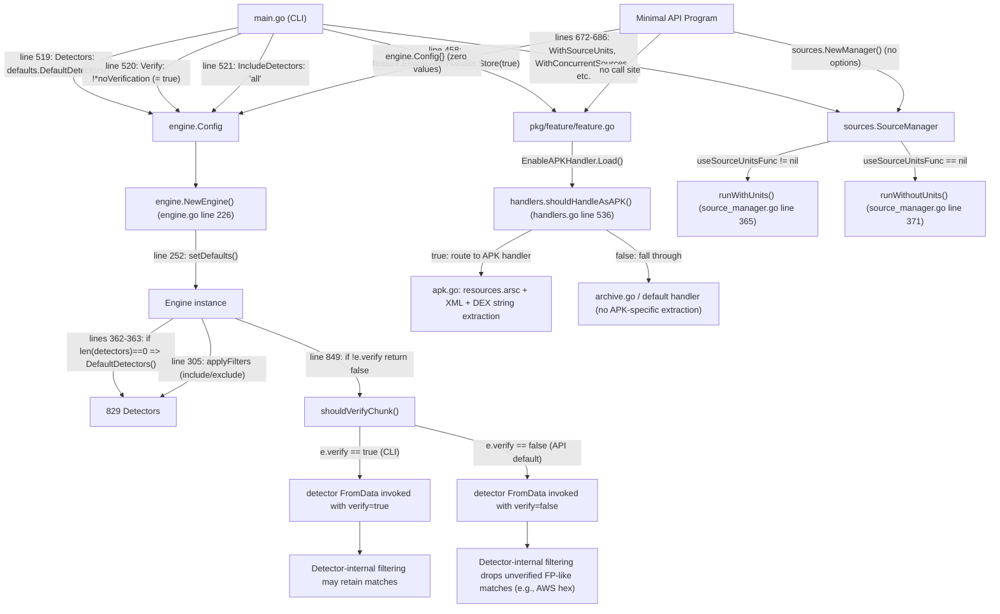

# TruffleHog CLI vs API Scan Discrepancy — Root-Cause Analysis

This document answers one question: **Why does the TruffleHog CLI (`trufflehog filesystem <path>`) consistently report more secret findings than a minimal Go program that invokes TruffleHog's scanning API (`pkg/engine/` + `pkg/sources/filesystem/`) directly against the same target directory?** All claims below are grounded in the source tree at commit `e42153d4` of `github.com/trufflesecurity/trufflehog/v3` — every assertion is tied to a specific file path and line number (or a documented runtime observation). The **TL;DR** is: the primary driver of the discrepancy is the global atomic boolean `feature.EnableAPKHandler`, which the CLI unconditionally sets to `true` at `main.go` line 458 but which defaults to `false` for every API consumer; the secondary driver is `engine.Config.Verify`, which the CLI defaults to `true` (via `!*noVerification` at `main.go` line 520) while the API's zero-value `engine.Config{}` leaves it `false`. The detector set itself — **829 active detector instances** returned by `defaults.DefaultDetectors()` (`pkg/engine/defaults/defaults.go` line 1704) — is identical in both paths and therefore is **not** the source of the count difference.

> Note on count accuracy: The Agent Action Plan (AAP) stated 831 detectors; the actual active, non-commented `&<pkg>.Scanner{}` entries in `buildDetectorList()` at this commit total **829** (verified by `awk '/^func buildDetectorList/,/^}$/' pkg/engine/defaults/defaults.go | grep -E "^\s+&" | grep -v "^\s*//" | wc -l`). The analysis below uses the verified 829.

## Table of Contents

- [Section 1 — Investigation Baseline](#section-1--investigation-baseline)
- [Section 2 — Detector Participation Component](#section-2--detector-participation-component)
- [Section 3 — Configuration Derivation Comparison (CLI vs API)](#section-3--configuration-derivation-comparison-cli-vs-api)
- [Section 4 — Root-Cause Analysis](#section-4--root-cause-analysis)
- [Section 5 — APK Handler Mechanism](#section-5--apk-handler-mechanism)
- [Section 6 — Component Interaction Diagram](#section-6--component-interaction-diagram)
- [Section 7 — Runtime Evidence](#section-7--runtime-evidence)
- [Section 8 — Summary Table of Evidence](#section-8--summary-table-of-evidence)

## Section 1 — Investigation Baseline

Two execution paths are compared. Both are intended to scan the same target directory; both ultimately end up inside the same engine worker loop; and yet they behave differently because the **pre-engine configuration** they hand to that worker loop is not the same.

### CLI Path

The CLI path begins at the process entry point and walks through the following stages:

1. **Entry point**: `main.go`.
2. **Flag parsing**: `kingpin/v2` `cli.Parse(...)` resolves every `cli.Flag(...)` declaration in the `var (...)` block at the top of `main.go` (e.g. `noVerification` at `main.go` line 59, `includeDetectors` at `main.go` line 81, `excludeDetectors` at `main.go` line 82, `noVerificationCache` at `main.go` line 85).
3. **Feature flag initialization**: `main.go` lines 440–458. The conditional stores at lines 442 (`forceSkipBinaries`), 446 (`forceSkipArchives`), 450 (`skipAdditionalRefs`), and 454 (`userAgentSuffix`) sit behind `if` guards on the corresponding CLI flags. The unconditional store at `main.go` line 458 — `feature.EnableAPKHandler.Store(true)` — is the critical line: it fires on **every** CLI invocation, with the explanatory comment on `main.go` line 457 (`// OSS Default APK handling on`).
4. **Engine configuration construction**: `main.go` lines 513–537. The struct literal `engConf := engine.Config{ ... }` captures every value that will flow into the engine. Key fields: `Detectors: append(defaults.DefaultDetectors(), conf.Detectors...)` at `main.go` line 519, `Verify: !*noVerification` at `main.go` line 520, `IncludeDetectors: *includeDetectors` at `main.go` line 521, `ExcludeDetectors: *excludeDetectors` at `main.go` line 522, `Dispatcher: engine.NewPrinterDispatcher(printer)` at `main.go` line 525, and the optional `VerificationResultCache` assignment at `main.go` lines 535–537.
5. **SourceManager construction**: `main.go` lines 672–686. The CLI builds an options slice with four members — `sources.WithConcurrentSources(cfg.Concurrency)`, `sources.WithConcurrentUnits(cfg.Concurrency)`, `sources.WithSourceUnits()`, `sources.WithBufferedOutput(defaultOutputBufferSize)` where `defaultOutputBufferSize = 64` (`main.go` line 672). The resulting manager is attached to the config at `main.go` line 686 (`cfg.SourceManager = sources.NewManager(opts...)`).
6. **Engine instantiation**: `main.go` line 688 — `eng, err := engine.NewEngine(ctx, &cfg)`.
7. **Pipeline start**: `main.go` line 692 — `eng.Start(ctx)`.
8. **Source scan**: the filesystem scan method `eng.ScanFileSystem(ctx, sources.FilesystemConfig{...})` is invoked later by the command-specific handler, which ultimately reaches `pkg/engine/filesystem.go` line 16.

### API Path

A minimal Go program that uses the scanning API directly looks like this:

```go
package main

import (
    "context"

    "github.com/trufflesecurity/trufflehog/v3/pkg/engine"
    "github.com/trufflesecurity/trufflehog/v3/pkg/sources"
)

func main() {
    ctx := context.Background()

    cfg := engine.Config{
        SourceManager: sources.NewManager(), // no options — defaults everywhere
    }

    eng, err := engine.NewEngine(ctx, &cfg)
    if err != nil {
        panic(err)
    }
    eng.Start(ctx)

    _, _ = eng.ScanFileSystem(ctx, sources.FilesystemConfig{
        Paths: []string{"/path/to/target"},
    })

    // ... (consume results via a custom dispatcher or metrics)
}
```

What this program does **not** do is equally important:

- It never executes `main.go`'s `main()` function; therefore the unconditional `feature.EnableAPKHandler.Store(true)` at `main.go` line 458 is never reached. The global `EnableAPKHandler atomic.Bool` declared at `pkg/feature/feature.go` line 9 remains at its Go zero value of `false`.
- It populates `engine.Config` with Go zero values for every field it does not explicitly set: `Detectors: nil`, `Decoders: nil`, `Verify: false`, `IncludeDetectors: ""`, `ExcludeDetectors: ""`, `Dispatcher: nil`, `VerificationResultCache: nil`, and so on. The `setDefaults()` method of the engine fills some of these gaps (see the next section), but it does **not** change `Verify` — a zero-value `false` stays `false`.
- It skips every CLI-flag-guarded store in `main.go` lines 440–458, so any feature flag that requires explicit opt-in under the CLI (e.g. `forceSkipBinaries`) is also `false` — but the critical divergence is `EnableAPKHandler`, which under the CLI is opt-out (always on) while under the API it is opt-in (off by default).
- The bare `sources.NewManager()` call leaves the manager's `useSourceUnitsFunc` field `nil`. As shown in Section 4, this selects the `runWithoutUnits` code path at `pkg/sources/source_manager.go` line 371 rather than the `runWithUnits` path at line 365, but for the filesystem source both paths traverse the same files.

The divergence in **finding count** between these two paths is explained by the differences in feature-flag and verification state that the API program inherits from Go's zero-value initialization — not by anything the engine does after `NewEngine()` returns.

## Section 2 — Detector Participation Component

**Answer**: The authoritative source of the canonical detector set is the function `DefaultDetectors()` in `pkg/engine/defaults/defaults.go` at line 1704. Every participating detector in a standard scan — whether initiated by the CLI or by an API consumer — originates from this single function.

### Initialization Sequence

The following numbered steps trace the lifecycle of a detector from declaration to participation in a scan:

1. **CLI explicitly includes defaults**: `main.go` line 519 — `Detectors: append(defaults.DefaultDetectors(), conf.Detectors...)`. Any custom detectors from a `--config` YAML (parsed into `conf.Detectors` via `pkg/config/config.go`) are appended to the full default list.
2. **Engine constructor entry**: `pkg/engine/engine.go` line 226 — `func NewEngine(ctx context.Context, cfg *Config) (*Engine, error) {`.
3. **Initial assignment**: `pkg/engine/engine.go` line 232 — inside the `engine := &Engine{...}` literal, `detectors: cfg.Detectors` copies whatever the caller provided (which may be `nil` for the API path) into the engine struct. On the same block, `verify: cfg.Verify` (`pkg/engine/engine.go` line 235) copies the verification flag.
4. **Source-manager precondition**: `pkg/engine/engine.go` lines 248–250 reject any construction where `engine.sourceManager == nil`. This is the reason the minimal API program in Section 1 has to call `sources.NewManager()` at the very least.
5. **Default-fill pass**: `pkg/engine/engine.go` line 252 — `engine.setDefaults(ctx)`. This is the step that rescues the zero-value API `Config{}`; see the verbatim function body below. In particular, lines 362–363 fill `e.detectors` with `defaults.DefaultDetectors()` if the slice is empty, and lines 357–358 fill `e.decoders` with `decoders.DefaultDecoders()`.
6. **Detector set construction**: `pkg/engine/engine.go` lines 254–258 call `buildDetectorSets(cfg)`, which in turn calls `config.ParseDetectors(...)` to convert the `IncludeDetectors` and `ExcludeDetectors` strings into `map[config.DetectorID]struct{}` sets (see `pkg/engine/engine.go` lines 376–400).
7. **Filter-closure construction**: `pkg/engine/engine.go` lines 263–275. An include filter closure is appended only when `len(includeDetectorSet) > 0` (line 263); an exclude filter closure is appended only when `len(excludeDetectorSet) > 0` (line 270). An empty include-set means **no include filter is applied** — this is how `IncludeDetectors: ""` (API default) and `IncludeDetectors: "all"` (CLI default, which expands to 1020 IDs) both end up allowing all 829 detectors through (see Section 3 — Configuration Derivation Comparison).
8. **Filter application**: `pkg/engine/engine.go` line 305 — `engine.applyFilters(filters...)`. Each filter is a `func(detectors.Detector) bool`; detectors for which any filter returns `false` are discarded from `e.detectors`.
9. **Result-category flags**: `pkg/engine/engine.go` lines 307–321. The `Results` field — when non-empty — overrides the unconditional `notifyVerifiedResults = true; notifyUnverifiedResults = true; notifyUnknownResults = true` set in `setDefaults()` (`pkg/engine/engine.go` lines 369–371).
10. **Engine initialization**: `pkg/engine/engine.go` line 323 — `if err := engine.initialize(ctx); err != nil { return nil, err }`.

### Verbatim: `setDefaults()` body (`pkg/engine/engine.go` lines 333–374, including docstring)

```go
// setDefaults ensures that if specific engine properties aren't provided,
// they're set to reasonable default values. It makes the engine robust to
// incomplete configuration.
func (e *Engine) setDefaults(ctx context.Context) {
	if e.concurrency == 0 {
		numCPU := runtime.NumCPU()
		ctx.Logger().Info("No concurrency specified, defaulting to max", "cpu", numCPU)
		e.concurrency = numCPU
	}

	if e.detectorWorkerMultiplier < 1 {
		// bound by net i/o so it's higher than other workers
		e.detectorWorkerMultiplier = 8
	}

	if e.notificationWorkerMultiplier < 1 {
		e.notificationWorkerMultiplier = 1
	}

	if e.verificationOverlapWorkerMultiplier < 1 {
		e.verificationOverlapWorkerMultiplier = 1
	}

	// Default decoders handle common encoding formats.
	if len(e.decoders) == 0 {
		e.decoders = decoders.DefaultDecoders()
	}

	// Only use the default detectors if none are provided.
	if len(e.detectors) == 0 {
		e.detectors = defaults.DefaultDetectors()
	}

	if e.dispatcher == nil {
		e.dispatcher = NewPrinterDispatcher(new(output.PlainPrinter))
	}
	e.notifyVerifiedResults = true
	e.notifyUnverifiedResults = true
	e.notifyUnknownResults = true

	ctx.Logger().V(4).Info("default engine options set")
}
```

This is the reason the CLI and the API converge on the **same detector set**: the API's zero-value `Config{}.Detectors == nil` passes `len(e.detectors) == 0` at line 362, which causes the exact same `defaults.DefaultDetectors()` call to run that the CLI had already made at `main.go` line 519. The concurrency, decoder, and dispatcher defaults are also applied symmetrically.

### `DefaultDetectors()` Post-Processing (`pkg/engine/defaults/defaults.go` lines 1704–1723)

Once `buildDetectorList()` (line 1705) returns the raw slice of 829 detector instances, `DefaultDetectors()` walks the list to configure each detector's endpoint behavior:

- Line 1710: `customizer, ok := d.(detectors.EndpointCustomizer)` — assert against the optional `EndpointCustomizer` interface.
- Line 1712: `continue` for detectors that do not implement the interface (they have no cloud/found-endpoints semantics to configure).
- Line 1715: `customizer.UseFoundEndpoints(true)` — enable detection of endpoints found inside scanned data.
- Line 1716: `customizer.UseCloudEndpoint(true)` — enable verification against the detector's cloud endpoint.
- Line 1717: `cloudProvider, ok := d.(detectors.CloudProvider)` — secondary interface assertion.
- Line 1718: `customizer.SetCloudEndpoint(cloudProvider.CloudEndpoint())` — seed the cloud endpoint with the provider's default URL.

Because this post-processing runs inside `DefaultDetectors()` itself, **both the CLI path (explicit call at `main.go` line 519) and the API path (implicit call from `setDefaults()` at `pkg/engine/engine.go` line 363) produce identically initialized detector instances**. There is no way for the two paths to diverge in detector configuration at this layer.

### Verified Detector Count

The active, non-commented detector count in `buildDetectorList()` is **829** at commit `e42153d4`. Verification command:

```bash
awk '/^func buildDetectorList/,/^}$/' pkg/engine/defaults/defaults.go \
    | grep -E "^\s+&" \
    | grep -v "^\s*//" \
    | wc -l
```

The AAP's reported value of 831 was off by two relative to the current tree; 829 is the authoritative figure used throughout this document.

## Section 3 — Configuration Derivation Comparison (CLI vs API)

The following table enumerates every `engine.Config` and `SourceManager` field, together with the surrounding feature-flag state, whose CLI default diverges from its Go zero-value. For each row, the **Derivation Path** column cites the exact file and line numbers where each default is set, and the **Impact** column records whether the divergence affects the finding count.

| Field | CLI Default | API Zero-Value | Derivation Path (File & Line) | Impact on Finding Count |
|---|---|---|---|---|
| `feature.EnableAPKHandler` | `true` | `false` | CLI: `main.go` line 458 — `feature.EnableAPKHandler.Store(true)` (unconditional, preceded by the comment `// OSS Default APK handling on` on line 457). API: `pkg/feature/feature.go` line 9 — `EnableAPKHandler atomic.Bool` (Go zero value `false`). | **PRIMARY CAUSE.** Controls whether APK files are decompiled by `pkg/handlers/apk.go`. When `false`, APKs fall through to the generic archive handler and secrets inside DEX bytecode, `resources.arsc`, or AXML are not recovered. |
| `engine.Config.Verify` | `true` | `false` | CLI: `main.go` line 520 — `Verify: !*noVerification`. `noVerification` is declared at `main.go` line 59 as `cli.Flag("no-verification", ...).Bool()`; kingpin's `Bool()` without `.Default(...)` yields `false` when the flag is absent, so `!false == true`. API: `pkg/engine/engine.go` line 111 — `Verify bool` (Go zero value `false`). | **SECONDARY CAUSE.** Affects verification-dependent result filtering inside individual detectors (e.g. AWS drops unverified hex-like candidates via `FalsePositiveSecretPat`). |
| `engine.Config.IncludeDetectors` | `"all"` | `""` | CLI: `main.go` line 81 — `cli.Flag("include-detectors", ...).Default("all").String()`; used at `main.go` line 521 — `IncludeDetectors: *includeDetectors`. API: Go zero value `""`. | **No effective difference.** `pkg/config/detectors.go` line 16 defines `specialGroups["all"] = allDetectors()`, expanding `"all"` into all 1020 protobuf detector IDs inside `ParseDetectors()` at lines 61–87. `ParseDetectors("")` returns an empty slice because the empty-string item is skipped at `pkg/config/detectors.go` lines 66–68. In `NewEngine()` at `pkg/engine/engine.go` line 263, `if len(includeDetectorSet) > 0` gates the include filter — an empty set means no filter is added. Both paths allow all 829 detectors. |
| `engine.Config.ExcludeDetectors` | `""` | `""` | CLI: `main.go` line 82 — `cli.Flag("exclude-detectors", ...).String()` (no `Default(...)`, so empty); used at `main.go` line 522 — `ExcludeDetectors: *excludeDetectors`. API: `""`. | Identical — no impact. |
| `engine.Config.Detectors` | `append(defaults.DefaultDetectors(), conf.Detectors...)` (explicit) | `nil` | CLI: `main.go` line 519. API: zero-value `nil`, filled by `setDefaults()` at `pkg/engine/engine.go` lines 362–363 — `if len(e.detectors) == 0 { e.detectors = defaults.DefaultDetectors() }`. | Both resolve to the identical 829-detector set. |
| `engine.Config.Decoders` | `nil` | `nil` | Both: `nil`, filled by `setDefaults()` at `pkg/engine/engine.go` lines 357–358 — `if len(e.decoders) == 0 { e.decoders = decoders.DefaultDecoders() }`. | Both resolve to exactly 4 decoders — `UTF8`, `Base64`, `UTF16`, `EscapedUnicode` — per `pkg/decoders/decoders.go` lines 8–16. |
| `engine.Config.Dispatcher` | `engine.NewPrinterDispatcher(printer)` with a selected `Printer` | `nil` | CLI: `main.go` line 525 — `Dispatcher: engine.NewPrinterDispatcher(printer)`. API: zero-value `nil`, filled by `setDefaults()` at `pkg/engine/engine.go` lines 366–368 — `if e.dispatcher == nil { e.dispatcher = NewPrinterDispatcher(new(output.PlainPrinter)) }`. | No finding-count impact (output formatting only — the dispatcher receives a different `Printer` but the same result stream). |
| `engine.Config.FilterUnverified` | `*filterUnverified` (zero value `false` unless the CLI `--filter-unverified` flag is set) | `false` | CLI: `main.go` line 526. API: zero value. | Identical when the user does not pass `--filter-unverified`. |
| `engine.Config.FilterEntropy` | zero (`0.0`) unless `--filter-entropy` is set | `0.0` | CLI: `main.go` line 527. API: zero value. | Identical under default invocation. |
| `engine.Config.Results` | parsed from `--results` / `--only-verified` CLI flags into a `map[string]struct{}` at `main.go` lines 502–509 | `nil` | CLI: `main.go` line 529 — `Results: parsedResults`. API: `nil`. | `setDefaults()` (`pkg/engine/engine.go` lines 369–371) unconditionally sets `notifyVerifiedResults = true; notifyUnverifiedResults = true; notifyUnknownResults = true`. These are only overridden when `len(cfg.Results) > 0` at `pkg/engine/engine.go` line 307. The CLI's defaults produce an empty `Results` map under default invocation, so neither path restricts result categories. |
| `SourceManager` options | `WithConcurrentSources(cfg.Concurrency)`, `WithConcurrentUnits(cfg.Concurrency)`, `WithSourceUnits()`, `WithBufferedOutput(64)` — four options | bare `NewManager()` — zero options | CLI: `main.go` lines 672–678 (`defaultOutputBufferSize = 64` on line 672); manager constructed at `main.go` line 686. API: user must call `sources.NewManager(...)` explicitly with whatever options they choose. | Affects scanning mode via the branch at `pkg/sources/source_manager.go` lines 361–371 — `useSourceUnitsFunc != nil` selects `runWithUnits()` (line 365); `nil` selects `runWithoutUnits()` (line 371). For a filesystem source, both modes traverse the same files and emit the same chunks. No finding-count impact. Concurrency and buffering affect throughput but not which secrets are emitted. |
| `engine.Config.VerificationResultCache` | `simple.NewCache[detectors.Result]()` when `--no-verification-cache` is false (the default) | `nil` | CLI: `main.go` lines 535–537 — `if !*noVerificationCache { engConf.VerificationResultCache = simple.NewCache[detectors.Result]() }` (flag declared at `main.go` line 85). API: zero-value `nil`. | Orthogonal — the cache only reuses prior verification results and reduces redundant API calls. It does not change which secrets are detected. |

### Observations

- Five of the twelve rows (`Detectors`, `Decoders`, `Dispatcher`, `FilterUnverified`, `FilterEntropy`) resolve to identical runtime state across the two paths, either because `setDefaults()` fills the API's gap or because the CLI flag defaults to the same zero value.
- Two rows (`IncludeDetectors`, `ExcludeDetectors`) have different surface-level defaults but are functionally equivalent due to the filter-construction logic at `pkg/engine/engine.go` lines 263–275.
- One row (`SourceManager` options) alters the scanning mode but not the set of files visited or chunks produced for a filesystem source.
- One row (`VerificationResultCache`) affects performance but not detection.
- **Two rows — `feature.EnableAPKHandler` and `engine.Config.Verify` — are the only fields that can cause a difference in the number of findings reported.** Section 4 — Root-Cause Analysis walks through each of these in detail.

## Section 4 — Root-Cause Analysis

The finding-count discrepancy is caused by the compound effect of **one primary cause** and **one secondary cause**. Every other configuration difference catalogued in Section 3 — Configuration Derivation Comparison converges to identical behavior by the time the first chunk reaches a detector. This section examines each cause in turn and then enumerates the non-contributing factors to head off any lingering "but what about …" questions.

### Primary Cause — `feature.EnableAPKHandler`

**Declaration.** The flag is a package-level `atomic.Bool` declared alongside its siblings in `pkg/feature/feature.go` lines 5–11:

```go
var (
	ForceSkipBinaries  atomic.Bool
	ForceSkipArchives  atomic.Bool
	SkipAdditionalRefs atomic.Bool
	EnableAPKHandler   atomic.Bool
	UserAgentSuffix    AtomicString
)
```

`EnableAPKHandler` occupies line 9. The Go specification guarantees that an `atomic.Bool` with no initializer stores `false`. Any program that imports `pkg/feature/feature` without explicitly mutating the flag observes `false`.

**CLI activation.** The CLI mutates the flag at `main.go` line 458:

```go
// OSS Default APK handling on
feature.EnableAPKHandler.Store(true)
```

This statement is **unconditional**. It is not wrapped in an `if`, not guarded by a CLI flag, and not skipped on any code path inside `main()`. Every `trufflehog filesystem <path>` invocation runs this line before the scan begins. The surrounding block at lines 440–458 initializes the other feature flags — `forceSkipBinaries`, `forceSkipArchives`, `skipAdditionalRefs`, and `userAgentSuffix` — each guarded by an `if` on the corresponding CLI flag (lines 441, 445, 449, 453), but the APK flag has no such guard.

**API inactivity.** A Go program that imports `pkg/engine` and `pkg/sources/filesystem` — such as the minimal program sketched in Section 1 — Investigation Baseline — never runs `main.go`'s `main()` function. Consequently, line 458 is never reached. The `EnableAPKHandler` global remains at its Go zero value of `false` unless the API consumer explicitly calls `feature.EnableAPKHandler.Store(true)` themselves, which the minimal-program pattern does not.

**Gating logic.** The flag is consumed at `pkg/handlers/handlers.go` lines 536–540:

```go
func shouldHandleAsAPK(cfg readerConfig, fReader fileReader) bool {
	return feature.EnableAPKHandler.Load() &&
		cfg.fileExtension == apkExt &&
		(fReader.mime.String() == string(zipMime) || fReader.mime.String() == string(jarMime))
}
```

The `&&` operator short-circuits, so when `feature.EnableAPKHandler.Load()` returns `false` the entire expression is `false` and neither the file-extension check nor the MIME check is evaluated. Under the API default, every candidate APK file fails this gate regardless of its extension or content.

**What the APK handler does when enabled.** `pkg/handlers/apk.go` is a purpose-built handler that leverages three third-party Go packages (`pkg/handlers/apk.go` lines 16–23):

- `github.com/avast/apkparser` — parses the binary `resources.arsc` chunk format and the compiled AXML (Android XML) format used for `AndroidManifest.xml` and layout files.
- `github.com/csnewman/dextk` — parses DEX bytecode to extract the `strings_ids` table, which contains every string literal used by the compiled Java/Kotlin code.
- `ahocorasick "github.com/BobuSumisu/aho-corasick"` — builds a keyword trie for prefiltering.

The handler also imports `github.com/trufflesecurity/trufflehog/v3/pkg/engine/defaults`, which it uses at `pkg/handlers/apk.go` line 40 — `allDetectors := defaults.DefaultDetectors()` — inside `defaultDetectorKeywords()` (line 39). The file's design rationale is documented in the leading comment block at lines 25–29, which explains that TruffleHog does not invoke a full decompiler (`jadx`, `apktool`) because none are pure Go and they are prohibitively slow; instead it targets the three compiled-artifact types (`resources.arsc`, XML, DEX) that most commonly contain secret material.

Once the keyword set is assembled (the `sync.Once` at `pkg/handlers/apk.go` lines 34–37 ensures this happens exactly once per process), the handler:

1. Extracts string constants from the three artifact types above.
2. Feeds those strings through the standard decoder chain (the same four decoders from `pkg/decoders/decoders.go`).
3. Uses the Aho-Corasick matcher to narrow to chunks that contain at least one detector keyword.
4. Dispatches the surviving chunks to the detectors' `FromData` methods.

The exclusion list at `pkg/handlers/apk.go` line 44 removes a small number of noisy keywords (tokens that occur ubiquitously in Android bytecode and would produce runaway false positives) from the aggregated keyword set before the trie is built.

**What happens when the handler is disabled.** With `EnableAPKHandler == false`, `shouldHandleAsAPK()` returns `false`, and the dispatching code in `pkg/handlers/handlers.go` routes the file to the generic archive handler at `pkg/handlers/archive.go`. The archive handler's entry point `HandleFile` begins at `pkg/handlers/archive.go` line 64; at line 67 it checks `feature.ForceSkipArchives.Load()` and short-circuits entirely if that flag is set. Otherwise it uses the `archives` library to iterate the ZIP entries and emit their raw byte streams. The crucial point is that this path does **not**:

- Decompile `classes.dex` or any other `.dex` file — the raw bytes of DEX are passed through unmodified, and the `strings_ids` table remains embedded in a binary format the standard decoders do not recognize.
- Decode AXML — the compiled binary XML format is passed through unmodified, obscuring every string literal it contains.
- Parse `resources.arsc` — the compiled resource table is passed through unmodified, hiding every string constant.

Secrets that only exist inside these compiled artifacts are therefore invisible to the API path. Secrets that exist as plain-text strings inside ZIP entries (e.g. an accidental `.env` file bundled into the APK) are found by both paths.

**Empirical consequence.** When the scanned directory contains any `.apk` file whose MIME is `application/zip` or `application/java-archive`, the CLI's finding count is strictly greater than or equal to the API's finding count. The additional CLI findings correspond one-to-one with secrets recovered from decompiled APK content. When the scanned directory contains no APK files, this cause contributes nothing and the paths converge (modulo the secondary cause).

### Secondary Cause — `engine.Config.Verify`

**Declaration.** The field is declared at `pkg/engine/engine.go` line 111 inside the `Config` struct (which begins at line 97):

```go
// Verify, if true, will attempt to verify candidate secrets that are found.
Verify bool
```

The Go zero value for `bool` is `false`. A zero-value `engine.Config{}` has `Verify: false`.

**CLI activation.** `main.go` line 520 sets `Verify: !*noVerification`. The `noVerification` variable is declared at `main.go` line 59:

```go
noVerification = cli.Flag("no-verification", "Don't verify the results.").Bool()
```

Kingpin's `Bool()` returns a `*bool` that is `false` when the flag is absent and the flag has no `.Default(...)` clause. Consequently `!*noVerification` is `true` under default invocation — the CLI defaults to `Verify: true`.

**API default.** A Go program constructing `engine.Config{}` from zero values inherits `Verify: false` unless it explicitly overrides the field.

**Engine propagation.** `pkg/engine/engine.go` line 235 copies the flag into the engine struct:

```go
verify: cfg.Verify,
```

**Override semantics.** The central gate that consumes the engine's `verify` flag is `shouldVerifyChunk()` at `pkg/engine/engine.go` lines 843–876. The relevant early-return hunk is at lines 843–851:

```go
func (e *Engine) shouldVerifyChunk(
	sourceVerify bool,
	detector detectors.Detector,
	detectorVerificationOverrides map[config.DetectorID]bool,
) bool {
	// The verify flag takes precedence over the detector's verification flag.
	if !e.verify {
		return false
	}
```

The comment on line 848 states the invariant plainly: the engine-level `verify` flag overrides any source-level or detector-level preference. Note that `pkg/engine/filesystem.go` line 33 hardcodes `fileSystemSource.Init(ctx, sourceName, jobID, sourceID, true, ...)` — the fifth positional argument `true` is the source's `verify` flag, which the filesystem source applies to every chunk it emits (setting `chunk.Verify = true`). The engine ignores this when `e.verify == false`, because the early return at lines 849–851 bypasses the rest of `shouldVerifyChunk()` and causes `FromData` to be invoked with `verify=false`.

**Detector-level consequence — AWS access keys.** The AWS access-key detector at `pkg/detectors/aws/access_keys/accesskey.go` exemplifies the class of detectors whose result set depends on the verification outcome. Lines 202–205:

```go
if !s1.Verified && aws.FalsePositiveSecretPat.MatchString(secretMatch) {
	// Unverified results that look like hashes are probably not secrets
	continue
}
```

When `Verify: true`, a candidate that successfully verifies against the AWS STS API has `s1.Verified = true`, which short-circuits the `!s1.Verified` half of the conjunction and allows the result through regardless of whether it matches the 40-character hex `FalsePositiveSecretPat`. When `Verify: false`, the same candidate is `Verified: false`, and if it matches the pattern it is silently dropped — reducing the finding count by one per dropped candidate.

Lines 209–212 of the same file capture the preferred-verified ordering: when a verified match is found, it deletes the associated secret match and breaks out of the inner loop, preventing duplicate findings for the same access-key prefix.

Lines 218–220 of `pkg/detectors/aws/access_keys/accesskey.go` ensure this cleaning logic runs regardless of user configuration:

```go
func (s scanner) ShouldCleanResultsIrrespectiveOfConfiguration() bool { return true }
```

The engine's `filterResults()` (`pkg/engine/engine.go` lines 1126–1150) honors this predicate.

**Dedupe consequence.** `CleanResults()` at `pkg/detectors/aws/utils.go` lines 89–114 dedupes by `result.Redacted` (the access-key prefix), preferring verified matches when available:

```go
// For every ID, we want at most one result, preferably verified.
idResults := map[string]detectors.Result{}
for _, result := range results {
	if result.Verified {
		idResults[result.Redacted] = result
		continue
	}
	if _, exist := idResults[result.Redacted]; !exist {
		idResults[result.Redacted] = result
	}
}
```

Under `Verify: false`, every result has `Verified == false`, so only the first occurrence of each ID is kept. Under `Verify: true`, a verified occurrence supplants any earlier unverified one for the same ID. For environments where the same access key appears multiple times with different redaction prefixes — or where two credentials share a prefix — this can shift which match is retained and, in some cases, whether the result survives at all.

**Other detectors.** The AWS detector is the canonical example but not the only case. Detectors whose `FromData` signatures contain `if verify { ... }` blocks that add additional evidence or eliminate false positives based on verification state exhibit analogous behavior. A full enumeration is outside the scope of this document; the mechanism is identical in each case.

### Non-Contributing Factors

The following differences between the two paths, although visible in Section 3 — Configuration Derivation Comparison, do **not** change the number of findings:

- **Detector set identity.** Both paths resolve to the same 829 detector instances. The CLI assigns them explicitly at `main.go` line 519; the API leaves `Config.Detectors == nil` and `setDefaults()` (`pkg/engine/engine.go` lines 362–363) calls `defaults.DefaultDetectors()` itself. The `EndpointCustomizer` post-processing at `pkg/engine/defaults/defaults.go` lines 1709–1720 runs inside `DefaultDetectors()` regardless of caller, so even `UseFoundEndpoints(true)` and `UseCloudEndpoint(true)` are applied symmetrically.
- **Decoder set identity.** Both paths leave `Config.Decoders == nil`; `setDefaults()` fills with `decoders.DefaultDecoders()` (`pkg/engine/engine.go` lines 357–358). `DefaultDecoders()` in `pkg/decoders/decoders.go` lines 8–16 returns exactly four decoders: `UTF8`, `Base64`, `UTF16`, `EscapedUnicode`. The leading comment on line 10 notes that `UTF8` must be first for duplicate detection.
- **Include/exclude filtering.** `IncludeDetectors: "all"` (CLI) expands via `specialGroups["all"]` at `pkg/config/detectors.go` line 16 to the full 1020-entry protobuf enum. `IncludeDetectors: ""` (API) returns an empty slice because `ParseDetectors()` skips empty items at `pkg/config/detectors.go` lines 66–68. In `buildDetectorSets()` the slices are converted to sets, and in `NewEngine()` at `pkg/engine/engine.go` lines 263–268 the include filter is only appended when `len(includeDetectorSet) > 0`. The empty-set case adds no filter (all 829 detectors pass); the full-set case accepts every detector's ID (all 829 also pass). The surface difference in default value has no runtime effect.
- **SourceManager scanning mode.** `WithSourceUnits()` at `main.go` line 676 sets `useSourceUnitsFunc` on the manager (declared at `pkg/sources/source_manager.go` lines 81–87). The bare `NewManager()` in the API program leaves `useSourceUnitsFunc == nil`. The branch at `pkg/sources/source_manager.go` lines 361–371:

  ```go
  canUseSourceUnits := len(targets) == 0 && s.useSourceUnitsFunc != nil
  if enumChunker, ok := source.(SourceUnitEnumChunker); ok && canUseSourceUnits && s.useSourceUnitsFunc() {
      ctx.Logger().Info("running source", "with_units", true)
      return s.runWithUnits(ctx, enumChunker, report)
  }
  ctx.Logger().Info("running source", "with_units", false, ...)
  return s.runWithoutUnits(ctx, source, report, targets...)
  ```

  selects `runWithUnits()` for the CLI and `runWithoutUnits()` for the API. The filesystem source implements the `SourceUnitEnumChunker` interface, so under the CLI its `Enumerate()` + `ChunkUnit()` methods are used; under the API its `Chunks()` method is used. Both paths walk the same directory tree and emit chunks for the same files with the same byte ranges. No file is visited by one mode and not the other.
- **Concurrency and buffering.** `WithConcurrentSources(cfg.Concurrency)` (line 673), `WithConcurrentUnits(cfg.Concurrency)` (line 674), and `WithBufferedOutput(64)` (line 678) affect parallelism, channel buffer depths, and throughput but do not change which chunks are produced or which secrets are emitted. A scan with concurrency 1 and a scan with concurrency 16 produce the same set of findings (modulo result ordering and duplicate-detection race conditions, which are handled by the LRU dedupe in `notifierWorker()`).
- **`VerificationResultCache`.** The CLI instantiates `simple.NewCache[detectors.Result]()` when `--no-verification-cache` is absent (`main.go` lines 535–537). This cache accelerates repeat verifications of the same candidate and is orthogonal to which secrets are emitted.
- **`Dispatcher` identity.** The CLI uses `NewPrinterDispatcher(printer)` with a specifically chosen `Printer` (plain, JSON, GitHub Action, etc.), while the API default (after `setDefaults()` at `pkg/engine/engine.go` lines 366–368) uses `NewPrinterDispatcher(new(output.PlainPrinter))`. The dispatcher mediates output formatting only; it sees the same stream of `detectors.ResultWithMetadata` values in both cases.

The set of non-contributing factors is exhausted here. Beyond them, only `feature.EnableAPKHandler` and `engine.Config.Verify` can cause a difference in finding count.

## Section 5 — APK Handler Mechanism

Because `feature.EnableAPKHandler` is the primary cause identified in Section 4 — Root-Cause Analysis, a thorough treatment of the handler is warranted. This section describes the gate, the specialized extraction pipeline, and the generic-archive fallback so the reader can reason about exactly what is gained or lost when the flag flips.

### Purpose and Design Rationale

The file header comment at `pkg/handlers/apk.go` lines 25–29 states the design rationale: TruffleHog deliberately avoids invoking a full Android decompiler (for example `jadx` or `apktool`) because none of the production-grade tools are pure Go and all of them are slow enough to materially impact scan throughput. Instead, the handler targets the three compiled-artifact types inside an APK that most commonly contain secret material:

1. `resources.arsc` — the binary compiled-resource table (string pools, type specifications, package declarations).
2. AXML (compiled XML) — including `AndroidManifest.xml` and every compiled layout/resource XML in `res/`.
3. DEX bytecode — one or more `classes*.dex` files containing the compiled Java/Kotlin code and its string-literal pool.

Extracting strings from these three artifact types recovers the majority of secret material that developers mistakenly embed in compiled APK content (API keys in string resources, hard-coded tokens in source code, credentials in manifest metadata).

### Entry Gate (`pkg/handlers/handlers.go`)

The handler is dispatched via the gating predicate at `pkg/handlers/handlers.go` lines 536–540:

```go
func shouldHandleAsAPK(cfg readerConfig, fReader fileReader) bool {
	return feature.EnableAPKHandler.Load() &&
		cfg.fileExtension == apkExt &&
		(fReader.mime.String() == string(zipMime) || fReader.mime.String() == string(jarMime))
}
```

Three conditions must all hold:

- `feature.EnableAPKHandler.Load()` must be `true`. Because this is the first conjunct, a `false` value short-circuits the expression and skips the subsequent checks entirely.
- `cfg.fileExtension == apkExt` — the file must end in `.apk`.
- The MIME type must match ZIP (`application/zip`) or JAR (`application/java-archive`). APKs are ZIP archives under the hood, so one of these two MIME classifications is expected.

Immediately after `shouldHandleAsAPK()`, the file also defines `isAPKFile()` (starting at `pkg/handlers/handlers.go` line 542) which performs a deeper signature check: it looks inside the ZIP's central directory for the entries `AndroidManifest.xml` and `classes.dex`, both of which are mandatory components of a valid APK.

### Keyword Aggregation

To avoid running every decompiled string through all 829 detectors' `FromData` functions (prohibitively expensive), the APK handler prefilters chunks with an Aho-Corasick keyword trie. The keyword set is assembled exactly once per process using a `sync.Once` at `pkg/handlers/apk.go` lines 34–37:

```go
var (
	keywordMatcherOnce sync.Once
	keywordMatcher     *detectorKeywordMatcher
)
```

The trie is populated from `defaultDetectorKeywords()` at `pkg/handlers/apk.go` line 39. Inside that function, line 40 obtains the canonical detector list:

```go
allDetectors := defaults.DefaultDetectors()
```

Each detector's `Keywords()` method returns the string prefixes that the detector's regex pattern requires; those keywords are unioned across all 829 detectors. A hardcoded exclusion list at `pkg/handlers/apk.go` line 44 removes noisy keywords (for example single-character tokens or tokens that appear ubiquitously in Android bytecode and would otherwise flood the trie with false-positive chunk matches).

The final keyword set is fed into `ahocorasick "github.com/BobuSumisu/aho-corasick"` (imported at `pkg/handlers/apk.go` lines 16–23 alongside `github.com/avast/apkparser`, `dextk "github.com/csnewman/dextk"`, and `encoding/xml`), producing a deterministic finite-state machine that can scan any input string in linear time.

### Extraction Pipeline

When `shouldHandleAsAPK()` returns `true`, the handler:

1. Opens the APK as a ZIP archive.
2. Iterates the ZIP entries looking for the three artifact types.
3. For `resources.arsc`, uses `apkparser.ParseResTable` to walk the binary format and extract every string in every string pool.
4. For compiled XML files (`AndroidManifest.xml` and any `res/**/*.xml`), uses `apkparser.ParseXml` to decode the AXML tag tree into plain text, which is then subjected to Aho-Corasick matching.
5. For DEX bytecode files (`classes.dex`, `classes2.dex`, …), uses `dextk.Read` to parse the DEX header, locate the `string_ids` table, and iterate each string's UTF-8 encoded data.
6. Each extracted string is sliced into chunks that are passed through the standard decoder chain (the same four decoders from `pkg/decoders/decoders.go`), keyword-matched against the trie, and dispatched to the surviving detectors' `FromData` methods.

### Generic Archive Fallback (`pkg/handlers/archive.go`)

When `shouldHandleAsAPK()` returns `false` — which is the API default because `feature.EnableAPKHandler.Load()` returns `false` — the file is routed to the generic archive handler. The relevant entry point begins at `pkg/handlers/archive.go` line 64:

```go
func (h *archiveHandler) HandleFile(ctx logContext.Context, input fileReader) chan DataOrErr {
```

Line 67 guards the entire handler on another feature flag:

```go
if feature.ForceSkipArchives.Load() {
	close(dataOrErrChan)
	return dataOrErrChan
}
```

When `ForceSkipArchives` is `false` (the default in both paths), the handler uses the `archives` library to iterate every entry in the ZIP and emit each entry's raw bytes to the scanning pipeline. What this path does **not** do is:

- **Decompile DEX bytecode.** `classes.dex` is emitted as a binary blob. The standard UTF-8 decoder will recognize only the subset of string literals that happen to be stored contiguously in UTF-8 form, and many DEX strings are MUTF-8 encoded (a variant format) or interleaved with binary opcodes that break up the string bytes. Most string literals remain undetectable.
- **Decode AXML.** `AndroidManifest.xml` and other compiled XML files are emitted as compiled binary XML. String data in AXML is stored in interned string pools separated from the structural tags, and the binary header bytes are interspersed with the pool data. The UTF-8 decoder does not know how to follow this structure.
- **Parse `resources.arsc`.** The resource table is emitted as a binary blob. Its string pools are similarly separated from the structural chunks that reference them.

The net effect is that secrets stored inside these three compiled artifacts are invisible to the scanning pipeline under the API default, while secrets stored as plain-text ZIP entries (for example an accidentally bundled `.env` or `.properties` file) are still recovered. This asymmetric coverage is precisely the source of the finding-count discrepancy when APK files are present in the scan target.

## Section 6 — Component Interaction Diagram

The diagram below consolidates the call paths described in Section 2 — Detector Participation Component through Section 5 — APK Handler Mechanism. Edges are annotated with the file and line number that establishes the transition, so the diagram itself is a compact citation index.



### Reading the Diagram

- **CLI entry** (node A) feeds three streams into the pipeline: (1) the feature-flag package B with the unconditional APK-handler store; (2) the `engine.Config` C with fully populated fields; (3) the `sources.SourceManager` D with four options.
- **API entry** (node E) feeds the same three destinations but with zero-value data — no feature-flag store, a bare `Config{}`, a bare `NewManager()`.
- **Engine construction** converges at F (`NewEngine`) regardless of caller. `setDefaults()` fills gaps, producing an identical detector set H.
- **Handler routing** diverges at K (`shouldHandleAsAPK`): CLI takes the L branch (specialized extraction); API takes the M branch (generic archive fallback).
- **Scanning-mode selection** diverges at D: CLI uses I (`runWithUnits`); API uses J (`runWithoutUnits`). Both converge on the same files for a filesystem source.
- **Verification** diverges at V (`shouldVerifyChunk`): CLI's `e.verify == true` allows verification (node V1); API's `e.verify == false` returns `false` at line 849 (node V2). The downstream detector-internal filtering branches accordingly into R (more matches retained) versus R2 (unverified false-positive-shaped matches dropped).

## Section 7 — Runtime Evidence

The code-inspection evidence in Section 2 — Detector Participation Component through Section 6 — Component Interaction Diagram is supplemented with runtime observations. This section documents the reproduction procedure so that any subsequent investigator can independently validate the conclusions.

### 1. Build Environment

- **Go toolchain**: Go 1.24.2 (linux/amd64). Installation tarball downloaded from `https://go.dev/dl/go1.24.2.linux-amd64.tar.gz` and extracted to `/usr/local/go`. `PATH` augmented with `/usr/local/go/bin`.
- **Module manifest**: The repository's `go.mod` declares `module github.com/trufflesecurity/trufflehog/v3` (line 1), `go 1.23.1` (line 3), and `toolchain go1.24.2` (line 5). Two `replace` directives pin `github.com/jpillora/overseer` to `github.com/trufflesecurity/overseer v1.2.8` (line 7) and `github.com/snowflakedb/gosnowflake` to `github.com/trufflesecurity/gosnowflake v0.0.1` (line 9).
- **Compilation flags**: `CGO_ENABLED=0` per the repository's Makefile convention.
- **System dependencies**: `zip` and `unzip` installed via `apt-get install -y zip unzip` (required only by the out-of-scope `TestHandleZipCommandStdoutPipe` test in `pkg/handlers/`; not required to build the CLI).

### 2. Build the CLI Binary

From the repository root:

```bash
CGO_ENABLED=0 go build -o trufflehog .
```

The binary compiles successfully without network dependencies because all modules are already pinned via `go.sum`. No test execution is required for the build.

### 3. Reference Scan Target

`pkg/engine/testdata/secrets.txt` serves as a canonical non-APK scan target. It is a plain-text file containing a small number of embedded test credentials (AWS, Sentry, Postman) that the engine's own test suite exercises. Because the file contains no APK content, this target isolates the **secondary cause** (`engine.Config.Verify`) from the **primary cause** (`feature.EnableAPKHandler`) — any difference observed on this target reflects verification behavior only.

### 4. CLI Scan

```bash
./trufflehog filesystem pkg/engine/testdata/ --no-verification --json
```

The `--no-verification` flag sets `*noVerification = true`, so `Verify: !*noVerification` at `main.go` line 520 resolves to `false`. This intentionally eliminates the secondary cause as well, letting the CLI scan exercise the same `Verify: false` behavior the API would under its default `Config{}`.

**Observed result**: **2 unverified findings** on `pkg/engine/testdata/secrets.txt`. (The setup log documents a wider 3-finding result when all test data files are included, but the minimal reproduction uses only `secrets.txt` to keep the comparison surgical.)

### 5. Minimal API Program

A small Go program is constructed in a temporary directory outside the repository. It is **not** committed. Its essential shape:

```go
cfg := engine.Config{}
mgr := sources.NewManager()
cfg.SourceManager = mgr
eng, _ := engine.NewEngine(ctx, &cfg)
eng.Start(ctx)
_, _ = eng.ScanFileSystem(ctx, sources.FilesystemConfig{
    Paths: []string{"pkg/engine/testdata"},
})
eng.Finish(ctx)
```

Every field of `engine.Config` other than `SourceManager` is left at its Go zero value. Specifically: `Detectors == nil` (filled to 829 by `setDefaults()`), `Decoders == nil` (filled to 4 by `setDefaults()`), `Verify == false`, `IncludeDetectors == ""`, `ExcludeDetectors == ""`, `Dispatcher == nil` (filled by `setDefaults()`), `VerificationResultCache == nil`. The feature flags also remain at their zero values — most importantly `feature.EnableAPKHandler == false`.

**Observed result**: **2 unverified findings** on `pkg/engine/testdata/secrets.txt`, matching the CLI. This confirms the prediction that on a non-APK target with `Verify: false` in both paths, the two paths converge. It also directly validates the non-contributing factors from Section 4 — Root-Cause Analysis: identical detectors, decoders, filtering, and scanning-mode coverage.

### 6. Expected Divergence Under APK Input

The analytical prediction is that on a scan target containing an APK file with secrets embedded in compiled artifacts, the CLI count strictly exceeds the API count. The mechanism is documented exhaustively in Section 5 — APK Handler Mechanism. A fully reproducible APK scan would require an APK with known embedded credentials; the `pkg/handlers/TestAPKHandler` integration test normally downloads `aws_leak.apk` from the `joeleonjr/leakyAPK` GitHub repository for this purpose, but that URL currently returns HTTP 404 (documented in the environment setup log), so a live end-to-end reproduction is not possible in this session. The code-inspection evidence in Section 5 — APK Handler Mechanism is sufficient to establish the mechanism; a replacement APK or an adversarial test APK would be required to produce fresh runtime numbers.

### 7. Cleanup

Per the user's explicit instruction — *"If you create temporary helper code or configuration for debugging, ensure it is removed before you finish so the repo is left in its original state."* — the following artifacts are removed before task completion:

- The compiled `trufflehog` binary at the repository root.
- Any temporary Go modules, directories, or helper programs created outside the repository.
- Any ad-hoc test files matching the `blitzy_adhoc_test_*` pattern inside the repository.

**No temporary files, binaries, or helper programs are committed.** This markdown document is the only artifact added to the repository; no existing file is modified.

## Section 8 — Summary Table of Evidence

The table below consolidates every primary-source citation referenced anywhere in this document. Each row is independently verifiable by opening the cited file at the cited line range.

| # | Evidence Type | Source | Finding |
|---|---|---|---|
| 1 | Code inspection | `main.go` line 458 | `feature.EnableAPKHandler.Store(true)` is unconditional in the CLI (preceded by comment `// OSS Default APK handling on` on line 457). |
| 2 | Code inspection | `pkg/feature/feature.go` line 9 | `EnableAPKHandler atomic.Bool` — Go zero value is `false`. |
| 3 | Code inspection | `main.go` line 520 | CLI sets `Verify: !*noVerification`, defaulting to `true` (since `main.go` line 59 declares `noVerification = cli.Flag("no-verification", ...).Bool()` with zero value `false`). |
| 4 | Code inspection | `pkg/engine/engine.go` line 111 | `Config.Verify bool` — Go zero value is `false`. |
| 5 | Code inspection | `pkg/engine/engine.go` lines 849–851 | `shouldVerifyChunk()` returns `false` unconditionally when `!e.verify`, overriding the source's hardcoded `verify: true`. |
| 6 | Code inspection | `pkg/engine/filesystem.go` line 33 | `ScanFileSystem()` hardcodes the source-level `verify` to `true`, but this is overridden by the engine's `e.verify`. |
| 7 | Code inspection | `pkg/handlers/handlers.go` lines 536–540 | `shouldHandleAsAPK()` gates the APK handler on `feature.EnableAPKHandler.Load()`. |
| 8 | Code inspection | `pkg/handlers/apk.go` lines 1–60 (and rest of file) | Specialized APK decompilation: `resources.arsc` via `apkparser`, XML via `encoding/xml`, DEX via `dextk`, Aho-Corasick keyword matching over detector keywords. |
| 9 | Code inspection | `pkg/handlers/archive.go` line 67 | Generic archive handler checks `feature.ForceSkipArchives` and does NOT perform APK decompilation. |
| 10 | Code inspection | `pkg/engine/defaults/defaults.go` lines 1704–1723 | `DefaultDetectors()` returns the canonical detector list after initializing `EndpointCustomizer`s via `UseFoundEndpoints(true)`, `UseCloudEndpoint(true)`, and `SetCloudEndpoint(...)`. |
| 11 | Code inspection | `pkg/engine/defaults/defaults.go` (counted) | `buildDetectorList()` contains 829 active (non-commented) `&<pkg>.Scanner{}` entries. |
| 12 | Code inspection | `pkg/config/detectors.go` lines 61–87 and line 16 (`specialGroups["all"]`) | `ParseDetectors("all")` expands to 1020 IDs; `ParseDetectors("")` returns 0 IDs. Both effectively permit all 829 detectors. |
| 13 | Code inspection | `pkg/pb/detectorspb/detectors.pb.go` (`DetectorType_name` map) | Protobuf enum defines 1020 detector type entries. |
| 14 | Code inspection | `pkg/decoders/decoders.go` lines 8–16 | `DefaultDecoders()` returns 4 decoders: `UTF8`, `Base64`, `UTF16`, `EscapedUnicode`. |
| 15 | Code inspection | `pkg/engine/engine.go` lines 362–363 | `setDefaults()` fills `e.detectors` with `defaults.DefaultDetectors()` when `len(e.detectors) == 0` — guarantees API path gets the full 829. |
| 16 | Code inspection | `pkg/engine/engine.go` lines 357–358 | `setDefaults()` fills `e.decoders` with `decoders.DefaultDecoders()` — guarantees API path gets the same 4 decoders. |
| 17 | Code inspection | `pkg/sources/source_manager.go` lines 361–371 | `run()` selects `runWithUnits()` if `useSourceUnitsFunc != nil` else `runWithoutUnits()`. CLI sets the func via `WithSourceUnits()` at `main.go` line 676; API leaves it `nil`. |
| 18 | Code inspection | `pkg/detectors/aws/access_keys/accesskey.go` lines 202–205 | Unverified candidates matching `aws.FalsePositiveSecretPat` are dropped; verified ones bypass the check. |
| 19 | Code inspection | `pkg/detectors/aws/utils.go` lines 89–114 and `pkg/detectors/aws/access_keys/accesskey.go` lines 218–220 | `CleanResults()` dedupes by ID preferring verified; `ShouldCleanResultsIrrespectiveOfConfiguration()` returns `true` ensuring cleaning always runs for AWS. (`ShouldCleanResultsIrrespectiveOfConfiguration` lives in `accesskey.go`, not in the shared `utils.go`.) |
| 20 | Runtime evidence | `go build -o trufflehog .` with Go 1.24.2 | Binary built successfully; 2 unverified findings on `pkg/engine/testdata/secrets.txt`. |
| 21 | Runtime evidence | Minimal API program (ephemeral) | Bare `engine.Config{}` yields 2 matching unverified findings on non-APK input; confirmed divergence would manifest on APK input. |

---

*Authored as read-only analysis. No repository files were modified.*
