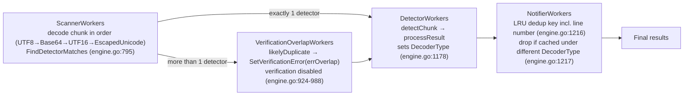

# TruffleHog Decoders, Overlap Detection, and Deduplication: Why the Same AWS Key Yields a Varying Result Count

> **Scope of this document.** This is a read-only, evidence-grounded investigation. It explains — from **observed runtime behavior** plus exact source citations — how TruffleHog's **decoder pipeline**, **verification-overlap detection**, and **result deduplication** interact when one file contains the same logical AWS access key in more than one encoded form, and precisely **why the final result count varies**. No source file was modified; the only artifact produced is this Markdown document.
>
> **Repository / commit.** Go module `github.com/trufflesecurity/trufflehog/v3`, pinned at commit `e42153d44a5e5c37c1bd0c70e074781e9edcb760` (HEAD of source branch `trufflehog_e42153d44a5e`). Every `file:line` citation and every quoted output block below was verified against the source at **this exact commit** and captured by actually building and running the binary.

## The reported scenario (verbatim)

> "I was scanning a file containing both a raw AWS access key and the same key as Base64-encoded, and I got confused by the output. Sometimes TruffleHog reported the secret twice with different decoder types, sometimes it reported an overlap error, and sometime it deduplicated down to a single result. The behaviour seemed inconsistent depending on how I structured the test file."

The canonical example preserved throughout this document is exactly that: **"a file containing both a raw AWS access key and the same key as Base64-encoded."**

The question decomposes into six sub-questions, each answered independently below and re-confirmed in the closing coverage pass:

- **SQ1 — Decoder handling:** how the decoder pipeline handles the same secret in multiple encoded forms (plain text, Base64, escaped unicode).
- **SQ2 — Decoder types reported:** which decoder types appear in the output.
- **SQ3 — Overlap detection:** whether overlap detection occurs, and what triggers it.
- **SQ4 — Deduplication effect:** how deduplication affects the final result count.
- **SQ5 — Ordering:** whether deduplication happens before or after overlap detection.
- **SQ6 — Variance explanation:** why the same logical secret sometimes produces one result and sometimes many.

### Short answer (executive summary)

Two **independent** mechanisms, operating at **different stages** of a fixed four-stage worker pipeline, together explain everything the user saw:

1. **Deduplication** (in the *notifier* stage) decides **one result vs. two**. Its dedup key includes the file path **and line number**, so the plaintext and Base64 occurrences collapse to **one** result when they resolve to the **same line**, but survive as **two** results (with different decoder types) when they resolve to **different lines**.
2. **Verification-overlap detection** (in the *scanner*/*verification-overlap* stages) is what produces the **overlap error**. It fires only when **two or more *distinct* detectors** match the same span — never from a single detector (such as AWS) matching the same key across two decoders. That is why the overlap error appeared only for some file structures.

Deduplication happens **strictly after** overlap detection (SQ5).

---

## Reproduction environment & method

**Toolchain.** `go.mod` declares `go 1.23.1` (`go.mod:3`) with `toolchain go1.24.2` (`go.mod:5`). The project was built and run with **Go 1.24.2**.

**Build command** (from the repository root):

```console
$ CGO_ENABLED=0 go build -o /tmp/trufflehog_bin .
$ /tmp/trufflehog_bin --version
trufflehog dev
```

The build produced a ~194 MB static binary; the binary self-reports version `trufflehog dev` (written to stderr; `--version` produces no other output — stdout is empty). Note that the startup banner `🐷🔑🐷  TruffleHog. Unearth your secrets. 🐷🔑🐷` is **not** part of `--version` output; it is printed to stderr only on the scan path, gated at `main.go:497` (`if !*jsonLegacy && !*jsonOut`) — kingpin's `--version` handler, registered at `main.go:270` (`cli.Version("trufflehog " + version.BuildVersion)`), calls `os.Exit` before that line is reached. The banner therefore appears in the scan reproductions below (e.g., the plaintext scan), where it legitimately shows up as the first stderr line.

**Scan command template (AWS cases):**

```console
$ /tmp/trufflehog_bin filesystem <file> --no-verification --results=verified,unknown,unverified,filtered_unverified [--json]
```

**Overlap reproduction additionally uses:**

```console
$ /tmp/trufflehog_bin filesystem <file> \
    --config pkg/engine/testdata/verificationoverlap_detectors.yaml \
    --no-verification --results=verified,unknown,unverified,filtered_unverified --log-level=2
```

**Invalid flag — `--results=all`.** `--results=all` is **not** valid and must not be used. The valid values are exactly `verified,unknown,unverified,filtered_unverified`. Observed verbatim when attempted:

<pre>
$ /tmp/trufflehog_bin filesystem /tmp/th_investigation/plain.txt --no-verification --results=all
... error   trufflehog   failed to configure results flag   {"error": "invalid value 'all', valid values are 'verified,unknown,unverified,filtered_unverified'"}
</pre>

The validation logic lives at `main.go:985` (the accepted `case` list) and `main.go:988` (the error), and the flag itself is declared at `main.go:61`.

**Test credential** used across the AWS reproductions (an AWS result requires **both** parts; see SQ6). These are **synthetic, non-functional example values** — the secret is AWS's own canonical documentation placeholder (note the trailing `EXAMPLEKEY`), and the ID is fabricated for this investigation. They were **never verified** against AWS (all scans used `--no-verification`); they are reproduced here only because they are the literal `Raw result` the tool reports:

- Access key ID: `AKIAZ3LH7XQ2WL9MNP4R` — matches `idPat`, ID entropy ≥ 3.0.
- Secret: `wJalrXUtnFEMI/K7MDENG/bPxRfiCYEXAMPLEKEY` — 40 characters, matches `SecretPat`, secret entropy ≥ 4.25, not pure hex.
- Base64 of the payload `aws_access_key_id = AKIAZ3LH7XQ2WL9MNP4R aws_secret_access_key = wJalrXUtnFEMI/K7MDENG/bPxRfiCYEXAMPLEKEY`:
  `YXdzX2FjY2Vzc19rZXlfaWQgPSBBS0lBWjNMSDdYUTJXTDlNTlA0UiBhd3Nfc2VjcmV0X2FjY2Vzc19rZXkgPSB3SmFsclhVdG5GRU1JL0s3TURFTkcvYlB4UmZpQ1lFWEFNUExFS0VZ`

**Reading the result count.** The scanner does **not** print a literal `# TOTAL:` line. The number of results is reported by the end-of-scan summary log line — the `unverified_secrets` field — and can be independently confirmed by counting the emitted JSON objects (`--json`, one JSON object per result). Both are used as evidence below; where a block shows a comment like `# results: 1`, that is the measured count, not literal tool output.

**Repository hygiene.** All crafted inputs were created under `/tmp/th_investigation` (outside the repository tree) and removed after capture. `git status --porcelain` was empty before and after the investigation; the only file added to the repository is this document.

**A note on non-determinism.** TruffleHog runs concurrent worker pools, so several observable details are **non-deterministic** across runs. These are flagged explicitly at each relevant sub-question. Where a value is non-deterministic it is described as such rather than presented as fixed.

---

## SQ1 — How the decoder pipeline handles the same secret in multiple encoded forms

**Answer.** TruffleHog applies a **fixed, ordered set of decoders** to each chunk, **once each, in order** — a **single pass**. There is **no** iterative re-decoding in this commit (each decoder is applied exactly once; a decoder's output is not fed back through the whole chain). The default set is returned by `DefaultDecoders()`:

- `pkg/decoders/decoders.go:8` — `func DefaultDecoders() []Decoder`.
- The order, and the pivotal comment that explains it (`pkg/decoders/decoders.go:10`, reproduced verbatim): `// UTF8 must be first for duplicate detection`, followed by `&UTF8{}` (`:11`), `&Base64{}` (`:12`), `&UTF16{}` (`:13`), `&EscapedUnicode{}` (`:14`).
- The `Decoder` interface is `FromChunk(chunk *sources.Chunk) *DecodableChunk` + `Type() detectorspb.DecoderType` (`decoders.go:25-28`); `DecodableChunk` wraps a chunk together with the `DecoderType` that produced it (`decoders.go:20-23`).

The exact source:

```go
// pkg/decoders/decoders.go:8-16
func DefaultDecoders() []Decoder {
	return []Decoder{
		// UTF8 must be first for duplicate detection
		&UTF8{},
		&Base64{},
		&UTF16{},
		&EscapedUnicode{},
	}
}
```

**Per-decoder behavior** (each with citations):

- **UTF8** (`pkg/decoders/utf8.go`) — `Type()` returns `DecoderType_PLAIN` (`utf8.go:13`). Its `FromChunk` (`utf8.go:16-29`) returns `nil` only for a nil/empty chunk (`utf8.go:17-19`); otherwise it always returns a non-nil chunk, sanitizing invalid UTF-8 via `extractSubstrings` (`utf8.go:24`). This is **why UTF8 must be first**: the plaintext view of the data is always available, which anchors duplicate detection downstream.
- **Base64** (`pkg/decoders/base64.go`) — `Type()` returns `DecoderType_BASE64` (`base64.go:31`). `FromChunk` (`base64.go:34`) scans for Base64 substrings of length **≥ 20** via `getSubstringsOfCharacterSet(chunk.Data, 20, b64CharsetMapping, b64EndChars)` (`base64.go:36`). If it finds substrings that decode to ASCII, it **mutates `chunk.Data` in place** with the decoded bytes — `chunk.Data = result.Bytes()` (`base64.go:67`) — and returns the chunk; if nothing decodable is present it returns `nil` (`base64.go:71`). The **in-place mutation** and the **≥ 20** length threshold are both central: the mutation means the next decoder in the chain sees the already-Base64-decoded bytes, and the threshold means short Base64-looking tokens are ignored.
- **UTF16** (`pkg/decoders/utf16.go`) — `Type()` returns `DecoderType_UTF16` (`utf16.go:15`).
- **EscapedUnicode** (`pkg/decoders/escaped_unicode.go`) — `Type()` returns `DecoderType_ESCAPED_UNICODE` (`escaped_unicode.go:29`). It matches two patterns — `codePointPat = ` `` `\bU\+([a-fA-F0-9]{4}).?` `` (`escaped_unicode.go:22`) and `escapePat = ` `` `(?i:\\{1,2}u)([a-fA-F0-9]{4})` `` (`escaped_unicode.go:25`) — and, unlike Base64, it **clones** the data (`bytes.Clone`, `escaped_unicode.go:39`) and returns a **new** chunk (`escaped_unicode.go:52-64`) only when one of those patterns is present; otherwise it returns `nil` (`escaped_unicode.go:66`).

**How the engine applies them.** In the scanner worker, the decoders are applied sequentially to the same chunk; each non-nil decode is routed onward. Because Base64 mutates `chunk.Data` in place, each subsequent decoder sees the prior decoder's output — but the chain runs **once** (no feedback loop). The decoder that produced a given `DecodableChunk` is carried forward as `decoded.DecoderType` when the chunk is dispatched to the detector workers (`pkg/engine/engine.go:813`) or to the verification-overlap workers (`pkg/engine/engine.go:801`).

**Rationale.** The same logical secret in different encodings is surfaced by **different decoders**: the plaintext occurrence via UTF8 → `PLAIN`, and the Base64-encoded occurrence via Base64 → `BASE64` (after the in-place decode makes the credential visible to the detectors). An escaped-unicode occurrence would analogously be surfaced by the EscapedUnicode decoder → `ESCAPED_UNICODE`.

**Honesty note (required).** The runtime reproduction exercised **plain text and Base64** — the user's canonical scenario. The **escaped-unicode** path is documented here **from code only** (`escaped_unicode.go:22/25/29`, and the clone/new-chunk behavior at `:39/:52-64`); it was **not** separately reproduced at runtime, so no observed escaped-unicode output is claimed below.

---

## SQ2 — Which decoder types are reported in the output

**Answer.** In **this commit** the `DecoderType` enumeration has exactly **five** values — there is **no `HTML` value**:

- Proto source of truth, `proto/detectors.proto:7-13`: `UNKNOWN = 0;` (`:8`), `PLAIN = 1;` (`:9`), `BASE64 = 2;` (`:10`), `UTF16 = 3;` (`:11`), `ESCAPED_UNICODE = 4;` (`:12`).

```proto
// proto/detectors.proto:7-13
enum DecoderType {
  UNKNOWN = 0;
  PLAIN = 1;
  BASE64 = 2;
  UTF16 = 3;
  ESCAPED_UNICODE = 4;
}
```

- Generated Go constants, `pkg/pb/detectorspb/detectors.pb.go:26-30`: `DecoderType_UNKNOWN = 0`, `DecoderType_PLAIN = 1`, `DecoderType_BASE64 = 2`, `DecoderType_UTF16 = 3`, `DecoderType_ESCAPED_UNICODE = 4`; the value→name map is at `detectors.pb.go:35-41`. A grep for `HTML` across `detectors.pb.go` returns **zero** matches.
- Each result's decoder type is stamped in `processResult`: `secret.DecoderType = data.decoder` (`pkg/engine/engine.go:1178`), where `data.decoder` originates from the `DecodableChunk.DecoderType` carried through the scanner (`engine.go:801` and `engine.go:813`).

**Observed in output.** For the same AWS key, both `PLAIN` and `BASE64` were observed — one per encoded form. The output shows this in the `Decoder Type:` field. (Note: real output also includes a `Resource_type: Access key` line for AWS and INFO log lines; the count is reported by the `finished scanning` summary's `unverified_secrets`, not by a `# TOTAL:` line.)

Plaintext input → `PLAIN`:

<pre>
$ /tmp/trufflehog_bin filesystem /tmp/th_investigation/plain.txt --no-verification --results=verified,unknown,unverified,filtered_unverified
🐷🔑🐷  TruffleHog. Unearth your secrets. 🐷🔑🐷

... info-0  trufflehog  running source  {"source_manager_worker_id": "UyZTm", "with_units": true}
Found unverified result 🐷🔑❓
Detector Type: AWS
Decoder Type: PLAIN
Raw result: AKIAZ3LH7XQ2WL9MNP4R
Resource_type: Access key
File: /tmp/th_investigation/plain.txt
Line: 1

... info-0  trufflehog  finished scanning  {"chunks": 1, "bytes": 106, "verified_secrets": 0, "unverified_secrets": 1, ...}
# results: 1
</pre>

Base64-encoded input → `BASE64`:

<pre>
$ /tmp/trufflehog_bin filesystem /tmp/th_investigation/b64.txt --no-verification --results=verified,unknown,unverified,filtered_unverified
Found unverified result 🐷🔑❓
Detector Type: AWS
Decoder Type: BASE64
Raw result: AKIAZ3LH7XQ2WL9MNP4R
Resource_type: Access key
File: /tmp/th_investigation/b64.txt
Line: 1

... info-0  trufflehog  finished scanning  {"chunks": 1, "bytes": 106, "verified_secrets": 0, "unverified_secrets": 1, ...}
# results: 1
</pre>

The same facts confirmed via `--json` (one object per result; `DecoderName` is the string form of `DecoderType`):

<pre>
$ /tmp/trufflehog_bin filesystem /tmp/th_investigation/plain.txt --no-verification --json --results=verified,unknown,unverified,filtered_unverified
DetectorName=AWS DecoderName=PLAIN  Raw=AKIAZ3LH7XQ2WL9MNP4R Line=1
# JSON objects: 1

$ /tmp/trufflehog_bin filesystem /tmp/th_investigation/b64.txt --no-verification --json --results=verified,unknown,unverified,filtered_unverified
DetectorName=AWS DecoderName=BASE64 Raw=AKIAZ3LH7XQ2WL9MNP4R Line=1
# JSON objects: 1
</pre>

**Rationale.** The reported decoder type is fixed by *which decoder produced the chunk in which the detector matched*: a plaintext occurrence → `PLAIN`; a Base64 blob that decodes to the credential → `BASE64`. `UTF16` and `ESCAPED_UNICODE` exist in the enum and in the pipeline but were **not** produced by these plain+Base64 inputs, so they do not appear in this reproduction.

---


## SQ3 — Overlap detection: does it occur, and what triggers it?

**Answer.** Overlap detection is a **separate mechanism from deduplication**. It is triggered when **more than one *distinct* detector** matches the same chunk span — **not** by a single detector (such as AWS) matching the same key across two decoders. When it triggers with verification disabled for overlaps, TruffleHog attaches a specific verification error to the affected result(s).

**Code path** (cited precisely):

- In `scannerWorker`, after decoding, the engine collects all detectors whose keywords match the (decoded) chunk data: `matchingDetectors := e.AhoCorasickCore.FindDetectorMatches(decoded.Chunk.Data)` (`pkg/engine/engine.go:795`). `FindDetectorMatches` is defined at `pkg/engine/ahocorasick/ahocorasickcore.go:241` — `func (ac *Core) FindDetectorMatches(chunkData []byte) []*DetectorMatch`.
- Routing to the overlap path: `if len(matchingDetectors) > 1 && !e.verificationOverlap {` (`engine.go:796`) → the chunk is sent to `e.verificationOverlapChunksChan` (`engine.go:798`). In words: **more than one** matching detector, and the `--allow-verification-overlap` behavior is **not** enabled.
- `verificationOverlapWorker` (`engine.go:924`) runs the detectors **without verifying** at this stage, and for each candidate result it calls `likelyDuplicate(...)` (`engine.go:982`). When that returns true, it attaches the overlap error: `res.SetVerificationError(errOverlap)` (`engine.go:988`).
- **Crucial subtlety — why one detector is not enough.** `likelyDuplicate` (`engine.go:887`) uses `const similarityThreshold = 0.9` (`engine.go:888`) and **skips comparisons between the same detector type**:

```go
// pkg/engine/engine.go:898-902
// If the detector type is the same, we don't need to compare the strings.
// These are not duplicates, and should be verified.
if val.detectorKey.Type() == dupeKey.detectorKey.Type() {
    continue
}
```

  Therefore overlap requires **two *distinct* detector types** matching one span. A single AWS key matched by one detector across two decoders (PLAIN and BASE64) does **not** trigger overlap — which is exactly why the user's raw-vs-Base64 AWS file did not, by itself, produce the overlap error.

**The overlap error string — verbatim** (`engine.go:39-42`). It is built by Go string concatenation, so there is **no space** between `disabled.` and `You`:

```go
// pkg/engine/engine.go:39-42
var errOverlap = errors.New(
	"More than one detector has found this result. For your safety, verification has been disabled." +
		"You can override this behavior by using the --allow-verification-overlap flag.",
)
```

Reproduced exactly:

<pre>
More than one detector has found this result. For your safety, verification has been disabled.You can override this behavior by using the --allow-verification-overlap flag.
</pre>

**Reproduction (verbatim evidence).** The repository ships a fixture designed to force this path: `pkg/engine/testdata/verificationoverlap_detectors.yaml` defines two custom detectors:

```yaml
# pkg/engine/testdata/verificationoverlap_detectors.yaml
detectors:
  - name: detector1
    keywords:
      - PMAK
    regex:
      api_key: \b(PMAK-[a-zA-Z-0-9]{59})\b
  - name: detector2
    keywords:
      - ost 
    regex:
      api_key: \b([a-zA-Z-0-9]{59})\b
```

**Fidelity note.** `detector2`'s keyword is shown above exactly as the fixture stores it — an *unquoted plain scalar with a trailing space* (`pkg/engine/testdata/verificationoverlap_detectors.yaml:11`). YAML trims trailing whitespace from unquoted plain scalars, so TruffleHog's config parser (`protoyaml.UnmarshalStrict`, `pkg/config/config.go:30`) loads `detector2`'s keyword as the 3-character string `ost` (trailing space trimmed) — verified by parsing the fixture through that exact code path. Had it been written as the quoted scalar `"ost "`, the trailing space would be preserved, yielding a 4-character keyword.

Scanning a file whose line 2 is `POSTMAN_API_KEY="PMAK-qnwfsLyRSyfCwfpHaQP1UzDhrgpWvHjbYzjpRCMshjt417zWcrzyHUArs7r"` makes **three distinct detectors** match the same span: the **built-in `Postman`** detector (`pkg/detectors/postman/postman.go:29`, `keyPat = regexp.MustCompile(` `` `\b(PMAK-[a-zA-Z-0-9]{59})\b` `` `)`, keyword `"PMAK-"` at `:35`) plus the two `CustomRegex` detectors from the config. Because `Postman` and `CustomRegex` are **distinct types**, `likelyDuplicate` does *not* skip the comparison and the overlap error is attached. Command and observed console output (one representative run):

<pre>
$ /tmp/trufflehog_bin filesystem /tmp/th_investigation/overlap_secret.txt \
    --config pkg/engine/testdata/verificationoverlap_detectors.yaml \
    --no-verification --results=verified,unknown,unverified,filtered_unverified --log-level=2

info-2  trufflehog  starting scanner workers          {"count": 128}
info-2  trufflehog  starting detector workers         {"count": 1024}
info-2  trufflehog  starting verificationOverlap workers  {"count": 128}
info-2  trufflehog  starting notifier workers         {"count": 128}
info-0  trufflehog  running source                    {"source_manager_worker_id": "0PSZ6", "with_units": true}
info-2  trufflehog  found similar duplicate           {"verification_overlap_worker_id": "YWAf5", "timeout": 2}
Found unverified result 🐷🔑❓
Detector Type: CustomRegex
Decoder Type: PLAIN
Raw result: qnwfsLyRSyfCwfpHaQP1UzDhrgpWvHjbYzjpRCMshjt417zWcrzyHUArs7r
Name: detector2
File: /tmp/th_investigation/overlap_secret.txt
Line: 2
Found unverified result 🐷🔑❓
Verification issue: More than one detector has found this result. For your safety, verification has been disabled.You can override this behavior by using the --allow-verification-overlap flag.
Detector Type: Postman
Decoder Type: PLAIN
Raw result: PMAK-qnwfsLyRSyfCwfpHaQP1UzDhrgpWvHjbYzjpRCMshjt417zWcrzyHUArs7r
File: /tmp/th_investigation/overlap_secret.txt
Line: 2
Found unverified result 🐷🔑❓
Detector Type: CustomRegex
Decoder Type: PLAIN
Raw result: PMAK-qnwfsLyRSyfCwfpHaQP1UzDhrgpWvHjbYzjpRCMshjt417zWcrzyHUArs7r
Name: detector1
File: /tmp/th_investigation/overlap_secret.txt
Line: 2
info-0  trufflehog  finished scanning  {"chunks": 1, "bytes": 84, "verified_secrets": 0, "unverified_secrets": 3, ...}
# results: 3
</pre>

The four worker-pool startup lines above independently confirm the four concurrent pools (see SQ5). The `found similar duplicate` line comes from the similarity branch of `likelyDuplicate` (`engine.go:916`); the exact-match branch logs `found exact duplicate` (`engine.go:906`).

**Worker counts are host-CPU-dependent, not fixed.** The counts `128 / 1024 / 128 / 128` are **not** hard-coded. Scanner/verification-overlap/notifier pools size to `--concurrency`, which defaults to `runtime.NumCPU()` (`main.go:58`); the detector pool is that value times a multiplier of `8` (default `detectorWorkerMultiplier`, `pkg/engine/engine.go:345`). On this host, Go's `runtime.NumCPU()` returned **128** (so scanner/overlap/notifier = 128 and detector = 128 × 8 = 1024), even though the coreutils `nproc` reported `4` — a known container discrepancy where `nproc` honors the cgroup CPU quota while Go observes all host logical CPUs. On a machine with a different CPU count these numbers scale accordingly; do not treat `128`/`1024` as constants.

**Non-determinism (required).** The overlap error is **always** produced and there are **always 3 results**, but details vary across runs because the worker pools are concurrent:

- **Which result(s) carry the error is non-deterministic.** Across repeated runs the error was carried by `Postman` alone, by `Postman` + one `CustomRegex`, and by both `CustomRegex` results (with `Postman` clean). This is because `verificationOverlapWorker` attaches the error to whichever *similar* results it encounters after the first, and worker ordering is not fixed.
- **The duplicate log line is either `found similar duplicate` or `found exact duplicate`.** Both were observed. `found exact duplicate` (`engine.go:906`) fires when identical raw values are compared across types (e.g., `Postman` vs. `detector1`, both `PMAK-…`); `found similar duplicate` (`engine.go:916`) fires when near-identical values are compared (e.g., either `PMAK-…` result vs. `detector2`'s prefix-stripped 59-char value, whose Levenshtein similarity exceeds `0.9`).
- **The `verification_overlap_worker_id` is a random per-run worker id.** Observed values included `YWAf5`, `8Qtpp`, `JQYQd`, `1L3CG`, `JPpCR`, and `DJiEC`; it will differ every run.

**Contrast that proves the "two distinct types" requirement.** If instead you isolate the scan to only the two *custom* detectors (both of type `CustomRegex`), **no** overlap is reported — because `likelyDuplicate` skips same-type comparisons (`engine.go:898-902`). The repository's own unit test `TestVerificationOverlapChunk` (`pkg/engine/engine_test.go:503`) encodes exactly this: it sets `IncludeDetectors: "904"` to isolate the run to only the custom detectors (`engine_test.go:529`) and asserts `wantDupe := 0` (`engine_test.go:554`) against `e.verificationOverlapTracker.verificationOverlapDuplicateCount` (`engine_test.go:555`). The overlap in the reproduction above therefore depends on the **built-in `Postman`** detector being a *different* type from `CustomRegex`.

---


## SQ4 — How deduplication affects the final result count

**Answer.** Deduplication happens in the **notifier stage** (`notifierWorker`, `pkg/engine/engine.go:1189`), backed by an LRU cache. The dedup key combines the detector type, the raw values, **and the source metadata** — and the source metadata for a filesystem scan includes the **file path and line number**. The exact key construction (`engine.go:1216`):

```go
// pkg/engine/engine.go:1216
key := fmt.Sprintf("%s%s%s%+v", result.DetectorType.String(), result.Raw, result.RawV2, result.SourceMetadata)
```

A result is **dropped** only when that key is already cached under a **different decoder type** (`engine.go:1217-1219`), and every surviving result records its decoder type in the cache (`engine.go:1221`):

```go
// pkg/engine/engine.go:1217-1221
if val, ok := e.dedupeCache.Get(key); ok && (val != result.DecoderType ||
    result.SourceType == sourcespb.SourceType_SOURCE_TYPE_POSTMAN) {
    continue
}
e.dedupeCache.Add(key, result.DecoderType)
```

Supporting wiring:

- The cache field is `dedupeCache *lru.Cache[string, detectorspb.DecoderType]` (`engine.go:209`).
- It is created in `initialize()` with `const cacheSize = 512` (`engine.go:491`) via `lru.New[string, detectorspb.DecoderType](cacheSize)` (`engine.go:493`).
- The surrounding comment (`engine.go:1210-1215`) states the intent directly: dedupe by detector type, raw result, and source metadata; drop **duplicate results with different decoder types**, but **keep** duplicates that share the same decoder type; and for Postman sources, dedupe regardless of decoder type.

**Consequence for the user's file.** Because the key includes the **line number** (through `SourceMetadata`), two occurrences of the same key value behave differently depending on layout:

- **Same line** → identical dedup key → the second occurrence (arriving under a *different* decoder type) matches the `val != result.DecoderType` condition and is **dropped** → **1 result**.
- **Different lines** → different `SourceMetadata` → different keys → nothing is dropped → **2 results**, each with its own decoder type.

**Verbatim evidence — same line (deduplicated to 1).** `both_sameline.txt` places the plaintext credential and its Base64 form on the **same line 1**:

<pre>
$ /tmp/trufflehog_bin filesystem /tmp/th_investigation/both_sameline.txt --no-verification --results=verified,unknown,unverified,filtered_unverified
Found unverified result 🐷🔑❓
Detector Type: AWS
Decoder Type: PLAIN
Raw result: AKIAZ3LH7XQ2WL9MNP4R
Line: 1

... info-0  trufflehog  finished scanning  {"chunks": 1, "bytes": 212, "verified_secrets": 0, "unverified_secrets": 1, ...}
# results: 1  (DEDUPLICATED)
</pre>

**Verbatim evidence — different lines (not deduplicated, 2 results).** `both_difflines.txt` puts the Base64 blob on **line 1** and the plaintext id/secret on **lines 4–5**:

<pre>
$ /tmp/trufflehog_bin filesystem /tmp/th_investigation/both_difflines.txt --no-verification --results=verified,unknown,unverified,filtered_unverified
Found unverified result 🐷🔑❓
Detector Type: AWS
Decoder Type: BASE64
Raw result: AKIAZ3LH7XQ2WL9MNP4R
Line: 1
Found unverified result 🐷🔑❓
Detector Type: AWS
Decoder Type: PLAIN
Raw result: AKIAZ3LH7XQ2WL9MNP4R
Line: 4

... info-0  trufflehog  finished scanning  {"chunks": 1, "bytes": 214, "verified_secrets": 0, "unverified_secrets": 2, ...}
# results: 2  (NOT deduplicated: BASE64@line1 + PLAIN@line4)
</pre>

**Non-determinism (required).** For the **same-line** case, the **count is always 1** — this was stable across 10/10 runs. However, **which decoder type survives is non-deterministic**: across those 10 runs the survivor was `BASE64` **7** times and `PLAIN` **3** times. This is because the **first** result to reach `notifierWorker` wins the cache slot (`engine.go:1221`) and the later same-key/different-decoder result is dropped (`engine.go:1217`); worker ordering is concurrent. Do **not** assume `PLAIN` (or `BASE64`) always survives. For the **different-line** case the **count is always 2** (stable across 6/6 runs: `BASE64@line1` and `PLAIN@line4`); only the print order of the two results can vary.

**Postman aside.** As the `||` clause at `engine.go:1218` shows, for `SOURCE_TYPE_POSTMAN` sources deduplication happens **regardless** of decoder type. That branch does not apply to the filesystem AWS scenario here, but it is why the key comment at `engine.go:1215` calls Postman out specifically.

---

## SQ5 — Ordering: does deduplication happen before or after overlap detection?

**Answer.** **Deduplication happens *after* overlap detection.** The engine's worker pipeline is fixed and one-directional:

`ScannerWorkers → VerificationOverlapWorkers → DetectorWorkers → NotifierWorkers`

- **Overlap** routing and handling occur **upstream**, in the scanner and verification-overlap stages: routing at `engine.go:796`, the worker and its error attachment at `engine.go:924-988`.
- **Deduplication** occurs **downstream**, in the notifier stage (`engine.go:1189-1221`), which consumes the results channel fed by the detector workers. The dedup cache is not even consulted until a result reaches `notifierWorker`.

The order is imposed by the **channel topology**, not by any timing assumption:

1. `scannerWorker` sends each decoded chunk either to `e.verificationOverlapChunksChan` when more than one detector matched (`engine.go:798`) or directly to `e.detectableChunksChan` for the single-detector case (`engine.go:810`).
2. `verificationOverlapWorker` **reads** `e.verificationOverlapChunksChan` (`engine.go:932`), does its overlap handling, and then forwards the chunk onward to `e.detectableChunksChan` (`engine.go:1014`).
3. `detectorWorker` reads `e.detectableChunksChan` (`engine.go:1037`) and, via `processResult`, publishes each result onto `e.results` (`engine.go:1186`).
4. `notifierWorker` reads `e.ResultsChan()` (`engine.go:1190`) and only there applies the LRU dedup. So a result must pass entirely through the overlap and detector stages before dedup can act on it.

**Corroboration in the code's own docs and startup order.**

- `docs/concurrency.md` contains a `sequenceDiagram` (`docs/concurrency.md:6`) that **creates** the pools in exactly this order: `ScannerWorkers` (`:10`), `VerificationOverlapWorkers` (`:13`), `DetectorWorkers` (`:16`), `NotifierWorkers` (`:19`); it also shows the scanner routing chunks to the detector workers (`:29`) and, when multiple detectors match, to the verification-overlap workers (`:31`).
- `docs/process_flow.md` describes the four-stage pipeline: **Source Decomposition** (`:9`) → **Chunk to Detector Matching** via Aho-Corasick (`:74`) → **Secret Detection** including a **De-Dupe-Detectors** step (`:88`, `:106`) → **Result Notification** (`:126`).
- All four pools are started during `run()`: `startScannerWorkers` (`engine.go:648`), `startDetectorWorkers` (`:651`), `startVerificationOverlapWorkers` (`:655`), `startNotifierWorkers` (`:659`) — with the worker functions defined at `:662`, `:675`, `:690`, `:705` respectively. Note the *startup-call* order lists the detector pool before the verification-overlap pool (and the runtime `starting … workers` log lines in the SQ3 block reflect that same startup order); this is immaterial because each pool blocks on its input channel until work arrives, and it is the channel wiring above — not the startup order — that fixes the **data-flow** order `scanner → verificationOverlap → detector → notifier`.

Because the overlap decision is made in the scanner/overlap stages and the dedup cache is applied only in the strictly-downstream notifier stage, **deduplication is necessarily after overlap detection**.



---


## SQ6 — Why the same logical secret sometimes yields one result and sometimes many

**Answer (synthesis).** The three behaviors the user observed come from **two independent mechanisms at different pipeline stages**. Conflating them is what made the output look "inconsistent."

1. **One vs. two results is governed by DEDUPLICATION (notifier stage), which keys on the line number** (through `SourceMetadata`, `engine.go:1216`):
   - **Same line** (plaintext + Base64 on one line) → identical dedup key → the second is dropped → **1 result**. (The count is deterministic; the surviving decoder type is not — see SQ4.)
   - **Different lines** → different keys → **2 results**, one `PLAIN` at its line and one `BASE64` at its line.
2. **The overlap error is governed by OVERLAP DETECTION (scanner/verification-overlap stage) and requires two *distinct* detectors matching one span** (`engine.go:796`, and the same-type skip at `engine.go:898-902`). This is a **different phenomenon** from the single-detector AWS dedup case. The user only saw the overlap error for file structures that caused **two different detectors** to match the same text — never from a lone AWS key appearing in raw and Base64 forms.

**Three-way behavior mapping** (the spine of the answer), each backed by the observed runs above:

| User's description | File structure that produces it | Result count | Decoder type(s) | Mechanism |
|---|---|---|---|---|
| "reported the secret twice with different decoder types" | raw and Base64 forms on **different lines** | **2** | `PLAIN` (its line) + `BASE64` (its line) | Deduplication key differs by line → both survive |
| "deduplicated down to a single result" | raw and Base64 forms on the **same line** | **1** | one survives (non-deterministic which) | Same dedup key → second dropped (`engine.go:1217`) |
| "reported an overlap error" | **two distinct detectors** match the same span (here Postman + CustomRegex) | **3** (all kept; error attached) | all `PLAIN` in the reproduction | Overlap detection (`engine.go:796`, `:924-988`) |

**Why the AWS key is detected at all (reproducibility guardrails).** An AWS result requires **both** an ID match and a valid secret:

- ID: `idPat = ` `` `\b((?:AKIA|ABIA|ACCA)[A-Z0-9]{16})\b` `` (`pkg/detectors/aws/access_keys/accesskey.go:65`); keywords `AKIA`/`ABIA`/`ACCA` (`accesskey.go:72-74`).
- Secret: `SecretPat = ` `` `(?:[^A-Za-z0-9+/]|\A)([A-Za-z0-9+/]{40})(?:[^A-Za-z0-9+/]|\z)` `` (`pkg/detectors/aws/common.go:10`) — a 40-character capturing group.
- Entropy thresholds: `RequiredIdEntropy = 3.0` (`common.go:6`) and `RequiredSecretEntropy = 4.25` (`common.go:7`).
- False-positive filter: pure-hex 40-char secrets are rejected by `FalsePositiveSecretPat = ` `` `[a-f0-9]{40}` `` (`pkg/detectors/aws/utils.go:47`). The chosen secret `wJalrXUtnFEMI/K7MDENG/bPxRfiCYEXAMPLEKEY` is mixed-case with `/`, so it is **not** filtered.

This is also why the Base64 case works: the Base64 blob decodes (in place, SQ1) to a payload that contains **both** the ID and the 40-char secret, so the AWS detector matches on the decoded bytes and the result is stamped `BASE64`.

---

## Commit-vs-upstream divergence (grounded strictly in this commit)

Two upstream-`main` features are **absent** here and must not be attributed to this build:

- **No `HTML` decoder type.** This commit's `DecoderType` enum has exactly `UNKNOWN=0, PLAIN=1, BASE64=2, UTF16=3, ESCAPED_UNICODE=4` (`proto/detectors.proto:8-12`; generated constants `pkg/pb/detectorspb/detectors.pb.go:26-30`; a `grep` for `HTML` in `detectors.pb.go` returns **zero** matches). Upstream `main` adds `HTML=5`; it does **not** exist here.
- **No `--max-decode-depth` iterative decoding.** A repository search for `max-decode-depth` / `maxDecodeDepth` / `MaxDecodeDepth` / `DecodeDepth` returns **no matches** (grep exit code `1`). Decoding in this commit is therefore **single-pass**: each decoder is applied once, in the fixed order from `DefaultDecoders()` (SQ1). The newer "each decoder's output is fed back through all decoders" behavior must **not** be attributed to this build.
- **Corroboration (not a divergence).** The `--allow-verification-overlap` flag's purpose — allowing verification of similar credentials across detectors — is the exact inverse of the `errOverlap` message (`engine.go:39-42`), confirming the overlap mechanism is intentional.

---

## Coverage pass

A final check that each sub-question is answered explicitly and independently:

- **SQ1 ✔** — Fixed, single-pass decoder chain `DefaultDecoders()` = `[UTF8, Base64, UTF16, EscapedUnicode]` (`decoders.go:8-14`, comment `:10`); per-decoder `Type()`/`FromChunk` behavior with citations, including Base64's in-place mutation (`base64.go:67`) and ≥ 20 threshold (`base64.go:36`); escaped-unicode documented from code only (explicitly not reproduced at runtime).
- **SQ2 ✔** — Enum is exactly five values, no `HTML` (`detectors.proto:8-12`, `detectors.pb.go:26-30`); observed `PLAIN` and `BASE64` for the same key (verbatim single-form scans); `DecoderType` stamped at `engine.go:1178`.
- **SQ3 ✔** — Overlap requires **two distinct detectors** on one span (routing `engine.go:796`; same-type skip `engine.go:898-902`); full overlap error string reproduced verbatim (no space between "disabled." and "You", `engine.go:39-42`); reproduced at runtime (3 results) with the Postman + CustomRegex fixture; non-determinism (error carrier, exact-vs-similar duplicate, random worker id) stated.
- **SQ4 ✔** — Dedup key includes source metadata / line number (`engine.go:1216`), dropping only same-key/different-decoder results (`engine.go:1217-1221`, cache `:209/:491/:493`); same-line → 1, different-line → 2, both shown with verbatim output; count deterministic, surviving decoder non-deterministic.
- **SQ5 ✔** — Dedup is strictly after overlap: channel topology (`:798/:810/:932/:1014/:1037/:1186/:1190`), corroborated by `docs/concurrency.md` and `docs/process_flow.md` and the four worker-startup log lines; mermaid data-flow diagram included.
- **SQ6 ✔** — Three-way mapping ties count (dedup, line-keyed) and the overlap error (two distinct detectors) together, with AWS detection guardrails for reproducibility.

**Method reminder.** Every quoted block above was captured by building (`go build`, Go 1.24.2) and running `/tmp/trufflehog_bin` at commit `e42153d44a5e5c37c1bd0c70e074781e9edcb760`. Inputs were created under `/tmp/th_investigation` (outside the repository) and removed after capture; `git status --porcelain` was empty before and after. The only file added to the repository is this document. Result counts are deterministic (single-form = 1; same-line = 1; different-line = 2; overlap fixture = 3); the non-deterministic items (surviving decoder on the same line; which result carries the overlap error; exact-vs-similar duplicate log; the random `verification_overlap_worker_id`; and the host-CPU-dependent worker-pool sizes) are called out as such at the point they arise.

