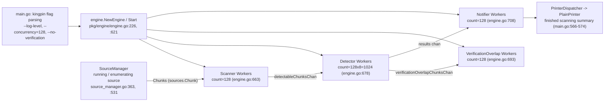

# TruffleHog Startup Behavior — A Runtime Investigation

> How the TruffleHog secret-scanning CLI comes online when the Go binary first
> starts during a basic filesystem scan: configuration handling, scanning-engine
> initialization, detector preparation, and inter-component communication.

This document answers, **from observed runtime behavior**, how TruffleHog
(`github.com/trufflesecurity/trufflehog/v3`) behaves the moment its Go binary
starts up during a small, safe filesystem scan. It is written against HEAD commit
`e42153d44a5e5c37c1bd0c70e074781e9edcb760` and follows a strict **run-first
methodology**: the binary was built from source, exercised against a minimal
directory with debug logging enabled, and its complete output captured — *then*
each observed signal was traced back to the exact source location that emits it.
Every behavioral claim below is paired with (i) the actual, unedited output that
demonstrates it and (ii) a `file:line` citation naming the responsible
function or struct. Anything that could not be seen directly at the debug log
level used here (`--log-level=2`) is explicitly labeled **`(inferred from
source)`** and, where possible, confirmed indirectly through its observable
effect (e.g., a worker-pool count that reveals a multiplier).

The four subsystems the investigation set out to explain are addressed by name:

- **(a) Configuration handling** — how flags and optional config are parsed and applied (Section 3).
- **(b) Scanning-engine initialization** — how the engine and its worker pools come online (Section 4).
- **(c) Detector preparation** — how the default detector set and keyword prefilter are readied (Section 5).
- **(d) Component communication** — how sources, workers, and printers exchange data (Section 6).

Edge-case behavior (invalid log level, disabled logging, empty scan target) is
covered in Section 7, external corroboration in Section 8, and the exact
methodology, cleanup, and repository-integrity guarantees in Section 9. This is
deliberately **not** a file-by-file code summary; it is a walkthrough of what the
running tool actually does. **No file in the TruffleHog source tree was modified,
added, or deleted** during this investigation — only this single document was
created.

---

## 1. Environment setup & build

**Direct answer:** TruffleHog builds with the standard Go toolchain into a single
static binary via `CGO_ENABLED=0 go build .`, and a from-source build reports its
version as `trufflehog dev`. No prebuilt binary was used; the observed behavior
reflects the exact code at the pinned commit.

### 1.1 Toolchain

The module declares its Go version floor and pinned toolchain in `go.mod`:

```text
module github.com/trufflesecurity/trufflehog/v3

go 1.23.1

toolchain go1.24.2
```

- The floor `go 1.23.1` is on **`go.mod:3`**; line 4 is intentionally blank; the
  pinned `toolchain go1.24.2` directive is on **`go.mod:5`**.
- CI pins the same major line — `go-version: "1.24"` at
  **`.github/workflows/test.yml:23`** (and identically across the CodeQL, lint,
  performance, release, and smoke workflows).

The build/run host for this investigation provided **Go 1.24.3**:

```bash
go version
# => go version go1.24.3 linux/amd64
```

Go 1.24.3 satisfies the `go.mod` floor (`go 1.23.1`), honors the `toolchain
go1.24.2` directive (a toolchain at or above the pinned patch is acceptable when
`GOTOOLCHAIN=local`), and matches CI's Go 1.24 pin. The observed patch version is
reported as-is per the run-first discipline.

### 1.2 Host concurrency context (critical for reproducing the numbers)

Every worker-pool count reported later in this document is a function of the
host's CPU count, because TruffleHog's default `--concurrency` is
`runtime.NumCPU()` (see Section 3). On the investigation host:

```bash
nproc
# => 128
```

so `runtime.NumCPU()` = **128**. On a machine with N cores the counts would scale
proportionally (N, N×8, N, N). All counts below are reported with this `NumCPU =
128` context so they are reproducible and correctly interpreted.

### 1.3 Canonical build

The canonical, from-source build mirrors the project's own tooling:

- `Makefile:17-18` — the `install` target: `CGO_ENABLED=0 go install .`
- `Dockerfile:5` — `ENV CGO_ENABLED=0`; `Dockerfile:9` — `go build -o trufflehog .`

The investigation built with `CGO_ENABLED=0 go build .` from the repository root.
To keep the working tree byte-for-byte pristine, the actual artifact was written
**outside** the repository using the `-o` flag (the target path is not inside the
checkout, so the build produces no tracked changes):

```bash
# Canonical build (repository root); -o target is OUTSIDE the repo to keep it pristine
CGO_ENABLED=0 go build -o /tmp/thbin/trufflehog .

/tmp/thbin/trufflehog --version
# => trufflehog dev
```

**Observed version banner:** `trufflehog dev`. This is the canonical value for a
from-source build without a release version stamp — the version string is a
package-level default:

```text
pkg/version/version.go:3   var BuildVersion = "dev"
```

Because `BuildVersion` is not overridden at link time in a plain `go build`, the
binary self-reports as `dev` both from `--version` and inside the startup log and
finished-scan summary (see Sections 2 and 6).

---

## 2. The debug-logged run command and its complete captured output

**Direct answer:** A single invocation of the real `filesystem` sub-command with
`--log-level=2 --no-verification` produces a fixed, ordered startup sequence: a
version line, the ASCII banner, four worker-pool "starting …" lines, a
"running source" line, an "enumerating source" line, and a single
"finished scanning" summary. Exit code is `0` and standard output is empty (all
diagnostic output goes to standard error).

### 2.1 The command

The minimal scan target is a single small file created **outside** the repository:

```bash
mkdir -p /tmp/minimal_scan
printf 'hello world\nthis is a minimal test file with no secrets\n' > /tmp/minimal_scan/example.txt   # 56 bytes

/tmp/thbin/trufflehog filesystem /tmp/minimal_scan --log-level=2 --no-verification
```

The scan target file `/tmp/minimal_scan/example.txt` (56 bytes, no secrets)
contained exactly:

```text
hello world
this is a minimal test file with no secrets
```

- `--log-level=2` is the project's "useful for debugging" verbosity tier
  (`CONTRIBUTING.md:33`); it is the same level used by the `Makefile` `run-debug`
  (`Makefile:51-52`) and `dogfood` (`Makefile:14-15`) targets.
- `--no-verification` is the safe dry-run switch: detected results are reported
  without any live credential-verification network calls.

### 2.2 Complete captured output — RUN 1

Command: `/tmp/thbin/trufflehog filesystem /tmp/minimal_scan --log-level=2 --no-verification`
— exit code **0**, standard output **empty**, standard error:

```text
2026-07-08T04:45:27Z	info-2	trufflehog	trufflehog dev
🐷🔑🐷  TruffleHog. Unearth your secrets. 🐷🔑🐷

2026-07-08T04:45:27Z	info-2	trufflehog	starting scanner workers	{"count": 128}
2026-07-08T04:45:27Z	info-2	trufflehog	starting detector workers	{"count": 1024}
2026-07-08T04:45:27Z	info-2	trufflehog	starting verificationOverlap workers	{"count": 128}
2026-07-08T04:45:27Z	info-2	trufflehog	starting notifier workers	{"count": 128}
2026-07-08T04:45:27Z	info-0	trufflehog	running source	{"source_manager_worker_id": "KyiHq", "with_units": true}
2026-07-08T04:45:27Z	info-2	trufflehog	enumerating source	{"source_manager_worker_id": "KyiHq"}
2026-07-08T04:45:27Z	info-0	trufflehog	finished scanning	{"chunks": 1, "bytes": 56, "verified_secrets": 0, "unverified_secrets": 0, "scan_duration": "5.258383ms", "trufflehog_version": "dev", "verification_caching": {"Hits":0,"Misses":0,"HitsWasted":0,"AttemptsSaved":0,"VerificationTimeSpentMS":0}}
```

### 2.3 Reading the log-line format

Each structured log line has the shape:

```text
<RFC3339 timestamp>  TAB  info-<N>  TAB  trufflehog  TAB  <message>  TAB  {<json fields>}
```

- `<N>` in `info-<N>` is the **verbosity level of that specific line**. Lines
  marked `info-2` are emitted only because `--log-level=2` was supplied; lines
  marked `info-0` are always-on informational lines that appear at every level.
- `trufflehog` is the logger name assigned at construction (Section 3.4).
- The trailing `{…}` object carries the structured key/value fields for that line.

This distinction is the key to interpreting the whole sequence: the four
worker-pool lines, the `trufflehog dev` version line, and `enumerating source`
are all `info-2` (debug-gated), whereas `running source` and `finished scanning`
are `info-0` (always shown). Section 7 demonstrates this directly by re-running
without `--log-level=2`.

---

## 3. (a) Configuration handling

**Direct answer:** All configuration for a basic run comes from **command-line
flags parsed by `kingpin`** in `main.go`. The log level is applied through a
`switch` that also validates the value; the logger is constructed and installed
as the process default; feature flags are set from flags; and an optional YAML
config file is read **only if `--config` is supplied** — which, for the canonical
run, it is not. That "no config file is read by default" outcome is an
observable-by-absence fact, corroborated below.

### 3.1 The CLI and its flags (kingpin)

TruffleHog uses `github.com/alecthomas/kingpin/v2` to declare the CLI, its global
flags, and its sub-commands. The application is created at the top of `main.go`:

```text
main.go:47   cli = kingpin.New("TruffleHog", "TruffleHog is a tool for finding credentials.")
```

The flags exercised by the canonical run are declared as follows:

| Flag | Declaration | Source |
|---|---|---|
| `--log-level` | `Logging verbosity on a scale of 0 (info) to 5 (trace). Can be disabled with "-1".` (`Default("0")`) | `main.go:50` |
| `--concurrency` | `Number of concurrent workers.` default `strconv.Itoa(runtime.NumCPU())` | `main.go:58` |
| `--no-verification` | `Don't verify the results.` | `main.go:59` |
| `--config` | `Path to configuration file.` (`.ExistingFile()`) | `main.go:70` |

The single most important line for reproducing the worker counts is the
`--concurrency` default:

```text
main.go:58   concurrency = cli.Flag("concurrency", "Number of concurrent workers.").Default(strconv.Itoa(runtime.NumCPU())).Int()
```

Because the default is `runtime.NumCPU()`, on this 128-core host `--concurrency`
defaults to **128** — which is exactly what `--help` renders (observable proof,
Section 3.6) and what drives every worker-pool count in Section 4.

The `filesystem` sub-command and its positional path argument are declared as:

```text
main.go:143   filesystemScan  = cli.Command("filesystem", "Find credentials in a filesystem.")
main.go:144   filesystemPaths = filesystemScan.Arg("path", "Path to file or directory to scan.").Strings()
```

Parsing happens once, near the start of `main()`:

```text
main.go:301   cmd = kingpin.MustParse(cli.Parse(os.Args[1:]))
```

### 3.2 Log-level resolution and validation

The parsed `--log-level` value is turned into an effective logger level by a
`switch` at `main.go:304-323`. Its `default` branch (the path taken by an
explicit numeric `--log-level=2`) computes an `int8`, validates the range, and
sets the level:

```text
main.go:307-308   case *debug:   log.SetLevel(2)
main.go:310       default:      l := int8(*logLevel)
main.go:311-314                 if l < -1 || l > 5 {
                                    fmt.Fprintf(os.Stderr, "invalid log level: %d\n", *logLevel)   // main.go:312
                                    os.Exit(1)                                                       // main.go:313
                                }
main.go:322                     ... log.SetLevel(l)
```

- The **range guard spans `main.go:311-314`**: the error print is at `main.go:312`
  and the non-zero exit at `main.go:313`. This is the mechanism behind the
  invalid-log-level edge case in Section 7.
- A value of `-1` disables logging (it maps to a very low internal level), which
  is why `--log-level=-1` prints only the banner (Section 7).

This `switch` is the direct cause of the `info-2` lines: setting the level to `2`
makes `logger.V(2)` calls visible, which is precisely the set of debug lines seen
in Section 2.

### 3.3 The version line

The very first line of output is emitted at debug verbosity:

```text
main.go:410   logger.V(2).Info(fmt.Sprintf("trufflehog %s", version.BuildVersion))
```

With `BuildVersion = "dev"` (`pkg/version/version.go:3`), this produces the
observed `info-2 … trufflehog dev`. Because it is a `V(2)` line it appears only
under `--log-level=2` (confirmed by its disappearance in the default-level
contrast run, Section 7).

### 3.4 Logger construction

The structured logger is built and installed as the context default early in
`main()`:

```text
main.go:336   logger, sync := log.New("trufflehog", ...)
main.go:338   context.SetDefaultLogger(logger)
```

The name `"trufflehog"` is exactly the third tab-separated field seen on every
log line. The logging backend lives in `pkg/log` (built atop `go.uber.org/zap`
behind a `go-logr` façade); its leveled `info-N` rendering is what produces the
`info-2` / `info-0` prefixes.

### 3.5 Feature flags and the optional config gate

Feature flags are toggled from CLI flags before the engine is built — for
example:

```text
main.go:458   feature.EnableAPKHandler.Store(true)
```

(the full block is `main.go:440-458`, reading into `pkg/feature`). These execute
regardless of log level and shape later behavior, though most emit no level-2
output themselves.

The optional configuration file is read **only when `--config` is provided**:

```text
main.go:460   conf := &config.Config{}
main.go:461   if *configFilename != "" {
main.go:463       conf, err = config.Read(*configFilename)
              ...
              }
```

For the canonical run no `--config` is supplied, so `config.Read` is **never
called** and `conf` remains an empty `*config.Config`. This is observable by
absence: there is no config-related log line in the captured output, and the scan
proceeds with only the built-in defaults. The config reader itself is:

```text
pkg/config/config.go:18   func Read(filename string) (*Config, error)   // reads the file, delegates to NewYAML
pkg/config/config.go:27   func NewYAML(input []byte) (*Config, error)
```

Both are present and functional but simply not exercised by a default run — a
useful fact for anyone expecting configuration parsing to appear in startup logs.

### 3.6 How the flags feed the engine config

After parsing, `main.go` assembles the engine configuration, wiring the parsed
flags and the default detector set (Section 5) into an `engine.Config`:

```text
main.go:494   printer := output.PlainPrinter{}                 // default printer unless JSON/legacy/GitHub-Actions
main.go:497   if !*jsonLegacy && !*jsonOut { ... banner ... }
main.go:514   Concurrency: uint8(*concurrency),
main.go:519   Detectors:   append(defaults.DefaultDetectors(), conf.Detectors...),
main.go:520   Verify:      !*noVerification,
main.go:525   Dispatcher:  engine.NewPrinterDispatcher(printer),
```

- `Concurrency` (`main.go:514`) carries the `128` default straight into the engine.
- `Detectors` (`main.go:519`) is the **default detector set plus any config
  detectors** — with no config, it is exactly `defaults.DefaultDetectors()`
  (Section 5).
- `Verify: !*noVerification` (`main.go:520`) is `false` for the dry-run, disabling
  live verification.
- `Dispatcher` (`main.go:525`) wraps the selected printer (default
  `output.PlainPrinter`, `main.go:494`) so findings can be dispatched to output
  (Section 6).

### 3.7 Observable proof of defaults (`--help`)

The default values above are directly observable via `--help`:

```text
      --log-level=0              Logging verbosity on a scale of 0 (info) to 5 (trace). Can be disabled with "-1".
      --concurrency=128          Number of concurrent workers.
      --config=CONFIG            Path to configuration file.
      --[no-]no-verification     Don't verify the results.
```

The `--concurrency=128` shown in the help text is `kingpin` rendering the
`runtime.NumCPU()` default on this host — a direct, observable confirmation that
the concurrency default equals the CPU count. The sub-command help confirms the
positional path argument:

```text
usage: TruffleHog filesystem [<flags>] [<path>...]

Find credentials in a filesystem.
```

---

## 4. (b) Scanning-engine initialization

**Direct answer:** `main.go` constructs the engine with `engine.NewEngine`, then
calls `Start`, which fans out **four worker pools** connected by buffered
channels. On this 128-core host the observed pool sizes are **scanner = 128,
detector = 1024, verificationOverlap = 128, notifier = 128**, and these counts
were **identical across two independent runs**. The sizes are derived from
`--concurrency` (128) multiplied by per-pool multipliers set during engine
construction.

### 4.1 Construction and start (the call path)

`main.go` builds and starts the engine, then dispatches the real filesystem
entry point:

```text
main.go:688   eng, err := engine.NewEngine(ctx, &cfg)
main.go:692   eng.Start(ctx)
main.go:786   eng.ScanFileSystem(ctx, cfg)      // the real filesystem entry point
```

Inside the engine package:

```text
pkg/engine/engine.go:226   func NewEngine(ctx, cfg *Config) (*Engine, error)   // calls setDefaults() then initialize()
pkg/engine/engine.go:489   func (e *Engine) initialize(...)                    // creates channels, builds Aho-Corasick core
pkg/engine/engine.go:621   func (e *Engine) Start(...)                         // calls startWorkers()
pkg/engine/engine.go:624   ... e.startWorkers(ctx) ...                         // call site inside Start
pkg/engine/engine.go:646   func (e *Engine) startWorkers(ctx ...)              // definition: launches the four pools
```

`startWorkers` launches the four pools in a fixed order:

```text
pkg/engine/engine.go:648   e.startScannerWorkers(ctx)
pkg/engine/engine.go:651   e.startDetectorWorkers(ctx)
pkg/engine/engine.go:655   e.startVerificationOverlapWorkers(ctx)
pkg/engine/engine.go:659   e.startNotifierWorkers(ctx)
```

Each pool starter emits one `V(2)` line reporting its worker count — these are
the four debug lines observed in Section 2.

### 4.2 The four worker-pool lines (observed)

```text
2026-07-08T04:45:27Z	info-2	trufflehog	starting scanner workers	{"count": 128}
2026-07-08T04:45:27Z	info-2	trufflehog	starting detector workers	{"count": 1024}
2026-07-08T04:45:27Z	info-2	trufflehog	starting verificationOverlap workers	{"count": 128}
2026-07-08T04:45:27Z	info-2	trufflehog	starting notifier workers	{"count": 128}
```

Each line maps to exactly one emitter:

| Observed line | Emitter (`file:line`) |
|---|---|
| `starting scanner workers {"count":128}` | `pkg/engine/engine.go:663` — `ctx.Logger().V(2).Info("starting scanner workers", "count", e.concurrency)` |
| `starting detector workers {"count":1024}` | `pkg/engine/engine.go:676-678` — `numWorkers := e.concurrency * e.detectorWorkerMultiplier`, then `V(2).Info("starting detector workers", "count", numWorkers)` |
| `starting verificationOverlap workers {"count":128}` | `pkg/engine/engine.go:691-693` — `numWorkers := e.concurrency * e.verificationOverlapWorkerMultiplier`, then `V(2).Info(...)` |
| `starting notifier workers {"count":128}` | `pkg/engine/engine.go:706-708` — `numWorkers := e.notificationWorkerMultiplier * e.concurrency`, then `V(2).Info(...)` |

### 4.3 Worker-count math

The multipliers behind the counts are set as defaults during engine construction
(in `setDefaults`, called from `NewEngine`). They are **`(inferred from source)`**
— they are not themselves logged at level 2 — but their **product is directly
observed** in the counts above, which lets us confirm the arithmetic:

| Pool | Count = formula | Observed | Multiplier default (source) |
|---|---|---|---|
| Scanner | `concurrency` = `NumCPU` | **128** | — (`engine.go:663`) |
| Detector | `concurrency × detectorWorkerMultiplier` = 128 × 8 | **1024** | `= 8` (`engine.go:343-346`) |
| VerificationOverlap | `concurrency × verificationOverlapWorkerMultiplier` = 128 × 1 | **128** | `= 1` (`engine.go:352-354`) |
| Notifier | `notificationWorkerMultiplier × concurrency` = 1 × 128 | **128** | `= 1` (`engine.go:348-350`) |

**These counts scale with `runtime.NumCPU()`** (the default `--concurrency`,
`main.go:58`). On a machine with N cores the pools would be `N / N×8 / N / N`. On
this 128-core host that resolves to `128 / 1024 / 128 / 128`. The detector pool
being 8× larger than the others is the observable fingerprint of
`detectorWorkerMultiplier = 8`: `1024 / 128 = 8` (cause → effect), matching the
source multiplier at `engine.go:343-346`.

### 4.4 Channels created during `initialize` (inferred from source)

Before the pools start, `initialize` allocates the buffered channels that connect
them. These are **`(inferred from source)`** — the engine's own
"engine initialized" line is a `V(4)` message and therefore not visible at level
2 — but they are the plumbing the observed pipeline (Section 6) rides on:

```text
pkg/engine/engine.go:515       detectableChunksChan          (buffer defaultChannelBuffer × 50)
pkg/engine/engine.go:516-518   verificationOverlapChunksChan (buffer defaultChannelBuffer × 25)
pkg/engine/engine.go:519       results                       (buffer defaultChannelBuffer × 50)
pkg/engine/engine.go:520       ctx.Logger().V(4).Info("engine initialized")
pkg/engine/engine.go:627       defaultChannelBuffer = runtime.NumCPU()   // = 128 on this host
```

With `defaultChannelBuffer = runtime.NumCPU() = 128` and the multipliers
`detectableChunksChanMultiplier = 50` (`engine.go:503`),
`verificationOverlapChunksChanMultiplier = 25` (`engine.go:507`), and
`resultsChanMultiplier = 50` (`engine.go:508`), the buffer sizes work out to
`detectableChunksChan = 6400`, `verificationOverlapChunksChan = 3200`, and
`results = 6400` **`(inferred from source)`**.

### 4.5 Stability across two runs (magnitude confirmation)

The worker-pool magnitudes were confirmed **stable** by running the identical
command a second time. RUN 2 produced the same four counts (`128 / 1024 / 128 /
128`) and the same `chunks: 1, bytes: 56`; only the wall-clock timestamp, the
`source_manager_worker_id`, and the `scan_duration` differed:

```text
2026-07-08T04:45:29Z	info-2	trufflehog	trufflehog dev
🐷🔑🐷  TruffleHog. Unearth your secrets. 🐷🔑🐷

2026-07-08T04:45:29Z	info-2	trufflehog	starting scanner workers	{"count": 128}
2026-07-08T04:45:29Z	info-2	trufflehog	starting detector workers	{"count": 1024}
2026-07-08T04:45:29Z	info-2	trufflehog	starting verificationOverlap workers	{"count": 128}
2026-07-08T04:45:29Z	info-2	trufflehog	starting notifier workers	{"count": 128}
2026-07-08T04:45:29Z	info-0	trufflehog	running source	{"source_manager_worker_id": "iMv3H", "with_units": true}
2026-07-08T04:45:29Z	info-2	trufflehog	enumerating source	{"source_manager_worker_id": "iMv3H"}
2026-07-08T04:45:29Z	info-0	trufflehog	finished scanning	{"chunks": 1, "bytes": 56, "verified_secrets": 0, "unverified_secrets": 0, "scan_duration": "4.953653ms", "trufflehog_version": "dev", "verification_caching": {"Hits":0,"Misses":0,"HitsWasted":0,"AttemptsSaved":0,"VerificationTimeSpentMS":0}}
```

The counts are deterministic because they are pure functions of `--concurrency`
(fixed at `NumCPU = 128`) and the compile-time multipliers; the varying fields
(`source_manager_worker_id` is a randomly generated per-run worker id;
`scan_duration` is wall-clock timing) do not affect the reported magnitudes.

---

## 5. (c) Detector preparation

**Direct answer:** For the canonical run, `main.go` populates the engine's
detector set with the **full default detector list** returned by
`defaults.DefaultDetectors()`, and the engine builds an **Aho-Corasick keyword
prefilter** over those detectors during `initialize`. The default set contains
**829 detector constructors** (read from source at this commit). Neither the
detector-count nor the prefilter construction is printed at level 2, so both are
labeled `(inferred from source)`; their existence is corroborated by the engine
running detectors at all and by the project's own documentation and engineering
blog (Section 8).

### 5.1 The default detector set is loaded (not the fallback)

The detectors handed to the engine are assembled in `main.go`:

```text
main.go:519   Detectors: append(defaults.DefaultDetectors(), conf.Detectors...),
```

Because a non-empty `Detectors` slice is supplied, the engine's internal
"if no detectors were provided, load the defaults" fallback does **not** fire:

```text
pkg/engine/engine.go:361-364   // fallback: only used when cfg.Detectors is empty  (inferred from source — does not fire here)
```

So detector preparation for this run happens through the explicit
`defaults.DefaultDetectors()` call at `main.go:519`, not the engine fallback.

### 5.2 What `DefaultDetectors()` builds

```text
pkg/engine/defaults/defaults.go:1704   func DefaultDetectors() []detectors.Detector
pkg/engine/defaults/defaults.go:839    func buildDetectorList() []detectors.Detector
pkg/engine/defaults/defaults.go:840    return []detectors.Detector{ ... }   // 829 &<pkg>.Scanner{} entries
```

`DefaultDetectors()` delegates to `buildDetectorList()`, which returns a slice
literal of **829** detector constructors (`&<pkg>.Scanner{}` entries;
commented-out entries are excluded from the count). `DefaultDetectors()` then
performs interface-based auto-initialization over that list (e.g., configuring
detectors that implement the endpoint-customizer / cloud-provider interfaces)
before returning it.

> **Labeling:** the count **829** is **read from source** at this commit (a slice
> literal length), not printed by any level-2 log line — it is labeled
> `(inferred from source)`. External references describe the library as having
> "over 800" detectors (Section 8), consistent with the exact figure read here.

### 5.3 The Aho-Corasick keyword prefilter

During engine initialization the detector set is wrapped in an Aho-Corasick
"core" — a keyword prefilter built once at startup:

```text
pkg/engine/engine.go:529   ctx.Logger().V(4).Info("setting up aho-corasick core")   // V(4): not visible at level 2
pkg/engine/engine.go:530   e.ahoCorasickCore = ahocorasick.NewAhoCorasickCore(e.detectors, ...)
pkg/engine/ahocorasick/ahocorasickcore.go:141   func NewAhoCorasickCore(allDetectors []detectors.Detector, opts ...CoreOption) *Core
```

Both the construction call and its `V(4)` log line are above the level-2 debug
threshold used here, so the prefilter's construction is **`(inferred from
source)`**. Its effect, however, is what makes the scan tractable.

**Why the prefilter exists (cause → effect):** Naively, every one of the 829
detectors would scan every chunk for each of its keywords — O(detectors ×
keywords × data) work. The Aho-Corasick core instead builds a single trie of all
detector keywords and, for each chunk, finds every keyword present in one linear
pass over the data. Only detectors whose keywords actually appear in a chunk are
then run through their (expensive) regex matching. This "keyword preflight before
regex" is a deliberate performance optimization; the trie is constructed once at
startup and reused for every chunk. The project's own engineering write-up
attributes a roughly 2× overall speedup to this approach and confirms it runs the
keyword search in linear time before pattern matching (Section 8).

For the 56-byte no-secret file used here, the prefilter finds no detector
keywords, so no detector's regex stage runs — which is consistent with the
observed `verified_secrets: 0, unverified_secrets: 0` in the finished-scan
summary.

---

## 6. (d) Component communication

**Direct answer:** The pieces communicate through a **fan-out/fan-in pipeline of
buffered channels**. The `SourceManager` runs the filesystem source and produces
`sources.Chunk` objects; those flow to the **scanner** pool, then over
`detectableChunksChan` to the **detector** pool, which routes overlap cases over
`verificationOverlapChunksChan` and emits results over the `results` channel to
the **notifier** pool; the notifier hands findings to the `PrinterDispatcher`,
and a final summary line closes the run. Three of these hops are directly
observable at level 2 (`running source`, `enumerating source`,
`finished scanning`); the channel wiring itself is `(inferred from source)`.

### 6.1 Observed communication signals

```text
2026-07-08T04:45:27Z	info-0	trufflehog	running source	{"source_manager_worker_id": "KyiHq", "with_units": true}
2026-07-08T04:45:27Z	info-2	trufflehog	enumerating source	{"source_manager_worker_id": "KyiHq"}
2026-07-08T04:45:27Z	info-0	trufflehog	finished scanning	{"chunks": 1, "bytes": 56, "verified_secrets": 0, "unverified_secrets": 0, "scan_duration": "5.258383ms", "trufflehog_version": "dev", "verification_caching": {...}}
```

Each maps to a specific emitter:

| Observed line | Emitter (`file:line`) | Notes |
|---|---|---|
| `running source {"with_units": true}` | `pkg/sources/source_manager.go:363` — `ctx.Logger().Info("running source", ...)` | Info-level → always shown. `with_units: true` = the unit-based run path. |
| `enumerating source` | `pkg/sources/source_manager.go:531` — `ctx.Logger().V(2).Info("enumerating source")` | `V(2)` → shown only at debug level. |
| `finished scanning {chunks,bytes,…}` | `main.go:566-574` — plain `logger.Info("finished scanning", "chunks", …, "bytes", …, "scan_duration", …, "trufflehog_version", …, "verification_caching", …)` | Plain `Info` → appears at every log level. |

### 6.2 The chunk-to-detector-to-notifier flow

The `SourceManager` is what produces work. It runs the source and enumerates its
units (here, the files under the scan directory), turning file content into
`sources.Chunk` objects. Those chunks are consumed by the scanner pool and pushed
through the inter-pool channels created during `initialize` (Section 4.4). The
detector workers pull chunks and run the Aho-Corasick prefilter + matching:

```text
pkg/engine/engine.go:795   func (e *Engine) ... FindDetectorMatches(...)   // detector workers consume chunks here
```

Results flow over the `results` channel to the notifier pool, which forwards
findings to the dispatcher configured in Section 3.6:

```text
main.go:525   Dispatcher: engine.NewPrinterDispatcher(printer)   // wraps the default PlainPrinter (main.go:494)
```

### 6.3 A note on output for a no-secret scan (two distinct output paths)

It is important not to conflate two separate output paths:

- The **`PrinterDispatcher` → `PlainPrinter`** path prints **individual findings**
  only. `output.PlainPrinter.Print` (`pkg/output/plain.go:31`) renders one
  finding at a time. With a no-secret target, **no finding is produced, so the
  printer emits nothing** to standard output (indeed, standard output was empty
  in every run).
- The **`finished scanning` summary** is a separate, always-on `logger.Info` line
  (`main.go:566-574`). It is *not* produced by the printer and is *not*
  verbosity-gated, which is why it appears in every run (including the
  default-level and edge-case runs in Section 7).

The observed `finished scanning {"chunks": 1, "bytes": 56, "verified_secrets": 0,
"unverified_secrets": 0, …}` therefore reflects: one chunk produced from the
single 56-byte file, zero findings, and thus zero printer output — exactly the
end-state of the pipeline for a safe, no-secret dry-run.

### 6.4 Data-flow diagram

The following diagram summarizes the component-communication path traced above.
Solid arrows into the pools are the engine starting them; the labeled arrows
between components are the buffered channels carrying data. Counts are the
observed values on this 128-core host.



This mirrors the project's own architecture notes: `docs/process_flow.md`
describes the same four-stage pipeline (Source Decomposition → Chunk-to-Detector
Matching → Secret Detection → Result Notification), and `docs/concurrency.md`
depicts `startWorkers` fanning out into scanner / verificationOverlap / detector
/ notifier pools connected by channels (Section 8).

---

## 7. Edge cases

Beyond the happy path, three edge/alternate conditions were exercised with the
real entry point and their actual output captured.

### 7.1 Contrast run — default log level (proves the debug gating)

Running the same scan **without** `--log-level=2` makes every `info-2` line
disappear, leaving only the always-on lines. This is the direct proof that the
four worker-pool lines, the `trufflehog dev` version line, and
`enumerating source` are debug-gated.

Command: `/tmp/thbin/trufflehog filesystem /tmp/minimal_scan --no-verification` — exit **0**, stdout empty:

```text
🐷🔑🐷  TruffleHog. Unearth your secrets. 🐷🔑🐷

2026-07-08T04:45:47Z	info-0	trufflehog	running source	{"source_manager_worker_id": "AvM2Y", "with_units": true}
2026-07-08T04:45:47Z	info-0	trufflehog	finished scanning	{"chunks": 1, "bytes": 56, "verified_secrets": 0, "unverified_secrets": 0, "scan_duration": "4.614894ms", "trufflehog_version": "dev", "verification_caching": {"Hits":0,"Misses":0,"HitsWasted":0,"AttemptsSaved":0,"VerificationTimeSpentMS":0}}
```

Only the emoji banner (`main.go:498`), `running source` (Info-level,
`source_manager.go:363`), and `finished scanning` (plain `Info`, `main.go:566-574`)
remain — confirming exactly which lines are gated at `V(2)` versus always-on.

### 7.2 Edge (i) — invalid log level `--log-level=9`

An out-of-range level trips the guard at `main.go:311-314`.

Command: `/tmp/thbin/trufflehog filesystem /tmp/minimal_scan --log-level=9 --no-verification` — **exit code 1**, stdout empty, stderr exactly:

```text
invalid log level: 9
```

Cause → effect: `9 > 5`, so `if l < -1 || l > 5` is true; `main.go:312` prints
`invalid log level: 9` and `main.go:313` calls `os.Exit(1)`. The engine never
starts — no banner, no worker pools, no summary.

### 7.3 Edge (i-b) — disabled logging `--log-level=-1`

Command: `/tmp/thbin/trufflehog filesystem /tmp/minimal_scan --log-level=-1 --no-verification` — exit **0**. With logging disabled, only the emoji banner prints (the banner is a raw `fmt.Fprintf` at `main.go:498`, independent of the logger):

```text
🐷🔑🐷  TruffleHog. Unearth your secrets. 🐷🔑🐷

```

`-1` is explicitly the "disabled" sentinel per the flag help ("Can be disabled
with \"-1\"", `main.go:50`); the log-level `switch` maps it to a level far below
`info`, so even the always-on `running source` / `finished scanning` lines are
suppressed. The banner survives because it is not emitted through the logger.

### 7.4 Edge (ii) — empty scan target

**(ii-a) No path argument at all.** All four worker pools still start, and the
run finishes cleanly with `chunks: 0`.

Command: `/tmp/thbin/trufflehog filesystem --log-level=2 --no-verification` — exit **0**:

```text
2026-07-08T04:46:03Z	info-2	trufflehog	trufflehog dev
🐷🔑🐷  TruffleHog. Unearth your secrets. 🐷🔑🐷

2026-07-08T04:46:03Z	info-2	trufflehog	starting scanner workers	{"count": 128}
2026-07-08T04:46:03Z	info-2	trufflehog	starting detector workers	{"count": 1024}
2026-07-08T04:46:03Z	info-2	trufflehog	starting verificationOverlap workers	{"count": 128}
2026-07-08T04:46:03Z	info-2	trufflehog	starting notifier workers	{"count": 128}
2026-07-08T04:46:03Z	info-0	trufflehog	running source	{"source_manager_worker_id": "EZoCm", "with_units": true}
2026-07-08T04:46:03Z	info-2	trufflehog	enumerating source	{"source_manager_worker_id": "EZoCm"}
2026-07-08T04:46:03Z	info-0	trufflehog	finished scanning	{"chunks": 0, "bytes": 0, "verified_secrets": 0, "unverified_secrets": 0, "scan_duration": "4.08677ms", "trufflehog_version": "dev", "verification_caching": {"Hits":0,"Misses":0,"HitsWasted":0,"AttemptsSaved":0,"VerificationTimeSpentMS":0}}
```

**(ii-b) An empty directory** behaves identically — the four pools start and the
summary reports `chunks: 0, bytes: 0` (observed `source_manager_worker_id`
`EDLEA`, `scan_duration` `4.244804ms`).

The key takeaway: engine initialization (worker-pool startup) is **independent of
whether there is any data to scan** — the pools are sized from `--concurrency`
and started before enumeration produces (or fails to produce) chunks. With no
files, zero chunks are produced and the summary reports `chunks: 0`.

---

## 8. External corroboration

The runtime interpretation above was checked against authoritative external
references; all agree with what was observed.

- **Default concurrency = CPU cores.** The official TruffleHog documentation
  (docs.trufflesecurity.com/running-the-scanner and /resource-requirements)
  states that by default the scanner uses a concurrency value equal to the number
  of CPU cores on the machine. This confirms the observed `--concurrency=128` on
  a 128-core host and, transitively, the `128 / 1024 / 128 / 128` pool sizes.
- **Worker count = concurrency × multiplier.** The DeepWiki architecture
  reference for the repository confirms that the number of workers for each task
  is calculated as concurrency times a per-task multiplier, matching the observed
  detector pool of `128 × 8 = 1024` and the arithmetic in Section 4.3. It also
  notes that if no detectors are provided the defaults are used — consistent with
  the explicit `defaults.DefaultDetectors()` wiring seen at `main.go:519`.
- **Debug flag increases verbosity.** The same official docs describe the debug
  flag as increasing log verbosity for detailed output — consistent with the
  extra `info-2` lines appearing only under `--log-level=2`.
- **Aho-Corasick keyword prefilter runs before regex.** Truffle Security's own
  engineering blog ("Making TruffleHog Faster with Aho Corasick") explains that a
  keyword preflight is performed on each chunk before pattern matching, that the
  Aho-Corasick optimization yields roughly a 2× overall speedup, and — notably —
  that their benchmarks were run in filesystem mode with verification turned off,
  the **same safe methodology** used here. This corroborates both the existence
  and the rationale of the prefilter described in Section 5.3.
- **Project architecture docs.** In-repo `docs/process_flow.md` (four-stage
  pipeline) and `docs/concurrency.md` (worker-pool/channel model) independently
  describe the same source → chunk → detector → notifier flow diagrammed in
  Section 6.4.

No external source contradicted the observations; where third-party summaries
give round figures (e.g., "over 800 detectors"), they are consistent with the
exact `829` read from source at this commit.

---

## 9. Methodology, cleanup & repository integrity

### 9.1 Exact commands used

```bash
# 1. Toolchain (already present on the build host; a normal user has Go installed)
go version                                   # => go version go1.24.3 linux/amd64

# 2. Canonical from-source build (repo root); -o target is OUTSIDE the repo
CGO_ENABLED=0 go build -o /tmp/thbin/trufflehog .
/tmp/thbin/trufflehog --version              # => trufflehog dev

# 3. Minimal, safe target created OUTSIDE the repo
mkdir -p /tmp/minimal_scan
printf 'hello world\nthis is a minimal test file with no secrets\n' > /tmp/minimal_scan/example.txt

# 4. Debug-logged dry-run (run twice for stability)
/tmp/thbin/trufflehog filesystem /tmp/minimal_scan --log-level=2 --no-verification

# 5. Edge cases
/tmp/thbin/trufflehog filesystem /tmp/minimal_scan --no-verification         # default level (contrast)
/tmp/thbin/trufflehog filesystem /tmp/minimal_scan --log-level=9 --no-verification   # invalid -> exit 1
/tmp/thbin/trufflehog filesystem /tmp/minimal_scan --log-level=-1 --no-verification  # disabled -> banner only
/tmp/thbin/trufflehog filesystem --log-level=2 --no-verification             # empty target -> chunks: 0
```

### 9.2 Run-first discipline and cleanup

The investigation followed a strict run-first methodology: the binary was built
and executed, and its **actual, unedited output** was captured **before** any
explanation was written. Every behavioral claim in this document is paired with
the command that produced it and the observed output.

All temporary artifacts — the Go build output (`/tmp/thbin/trufflehog`), the scan
target (`/tmp/minimal_scan/`), any empty-directory target, and captured evidence
files — were created **outside** the repository (under `/tmp`) and removed
afterward. The build deliberately used `-o /tmp/thbin/trufflehog` so that no build
artifact ever landed inside the checkout, and `go.sum` was verified unchanged
before and after the build (a plain build touches neither `go.mod` nor `go.sum`).

### 9.3 Repository integrity

No file in the TruffleHog source tree was modified, added, or deleted. HEAD
remained at `e42153d44a5e5c37c1bd0c70e074781e9edcb760` throughout, and
`git status --porcelain` was empty apart from this single new document,
`blitzy/documentation/trufflehog_e42153d44a5e.md`.

### 9.4 Observed vs. inferred — summary

For full transparency, the following table separates what was **directly
observed** at `--log-level=2` from what was **read/inferred from source** (and,
where possible, confirmed indirectly through an observable effect).

| Claim | Basis |
|---|---|
| Version banner `trufflehog dev` | **Observed** (`info-2` line; `--version`) |
| ASCII emoji banner | **Observed** (present at all levels incl. `-1`) |
| Worker pools: scanner 128, detector 1024, verificationOverlap 128, notifier 128 | **Observed** (four `info-2` lines; stable across 2 runs) |
| `running source` / `enumerating source` / `finished scanning` | **Observed** (log lines) |
| Invalid log level → `invalid log level: 9`, exit 1 | **Observed** (stderr + exit code) |
| Disabled logging (`-1`) → banner only | **Observed** |
| Empty target → pools start, `chunks: 0` | **Observed** |
| Default `--concurrency = runtime.NumCPU() = 128` | **Observed** (`--help` renders `--concurrency=128`) + source `main.go:58` |
| Multipliers: detector ×8, verificationOverlap ×1, notifier ×1 | **Inferred from source** (`engine.go:343-354`); product confirmed by observed counts (`1024/128 = 8`) |
| Channel buffers (detectable 6400, verificationOverlap 3200, results 6400) | **Inferred from source** (`engine.go:503,507-508,515-519,627`; "engine initialized" is `V(4)`) |
| Aho-Corasick prefilter constructed at startup | **Inferred from source** (`engine.go:529-530`, `ahocorasickcore.go:141`; `V(4)` log) |
| Default detector set = 829 detectors | **Inferred from source** (slice literal at `defaults.go:840`; `DefaultDetectors()` at `:1704`) |
| Engine default-detector fallback does **not** fire | **Inferred from source** (`engine.go:361-364`; detectors supplied at `main.go:519`) |
| No config file read by default | **Observed by absence** (no config log line) + source `main.go:460-467` |

---

*Investigated by running TruffleHog at commit
`e42153d44a5e5c37c1bd0c70e074781e9edcb760`; all counts reported with `NumCPU =
128` context; the source tree was left byte-for-byte unchanged.*
