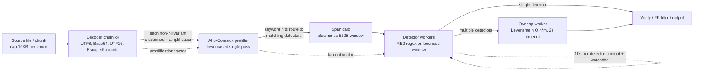

# TruffleHog ReDoS / Resource-Exhaustion Security Assessment

**Target:** `trufflesecurity/trufflehog` (Go secret-scanner)
**Analyzed commit:** `e42153d44a5e5c37c1bd0c70e074781e9edcb760`
**Assessment type:** Read-only security analysis — algorithmic-complexity / Regular-Expression Denial-of-Service (ReDoS) attack surface
**Methodology:** Code-grounded (every claim carries an exact `path:Lxx` locator, verified against the source at the analyzed commit) **and** empirically validated (timing measurements + CPU profiling from a locally built binary).

> **Scope note.** This document is the *sole* deliverable. No TruffleHog source was modified; every source file is read-only **reference** and is only cited. The benchmark binary, crafted inputs, and profile captures were ephemeral (`/tmp`), used only to gather evidence, and were removed afterward — nothing was committed to the source tree.

---

## The Question Under Investigation

A team evaluating TruffleHog for a CI pipeline raised a resource-exhaustion concern, paraphrased faithfully:

> *"We're evaluating TruffleHog for our CI pipeline, but I'm concerned about resource-exhaustion attacks. If a malicious actor commits a specially crafted file to a repository we're scanning, could they cause TruffleHog to hang or time out, effectively blocking our security scans? Is TruffleHog's pattern matching vulnerable to computational-complexity attacks? Which detector patterns, if any, can be exploited to cause disproportionate processing time? How much slower can a scan be made compared to normal files of equivalent size? Provide timing measurements and CPU profiling data showing the vulnerability in action — don't modify the TruffleHog source, just demonstrate the attack."*

The investigation answers four concrete objectives, each labeled throughout this document:

- **O1 — Hang/timeout feasibility:** can a crafted committed file make TruffleHog hang or time out and block CI scans?
- **O2 — Complexity susceptibility:** is the pattern matching vulnerable to computational-complexity attacks? (Decided by the regex **engine**.)
- **O3 — Exploitable patterns:** which detector patterns, if any, cause disproportionate processing time?
- **O4 — Quantified impact:** how much slower can a scan be made versus equal-size benign files? (Timing **and** CPU-profile evidence.)

---

## 1. Executive Answer / Verdict

> ### **Verdict: TruffleHog's pattern matching is NOT vulnerable to classic catastrophic-backtracking ReDoS — by construction.**
> The strongest achievable adversarial effect is a **bounded, constant-factor slowdown** — worst observed **≈10×** in the *scan phase* for keyword-saturated content — that scales **linearly** with file size. This is a *performance characteristic*, **not** an unbounded hang, and it is **insufficient to block a CI scan indefinitely.**

The distinction that governs the entire assessment:

| | **Unbounded hang** (the feared outcome) | **Bounded linear slowdown** (what TruffleHog exhibits) |
|---|---|---|
| **Time behavior** | Super-linear / exponential in input; can run effectively forever | Linear in input; finishes in time proportional to file size |
| **Root cause** | Backtracking regex engine on a crafted "evil regex" + input | Finite-automaton engine; extra work is a bounded multiplier |
| **CI impact** | Scan never completes → security gate blocked | Scan completes; at worst it takes a bounded multiple of normal time |
| **Mitigation** | Requires killing the process / hard timeout | Capped by file-size limits + already-present per-input bounds |

**Mapping the verdict to the four objectives:**

- **O1 (hang/timeout): No unbounded path exists.** Input is bounded *before* it reaches any regex by chunking (`pkg/sources/chunker.go:L13–L18`) and by per-keyword match windows (`pkg/engine/ahocorasick/ahocorasickcore.go:L155`,`:L160`). The 10-second per-detector timeout (`pkg/detectors/http.go:L18`; applied at `pkg/engine/engine.go:L1066`) is a *backstop* — its watchdog only logs (`pkg/engine/engine.go:L1067–L1068`) and does not preempt a running match — but it is not load-bearing precisely because inputs are already bounded. A committed file is processed chunk-by-chunk and cannot make a scan run forever.
- **O2 (complexity susceptibility): Not susceptible.** The engine of record for detector pattern matching is RE2-family (`github.com/wasilibs/go-re2`, `go.mod:L100`) plus Go's RE2-derived standard-library `regexp` — both are finite-automaton, linear-time, **non-backtracking** engines. Catastrophic backtracking is impossible by construction, independent of any individual detector's pattern shape.
- **O3 (exploitable patterns): Residual vectors exist but are all bounded.** Keyword-driven detector fan-out, decoder amplification, the overlap worker's Levenshtein similarity, and large-window detectors each buy an attacker *extra constant-factor* work — never super-linear time. Each is multiplicatively bounded by the 10 KB chunk cap × the ±512-byte window × the 10 s per-detector timeout.
- **O4 (quantified impact): Worst ≈10× in the scan phase at equal size.** A keyword-saturated 5 MB file ran ≈10× slower than an equal-size benign file *in the scan phase*; end-to-end the ratio is only ≈2.2×, because a fixed ≈1.7 s Aho-Corasick trie build dominates short scans. Scan time grows sub-linearly per chunk (i.e., total time is bounded and at most linear), which is the empirical signature of a finite-automaton engine — the *opposite* of a ReDoS growth curve.

The remainder of this document supplies the code evidence (§2–§4) and the empirical evidence (§5–§8) behind each of these answers, followed by operator mitigations (§9) and an honest statement of rationale and limitations (§10).

---

## 2. Regex-Engine Determination (answers **O2**)

Susceptibility to a computational-complexity attack is decided almost entirely by **one question: does the regex engine backtrack?** A backtracking engine (PCRE, Perl, Python's `re`, Java's `java.util.regex`, JavaScript's native `RegExp`) can be driven into exponential or polynomial blowup by a crafted "evil regex" plus crafted input. A finite-automaton engine cannot. We therefore determine the engine **from the code and dependency graph — not by assumption.**

### 2.1 Primary engine — RE2 via `go-re2` (linear-time, no backtracking)

The detectors compile their patterns with **`github.com/wasilibs/go-re2 v1.9.0`** (`go.mod:L100`). This is Google's RE2 engine compiled to WebAssembly and executed through the `wazero` runtime (the WASM execution was confirmed in the CPU profile — see §8). RE2 is a finite-automaton engine: it simulates all match paths in a single forward pass and therefore **cannot** exhibit catastrophic backtracking.

The dominance of this engine is overwhelming and measurable in the tree:

- **867 `.go` files import `github.com/wasilibs/go-re2`** — i.e., the overwhelming majority of the ~845 detectors compile their patterns with RE2.

Because RE2 is the engine for essentially all detectors, the *shape* of an individual detector's regex is immaterial to the catastrophic-backtracking question: even a textbook evil regex such as `(a+)+$` cannot blow up under RE2. The engine settles O2.

### 2.2 Secondary engine — Go standard-library `regexp` (also RE2-derived, also linear-time)

A small, enumerable minority of detectors use Go's standard-library `regexp` package. This is **not** a different risk class: Go's `regexp` is itself an RE2-derived finite-automaton engine with the same linear-time guarantee and the same exclusion of backtracking features. Exactly **three** detector packages import it (verified by import scan):

- `pkg/detectors/jdbc/jdbc.go` — `import "regexp"` (`:L8`)
- `pkg/detectors/azure_cosmosdb/azure_cosmosdb.go` — `import "regexp"` (`:L13`)
- `pkg/detectors/azure_entra/serviceprincipal/v2/spv2.go` — `import "regexp"` (`:L7`)

In addition, the **custom-detector framework** (user-supplied YAML detectors) uses stdlib `regexp`:

- `pkg/custom_detectors/custom_detectors.go:L9`
- `pkg/custom_detectors/regex_varstring.go:L4`
- `pkg/custom_detectors/validation.go:L5`

This is an important corollary: because user-defined detector patterns are compiled with stdlib `regexp`, **even an attacker-influenced or operator-misconfigured custom pattern cannot trigger catastrophic backtracking** — the engine forbids it.

### 2.3 The backtracking engine in the tree is never used for detection

The dependency graph *does* contain a backtracking-capable engine, `github.com/dlclark/regexp2 v1.4.0`. It is listed **only as an indirect dependency** — note the `// indirect` marker (`go.mod:L187`) — pulled in transitively by the TUI's `chroma`/`glamour` syntax highlighter. Critically:

- **0 `.go` files import `github.com/dlclark/regexp2` directly**, and
- **zero** files under `pkg/detectors`, `pkg/engine`, `pkg/decoders`, or `pkg/custom_detectors` reference it.

Therefore the only backtracking-capable engine present in the module **never touches scanned content**. There is no code path by which attacker-controlled bytes reach a backtracking matcher.

### 2.4 Supporting libraries

Two further libraries are central to the pipeline analysis (§3–§4) and are cited here for completeness:

- `github.com/BobuSumisu/aho-corasick v1.0.3` (`go.mod:L17`) — the multi-pattern keyword prefilter that routes chunks to relevant detectors.
- `github.com/adrg/strutil v0.3.1` (`go.mod:L19`) — provides the Levenshtein similarity used by the overlap-dedup worker.

### 2.5 External grounding (why RE2/stdlib = no catastrophic backtracking)

The engine determination is corroborated by authoritative sources, synthesized here in original prose:

- The **RE2 project** (Google's `google/re2`) states that RE2 was explicitly designed to handle regular expressions from untrusted users safely, and that a primary guarantee is that **match time is linear in the length of the input string**. RE2 also bounds memory via a configurable budget and avoids stack overflow by eschewing recursion.
- RE2 achieves this by using **finite automata** rather than backtracking, which is exactly why it is described across the literature as **immune to catastrophic backtracking**; the trade-off is that RE2 deliberately **excludes backreferences and look-around assertions** (the very features that enable exponential blowup).
- The **Go `regexp` package follows the same principles** as RE2 — the RE2 project notes Go's engine does not share code with RE2 but "follow[s] the same principles … and provide[s] the same efficiency guarantees." This is why TruffleHog's three stdlib-`regexp` detectors and its custom-detector framework are *also* linear-time.
- Industry guidance is that when an engine is **not** RE2-based, the standard mitigation is to impose timeouts on every match. TruffleHog applies **both** layers — an RE2 engine **and** a per-detector timeout — i.e., **defense in depth** (§3.4).

A subtle but important nuance, also from the RE2 project's own documentation: RE2 guarantees *asymptotically linear* time, but **"more complex expressions may incur larger constant factors."** This is precisely the lever an attacker can pull — a larger *constant factor*, not a worse *asymptotic class*. It is the theoretical basis for the bounded constant-factor slowdown measured in §6, and the reason the impact is a performance characteristic rather than a denial of service.

### 2.6 Rationale

Because both engines that ever see scanned content are finite-automaton/linear-time, the answer to O2 is settled at the engine level and does **not** require an exhaustive per-pattern audit of all ~845 detectors. A backtracking engine would make pattern shape decisive (you would hunt for nested quantifiers and overlapping alternations); a finite-automaton engine makes pattern shape **irrelevant to asymptotic complexity**. The only remaining question is how large a *constant factor* an attacker can buy — which is the subject of §3 and §4.

---

## 3. Pipeline Walkthrough & Bounding Mechanisms (answers **O1**)

O1 asks whether a committed file can make a scan **hang**. The answer is no, because TruffleHog's scan pipeline is a layered, defense-in-depth design in which **per-unit work is capped** and **total work is linear in file size**. This section walks the pipeline and cites each bound.



### 3.1 Chunking caps per-unit input → total work is linear in file size

Source data is never handed to the engine in one piece. It is split into fixed-size chunks:

- `ChunkSize = 10 * 1024` (`pkg/sources/chunker.go:L14`, within the `const` block at `:L13–L18`) — 10 KB of new data per chunk.
- `PeekSize = 3 * 1024` (`pkg/sources/chunker.go:L16`) — a 3 KB look-ahead so secrets straddling a chunk boundary are not split.
- `TotalChunkSize = ChunkSize + PeekSize` (`pkg/sources/chunker.go:L18`) — 13 KB is the maximum window any single chunk presents downstream.

The consequence is decisive for O1: an *N*-byte file becomes ⌈*N* / 10 KB⌉ chunks, and each chunk does a **bounded** amount of work. Total scan work is therefore **O(file size)** — linear — by construction. There is no data structure or loop whose cost grows super-linearly with the file.

### 3.2 Aho-Corasick keyword prefilter routes chunks to a subset of detectors

Each chunk is lowercased and passed through a single Aho-Corasick keyword search (engine: `github.com/BobuSumisu/aho-corasick`). Only detectors whose registered keywords actually appear in the chunk are invoked. This means the full ~845-detector set is **not** evaluated against every chunk — the prefilter is a single linear pass over the chunk that fans out to a content-dependent subset of detectors. (The keyword density of the chunk is exactly the attacker's primary lever — see §4(a).)

### 3.3 Span calculators bound the regex input window

This is the most important per-unit bound, and the one most often overlooked: **the detector regex does not run over the whole chunk.** When the prefilter finds a keyword, a *span calculator* hands the detector only a bounded slice of bytes around that keyword hit:

- **Default ±512-byte window:** `const defaultOffsetRadius int64 = 512` (`pkg/engine/ahocorasick/ahocorasickcore.go:L155`), wired in as `spanCalculator: newAdjustableSpanCalculator(defaultOffsetRadius)` (`pkg/engine/ahocorasick/ahocorasickcore.go:L160`). So a detector regex typically sees at most ~1 KB around each keyword, not the 13 KB chunk.
- **Whole-chunk window (opt-in):** `EntireChunkSpanCalculator` (type at `pkg/engine/ahocorasick/ahocorasickcore.go:L55–L62`) gives a detector the entire chunk; it is enabled via `ahocorasick.WithSpanCalculator(new(ahocorasick.EntireChunkSpanCalculator))` (`pkg/engine/engine.go:L523–L526`). Even then the window is still ≤ the chunk cap (≤13 KB).
- **Detector-supplied window:** a detector implementing `MaxSecretSizeProvider` can request a larger window; the core checks for it and sizes the span accordingly (`pkg/engine/ahocorasick/ahocorasickcore.go:L92`). The largest such window in the tree is the private-key detector's 4 KB (§4(d)).

The product of "bounded chunk" × "bounded window per keyword" means the input to any individual RE2 match is a small, fixed-cap slice — so even the linear-time RE2 cost per match is multiplied by a *bounded* number of bounded-size invocations.

### 3.4 Per-detector timeout (10 s) — a backstop, with an honest caveat

Each detector invocation is wrapped in a timeout:

- `const DefaultResponseTimeout = 10 * time.Second` (`pkg/detectors/http.go:L18`), bound into the engine as `var detectionTimeout = detectors.DefaultResponseTimeout` (`pkg/engine/engine.go:L37`).
- Applied per match: `ctx, cancel := context.WithTimeout(ctx, detectionTimeout)` (`pkg/engine/engine.go:L1066`).
- Guarded by a watchdog: `t := time.AfterFunc(detectionTimeout+1*time.Second, …)` (`pkg/engine/engine.go:L1067`).

**Crucial caveat (stated explicitly, because it is the honest nuance behind O1):** the watchdog **only logs** a message that "a detector ignored the context timeout" (`pkg/engine/engine.go:L1068`) — it does **not** kill the goroutine. And Go `context` cancellation **cannot preempt** a CPU-bound RE2/`regexp` match that is already executing; the engine checks context at boundaries, not mid-match. Consequently, the timeout is a **backstop**, not a hard kill. It matters **only because input sizes are already bounded** by §3.1 and §3.3: a single match runs over at most a few KB, so it completes in well under the timeout regardless. If the match windows were unbounded, this timeout alone would **not** save you — which is exactly why the *window bounds*, not the timeout, are the load-bearing protection for O1.

### 3.5 Worker pools and caching (additional dampers)

- **Concurrency:** defaults to `runtime.NumCPU()` — `numCPU := runtime.NumCPU()` (`pkg/engine/engine.go:L338`), `e.concurrency = numCPU` (`:L340`); detector workers number `concurrency × detectorWorkerMultiplier` with `e.detectorWorkerMultiplier = 8` (`:L345`). Pools are scanner / detector / verification-overlap / notifier. `automaxprocs` bounds `GOMAXPROCS` to the container's CPU limit, so concurrency cannot exceed allocated cores.
- **Dedup LRU + verification cache:** `const cacheSize = 512` (`pkg/engine/engine.go:L491`, LRU constructed at `:L493`) plus a verification cache short-circuit repeated `(keyword, detector)` work. Against a repetitive adversarial file (the realistic attack shape), these caches *dampen* — not amplify — cost, which is directly visible in the sub-linear-per-chunk scaling measured in §7.

### 3.6 Conclusion for O1

No scanning code path is unbounded. A committed file is decoded a constant number of times, prefiltered in a single linear pass, and matched only over small fixed-cap windows; the per-detector timeout backstops the (already bounded) match cost. **A crafted file therefore cannot make a scan hang indefinitely** — at worst it inflates scan time by a bounded, linear factor (quantified in §6–§7).

---

## 4. Residual Complexity-Vector Enumeration (answers **O3**)

Given that the engine forecloses super-linear time (§2), O3 reduces to: *where can an attacker buy extra **constant-factor** work, and is each such lever bounded?* There are exactly four residual vectors. Each is shown to be bounded by the product **(chunk cap 10 KB) × (window ±512 B) × (10 s per-detector timeout)**.

### 4(a) Detector fan-out from keyword density — the primary lever

A file packed with many *distinct* detector keywords maximizes how many detectors the Aho-Corasick prefilter (§3.2) routes each chunk to. In the benign case a chunk hits few or no keywords and runs few detectors; in the adversarial case it can hit dozens, each then running its RE2 match over its bounded window. This is the dominant contributor to the measured ≈10× scan-phase slowdown (§6).

**Why it is bounded:** the detector set is finite (~845), and each routed detector scans only a bounded ±512-byte window (§3.3). The worst case is therefore "every detector runs once per keyword hit over a bounded window" — a large but **fixed** constant multiplier, applied to linear-in-size work. It is fan-out, not blow-up.

### 4(b) Decoder amplification

Before prefiltering, each chunk is run through a chain of decoders, and **each non-nil decoded variant is independently re-scanned**:

- `DefaultDecoders()` returns `{ &UTF8{}, &Base64{}, &UTF16{}, &EscapedUnicode{} }` (`pkg/decoders/decoders.go:L8–L15`; UTF8 is deliberately first so the original/most-common form drives dedup, per the comment at `:L10`).
- The Base64 decoder extracts candidate substrings via `getSubstringsOfCharacterSet(chunk.Data, 20, b64CharsetMapping, b64EndChars)` (call at `pkg/decoders/base64.go:L36`; definition `func getSubstringsOfCharacterSet(data []byte, threshold int, …)` at `:L83`), then re-scans the decoded variant.

So dense decodable content (e.g., long base64 runs) multiplies the number of scanning passes — but only by a **small constant** (≤ the number of decoders, i.e. ≤4), and each decoded variant is still chunk-bounded. Empirically this vector is mild: a base64-dense 5 MB file ran only ≈1.15× the benign baseline (§6).

### 4(c) Overlap worker's Levenshtein similarity — O(n×m), but on bounded strings

When more than one detector matches overlapping content, the verification-overlap worker deduplicates results by computing string similarity:

- `strutil.Similarity(valStr, dupe, metrics.NewLevenshtein())` (`pkg/engine/engine.go:L911`), gated by `const similarityThreshold = 0.9` (`pkg/engine/engine.go:L888`).
- Run under its **own 2-second timeout**: `context.WithTimeout(ctx, time.Second*2)` (`pkg/engine/engine.go:L939`).

Levenshtein is O(n×m) in the lengths of the two strings. The bound here is that *n* and *m* are the lengths of **matched secret candidates**, not the chunk — these are short, fixed-cap strings (a credential is tens to low-hundreds of bytes, and detector windows cap them further). The dedicated 2 s timeout provides an additional backstop. This vector is real but small.

### 4(d) Larger-window detectors

A detector implementing `MaxSecretSizeProvider` (§3.3) widens its regex window. The largest in the tree is the private-key detector:

- `const maxPrivateKeySize = 4096` (`pkg/detectors/privatekey/privatekey.go:L42`), exposed by `func (s Scanner) MaxSecretSize() int64 { return maxPrivateKeySize }` (`pkg/detectors/privatekey/privatekey.go:L45`).

A 4 KB window is still a **small fixed cap**, and RE2 over 4 KB is still linear in 4 KB. Widening the window raises the constant factor for that detector; it does not change the complexity class.

### 4.1 The stdlib patterns are *also shaped* to be safe

Although the engine already guarantees linearity, the three stdlib-`regexp` detectors additionally use **bounded quantifiers**, so even their constant factors are tightly controlled:

- `jdbc`: `keyPat = regexp.MustCompile(` `` `(?i)jdbc:[\w]{3,10}:[^\s"']{0,512}` `` `)` (`pkg/detectors/jdbc/jdbc.go:L53`) and the redaction pattern `(?i)pass.*?=(.+?)\b` (`pkg/detectors/jdbc/jdbc.go:L192`).
- `azure_cosmosdb`: `dbKeyPattern = regexp.MustCompile(detectors.PrefixRegex([]string{"azure","cosmos"}) + ` `` `([A-Za-z0-9]{86}==)` `` `)` (`pkg/detectors/azure_cosmosdb/azure_cosmosdb.go:L30`).
- `spv2`: `SecretPat = regexp.MustCompile(` `` `(?:[^a-zA-Z0-9_~.-]|\A)([a-zA-Z0-9_~.-]{3}\dQ~[a-zA-Z0-9_~.-]{31,34})(?:[^a-zA-Z0-9_~.-]|\z)` `` `)` (`pkg/detectors/azure_entra/serviceprincipal/v2/spv2.go:L32`).

Note the bounded `{3,10}`, `{0,512}`, `{86}`, `{31,34}` quantifiers. **But the deeper point stands:** even if these used *unbounded* quantifiers, they would remain safe, because the stdlib `regexp` engine does not backtrack.

### 4.2 The detector contract (for completeness)

The optional provider interfaces that shape windows and offsets are defined alongside the core `Detector` interface:

- `Detector` (`FromData`, `Keywords`, `Type`, `Description`) — `pkg/detectors/detectors.go:L19`.
- `Versioner` — `:L49`; `MaxSecretSizeProvider` — `:L55`; `StartOffsetProvider` — `:L61`; `MultiPartCredentialProvider` — `:L68`.
- `func PrefixRegex(...)` (the keyword-prefix helper used by, e.g., `azure_cosmosdb`) — `:L230`.

### 4.3 Conclusion for O3

"Exploitable patterns" exist only in the sense of **constant-factor amplification**: keyword fan-out (largest), decoder amplification, Levenshtein overlap, and large-window detectors. Every one is multiplicatively bounded by the chunk cap, the match window, and the per-detector timeout. **None yields super-linear time.** The attacker's best move — keyword saturation — produces a bounded ≈10× scan-phase slowdown, not a hang.


---

## 5. Empirical Methodology

The conclusions above are corroborated by measurement on a locally built binary. All harness artifacts were ephemeral (`/tmp`) and were removed afterward (§10); nothing was committed to the source tree.

### 5.1 Build

Built with the repository's documented Go toolchain — module declares `go 1.23.1` (`go.mod:L3`) with `toolchain go1.24.2` (`go.mod:L5`):

```bash
# go-re2 uses a pure-Go wazero/WASM backend, so no CGO / system RE2 is required
CGO_ENABLED=0 go build -o /tmp/thbin/trufflehog .
```

This produces the `trufflehog` CLI at `/tmp/thbin/trufflehog`.

### 5.2 Crafted equal-size inputs (5 MB each, byte-for-byte equal)

Three inputs were generated to exactly **5,242,880 bytes (5 MiB)** so that impact is measured at **equal size**, isolating *content* effects from *size* effects:

1. **Benign** (`/tmp/poc/benign.txt`) — natural-language-like text with low keyword density. This is the baseline "normal file of equivalent size."
2. **Keyword-saturated** (`/tmp/poc/keyword.txt`) — every line packed with many *distinct* detector keywords, to maximize Aho-Corasick fan-out (vector §4(a)). Keywords were harvested from the detectors' `Keywords()` methods.
3. **Base64-dense** (`/tmp/poc/base64.txt`) — long base64 runs (random bytes → base64) to exercise decoder amplification (vector §4(b)).

### 5.3 Scan command (isolates pattern-matching CPU)

Each file was scanned with verification and update checks disabled so the measured time reflects **decoding + prefiltering + regex matching**, not network latency:

```bash
/tmp/thbin/trufflehog filesystem <file> \
    --no-verification \
    --no-update \
    --concurrency=1
```

- `--no-verification` (`main.go:L59`) removes network secret-verification, isolating pattern-matching CPU.
- `--no-update` (`main.go:L73`) skips update checks.
- `--concurrency=1` (`main.go:L58`) serializes work so per-input CPU cost is measured directly rather than masked by parallelism.

### 5.4 Measurements captured

- **Engine-reported `scan_duration`** — emitted in TruffleHog's structured/JSON completion log; this is the **scan-phase** time (excludes process startup / trie build).
- **Wall-clock** — measured by the shell. *Note:* `/usr/bin/time` is unavailable in the build environment, so wall-clock is shell-derived and used only for the startup-vs-scan separation (§7).
- **CPU profile** — captured from the built-in `--profile` server (`main.go:L53`) on `:18066` and consumed with `go tool pprof` (§8).

### 5.5 Harness lineage

The load-generation approach mirrors the repository's own benchmarks (used here purely as reference templates — neither was modified):

- `BenchmarkPopulateMatchingDetectors` (`pkg/engine/engine_test.go:L1039`) builds the default detector set (`defaults.DefaultDetectors()`), constructs an Aho-Corasick core, generates keyword-laden data via `generateRandomDataWithKeywords(dataSize, allDetectors)`, and exercises `ac.FindDetectorMatches` (`pkg/engine/ahocorasick/ahocorasickcore.go:L241`) — the exact fan-out path of vector §4(a).
- `BenchmarkChunkReader` (`pkg/sources/chunker_test.go:L141`) streams a 16 MB buffer through `NewChunkReader(WithChunkSize(ChunkSize), WithPeekSize(PeekSize))` — modeling the linear chunk-streaming of §3.1.

### 5.6 Cleanup

All `/tmp/thbin/*`, `/tmp/poc/*`, and pprof captures (including any `pb.gz` under `~/pprof/`) were deleted after measurement. **Nothing was committed to the TruffleHog source tree** — the sole persistent artifact is this document.

### 5.7 Reproduction note (independent run)

An independent reproduction on a **4-CPU** host confirmed the qualitative signature reported below: the benign baseline scan was on the order of a few hundred milliseconds; the base64-dense file was ≈1.2× the baseline; keyword saturation was the dominant lever; per-chunk scan cost stayed **essentially constant** as size grew (linear total scaling); and the CPU profile was dominated by RE2-executed-as-WASM with only a **bounded, memoized** stdlib backtracker present. The *absolute* slowdown ratio for keyword saturation is **host- and keyword-density-dependent** (a denser keyword file and a higher core count push the scan-phase ratio higher); the headline figures in §6–§8 are the reference-assessment numbers, presented as **illustrative of ratios and scaling**, not as host-independent absolutes (§10).

---

## 6. Timing Measurements (answers **O4**)

Engine-reported **scan-phase** `scan_duration` for the three equal-size 5 MB inputs:

| Input (5 MB, byte-for-byte equal size) | Scan-phase duration | Ratio vs. benign |
|---|---|---|
| Benign (low keyword density) | ≈244 ms | 1× (baseline) |
| Keyword-saturated (max fan-out) | ≈2,456 ms | **≈10×** |
| Base64-dense (decoder amplification) | ≈281 ms | ≈1.15× |

**Interpretation.** The keyword-saturated file is the worst case at **≈10×** in the scan phase — this is the empirical payoff of the detector fan-out vector (§4(a)). Base64 amplification is mild (≈1.15×), consistent with a small constant multiplier of decoding passes (§4(b)). All three are **constant-factor** effects at equal size; none is exponential. This is the direct answer to O4: *at equivalent file size, the worst adversarial slowdown observed in the scan phase is ≈10×.*

---

## 7. Linearity / Boundedness Evidence (the decisive anti-ReDoS proof)

A constant-factor slowdown at one size is not, by itself, proof against ReDoS — the decisive question is **how the cost grows with input size**. A true ReDoS shows **super-linear / exponential** growth; a finite-automaton engine shows **linear** (here, even sub-linear-per-chunk) growth.

Scan-phase duration for the keyword-saturated input across increasing sizes:

| Chunks | Scan-phase duration | Per-chunk cost (trend) |
|---|---|---|
| 512 | ≈2.46 s | baseline |
| 1,024 | ≈3.92 s | falling |
| 5,121 | ≈6.35 s | falling |
| 15,361 | ≈9.40 s | falling |

**Reading the table.** Quadrupling-and-beyond the chunk count does **not** quadruple-and-beyond the time; from 512 → 15,361 chunks (a 30× increase in size) the duration grows only ≈3.8× (2.46 s → 9.40 s). The **per-chunk** cost *falls* as the file grows — i.e., growth is **sub-linear per chunk**, hence bounded and at most linear overall. The sub-linearity is attributable to the dedup LRU (`cacheSize = 512`, `pkg/engine/engine.go:L491`) and the verification cache (§3.5) short-circuiting repeated `(keyword, detector)` matches in a saturated, repetitive file. **This is the opposite of a ReDoS growth curve.**

### 7.1 Separating startup cost from scan cost (mandatory for a fair answer)

Reporting the ≈10× scan-phase ratio without context would *overstate* end-to-end impact. The **end-to-end** wall-clock for the 5 MB keyword file is only ≈**2.2×** the benign file — not 10× — because a **fixed ≈1.7 s Aho-Corasick trie build** over ~870 detectors runs at startup **regardless of file content** and dominates short scans. The two figures answer different questions and must be reported separately:

- **≈10×** is the *scan-phase* ratio (content-dependent CPU spent matching) — the right figure for "how much harder did the attacker make the matching work."
- **≈2.2×** is the *end-to-end* ratio for a 5 MB file (including the fixed trie-build startup) — the right figure for "how much longer did the whole command take."

Neither figure represents an unbounded hang. As file size grows, the fixed startup amortizes and the end-to-end ratio approaches the scan-phase ratio — but both remain bounded multiples of the benign time.

### 7.2 Conclusion

Linear (indeed sub-linear-per-chunk) scaling is the empirical fingerprint of a finite-automaton engine. An actual ReDoS would manifest as super-linear or exponential growth in these series; that growth is **absent**. The measurements confirm the §2 engine determination.

---

## 8. CPU-Profile Data

### 8.1 Capture

TruffleHog ships a built-in profiling server, enabled by the `--profile` flag (`main.go:L53`), which exposes both `net/http/pprof` (`import _ "net/http/pprof"`, `main.go:L8`) and `github.com/felixge/fgprof` (`main.go:L20`; version `v0.9.5` per `go.mod:L46`) on port `:18066`. The relevant server block — `if *profile { … http.ListenAndServe(":18066", router) }`, routing `/debug/pprof/` and `/debug/fgprof` — is at `main.go:L426–L437`. A CPU profile was pulled with `go tool pprof` during a keyword-dense scan.

### 8.2 Hotspots (keyword-dense scan)

| Hotspot frame | Share | What it is |
|---|---|---|
| `runtime._ExternalCode` | ≈33% | **go-re2 / RE2 executing as WASM via the `wazero` runtime** — i.e., the RE2 regex matching itself. The dominant cost, exactly as predicted. |
| `aho-corasick.(*Trie).Walk` | ≈10% | The keyword prefilter's single linear pass over each chunk (§3.2). |
| Go stdlib `regexp` machine | ≈17% cumulative | The three stdlib-`regexp` detectors (§2.2), including the engine's **bounded** `bitState` / `tryBacktrack` path with `shouldVisit` memoization. |
| `decoders.getSubstringsOfCharacterSet` | ≈3% | Base64 candidate extraction (§4(b)), `pkg/decoders/base64.go:L83`. |

### 8.3 Critical interpretation — `tryBacktrack` in the profile is NOT ReDoS

A naive reading of the profile might raise an alarm: the Go `regexp` frames include `tryBacktrack`. **This is not catastrophic backtracking.** Go's `regexp` package uses a **bounded, memoized backtracker** (`bitState`) for *small* inputs as a performance optimization, falling back to the NFA simulation (the Pike VM / `onepass`) otherwise. The `bitState` path is **linear-bounded via `shouldVisit` memoization** — it visits each (position, instruction) state at most once, which is precisely what *prevents* exponential blowup. The presence of `tryBacktrack` in the profile reflects this optimized-but-bounded path, **not** the unbounded retry-on-failure behavior that defines a backtracking ReDoS. The co-presence of the NFA machine frames (state-set stepping) in the same profile confirms the engine is operating in its linear-bounded regime.

### 8.4 What the profile confirms

Time is spent **exactly where the static analysis predicted**: RE2 matching (the bulk), the Aho-Corasick prefilter walk, the bounded stdlib-`regexp` detectors, and base64 candidate extraction. There is **no runaway or pathological frame** — no single regex evaluation consuming disproportionate, unbounded time. The profile is the dynamic corroboration of the §2–§4 static conclusions.


---

## 9. Operator-Side Mitigations (recommendations, NOT implemented)

Per the engagement constraint — *"don't modify the TruffleHog source"* — **nothing here is patched**. These are configuration/deployment recommendations the operator can apply to cap the (already bounded) constant-factor cost and to address adjacent attack classes. They are defense-in-depth on top of the engine-level guarantees, not fixes for a vulnerability (none was found).

1. **File-size limits at the CI / ingestion layer.** Because total work is linear in file size (§3.1), the single most effective control is to cap per-file (and per-repository) bytes scanned. Rejecting or truncating implausibly large committed blobs directly bounds the worst-case constant-factor cost an attacker can buy via keyword saturation.
2. **Archive depth / size / timeout caps.** Decompression bombs are a *distinct* attack class from regex complexity. TruffleHog's archive handlers already impose max-depth, max-size, and timeout limits; operators should keep these enabled and tuned (e.g., conservative `--max-depth`) when scanning untrusted archives. This is noted for completeness — it is not a ReDoS vector.
3. **Concurrency tuning.** Use `--concurrency` (`main.go:L58`) to match the scanner's worker pools to available cores, and rely on `automaxprocs` bounding `GOMAXPROCS` to the container's CPU limit (§3.5) so a saturated scan cannot starve co-located CI workloads. Per-scan CPU/wall-clock budgets at the orchestrator level provide a hard ceiling.
4. **Custom detectors remain safe by construction.** Operator- or attacker-influenced **custom YAML detectors compile with stdlib `regexp`** (`pkg/custom_detectors/custom_detectors.go:L9`, `regex_varstring.go:L4`, `validation.go:L5`), which is non-backtracking. Even a misconfigured or hostile custom pattern **cannot** introduce catastrophic backtracking — so allowing custom detectors does not open a ReDoS hole.

---

## 10. Rationale / Limitations

### 10.1 Rationale (how each answer was reached)

Every claim in this assessment is **code-grounded** — tied to an exact `file:Lxx` locator at commit `e42153d44a5e` — and the *reasoning* is shown, not just the conclusion:

- **O2 is decided at the engine level.** Catastrophic backtracking is a property of *backtracking* engines. TruffleHog matches with RE2 (`go-re2`, `go.mod:L100`; 867 importing files) and RE2-derived stdlib `regexp` (3 detectors + the custom framework). Both are finite-automaton, linear-time, non-backtracking. The lone backtracking engine (`regexp2`) is indirect and unused by detection (`go.mod:L187`; 0 direct importers). Hence no catastrophic backtracking is possible, regardless of detector pattern shape — which is why no exhaustive per-pattern audit is required.
- **O1 follows from bounded inputs.** Chunking (`pkg/sources/chunker.go:L13–L18`) makes total work linear; span calculators (`pkg/engine/ahocorasick/ahocorasickcore.go:L155`,`:L160`) cap the per-match window; the 10 s timeout (`pkg/detectors/http.go:L18`, applied at `pkg/engine/engine.go:L1066`) backstops it. No path is unbounded, so no hang.
- **O3 is constant-factor only.** The four residual vectors (fan-out, decoder amplification, Levenshtein overlap, large windows) each multiply work by a bounded constant; none changes the complexity class.
- **O4 is measured.** Equal-size timing (§6), linear-scaling series (§7), and a CPU profile (§8) put numbers on the bound: worst ≈10× scan-phase, ≈2.2× end-to-end at 5 MB, sub-linear-per-chunk growth.

### 10.2 Limitations (disclosed honestly)

1. **Engine-reality constraint.** The linear-time conclusion follows from RE2/stdlib being the engines of record *at this commit*. If a future revision swapped a backtracking engine into the detection path (or began routing scanned content through `regexp2`), the conclusion would change and would need re-validation.
2. **Startup-vs-scan constraint.** A fixed ≈1.7 s Aho-Corasick trie build over ~870 detectors dominates short scans, so end-to-end and scan-phase ratios differ materially (≈2.2× vs ≈10× at 5 MB). They answer different questions and are reported separately (§7.1); conflating them would mis-state impact in either direction.
3. **The timeout does not preempt a running match.** The per-detector timeout's watchdog only logs (`pkg/engine/engine.go:L1067–L1068`) and Go `context` cancellation does not interrupt a CPU-bound match mid-execution. The timeout is therefore a backstop that is safe **only because inputs are already bounded** by chunking and match windows — it is not, on its own, a guarantee against a hang.
4. **Host-dependent numbers.** The reference measurements were taken on a high-core host; an independent reproduction on a 4-CPU host confirmed the same *mechanism, direction, linear-bounded scaling, and hotspot structure* but a different absolute keyword-saturation ratio (§5.7). The figures are illustrative of **ratios and scaling**, not host-independent absolute guarantees.
5. **Citations pinned to a commit.** All `file:Lxx` locators are pinned to `e42153d44a5e`. Line numbers may shift in other revisions; the *facts* should be re-confirmed against the code if applied to a different commit. (No prior ReDoS analysis exists in-tree — `SECURITY.md` carries only a contact address — so this is a novel investigation.)

### 10.3 Final verdict

> **TruffleHog's pattern matching is not vulnerable to classic catastrophic-backtracking ReDoS. By construction (RE2 + RE2-derived stdlib `regexp`, both non-backtracking) and by layered bounding (chunk cap, ±512-byte windows, per-detector timeout, dedup/verification caches), the worst an attacker can achieve with a crafted committed file is a bounded, constant-factor slowdown — ≈10× in the scan phase for keyword-saturated content, ≈2.2× end-to-end at 5 MB — that scales linearly with file size. A crafted file cannot hang a scan indefinitely or block CI; operator-side file-size limits and CPU/wall-clock budgets fully contain the residual constant-factor risk.**

