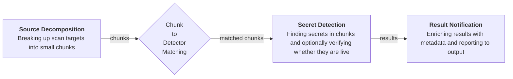
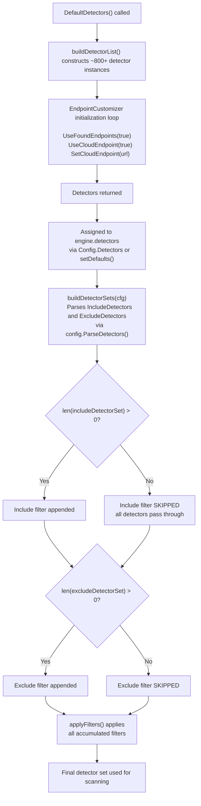

# TruffleHog CLI vs API Finding-Count Discrepancy: Root-Cause Analysis

When scanning the same directory, `trufflehog filesystem <dir>` (the CLI) consistently reports more secret findings than a minimal Go program that constructs an `engine.Config`, calls `engine.NewEngine()`, and invokes `eng.ScanFileSystem()` against the identical path. This document traces both execution paths through the TruffleHog v3 codebase, identifies every divergence point, and explains exactly why the finding counts differ. Every claim is grounded in specific source files, functions, and line numbers — no assumptions are made.

---

## 1. Background and Problem Statement

A user observes the following symptom: running the CLI command `trufflehog filesystem <dir>` yields a higher number of secret findings than an equivalent Go program that directly uses the TruffleHog engine API to scan the same directory. The Go program typically follows this pattern:

```go
eng, err := engine.NewEngine(ctx, &engine.Config{ /* minimal config */ })
// ...
eng.ScanFileSystem(ctx, sources.FilesystemConfig{Paths: []string{dir}})
```

Despite targeting the same files, the CLI reports additional findings that the API-based program does not. This analysis investigates the root cause.

**Codebase reference:**

- Module path: `github.com/trufflesecurity/trufflehog/v3` — Source: `go.mod:1`
- Go version: `1.23.1`, toolchain: `go1.24.2` — Source: `go.mod:3-5`
- Analysis grounded in commit `e42153d4` of the TruffleHog v3 repository.
- The README explicitly warns that there are "no guarantees on the stability of the public APIs" — Source: `README.md:676-679`

This API instability caveat is relevant: the engine's internal configuration defaults and feature-flag initialization are tightly coupled to the CLI's `main.go`, and library consumers must replicate that setup manually.

---

## 2. Architecture of the Scan Pipeline

TruffleHog's scanning pipeline consists of four stages, each serviced by dedicated worker goroutines. Understanding this architecture is essential for identifying where CLI and API paths diverge.



Source: `docs/process_flow.md`

**Worker types** (from the concurrency model):

| Worker Type | Responsibility |
|-------------|---------------|
| **ScannerWorkers** | Enumerate and chunk a source; decode chunks and find matching detectors |
| **DetectorWorkers** | Run detection (regex matching + optional verification) on chunks |
| **VerificationOverlapWorkers** | Handle chunks matched to multiple detectors; decide which detector verifies |
| **NotifierWorkers** | Write results to output (typically the command line) |

Source: `docs/concurrency.md`

Each worker type is spawned by `e.startWorkers()` during `engine.Start()`. The number of workers is derived from `concurrency` and per-type multipliers set in `setDefaults()`.

---

## 3. CLI Code Path Analysis

The CLI entry point (`main.go`) performs extensive configuration before creating the engine. This section traces that configuration step by step.

### 3.1 Flag Defaults

The CLI defines its flags using the `kingpin` library. Two flags are critical to detector selection:

- `--include-detectors` defaults to `"all"` — Source: `main.go:81`
- `--exclude-detectors` has **no default** (empty string) — Source: `main.go:82`

Feature-flag CLI flags are also defined:

- `--force-skip-binaries` — Source: `main.go:88`
- `--force-skip-archives` — Source: `main.go:89`
- `--skip-additional-refs` — Source: `main.go:90`

Other relevant defaults:

- `--concurrency` defaults to `runtime.NumCPU()` — Source: `main.go:58`
- `--no-verification` defaults to `false`, meaning verification is **enabled** by default — Source: `main.go:59`

### 3.2 Feature Flag Initialization

The `run()` function in `main.go` initializes global feature flags before constructing the engine config. These are `sync/atomic.Bool` variables defined in `pkg/feature/feature.go:5-9`:

```go
var (
    ForceSkipBinaries  atomic.Bool
    ForceSkipArchives  atomic.Bool
    SkipAdditionalRefs atomic.Bool
    EnableAPKHandler   atomic.Bool
)
```

Source: `pkg/feature/feature.go:5-9`

The CLI sets them conditionally — **except for one**:

| Feature Flag | CLI Behavior | Source |
|-------------|-------------|--------|
| `ForceSkipBinaries` | Set to `true` **only if** `--force-skip-binaries` flag is passed | `main.go:441-443` |
| `ForceSkipArchives` | Set to `true` **only if** `--force-skip-archives` flag is passed | `main.go:445-447` |
| `SkipAdditionalRefs` | Set to `true` **only if** `--skip-additional-refs` flag is passed | `main.go:449-451` |
| **`EnableAPKHandler`** | **Set to `true` UNCONDITIONALLY** (comment: "OSS Default APK handling on") | `main.go:457-458` |

The unconditional `feature.EnableAPKHandler.Store(true)` at line 458 is the single most impactful divergence. This flag gates whether APK files are processed during scanning — see Section 5, Divergence Point 1.

### 3.3 Config Assembly

The CLI constructs `engine.Config` at lines 513–533 of `main.go`:

```go
engConf := engine.Config{
    Concurrency:              *concurrency,
    Detectors:                append(defaults.DefaultDetectors(), conf.Detectors...),
    Verify:                   !*noVerification,
    IncludeDetectors:         *includeDetectors,
    ExcludeDetectors:         *excludeDetectors,
    CustomVerifiersOnly:      *customVerifiersOnly,
    VerifierEndpoints:        *verifiers,
    Dispatcher:               engine.NewPrinterDispatcher(printer),
    FilterUnverified:         *filterUnverified,
    FilterEntropy:            *filterEntropy,
    VerificationOverlap:      *allowVerificationOverlap,
    Results:                  parsedResults,
    PrintAvgDetectorTime:     *printAvgDetectorTime,
    ShouldScanEntireChunk:    *scanEntireChunk,
    VerificationCacheMetrics: &verificationCacheMetrics,
}
```

Source: `main.go:513-533`

Key observations:

- **`Detectors`** is explicitly populated with `defaults.DefaultDetectors()` plus any custom detectors from the config file — Source: `main.go:519`
- **`Verify`** defaults to `true` (since `noVerification` defaults to `false`) — Source: `main.go:520`
- **`IncludeDetectors`** receives `"all"` from the flag default — Source: `main.go:521`
- **`ExcludeDetectors`** receives `""` (empty) from the flag default — Source: `main.go:522`
- **`Dispatcher`** is set to a `PrinterDispatcher` wrapping the selected output printer — Source: `main.go:525`

### 3.4 SourceManager Configuration

Before calling `engine.NewEngine()`, the CLI creates a `SourceManager` with specific options:

```go
const defaultOutputBufferSize = 64
opts := []func(*sources.SourceManager){
    sources.WithConcurrentSources(cfg.Concurrency),
    sources.WithConcurrentUnits(cfg.Concurrency),
    sources.WithSourceUnits(),
    sources.WithBufferedOutput(defaultOutputBufferSize),
}
cfg.SourceManager = sources.NewManager(opts...)
```

Source: `main.go:672-686`

The `WithSourceUnits()` option enables source-unit decomposition, which affects how filesystem sources are broken down into scannable units. The `WithBufferedOutput(64)` option configures buffered chunk output.

---

## 4. API Code Path Analysis

When a minimal Go program calls `engine.NewEngine()` directly, it bypasses the CLI's flag parsing, feature-flag initialization, and much of the configuration assembly. This section traces what actually happens.

### 4.1 NewEngine Initialization

`NewEngine()` at `pkg/engine/engine.go:226` copies `Config` fields directly to the `Engine` struct (lines 229–247):

```go
engine := &Engine{
    concurrency:    cfg.Concurrency,
    decoders:       cfg.Decoders,
    detectors:      cfg.Detectors,
    // ... other fields ...
    sourceManager:  cfg.SourceManager,
}
```

Source: `pkg/engine/engine.go:229-247`

**Critical requirement:** If `engine.sourceManager` is `nil`, `NewEngine` returns an error immediately:

```go
if engine.sourceManager == nil {
    return nil, fmt.Errorf("source manager is required")
}
```

Source: `pkg/engine/engine.go:248-249`

After this check, `engine.setDefaults(ctx)` is called — Source: `pkg/engine/engine.go:252`

### 4.2 setDefaults() Behavior

`setDefaults()` at `pkg/engine/engine.go:336-374` populates zero-valued fields with sensible defaults:

| Field | Condition | Default Value | Source |
|-------|-----------|---------------|--------|
| `concurrency` | `== 0` | `runtime.NumCPU()` | `engine.go:337-341` |
| `detectorWorkerMultiplier` | `< 1` | `8` | `engine.go:343-346` |
| `notificationWorkerMultiplier` | `< 1` | `1` | `engine.go:348-350` |
| `verificationOverlapWorkerMultiplier` | `< 1` | `1` | `engine.go:352-354` |
| `decoders` | `len == 0` | `decoders.DefaultDecoders()` | `engine.go:357-359` |
| `detectors` | `len == 0` | `defaults.DefaultDetectors()` | `engine.go:362-364` |
| `dispatcher` | `== nil` | `NewPrinterDispatcher(new(output.PlainPrinter))` | `engine.go:366-368` |
| `notifyVerifiedResults` | always | `true` | `engine.go:369` |
| `notifyUnverifiedResults` | always | `true` | `engine.go:370` |
| `notifyUnknownResults` | always | `true` | `engine.go:371` |

The most important behavior: **`detectors` is populated with `defaults.DefaultDetectors()` ONLY if the caller provides zero detectors** (line 362 checks `len(e.detectors) == 0`). If the caller provides a partial list, `setDefaults()` does NOT override it.

Source: `pkg/engine/engine.go:336-374`

### 4.3 Include/Exclude Filter Processing

After `setDefaults()`, `NewEngine` calls `buildDetectorSets(cfg)` at line 255:

```go
includeDetectorSet, excludeDetectorSet, err := buildDetectorSets(cfg)
```

Source: `pkg/engine/engine.go:255`

Inside `buildDetectorSets()` (line 376–400), the include and exclude strings are parsed:

```go
includeList, err := config.ParseDetectors(cfg.IncludeDetectors)
excludeList, err := config.ParseDetectors(cfg.ExcludeDetectors)
```

Source: `pkg/engine/engine.go:377-384`

**`ParseDetectors()` behavior** (Source: `pkg/config/detectors.go:61-86`):

- Input `"all"` → matches `specialGroups["all"]` → calls `allDetectors()` → returns full protobuf enum set — Source: `pkg/config/detectors.go:15-17, 69, 131-138`
- Input `""` (empty) → `strings.Split("", ",")` produces one empty item → skipped at line 66-68 → returns **empty slice**

**Filter application** (Source: `pkg/engine/engine.go:261-275`):

```go
if len(includeDetectorSet) > 0 {
    filters = append(filters, func(d detectors.Detector) bool {
        _, ok := getWithDetectorID(d, includeDetectorSet)
        return ok
    })
}
```

Source: `pkg/engine/engine.go:263-268`

If `includeDetectorSet` has length 0 (as when `IncludeDetectors` is `""`), the include filter is **NOT appended** — meaning all detectors pass through unfiltered.

**Net effect:** Both `"all"` and `""` result in all detectors passing through, but via different mechanisms:

- `"all"` → include filter is populated with every detector type → all detectors match → all pass through
- `""` → include filter is empty → filter is skipped entirely → all detectors pass through

### 4.4 Missing Feature Flag Initialization

A minimal API caller does **not** invoke `main.go`'s `run()` function, so the feature flags remain at their zero-values:

| Feature Flag | CLI Value | API Default | Consequence |
|-------------|-----------|-------------|-------------|
| `EnableAPKHandler` | `true` | `false` (zero-value of `atomic.Bool`) | APK files are skipped by the API caller |
| `ForceSkipBinaries` | `false` (unless flag set) | `false` | Same behavior |
| `ForceSkipArchives` | `false` (unless flag set) | `false` | Same behavior |
| `SkipAdditionalRefs` | `false` (unless flag set) | `false` | Same behavior |

The critical gap is `EnableAPKHandler`. When it is `false`, `shouldHandleAsAPK()` in `pkg/handlers/handlers.go:536-539` always returns `false`:

```go
func shouldHandleAsAPK(cfg readerConfig, fReader fileReader) bool {
    return feature.EnableAPKHandler.Load() &&
        cfg.fileExtension == apkExt &&
        (fReader.mime.String() == string(zipMime) || fReader.mime.String() == string(jarMime))
}
```

Source: `pkg/handlers/handlers.go:536-539`

With `EnableAPKHandler` as `false`, the entire expression short-circuits to `false`. APK files are never processed, reducing the number of chunks scanned and therefore the number of findings reported.

---

## 5. Root Cause — Divergence Points

Five divergence points between the CLI and API code paths collectively explain the finding-count discrepancy.

### Divergence Point 1: `feature.EnableAPKHandler` (Highest Impact)

**Description:** The CLI unconditionally enables APK file processing; a minimal API caller does not.

- **CLI behavior:** `feature.EnableAPKHandler.Store(true)` is called unconditionally, with the comment "OSS Default APK handling on" — Source: `main.go:457-458`
- **API default:** `EnableAPKHandler` remains `false` (zero-value of `sync/atomic.Bool`) — Source: `pkg/feature/feature.go:9`
- **Impact:** The CLI processes APK files by extracting their contents and scanning internal files for secrets. `shouldHandleAsAPK()` (Source: `pkg/handlers/handlers.go:536-539`) gates this processing. When `EnableAPKHandler` is `false`, APK files are skipped entirely, eliminating all findings that would have been discovered within APK contents.
- **This is the MOST LIKELY cause** of finding-count differences if the scanned directory contains APK files.

### Divergence Point 2: `Config.Detectors` Population

**Description:** The detector list may differ depending on how the API caller configures `Config.Detectors`.

- **CLI behavior:** Explicitly sets `Detectors: append(defaults.DefaultDetectors(), conf.Detectors...)`, which combines the full ~800+ built-in detector list with any custom detectors from a config file — Source: `main.go:519`
- **API default (omitted):** If the caller leaves `Config.Detectors` as `nil`, `setDefaults()` calls `defaults.DefaultDetectors()` and assigns the same list — Source: `pkg/engine/engine.go:362-364`
- **API default (partial):** If the caller provides a **partial** detector list (e.g., `Config.Detectors = []detectors.Detector{&aws.Scanner{}}`) then `len(e.detectors)` is non-zero, and `setDefaults()` does NOT override it — Source: `pkg/engine/engine.go:362`
- **Impact:** Identical if the API caller omits `Config.Detectors` entirely. **Divergent** if the API caller provides a partial list — fewer detectors run, fewer findings produced.

### Divergence Point 3: `IncludeDetectors` Flag

**Description:** The CLI defaults `IncludeDetectors` to `"all"`, while an API caller defaults to `""`.

- **CLI behavior:** `IncludeDetectors` is `"all"` (from `--include-detectors` default) — Source: `main.go:81, 521`
- **API default:** `IncludeDetectors` is `""` (zero-value of `string`) if not set by the caller.
- **Impact:** Both values result in all detectors passing through the include filter, but via different mechanisms:
  - `"all"` → `ParseDetectors("all")` → full include set via `allDetectors()` → all detectors match — Source: `pkg/config/detectors.go:15-17, 69, 131-138`
  - `""` → `ParseDetectors("")` → empty include set → include filter skipped entirely — Source: `pkg/engine/engine.go:263`
- **Net effect is functionally identical** unless combined with other differences. This divergence point alone does not cause a finding-count difference.

### Divergence Point 4: `EndpointCustomizer` Initialization

**Description:** `DefaultDetectors()` enables cloud and found endpoint verification for all supporting detectors. Manual detector construction does not.

- **CLI behavior:** Uses `defaults.DefaultDetectors()` which iterates all detectors and for those implementing `EndpointCustomizer`:
  - Calls `customizer.UseFoundEndpoints(true)` — Source: `pkg/engine/defaults/defaults.go:1715`
  - Calls `customizer.UseCloudEndpoint(true)` — Source: `defaults.go:1716`
  - For `CloudProvider` detectors, calls `customizer.SetCloudEndpoint(cloudProvider.CloudEndpoint())` — Source: `defaults.go:1717-1719`
- **API default:** Same if `DefaultDetectors()` is called (either explicitly or via `setDefaults()` fallback). **Different** if the caller manually constructs detector instances without calling `DefaultDetectors()`.
- **Impact:** Without `UseFoundEndpoints(true)` and `UseCloudEndpoint(true)`, the `Endpoints()` method on `EndpointSetter` (Source: `pkg/detectors/endpoint_customizer.go:43-52`) will not include cloud or found endpoints in the verification URL list. This may alter verification reach, potentially causing some detectors to miss verified findings or produce different verification statuses.

### Divergence Point 5: `SourceManager` Configuration

**Description:** The CLI configures `SourceManager` with specific options that affect source decomposition and output buffering.

- **CLI behavior:** Creates `SourceManager` with:
  - `sources.WithConcurrentSources(cfg.Concurrency)` — Source: `main.go:674`
  - `sources.WithConcurrentUnits(cfg.Concurrency)` — Source: `main.go:675`
  - `sources.WithSourceUnits()` — Source: `main.go:676`
  - `sources.WithBufferedOutput(64)` — Source: `main.go:677`
  - Result assigned to `cfg.SourceManager` — Source: `main.go:686`
- **API default:** The caller **must** provide a `SourceManager` or `NewEngine` returns an error — Source: `pkg/engine/engine.go:248-249`. The options used are entirely caller-dependent.
- **Impact:** Missing `WithSourceUnits()` could affect how filesystem sources are decomposed into scannable units. Missing `WithBufferedOutput()` could affect chunk delivery timing and ordering. These differences are unlikely to change the *set* of findings but may affect behavior under edge conditions.

---

## 6. The Detector Selection Component

This section provides a deep dive into the component responsible for deciding which detectors participate in a scan.

### 6.1 `buildDetectorList()`

Source: `pkg/engine/defaults/defaults.go:839-1701`

This function assembles a manually-ordered slice of approximately 800+ detector instances. Each entry is a pointer to a scanner struct that implements the `Detector` interface (Source: `pkg/detectors/detectors.go:19-29`):

```go
type Detector interface {
    FromData(ctx context.Context, verify bool, data []byte) ([]Result, error)
    Keywords() []string
    Type() detectorspb.DetectorType
    Description() string
}
```

The list begins at line 839 and ends at line 1701. Some detectors are commented out (e.g., `// &abstract.Scanner{}` at line 842), indicating they are disabled in the default configuration.

### 6.2 `DefaultDetectors()`

Source: `pkg/engine/defaults/defaults.go:1704-1723`

`DefaultDetectors()` wraps `buildDetectorList()` and performs additional initialization:

```go
func DefaultDetectors() []detectors.Detector {
    detectorList := buildDetectorList()
    for _, d := range detectorList {
        customizer, ok := d.(detectors.EndpointCustomizer)
        if !ok {
            continue
        }
        customizer.UseFoundEndpoints(true)
        customizer.UseCloudEndpoint(true)
        if cloudProvider, ok := d.(detectors.CloudProvider); ok {
            customizer.SetCloudEndpoint(cloudProvider.CloudEndpoint())
        }
    }
    return detectorList
}
```

This function is the canonical way to obtain the full detector list with proper endpoint configuration. Detectors implementing the `EndpointCustomizer` interface (Source: `pkg/detectors/detectors.go:76-81`) receive:

1. `UseFoundEndpoints(true)` — enables appending dynamically-found endpoints during scanning
2. `UseCloudEndpoint(true)` — enables using cloud-specific endpoint URLs
3. `SetCloudEndpoint(url)` — sets the actual cloud endpoint URL for `CloudProvider` detectors (Source: `pkg/detectors/detectors.go:83-85`)

### 6.3 `DefaultDetectorTypesImplementing[T]()`

Source: `pkg/engine/defaults/defaults.go:1725-1733`

A generic function that returns a map of `DetectorType` values for all detectors implementing a given interface. Used for feature discovery and type-based filtering at runtime.

### 6.4 `EndpointSetter` Implementation

Source: `pkg/detectors/endpoint_customizer.go:12-52`

`EndpointSetter` is an embeddable struct that provides sensible defaults for the `EndpointCustomizer` interface:

```go
type EndpointSetter struct {
    configuredEndpoints []string
    cloudEndpoint       string
    useCloudEndpoint    bool
    useFoundEndpoints   bool
}
```

The `Endpoints()` method (line 43–52) aggregates endpoints based on the enabled flags:

```go
func (e *EndpointSetter) Endpoints(foundEndpoints ...string) []string {
    endpoints := e.configuredEndpoints
    if e.useCloudEndpoint && e.cloudEndpoint != "" {
        endpoints = append(endpoints, e.cloudEndpoint)
    }
    if e.useFoundEndpoints {
        endpoints = append(endpoints, foundEndpoints...)
    }
    return endpoints
}
```

If `useCloudEndpoint` is `false` (the default `bool` zero-value), the cloud endpoint is never appended. If `useFoundEndpoints` is `false` (the default), found endpoints are never appended. This means detectors constructed manually — without passing through `DefaultDetectors()` — will only use their configured endpoints, narrowing their verification reach.

### Detector Selection Pipeline

The following diagram shows the complete detector selection flow from construction to final filtering:



Source: `pkg/engine/engine.go:254-275`, `pkg/engine/engine.go:376-400`, `pkg/engine/defaults/defaults.go:1704-1723`

---

## 7. Conditions Producing Different Behavior

### 7.1 Configuration Comparison Table

The following table compares every relevant `engine.Config` field and global state between the CLI and a minimal API caller:

| Config Field / State | CLI Value | Minimal API Default | Same? |
|---------------------|-----------|---------------------|-------|
| `Config.Detectors` | `defaults.DefaultDetectors()` + `conf.Detectors` (Source: `main.go:519`) | `nil` → `setDefaults()` calls `DefaultDetectors()` (Source: `engine.go:362-364`) | **Yes** (if API caller leaves empty) |
| `IncludeDetectors` | `"all"` (Source: `main.go:81`) | `""` | **Functionally equivalent** |
| `ExcludeDetectors` | `""` (no default) (Source: `main.go:82`) | `""` | Yes |
| `Config.Decoders` | `nil` → `setDefaults()` populates with `DefaultDecoders()` | `nil` → `setDefaults()` populates with `DefaultDecoders()` (Source: `engine.go:357-359`) | Yes |
| `Verify` | `true` (unless `--no-verification`) (Source: `main.go:520`) | `false` (zero-value of `bool`) | **NO** |
| `feature.EnableAPKHandler` | `true` (unconditional) (Source: `main.go:457-458`) | `false` (zero-value) (Source: `pkg/feature/feature.go:9`) | **NO — Key divergence** |
| `feature.ForceSkipBinaries` | `false` unless `--force-skip-binaries` | `false` | Yes |
| `feature.ForceSkipArchives` | `false` unless `--force-skip-archives` | `false` | Yes |
| `feature.SkipAdditionalRefs` | `false` unless `--skip-additional-refs` | `false` | Yes |
| `SourceManager` | Configured with `WithSourceUnits()`, concurrency, buffered output (Source: `main.go:672-686`) | Caller must provide (Source: `engine.go:248-249`) | **NO — Caller-dependent** |
| `Dispatcher` | `NewPrinterDispatcher(printer)` (Source: `main.go:525`) | `nil` → `setDefaults()` creates `PlainPrinter` (Source: `engine.go:366-368`) | Functionally equivalent |
| `Concurrency` | `runtime.NumCPU()` (Source: `main.go:58`) | `0` → `setDefaults()` uses `runtime.NumCPU()` (Source: `engine.go:337-341`) | Functionally equivalent |
| `FilterUnverified` | `false` (unless `--filter-unverified`) | `false` | Yes |
| `FilterEntropy` | `0` (unless `--filter-entropy`) | `0` | Yes |
| `VerificationOverlap` | `false` (unless `--allow-verification-overlap`) | `false` | Yes |

### 7.2 Decoder Defaults

Both the CLI and API paths receive the same decoder pipeline when `Config.Decoders` is `nil`. The `setDefaults()` function populates it with `decoders.DefaultDecoders()` (Source: `pkg/engine/engine.go:357-359`), which returns:

1. `&UTF8{}` — must be first for duplicate detection
2. `&Base64{}`
3. `&UTF16{}`
4. `&EscapedUnicode{}`

Source: `pkg/decoders/decoders.go:8-16`

Decoders are **not a source of divergence** unless the API caller explicitly overrides `Config.Decoders`.

### 7.3 Environment Variables

TruffleHog's configuration is primarily driven by CLI flags rather than environment variables. The global feature flags (`pkg/feature/feature.go`) are `sync/atomic.Bool` values set programmatically — there is no environment-variable-based initialization for them. This means an API caller cannot rely on setting environment variables to achieve CLI parity; the feature flags must be set explicitly in Go code.

---

## 8. Recommendations

To achieve finding-count parity between a Go API program and the CLI, apply the following configuration steps:

### 8.1 Set `EnableAPKHandler`

This is the single most impactful fix. Without it, APK files are silently skipped:

```go
import "github.com/trufflesecurity/trufflehog/v3/pkg/feature"

feature.EnableAPKHandler.Store(true)
```

Source: `main.go:457-458`, `pkg/feature/feature.go:9`

### 8.2 Use `DefaultDetectors()`

Ensure the full detector list with endpoint customization is used:

```go
import "github.com/trufflesecurity/trufflehog/v3/pkg/engine/defaults"

cfg := engine.Config{
    Detectors: defaults.DefaultDetectors(),
}
```

Source: `main.go:519`, `pkg/engine/defaults/defaults.go:1704-1723`

### 8.3 Enable Verification

The CLI enables verification by default; a minimal API caller does not:

```go
cfg.Verify = true
```

Source: `main.go:520`

### 8.4 Configure SourceManager

Replicate the CLI's `SourceManager` configuration:

```go
import "github.com/trufflesecurity/trufflehog/v3/pkg/sources"

opts := []func(*sources.SourceManager){
    sources.WithConcurrentSources(runtime.NumCPU()),
    sources.WithConcurrentUnits(runtime.NumCPU()),
    sources.WithSourceUnits(),
    sources.WithBufferedOutput(64),
}
cfg.SourceManager = sources.NewManager(opts...)
```

Source: `main.go:672-686`

### 8.5 Set `IncludeDetectors` (Optional)

While functionally equivalent to omitting it, setting `IncludeDetectors` to `"all"` mirrors the CLI exactly:

```go
cfg.IncludeDetectors = "all"
```

Source: `main.go:81, 521`

### 8.6 Complete Minimal Example

Combining all recommendations:

```go
package main

import (
    "runtime"

    "github.com/trufflesecurity/trufflehog/v3/pkg/context"
    "github.com/trufflesecurity/trufflehog/v3/pkg/engine"
    "github.com/trufflesecurity/trufflehog/v3/pkg/engine/defaults"
    "github.com/trufflesecurity/trufflehog/v3/pkg/feature"
    "github.com/trufflesecurity/trufflehog/v3/pkg/sources"
)

func main() {
    ctx := context.Background()

    // Step 1: Set feature flags to match CLI behavior
    feature.EnableAPKHandler.Store(true)

    // Step 2: Configure SourceManager
    smOpts := []func(*sources.SourceManager){
        sources.WithConcurrentSources(runtime.NumCPU()),
        sources.WithConcurrentUnits(runtime.NumCPU()),
        sources.WithSourceUnits(),
        sources.WithBufferedOutput(64),
    }

    // Step 3: Build engine config with CLI-equivalent settings
    cfg := engine.Config{
        Detectors:        defaults.DefaultDetectors(),
        Verify:           true,
        IncludeDetectors: "all",
        SourceManager:    sources.NewManager(smOpts...),
    }

    // Step 4: Create and start the engine
    eng, err := engine.NewEngine(ctx, &cfg)
    if err != nil {
        panic(err)
    }
    eng.Start(ctx)

    // Step 5: Scan filesystem
    _, err = eng.ScanFileSystem(ctx, sources.FilesystemConfig{
        Paths: []string{"/path/to/scan"},
    })
    if err != nil {
        panic(err)
    }

    // Step 6: Wait for completion and collect results
    // ... (result handling via eng.ResultsChan() or dispatcher)
}
```

---

## References

All source files referenced in this document, with specific line numbers:

| Source File | Lines Referenced |
|-------------|----------------|
| `main.go` | 58, 59, 81, 82, 88-90, 441-458, 513-533, 520, 521, 522, 525, 672-686 |
| `pkg/engine/engine.go` | 96-155, 226-275, 248-249, 252, 255, 263-268, 336-374, 376-400 |
| `pkg/engine/defaults/defaults.go` | 839-1701, 1704-1723, 1725-1733 |
| `pkg/engine/filesystem.go` | 16-37 |
| `pkg/feature/feature.go` | 5-11 |
| `pkg/config/detectors.go` | 14-17, 56-86, 61-86, 69, 131-138 |
| `pkg/decoders/decoders.go` | 8-16 |
| `pkg/handlers/handlers.go` | 536-539 |
| `pkg/detectors/detectors.go` | 19-29, 74-85 |
| `pkg/detectors/endpoint_customizer.go` | 12-52, 43-52 |
| `docs/process_flow.md` | Full file |
| `docs/concurrency.md` | Full file |
| `go.mod` | 1-5 |
| `README.md` | 676-679 |
