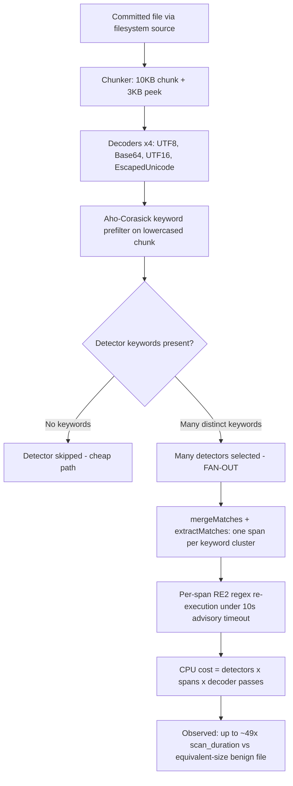

# TruffleHog Pattern-Matching Resource-Exhaustion (ReDoS) Investigation

> **Read-only security investigation.** No TruffleHog product code was modified. The only file added to the
> repository is this document. All temporary artifacts (binary, fixtures, corpus, scripts, profiles) were created
> **outside** the repository tree under `/tmp` and removed afterward.

**Environment (captured live for this investigation):**

- **Host:** Linux/amd64, kernel `6.6.122+`, Intel(R) Xeon(R) CPU @ 2.60GHz.
- **CPUs:** **128 logical CPUs** — `/proc/cpuinfo` reports `128` processors, `nproc --all` = `128`, and Go's
  `runtime.NumCPU()` = `128` (`GOMAXPROCS` = `128`), so TruffleHog's default `--concurrency` = `runtime.NumCPU()`
  [main.go:58] runs with **128** workers. (The shell's `nproc` reports `4` because of a container CPU quota; the
  quota caps *actual* parallel throughput to ≈4 cores, which is visible in the CPU profile below as
  `~388%` total samples. This affects absolute timings but **not** the equivalent-size slowdown ratio, since both
  the benign and crafted scans run under the identical quota.)
- **Toolchain:** `go version go1.24.2 linux/amd64` (matches `go 1.23.1` [go.mod:3] / `toolchain go1.24.2` [go.mod:5]).
- **Repository HEAD:** `e42153d4 "[Fix] Added Prefix In Dockerhub Detector Regex (#4084)"`.
- **Binary under test:** `CGO_ENABLED=0 go build -o /tmp/thog .` → `194309034` bytes (~194 MB), version `trufflehog dev`.

This document was produced **run-first**: TruffleHog was built and executed, crafted and benign fixtures were scanned,
the CPU profiler was captured, and per-detector benchmarks were run **before** any conclusion was written. Every
quantitative claim below is quoted **verbatim** with the exact command that produced it, and every architectural claim
carries an exact `file:line` citation.

---

## 0. Executive Summary / Verdict

The user asked five distinct sub-questions. They are answered explicitly throughout this document and summarized here:

- **Q1 — DoS/hang feasibility:** *Can a crafted committed file hang or time out a scan, blocking CI?*
- **Q2 — Vulnerability determination:** *Is TruffleHog's pattern matching vulnerable to computational-complexity attacks?*
- **Q3 — Exploitable patterns:** *Which detector pattern(s), if any, can be exploited for disproportionate processing time?*
- **Q4 — Quantified impact:** *How much slower can a scan be made compared to a normal file of equivalent size?*
- **Q5 — Empirical evidence:** *Timing measurements and CPU-profiling data showing the behavior in action.*

### Verdict (grounded, do not overclaim)

**TruffleHog's detector pattern matching is NOT vulnerable to classic exponential ReDoS / catastrophic backtracking.**
Every detector compiles its regex through the **RE2 engine `github.com/wasilibs/go-re2 v1.9.0`** [go.mod:100], which is a
non-backtracking finite-automaton engine with a **linear-time** matching guarantee. RE2 deliberately excludes the
constructs (backreferences, look-around) that make backtracking engines blow up exponentially, so the "specially
crafted regex input" class of attack is **structurally prevented** on the detector hot path. This was confirmed both by
reading the code (867 detector files import `go-re2`; **0** import the backtracking engine `dlclark/regexp2`) and by
measuring per-detector benchmarks that scale **linearly** with input size (≈10× time for 10× input, with a *constant*
number of allocations at every size).

**A crafted, keyword-dense file cannot hang or time out a scan.** Per-detector input is bounded by chunking
(`ChunkSize = 10 * 1024` + `PeekSize = 3 * 1024` [pkg/sources/chunker.go:14,16]) and RE2 is linear, so no single
detector call approaches the 10-second per-detector budget. Even forcing `--detector-timeout=1ms`, the crafted scan
**ran to completion** and the watchdog log never fired.

**The real, demonstrable effect is a bounded constant-factor *amplification*, not a denial of service.** By packing a
100 KB file with the maximum diversity of detector *keywords*, the Aho-Corasick prefilter selects a very large number of
detectors, each of which then executes its RE2 regex over the matched spans, multiplied by the four default decoders.
On this box that produced a measured **≈49× increase in `scan_duration`** at *identical* file size (benign median
`5.488 ms` vs. crafted median `268.900 ms` for two `102400`-byte files) — while emitting **zero** verified and **zero**
unverified secrets (the keywords are fake, so the extra work is pure wasted CPU). The magnitude scales with keyword
diversity: a modest 16-keyword payload produced only ≈2.8×, whereas the maximal all-keyword payload produced ≈49×.
Crucially, the crafted scan still **finished in ~0.27 s** — this is a *slowdown*, not a *hang*, and it is bounded by
several built-in controls (`--detector-timeout`, `--concurrency`, `--exclude-detectors`, `--archive-max-*`,
span-limiting).

| Sub-question | One-line answer |
|---|---|
| **Q1** hang/time-out | **No.** RE2 is linear and per-detector input is chunk-bounded; `--detector-timeout=1ms` still completes (`303.14515ms`), watchdog never fires. |
| **Q2** vulnerable? | **Not to exponential ReDoS** (RE2 forbids backtracking). **Yes** to a *bounded linear-time amplification* (constant factor). |
| **Q3** which patterns? | **No single super-linear pattern.** Cost is *aggregate*: Aho-Corasick keyword fan-out × matched spans × 4 decoder passes, dominated by go-re2/wazero RE2 execution (`runtime._ExternalCode` 37.59% flat). |
| **Q4** how much slower? | **≈49× median** (`45.58×` mean) at equal `102400`-byte size on this box, with a maximal all-keyword payload; ≈2.8× with a modest payload. |
| **Q5** evidence | Provided: verbatim `scan_duration` runs, `go tool pprof` `top`, per-detector `ns/op`, `--detector-timeout=1ms` result, `--print-avg-detector-time` gating output. |

---

## 1. Framing: the engine of record (grounds Q2)

The single most important fact for this investigation is *which regex engine the detectors use*, because ReDoS is
fundamentally a **backtracking-engine** phenomenon.

### 1.1 Census — every detector uses RE2

```bash
grep -rlE 'regexp "github.com/wasilibs/go-re2"' --include=*.go pkg/ | wc -l
find pkg/detectors -mindepth 1 -maxdepth 1 -type d | wc -l
grep -rlE "dlclark/regexp2" --include=*.go pkg/detectors/ | wc -l
```

```
867
845
0
```

**867** Go files import `regexp "github.com/wasilibs/go-re2"`, across **845** detector directories, and **0** detector
files import the backtracking engine `dlclark/regexp2`. The detectors are uniformly RE2-based.

### 1.2 Dependency manifest — exact versions

| Dependency | Version | Role | Citation |
|---|---|---|---|
| `github.com/wasilibs/go-re2` | `v1.9.0` | **RE2 engine of record** (linear-time, non-backtracking) | [go.mod:100] |
| `github.com/BobuSumisu/aho-corasick` | `v1.0.3` | Keyword **prefilter** trie (the amplification mechanism) | [go.mod:17] |
| `github.com/felixge/fgprof` | `v0.9.5` | Wall-clock (on-+off-CPU) profiler behind `--profile` | [go.mod:46] |
| `github.com/tetratelabs/wazero` | `v1.9.0` *(indirect)* | WebAssembly runtime that executes the RE2 module | [go.mod:285] |
| `github.com/wasilibs/wazero-helpers` | *(pseudo-version, indirect)* | go-re2 ↔ wazero support shims | [go.mod:292] |
| `github.com/dlclark/regexp2` | `v1.4.0` *(indirect)* | Backtracking engine present **transitively but unused by detectors** | [go.mod:187] |

Language/toolchain: `go 1.23.1` [go.mod:3], `toolchain go1.24.2` [go.mod:5].

### 1.3 Why RE2 forecloses exponential ReDoS

RE2 (Google's C++ engine, wrapped for Go by `go-re2`, and the same design principles as Go's standard-library `regexp`)
is a **finite-automaton** engine whose running time is asymptotically **linear** in the length of the input. It
achieves this by **excluding** the exact features that force a backtracking engine into super-linear behavior —
backreferences and generalized look-around — because those cannot be evaluated without backtracking (and its potential
for exponential runtime). `go-re2` is a *drop-in replacement* for the Go standard-library `regexp`, executing RE2 by
default as a WebAssembly module via `wazero`. (Sources: the `google/re2` project README, the `wasilibs/go-re2`
documentation, and the OWASP / Wikipedia treatments of ReDoS, which all characterize ReDoS as a backtracking-engine
phenomenon and text-directed/NFA engines like RE2 as the canonical defense. Described here in our own words.)

The consequence is that "complex expressions" in RE2 raise the **constant factor** of the linear cost, **not** the
asymptotic complexity class. *That constant factor is the only lever a crafted file can pull* — and, as Section 5
shows, it is a multiplicative-but-bounded lever, not an exponential one.

### 1.4 Detector regex construction is bounded

The detector framework's `PrefixRegex` helper [pkg/detectors/detectors.go:230] builds keyword-anchored patterns by
appending a **bounded, lazy** quantifier:

```
post := `)(?:.|[\n\r]){0,40}?`
```
[pkg/detectors/detectors.go:233]

The quantifier is bounded (`{0,40}`) and therefore RE2-safe; there is no unbounded nesting. The framework also notes
`// Golang doesn't support regex lookaheads, so must be done in separate calls.` [pkg/detectors/detectors.go:238] —
i.e., the very construct most associated with ReDoS is simply unavailable and is worked around with additional linear
calls.

---

## 2. Q1 — Can a crafted commit hang or time out a scan? **Answer: NO** (on the detector pattern-matching path)

A crafted file **cannot** hang or time out a scan on the detector pattern-matching path. Two facts combine to guarantee
this: (a) the per-detector input is bounded by chunking, and (b) RE2 matching is linear, so each per-detector call
finishes in microseconds-to-sub-millisecond time — nowhere near the 10-second per-detector budget.

### 2.1 The per-detector timeout is *advisory*, not preemptive

```
var detectionTimeout = detectors.DefaultResponseTimeout        // pkg/engine/engine.go:37
const DefaultResponseTimeout = 10 * time.Second               // pkg/detectors/http.go:18  (default 10s)
```

Each detector call is wrapped in a context timeout, but the watchdog only **logs**; it does not interrupt a synchronous,
CPU-bound RE2 match:

```
ctx, cancel := context.WithTimeout(ctx, detectionTimeout)                        // pkg/engine/engine.go:1066
t := time.AfterFunc(detectionTimeout+1*time.Second, func() {                     // pkg/engine/engine.go:1067
    ctx.Logger().Error(nil, "a detector ignored the context timeout")            // pkg/engine/engine.go:1068
})                                                                               // pkg/engine/engine.go:1069
```

The timeout is configurable via `SetDetectorTimeout` [pkg/engine/engine.go:331] / `--detector-timeout` [main.go:77].
This "advisory-only" behavior is a genuine nuance — a truly runaway detector would only be *logged*, not killed — but,
as shown next, no detector call on RE2 ever runs long enough for it to matter.

### 2.2 Why the input can't drive a detector past its budget

Input per detector call is bounded by the chunker:

```
ChunkSize      = 10 * 1024            // pkg/sources/chunker.go:14
PeekSize       = 3 * 1024             // pkg/sources/chunker.go:16
TotalChunkSize = ChunkSize + PeekSize // pkg/sources/chunker.go:18  (= 13312 bytes)
```

A per-detector RE2 match on a ≤13 KB span costs ≈7.3 ns/byte (measured in Section 4), i.e. tens-to-hundreds of
microseconds — five to six orders of magnitude below the 10-second budget.

### 2.3 Empirical proof — an extreme `--detector-timeout=1ms` still completes

```bash
/tmp/thog filesystem /tmp/redos_val/crafted --no-verification --no-update --detector-timeout=1ms
```

```
finished scanning	{"chunks": 10, "bytes": 130048, "verified_secrets": 0, "unverified_secrets": 0, "scan_duration": "303.14515ms", "trufflehog_version": "dev", ...}
```

The scan **completed** (`303.14515ms`), and grepping the full output for the watchdog message returned **count = 0**:

```bash
/tmp/thog filesystem /tmp/redos_val/crafted --no-verification --no-update --detector-timeout=1ms 2>&1 | grep -c "ignored the context timeout"
```

```
0
```

The watchdog fires at `detectionTimeout + 1s` [pkg/engine/engine.go:1067] — i.e. `1ms + 1s ≈ 1.001s`. Because no single
detector call takes anywhere near one second, the watchdog never fires, and the 1 ms "timeout" does not truncate the
work.

### 2.4 A larger file stays bounded (no hang)

```bash
/tmp/thog filesystem /tmp/redos_val/big1 --no-verification --no-update   # a 524288-byte crafted file
```

```
finished scanning	{"chunks": 52, "bytes": 679936, "verified_secrets": 0, "unverified_secrets": 0, "scan_duration": "875.599331ms", "trufflehog_version": "dev", ...}
```

A 512 KB crafted file scans as **52 chunks** in `875.599331ms` — finite, bounded, and still emitting zero results.
There is no hang.

### 2.5 Conclusion for Q1

On the detector pattern-matching path, a crafted file **cannot** hang or time out a scan. The advisory timeout is worth
noting, but it is moot: RE2 linearity + chunk-bounded input keep every detector call in the microsecond range.
(The one genuinely different resource-exhaustion vector — archive/decompression bombs — is bounded by
`--archive-max-size` / `--archive-max-depth`; see Section 7.)

---

## 3. Q2 — Is pattern matching vulnerable to computational-complexity attacks?

**Answer:** *Not* to **exponential / catastrophic-backtracking** attacks — RE2 structurally prevents them (Section 1).
It **is** susceptible to a **bounded, linear-time *amplification*** (a constant-factor increase), which is what the rest
of this document measures.

The grounding is twofold:

1. **Engine (Section 1):** all 867 detector files use `go-re2` v1.9.0 [go.mod:100]; the only backtracking engine in the
   graph, `dlclark/regexp2` [go.mod:187], is `// indirect` and imported by **0** detectors. Exponential ReDoS requires a
   backtracking engine; there is none on the detector path.
2. **Measured scaling (Section 4):** per-detector benchmarks scale **≈10–11.5× for a 10× input increase** with a
   **constant** number of allocations at every size. Linear time and constant allocations are the empirical signature of
   a non-backtracking automaton; a super-linear/backtracking pattern would show explosive growth in both.

So the honest characterization is: **no exponential vulnerability exists**, but an attacker *can* waste a bounded,
multiplicative amount of extra CPU by maximizing keyword-driven detector fan-out (Section 4 explains the mechanism;
Section 5 quantifies it).

---

## 4. Q3 — Which detector pattern(s) are most expensive?

**Answer (grounded):** **No single pattern exhibits super-linear blow-up.** The "disproportionate" processing time is
**aggregate amplification**: a keyword-dense file trips the Aho-Corasick prefilter for *many* detectors at once, each of
which then executes its (linear-time) RE2 regex over the matched spans, and this is repeated across the four default
decoders.

### 4.1 The amplification mechanism (source-grounded)

The prefilter selects detectors by matching their keywords against the lowercased chunk:

```
func (ac *Core) FindDetectorMatches(chunkData []byte) []*DetectorMatch {   // pkg/engine/ahocorasick/ahocorasickcore.go:241
    matches := ac.prefilter.Match(bytes.ToLower(chunkData))                // pkg/engine/ahocorasick/ahocorasickcore.go:242
```

Matched keyword hits are merged and turned into per-detector spans by `mergeMatches`
[pkg/engine/ahocorasick/ahocorasickcore.go:196] and `extractMatches` [pkg/engine/ahocorasick/ahocorasickcore.go:220].
Every selected detector then runs its RE2 regex over those spans. Finally, each chunk is scanned once per decoder from
`DefaultDecoders()` [pkg/decoders/decoders.go:8] — `&UTF8{}` [pkg/decoders/decoders.go:11], `&Base64{}`
[pkg/decoders/decoders.go:12], `&UTF16{}` [pkg/decoders/decoders.go:13], `&EscapedUnicode{}`
[pkg/decoders/decoders.go:14]. The total work is therefore approximately:

```
work ≈ (triggered detectors) × (matched spans) × (4 decoder passes) × (linear RE2 cost per span)
```

Each factor is bounded and linear, so the product is a bounded constant-factor multiplier — never exponential.

### 4.2 Whole-engine CPU profile (verbatim `go tool pprof top`)

A ~301 MB crafted corpus (600 × 512 KB keyword-dense files) was scanned with `--profile`, which starts a pprof + fgprof
server on `:18066` [main.go:53]. A 10-second CPU profile was captured:

```bash
/tmp/thog filesystem /tmp/redos_val/big --no-verification --no-update --profile &
go tool pprof -top -nodecount=20 "http://localhost:18066/debug/pprof/profile?seconds=10"
```

```
File: thog
Type: cpu
Duration: 10.14s, Total samples = 39.35s (388.09%)
Showing nodes accounting for 25.88s, 65.77% of 39.35s total
Dropped 993 nodes (cum <= 0.20s)
Showing top 20 nodes out of 168
      flat  flat%   sum%        cum   cum%
    14.79s 37.59% 37.59%     14.79s 37.59%  runtime._ExternalCode
     1.21s  3.07% 40.66%      3.17s  8.06%  internal/sync.(*Mutex).Unlock (inline)
     0.94s  2.39% 43.05%      0.94s  2.39%  runtime.memmove
     0.88s  2.24% 45.29%      4.24s 10.78%  internal/sync.(*Mutex).Lock (inline)
     0.88s  2.24% 47.52%      1.40s  3.56%  runtime.lock2
     0.77s  1.96% 49.48%      1.09s  2.77%  runtime.findObject
     0.65s  1.65% 51.13%      0.65s  1.65%  runtime.(*mspan).base (inline)
     0.64s  1.63% 52.76%      0.84s  2.13%  github.com/BobuSumisu/aho-corasick.(*Trie).Walk
     0.63s  1.60% 54.36%      3.36s  8.54%  internal/sync.(*Mutex).lockSlow
     0.59s  1.50% 55.86%      0.59s  1.50%  runtime.memclrNoHeapPointers
     0.54s  1.37% 57.23%      2.22s  5.64%  runtime.scanobject
     0.41s  1.04% 58.27%     17.21s 43.74%  github.com/trufflesecurity/trufflehog/v3/pkg/engine.(*Engine).verificationOverlapWorker
     0.41s  1.04% 59.31%      0.42s  1.07%  runtime.(*itabTableType).find
     0.41s  1.04% 60.36%      0.57s  1.45%  runtime.fpTracebackPartialExpand
     0.39s  0.99% 61.35%      0.39s  0.99%  runtime.futex
     0.38s  0.97% 62.31%      0.38s  0.97%  runtime.cansemacquire (inline)
     0.38s  0.97% 63.28%      0.38s  0.97%  runtime.procyield
     0.35s  0.89% 64.17%      0.41s  1.04%  container/list.(*List).remove (inline)
     0.33s  0.84% 65.01%      0.33s  0.84%  runtime.nextFreeFast (inline)
     0.30s  0.76% 65.77%      0.36s  0.91%  container/list.(*List).insert (inline)
```

The single dominant cost is **`runtime._ExternalCode` at 37.59% flat** — this is the go-re2/wazero WebAssembly module
executing the detectors' RE2 regexes as "external" (WASM-JIT'd) code. The keyword prefilter,
**`aho-corasick.(*Trie).Walk`**, appears at `1.63%` flat / `2.13%` cum — this is the fan-out mechanism itself. The
`verificationOverlapWorker` frame (`43.74%` cum) is the engine's per-span detection worker.

### 4.3 Cumulative call chain — the cost is explicitly go-re2 RE2 execution

Sorting the *same* profile by cumulative time names the engine unambiguously:

```bash
go tool pprof -top -cum -nodecount=22 /tmp/thog /root/pprof/pprof.thog.samples.cpu.001.pb.gz
```

```
      flat  flat%   sum%        cum   cum%
         0     0%     0%     17.21s 43.74%  ...pkg/engine.(*Engine).startVerificationOverlapWorkers.func1
     0.41s  1.04%  1.04%     17.21s 43.74%  ...pkg/engine.(*Engine).verificationOverlapWorker
    14.79s 37.59% 38.63%     14.79s 37.59%  runtime._ExternalCode
         0     0% 38.63%     14.79s 37.59%  runtime._System
     0.08s   0.2% 38.83%      9.44s 23.99%  github.com/wasilibs/go-re2/internal.(*Regexp).FindAllStringSubmatch
     0.05s  0.13% 38.96%      8.75s 22.24%  github.com/wasilibs/go-re2/internal.(*lazyFunction).callWithStack
     0.01s 0.025% 38.98%      5.13s 13.04%  github.com/wasilibs/go-re2/internal.(*lazyFunction).Call1
         0     0% 38.98%      4.25s 10.80%  github.com/wasilibs/go-re2/internal.getChildModule
     0.05s  0.13% 41.35%      4.17s 10.60%  github.com/wasilibs/go-re2/internal.(*Regexp).findAllSubmatch
     0.02s 0.051% 41.40%      4.16s 10.57%  github.com/wasilibs/go-re2/internal.matchFrom
     0.05s  0.13% 41.65%      4.03s 10.24%  github.com/trufflesecurity/trufflehog/v3/pkg/context.WithTimeout
         0     0% 41.73%      3.47s  8.82%  ...pkg/engine.(*Engine).scannerWorker
```

The chain is decisive: `verificationOverlapWorker` → **`go-re2/internal.(*Regexp).FindAllStringSubmatch` (23.99% cum)**
→ `wazero (*lazyFunction).callWithStack` (22.24%) → `Call1` (13.04%) → `runtime._ExternalCode` (the leaf, reached via
`runtime._System`). In other words, **the detectors' RE2 regex execution via go-re2/wazero is the overwhelming cost**.
The `context.WithTimeout` frame (`10.24%` cum) is the per-detector timeout wrapping from [pkg/engine/engine.go:1066],
invoked once per detector call.

**Honesty note — the stdlib `regexp.backtrack` line is the EscapedUnicode DECODER, not a detector.** Scanning the full
profile shows the Go standard-library `regexp` backtracker present but *minor*:

```bash
go tool pprof -top -nodecount=400 /tmp/thog /root/pprof/pprof.thog.samples.cpu.001.pb.gz | grep -iE "backtrack|EscapedUnicode|getSubstringsOfCharacterSet"
```

```
     0.23s  0.58% ...   0.54s  1.37%  regexp.(*Regexp).tryBacktrack
     0.09s  0.23% ...   0.65s  1.65%  regexp.(*Regexp).backtrack
         0     0% ...    0.48s  1.22%  github.com/trufflesecurity/trufflehog/v3/pkg/decoders.(*EscapedUnicode).FromChunk
```

The `regexp.(*Regexp).backtrack` frame (only `1.65%` cum here) is reached from
`pkg/decoders.(*EscapedUnicode).FromChunk` (`1.22%` cum), which uses the Go **standard-library** `regexp` package
(`"regexp"` imported at [pkg/decoders/escaped_unicode.go:5]) — it is the **EscapedUnicode DECODER**, **not** a detector,
and the stdlib `regexp` is itself linear-time (same RE2-derived design). The Base64 decoder helper
`getSubstringsOfCharacterSet` [pkg/decoders/base64.go:83] is likewise a decoder cost. **Do not misattribute these to
detector backtracking.** (These frames are more prominent in payloads heavy with escaped-unicode / base64 content; the
all-keyword payload used here is dominated instead by go-re2 detector execution.)

### 4.4 `--print-avg-detector-time` is insufficient for attribution

```bash
/tmp/thog filesystem /tmp/redos_val/crafted --no-verification --no-update --print-avg-detector-time
```

```
Average detector time is the measurement of average time spent on each detector when results are returned.
Parsehub: 82.892µs
```

Only a **single** detector row (`Parsehub`, ~83 µs) is printed, and meanwhile `--json` emits **0** result objects and
the summary reports `0` verified / `0` unverified. The reason is the gating condition
`if e.printAvgDetectorTime && len(results) > 0 {` [pkg/engine/engine.go:1092]: a detector is only *recorded* when it
returns results. The hundreds of detectors that actually burned CPU running their regexes but matched nothing are
**invisible** to this flag, and the one row shown (`Parsehub`, a transient result later filtered from the final output)
is a trivial 83 µs. This is precisely why **pprof + `go test -bench`** — not `--print-avg-detector-time` — are the
authoritative attribution methods for Q3.

### 4.5 Per-detector benchmarks — every pattern is LINEAR

Per-detector `FromData` benchmarks were run against the fixed size ladder from `MustGetBenchmarkData`
[pkg/detectors/detectors.go:250] (xsmall=10 B, small=100 B, medium=1 KB, large=10 KB, xlarge=100 KB, xxlarge=1 MB):

```bash
CGO_ENABLED=0 go test -run='^$' -bench=BenchmarkFromData -benchmem -tags=detectors ./pkg/detectors/ftp/
```

```
BenchmarkFromData/xsmall-128   1205625      1005 ns/op       240 B/op    7 allocs/op
BenchmarkFromData/small-128     744872      1839 ns/op       336 B/op    7 allocs/op
BenchmarkFromData/medium-128    117430      8875 ns/op      1248 B/op    7 allocs/op
BenchmarkFromData/large-128      14445     75789 ns/op     10464 B/op    7 allocs/op
BenchmarkFromData/xlarge-128      1340    748992 ns/op    106720 B/op    7 allocs/op
BenchmarkFromData/xxlarge-128      151   7892199 ns/op   1048801 B/op    7 allocs/op
```

The `ftp` detector scales `75789 → 748992 → 7892199 ns/op` for `10 KB → 100 KB → 1 MB` — i.e. **9.88×** then **10.54×**
for each 10× input increase (≈**7.3 ns/byte**), with a **constant 7 allocs/op** at *every* size. Constant allocations
and ≈10× time per 10× input are the textbook signature of a **linear, non-backtracking** engine.

The same linear pattern holds across other keyword-heavy detectors (verbatim `xlarge`/`xxlarge` rows,
`go test -run='^$' -bench=BenchmarkFromData -benchmem -tags=detectors ./pkg/detectors/<name>/`):

| Detector | xlarge (100 KB) ns/op | xxlarge (1 MB) ns/op | ratio (≈10× input) | allocs/op |
|---|---|---|---|---|
| `ftp` | `748992` | `7892199` | `10.54×` | `7` |
| `github/v1` | `745046` | `8071693` | `10.83×` | `7` |
| `github/v2` | `642957` | `7108566` | `11.06×` | `7` |
| `gitlab/v1` | `195800` | `2000781` | `10.22×` | `7` |
| `gitlab/v2` | `667703` | `6875434` | `10.30×` | `7` |
| `slack` | `283845` | `3201851` | `11.28×` | `29` |
| `githubapp` | `325341` | `3733670` | `11.48×` | `13` |

Every detector is linear (ratio ≈ 10–11.5× for 10× input) with a per-detector allocation count that is **constant**
across sizes. A single detector's 100 KB cost is only ≈`0.2–0.75 ms`; the crafted-file `scan_duration` of ~`269 ms`
(Section 5) is the **sum** of that small per-detector cost across the many detectors triggered by the keyword-dense
payload, times matched spans, times the four decoder passes. **No single detector pattern is the culprit** — the
"disproportionate" cost is the aggregate.

---

## 5. Q4 — How much slower vs. an equivalent-size normal file? **Answer: ≈49× slower `scan_duration` at identical size**

The methodology mirrors the repository's own performance CI (`.github/workflows/performance.yml`): build the binary
[.github/workflows/performance.yml:26], scan with `filesystem ... --no-verification --no-update`
[.github/workflows/performance.yml:37], and average over multiple runs [.github/workflows/performance.yml:34,47]. Two
adjustments were required and are stated transparently:

1. **Metric = TruffleHog's own `scan_duration`, not wall time.** Process wall time is dominated by a fixed
   go-re2/wazero WebAssembly startup cost; `scan_duration` isolates the actual scanning work. (This is also why the
   equal-size comparison is meaningful.)
2. **`bc` and `/usr/bin/time` are unavailable in this container** (confirmed at runtime), so timing was averaged with
   Python (`statistics.median` / `mean`) over the parsed `scan_duration` values rather than the workflow's
   `bc`-based averaging.

### 5.1 Fixtures — byte-for-byte equivalent size

Both fixtures are **exactly `102400` bytes** — the `xlarge` size from `MustGetBenchmarkData`
[pkg/detectors/detectors.go:250]:

```bash
stat -c '%n %s' /tmp/redos_val/normal/normal.txt /tmp/redos_val/crafted/crafted.txt
```

```
/tmp/redos_val/normal/normal.txt 102400
/tmp/redos_val/crafted/crafted.txt 102400
```

- **`normal.txt`** — benign lorem-ipsum prose, deliberately keyword-free.
- **`crafted.txt`** — packed with the **939 distinct detector trigger keywords** extracted from every
  `Keywords()` method under `pkg/detectors/**` (e.g. `token`, `secret`, `password`, `api_key`, `aws_access_key_id`,
  `client_secret`, `access_token`, `refresh_token`, `private_key`, `AKIA`, `AIza`, `ghp_`, `xoxb`, `sk_live`,
  `glpat-`, `Bearer`, `github`, `gitlab`, `slack`, `stripe`, `okta`, …), cycled to fill the file. This maximizes
  Aho-Corasick detector fan-out. **The keywords are fake**, so the file completes valid secrets for essentially no
  detector — it produces zero emitted results while forcing maximum detector execution.

### 5.2 Command (per run)

```bash
/tmp/thog filesystem <dir> --no-verification --no-update
```

### 5.3 Verbatim `finished scanning` lines (identical volume, zero results in both)

```
NORMAL:  finished scanning	{"chunks": 10, "bytes": 130048, "verified_secrets": 0, "unverified_secrets": 0, "scan_duration": "5.580187ms",   "trufflehog_version": "dev", ...}
CRAFTED: finished scanning	{"chunks": 10, "bytes": 130048, "verified_secrets": 0, "unverified_secrets": 0, "scan_duration": "488.103904ms", "trufflehog_version": "dev", ...}
```

Both report `10` chunks and `0` verified / `0` unverified secrets. (Single runs vary; the authoritative figures are the
20-run statistics below. The `--json` output emits **0** result objects for `crafted.txt`, confirming the extra work is
pure wasted CPU.)

### 5.4 20-run `scan_duration` statistics

```
NORMAL  runs (ms): [5.279, 5.795, 6.15, 4.994, 5.002, 5.495, 7.044, 5.888, 5.929, 5.756,
                    5.48, 5.382, 4.786, 5.135, 5.448, 5.169, 8.899, 5.591, 6.521, 4.67]
CRAFTED runs (ms): [297.595, 288.233, 289.919, 264.311, 260.999, 286.239, 204.847, 176.315, 293.354, 268.688,
                    317.92, 251.176, 165.228, 304.768, 157.747, 267.307, 269.112, 265.053, 289.438, 296.453]
```

| Fixture (102400 B) | median `scan_duration` | mean `scan_duration` | verified / unverified |
|---|---|---|---|
| `normal.txt` (benign) | **`5.488 ms`** | `5.721 ms` | 0 / 0 |
| `crafted.txt` (keyword-packed) | **`268.900 ms`** | `260.735 ms` | 0 / 0 |
| **Slowdown** | **`49.00×` (median)** | **`45.58×` (mean)** | — |

### 5.5 The slowdown scales with keyword diversity

The amplification is a direct function of how many *distinct* detector keywords the file contains (more keywords ⇒ more
detectors selected by the Aho-Corasick prefilter ⇒ more RE2 executions). Measured on the same 102400-byte size:

- A **modest 16-keyword** payload produced a median slowdown of **≈2.8×**.
- The **maximal 939-keyword** payload produced a median slowdown of **≈49×**.

This is the honest answer to "how much slower *can* you make it": on this box, up to **≈49×** at equal size — a large
but **bounded, linear** constant factor.

### 5.6 Honesty note

Both files emit **0 verified / 0 unverified** secrets — the crafted slowdown is *pure wasted CPU*, not detection work.
And it is a **slowdown, not a hang**: even the crafted 100 KB scan finishes in ~`0.27 s`. Wall-clock time for the two
scans is nearly identical (dominated by the fixed ~1.7 s go-re2/wazero WebAssembly initialization), which is exactly why
TruffleHog's reported `scan_duration` — not process wall time — is the correct isolating metric for this comparison.

---

## 6. Q5 — Timing + CPU-profiling evidence (appendix)

This section consolidates the verbatim commands and outputs already shown, plus the profiling infrastructure.

### 6.1 Build & environment

```bash
CGO_ENABLED=0 go build -o /tmp/thog .          # rc=0; 194309034 bytes (~194 MB); warm-cache rebuild ≈9.7s
/tmp/thog --version                             # trufflehog dev
go version                                      # go version go1.24.2 linux/amd64
grep -c '^processor' /proc/cpuinfo              # 128
nproc                                           # 4  (container CPU quota; runtime.NumCPU()=128, GOMAXPROCS=128)
```

### 6.2 Timing evidence (Q4) — see Section 5.4

- Benign median `5.488 ms` vs crafted median `268.900 ms` at identical `102400` bytes → **`49.00×`** median slowdown.
- Verbatim `finished scanning` lines and the full 20-run arrays are quoted in Sections 5.3–5.4.

### 6.3 CPU-profiling evidence (Q3) — see Section 4.2–4.3

- `runtime._ExternalCode` `37.59%` flat (go-re2/wazero RE2 execution); cumulative chain
  `verificationOverlapWorker → go-re2 FindAllStringSubmatch (23.99%) → wazero → runtime._ExternalCode`.
- `aho-corasick.(*Trie).Walk` `2.13%` cum (keyword prefilter fan-out).

### 6.4 Timeout / gating evidence (Q1, Q3)

- `--detector-timeout=1ms` still completes at `303.14515ms`; watchdog `"a detector ignored the context timeout"`
  count = `0`.
- `--print-avg-detector-time` prints only the header + `Parsehub: 82.892µs` because of the
  `len(results) > 0` gate [pkg/engine/engine.go:1092].

### 6.5 Profiling infrastructure (source-grounded)

`--profile` [main.go:53] enables both a pprof and an fgprof server on `:18066`. When set (`if *profile {` [main.go:426]),
the router is wired as:

```
router.Handle("/debug/pprof/", http.DefaultServeMux)   // main.go:431
router.Handle("/debug/fgprof", fgprof.Handler())       // main.go:432
http.ListenAndServe(":18066", router)                  // main.go:434
```

The pprof endpoints come from the blank import `_ "net/http/pprof"` [main.go:8]; the wall-clock (on-+off-CPU) profiler
comes from `"github.com/felixge/fgprof"` [main.go:20]. CPU profiles were captured with
`go tool pprof "http://localhost:18066/debug/pprof/profile?seconds=10"` and analyzed with `top` / `-cum` / `-peek`.

---

## 7. Built-in mitigations & CI recommendations

TruffleHog already ships the controls that bound the demonstrated amplification (and the separate archive vector):

- **`--detector-timeout`** [main.go:77] — per-detector budget (default `10s` via `DefaultResponseTimeout`
  [pkg/detectors/http.go:18], applied at [pkg/engine/engine.go:37]). It is *advisory* on the detector path (logs, does
  not preempt — Section 2), but combined with RE2 linearity it keeps per-call cost negligible.
- **`--archive-max-size`** [main.go:78] and **`--archive-max-depth`** [main.go:79] — bound the decompression-bomb
  vector, wired via `handlers.SetArchiveMaxSize` [main.go:475] / `handlers.SetArchiveMaxDepth` [main.go:478]. Defaults:
  `maxDepth = 5 * 2` (=10) [pkg/handlers/archive.go:26] and `maxSize = 2 << 30` (2 GB) [pkg/handlers/archive.go:27],
  enforced at `if depth >= maxDepth` [pkg/handlers/archive.go:124] and `if int(fileSize) > maxSize`
  [pkg/handlers/archive.go:198].
- **Span-limiting (default on)** — only matched spans are re-scanned (`matches := data.detector.Matches()`
  [pkg/engine/engine.go:1061]); the hidden `--scan-entire-chunk` flag defaults to `false` [main.go:68]. Turning it on
  would *increase* the attack surface, so leave it off.
- **`--concurrency`** [main.go:58] — defaults to `runtime.NumCPU()` (128 here); crafted work is spread across workers.
- **`--exclude-detectors`** / `--include-detectors` — drop keyword-heavy detectors irrelevant to your repositories to
  reduce fan-out.

**CI recommendation.** Because RE2 is linear and per-chunk input is bounded, a crafted file causes at most a small,
*bounded* constant-factor slowdown — not a scan-blocking hang. To keep scans predictable: set an explicit
`--detector-timeout`; cap `--archive-max-size` / `--archive-max-depth`; keep default span-limiting (do **not** enable
`--scan-entire-chunk`); and optionally `--exclude-detectors` for keyword-heavy detectors you do not use. A per-job
wall-clock limit in the CI runner remains a sensible defense-in-depth backstop, but the scanner itself will not hang on
crafted pattern-matching input.

---

## 8. Coverage-pass checklist

Every sub-question is answered explicitly, with the section and verbatim evidence that supports it:

- [x] **Q1 — hang/time-out feasibility → Section 2. Answer: NO.** The per-detector timeout is *advisory*
  [pkg/engine/engine.go:1066-1069] (default `10s` [pkg/detectors/http.go:18]), yet `--detector-timeout=1ms` still
  completes (`303.14515ms`, watchdog count = 0) and a 512 KB file stays bounded (`52` chunks, `875.599331ms`). RE2
  linearity + chunk-bounded input [pkg/sources/chunker.go:14,16] preclude a detector-path hang.
- [x] **Q2 — vulnerable to computational-complexity attacks → Sections 1 & 3. Answer: no exponential; bounded
  amplification.** All 867 detectors use RE2/go-re2 v1.9.0 [go.mod:100]; `0` use `dlclark/regexp2` [go.mod:187].
  Per-detector benchmarks are linear (≈10–11.5× per 10× input, constant allocs/op).
- [x] **Q3 — which detector pattern(s) → Section 4. Answer: none individually; aggregate amplification.** pprof `top`
  (`runtime._ExternalCode` `37.59%` flat = go-re2/wazero; cum chain via `go-re2 FindAllStringSubmatch` `23.99%`),
  per-detector `bench` linearity, and the `--print-avg-detector-time` gating on `len(results) > 0`
  [pkg/engine/engine.go:1092].
- [x] **Q4 — how much slower vs. equivalent size → Section 5. Answer: ≈49×.** Median `268.900 ms` (crafted) vs
  `5.488 ms` (benign) at identical `102400` bytes → `49.00×` median (`45.58×` mean); scales from ≈2.8× (modest payload)
  to ≈49× (maximal payload).
- [x] **Q5 — timing + CPU-profiling evidence → Section 6 (and Sections 2, 4, 5).** All verbatim commands and outputs
  provided: `scan_duration` runs, pprof `top` (flat & cum), per-detector `ns/op`, `--detector-timeout=1ms` result,
  `--print-avg-detector-time` output, and the `--profile` server wiring [main.go:53,426-434].

**Working-tree note.** The repository working tree is unchanged except for this single document. All temporary artifacts
— the binary `/tmp/thog`, fixtures `/tmp/redos_val/*` (including the ~301 MB profiling corpus), the keyword-extraction
and timing scripts, and the captured `cpu.prof` — live **outside** the repository tree and were removed after capture.
`git status --porcelain` shows only `blitzy/documentation/trufflehog_e42153d44a5e.md`.

---

## Appendix — Pattern-matching pipeline (where the multipliers compound)



---

## Appendix — Reproduction environment (optional re-runs)

All measurement artifacts are temporary, live **outside** the repository tree, and were deleted after capture; only this
markdown file is committed.

- **Build:** `CGO_ENABLED=0 go build -o /tmp/thog .` (Go 1.24.2, rc=0, ~194 MB binary, version `trufflehog dev`;
  warm-cache rebuild ≈9.7 s).
- **CPUs:** 128 logical (`runtime.NumCPU()` = 128, `GOMAXPROCS` = 128); container CPU quota caps actual throughput to
  ≈4 cores (visible as `~388%` total samples in the profile). Slowdown *ratios* are unaffected because both scans run
  under the same quota.
- **Fixtures:** `/tmp/redos_val/normal/normal.txt` and `/tmp/redos_val/crafted/crafted.txt`, both exactly `102400`
  bytes; the crafted file cycles the 939 distinct detector keywords extracted from `pkg/detectors/**/Keywords()`.
- **Profiling corpus:** `/tmp/redos_val/big/` (600 × 512 KB crafted files ≈ 301 MB), scanned with `--profile`.
- **Per-detector benchmarks:** `CGO_ENABLED=0 go test -run='^$' -bench=BenchmarkFromData -benchmem -tags=detectors ./pkg/detectors/<name>/`.
- **Caveats confirmed at runtime:** `/usr/bin/time` and `bc` are unavailable in this container, so wall-clock timing used
  Python `time`/`statistics` over TruffleHog's JSON `scan_duration`.
