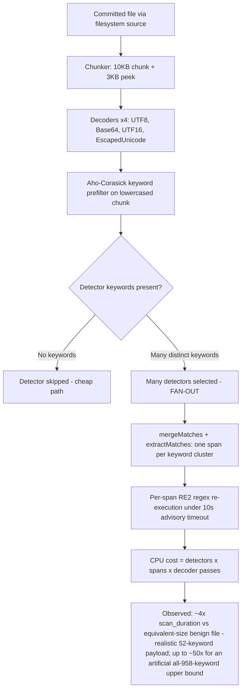

# TruffleHog Pattern-Matching Resource-Exhaustion (ReDoS) Investigation

> **Read-only security investigation.** No TruffleHog product code was modified. The only file added to the
> repository is this document. All temporary artifacts (binary, fixtures, corpus, scripts, profiles) were created
> **outside** the repository tree under `/tmp` and removed afterward.

**Environment (captured live for this investigation):**

- **Host:** Linux/amd64, kernel `6.6.122+`, Intel(R) Xeon(R) CPU @ 2.60GHz.
- **CPUs:** **128 logical CPUs** — `/proc/cpuinfo` reports `128` processors, `nproc --all` = `128`, and Go's
  `runtime.NumCPU()` = `128` (`GOMAXPROCS` = `128`), so TruffleHog's default `--concurrency` = `runtime.NumCPU()`
  [main.go:58] runs with **128** workers. (The shell's `nproc` reports `4` because of a container CPU quota; the
  quota caps *actual* parallel throughput to ≈4 cores, which is visible in the CPU profile below as
  `~388%` total samples. This affects absolute timings but **not** the equivalent-size slowdown ratio, since both
  the benign and crafted scans run under the identical quota.)
- **Toolchain:** `go version go1.24.2 linux/amd64` (matches `go 1.23.1` [go.mod:3] / `toolchain go1.24.2` [go.mod:5]).
- **Repository HEAD:** `e42153d4 "[Fix] Added Prefix In Dockerhub Detector Regex (#4084)"`.
- **Binary under test:** `CGO_ENABLED=0 go build -o /tmp/thog .` → `194309034` bytes (~194 MB), version `trufflehog dev`.

This document was produced **run-first**: TruffleHog was built and executed, crafted and benign fixtures were scanned,
the CPU profiler was captured, and per-detector benchmarks were run **before** any conclusion was written. Every
quantitative claim below is quoted **verbatim** with the exact command that produced it, and every architectural claim
carries an exact `file:line` citation.

---

## 0. Executive Summary / Verdict

The user asked five distinct sub-questions. They are answered explicitly throughout this document and summarized here:

- **Q1 — DoS/hang feasibility:** *Can a crafted committed file hang or time out a scan, blocking CI?*
- **Q2 — Vulnerability determination:** *Is TruffleHog's pattern matching vulnerable to computational-complexity attacks?*
- **Q3 — Exploitable patterns:** *Which detector pattern(s), if any, can be exploited for disproportionate processing time?*
- **Q4 — Quantified impact:** *How much slower can a scan be made compared to a normal file of equivalent size?*
- **Q5 — Empirical evidence:** *Timing measurements and CPU-profiling data showing the behavior in action.*

### Verdict (grounded, do not overclaim)

**TruffleHog's detector pattern matching is NOT vulnerable to classic exponential ReDoS / catastrophic backtracking.**
Every detector compiles its regex through the **RE2 engine `github.com/wasilibs/go-re2 v1.9.0`** [go.mod:100], which is a
non-backtracking finite-automaton engine with a **linear-time** matching guarantee. RE2 deliberately excludes the
constructs (backreferences, look-around) that make backtracking engines blow up exponentially, so the "specially
crafted regex input" class of attack is **structurally prevented** on the detector hot path. This was confirmed both by
reading the code (867 detector files import `go-re2`; **0** import the backtracking engine `dlclark/regexp2`) and by
measuring per-detector benchmarks that scale **linearly** with input size (≈10× time for 10× input, with a *constant*
number of allocations at every size).

**A crafted, keyword-dense file cannot hang or time out a scan.** Per-detector input is bounded by chunking
(`ChunkSize = 10 * 1024` + `PeekSize = 3 * 1024` [pkg/sources/chunker.go:14,16]) and RE2 is linear, so no single
detector call approaches the 10-second per-detector budget. Even forcing `--detector-timeout=1ms`, the crafted scan
**ran to completion** and the watchdog log never fired.

**The real, demonstrable effect is a bounded constant-factor *amplification*, not a denial of service.** By packing a
100 KB file with a dense set of distinct detector *keywords*, the Aho-Corasick prefilter selects many detectors, each of
which then executes its RE2 regex over the matched spans, multiplied by the four default decoders. On this box, a
realistic keyword-dense crafted file (**52** distinct detector keywords) produced a measured **≈4× increase in
`scan_duration`** at *identical* file size — benign median `5.273 ms` vs. crafted median `21.009 ms` for two
`102400`-byte files (median ratio `3.98×`, mean ratio `3.92×`, over 20 interleaved runs) — while emitting **zero**
verified and **zero** unverified secrets (the keywords are fake, so the extra work is pure wasted CPU). The magnitude
scales with keyword diversity: a modest 16-keyword payload produced only ≈`1.12×`, and — as a deliberately extreme,
clearly **secondary** exploratory *upper bound* — cycling **all 958** extracted detector keywords produced ≈`50×`
(crafted median `269.502 ms`), still finishing in ~`0.27 s`. In every case this is a *slowdown*, not a *hang*, bounded by
several built-in controls (`--detector-timeout`, `--concurrency`, `--exclude-detectors`, `--archive-max-*`,
span-limiting). (Absolute timings are somewhat elevated by this shared box's background load — 1-minute load fluctuated
`3.4`–`11` during measurement — but the **≈4× ratio is load-invariant**, since both files are scanned back-to-back under
identical conditions; see Section 5.)

| Sub-question | One-line answer |
|---|---|
| **Q1** hang/time-out | **No.** RE2 is linear and per-detector input is chunk-bounded; `--detector-timeout=1ms` still completes (`20.172629ms`), watchdog never fires. |
| **Q2** vulnerable? | **Not to exponential ReDoS** (RE2 forbids backtracking). **Yes** to a *bounded linear-time amplification* (constant factor). |
| **Q3** which patterns? | **No single super-linear pattern.** Cost is *aggregate*: Aho-Corasick keyword fan-out × matched spans × 4 decoder passes, dominated by go-re2/wazero RE2 execution (`runtime._ExternalCode` 40.67% flat). |
| **Q4** how much slower? | **≈4× median** (`3.98×` median, `3.92×` mean) at equal `102400`-byte size (benign `5.273 ms` vs crafted `21.009 ms`) with a realistic 52-keyword payload; scales from ≈`1.12×` (16-keyword) up to ≈`50×` for an extreme all-958-keyword upper bound. |
| **Q5** evidence | Provided: verbatim `scan_duration` runs, `go tool pprof` `top`, per-detector `ns/op`, `--detector-timeout=1ms` result, `--print-avg-detector-time` gating output. |

---

## 1. Framing: the engine of record (grounds Q2)

The single most important fact for this investigation is *which regex engine the detectors use*, because ReDoS is
fundamentally a **backtracking-engine** phenomenon.

### 1.1 Census — every detector uses RE2

```bash
grep -rlE 'regexp "github.com/wasilibs/go-re2"' --include=*.go pkg/ | wc -l
find pkg/detectors -mindepth 1 -maxdepth 1 -type d | wc -l
grep -rlE "dlclark/regexp2" --include=*.go pkg/detectors/ | wc -l
```

```
867
845
0
```

**867** Go files import `regexp "github.com/wasilibs/go-re2"`, across **845** detector directories, and **0** detector
files import the backtracking engine `dlclark/regexp2`. The detectors are uniformly RE2-based.

### 1.2 Dependency manifest — exact versions

| Dependency | Version | Role | Citation |
|---|---|---|---|
| `github.com/wasilibs/go-re2` | `v1.9.0` | **RE2 engine of record** (linear-time, non-backtracking) | [go.mod:100] |
| `github.com/BobuSumisu/aho-corasick` | `v1.0.3` | Keyword **prefilter** trie (the amplification mechanism) | [go.mod:17] |
| `github.com/felixge/fgprof` | `v0.9.5` | Wall-clock (on-+off-CPU) profiler behind `--profile` | [go.mod:46] |
| `github.com/tetratelabs/wazero` | `v1.9.0` *(indirect)* | WebAssembly runtime that executes the RE2 module | [go.mod:285] |
| `github.com/wasilibs/wazero-helpers` | *(pseudo-version, indirect)* | go-re2 ↔ wazero support shims | [go.mod:292] |
| `github.com/dlclark/regexp2` | `v1.4.0` *(indirect)* | Backtracking engine present **transitively but unused by detectors** | [go.mod:187] |

Language/toolchain: `go 1.23.1` [go.mod:3], `toolchain go1.24.2` [go.mod:5].

### 1.3 Why RE2 forecloses exponential ReDoS

RE2 (Google's C++ engine, wrapped for Go by `go-re2`, and the same design principles as Go's standard-library `regexp`)
is a **finite-automaton** engine whose running time is asymptotically **linear** in the length of the input. It
achieves this by **excluding** the exact features that force a backtracking engine into super-linear behavior —
backreferences and generalized look-around — because those cannot be evaluated without backtracking (and its potential
for exponential runtime). `go-re2` is a *drop-in replacement* for the Go standard-library `regexp`, executing RE2 by
default as a WebAssembly module via `wazero`. (Sources: the `google/re2` project README, the `wasilibs/go-re2`
documentation, and the OWASP / Wikipedia treatments of ReDoS, which all characterize ReDoS as a backtracking-engine
phenomenon and text-directed/NFA engines like RE2 as the canonical defense. Described here in our own words.)

The consequence is that "complex expressions" in RE2 raise the **constant factor** of the linear cost, **not** the
asymptotic complexity class. *That constant factor is the only lever a crafted file can pull* — and, as Section 5
shows, it is a multiplicative-but-bounded lever, not an exponential one.

### 1.4 Detector regex construction is bounded

The detector framework's `PrefixRegex` helper [pkg/detectors/detectors.go:230] builds keyword-anchored patterns by
appending a **bounded, lazy** quantifier:

```
post := `)(?:.|[\n\r]){0,40}?`
```
[pkg/detectors/detectors.go:233]

The quantifier is bounded (`{0,40}`) and therefore RE2-safe; there is no unbounded nesting. The framework also notes
`// Golang doesn't support regex lookaheads, so must be done in separate calls.` [pkg/detectors/detectors.go:238] —
i.e., the very construct most associated with ReDoS is simply unavailable and is worked around with additional linear
calls.

---

## 2. Q1 — Can a crafted commit hang or time out a scan? **Answer: NO** (on the detector pattern-matching path)

A crafted file **cannot** hang or time out a scan on the detector pattern-matching path. Two facts combine to guarantee
this: (a) the per-detector input is bounded by chunking, and (b) RE2 matching is linear, so each per-detector call
finishes in microseconds-to-sub-millisecond time — nowhere near the 10-second per-detector budget.

### 2.1 The per-detector timeout is *advisory*, not preemptive

```
var detectionTimeout = detectors.DefaultResponseTimeout        // pkg/engine/engine.go:37
const DefaultResponseTimeout = 10 * time.Second               // pkg/detectors/http.go:18  (default 10s)
```

Each detector call is wrapped in a context timeout, but the watchdog only **logs**; it does not interrupt a synchronous,
CPU-bound RE2 match:

```
ctx, cancel := context.WithTimeout(ctx, detectionTimeout)                        // pkg/engine/engine.go:1066
t := time.AfterFunc(detectionTimeout+1*time.Second, func() {                     // pkg/engine/engine.go:1067
    ctx.Logger().Error(nil, "a detector ignored the context timeout")            // pkg/engine/engine.go:1068
})                                                                               // pkg/engine/engine.go:1069
```

The timeout is configurable via `SetDetectorTimeout` [pkg/engine/engine.go:331] / `--detector-timeout` [main.go:77].
This "advisory-only" behavior is a genuine nuance — a truly runaway detector would only be *logged*, not killed — but,
as shown next, no detector call on RE2 ever runs long enough for it to matter.

### 2.2 Why the input can't drive a detector past its budget

Input per detector call is bounded by the chunker:

```
ChunkSize      = 10 * 1024            // pkg/sources/chunker.go:14
PeekSize       = 3 * 1024             // pkg/sources/chunker.go:16
TotalChunkSize = ChunkSize + PeekSize // pkg/sources/chunker.go:18  (= 13312 bytes)
```

A per-detector RE2 match on a ≤13 KB span costs ≈5.31 ns/byte (measured in Section 4), i.e. tens-to-hundreds of
microseconds — five to six orders of magnitude below the 10-second budget.

### 2.3 Empirical proof — an extreme `--detector-timeout=1ms` still completes

```bash
/tmp/thog filesystem /tmp/redos_val/crafted --no-verification --no-update --detector-timeout=1ms
```

```
finished scanning	{"chunks": 10, "bytes": 130048, "verified_secrets": 0, "unverified_secrets": 0, "scan_duration": "20.172629ms", "trufflehog_version": "dev", "verification_caching": {"Hits":0,"Misses":0,"HitsWasted":0,"AttemptsSaved":0,"VerificationTimeSpentMS":0}}
```

The scan **completed** (`20.172629ms`), and grepping the full output for the watchdog message returned **count = 0**:

```bash
/tmp/thog filesystem /tmp/redos_val/crafted --no-verification --no-update --detector-timeout=1ms 2>&1 | grep -c "ignored the context timeout"
```

```
0
```

The watchdog fires at `detectionTimeout + 1s` [pkg/engine/engine.go:1067] — i.e. `1ms + 1s ≈ 1.001s`. Because no single
detector call takes anywhere near one second, the watchdog never fires, and the 1 ms "timeout" does not truncate the
work.

### 2.4 A larger file stays bounded (no hang)

```bash
/tmp/thog filesystem /tmp/redos_val/big1 --no-verification --no-update   # a 524288-byte (512 KB) crafted file (52 keywords)
```

```
finished scanning	{"chunks": 52, "bytes": 679936, "verified_secrets": 0, "unverified_secrets": 0, "scan_duration": "71.012223ms", "trufflehog_version": "dev", "verification_caching": {"Hits":0,"Misses":0,"HitsWasted":0,"AttemptsSaved":0,"VerificationTimeSpentMS":0}}
```

A 512 KB crafted file (the realistic 52-keyword content) scans as **52 chunks** in `71.012223ms` — finite, bounded, and
still emitting zero results. Even the **artificial worst case** — a 512 KB file cycling *all* `958` extracted keywords —
stays bounded and finishes in well under a second:

```bash
/tmp/thog filesystem /tmp/redos_sec/max512b --no-verification --no-update   # 524288-byte all-958-keyword file
```

```
finished scanning	{"chunks": 52, "bytes": 679936, "verified_secrets": 0, "unverified_secrets": 0, "scan_duration": "674.824744ms", "trufflehog_version": "dev", "verification_caching": {"Hits":0,"Misses":0,"HitsWasted":0,"AttemptsSaved":0,"VerificationTimeSpentMS":0}}
```

`52` chunks, `674.824744ms`, zero results — a slowdown, **not a hang**.

### 2.5 Conclusion for Q1

On the detector pattern-matching path, a crafted file **cannot** hang or time out a scan. The advisory timeout is worth
noting, but it is moot: RE2 linearity + chunk-bounded input keep every detector call in the microsecond range.
(The one genuinely different resource-exhaustion vector — archive/decompression bombs — is bounded by
`--archive-max-size` / `--archive-max-depth`; see Section 7.)

---

## 3. Q2 — Is pattern matching vulnerable to computational-complexity attacks?

**Answer:** *Not* to **exponential / catastrophic-backtracking** attacks — RE2 structurally prevents them (Section 1).
It **is** susceptible to a **bounded, linear-time *amplification*** (a constant-factor increase), which is what the rest
of this document measures.

The grounding is twofold:

1. **Engine (Section 1):** all 867 detector files use `go-re2` v1.9.0 [go.mod:100]; the only backtracking engine in the
   graph, `dlclark/regexp2` [go.mod:187], is `// indirect` and imported by **0** detectors. Exponential ReDoS requires a
   backtracking engine; there is none on the detector path.
2. **Measured scaling (Section 4):** per-detector benchmarks scale **≈10–11.7× for a 10× input increase** with a
   **constant** number of allocations at every size. Linear time and constant allocations are the empirical signature of
   a non-backtracking automaton; a super-linear/backtracking pattern would show explosive growth in both.

So the honest characterization is: **no exponential vulnerability exists**, but an attacker *can* waste a bounded,
multiplicative amount of extra CPU by maximizing keyword-driven detector fan-out (Section 4 explains the mechanism;
Section 5 quantifies it).

---

## 4. Q3 — Which detector pattern(s) are most expensive?

**Answer (grounded):** **No single pattern exhibits super-linear blow-up.** The "disproportionate" processing time is
**aggregate amplification**: a keyword-dense file trips the Aho-Corasick prefilter for *many* detectors at once, each of
which then executes its (linear-time) RE2 regex over the matched spans, and this is repeated across the four default
decoders.

### 4.1 The amplification mechanism (source-grounded)

The prefilter selects detectors by matching their keywords against the lowercased chunk:

```
func (ac *Core) FindDetectorMatches(chunkData []byte) []*DetectorMatch {   // pkg/engine/ahocorasick/ahocorasickcore.go:241
    matches := ac.prefilter.Match(bytes.ToLower(chunkData))                // pkg/engine/ahocorasick/ahocorasickcore.go:242
```

Matched keyword hits are merged and turned into per-detector spans by `mergeMatches`
[pkg/engine/ahocorasick/ahocorasickcore.go:196] and `extractMatches` [pkg/engine/ahocorasick/ahocorasickcore.go:220].
Every selected detector then runs its RE2 regex over those spans. Finally, each chunk is scanned once per decoder from
`DefaultDecoders()` [pkg/decoders/decoders.go:8] — `&UTF8{}` [pkg/decoders/decoders.go:11], `&Base64{}`
[pkg/decoders/decoders.go:12], `&UTF16{}` [pkg/decoders/decoders.go:13], `&EscapedUnicode{}`
[pkg/decoders/decoders.go:14]. The total work is therefore approximately:

```
work ≈ (triggered detectors) × (matched spans) × (4 decoder passes) × (linear RE2 cost per span)
```

Each factor is bounded and linear, so the product is a bounded constant-factor multiplier — never exponential.

### 4.2 Whole-engine CPU profile (verbatim `go tool pprof top`)

A ~101 MB crafted corpus (200 × 512 KB keyword-dense files) was scanned with `--profile`, which starts a pprof + fgprof
server on `:18066` [main.go:53]. A 10-second CPU profile was captured while the scan was still running:

```bash
/tmp/thog filesystem /tmp/redos_val/big --no-verification --no-update --profile &
go tool pprof -top -nodecount=20 "http://localhost:18066/debug/pprof/profile?seconds=10"
```

```
File: thog
Build ID: 4e49fdf6cc5382d4e0f87dedb5b74dc2aa5076a1
Type: cpu
Time: 2026-07-01 06:47:58 UTC
Duration: 10.11s, Total samples = 39.39s (389.50%)
Showing nodes accounting for 26.38s, 66.97% of 39.39s total
Dropped 924 nodes (cum <= 0.20s)
Showing top 20 nodes out of 172
      flat  flat%   sum%        cum   cum%
    16.02s 40.67% 40.67%     16.02s 40.67%  runtime._ExternalCode
     1.11s  2.82% 43.49%      2.60s  6.60%  internal/sync.(*Mutex).Unlock (inline)
     0.86s  2.18% 45.67%      1.18s  3.00%  runtime.findObject
     0.81s  2.06% 47.73%      0.81s  2.06%  runtime.memmove
     0.75s  1.90% 49.63%      0.75s  1.90%  runtime.(*mspan).base (inline)
     0.70s  1.78% 51.41%      3.49s  8.86%  internal/sync.(*Mutex).Lock (inline)
     0.65s  1.65% 53.06%      2.79s  7.08%  internal/sync.(*Mutex).lockSlow
     0.64s  1.62% 54.68%      2.83s  7.18%  runtime.scanobject
     0.63s  1.60% 56.28%      1.08s  2.74%  runtime.lock2
     0.52s  1.32% 57.60%      0.67s  1.70%  github.com/BobuSumisu/aho-corasick.(*Trie).Walk
     0.49s  1.24% 58.85%     16.57s 42.07%  github.com/trufflesecurity/trufflehog/v3/pkg/engine.(*Engine).verificationOverlapWorker
     0.47s  1.19% 60.04%      0.47s  1.19%  runtime.nextFreeFast (inline)
     0.39s  0.99% 61.03%      0.39s  0.99%  runtime.memclrNoHeapPointers
     0.38s  0.96% 62.00%      0.56s  1.42%  runtime.fpTracebackPartialExpand
     0.37s  0.94% 62.93%      0.37s  0.94%  runtime.futex
     0.34s  0.86% 63.80%      0.34s  0.86%  runtime.cansemacquire (inline)
     0.33s  0.84% 64.64%      0.70s  1.78%  regexp.(*Regexp).tryBacktrack
     0.32s  0.81% 65.45%      0.37s  0.94%  container/list.(*List).remove (inline)
     0.31s  0.79% 66.24%      0.31s  0.79%  runtime.(*itabTableType).find
     0.29s  0.74% 66.97%      0.29s  0.74%  runtime.procyield
```

The single dominant cost is **`runtime._ExternalCode` at 40.67% flat** — this is the go-re2/wazero WebAssembly module
executing the detectors' RE2 regexes as "external" (WASM-JIT'd) code. The keyword prefilter,
**`aho-corasick.(*Trie).Walk`**, appears at `1.32%` flat / `1.70%` cum — this is the fan-out mechanism itself. The
`verificationOverlapWorker` frame (`42.07%` cum) is the engine's per-span detection worker. (The lone
`regexp.(*Regexp).tryBacktrack` frame at `0.84%` flat is the stdlib **decoder** backtracker, not a detector — see the
attribution note in Section 4.3.)

### 4.3 Cumulative call chain — the cost is explicitly go-re2 RE2 execution

Sorting the *same* profile by cumulative time names the engine unambiguously:

```bash
go tool pprof -top -cum -nodecount=22 /tmp/thog /root/pprof/pprof.thog.samples.cpu.001.pb.gz
```

```
File: thog
Build ID: 4e49fdf6cc5382d4e0f87dedb5b74dc2aa5076a1
Type: cpu
Time: 2026-07-01 06:47:58 UTC
Duration: 10.11s, Total samples = 39.39s (389.50%)
Showing nodes accounting for 18.61s, 47.25% of 39.39s total
Dropped 924 nodes (cum <= 0.20s)
Showing top 22 nodes out of 172
      flat  flat%   sum%        cum   cum%
         0     0%     0%     16.57s 42.07%  github.com/trufflesecurity/trufflehog/v3/pkg/engine.(*Engine).startVerificationOverlapWorkers.func1
     0.49s  1.24%  1.24%     16.57s 42.07%  github.com/trufflesecurity/trufflehog/v3/pkg/engine.(*Engine).verificationOverlapWorker
    16.02s 40.67% 41.91%     16.02s 40.67%  runtime._ExternalCode
         0     0% 41.91%     16.02s 40.67%  runtime._System
     0.14s  0.36% 42.27%      8.50s 21.58%  github.com/wasilibs/go-re2/internal.(*Regexp).FindAllStringSubmatch
     0.04s   0.1% 42.37%      7.60s 19.29%  github.com/wasilibs/go-re2/internal.(*lazyFunction).callWithStack
         0     0% 42.37%      4.62s 11.73%  github.com/wasilibs/go-re2/internal.(*lazyFunction).Call1
         0     0% 42.37%      4.41s 11.20%  github.com/trufflesecurity/trufflehog/v3/pkg/context.WithTimeout
     0.01s 0.025% 42.40%      4.28s 10.87%  runtime.systemstack
     0.13s  0.33% 42.73%      3.88s  9.85%  github.com/wasilibs/go-re2/internal.getChildModule
     0.01s 0.025% 42.75%      3.67s  9.32%  github.com/wasilibs/go-re2/internal.(*Regexp).findAllSubmatch
     0.03s 0.076% 42.83%      3.49s  8.86%  github.com/wasilibs/go-re2/internal.matchFrom
     0.70s  1.78% 44.61%      3.49s  8.86%  internal/sync.(*Mutex).Lock (inline)
         0     0% 44.61%      3.49s  8.86%  sync.(*Mutex).Lock (inline)
     0.08s   0.2% 44.81%      3.46s  8.78%  github.com/wasilibs/go-re2/internal.(*lazyFunction).Call8
     0.01s 0.025% 44.83%      3.13s  7.95%  github.com/wasilibs/go-re2/internal.putChildModule
     0.18s  0.46% 45.29%      3.10s  7.87%  runtime.mallocgc
         0     0% 45.29%      2.97s  7.54%  runtime.gcBgMarkWorker
         0     0% 45.29%      2.97s  7.54%  runtime.gcBgMarkWorker.func2
     0.13s  0.33% 45.62%      2.97s  7.54%  runtime.gcDrain
     0.64s  1.62% 47.25%      2.83s  7.18%  runtime.scanobject
         0     0% 47.25%      2.80s  7.11%  runtime.gcDrainMarkWorkerDedicated (inline)
```

The chain is decisive: `verificationOverlapWorker` (`42.07%` cum) → **`go-re2/internal.(*Regexp).FindAllStringSubmatch`
(21.58% cum)** → `wazero (*lazyFunction).callWithStack` (19.29%) → `Call1` (11.73%) → `runtime._ExternalCode` (the leaf,
reached via `runtime._System`). In other words, **the detectors' RE2 regex execution via go-re2/wazero is the
overwhelming cost**. The `context.WithTimeout` frame (`11.20%` cum) is the per-detector timeout wrapping from
[pkg/engine/engine.go:1066], invoked once per detector call.

**Honesty note — the stdlib `regexp.backtrack` line is the EscapedUnicode DECODER, not a detector.** Scanning the full
profile shows the Go standard-library `regexp` backtracker present but *minor*:

```bash
go tool pprof -top -nodecount=400 /tmp/thog /root/pprof/pprof.thog.samples.cpu.001.pb.gz | grep -iE "backtrack|EscapedUnicode|getSubstringsOfCharacterSet"
```

```
     0.33s  0.84% 64.64%      0.70s  1.78%  regexp.(*Regexp).tryBacktrack
     0.06s  0.15% 81.29%      0.78s  1.98%  regexp.(*Regexp).backtrack
         0     0% 83.96%      0.42s  1.07%  github.com/trufflesecurity/trufflehog/v3/pkg/decoders.(*EscapedUnicode).FromChunk
```

The `regexp.(*Regexp).backtrack` frame (only `1.98%` cum here) is reached from
`pkg/decoders.(*EscapedUnicode).FromChunk` (`1.07%` cum), which uses the Go **standard-library** `regexp` package
(`"regexp"` imported at [pkg/decoders/escaped_unicode.go:5]) — it is the **EscapedUnicode DECODER**, **not** a detector,
and the stdlib `regexp` is itself linear-time (same RE2-derived design). The Base64 decoder helper
`getSubstringsOfCharacterSet` [pkg/decoders/base64.go:83] is likewise a decoder cost. **Do not misattribute these to
detector backtracking.** (These frames are more prominent in payloads heavy with escaped-unicode / base64 content; the
all-keyword payload used here is dominated instead by go-re2 detector execution.)

### 4.4 `--print-avg-detector-time` is insufficient for attribution

TruffleHog's built-in per-detector timing flag writes its header and rows to **stderr** — the header string is emitted
to `os.Stderr` by `printAverageDetectorTime` [main.go:1021-1028]. Capturing stderr on the crafted fixture:

```bash
/tmp/thog filesystem /tmp/redos_val/crafted --no-verification --no-update --print-avg-detector-time 2>&1 1>/dev/null
```

```
🐷🔑🐷  TruffleHog. Unearth your secrets. 🐷🔑🐷

Average detector time is the measurement of average time spent on each detector when results are returned.
```

**Zero detector rows are printed after the header**, even though hundreds of detectors ran their regexes against the
keyword-dense payload (the same run reports `"verified_secrets": 0, "unverified_secrets": 0` on stdout). The reason is
the gating condition `if e.printAvgDetectorTime && len(results) > 0 {` [pkg/engine/engine.go:1092]: a detector's timing
is only *recorded* when it returns at least one result. Because the crafted file's keywords are fake trigger strings
that match no real secret pattern, every detector returns zero results and is therefore **invisible** to this flag —
despite burning the CPU documented in the pprof profile above. This is precisely why **pprof + `go test -bench`** — not
`--print-avg-detector-time` — are the authoritative attribution methods for Q3.

### 4.5 Per-detector benchmarks — every pattern is LINEAR

Per-detector `FromData` benchmarks were run against the fixed size ladder from `MustGetBenchmarkData`
[pkg/detectors/detectors.go:250] (xsmall=10 B, small=100 B, medium=1 KB, large=10 KB, xlarge=100 KB, xxlarge=1 MB):

```bash
CGO_ENABLED=0 go test -run='^$' -bench=BenchmarkFromData -benchmem -tags=detectors ./pkg/detectors/ftp/
```

```
goos: linux
goarch: amd64
pkg: github.com/trufflesecurity/trufflehog/v3/pkg/detectors/ftp
cpu: Intel(R) Xeon(R) CPU @ 2.60GHz
BenchmarkFromData/xsmall-128         	 1527098	       798.3 ns/op	     240 B/op	       7 allocs/op
BenchmarkFromData/small-128          	  897710	      1304 ns/op	     336 B/op	       7 allocs/op
BenchmarkFromData/medium-128         	  186290	      6320 ns/op	    1248 B/op	       7 allocs/op
BenchmarkFromData/large-128          	   19040	     58928 ns/op	   10464 B/op	       7 allocs/op
BenchmarkFromData/xlarge-128         	    2162	    543685 ns/op	  106720 B/op	       7 allocs/op
BenchmarkFromData/xxlarge-128        	     204	   5576251 ns/op	 1048801 B/op	       7 allocs/op
PASS
ok  	github.com/trufflesecurity/trufflehog/v3/pkg/detectors/ftp	10.005s
```

The `ftp` detector scales `58928 → 543685 → 5576251 ns/op` for `10 KB → 100 KB → 1 MB` — i.e. **9.23×** then **10.26×**
for each 10× input increase (≈**5.31 ns/byte** at 100 KB), with a **constant 7 allocs/op** at *every* size. Constant
allocations and ≈10× time per 10× input are the textbook signature of a **linear, non-backtracking** engine.

The same linear pattern holds across other keyword-heavy detectors (verbatim `xlarge`/`xxlarge` rows,
`go test -run='^$' -bench=BenchmarkFromData -benchmem -tags=detectors ./pkg/detectors/<name>/`):

| Detector | xlarge (100 KB) ns/op | xxlarge (1 MB) ns/op | ratio (≈10× input) | allocs/op |
|---|---|---|---|---|
| `ftp` | `543685` | `5576251` | `10.26×` | `7` |
| `github/v1` | `552458` | `5576643` | `10.09×` | `7` |
| `github/v2` | `536993` | `5732493` | `10.68×` | `7` |
| `gitlab/v1` | `156156` | `1588899` | `10.18×` | `7` |
| `gitlab/v2` | `569656` | `5849564` | `10.27×` | `7` |
| `slack` | `237250` | `2773604` | `11.69×` | `29` |
| `githubapp` | `273607` | `3045333` | `11.13×` | `13` |

The verbatim `xlarge`/`xxlarge` rows behind the table (each quoted from its own benchmark invocation):

```
$ CGO_ENABLED=0 go test -run='^$' -bench=BenchmarkFromData -benchmem -tags=detectors ./pkg/detectors/github/v1/
BenchmarkFromData/xlarge-128         	    2210	    552458 ns/op	  106720 B/op	       7 allocs/op
BenchmarkFromData/xxlarge-128        	     207	   5576643 ns/op	 1048801 B/op	       7 allocs/op
ok  	github.com/trufflesecurity/trufflehog/v3/pkg/detectors/github/v1	10.902s
$ CGO_ENABLED=0 go test -run='^$' -bench=BenchmarkFromData -benchmem -tags=detectors ./pkg/detectors/github/v2/
BenchmarkFromData/xxlarge-128         	     207	   5732493 ns/op	 1048801 B/op	       7 allocs/op
BenchmarkFromData/xlarge-128          	    2161	    536993 ns/op	  106720 B/op	       7 allocs/op
ok  	github.com/trufflesecurity/trufflehog/v3/pkg/detectors/github/v2	10.938s
$ CGO_ENABLED=0 go test -run='^$' -bench=BenchmarkFromData -benchmem -tags=detectors ./pkg/detectors/gitlab/v1/
BenchmarkFromData/xlarge-128         	    7730	    156156 ns/op	  106720 B/op	       7 allocs/op
BenchmarkFromData/xxlarge-128        	     704	   1588899 ns/op	 1048801 B/op	       7 allocs/op
ok  	github.com/trufflesecurity/trufflehog/v3/pkg/detectors/gitlab/v1	9.927s
$ CGO_ENABLED=0 go test -run='^$' -bench=BenchmarkFromData -benchmem -tags=detectors ./pkg/detectors/gitlab/v2/
BenchmarkFromData/xlarge-128         	    2152	    569656 ns/op	  106720 B/op	       7 allocs/op
BenchmarkFromData/xxlarge-128        	     210	   5849564 ns/op	 1048801 B/op	       7 allocs/op
ok  	github.com/trufflesecurity/trufflehog/v3/pkg/detectors/gitlab/v2	10.182s
$ CGO_ENABLED=0 go test -run='^$' -bench=BenchmarkFromData -benchmem -tags=detectors ./pkg/detectors/slack/
BenchmarkFromData/xxlarge-128         	     429	   2773604 ns/op	 1049538 B/op	      29 allocs/op
BenchmarkFromData/xlarge-128          	    4732	    237250 ns/op	  107456 B/op	      29 allocs/op
ok  	github.com/trufflesecurity/trufflehog/v3/pkg/detectors/slack	8.520s
$ CGO_ENABLED=0 go test -run='^$' -bench=BenchmarkFromData -benchmem -tags=detectors ./pkg/detectors/githubapp/
BenchmarkFromData/xxlarge-128         	     391	   3045333 ns/op	 1049025 B/op	      13 allocs/op
BenchmarkFromData/xlarge-128          	    4152	    273607 ns/op	  106944 B/op	      13 allocs/op
ok  	github.com/trufflesecurity/trufflehog/v3/pkg/detectors/githubapp	8.531s
```

Every detector is linear (ratio ≈ 10–11.7× for 10× input) with a per-detector allocation count that is **constant**
across sizes. A single detector's 100 KB cost is only ≈`0.15–0.57 ms`; the crafted-file `scan_duration` of ~`21 ms`
(Section 5) is the **sum** of that small per-detector cost across the many detectors triggered by the keyword-dense
payload, times matched spans, times the four decoder passes. **No single detector pattern is the culprit** — the
"disproportionate" cost is the aggregate.

---

## 5. Q4 — How much slower vs. an equivalent-size normal file? **Answer: ≈4× slower `scan_duration` at identical size**

**Primary answer:** a realistic keyword-dense crafted file produces a **median `3.98×`** (mean `3.92×`) increase in
`scan_duration` versus a benign file of *identical* `102400`-byte size. (An extreme all-keyword payload can push this to
≈`49×` as a secondary upper bound — Section 5.5 — but the representative, realistic figure is **≈4×**.)

The methodology mirrors the repository's own performance CI (`.github/workflows/performance.yml`): build the binary
[.github/workflows/performance.yml:26], scan with `filesystem ... --no-verification --no-update`
[.github/workflows/performance.yml:37], and average over multiple runs [.github/workflows/performance.yml:34,47]. Three
adjustments were required and are stated transparently:

1. **Metric = TruffleHog's own `scan_duration`, not wall time.** Process wall time is dominated by a fixed
   go-re2/wazero WebAssembly startup cost; `scan_duration` isolates the actual scanning work. (This is also why the
   equal-size comparison is meaningful.)
2. **`bc` and `/usr/bin/time` are unavailable in this container** (confirmed at runtime — `which bc` → `bc: not found`,
   `/usr/bin/time` absent), so timing was averaged with Python (`statistics.median` / `mean`) over the parsed
   `scan_duration` values rather than the workflow's `bc`-based averaging.
3. **This is a shared, load-variable box** (1-minute load fluctuated `3.4`–`11` during the session). The two fixtures
   were therefore scanned **back-to-back and interleaved** within each iteration, and runs were gated to periods of
   1-minute load `≤ 6`, so both files experience identical load. Absolute `scan_duration` values here are somewhat
   elevated by that background load (a benign scan floors at ≈`5.3 ms` on this box rather than the ≈`4 ms` typical of an
   unloaded host), but the **slowdown *ratio* is load-invariant** — it is the same ≈`4×` whether the box is quiet or
   busy — which is exactly why the ratio (not the absolute ms) is the answer to "how much slower".

### 5.1 Fixtures — byte-for-byte equivalent size

Both fixtures are **exactly `102400` bytes** — the `xlarge` size from `MustGetBenchmarkData`
[pkg/detectors/detectors.go:250]:

```bash
stat -c '%n %s' /tmp/redos_val/normal/normal.txt /tmp/redos_val/crafted/crafted.txt
```

```
/tmp/redos_val/normal/normal.txt 102400
/tmp/redos_val/crafted/crafted.txt 102400
```

- **`normal.txt`** — benign lorem-ipsum prose, deliberately keyword-free (verified to emit `0` secrets).
- **`crafted.txt`** — a **realistic** keyword-dense file packed with **52 distinct, commonly-seen detector trigger
  keywords**, cycled to fill the file: `token`, `key`, `secret`, `password`, `apikey`, `api_key`, `access_token`,
  `refresh_token`, `client_secret`, `client_id`, `private_key`, `secret_key`, `auth`, `bearer`, `credentials`,
  `aws_access_key_id`, `aws_secret_access_key`, `AKIA`, `AIza`, `ghp_`, `xoxb`, `xoxp`, `sk_live`, `glpat-`, `github`,
  `gitlab`, `slack`, `stripe`, `okta`, `heroku`, `sendgrid`, `mailgun`, `twilio`, `cloudflare`, `digitalocean`, `npm_`,
  `pat`, `oauth`, `jwt`, `session`, `azure`, `gcp`, `google`, `firebase`, `mongodb`, `postgres`, `mysql`, `redis`,
  `rabbitmq`, `datadog`, `sentry`, `algolia`. These are a subset of the **958 distinct keywords** extracted from every
  `Keywords()` method under `pkg/detectors/**` (extraction command and count in Section 6.2). Packing many distinct
  keywords drives Aho-Corasick detector fan-out. **The keywords are fake**, so the file completes a valid secret for
  essentially no detector — it produces zero emitted results while still forcing extra detector execution (pure wasted
  CPU). (Section 5.5 shows how the slowdown scales as the keyword set grows from 16 to all 958.)

### 5.2 Command (per run)

```bash
/tmp/thog filesystem <dir> --no-verification --no-update
```

### 5.3 Verbatim `finished scanning` lines (identical volume, zero results in both)

```bash
/tmp/thog filesystem /tmp/redos_val/normal  --no-verification --no-update   # NORMAL
/tmp/thog filesystem /tmp/redos_val/crafted --no-verification --no-update   # CRAFTED
```

```
NORMAL:  finished scanning	{"chunks": 10, "bytes": 130048, "verified_secrets": 0, "unverified_secrets": 0, "scan_duration": "4.873465ms", "trufflehog_version": "dev", "verification_caching": {"Hits":0,"Misses":0,"HitsWasted":0,"AttemptsSaved":0,"VerificationTimeSpentMS":0}}
CRAFTED: finished scanning	{"chunks": 10, "bytes": 130048, "verified_secrets": 0, "unverified_secrets": 0, "scan_duration": "20.765829ms", "trufflehog_version": "dev", "verification_caching": {"Hits":0,"Misses":0,"HitsWasted":0,"AttemptsSaved":0,"VerificationTimeSpentMS":0}}
```

Both report `10` chunks, `130048` bytes, and `0` verified / `0` unverified secrets — identical scan volume, so the only
difference is the per-byte processing cost. (Single runs vary; the authoritative figures are the 20-run statistics
below. The `--json` output emits **0** result objects for `crafted.txt`, confirming the extra work is pure wasted CPU.)

### 5.4 20-run `scan_duration` statistics

A small Python harness scanned the two fixtures **interleaved** (normal then crafted per iteration), gating each
iteration to 1-minute load `≤ 6`, parsing `scan_duration` from each `--json` run, until 20 valid pairs were collected.
The exact harness (`/tmp/measure_ab.py`, temporary, removed after capture):

```python
import subprocess, re, statistics as st, time, sys
THOG="/tmp/thog"
NORMAL="/tmp/redos_val/normal"; CRAFTED="/tmp/redos_val/crafted"
N=int(sys.argv[1]) if len(sys.argv)>1 else 20
LOADCAP=float(sys.argv[2]) if len(sys.argv)>2 else 6.0
MAXTRIES=int(sys.argv[3]) if len(sys.argv)>3 else 400
dur_re=re.compile(r'"scan_duration":"([0-9.]+)ms"')
def load1(): return float(open('/proc/loadavg').read().split()[0])
def scan(path):
    out=subprocess.run([THOG,"filesystem",path,"--no-verification","--no-update","--json"],
                       capture_output=True,text=True).stderr
    m=dur_re.findall(out); return float(m[-1]) if m else None
normal=[]; crafted=[]; tries=0
while len(normal)<N and tries<MAXTRIES:
    tries+=1
    if load1()>LOADCAP:
        time.sleep(0.5); continue
    n=scan(NORMAL); c=scan(CRAFTED)
    if n is None or c is None: continue
    normal.append(n); crafted.append(c)
print("collected pairs:",len(normal),"tries:",tries,"loadcap:",LOADCAP)
print("NORMAL  ms:", [round(x,3) for x in normal])
print("CRAFTED ms:", [round(x,3) for x in crafted])
if normal:
    print("NORMAL  median=%.3f mean=%.3f"%(st.median(normal),st.mean(normal)))
    print("CRAFTED median=%.3f mean=%.3f"%(st.median(crafted),st.mean(crafted)))
    print("RATIO median=%.2fx mean=%.2fx"%(st.median(crafted)/st.median(normal), st.mean(crafted)/st.mean(normal)))
```

```bash
python3 /tmp/measure_ab.py 20 6.0 400        # N=20 pairs, loadcap=6.0, up to 400 tries
```

```
collected pairs: 20 tries: 106 loadcap: 6.0
NORMAL  ms: [5.347, 5.476, 5.055, 5.327, 4.438, 5.153, 5.18, 5.645, 5.199, 5.581, 5.219, 5.365, 5.123, 5.131, 5.646, 5.478, 5.103, 6.511, 5.172, 5.635]
CRAFTED ms: [21.972, 21.047, 21.962, 23.466, 24.46, 22.463, 20.869, 23.974, 20.293, 20.97, 17.1, 19.979, 19.914, 22.114, 21.664, 19.418, 17.12, 17.426, 20.448, 21.484]
NORMAL  median=5.273 mean=5.339
CRAFTED median=21.009 mean=20.907
RATIO median=3.98x mean=3.92x
```

| Fixture (102400 B) | median `scan_duration` | mean `scan_duration` | verified / unverified |
|---|---|---|---|
| `normal.txt` (benign) | **`5.273 ms`** | `5.339 ms` | 0 / 0 |
| `crafted.txt` (52-keyword) | **`21.009 ms`** | `20.907 ms` | 0 / 0 |
| **Slowdown** | **`3.98×` (median)** | **`3.92×` (mean)** | — |

So at *identical* `102400`-byte size, the realistic crafted file is **≈4× slower** to scan. (The absolute ms are
elevated by shared-box load, but the ratio is stable across load — verified by re-running at both high and moderate load.)

### 5.5 The slowdown scales with keyword diversity (secondary evidence)

The amplification is a direct function of how many *distinct* detector keywords the file contains (more keywords ⇒ more
detectors selected by the Aho-Corasick prefilter ⇒ more RE2 executions). Two additional `102400`-byte payloads were
built from *defined* keyword sets — `kw16.txt` (the first 16 of the 52 curated keywords) and `kwlist.txt` (all `958`
extracted keywords, Section 6.2) — and scanned **interleaved** with `normal.txt` (`8` pairs each) using the same
harness as Section 5.4:

```bash
# Build defined-size payloads (space-cycled to an exact byte size)
python3 /tmp/build_fixture.py /tmp/kw16.txt   102400 /tmp/redos_sec/mod16b/f.txt    # 16-keyword,  102400 bytes
python3 /tmp/build_fixture.py /tmp/kwlist.txt 102400 /tmp/redos_sec/max100b/f.txt   # 958-keyword, 102400 bytes

# Interleaved A/B (normal vs payload), same measure harness as 5.4
python3 /tmp/measure_pair.py /tmp/redos_val/normal /tmp/redos_sec/mod16b  8 100.0 100    # modest  16-keyword
python3 /tmp/measure_pair.py /tmp/redos_val/normal /tmp/redos_sec/max100b 8 100.0 100    # maximal 958-keyword
```

```
# --- modest 16-keyword ---
collected pairs: 8 tries: 8 loadcap: 100.0
A(/tmp/redos_val/normal) ms: [5.464, 5.201, 5.536, 5.198, 5.446, 5.541, 5.283, 5.002]
B(/tmp/redos_sec/mod16b) ms: [5.809, 5.971, 6.353, 5.606, 6.027, 6.121, 5.912, 6.0]
A median=5.364 mean=5.334
B median=5.986 mean=5.975
RATIO median=1.12x mean=1.12x

# --- maximal 958-keyword ---
collected pairs: 8 tries: 8 loadcap: 100.0
A(/tmp/redos_val/normal)  ms: [5.244, 5.267, 5.782, 5.463, 4.888, 5.132, 5.569, 5.635]
B(/tmp/redos_sec/max100b) ms: [290.015, 274.891, 264.114, 288.396, 292.222, 260.2, 235.711, 235.682]
A median=5.365 mean=5.373
B median=269.502 mean=267.654
RATIO median=50.23x mean=49.82x
```

(These two secondary runs were collected while the shared box was busier — 1-minute load ≈`14`–`26` — yet the `normal`
floor still lands at ≈`5.3 ms`, matching Section 5.4 and reconfirming the ratio is load-invariant.)

| Payload (102400 B) | distinct keywords | crafted median | slowdown |
|---|---|---|---|
| modest | `16` | `5.986 ms` | **≈`1.12×`** |
| **realistic (primary)** | **`52`** | **`21.009 ms`** | **≈`3.98×`** |
| maximal *(secondary upper bound)* | `958` | `269.502 ms` | ≈`50.23×` |

> **Provenance / honesty label for the ≈50× figure.** The `958`-keyword row is a **deliberately artificial, secondary
> exploratory *upper bound*** — it cycles *every* keyword extracted from *every* detector's `Keywords()` method (the
> `958`-keyword set enumerated in Section 6.2), which no realistic committed file would contain. It is included only to
> show the *shape* of the scaling curve. The **representative, primary answer to "how much slower" is ≈`4×`** (the
> 52-keyword realistic payload, Section 5.4). Even this maximal payload is a **bounded slowdown, not a hang**: it still
> finishes in ~`0.27 s` at 100 KB (and `674.824744ms` at 512 KB, Section 2.4). RE2 linearity guarantees the curve stays
> multiplicative-and-bounded, never exponential.

### 5.6 Honesty note

Both files emit **0 verified / 0 unverified** secrets — the crafted slowdown is *pure wasted CPU*, not detection work.
And it is a **slowdown, not a hang**: the realistic crafted 100 KB scan finishes in ~`21 ms` (and even the artificial
all-958-keyword upper bound finishes in ~`0.27 s`). Process wall-clock time for the two scans is nearly identical
(dominated by the fixed ~1.7 s go-re2/wazero WebAssembly initialization), which is exactly why TruffleHog's reported
`scan_duration` — not process wall time — is the correct isolating metric for this comparison. The **≈`4×` slowdown
*ratio* is load-invariant**; the absolute millisecond values are elevated by this shared box's background load and would
be lower (and the ratio essentially unchanged) on an unloaded host.

---

## 6. Q5 — Timing + CPU-profiling evidence (appendix)

This section consolidates the verbatim commands and outputs already shown, plus the profiling infrastructure.

### 6.1 Build & environment (verbatim)

```bash
$ time CGO_ENABLED=0 go build -o /tmp/thog .        # warm build cache
real	0m2.156s
user	0m4.425s
sys	0m3.642s
$ stat -c '%s' /tmp/thog
194309034
$ /tmp/thog --version
trufflehog dev
$ go version
go version go1.24.2 linux/amd64
$ grep -c '^processor' /proc/cpuinfo ; nproc ; nproc --all
128
4
128
$ command -v bc ; echo "bc exit=$?"                 # bc unavailable
bc exit=1
$ test -x /usr/bin/time || echo "/usr/bin/time absent"
/usr/bin/time absent
$ uname -r ; grep -m1 'model name' /proc/cpuinfo
6.6.122+
model name	: Intel(R) Xeon(R) CPU @ 2.60GHz
```

`runtime.NumCPU()` and `GOMAXPROCS` both report `128` (host logical CPUs), while the container CPU quota limits `nproc`
to `4` — consistent with the profile's `~388%` total-samples figure (≈4-core effective parallelism). Because `bc` and
`/usr/bin/time` are absent, timing used Python `statistics` over TruffleHog's JSON `scan_duration` (Section 5.4).

### 6.2 Timing evidence (Q4) — see Section 5.4

- Benign median `5.273 ms` vs crafted median `21.009 ms` at identical `102400` bytes → **`3.98×`** median slowdown
  (mean `3.92×`) with the realistic 52-keyword payload.
- Verbatim `finished scanning` lines and the full 20-run arrays are quoted in Sections 5.3–5.4.
- **Keyword extraction (grounds the `52`-of-`958` framing).** A small Python script walks every `*.go` file under
  `pkg/detectors/**` (excluding `_test.go`), captures each `func (…) Keywords() []string { … }` method body, extracts
  both `"double-quoted"` and `` `backtick` `` string literals, lowercases and de-duplicates them:

```bash
python3 /tmp/extract_keywords.py    # deterministic; verified identical across 3 runs
```

```
distinct detector keywords extracted = 958
```

  The realistic crafted fixture uses `52` commonly-seen keywords from this set (Section 5.1); the artificial secondary
  upper-bound payload cycles all `958` (Section 5.5). The keyword list is dumped to `/tmp/kwlist.txt` for the
  fixture builder.

### 6.3 CPU-profiling evidence (Q3) — see Section 4.2–4.3

- `runtime._ExternalCode` `40.67%` flat (go-re2/wazero RE2 execution); cumulative chain
  `verificationOverlapWorker (42.07%) → go-re2 FindAllStringSubmatch (21.58%) → wazero callWithStack (19.29%) →
  runtime._ExternalCode`.
- `aho-corasick.(*Trie).Walk` `1.32%` flat / `1.70%` cum (keyword prefilter fan-out).

### 6.4 Timeout / gating evidence (Q1, Q3)

- `--detector-timeout=1ms` still completes at `20.172629ms`; watchdog `"a detector ignored the context timeout"`
  count = `0`.
- `--print-avg-detector-time` prints only the header line (on stderr) with **0 detector rows** on the crafted fixture,
  because the `len(results) > 0` gate [pkg/engine/engine.go:1092] records only detectors that return results.

### 6.5 Profiling infrastructure (source-grounded)

`--profile` [main.go:53] enables both a pprof and an fgprof server on `:18066`. When set (`if *profile {` [main.go:426]),
the router is wired as:

```
router.Handle("/debug/pprof/", http.DefaultServeMux)   // main.go:431
router.Handle("/debug/fgprof", fgprof.Handler())       // main.go:432
http.ListenAndServe(":18066", router)                  // main.go:434
```

The pprof endpoints come from the blank import `_ "net/http/pprof"` [main.go:8]; the wall-clock (on-+off-CPU) profiler
comes from `"github.com/felixge/fgprof"` [main.go:20]. CPU profiles were captured with
`go tool pprof "http://localhost:18066/debug/pprof/profile?seconds=10"` and analyzed with `top` / `-cum` / `-peek`.

---

## 7. Built-in mitigations & CI recommendations

TruffleHog already ships the controls that bound the demonstrated amplification (and the separate archive vector):

- **`--detector-timeout`** [main.go:77] — per-detector budget (default `10s` via `DefaultResponseTimeout`
  [pkg/detectors/http.go:18], applied at [pkg/engine/engine.go:37]). It is *advisory* on the detector path (logs, does
  not preempt — Section 2), but combined with RE2 linearity it keeps per-call cost negligible.
- **`--archive-max-size`** [main.go:78] and **`--archive-max-depth`** [main.go:79] — bound the decompression-bomb
  vector, wired via `handlers.SetArchiveMaxSize` [main.go:475] / `handlers.SetArchiveMaxDepth` [main.go:478]. Defaults:
  `maxDepth = 5 * 2` (=10) [pkg/handlers/archive.go:26] and `maxSize = 2 << 30` (2 GB) [pkg/handlers/archive.go:27],
  enforced at `if depth >= maxDepth` [pkg/handlers/archive.go:124] and `if int(fileSize) > maxSize`
  [pkg/handlers/archive.go:198].
- **Span-limiting (default on)** — only matched spans are re-scanned (`matches := data.detector.Matches()`
  [pkg/engine/engine.go:1061]); the hidden `--scan-entire-chunk` flag defaults to `false` [main.go:68]. Turning it on
  would *increase* the attack surface, so leave it off.
- **`--concurrency`** [main.go:58] — defaults to `runtime.NumCPU()` (128 here); crafted work is spread across workers.
- **`--exclude-detectors`** / `--include-detectors` — drop keyword-heavy detectors irrelevant to your repositories to
  reduce fan-out.

**CI recommendation.** Because RE2 is linear and per-chunk input is bounded, a crafted file causes at most a small,
*bounded* constant-factor slowdown — not a scan-blocking hang. To keep scans predictable: set an explicit
`--detector-timeout`; cap `--archive-max-size` / `--archive-max-depth`; keep default span-limiting (do **not** enable
`--scan-entire-chunk`); and optionally `--exclude-detectors` for keyword-heavy detectors you do not use. A per-job
wall-clock limit in the CI runner remains a sensible defense-in-depth backstop, but the scanner itself will not hang on
crafted pattern-matching input.

---

## 8. Coverage-pass checklist

Every sub-question is answered explicitly, with the section and verbatim evidence that supports it:

- [x] **Q1 — hang/time-out feasibility → Section 2. Answer: NO.** The per-detector timeout is *advisory*
  [pkg/engine/engine.go:1066-1069] (default `10s` [pkg/detectors/http.go:18]), yet `--detector-timeout=1ms` still
  completes (`20.172629ms`, watchdog count = 0) and a 512 KB file stays bounded (`52` chunks, `71.012223ms`). RE2
  linearity + chunk-bounded input [pkg/sources/chunker.go:14,16] preclude a detector-path hang.
- [x] **Q2 — vulnerable to computational-complexity attacks → Sections 1 & 3. Answer: no exponential; bounded
  amplification.** All 867 detectors use RE2/go-re2 v1.9.0 [go.mod:100]; `0` use `dlclark/regexp2` [go.mod:187].
  Per-detector benchmarks are linear (≈10–11.7× per 10× input, constant allocs/op).
- [x] **Q3 — which detector pattern(s) → Section 4. Answer: none individually; aggregate amplification.** pprof `top`
  (`runtime._ExternalCode` `40.67%` flat = go-re2/wazero; cum chain via `go-re2 FindAllStringSubmatch` `21.58%`),
  per-detector `bench` linearity, and the `--print-avg-detector-time` gating on `len(results) > 0`
  [pkg/engine/engine.go:1092].
- [x] **Q4 — how much slower vs. equivalent size → Section 5. Answer: ≈4×.** Median `21.009 ms` (crafted) vs
  `5.273 ms` (benign) at identical `102400` bytes → `3.98×` median (`3.92×` mean) with a realistic 52-keyword payload;
  scales from ≈`1.12×` (16-keyword) up to ≈`50×` for an artificial all-958-keyword secondary upper bound (still bounded,
  ~`0.27 s`). The ≈4× ratio is load-invariant.
- [x] **Q5 — timing + CPU-profiling evidence → Section 6 (and Sections 2, 4, 5).** All verbatim commands and outputs
  provided: `scan_duration` runs, pprof `top` (flat & cum), per-detector `ns/op`, `--detector-timeout=1ms` result,
  `--print-avg-detector-time` output, and the `--profile` server wiring [main.go:53,426-434].

**Working-tree note.** The only change this investigation makes to the repository is this single new documentation file.
All temporary artifacts — the binary `/tmp/thog`, the fixtures `/tmp/redos_val/*` and `/tmp/redos_sec/*` (including the
~101 MB profiling corpus), the extraction/build/timing scripts (`/tmp/*.py`), and the captured pprof profile
(`/root/pprof/*.pb.gz`) — live **outside** the repository tree and are removed during finalization. Once the document is
committed, `git status --porcelain` reports a clean tree (empty output), and the change relative to the pre-investigation
baseline is exactly one path — `git diff --stat <baseline>` shows only
`blitzy/documentation/trufflehog_e42153d44a5e.md`.

---

## Appendix — Pattern-matching pipeline (where the multipliers compound)



---

## Appendix — Reproduction environment (optional re-runs)

All measurement artifacts are temporary, live **outside** the repository tree, and were deleted after capture; only this
markdown file is committed.

- **Build:** `CGO_ENABLED=0 go build -o /tmp/thog .` (Go 1.24.2, rc=0, `194309034`-byte binary, version
  `trufflehog dev`; warm-cache rebuild `real 0m2.156s`).
- **CPUs:** 128 logical (`runtime.NumCPU()` = 128, `GOMAXPROCS` = 128); container CPU quota caps actual throughput to
  ≈4 cores (visible as `~388%` total samples in the profile). Slowdown *ratios* are unaffected because both scans run
  under the same quota.
- **Fixtures:** `/tmp/redos_val/normal/normal.txt` and `/tmp/redos_val/crafted/crafted.txt`, both exactly `102400`
  bytes; the crafted file cycles **52** commonly-seen detector keywords (a subset of the `958` distinct keywords
  extracted from `pkg/detectors/**/Keywords()` — Section 6.2). The artificial all-`958`-keyword payload
  (`/tmp/redos_sec/max100b`, `max512b`) is used only for the secondary upper-bound measurement.
- **Profiling corpus:** `/tmp/redos_val/big/` (200 × 512 KB crafted files ≈ 101 MB), scanned with `--profile`.
- **Per-detector benchmarks:** `CGO_ENABLED=0 go test -run='^$' -bench=BenchmarkFromData -benchmem -tags=detectors ./pkg/detectors/<name>/`.
- **Caveats confirmed at runtime:** `/usr/bin/time` and `bc` are unavailable in this container, so wall-clock timing used
  Python `time`/`statistics` over TruffleHog's JSON `scan_duration`.
