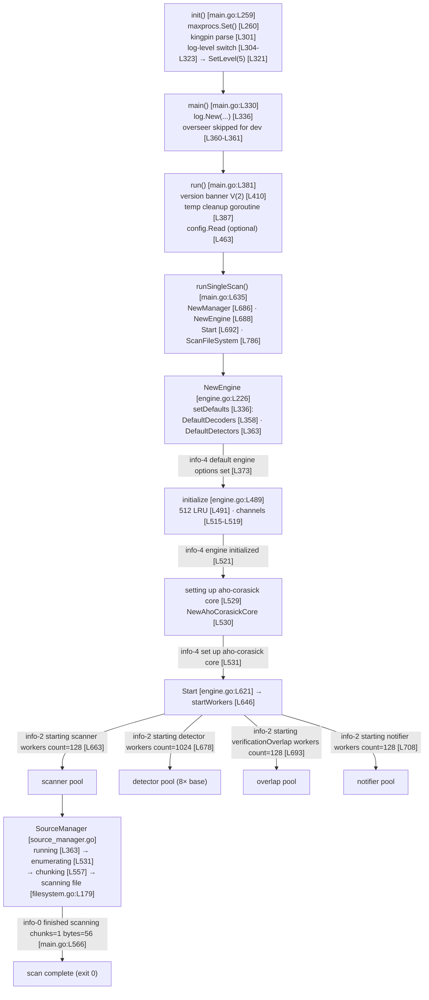

# How TruffleHog Comes Online at Startup — A Runtime, Evidence‑Grounded Explanation

> **What this document is.** A runtime explanation of how TruffleHog — the Go
> secrets / Non‑Human‑Identity (NHI) scanner in this repository — *comes online*
> when you start it: how **(a)** configuration is handled, **(b)** the scanning
> engine initializes, **(c)** detectors prepare themselves, and **(d)** the
> components communicate during a basic run.
>
> **How it was produced.** By **building and running** the tool and reading its
> **observed output** — not by reading source in isolation. Every behavioral
> claim below is paired with the *specific verbatim log line* that demonstrates
> it, the exact `file:line` that emits it, and the rationale. Where a value is
> host‑ or run‑specific (worker counts, byte totals, durations, random worker
> IDs), it is reported **exactly as observed on this host**, never normalized.
>
> **What this document is not.** It is deliberately **not** a file‑by‑file
> catalog of the codebase. Source citations exist to *ground* observed behavior,
> not to enumerate the tree.

---

## Section 1 — Introduction & Build/Run Setup

### 1.1 Objective

Explain, from observation, the startup/initialization path of the `trufflehog`
CLI. The entry point is `main.go` and the scan‑orchestration core is
`pkg/engine/engine.go`. The four questions answered are (a) configuration,
(b) engine initialization, (c) detector preparation, and (d) component
communication.

### 1.2 The "simple dry‑run command" — interpretation (stated explicitly)

TruffleHog exposes **no literal `--dry-run` flag**. The safe / "dry" run used
here is a **minimal `filesystem` scan** with:

- **`--no-verification`** — disables live credential verification, so **no
  external verification API calls / no network egress** occur. Flag declared at
  `main.go:L59`:
  ```go
  noVerification      = cli.Flag("no-verification", "Don't verify the results.").Bool()
  ```
- **`--no-update`** — suppresses self‑update. (The self‑update overseer is also
  already disabled for `dev` builds; see §1.3.)
- a **tiny, secret‑free directory *outside* the repository** as the target, so
  the run is deterministic and cannot find or verify anything.

This is the most faithful mapping of the user's phrase "a simple dry‑run
command" onto a real TruffleHog invocation.

### 1.3 Build recipe (observed)

The build matches the project's `Dockerfile` recipe — `ENV CGO_ENABLED=0`
(`Dockerfile:L5`) and `go build -o trufflehog .` (`Dockerfile:L9`) — and the
toolchain pinned in `go.mod` (`go 1.23.1` at `go.mod:L3`, `toolchain go1.24.2`
at `go.mod:L5`). The binary was built **outside** the repository tree so the
working tree stays clean (the binary named `trufflehog` is git‑ignored via
`.gitignore`):

```bash
export PATH=$PATH:/usr/local/go/bin
CGO_ENABLED=0 go build -o /tmp/trufflehog_bin .
```

Observed toolchain and result:

```text
$ go version
go version go1.24.2 linux/amd64

$ /tmp/trufflehog_bin --version
trufflehog dev
```

**Claim:** the build reports version `dev`, which **disables the self‑update
overseer**. **Evidence + citation:** `main.go:L360-L361`:
```go
if version.BuildVersion == "dev" {
    updateCfg.Fetcher = nil
```
**Rationale:** a `dev` build nils the update fetcher, so no self‑update code path
runs; combined with `--no-update`, the run performs no update activity.

### 1.4 The safe / "dry" run (observed)

```bash
mkdir -p /tmp/th_probe
printf 'hello world\nthis is a plain text sample with no secrets\n' > /tmp/th_probe/sample.txt
/tmp/trufflehog_bin filesystem /tmp/th_probe --log-level=5 --no-verification --no-update
```

`--log-level=5` (trace) is what makes the initialization lines observable:
messages emitted at V(4)/V(3)/V(2)/V(0) all print at level 5 (see §1.6). The
probe file is **56 bytes** (`wc -c` → `56 /tmp/th_probe/sample.txt`) and contains
no secrets.

### 1.5 Host & run facts (observed on THIS host — reported exactly)

| Fact | Observed value on this host |
|------|------------------------------|
| Exit code | `0` |
| `nproc` (cgroup/affinity view) | **4** |
| `runtime.NumCPU()` | **128** |
| `runtime.GOMAXPROCS(0)` | **128** |
| Probe file size | **56 bytes** |
| Total log lines captured | **163** |
| scanner / verificationOverlap / notifier workers | **128** each |
| detector workers | **1024** (= 128 × 8) |
| `"finished scanning chunks"` lines | **128** (128 distinct `scanner_worker_id`) |
| `scan_duration` (this run) | **`"5.88645ms"`** |
| `source_manager_worker_id` (this run) | **`"cLHmR"`** |

> **Important host nuance (reported exactly, not normalized).** `nproc` reports
> **4** on this host, yet TruffleHog started **128** scanner workers. This is not
> a contradiction: the worker counts follow **`runtime.NumCPU()`**, which was
> directly observed to be **128** here (`GOMAXPROCS` likewise 128), whereas the
> `nproc` shell utility reports the cgroup/CPU‑affinity‑restricted view (4). The
> exact mechanism is traced in Section 5. Because the concurrency default is
> `runtime.NumCPU()`, this run's counts (128/1024/128/128) happen to match a
> 128‑CPU host even though `nproc` here is 4. **On a host where
> `runtime.NumCPU()` differs, these counts will differ and must be read from the
> logs, not assumed.**

Directly observed CPU facts (from a tiny throwaway program run outside the repo):
```text
runtime.NumCPU()=128
runtime.GOMAXPROCS(0)=128
nproc=4
```

### 1.6 Reading the logs: the `info-N` token and the V‑level convention

The console sink writes an RFC3339 UTC timestamp followed by **TAB‑separated**
fields: `<timestamp>\t<info-N>\t<service>\t<message>[\t<json-fields>]`. One
untrimmed line, exactly as captured:

```text
2026-07-01T22:05:23Z	info-2	trufflehog	trufflehog dev
```

- The timestamp is RFC3339 — grounded at `pkg/log/log.go:L117`:
  ```go
  conf.EncodeTime = zapcore.TimeEncoderOfLayout(time.RFC3339)
  ```
- The `info-N` token is **not a level name**. It is computed at
  `pkg/log/log.go:L123`:
  ```go
  enc.AppendString(fmt.Sprintf("info-%d", -int8(level)))
  ```
  Zap encodes logr verbosity `V(k)` as the negative zap level `-k`, so
  `-int8(level)` recovers **`k`, the V‑level of the emitting call**. Thus
  `info-4` = `V(4)`, `info-2` = `V(2)`, `info-0` = `V(0)`. The error level is the
  sole special case, rendered as the literal `"error"` (`pkg/log/log.go:L120-121`).

- **Why `--log-level=5` surfaces the init lines.** By the `go-logr` convention, a
  message prints only when its V‑level is **≤** the configured verbosity level;
  higher V‑levels denote *less important / more verbose* logs. This is exactly
  the scale the project documents in `CONTRIBUTING.md:L30-L37` (`0` = "logs we
  always want to see" … `5` = "ultimate verbosity"). Setting level 5 therefore
  lets the `V(4)` engine‑init lines and `V(2)` worker‑start lines through.

- **How level 5 was wired for this exact command.** `--log-level=5` is parsed and
  applied by the switch at `main.go:L304-L323`; because neither `--trace` nor
  `--debug` was passed, it takes the `default` branch and calls
  `log.SetLevel(5)` at `main.go:L321`:
  ```go
  } else {
      log.SetLevel(l)   // l == 5 for --log-level=5
  }
  ```
  (The hidden `--trace` flag reaches the same level via `case *trace:` →
  `log.SetLevel(5)` at `main.go:L305-L306`.)

### 1.7 Startup flow — code‑to‑log map



### 1.8 The captured startup log (verbatim; timestamps trimmed, repeats collapsed)

The full capture is **163 lines**. Below, the leading `2026-07-01T22:05:23Z\t`
timestamp prefix is **trimmed for readability** (stated here explicitly), and the
two large repeated groups are **collapsed with their exact counts** — every other
line is reproduced exactly as captured:

```text
info-2  trufflehog  trufflehog dev
🐷🔑🐷  TruffleHog. Unearth your secrets. 🐷🔑🐷
                                            (1 blank line — from the banner's trailing "\n\n")
info-4  trufflehog  default engine options set
info-4  trufflehog  Deleted orphaned temp artifact  {"artifact": "/tmp/trufflehog-135951-3805937651"}   (×17 total, interleaved; see §5.5)
info-4  trufflehog  engine initialized
info-4  trufflehog  setting up aho-corasick core
info-4  trufflehog  set up aho-corasick core
info-2  trufflehog  starting scanner workers  {"count": 128}
info-2  trufflehog  starting detector workers  {"count": 1024}
info-2  trufflehog  starting verificationOverlap workers  {"count": 128}
info-2  trufflehog  starting notifier workers  {"count": 128}
info-0  trufflehog  running source  {"source_manager_worker_id": "cLHmR", "with_units": true}
info-2  trufflehog  enumerating source  {"source_manager_worker_id": "cLHmR"}
info-3  trufflehog  chunking unit  {"source_manager_worker_id": "cLHmR", "unit_kind": "unit", "unit": "/tmp/th_probe/sample.txt"}
info-3  trufflehog  scanning file  {"source_manager_worker_id": "cLHmR", "unit_kind": "unit", "unit": "/tmp/th_probe/sample.txt", "path": "/tmp/th_probe/sample.txt"}
info-5  trufflehog  dataErrChan closed, all chunks processed  {"source_manager_worker_id": "cLHmR", "unit_kind": "unit", "unit": "/tmp/th_probe/sample.txt", "path": "/tmp/th_probe/sample.txt", "mime": "text/plain; charset=utf-8", "timeout": 60}
info-4  trufflehog  finished scanning chunks  {"scanner_worker_id": "v9dWT"}   (×128 — exactly one per scanner worker; IDs are random 5-char, e.g. "v9dWT", "18loG", "uRYhz", …)
error   trufflehog  error cleaning temp artifacts  {"error": "error deleting temp artifact (dir: false) /tmp/trufflehog-135951-3252364618: remove /tmp/trufflehog-135951-3252364618: no such file or directory"}
info-0  trufflehog  finished scanning  {"chunks": 1, "bytes": 56, "verified_secrets": 0, "unverified_secrets": 0, "scan_duration": "5.88645ms", "trufflehog_version": "dev", "verification_caching": {"Hits":0,"Misses":0,"HitsWasted":0,"AttemptsSaved":0,"VerificationTimeSpentMS":0}}
```

**Exact 163‑line reconciliation (this host):**
`128` (`finished scanning chunks`, one per scanner worker) `+ 17`
(`Deleted orphaned temp artifact`) `+ 1` (`error cleaning temp artifacts`) `+ 4`
(the four `starting … workers` lines) `+ 1` (blank line after the banner) `+ 12`
unique core lines (`trufflehog dev`; banner; `default engine options set`;
`engine initialized`; `setting up aho-corasick core`; `set up aho-corasick core`;
`running source`; `enumerating source`; `chunking unit`; `scanning file`;
`dataErrChan closed…`; `finished scanning`) **= 163**.

---

## Section 2 — (a) How configuration is handled

TruffleHog's configuration is **layered**: **CLI flags (kingpin)** →
**optional YAML config (`--config`)** → **engine‑side defaults**. This run
supplied only flags, so behavior comes from flag values + engine defaults.

### 2.1 CLI framework and flag/command declarations — `kingpin`

Configuration is parsed by **`github.com/alecthomas/kingpin/v2`** (not cobra).
Flags and commands are declared at package scope in `main.go`. The flags
relevant to this run, by name and exact line:

- `--log-level` — `main.go:L50`:
  ```go
  logLevel            = cli.Flag("log-level", `Logging verbosity on a scale of 0 (info) to 5 (trace). Can be disabled with "-1".`).Default("0").Int()
  ```
- `--debug` (hidden) — `main.go:L51`; `--trace` (hidden) — `main.go:L52`.
- `--concurrency` — `main.go:L58`, whose **default is `runtime.NumCPU()`**
  (central to Section 5):
  ```go
  concurrency         = cli.Flag("concurrency", "Number of concurrent workers.").Default(strconv.Itoa(runtime.NumCPU())).Int()
  ```
- `--no-verification` — `main.go:L59` (see §1.2).

**Claim:** the CLI actually parsed and logging initialized before any engine
work. **Evidence (verbatim):**
```text
info-2  trufflehog  trufflehog dev
```
**Citation:** emitted by the version banner `logger.V(2).Info(fmt.Sprintf("trufflehog %s", version.BuildVersion))` at `main.go:L410`. **Rationale:** this `V(2)`
line prints only after `log.New(...)` built the logger (`main.go:L336`) and the
level was set from the parsed flags — so its appearance is proof the
flag‑parsing + logging‑configuration stage completed.

### 2.2 Parsing and process‑level configuration

- **Container‑aware `GOMAXPROCS`** is set first, inside `func init()`
  (`main.go:L259`) via `maxprocs.Set()` (`main.go:L260`):
  ```go
  _, _ = maxprocs.Set()
  ```
- **Command/flag parsing** happens at `main.go:L301`:
  ```go
  cmd = kingpin.MustParse(cli.Parse(os.Args[1:]))
  ```
- **Verbosity wiring** is the switch at `main.go:L304-L323` (for this command,
  `default` branch → `log.SetLevel(5)` at `main.go:L321`; see §1.6).
- **Logger construction** at `main.go:L336`:
  ```go
  logger, sync := log.New("trufflehog", logFormat(os.Stderr, log.WithGlobalRedaction()))
  ```
  (`log.New` is defined at `pkg/log/log.go:L28`; it composes zap + logr, with
  console vs. JSON sinks at `WithConsoleSink` `pkg/log/log.go:L105` and
  `WithJSONSink` `pkg/log/log.go:L95`.)

### 2.3 Optional YAML configuration (`--config`) — described, not exercised

If `--config <file>` is supplied, `run()` loads it via
`config.Read(*configFilename)` at `main.go:L463`, which calls
`config.Read` (`pkg/config/config.go:L18`) → `config.NewYAML` (`pkg/config/config.go:L27`).
**This run did not pass `--config`, so this path was not exercised** — there is
no config‑load log line in the capture. It is documented here because it is part
of "how configuration is handled," but per the evidence rule it is explicitly
marked as *not observed in this run*.

### 2.4 Engine‑side defaulting — the observed configuration signal

With no YAML config, the engine falls back to its own defaults in
`setDefaults` (`pkg/engine/engine.go:L336`).

**Claim:** the engine applied its default options. **Evidence (verbatim):**
```text
info-4  trufflehog  default engine options set
```
**Citation:** `ctx.Logger().V(4).Info("default engine options set")` at
`pkg/engine/engine.go:L373`. **Rationale:** the message text "default engine
options set" is exactly the signal that the configuration for the engine was
resolved from **defaults** (not from a supplied config), which matches a
flags‑only invocation with no `--config`. This line is `info-4` (i.e. `V(4)`),
which is why it only appears at high verbosity.

---

## Section 3 — (b) How the scanning engine initializes

The engine is constructed and initialized before any workers start. The chain is
`engine.NewEngine → setDefaults → initialize`.

### 3.1 Construction: `NewEngine → setDefaults`

- `engine.NewEngine(ctx, &cfg)` is invoked from `runSingleScan` at
  `main.go:L688`; its definition is `pkg/engine/engine.go:L226`.
- `NewEngine` calls `setDefaults` (`pkg/engine/engine.go:L336`), which — for a
  flags‑only run — loads the default decoders and detectors and fixes the worker
  multipliers:
  - `e.decoders = decoders.DefaultDecoders()` — `pkg/engine/engine.go:L358`
  - `e.detectors = defaults.DefaultDetectors()` — `pkg/engine/engine.go:L363`
  - `e.detectorWorkerMultiplier = 8` — `pkg/engine/engine.go:L345`
  - `e.notificationWorkerMultiplier = 1` — `pkg/engine/engine.go:L349`
  - `e.verificationOverlapWorkerMultiplier = 1` — `pkg/engine/engine.go:L353`

(The `default engine options set` line quoted in §2.4, emitted at
`pkg/engine/engine.go:L373`, marks the end of `setDefaults`.)

### 3.2 Initialization: `initialize` allocates in‑memory structures

`setDefaults` is followed by `initialize` (`pkg/engine/engine.go:L489`). TruffleHog
is **stateless — there is no database**; "initialization" means allocating
in‑memory structures and wiring channels:

- a **512‑entry LRU dedupe cache** — `pkg/engine/engine.go:L491`:
  ```go
  const cacheSize = 512 // number of entries in the LRU cache
  ```
  installed at `e.dedupeCache = cache` (`pkg/engine/engine.go:L520`);
- the **buffered pipeline channels** at `pkg/engine/engine.go:L515-L519`
  (`detectableChunksChan`, `verificationOverlapChunksChan`, `results`), sized off
  `defaultChannelBuffer = runtime.NumCPU()` (`pkg/engine/engine.go:L627`) — see
  Section 5 for exact multipliers.

**Claim:** engine initialization completed. **Evidence (verbatim):**
```text
info-4  trufflehog  engine initialized
```
**Citation:** `ctx.Logger().V(4).Info("engine initialized")` at
`pkg/engine/engine.go:L521`. **Rationale:** this single `V(4)` line is emitted at
the *end* of `initialize()`, immediately after the LRU cache and channels are
allocated — so its appearance is the observable marker that the engine's
in‑memory scaffolding is fully built and ready for the detector‑prep and
worker‑startup stages that follow.

---

## Section 4 — (c) How detectors prepare themselves

Detectors do **not** "connect" to anything at startup. Preparation is: register
the built‑in detector set, load the decoder chain, then compile the detectors'
keywords into an **Aho‑Corasick keyword‑trie prefilter** used to route each chunk
to only the detectors whose keywords appear in it.

### 4.1 The built‑in detector registry — `DefaultDetectors()`

The registry is loaded by `defaults.DefaultDetectors()`, defined at
`pkg/engine/defaults/defaults.go:L1704` and invoked from `setDefaults` at
`pkg/engine/engine.go:L363`. This is the complete built‑in detector set the
engine will consider.

### 4.2 The decoder chain — `DefaultDecoders()`

The decoder chain is loaded by `decoders.DefaultDecoders()`
(`pkg/decoders/decoders.go:L8`), invoked at `pkg/engine/engine.go:L358`. Its
**order is fixed and significant** — UTF8 must be first for duplicate detection
(`pkg/decoders/decoders.go:L10-L14`):
```go
func DefaultDecoders() []Decoder {
    return []Decoder{
        // UTF8 must be first for duplicate detection
        &UTF8{},          // pkg/decoders/decoders.go:L11
        &Base64{},        // pkg/decoders/decoders.go:L12
        &UTF16{},         // pkg/decoders/decoders.go:L13
        &EscapedUnicode{},// pkg/decoders/decoders.go:L14
    }
}
```
i.e. the chain is **UTF8 → Base64 → UTF16 → EscapedUnicode**. Rationale: each
chunk is re‑interpreted through these decoders so detectors can match secrets
that are Base64/UTF‑16/escaped‑unicode‑encoded, with UTF8 first so duplicates are
detected against the canonical form.

### 4.3 The Aho‑Corasick keyword‑trie prefilter — `NewAhoCorasickCore`

The detectors' keywords are compiled into a single trie by
`ahocorasick.NewAhoCorasickCore(e.detectors, ahoCOptions...)`
(`pkg/engine/engine.go:L530`); the constructor is defined at
`pkg/engine/ahocorasick/ahocorasickcore.go:L141`.

**Claim:** the Aho‑Corasick core is built at startup, bracketed by two log lines.
**Evidence (verbatim — both lines):**
```text
info-4  trufflehog  setting up aho-corasick core
info-4  trufflehog  set up aho-corasick core
```
**Citations:** the opening line is `ctx.Logger().V(4).Info("setting up aho-corasick core")` at `pkg/engine/engine.go:L529`; the closing line is
`ctx.Logger().V(4).Info("set up aho-corasick core")` at
`pkg/engine/engine.go:L531`. The `NewAhoCorasickCore(...)` call sits **between**
them at `pkg/engine/engine.go:L530`. **Rationale:** the paired "setting up" /
"set up" `V(4)` lines directly bracket the constructor, so observing both proves
the keyword‑trie prefilter was built during startup. This prefilter is what lets
the engine, per chunk, execute *only* the detectors whose keywords are present —
rather than every detector — which is the core of how detectors "prepare" to run
efficiently.

> **Not observed in this run:** because the probe text contains no detector
> keywords, no detector matched and no per‑detector execution line appears — the
> summary reports `"verified_secrets": 0, "unverified_secrets": 0` (§5.4). That
> is the expected, correct outcome of scanning a secret‑free file.


---

## Section 5 — (d) How the components communicate during a basic run

TruffleHog's runtime is a set of **decoupled producer/consumer goroutine pools**
connected by **buffered Go channels**. A **source manager** decomposes the target
into *source → unit → chunk*, and those chunks flow scanner → detector →
verificationOverlap → notifier. The topology is corroborated by the repository's
own `docs/concurrency.md` (which names `ScannerWorkers`,
`VerificationOverlapWorkers`, `DetectorWorkers`, `NotifierWorkers` and the
channels `e.ChunksChan()`, `e.detectableChunksChan`,
`e.verificationOverlapChunksChan`) and `docs/process_flow.md` (Source
Decomposition → Detector Matching → Secret Detection → Result Notification).
Below, each claim is grounded in an **observed line** from this run.

### 5.1 The four worker pools (started in `startWorkers`)

`Start` (`pkg/engine/engine.go:L621`) calls `startWorkers`
(`pkg/engine/engine.go:L646`), which launches four pools. **Evidence (verbatim,
this host — reported exactly):**
```text
info-2  trufflehog  starting scanner workers  {"count": 128}
info-2  trufflehog  starting detector workers  {"count": 1024}
info-2  trufflehog  starting verificationOverlap workers  {"count": 128}
info-2  trufflehog  starting notifier workers  {"count": 128}
```
**Citations (each is the `V(2)` line that emits the corresponding count):**

| Pool | Observed count | Count expression | Emitting line |
|------|----------------|------------------|---------------|
| scanner | `128` | `e.concurrency` | `pkg/engine/engine.go:L663` |
| detector | `1024` | `e.concurrency * e.detectorWorkerMultiplier` (`L676`) | `pkg/engine/engine.go:L678` |
| verificationOverlap | `128` | `e.concurrency * e.verificationOverlapWorkerMultiplier` (`L691`) | `pkg/engine/engine.go:L693` |
| notifier | `128` | `e.notificationWorkerMultiplier * e.concurrency` (`L706`) | `pkg/engine/engine.go:L708` |

**Rationale for the observed magnitude (reported exactly, not normalized).** The
scanner/overlap/notifier pools each equal **`e.concurrency`**, and the detector
pool equals `e.concurrency × 8` because `e.detectorWorkerMultiplier = 8`
(`pkg/engine/engine.go:L345`) — hence `1024 = 128 × 8`. `e.concurrency` here is
**128**, which is the value of the `--concurrency` flag; that flag **defaults to
`runtime.NumCPU()`** at `main.go:L58` and is passed through as
`Concurrency: *concurrency` (`main.go:L514`) → `concurrency: cfg.Concurrency`
(`pkg/engine/engine.go:L230`).

This is why the counts are **128, not `nproc`'s 4**: `runtime.NumCPU()` on this
host is **128** (directly observed; §1.5). The engine's *fallback* to
`runtime.NumCPU()` at `pkg/engine/engine.go:L337-L340` (which would also emit a
`"No concurrency specified, defaulting to max"` line) **did not fire** — that log
line is **absent** from the 163‑line capture, confirming `e.concurrency` came
from the flag default rather than the fallback. **On a host with a different
`runtime.NumCPU()` these counts will differ and must be read from the logs.**

### 5.2 The buffered channels that connect the stages

The pools communicate over buffered channels allocated in `initialize`
(`pkg/engine/engine.go:L515-L519`), each sized as a multiple of
`defaultChannelBuffer = runtime.NumCPU()` (`pkg/engine/engine.go:L627`):

- `e.detectableChunksChan` — buffer `defaultChannelBuffer × 50`
  (`detectableChunksChanMultiplier = 50`, `pkg/engine/engine.go:L503`), allocated
  at `pkg/engine/engine.go:L515`;
- `e.verificationOverlapChunksChan` — buffer `defaultChannelBuffer × 25`
  (`verificationOverlapChunksChanMultiplier = 25`, `pkg/engine/engine.go:L507`),
  allocated at `pkg/engine/engine.go:L516-L518`;
- `e.results` — buffer `defaultChannelBuffer × 50`
  (`resultsChanMultiplier = detectableChunksChanMultiplier`,
  `pkg/engine/engine.go:L508`), allocated at `pkg/engine/engine.go:L519`;
- plus the source→scanner chunk channel exposed as `e.ChunksChan()` (named in
  `docs/concurrency.md`).

**Rationale:** buffering decouples producers from consumers so a burst of chunks
does not block the scanner while detectors are busy; sizing off
`runtime.NumCPU()` scales the buffers with the worker‑pool sizes.

### 5.3 The source‑manager pipeline: source → unit → chunk (observed order)

The source manager (`sources.NewManager`, `pkg/sources/source_manager.go:L107`,
built at `main.go:L686`) decomposes the filesystem target. For a `filesystem`
scan, source units are supported, so `run` (`pkg/sources/source_manager.go:L336`)
takes the *with‑units* branch. The observed lifecycle, **each line verbatim with
its emitting site**:

1. **running source** — `info-0`:
   ```text
   info-0  trufflehog  running source  {"source_manager_worker_id": "cLHmR", "with_units": true}
   ```
   Emitted at `pkg/sources/source_manager.go:L363-L364` (the `runWithUnits`
   branch of `run`). `with_units: true` confirms the units pipeline. This is a
   `V(0)` line ("always shown").

2. **enumerating source** — `info-2`:
   ```text
   info-2  trufflehog  enumerating source  {"source_manager_worker_id": "cLHmR"}
   ```
   Emitted at `pkg/sources/source_manager.go:L531` (inside `runWithUnits`).
   (The similarly‑named `enumerate` function definition at
   `pkg/sources/source_manager.go:L375` is a *different*, enumerate‑only entry
   point that this scan does not use.)

3. **chunking unit** — `info-3`:
   ```text
   info-3  trufflehog  chunking unit  {"source_manager_worker_id": "cLHmR", "unit_kind": "unit", "unit": "/tmp/th_probe/sample.txt"}
   ```
   Emitted at `pkg/sources/source_manager.go:L557`. The single unit is our probe
   file, named exactly.

4. **scanning file** — `info-3`:
   ```text
   info-3  trufflehog  scanning file  {"source_manager_worker_id": "cLHmR", "unit_kind": "unit", "unit": "/tmp/th_probe/sample.txt", "path": "/tmp/th_probe/sample.txt"}
   ```
   Emitted at `pkg/sources/filesystem/filesystem.go:L179` (a filesystem‑source
   line, not the source manager).

5. **dataErrChan closed, all chunks processed** — `info-5` (the highest
   verbosity; only visible at level 5):
   ```text
   info-5  trufflehog  dataErrChan closed, all chunks processed  {"source_manager_worker_id": "cLHmR", "unit_kind": "unit", "unit": "/tmp/th_probe/sample.txt", "path": "/tmp/th_probe/sample.txt", "mime": "text/plain; charset=utf-8", "timeout": 60}
   ```
   Emitted at `pkg/handlers/handlers.go:L413`. Note the observed `"mime":
   "text/plain; charset=utf-8"` and `"timeout": 60` — reported exactly.

**Rationale:** these lines trace one target being decomposed into one *unit*
(the file) and one *chunk*, flowing from the source manager into the scanner
pool — the concrete instance of the source→unit→chunk decomposition.

### 5.4 Scanner drain and the final summary (observed magnitude)

**Claim:** each scanner worker logs completion exactly once as the pipeline
drains. **Evidence (verbatim, one representative of many):**
```text
info-4  trufflehog  finished scanning chunks  {"scanner_worker_id": "v9dWT"}
```
**Citation:** `ctx.Logger().V(4).Info("finished scanning chunks")` at
`pkg/engine/engine.go:L840` (inside `scannerWorker`, defined at
`pkg/engine/engine.go:L777`). **Observed magnitude (reported exactly):** this line
appears **128 times**, carrying **128 distinct** `scanner_worker_id` values —
i.e. **exactly one per scanner worker** (matching the `count: 128` from §5.1).
The IDs are random 5‑character strings (`common.RandomID(5)`), e.g. `"v9dWT"`,
`"18loG"`, `"uRYhz"` — run‑specific, reported as observed.

**Claim:** the run then prints a single completion summary. **Evidence
(verbatim, this run):**
```text
info-0  trufflehog  finished scanning  {"chunks": 1, "bytes": 56, "verified_secrets": 0, "unverified_secrets": 0, "scan_duration": "5.88645ms", "trufflehog_version": "dev", "verification_caching": {"Hits":0,"Misses":0,"HitsWasted":0,"AttemptsSaved":0,"VerificationTimeSpentMS":0}}
```
**Citation:** `logger.Info("finished scanning", ...)` at `main.go:L566`, with
fields `"chunks"` (`main.go:L567`), `"bytes"` (`main.go:L568`), `"scan_duration"`
(`main.go:L571`), `"trufflehog_version"` (`main.go:L572`). **Rationale:** the
notifier stage aggregates results and this `V(0)` summary is the terminal signal
of the pipeline: `chunks: 1` (the one chunk from our one file), `bytes: 56` (the
probe's exact size), `verified_secrets: 0` / `unverified_secrets: 0` (a
secret‑free target scanned with `--no-verification`), and `scan_duration:
"5.88645ms"` for this particular run. The process then exits `0`.

### 5.5 Also observed at startup (reported exactly, even though incidental)

At level 5 the capture also contained startup **temp‑artifact cleanup** activity —
part of "coming online," so reported honestly:

- **17×** `Deleted orphaned temp artifact` — `info-4`:
  ```text
  info-4  trufflehog  Deleted orphaned temp artifact  {"artifact": "/tmp/trufflehog-135951-3805937651"}
  ```
  Emitted at `pkg/cleantemp/cleantemp.go:L113` (`V(4)`). These delete leftover
  `/tmp/trufflehog-*` files from **prior** TruffleHog runs; the count (17 here) is
  host/run‑specific.

- **1×** an `error`‑level line (note: the token is the literal `"error"`, not
  `info-N`, per `pkg/log/log.go:L120-L121`):
  ```text
  error   trufflehog  error cleaning temp artifacts  {"error": "error deleting temp artifact (dir: false) /tmp/trufflehog-135951-3252364618: remove /tmp/trufflehog-135951-3252364618: no such file or directory"}
  ```
  Emitted at `main.go:L697` (`ctx.Logger().Error(err, "error cleaning temp
  artifacts")`). **Cause (rationale):** `cleantemp.CleanTempArtifacts`
  (`pkg/cleantemp/cleantemp.go:L47`) runs both from a startup goroutine
  (`main.go:L387`) and a deferred cleanup in `runSingleScan` (`main.go:L696`);
  they can race and one removes a temp file the other already deleted, yielding
  `no such file or directory`. **This is benign — the process still exited `0`.**
  Reported here because the methodology requires reporting exactly what is
  observed, including the unexpected.

---

## Section 6 — Coverage‑pass checklist

Every named item, confirmed with where it is addressed:

- [x] **(a) configuration handling** — §2; verbatim `default engine options set`
  + `pkg/engine/engine.go:L373` + rationale (layered flags→YAML→defaults).
- [x] **(b) engine initialization** — §3; verbatim `engine initialized`
  + `pkg/engine/engine.go:L521` + rationale (stateless; LRU + channels).
- [x] **(c) detector preparation** — §4; verbatim `setting up aho-corasick core`
  / `set up aho-corasick core` + `pkg/engine/engine.go:L529` & `L531` + rationale.
- [x] **(d) component communication** — §5; verbatim four `starting … workers`
  lines + lifecycle lines + `finished scanning` + citations + rationale.
- [x] **kingpin CLI + flags** — §2.1: `--log-level` (`main.go:L50`), `--debug`
  (`L51`), `--trace` (`L52`), `--concurrency` (`L58`), `--no-verification` (`L59`);
  parse at `kingpin.MustParse` (`main.go:L301`).
- [x] **`--no-verification` + `--no-update` "dry‑run" interpretation** — §1.2.
- [x] **`config.Read` / YAML** (`pkg/config/config.go:L18`, `NewYAML` `L27`,
  invoked `main.go:L463`) — §2.3, explicitly marked **not exercised** this run.
- [x] **`maxprocs.Set()`** container‑aware `GOMAXPROCS` (`main.go:L260`) — §2.2.
- [x] **`log.New`** logger construction (`main.go:L336`; `pkg/log/log.go:L28`) — §2.2.
- [x] **`setDefaults`** (`pkg/engine/engine.go:L336`) + `default engine options set`
  (`L373`) — §2.4 / §3.1.
- [x] **`DefaultDetectors`** (`pkg/engine/defaults/defaults.go:L1704`) — §4.1.
- [x] **`DefaultDecoders`** chain **UTF8 → Base64 → UTF16 → EscapedUnicode**
  (`pkg/decoders/decoders.go:L8`, `L11-L14`) — §4.2.
- [x] **Aho‑Corasick** `NewAhoCorasickCore` (`pkg/engine/ahocorasick/ahocorasickcore.go:L141`;
  bracketed by `engine.go:L529`/`L531`, call at `L530`) — §4.3.
- [x] **512‑entry LRU dedupe cache** (`pkg/engine/engine.go:L491`) — §3.2.
- [x] **buffered channels** (`pkg/engine/engine.go:L515-L519`, sized off
  `defaultChannelBuffer` `L627`) — §5.2.
- [x] **four worker pools** (scanner/detector/verificationOverlap/notifier at
  `engine.go:L663`/`L678`/`L693`/`L708`) with observed counts **128/1024/128/128**
  and host `runtime.NumCPU()`=**128** (`nproc`=4) — §5.1.
- [x] **source → unit → chunk** (`source_manager.go` `run` `L336`, `running source`
  `L363`, `enumerating source` `L531`, `chunking unit` `L557`) — §5.3.
- [x] **`info-N` token meaning** (`pkg/log/log.go:L123`) + **V‑level convention**
  (`CONTRIBUTING.md:L30-L37`) — §1.6.
- [x] **host CPU count, `bytes`, `scan_duration`, worker IDs reported exactly** —
  §1.5, §5.1, §5.4 (`nproc`=4, `runtime.NumCPU()`=128, `bytes`=56,
  `scan_duration`=`"5.88645ms"`, `source_manager_worker_id`=`"cLHmR"`,
  `scanner_worker_id` e.g. `"v9dWT"`).
- [x] **unexpected output reported honestly** — §5.5 (17× temp‑artifact deletes;
  1× benign `error cleaning temp artifacts`).
- [x] **read‑only honored + scratch artifacts removed** — see Appendix.

---

## Appendix — Reproducibility, safety, and read‑only cleanup

**Reproduce on your host** (values in this document are from a run where
`runtime.NumCPU()` = 128, `nproc` = 4):
```bash
export PATH=$PATH:/usr/local/go/bin
CGO_ENABLED=0 go build -o /tmp/trufflehog_bin .          # build outside the repo tree
mkdir -p /tmp/th_probe
printf 'hello world\nthis is a plain text sample with no secrets\n' > /tmp/th_probe/sample.txt
/tmp/trufflehog_bin filesystem /tmp/th_probe --log-level=5 --no-verification --no-update
```
Worker counts scale with `runtime.NumCPU()`; `bytes`, `scan_duration`, the
`Deleted orphaned temp artifact` count, and the random 5‑char worker IDs are
run‑specific — **read them from your own logs**.

**Safety.** The target is secret‑free and local; `--no-verification` performs no
external verification and no network egress; the `dev` build + `--no-update`
suppress self‑update. The run is deterministic and side‑effect‑free apart from
TruffleHog's own `/tmp` temp‑artifact housekeeping (§5.5).

**Read‑only guarantee & cleanup.** No source file was modified; the built binary
and probe live **outside** the repository tree, and all scratch artifacts
(`/tmp/trufflehog_bin`, `/tmp/th_probe`, the captured log, and any observation
scripts) were removed after capture. `git status --porcelain` shows only this new
document (and its new parent directory `blitzy/documentation/`).

