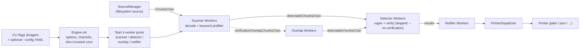

# How TruffleHog Comes Online: Startup & Runtime Behavior During a Basic Scan

> **What this document is.** A first-hand, evidence-grounded explanation of *how the TruffleHog tool actually behaves once the Go binary starts up* during a minimal scan — specifically **how configuration is handled, how the scanning engine initializes, how detectors prepare themselves, and how the components communicate** during a basic run.
>
> **What this document is not.** It is **not** a file-by-file code summary. The narrative follows the tool's *observable runtime behavior* (the logs and signals it emits while running), and every conclusion is reconciled to the **exact emitting source line** that produces it.
>
> **Method (code-as-truth).** Every claim below is supported by (a) an observed runtime signal — a captured log line from a real execution — and/or (b) the exact emitting source location, cited as `file:line`. Nothing is assumed; no external/web sources are used. The binary was built and run in this environment, and each cited line number was checked against the source on disk.

---

## 1. Overview & Scope

TruffleHog is a single Go module — `github.com/trufflesecurity/trufflehog/v3`, which declares `go 1.23.1` with `toolchain go1.24.2` (`go.mod:3-4`). When you launch a basic filesystem scan, a deterministic startup sequence brings the major subsystems online *before* any data is read. This document explains that sequence by interpreting the trace-level logs the tool emits.

The four questions this document answers, each in its own section with rationale and `file:line` citations:

1. **How configuration is handled** — CLI flag parsing, optional YAML config, detector merge, verification toggle, printer selection (Section 4).
2. **How the scanning engine initializes** — option defaults, channel allocation, the Aho-Corasick keyword prefilter, and the `Start()` lifecycle (Section 5).
3. **How detectors prepare themselves** — assembly of the built-in detector set and registration of every detector's keywords into one shared prefilter trie (Section 6).
4. **How the components communicate during a basic run** — the four worker pools and the buffered-channel pipeline that connects source → scanners → detectors → notifier → printer (Section 7).

Sections 8–10 then cover graceful shutdown and dry-run semantics, the logging mechanism that produces the `info-N` prefixes, an end-to-end synthesized narrative with a pipeline diagram, and a per-conclusion rationale plus a log→source reconciliation table.

**Scope of the run that produced the evidence.** A single, minimal, safe **dry-run** (`--no-verification`) over a tiny temporary directory, with **trace** verbosity (`--log-level=5`). This produces the full, deterministic startup signal set with zero risk and minimal noise.

---

## 2. Build & Run Procedure

This section documents exactly how the observable evidence was produced. Building with the project's own declared toolchain ensures the observed behavior reflects the repository's intended runtime.

### 2.1 Toolchain — Go 1.24.2

- **Rationale / source:** `go.mod` declares the language level `go 1.23.1` and the build toolchain `toolchain go1.24.2` (`go.mod:3-4`); the CI workflow independently pins `go-version: "1.24"` (`.github/workflows/test.yml:23`). Building with the documented toolchain is what makes the observed worker counts, channel sizes, and log ordering representative of the real tool rather than an artifact of a different compiler.

### 2.2 Build command

```bash
CGO_ENABLED=0 go build .
```

- **Rationale / source:** this mirrors the repository's own build invocations in the `Makefile` — the `install` target runs `CGO_ENABLED=0 go install .` (`Makefile:18`), and the `run` / `run-debug` targets use `CGO_ENABLED=0 go run .` (`Makefile:49`, `Makefile:52`). `CGO_ENABLED=0` yields a statically linked binary.
- **Observed result:** the build succeeds and the binary reports the version string **`dev`** — visible in the logs as `trufflehog dev` and in the final summary as `trufflehog_version:"dev"`. (Re-confirmation runs in this environment are built and executed entirely under `/tmp`, never inside the repository tree.)

### 2.3 The single safe dry-run command

```bash
trufflehog filesystem <tiny-dir> --no-verification --log-level=5
```

Run against a minimal directory containing a single, harmless **69-byte** `sample.txt` (no secrets).

- **`--no-verification` ⇒ safe.** The engine performs **no** outbound credential-verification calls; nothing leaves the machine. Source: the flag is declared at `main.go:59`, and its effect is `Verify: !*noVerification` in the engine configuration at `main.go:520` — with `--no-verification`, `Verify=false`.
- **`--log-level=5` ⇒ trace.** Maximum observable startup output. Source: `--log-level` is declared at `main.go:50` with default `"0"` on a scale of *0 (info) → 5 (trace)* (and `"-1"` to disable). Trace level surfaces every `info-0` … `info-5` line.
- **Observed result:** **exit code 0**; **stdout is empty** (no secrets found); **all structured logs are written to stderr**.

### 2.4 Concurrency in this environment

`--concurrency` defaults to `runtime.NumCPU()` (`main.go:58`). On the host that produced this evidence, `runtime.NumCPU() = 128`, which is why the observed worker counts are **128 / 1024 / 128 / 128** (Section 7 derives these from the formulas). **Worker counts scale with the host CPU count**, so a reader on a different machine will see different absolute counts but the *same formulas* and the *same relative ratios*.

**Why this procedure is sufficient.** Building with the declared toolchain and running once, with trace logging, over a tiny harmless input yields the complete, deterministic startup signal set: option defaults, channel allocation, prefilter construction, all four worker pools starting, the source enumerating and chunking one unit, every scanner worker draining, and a final summary — with zero risk and almost no noise to obscure the ordering.

---

## 3. The Captured Trace-Log Sequence (primary evidence)

The block below is the first-hand captured startup output from the dry-run. It is the primary evidence the rest of this document interprets. **Timestamps and the random 5-character worker IDs vary per run** (each worker goroutine is assigned a fresh random ID — see Section 7.3), and `scan_duration` is run-specific; the *structure, ordering, verbosity levels, and counts* are deterministic and reproducible.

```text
2026-06-26T20:20:41Z  info-2  trufflehog  trufflehog dev
🐷🔑🐷  TruffleHog. Unearth your secrets. 🐷🔑🐷

2026-06-26T20:20:41Z  info-4  trufflehog  default engine options set
2026-06-26T20:20:41Z  info-4  trufflehog  engine initialized
2026-06-26T20:20:41Z  info-4  trufflehog  setting up aho-corasick core
2026-06-26T20:20:41Z  info-4  trufflehog  set up aho-corasick core
2026-06-26T20:20:41Z  info-2  trufflehog  starting scanner workers              {"count": 128}
2026-06-26T20:20:41Z  info-2  trufflehog  starting detector workers             {"count": 1024}
2026-06-26T20:20:41Z  info-2  trufflehog  starting verificationOverlap workers  {"count": 128}
2026-06-26T20:20:41Z  info-2  trufflehog  starting notifier workers             {"count": 128}
2026-06-26T20:20:41Z  info-0  trufflehog  running source        {"source_manager_worker_id":"CwFJb","with_units":true}
2026-06-26T20:20:41Z  info-2  trufflehog  enumerating source    {"source_manager_worker_id":"CwFJb"}
2026-06-26T20:20:41Z  info-3  trufflehog  chunking unit         {"source_manager_worker_id":"CwFJb","unit_kind":"unit","unit":"/tmp/scan_sample/sample.txt"}
2026-06-26T20:20:41Z  info-3  trufflehog  scanning file         {"source_manager_worker_id":"CwFJb","unit_kind":"unit","unit":"/tmp/scan_sample/sample.txt","path":"/tmp/scan_sample/sample.txt"}
2026-06-26T20:20:41Z  info-5  trufflehog  dataErrChan closed, all chunks processed  {"source_manager_worker_id":"CwFJb","unit_kind":"unit","unit":"/tmp/scan_sample/sample.txt","path":"/tmp/scan_sample/sample.txt","mime":"text/plain; charset=utf-8","timeout":60}
2026-06-26T20:20:41Z  info-4  trufflehog  finished scanning chunks   {"scanner_worker_id":"H0LdR"}
... (emitted 128 times total, one per scanner worker, each with a distinct random 5-char scanner_worker_id) ...
2026-06-26T20:20:41Z  info-0  trufflehog  finished scanning     {"chunks":1,"bytes":69,"verified_secrets":0,"unverified_secrets":0,"scan_duration":"3.33488ms","trufflehog_version":"dev","verification_caching":{"Hits":0,"Misses":0,"HitsWasted":0,"AttemptsSaved":0,"VerificationTimeSpentMS":0}}
```

**Verified facts about this block (used throughout the document):**

- There are exactly **128** `finished scanning chunks` lines — one per scanner worker — and they **all precede** the single final `finished scanning` summary. (Re-confirmed in this environment: counting the lines yields exactly 128.)
- The final summary shows **`bytes:69`** (matching the 69-byte sample), **`chunks:1`**, **`verified_secrets:0`**, **`unverified_secrets:0`**.
- **stdout is empty** in a no-secrets run: all the lines above are emitted on **stderr** (Section 8.4 explains the logging machinery). The empty stdout is consistent with the `PlainPrinter` having nothing to print.

The remaining sections walk top-to-bottom through this sequence, reconciling each signal to the code that emits it.

---

## 4. Configuration Handling — *How configuration is handled* (Question 1)

**Observed signals.** The very first lines — `trufflehog dev` and the 🐷 banner (`info-2`) — appear *before* any engine log. That ordering is the runtime evidence that configuration is resolved up front, before the engine is constructed.

**How it works, reconciled to source.**

### 4.1 CLI parsing via `alecthomas/kingpin/v2`

The command-line surface is defined with the kingpin library: `cli = kingpin.New("TruffleHog", ...)` at **`main.go:47`** (package `github.com/alecthomas/kingpin/v2 v2.4.0`, per `go.mod`). The flags relevant to this run are each declared with `cli.Flag(...)`:

| Flag | Default / type | Source |
|------|----------------|--------|
| `--log-level` | default `"0"`; scale 0 (info) → 5 (trace); `"-1"` disables | `main.go:50` |
| `--concurrency` | default `runtime.NumCPU()` (=128 here) | `main.go:58` |
| `--no-verification` | bool | `main.go:59` |
| `--config` | an existing file | `main.go:70` |
| `--no-verification-cache` | bool | `main.go:85` |

*Rationale:* kingpin parses `os.Args` into typed values, so by the time the engine is built, every option (verbosity, concurrency, verification mode, config path) already has a concrete value.

### 4.2 Optional YAML `--config`

When `--config` is supplied, the file is read and parsed into custom detectors:

- `conf, err = config.Read(*configFilename)` at **`main.go:463`** calls
- `Read(filename)` at **`pkg/config/config.go:18`** (which `os.ReadFile`s the file) →
- `NewYAML(input)` at **`config.go:27`** →
- `protoyaml.UnmarshalStrict(input, &messages)` at **`config.go:30`**, decoding the YAML into a `custom_detectorspb.CustomDetectors` message and building one custom regex detector per entry.

In this dry-run **no `--config` was passed**, so `conf` is the empty default (`conf := &config.Config{}`) and no custom detectors are added. *Rationale:* the absence of a `--config` line in the run is consistent with the engine using only the built-in detector set (Section 6).

### 4.3 Default + custom detector **merge**

The engine is always configured with the full built-in detector list, with any custom detectors appended:

```go
Detectors: append(defaults.DefaultDetectors(), conf.Detectors...),   // main.go:519
```

*Rationale (from the in-code comment at `main.go:515-518`):* "The engine must always be configured with the list of default detectors, which can be further filtered by the user. The filters are applied by the engine and are only **subtractive**." So `--include-detectors` / `--exclude-detectors` never *add* detectors; they only narrow the always-complete built-in set. This is why detector preparation (Section 6) always builds the entire prefilter from the full set.

### 4.4 Verification toggle

```go
Verify: !*noVerification,   // main.go:520
```

With `--no-verification`, `Verify=false`. *Rationale:* this single boolean is what makes the run a safe "dry-run" — detector workers still run their regexes but skip live API verification (Section 8.3).

### 4.5 Printer selection and the banner

The output printer is chosen by a `switch` at **`main.go:486`** (the `var printer engine.Printer` is declared at `main.go:485`):

- `--json-legacy` → `output.LegacyJSONPrinter`
- `--json` → `output.JSONPrinter`
- `--github-actions` → `output.GitHubActionsPrinter`
- **default → `output.PlainPrinter`** (this run)

The chosen printer is wired into the engine as `Dispatcher: engine.NewPrinterDispatcher(printer)` at **`main.go:525`**. The 🐷 banner is printed to `os.Stderr` only when the output is *not* JSON (`main.go:497-499`), which is exactly why it appears immediately after `trufflehog dev` and never pollutes machine-readable JSON output.

**Conclusion for Q1.** Configuration is **fully resolved before the engine is constructed**: kingpin parses the flags, the optional YAML config is merged into the detector list, and the verification mode and printer are selected. The engine therefore receives a complete, static `engine.Config` value — there is no further configuration negotiation once scanning begins.

---

## 5. Scanning-Engine Initialization — *How the engine initializes* (Question 2)

**Observed signals (in order):**

```text
info-4  default engine options set
info-4  engine initialized
info-4  setting up aho-corasick core
info-4  set up aho-corasick core
```

These four `info-4` lines are the engine telling us, step by step, that it has (1) applied option defaults, (2) allocated its communication channels, and (3) built its keyword prefilter — all *before* any worker pool starts.

**How it works, reconciled to source.**

### 5.1 Construction entrypoint

`engine.NewEngine` at **`pkg/engine/engine.go:226`** is the constructor. It calls `setDefaults(ctx)` at **`engine.go:252`** and then `initialize(ctx)` at **`engine.go:323`**.

### 5.2 `setDefaults` → `default engine options set`

`setDefaults` (def at **`engine.go:336`**) fills in any unset option with a default:

- if `concurrency == 0`, set it to `runtime.NumCPU()`;
- **`detectorWorkerMultiplier = 8`**, with the in-code comment *"bound by net i/o so it's higher than other workers"* (**`engine.go:343-345`**);
- **`notificationWorkerMultiplier = 1`** (**`engine.go:348-349`**);
- **`verificationOverlapWorkerMultiplier = 1`** (**`engine.go:352-353`**);
- default decoders if none set (`decoders.DefaultDecoders()`); default detectors if none set (`defaults.DefaultDetectors()`); default dispatcher = `NewPrinterDispatcher(new(output.PlainPrinter))` if nil; and `notifyVerifiedResults / notifyUnverifiedResults / notifyUnknownResults = true`.

It finishes by emitting **`default engine options set`** at `V(4)` (**`engine.go:373`**) — the first `info-4` line. *Rationale:* these multipliers, set here, directly determine the worker-pool sizes observed later (Section 7); the `8×` detector multiplier is the reason detector workers (1024) outnumber scanner workers (128) eight-to-one.

### 5.3 Channel allocation → `engine initialized`

`initialize` allocates the engine's buffered communication channels. The buffer-size multipliers are local constants (**`engine.go:497-508`**):

- `detectableChunksChanMultiplier = 50` (**`engine.go:503`**)
- `verificationOverlapChunksChanMultiplier = 25` (**`engine.go:507`**)
- `resultsChanMultiplier = detectableChunksChanMultiplier` (= 50) (**`engine.go:508`**)

With the package-level `var defaultChannelBuffer = runtime.NumCPU()` (**`engine.go:627`**), the channels are sized as multiples of the CPU count:

- `detectableChunksChan` = `defaultChannelBuffer × 50` (**`engine.go:515`**)
- `verificationOverlapChunksChan` = `defaultChannelBuffer × 25` (**`engine.go:517`**)
- `results` = `defaultChannelBuffer × 50` (**`engine.go:519`**)

It then emits **`engine initialized`** at `V(4)` (**`engine.go:521`**). *Rationale:* the large buffers (e.g. `128 × 50 = 6400` slots for `detectableChunksChan` on this host) provide **back-pressure tolerance** — producers (scanner workers) can run ahead of consumers (detector workers) without blocking, which the in-code comment describes as accommodating workers "producing data at a faster rate than it can be consumed."

### 5.4 Aho-Corasick core → `setting up` / `set up aho-corasick core`

Immediately after, the engine builds the detector keyword prefilter:

```go
ctx.Logger().V(4).Info("setting up aho-corasick core")                       // engine.go:529
e.AhoCorasickCore = ahocorasick.NewAhoCorasickCore(e.detectors, ahoCOptions...) // engine.go:530
ctx.Logger().V(4).Info("set up aho-corasick core")                            // engine.go:531
```

The construction of this core is detector preparation, covered in detail in Section 6.

### 5.5 The `Start()` lifecycle

After construction, `eng.Start(ctx)` (`main.go:692`) runs the engine's `Start` method at **`engine.go:621`**, which:

1. initializes runtime metrics (`scanStartTime`);
2. runs `sanityChecks(ctx)` at **`engine.go:623`** (the function at **`engine.go:632`** warns about duplicate detector configuration); and
3. runs `startWorkers(ctx)` at **`engine.go:624`**, which launches the four worker pools (Section 7).

**Conclusion for Q2.** Engine initialization is **deterministic and entirely pre-source**: option defaults are applied (`default engine options set`), buffered channels are allocated (`engine initialized`), and the keyword prefilter is built (`setting up`/`set up aho-corasick core`) — and only then does `Start()` run sanity checks and launch the worker pools. This exact ordering is directly visible in the four-line `info-4` log sequence, with no source data flowing yet.

---

## 6. Detector Preparation — *How detectors prepare themselves* (Question 3)

**Observed signal.** Detector preparation happens inside the `setting up aho-corasick core` → `set up aho-corasick core` window (the two `info-4` lines from Section 5.4). There is no per-detector log line in a normal run, so the *runtime* evidence is the prefilter-build boundary; the *mechanism* is confirmed against source and measured with an offline probe (below).

### 6.1 The built-in detector set

`defaults.DefaultDetectors()` at **`pkg/engine/defaults/defaults.go:1704`** returns the detector list assembled by `buildDetectorList()` at **`defaults.go:839`** (a large literal slice of `&<pkg>.Scanner{}` values), after which it auto-initializes the `EndpointCustomizer` / `CloudProvider` detectors. As established in Section 4.3, this full set is always handed to the engine (filters are subtractive only).

### 6.2 Measured counts (offline probe, run outside the repository tree)

Because the meaningful numbers are runtime values (a naive line count over `buildDetectorList` would over-count, since some detectors are commented out), they were measured by enumerating `defaults.DefaultDetectors()` and each detector's `Keywords()` in a throwaway program compiled against the same module **outside** the repository tree (no probe code was added to the repository):

| Measurement | Value | How measured |
|-------------|-------|--------------|
| Built-in detectors | **831** | `len(defaults.DefaultDetectors())` |
| Total keywords (across all detectors) | **955** | sum of `len(d.Keywords())` over all detectors |
| Unique lowercased keywords | **914** | size of the set of `strings.ToLower(kw)` |
| Default decoders | **4** | `len(decoders.DefaultDecoders())` |

The **4** default decoders, in order, are **UTF8 → Base64 → UTF16 → EscapedUnicode**, from `decoders.DefaultDecoders()` (`pkg/decoders/decoders.go:8`). The source notes *"UTF8 must be first for duplicate detection"* — UTF8 is required first so duplicate matches across decodings are detected correctly.

> The authoritative count of built-in detectors is the runtime `len(...) = 831`, not a static read of the source slice.

### 6.3 Prefilter construction — `NewAhoCorasickCore`

The keyword prefilter is built by `NewAhoCorasickCore` at **`pkg/engine/ahocorasick/ahocorasickcore.go:141-168`** (using `github.com/BobuSumisu/aho-corasick v1.0.3`):

- it allocates `keywordsToDetectors` (a `map[string][]DetectorKey`) at **`ahocorasickcore.go:142`** and `detectorsByKey` at **`ahocorasickcore.go:143`**;
- for each detector and each entry of its `Keywords()`, it lowercases the keyword via `strings.ToLower(kw)` at **`ahocorasickcore.go:149`** and appends the detector's key to `keywordsToDetectors[kwLower]` at **`ahocorasickcore.go:151`**;
- finally it builds a single trie: `prefilter: *ahocorasick.NewTrieBuilder().AddStrings(keywords).Build()` at **`ahocorasickcore.go:159`**.

### 6.4 Effect & rationale

One shared Aho-Corasick trie maps **lowercased keywords back to detector keys**. During scanning, a chunk is matched against this single trie once; only the detectors whose keyword(s) actually appear in the chunk are then evaluated. This is the **"Keyword Matching (Aho-Corsick)"** stage in `docs/process_flow.md`, and it is what makes running 831 detectors over every chunk tractable — most detectors are skipped per chunk because their keywords are absent.

*Rationale, tied to this run:* the harmless `sample.txt` contains none of the 914 unique keywords, so the prefilter matched nothing, **no detector was evaluated**, and the final summary correctly reports `verified_secrets:0, unverified_secrets:0` (Section 8).

**Conclusion for Q3.** Detectors "prepare" collectively, not individually: the engine assembles the full built-in set (**831** detectors, **955** total / **914** unique lowercased keywords) and folds all their keywords into **one** Aho-Corasick trie that maps keywords → detector keys. That trie is the prefilter that decides, per chunk, which detectors are worth running.

---

## 7. Inter-Component Communication — *How components communicate during a basic run* (Question 4)

**Observed signals.** Four `info-2` pool-startup lines, then the source-side `info-0`/`info-2`/`info-3` lines, then 128 `info-4` `finished scanning chunks` lines:

```text
info-2  starting scanner workers              {"count": 128}
info-2  starting detector workers             {"count": 1024}
info-2  starting verificationOverlap workers  {"count": 128}
info-2  starting notifier workers             {"count": 128}
```

The tool communicates between subsystems via **worker pools** (goroutines) connected by **buffered channels**. The pools are launched by `startWorkers` (**`engine.go:646`**).

### 7.1 The four worker pools, in the order `startWorkers` launches them

`startWorkers` calls, in this exact order: `startScannerWorkers` (**`engine.go:648`**) → `startDetectorWorkers` (**`engine.go:651`**) → `startVerificationOverlapWorkers` (**`engine.go:654`**) → `startNotifierWorkers` (**`engine.go:659`**). This is the order the four `info-2` lines appear.

| Pool | Count formula | Observed (concurrency = 128) | Count source | Log source |
|------|---------------|------------------------------|--------------|------------|
| Scanner | `concurrency` | **128** | `e.concurrency` | `engine.go:663` |
| Detector | `concurrency × detectorWorkerMultiplier` (×8) | **1024** | `engine.go:676` | `engine.go:678` |
| VerificationOverlap | `concurrency × verificationOverlapWorkerMultiplier` (×1) | **128** | `engine.go:691` | `engine.go:693` |
| Notifier | `notificationWorkerMultiplier × concurrency` (×1) | **128** | `engine.go:706` | `engine.go:708` |

*Rationale for the 8× detector multiplier:* detection/verification is **network-I/O-bound**, so the engine launches eight times as many detector workers as scanner workers to keep CPUs busy while detector goroutines wait on (potential) network calls — per the in-code comment at `engine.go:343-345`. The counts are pure functions of `concurrency`, so on a 4-CPU machine they would be 4 / 32 / 4 / 4 — same formulas, different absolutes.

> **Documentation note (handled explicitly).** `docs/concurrency.md` presents the worker *creation* order in its sequence diagram as **Scanner → VerificationOverlap → Detector → Notifier**. The **observed runtime/log order** (and the actual code in `startWorkers`) is **Scanner → Detector → VerificationOverlap → Notifier**. This document follows the observed logs and code. The discrepancy is purely the diagram's presentation order and does not affect the pipeline's connectivity.

### 7.2 Per-worker traceability (the random worker IDs)

Each worker goroutine is given a random **5-character** ID via `common.RandomID(5)`, injected into its `context`:

- scanner → `scanner_worker_id` at **`engine.go:667`**
- detector → `detector_worker_id` at **`engine.go:682`**
- verificationOverlap → `verification_overlap_worker_id` at **`engine.go:697`**
- notifier → `notifier_worker_id` at **`engine.go:712`**

*Rationale:* this is precisely why log lines carry identifiers like `scanner_worker_id:"H0LdR"` and `source_manager_worker_id:"CwFJb"` — the ID is pulled from the goroutine's context by the logger. Because the IDs are random per goroutine, they differ on every run.

### 7.3 The channel pipeline (the heart of inter-component communication)

Using the terminology of `docs/concurrency.md`:

1. **Source → Scanner.** `SourceManager.ChunksChan()` is exposed at **`engine.go:744`**; scanner workers consume it via `for chunk := range e.ChunksChan()` at **`engine.go:781`**. Each scanner worker **decodes** the chunk (with the 4 default decoders), runs the **Aho-Corasick keyword prefilter** (Section 6), and routes the chunk to either `e.verificationOverlapChunksChan` (when multiple detectors match — the De-Dupe case) or `e.detectableChunksChan`.
2. **Scanner → Detector.** Detector workers consume `e.detectableChunksChan`, run the detector regexes (the "Collect Matches" stage of `docs/process_flow.md`), and — **with `--no-verification`, the live verification step is skipped** (Section 8.3) — push `detectors.ResultWithMetadata` onto the `e.results` channel.
3. **VerificationOverlap.** `verificationOverlap` workers consume `e.verificationOverlapChunksChan`, decide which single detector should verify a chunk matched by multiple detectors, and forward to `e.detectableChunksChan`. (For the harmless single-file run, no overlap occurs.)
4. **Detector → Notifier → output.** `notifierWorker` at **`engine.go:1189`** loops `for result := range e.ResultsChan()` at **`engine.go:1190`** and calls `e.dispatcher.Dispatch(ctx, result)` at **`engine.go:1229`**. The `PrinterDispatcher` (type at `engine.go:86`, constructor `NewPrinterDispatcher` at `engine.go:89`, `Dispatch` at `engine.go:92`) forwards each result to the selected `Printer.Print` — here `PlainPrinter`. With no secrets found, nothing is printed to stdout, which matches the empty-stdout observation.

### 7.4 Channel buffering / back-pressure

The channels are buffered (Section 5.3): `detectableChunksChan` and `results` at `NumCPU × 50`, and `verificationOverlapChunksChan` at `NumCPU × 25`, over `defaultChannelBuffer = runtime.NumCPU()` (`engine.go:627`). *Rationale:* these buffers let fast producers run ahead of slower consumers without blocking, while still bounding memory; the smaller (×25) overlap buffer reflects the anticipated lower volume of re-verification traffic (per the in-code comments at `engine.go:497-508`).

### 7.5 The source side of the basic filesystem run

The filesystem scan is dispatched through the `SourceManager`. The **observed** path (and the verified source path) is:

- `SourceManager.run()` at **`pkg/sources/source_manager.go:336`**. Because the filesystem source implements `SourceUnitEnumChunker` and source units are enabled, the condition at `source_manager.go:362` is true, so it logs **`running source`** with `with_units:true` at **`source_manager.go:363`** and dispatches to `runWithUnits` at **`source_manager.go:365`**.
- `runWithUnits` (def at **`source_manager.go:511`**) logs **`enumerating source`** at `V(2)` (**`source_manager.go:531`**) and then calls the source's `Enumerate`; for each unit it logs **`chunking unit`** at `V(3)` (**`source_manager.go:557`**) and then calls the source's `ChunkUnit`, pushing produced chunks onto the chunks channel.
- The filesystem `Source` supplies units via `Enumerate` (**`pkg/sources/filesystem/filesystem.go:202`**) and chunks via `ChunkUnit` (**`filesystem.go:242`**) → `scanFile` (**`filesystem.go:163`**), which emits **`scanning file`** at `V(3)` (**`filesystem.go:179`**) and builds a `sources.Chunk` from the file contents.

> **Correction vs. an earlier plan.** A *plain* filesystem scan takes `run()@363 → runWithUnits → enumerating source@531 / chunking unit@557`. It does **not** use the alternate `enumerate()` method (def at `source_manager.go:375`, whose own `running source` line is at `source_manager.go:402`). The cited lines are the ones actually exercised by this run.

The `info-5` line **`dataErrChan closed, all chunks processed`** (carrying `mime:"text/plain; charset=utf-8"` and `timeout:60`) is emitted at `V(5)` at **`pkg/handlers/handlers.go:413`** — i.e. by the handler layer that drives chunk production for the unit, **not** by `engine.go`.

This maps cleanly onto the `docs/process_flow.md` hierarchy **Source → Unit → Chunk**: the `FilesystemSource` decomposes into a directory unit, which decomposes into file-contents chunks.

**Conclusion for Q4.** Components communicate through **buffered channels** bridging **goroutine worker pools**. The `SourceManager` produces chunks onto `ChunksChan`; scanner workers decode + prefilter and fan chunks out to `detectableChunksChan` (and `verificationOverlapChunksChan`); detector workers extract (and normally verify) secrets and emit `ResultWithMetadata` onto `results`; notifier workers drain `results` and hand each to the `PrinterDispatcher`, which prints. Per-worker random IDs in the context make every stage individually traceable in the logs.

---

## 8. Graceful Shutdown, Dry-Run Semantics & Logging

### 8.1 Per-worker drain: `finished scanning chunks` (×128)

Each scanner worker, after the chunks channel is drained, waits for its dependent work groups and then emits **`finished scanning chunks`** at `V(4)` at **`engine.go:840`**. Because there are 128 scanner workers (= concurrency), this line appears exactly **128** times — one per worker — as confirmed by counting the captured output.

### 8.2 Cascading channel close: `Finish()`

`Finish` (def at **`engine.go:723`**, invoked from `main.go:950`) waits for the source to complete, then **closes the channels in upstream→downstream order** while waiting on each pool's `WaitGroup`. *Rationale:* this orderly, cascading close is exactly why **all 128** `finished scanning chunks` lines appear **before** the single final summary — each scanner worker can only finish once its upstream channel is closed and drained, and the summary is only computed once every pool has wound down.

### 8.3 Dry-run semantics (`--no-verification`)

With `--no-verification` (`Verify=false` at `main.go:520`), detector workers still run **regex extraction** but **skip the live API verification step**. The run is therefore safe — no credential is ever sent to an external service — and for the harmless input the final summary confirms `verified_secrets:0, unverified_secrets:0`. Had the sample contained a recognizable token, a non-dry-run could have produced `unverified_secrets > 0` (extraction without verification) — but this run produced neither, because no keyword matched the prefilter at all (Section 6.4).

### 8.4 The final summary

The end-of-scan line **`finished scanning {chunks:1, bytes:69, verified_secrets:0, unverified_secrets:0, scan_duration:..., trufflehog_version:"dev", verification_caching:{...}}`** is emitted by **`main.go:566`** (`logger.Info("finished scanning", ...)`) — i.e. in `main.go`, **not** `engine.go` — after `runSingleScan` (called at `main.go:546`, def at `main.go:635`) returns the collected `metrics`.

The lifecycle that wraps the scan, end to end:

```text
overseer.RunErr(updateCfg)         main.go:364   (process supervision / self-update wrapper)
  └─ run(state)                    main.go:381
       └─ runSingleScan(...)       main.go:546 (def 635)
            ├─ engine.NewEngine    main.go:688
            ├─ eng.Start(ctx)      main.go:692
            ├─ eng.ScanFileSystem  main.go:786
            └─ eng.Finish(ctx)     main.go:950
       └─ logger.Info("finished scanning", ...)   main.go:566
```

(`overseer` here is `github.com/jpillora/overseer v1.1.6`, replaced by `github.com/trufflesecurity/overseer v1.2.8` per `go.mod`.)

### 8.5 Why the logs read `info-N` (the logging mechanism)

The structured logger is built on `go.uber.org/zap v1.27.0` adapted to the `go-logr/logr v1.4.2` interface via `github.com/go-logr/zapr v1.3.0`:

- The logger is created with `zapr.NewLogger(zapLogger).WithName(service)` at **`pkg/log/log.go:45`**.
- Timestamps use RFC3339: `conf.EncodeTime = zapcore.TimeEncoderOfLayout(time.RFC3339)` at **`log.go:117`** — hence the `2026-06-26T20:20:41Z` form.
- The level text comes from a custom `EncodeLevel` (**`log.go:118-124`**): it prints `error` for the error level and otherwise `fmt.Sprintf("info-%d", -int8(level))` (**`log.go:123`**).
- **Verbosity inversion:** zap levels get *more verbose* as the number gets *smaller*. `WithLevel` sets `zap.NewAtomicLevelAt(zapcore.Level(-level))` (**`log.go:165-173`**) with the in-code note that "setting the level to -2 … means `log.V(2)` will be enabled."

*Rationale:* a line logged with `ctx.Logger().V(k).Info(...)` is rendered with the prefix `info-k`, and `--log-level=N` enables `V(0..N)`. That is precisely why `--log-level=5` surfaces the `info-5` trace line (`dataErrChan closed, all chunks processed`) and everything less verbose than it; a default `--log-level=0` run would show only the `info-0` lines (`running source`, `finished scanning`).

---

## 9. End-to-End Synthesized Narrative & Pipeline Diagram

Putting the observed signals together into one coherent startup story for a basic `filesystem` dry-run:

1. **Configuration (pre-engine).** kingpin parses the flags (`main.go:47-85`); the optional `--config` YAML is read and merged (`main.go:463`, `config.go:18-30`); the full built-in detector set is merged with any custom detectors (`main.go:519`); `Verify` is set from `--no-verification` (`main.go:520`); the `PlainPrinter` is chosen and wrapped in a `PrinterDispatcher` (`main.go:486-525`). The 🐷 banner prints to stderr (`main.go:497-499`). → *logs:* `trufflehog dev` + banner.
2. **Engine init (pre-source).** `NewEngine` (`engine.go:226`) applies option defaults (`setDefaults`, `engine.go:336-373`) → *log* `default engine options set`; allocates buffered channels (`engine.go:497-519`) → *log* `engine initialized`; builds the Aho-Corasick prefilter from all 831 detectors' keywords (`engine.go:529-531`, `ahocorasickcore.go:141-159`) → *logs* `setting up`/`set up aho-corasick core`.
3. **Start the 4 worker pools.** `Start` (`engine.go:621`) → `startWorkers` (`engine.go:646`) launches Scanner (128), Detector (1024), VerificationOverlap (128), Notifier (128) → the four `starting … workers` logs.
4. **Source decomposition.** The `SourceManager` runs the filesystem source with units (`source_manager.go:336-365`) → *log* `running source {with_units:true}`; enumerates units (`source_manager.go:531`) → *log* `enumerating source`; chunks each unit (`source_manager.go:557`, `filesystem.go:179/242`) → *logs* `chunking unit`, `scanning file`; the handler signals completion (`handlers.go:413`) → *log* `dataErrChan closed, all chunks processed`.
5. **Scan & drain.** Scanner workers decode + prefilter and route chunks; detector workers run regexes (verification skipped); notifier workers dispatch results to the printer. Each scanner worker exits with `finished scanning chunks` (`engine.go:840`) — 128 times.
6. **Graceful shutdown & summary.** `Finish` (`engine.go:723`) cascades channel closes; `main.go:566` emits the final `finished scanning` summary (`chunks:1, bytes:69, verified_secrets:0, unverified_secrets:0`).



In `docs/process_flow.md` terms, the same pipeline is the four stages **Source Decomposition → Chunk to Detector Matching (Keyword Matching, Aho-Corasick) → Secret Detection (De-Dupe → Collect Matches → Verify Matches) → Result Notification (Dispatcher → output)**.

---

## 10. Per-Conclusion Rationale & Log → Source Reconciliation

Each row maps an **observed log signal** to its **emitting source location** and its **meaning**. This is the audit trail behind every claim above.

| Observed log signal (verbatim) | Verbosity | Emitting source | Meaning |
|---------------------------------|-----------|-----------------|---------|
| `trufflehog dev` + 🐷 banner | info-2 | `main.go` startup; banner at `main.go:497-499` | Entrypoint reached; version printed; config already resolved |
| `default engine options set` | info-4 | `engine.go:373` | Option defaults applied (multipliers, decoders, detectors, dispatcher) |
| `engine initialized` | info-4 | `engine.go:521` | Buffered communication channels allocated |
| `setting up aho-corasick core` / `set up aho-corasick core` | info-4 | `engine.go:529` / `engine.go:531` | Detector keyword prefilter (trie) built |
| `starting scanner workers {count:128}` | info-2 | `engine.go:663` | Scanner pool launched (= concurrency) |
| `starting detector workers {count:1024}` | info-2 | `engine.go:678` | Detector pool launched (= concurrency × 8) |
| `starting verificationOverlap workers {count:128}` | info-2 | `engine.go:693` | Overlap pool launched (= concurrency × 1) |
| `starting notifier workers {count:128}` | info-2 | `engine.go:708` | Notifier pool launched (= concurrency × 1) |
| `running source {with_units:true}` | info-0 | `source_manager.go:363` | `SourceManager` begins running the source with units |
| `enumerating source` | info-2 | `source_manager.go:531` | Source enumerates its units |
| `chunking unit {unit:.../sample.txt}` | info-3 | `source_manager.go:557` | Unit subdivided into chunks |
| `scanning file {path:.../sample.txt}` | info-3 | `filesystem.go:179` | Filesystem source reads the file |
| `dataErrChan closed, all chunks processed {mime:'text/plain; charset=utf-8'}` | info-5 | `handlers.go:413` | All chunks for the unit produced |
| `finished scanning chunks {scanner_worker_id:...}` (×128) | info-4 | `engine.go:840` | Each scanner worker drains and exits |
| `finished scanning {chunks:1, bytes:69, verified_secrets:0, ...}` | info-0 | `main.go:566` | Final scan summary |

### Rationale summary (one line per conclusion)

- **Configuration is resolved before the engine exists** — the banner/`trufflehog dev` lines precede all engine logs, and `engine.Config` is fully populated at `main.go:519-525` before `NewEngine` is called at `main.go:688`.
- **Engine init is deterministic and pre-source** — the four `info-4` lines (`engine.go:373/521/529/531`) all fire before any worker or source log.
- **Detectors prepare as one shared prefilter** — `NewAhoCorasickCore` (`ahocorasickcore.go:141-159`) folds all 831 detectors' 955 keywords (914 unique, lowercased) into a single trie; measured offline against the same module.
- **Worker counts are pure functions of concurrency** — 128 / 1024 / 128 / 128 = `concurrency × {1, 8, 1, 1}` (`engine.go:663/676/691/706`), with the 8× detector multiplier justified by network-I/O-bound verification (`engine.go:343-345`).
- **Channels provide buffered back-pressure** — `NumCPU × {50, 25, 50}` over `defaultChannelBuffer` (`engine.go:503-519`, `engine.go:627`).
- **Shutdown is an orderly cascade** — `Finish` (`engine.go:723`) closes channels upstream→downstream, so all 128 `finished scanning chunks` lines (`engine.go:840`) precede the single `finished scanning` summary (`main.go:566`).
- **The dry-run is safe** — `Verify=false` (`main.go:520`) skips live verification, and the summary confirms `verified_secrets:0, unverified_secrets:0`.

---

### Appendix — Evidence provenance

- **Build:** `CGO_ENABLED=0 go build .` with Go 1.24.2 (the toolchain declared at `go.mod:4`), binary version string `dev`.
- **Run:** `trufflehog filesystem <tiny-dir> --no-verification --log-level=5` over a single 69-byte `sample.txt`; exit 0; empty stdout; structured logs on stderr.
- **Counts (831 / 955 / 914 / 4):** measured by enumerating `defaults.DefaultDetectors()`, each detector's `Keywords()`, and `decoders.DefaultDecoders()` in a throwaway program compiled against the same module **outside** the repository tree (no probe code added to the repository).
- **Line numbers:** each `file:line` citation was checked against the source on disk; no line number, log line, or count in this document is invented.

