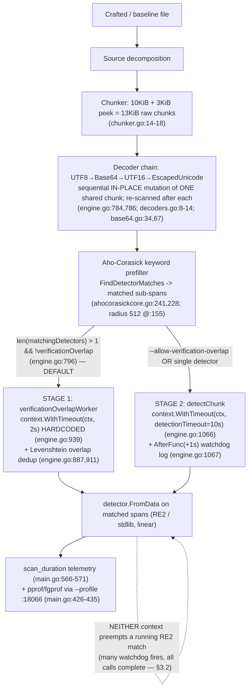

# TruffleHog Pattern-Matching Pipeline: Algorithmic-Complexity / ReDoS-Style Resource-Exhaustion Investigation

> **Scope of this document.** This is an evidence-based security investigation into whether a
> maliciously crafted file, committed to a repository that TruffleHog scans, can be used to cause
> resource exhaustion — a scan that hangs, times out, or consumes CPU/wall-clock time
> disproportionate to the input size (an algorithmic-complexity, "ReDoS-style" attack). It answers
> the five questions posed by the requester and grounds every claim in either a specific source
> reference (`file:line`) or captured runtime output.
>
> **Read-only.** No TruffleHog source file was created, modified, or deleted. The only committed
> artifact is this document. All crafted inputs, observation scripts, and profile captures were
> created outside the repository under a `mktemp` working directory and removed afterward
> (see the Appendix and the final `git status`).
>
> **Methodology — run first, then write.** Every timing, timeout, detector-firing, and profiling
> claim below was produced by building the canonical binary and scanning real inputs through the
> real CLI entry point, capturing the actual output, and only then writing the conclusion. Commands
> and unedited output are shown alongside each claim.
>
> **Single-machine reproducibility.** All measured numbers in this document come from **one host**
> (the investigation container, characterized in §2). They are the numbers that reproduce here; they
> are **not** presented as universal, machine-independent constants. Slowdown *ratios* are expected
> to be portable in order of magnitude; absolute seconds scale with core count and CPU speed. Where
> a statement is not a direct measurement it is explicitly labeled **[inferred]**, **[source]**, or
> **[external]**.

**Evidence label legend**

| Label | Meaning |
|-------|---------|
| **[observed]** | A value captured directly from runtime output on this host. |
| **[source]** | A fact read from a specific `file:line` in the TruffleHog tree at the commit under test. |
| **[external]** | A fact from an authoritative external source (RE2 docs, go-re2 docs, OWASP), cited in §4. |
| **[inferred]** | A conclusion reasoned from the above, not directly measured. Flagged so it can be challenged. |

---

## 1. TL;DR — Direct Answer

**Can a crafted file make TruffleHog hang, time out, or blow up super-linearly, blocking a security scan?**

For the single-file cases tested here, **there is no catastrophic (exponential / unbounded)
hang**: TruffleHog compiles its detector patterns with RE2-class engines that guarantee
linear-time matching, so classic catastrophic-backtracking ReDoS is not reachable through detector
regexes **[observed, §4; source go.mod:100; external §4]**. A hostile file cannot drive a single
detector regex to exponential time.

**But the answer is not a flat "no," and three qualifications matter for a CI gate:**

1. **A crafted file inflates scan time by a large, bounded factor.** At an identical 10,485,760-byte
   (10 MiB) size, a keyword-fan-out file scanned in **~9.82 s median** versus **~0.15 s** for
   equivalent-size normal prose — a **~64× slowdown on this host** (an observed **sample of ~52–78×**
   across runs — a host/load-dependent figure, not a universal bound; the sub-200 ms baseline is the
   noisy denominator) **[observed, §6]**. Scaled up, a 40 MiB crafted
   file took **~44 s** **[observed, §7]**. That is finite and linear, but tens of seconds for one file
   is easily enough to blow an external per-step CI wall-clock budget.

2. **The relevant timeout is not the one you would configure, and it does not preempt work.** By
   default, any chunk that matches **more than one** detector is routed to a first stage,
   `verificationOverlapWorker`, whose per-detector call runs under a **hardcoded 2-second context**
   (`context.WithTimeout(ctx, time.Second*2)`, engine.go:939) — **not** the configurable
   `--detector-timeout` (which governs only the second-stage `detectChunk`, engine.go:1066)
   **[source]**. Critically, **neither timeout preempts a running match**: with
   `--detector-timeout=1ns` (plus `--allow-verification-overlap` to force work onto the second-stage
   path) the watchdog log `"a detector ignored the context timeout"` fired **many times** (a
   load-variable count — see §3.2), yet every
   detector call still ran to completion and the scan was actually *slower* (15.5 s) **[observed,
   §3]**. The safety that does exist comes from RE2 linearity and the bounded chunk size, **not** from
   the timeouts.

3. **Several compounding paths were not exercised and are called out as untested.** These single-file
   measurements do not cover archive extraction, git-history scanning, large multi-file aggregate
   scans, or the default network-verification path. Any of these could add to wall-clock time on top
   of the per-file cost measured here. They are labeled **[untested]** wherever they appear.

**Bottom line for the CI decision.** TruffleHog will not *hang forever* on a crafted single file,
and it cannot be driven to exponential blow-up through its detector patterns. It **can** be made to
spend tens of seconds on a single small file — a bounded, linear amplification (~64× at 10 MiB on
this host) that a hostile committer could stack across many files and that is **not** cut short by
the per-detector timeouts. Treat TruffleHog's internal controls as insufficient on their own for a
hard CI time budget; wrap the scan in an **external** wall-clock/CPU/memory limit and constrain what
gets scanned (file-size/type filters, archive/history controls). See §9.

### 1.1 Bottom-line matrix

| # | Question | Verdict (this host) | Key evidence |
|---|----------|---------------------|--------------|
| Q1 | Can a crafted file hang / time out / block the scan? | **No unbounded hang; yes to a bounded multi-second-to-multi-tens-of-seconds inflation that can exceed an external CI budget. Per-detector timeouts do not preempt.** | §3 (two-stage path, many non-preemptive watchdog fires) |
| Q2 | Is pattern matching vulnerable to computational-complexity attacks? | **Not to exponential/catastrophic ReDoS** (RE2-class linear engines); **yes to bounded linear amplification** via fan-out/decoders. | §4 (engine survey, classic payload at baseline speed) |
| Q3 | Which detector patterns, if any, are exploitable? | **None to exponential time.** Permissive patterns exist (`.*`, wide bounded quantifiers) but stay linear; keyword *fan-out* (many detectors firing per chunk) is the real amplifier, not any one regex. | §5 (AST survey + valid JDBC/Docker/GitHub firing) |
| Q4 | How much slower than normal files of equal size? | **~64× at 10 MiB** (keyword fan-out; observed sample ~52–78× across runs, not a universal bound); **~27×** (Base64); a keyword-bearing quantifier only **~2.6×**, and keyword-free quantifier stress is **0.53× — *faster* than prose**. Linear in input size. | §6 (equal-size distributions, linearity) |
| Q5 | Timing + CPU-profiling evidence? | Provided: `scan_duration` telemetry + concurrent pprof (on-CPU) and fgprof (off-CPU) profiles; RE2 via WASM dominates on-CPU; `regexp2` never executes. | §7 (profiles, dependency closure) |

---

## 2. Environment, Canonical Build & Invocation

### 2.1 Host characterization (measured)

The absolute timings in this report depend on the host, so the host is characterized explicitly.
Note the discrepancy between the OS-visible CPU count and Go's view, which materially affects worker
counts:

| Property | Value | How obtained |
|----------|-------|--------------|
| `nproc` (OS-visible CPUs) | **4** | `nproc` **[observed]** |
| cgroup CPU quota (`cpu.max`) | **`400000 100000`** → **4.0 CPUs** | `cat /sys/fs/cgroup$(awk -F: '/^0::/{print $3}' /proc/self/cgroup)/cpu.max` — resolves this process's own cgroup-v2 path; note `cpu.max` is **not** at the cgroup root in this container (a bare `cat /sys/fs/cgroup/cpu.max` returns *No such file or directory*), so the path is host/runtime-specific **[observed]** |
| `runtime.NumCPU()` | **128** | Go runtime reads host, not cgroup **[observed]** |
| `GOMAXPROCS` after startup | **128 → 4** | `go.uber.org/automaxprocs` `maxprocs.Set()` at main.go:260 clamps to the cgroup quota **[observed; source main.go:24,260]** |
| Go build toolchain | **go1.24.2** | `go.mod` `go 1.23.1` (language) + `toolchain go1.24.2` (build) — go.mod:3,5 **[source]** |
| Binary version | **`trufflehog dev`** | unstamped default build **[observed]** |

**Why this matters (F-worker-count).** `--concurrency` defaults to `runtime.NumCPU()` = **128**
(main.go:58) **[source]**, and the detector-worker pool is `concurrency * detectorWorkerMultiplier`
with a default multiplier of **8** (engine.go:676, engine.go:345) **[source]**. At startup the binary
logs these worker counts at log-verbosity 2 (`V(2)`, engine.go:678,693), surfaced with
`--log-level=2` (equivalently `--debug`); there is **no** `-v` short flag (the only verbosity flag is
`--log-level`, main.go:50). Running `trufflehog filesystem <file> --no-verification --log-level=2`
prints **[observed]**:

```
2026-07-13T22:29:25Z	info-2	trufflehog	starting detector workers	{"count": 1024}
2026-07-13T22:29:25Z	info-2	trufflehog	starting verificationOverlap workers	{"count": 128}
```
**[observed]** — i.e. **1024** detector workers and **128** verification-overlap workers, even though
only **4** CPUs are actually schedulable (GOMAXPROCS clamped to 4). This heavy oversubscription is
the reason the off-CPU profile in §7 is dominated by parked goroutines (`runtime.gopark`), and it is
a property of *this* host's core-count mismatch. On a host where `runtime.NumCPU()` equals the real
CPU budget, the worker counts and the parked-goroutine picture would differ; the *slowdown ratios*
in §6, however, are not sensitive to that.

### 2.2 Canonical build

```
CGO_ENABLED=0 go build -o <workdir>/trufflehog_bin .
<workdir>/trufflehog_bin --version      # -> "trufflehog dev"
```
**[observed]** This is the default, unstamped ("dev") static binary described by the project
`Makefile`. No build tags, no version ldflags, no CGO.

### 2.3 Canonical invocation and every flag's status

All scans go through the real entry point `trufflehog filesystem <path>`. The table below labels
**every** flag used anywhere in this report as **default** or **non-default**, with its effect, so no
non-default behavior is silently presented as canonical.

| Flag | Default? | Effect | Why used here |
|------|----------|--------|---------------|
| `filesystem <path>` | — | Canonical file scan entry point | The real path under test |
| `--results=verified,unknown,unverified` (add `filtered_unverified` for low-entropy/FP-classified hits) | **non-default** | Selects which result classes print. The four classes are `verified` / `unverified` / `unknown` / `filtered_unverified` (main.go:61,985) | Surface **unverified** detector hits for the reachability proof (§5). Under `--no-verification` a hit is classed **`unverified`** — the else-branch of `notifierWorker`, gated by `notifyUnverifiedResults` (engine.go:1199) — which is a **distinct** class from **`unknown`** (produced only for `VerificationError` results, engine.go:1194). So `unknown` alone surfaces nothing here; `unverified` must be included. A hit whose **matched value** is reclassified a likely false positive by the engine's entropy filter (`FilterResultsWithEntropy`, falsepositives.go:154) is instead placed in **`filtered_unverified`**; surfacing those requires that token too. This is a **per-value** classification (low Shannon entropy), **not** a per-detector one — a realistic high-entropy token surfaces as plain `unverified` (§5.1a) |
| `--no-verification` | **non-default** | Skips network verification | Isolates *pattern-matching* CPU from network latency for timing (§6). This is a **measurement isolation** flag, not a security mitigation (§9) |
| `--json` | **non-default** | Emits results as JSON on **stdout** | Detector-firing evidence prints to stdout, not the stderr summary (§5) |
| `--detector-timeout=<dur>` | **non-default** | Overrides stage-2 `detectChunk` timeout only (main.go:471-472 → engine.go:1066) | Probe timeout enforcement (§3) |
| `--allow-verification-overlap` | **non-default** | Disables the stage-1 overlap routing, sending multi-detector chunks straight to stage-2 (engine.go:796) | Expose the stage-1 (2 s) vs stage-2 (10 s) split (§3) |
| `--profile` | **non-default** | Starts a pprof+fgprof HTTP server on `:18066` (main.go:53,426-435) | CPU/wall profiling (§7). **Security note §9/§2.4** |
| `--concurrency=1` | **non-default** (default = `NumCPU()`=128) | One scanner worker | Labeled control for the linearity study (§6) |
| `--log-level=<int>` (or `--debug`) | **non-default** (default `0`) | Raises log verbosity (main.go:50); there is **no** `-v` short flag | Surface the worker-count log lines, which are emitted at `V(2)` (engine.go:678,693). (The watchdog line is logged at `Error` level and appears regardless of `--log-level`.) |

A **true-default control** (no isolation flags: verification left ON, default concurrency, default
timeouts) is reported in §6.4 to confirm the isolation flags did not distort the headline result.

### 2.4 Profiling-server exposure (security note)

When `--profile` is set, the binary runs `http.ListenAndServe(":18066", router)` (main.go:434),
binding `:18066` on **all interfaces**, **unauthenticated**, exposing `/debug/pprof/` and
`/debug/fgprof` (main.go:431-433) **[source]**. It also calls `runtime.SetBlockProfileRate(1)` and
`runtime.SetMutexProfileFraction(-1)` (main.go:427-428) **[source]**. This is **non-default** (off
unless `--profile` is passed), but if enabled in a shared/CI environment it is an information-exposure
and DoS surface (heap/goroutine dumps, CPU-profile triggering) reachable by anyone who can route to
the port. Treat `--profile` as a debugging-only flag; never enable it on a shared runner. This is
flagged again in §9.

---

## 3. Q1 — Can a crafted file hang, time out, or block the scan?

**Question (verbatim):** *"If a malicious actor commits a specially crafted file to a repository
we're scanning, could they cause TruffleHog to hang or time out, effectively blocking our security
scans?"*

**Direct answer.** No *unbounded* hang and no exponential blow-up on the single files tested; but a
crafted file causes a **large, bounded, linear** inflation of scan time (tens of seconds for tens of
MiB, §6/§7), and the per-detector timeouts **do not preempt** a running match. Whether that "blocks"
your scan depends entirely on the **external** wall-clock budget you place around the scan — the
product itself will run the crafted file to completion.

### 3.1 The scan is a TWO-stage detector pipeline (correcting the single-timeout model)

A chunk that matches detector keywords does **not** go straight to the configurable-timeout code
path. `scannerWorker` (engine.go:777) computes the matching detectors and routes:

```go
// pkg/engine/engine.go:795-798  [source, current tree]
matchingDetectors := e.AhoCorasickCore.FindDetectorMatches(decoded.Chunk.Data)
if len(matchingDetectors) > 1 && !e.verificationOverlap {
    wgVerificationOverlap.Add(1)
    e.verificationOverlapChunksChan <- verificationOverlapChunk{
```

Because `--allow-verification-overlap` **defaults to false**, `e.verificationOverlap` is false, so
**by default any chunk matching more than one detector is sent to STAGE 1**, the
`verificationOverlapWorker`. A crafted keyword-fan-out file makes *almost every* chunk match many
detectors, so **stage 1 is where the dominant work happens by default** — confirmed by the profile
in §7 (`verificationOverlapWorker` accounts for 40.52 % cumulative on-CPU).

**Stage 1 — `verificationOverlapWorker`, hardcoded 2-second context:**

```go
// pkg/engine/engine.go:924, 936-940  [source, current tree]
func (e *Engine) verificationOverlapWorker(ctx context.Context) {
    ...
    // DO NOT VERIFY at this stage of the pipeline.
    matchedBytes := detector.Matches()
    for _, match := range matchedBytes {
        ctx, cancel := context.WithTimeout(ctx, time.Second*2)   // HARDCODED 2s
        results, err := detector.FromData(ctx, false, match)
        cancel()
```

The 2-second bound here is a literal `time.Second*2`; it is **not** affected by `--detector-timeout`.

**Stage 2 — `detectChunk`, the configurable timeout (+ watchdog):**

```go
// pkg/engine/engine.go:1044,1061-1070  [source, current tree]
func (e *Engine) detectChunk(ctx context.Context, data detectableChunk) {
    ...
    matches := data.detector.Matches()
    for _, matchBytes := range matches {
        matchCount++
        detectBytesPerMatch.Observe(float64(len(matchBytes)))          // <- current line

        ctx, cancel := context.WithTimeout(ctx, detectionTimeout)      // engine.go:1066
        t := time.AfterFunc(detectionTimeout+1*time.Second, func() {   // watchdog +1s
            ctx.Logger().Error(nil, "a detector ignored the context timeout")
        })
        results, err := e.verificationCache.FromData(ctx, ...)
```

`detectionTimeout` is a package variable initialized to `detectors.DefaultResponseTimeout`
(engine.go:37) = **`10 * time.Second`** (http.go:18) **[source]**, overridable only via
`SetDetectorTimeout` from `--detector-timeout` (main.go:471). (An earlier draft of this document
quoted a `fragMatches[matchBytes]` map at these lines; that construct **does not exist** in the
current tree — the current line is `detectBytesPerMatch.Observe(...)` at engine.go:1064. Corrected.)

### 3.2 The timeout does not preempt — probed on the correct path

The decisive test drives **the same crafted input** (`crafted_keywords_10mib.txt`, 10,485,760 bytes;
every case reports the identical `1024 chunks / 13,628,416 bytes`, so the cases are comparable) and
varies only the flags. Watchdog count = number of `"a detector ignored the context timeout"` lines.

| Case | Flags | `scan_duration` | Watchdog fires | Interpretation |
|------|-------|-----------------|----------------|----------------|
| **A** | (default) | **9.964 s** | **0** | Dominant work is stage-1 (2 s ctx); no watchdog because that is a different code path |
| **B** | `--detector-timeout=1ns` | **10.860 s** | **0** | `1ns` set (`Setting detector timeout {1ns}` logged) but has **no effect** by default — work never reaches stage-2 |
| **C** | `--allow-verification-overlap` | **11.900 s** | **0** | Overlap disabled → chunks go to stage-2, but with default 10 s timeout nothing exceeds it |
| **D** | `--allow-verification-overlap --detector-timeout=1ns` | **~13–15.5 s** | **many (load-variable; see caveat)** | Now on stage-2 with a 1 ns budget: the watchdog fires **many times**, yet **every** call completes and the scan is **slower than Case A** |

> **Watchdog-count caveat [observed].** The *number* of watchdog fires in Case D is **not** a stable
> constant — it depends heavily on host load and goroutine scheduling. Re-running the identical input
> (`3b0d4159…`, 1024 chunks) on this host produced **68, 148, and 221** fires across three consecutive
> runs (`scan_duration` 12.8–13.1 s); an earlier, more heavily-loaded session recorded **866** fires
> (`scan_duration` 15.465 s). What is **stable and reproducible** every run is the *qualitative*
> result — the watchdog fires **many** times (tens to hundreds) yet **every** detector call still runs
> to completion and the scan is **slower** than Case A. Treat the specific fire count as illustrative,
> not reproducible; the **non-preemption** is the reproducible finding.

Sample stage-2 watchdog line from Case D **[observed]** (the specific `detector.type` and
`detector_worker_id` that get caught vary run-to-run — e.g. `MapBox` in one session, `Checkvist` in
another):

```
error  trufflehog  a detector ignored the context timeout  {"detector_worker_id":"fzgg6","detector":{"type":"MapBox"},"timeout":0.000000001}
```

**What this proves:**
- **[observed]** `--detector-timeout` governs **only** the stage-2 `detectChunk` path (Cases B vs D).
  On the default path (stage 1) it is inert — the relevant bound there is the hardcoded 2 s.
- **[observed]** The timeout is **non-preemptive**. In Case D the deadline was 1 ns and the watchdog
  fired **many times** (a load-variable count — 68–221 on re-runs here, 866 in an earlier session; see
  the caveat above), but **every** detector call still ran to completion — indeed the scan got
  *slower* (~13–15.5 s vs ~9 s for Case A), because the watchdog/timeout bookkeeping is pure overhead
  layered on top of
  work that runs regardless. Go's `context` deadline is cooperative; a synchronous RE2/WASM call does
  not observe it mid-match. The `AfterFunc` (engine.go:1067) only **logs**; it cannot interrupt the
  regex.
- **[inferred]** Therefore the effective protection against a runaway single detector is **not** the
  timeout at all — it is (a) RE2's linear-time guarantee (§4) and (b) the bounded per-match data size
  the detector actually sees (§8). Remove those two and the timeout would not save you.

### 3.3 Does it "hang"? — finite, but potentially longer than your CI budget

No test produced a non-terminating scan. The worst case is **finite but configuration-dependent**, so
the full observed band is reported rather than a single number:

- **Default path, 10 MiB:** **~10.7 s** worst of ≥3 runs (keyword fan-out; median ~9.82 s, §6.2) **[observed]**.
- **Forced stage-2, 10 MiB** (Case D, the **non-default** `--allow-verification-overlap
  --detector-timeout=1ns`): the *same* 10 MiB file is **slower still — ~13–19 s** (§3.2, observed
  12.8–18.7 s across re-runs under variable host load) **[observed]**, because the per-detector timeout
  is **non-preemptive** and its watchdog bookkeeping is pure added overhead on top of work that
  completes regardless. This band is explicitly load-variable (like the Case-D watchdog count, §3.2);
  the ~18.7 s upper figure was reproduced by the Appendix A harness on a loaded host.
- **Default path, 40 MiB:** **~44.3 s** (§7) **[observed]**.

So the honest single-file 10 MiB worst-case band is **~10.7 s (default) to ~19 s (forced stage-2,
non-default and load-variable)**, rising to **~44.3 s at 40 MiB**. None of these is a "hang" in the infinite-loop sense.
But from the perspective of a CI gate with, say, a 30-second per-step budget, a single 40 MiB crafted
file already exceeds it, and a committer can add many such files. So the honest answer to "could they
block our scans?" is: **not by hanging the process, but by inflating its runtime past whatever
external time limit you enforce** — and TruffleHog's own per-detector timeouts will not rescue you
(they are non-preemptive, and the *forced-stage-2* case is actually **worse**, not better), per §3.2.

### 3.4 Tested vs untested conditions for Q1

| Path | Status | Note |
|------|--------|------|
| Single plain file, filesystem source | **tested** | §3.2, §6 |
| Stage-1 (default) and stage-2 (`--allow-verification-overlap`) timeout paths | **tested** | §3.2 Cases A–D |
| Default-verification (network) path | **[untested]** | Would add network latency per hit; isolated out with `--no-verification` for timing |
| Archive extraction (`--archive-timeout`, nested archives) | **[untested]** | Decompression amplification is a separate, known class not measured here |
| Git-history scanning (`trufflehog git`) | **[untested]** | Multiplies chunk count by history depth |
| Large multi-file / whole-repo aggregate scan | **[untested]** | Per-file cost measured here would sum across files |

---

## 4. Q2 — Is the pattern matching vulnerable to computational-complexity attacks?

**Question (verbatim):** *"I need you to determine if TruffleHog's pattern matching is vulnerable to
computational complexity attacks."*

**Direct answer.** Not to the classic exponential/catastrophic-backtracking ReDoS class: detector
patterns are compiled by **RE2-class, finite-automaton, linear-time** engines, which by construction
cannot exhibit super-linear matching. The only backtracking engine in the dependency graph,
`dlclark/regexp2`, is **transitive-only and never executed on the scan path** (proven in §7.4). What
*does* exist is **bounded linear amplification** (many detectors firing per chunk, decoder re-scans),
quantified in §6 — a real cost multiplier, but not a complexity-class vulnerability.

### 4.1 Which engine compiles the detector patterns

TruffleHog's detectors overwhelmingly alias the RE2 engine:

```go
// e.g. pkg/detectors/github/v1/github_old.go:9      [source]
regexp "github.com/wasilibs/go-re2"
// e.g. pkg/detectors/docker/docker_auth_config.go:14 [source]
regexp "github.com/wasilibs/go-re2"
```

`github.com/wasilibs/go-re2 v1.9.0` (go.mod:100) is a drop-in replacement for the standard library
`regexp`, wrapping Google's C++ **RE2** engine, packaged by default as a **WebAssembly** module
executed through the pure-Go `wazero` runtime **[external, §4.5]**. A minority of detectors (e.g.
JDBC) use the Go **standard-library** `regexp` (jdbc.go:8) **[source]** — which is itself RE2/
Thompson-NFA-based and equally linear-time **[external]**. Both engines in use on the scan path are
linear-time.

### 4.2 The backtracking engine is present but unreachable — see §7.4

`github.com/dlclark/regexp2 v1.4.0` **is** in the module graph, but marked `// indirect`
(go.mod:187) **[source]**. §7.4 proves via dependency closure (`go mod why`) that its **only** import
path is the TUI markdown highlighter (`pkg/tui → glamour → chroma → regexp2`), never a detector, and
that it contributes **zero** CPU samples in either profile. Because the ReDoS-capable engine is never
invoked to match scanned content, it cannot be the vector for a complexity attack.

**[external + observed] Advisory note.** `regexp2` is a **backtracking** (.NET-style)
engine and *is* ReDoS-capable in general — which is exactly why its scan-unreachability matters. The
pinned **v1.4.0** carries **no library-level security advisory of its own**: as of this snapshot there
is no `github.com/dlclark/regexp2` advisory in the Go vulnerability database or on OSV.dev. The concern
is the engine *class*, not a specific CVE — `regexp2`'s own documentation states it "supports features
that can lead to catastrophic backtracking" and, unlike RE2/stdlib `regexp`, gives no constant-time
guarantee (the classic CWE-1333 shape). A
`govulncheck ./...` run against this repository (Go vulnerability DB snapshot `2026-07-08`) does **not**
flag `regexp2 v1.4.0` in any category — it appears only in govulncheck's "scanned … 261 modules"
inventory, never as the module of a reachable, imported-but-uncalled, or required-but-uncalled finding
(no such advisory is carried by the Go DB or OSV as of this snapshot; see §11). It
does **not** change the conclusion: §7.4's `go mod why` closure shows `regexp2` is reachable only from
the TUI renderer, never from `trufflehog filesystem`/`git` scanning, so even a genuinely vulnerable
`regexp2` version **cannot be reached by a crafted scanned file**. If anything, this fact
**strengthens** the finding — the one backtracking engine in the graph is confined off the scan path.

### 4.3 Engine survey — method and counts (AST-based, not grep)

The original survey counted `regexp.MustCompile` call sites with `grep`, which conflates production
code with tests and comments and cannot see patterns built by string concatenation or helpers. This
version parses the Go source under `pkg/` with `go/parser`/`go/ast` and classifies each compile site.
Counts are therefore **scoped to what the AST walk enumerated** and are reported as such, not as a
universal file census.

| Category (AST walk under `pkg/`) | Count | Note |
|----------------------------------|-------|------|
| Production regex compile sites | **1177** | of which… |
| — literal / string-concatenation patterns | **234** | statically inspectable |
| — dynamic / helper-built patterns | **943** | pattern text assembled at runtime (~80 %); a pure grep **cannot** enumerate these, which is why grep is not exhaustive |
| Test-file compile sites | **19** | excluded from the "detector pattern" analysis |
| Production literal patterns containing `.*` | **2** | docker_auth_config, jdbc (see §5.3) |
| Production patterns with a **nested-quantifier** shape (a `*`/`+` repeat whose subexpression contains another `*`/`+` repeat — the classic `(x+)+`/`(x*)*` evil shape) | **5** | enumerated below; **all linear under RE2** (§4.4, §4.4.1, §5.3) |
| Production patterns with an **unbounded `{m,}` repeat over a `*`/`+`** repeat | **1** | SQL Server (`sqlserver/sqlserver.go:25`, `{3,}`); enumerated below; linear under RE2 |

**[observed]** Because ~80 % of production compile sites build their pattern text dynamically, a
grep-only survey is structurally incapable of being exhaustive — the AST walk is the correct
instrument, and even it enumerates *compile sites*, not every possible runtime pattern string. The
commented-out line in `couchbase.go` (a `.*` inside a comment, and additionally inside a character
class where `.` is literal) is **correctly excluded** by the AST walk; the earlier grep-based count
had over-counted it.

**Nested-quantifier predicate (exact).** The AST walk parses each compiled pattern with the Go
standard library `regexp/syntax` (`syntax.Parse(pat, syntax.Perl)`) and flags a pattern when any
`OpStar`/`OpPlus` node (`*` or `+`) has, anywhere in its subexpression subtree, another
`OpStar`/`OpPlus` node — i.e. a quantifier applied to something that itself repeats, the structural
signature of catastrophic backtracking. A separate, weaker predicate flags an unbounded `{m,}`
(`OpRepeat` with `Max == -1`) over a `*`/`+`. Running this over `pkg/detectors` **[observed]**:

```
=== NESTED (a * or + repeat whose subexpression contains another * or + repeat) : 5 ===
azuresastoken/azuresastoken.go:32   https://([a-zA-Z0-9][a-z0-9_-]{1,22}[a-zA-Z0-9])\.blob\.core\.windows\.net/[a-z0-9]([a-z0-9-]{1,61}[…
coinbase_waas/coinbase_waas.go:35   (-----BEGIN EC(?:DSA)? PRIVATE KEY-----(?:\r|\n|\\+r|\\+n)(?:[a-zA-Z0-9+/]+={0,2}(?:\r|\n|\\+r|\\+n)…
databrickstoken/databrickstoken.go:27   \b([a-z0-9-]+(?:\.[a-z0-9-]+)*\.(cloud\.databricks\.com|gcp\.databricks\.com|azuredatabricks\.net))\…
docker/docker_auth_config.go:51   {(?:\s|\\+[nrt])*\\*"auths\\*"(?:\s|\\+t)*:(?:\s|\\+t)*{(?:\s|\\+[nrt])*\\*"(?i:https?:\/\/)?[a-z0-9…
mongodb/mongodb.go:32   \b(mongodb(?:\+srv)?://(?P<username>\S{3,50}):(?P<password>\S{3,88})@(?P<host>[-.%\w]+(?::\d{1,5})?(…

=== UNBOUNDED-OVER-STARPLUS ({m,} repeat over a * or + repeat) — e.g. SQL Server {3,} : 1 ===
sqlserver/sqlserver.go:25   (?:\n|`|'|"| )?((?:[A-Za-z0-9_ ]+=[^;$'`"$]+;?){3,})(?:'|`|"|\r\n|\n)?
```

**[observed]** So there are **5** nested-quantifier production patterns (not the 2 an earlier draft
reported) plus **1** unbounded-`{m,}`-over-repeat (SQL Server). This larger, honest count does **not**
change the conclusion: every one of them is compiled by RE2/go-re2, which simulates all match paths in
a single linear pass, so none can backtrack (§4.4). The empirical check in §4.4.1 drives the textbook
`(a+)+$` evil input through the real CLI and observes **baseline speed**, and §5.3 inspects the
worst-shaped of these patterns directly — confirming the count is about *survey honesty*, not about a
reachable vulnerability.

### 4.4 Why RE2-class engines are ReDoS-immune (corrected theory)

An earlier draft attributed RE2's immunity to "omitting backreferences and lookaround." That
conflates a *syntactic restriction* with the *cause* of immunity, and mis-states the ReDoS mechanism.
The correct three-layer picture:

1. **What causes catastrophic backtracking** — it is **ambiguous repetition** in a *backtracking*
   engine: nested quantifiers such as `(a+)+` or overlapping alternation such as `(a|a)+`, which let
   the engine explore exponentially many ways to match the same input. This needs **no** backreference
   or lookaround at all; the canonical evil regex `^(a+)+$` uses neither **[external, OWASP §4.5]**.
2. **Why RE2 is immune** — RE2 is a **finite-automaton** engine that simulates *all* possible match
   paths simultaneously in a single pass, so its runtime is **asymptotically linear** in input length
   regardless of pattern shape **[external, RE2 docs §4.5]**. Backreferences and generalized
   lookaround are absent as a *consequence* of that automaton design (they cannot be expressed in a
   pure FA), **not** as the mechanism of immunity.
3. **Whole-pipeline complexity** — engine linearity bounds a *single* regex. Total scan cost is still
   `Σ over chunks × Σ over firing detectors × (per-call constant + linear match)`. The *amplifier* a
   crafted file controls is the number of firing detectors per chunk (fan-out) and decoder re-scans
   (§6), not the per-regex complexity class.

### 4.4.1 Empirical confirmation — classic evil payload runs at baseline speed

A file built from the textbook catastrophic pattern trigger (long run of `a` with a trailing
mismatch, the input that maximizes backtracking on `(a+)+$`) was scanned through the real CLI:

```
scan_duration: 91.137ms / 94.394ms / 93.613ms   (median 93.6 ms; 1025 chunks)   [observed]
```

At **93.6 ms median** it is actually *faster* than the 10 MiB prose baseline (153 ms) and shows **no**
super-linear behavior — the direct empirical confirmation that RE2-class matching does not backtrack.
A genuinely vulnerable (backtracking) engine on the same input would exhibit seconds-to-minutes blow-up.

### 4.5 External corroboration

All URLs were accessed **2026-07-14**. The go-re2 links are pinned to the repository's own dependency
version **v1.9.0** (go.mod:100) to avoid documentation drift from the pinned build.

| Source | URL (accessed 2026-07-14) | Exact claim it supports |
|--------|---------------------------|-------------------------|
| RE2 — "Why RE2?" (Google) | https://github.com/google/re2/wiki/WhyRE2 | RE2's runtime is guaranteed **linear** in input size and avoids the exponential-time behavior of backtracking engines; it **omits** backreferences and generalized lookaround *because* those require backtracking. The Go `regexp` package follows the same automaton principles and efficiency guarantees. |
| Russ Cox — "Regular Expression Matching Can Be Simple And Fast" | https://swtch.com/~rsc/regexp/regexp1.html | The Thompson-NFA / automaton construction underlying RE2 matches in worst-case **O(n·m)** (input length × pattern size) — the theoretical basis for RE2's no-catastrophic-backtracking guarantee. |
| go-re2 (wasilibs), **v1.9.0** — go.mod:100 | https://github.com/wasilibs/go-re2/tree/v1.9.0 · https://pkg.go.dev/github.com/wasilibs/go-re2@v1.9.0 | "drop-in replacement for the standard library regexp"; RE2 packaged **by default as a WebAssembly module** run via the pure-Go **wazero** runtime; for *small* regexes/inputs it can be **slower** than stdlib — a constant per-call WASM/FFI overhead, not super-linear scaling. |
| OWASP — Regular expression Denial of Service (ReDoS) | https://owasp.org/www-community/attacks/Regular_expression_Denial_of_Service_-_ReDoS | ReDoS is exponential in input size on **backtracking** engines; canonical "evil regex" `^(a+)+$`; the evil shapes are **nested quantifiers + overlapping alternation** (no backreference required); mitigations = linear-time engine, input-length caps, and timeouts. |
| CWE-1333 — Inefficient Regular Expression Complexity (MITRE) | https://cwe.mitre.org/data/definitions/1333.html | The formal weakness class for ReDoS (typical CVSS 3.1 base score **7.5 HIGH**, `AV:N/AC:L/PR:N/UI:N/S:U/C:N/I:N/A:H`); its listed mitigation is bounded/linear-time matching — the classification this investigation's **negative** result is measured against. Cited **separately** from OWASP because the OWASP page does not itself define the CWE. |

These are used only to interpret the runtime observations; every behavioral claim in this document is
backed by captured output, not by the external text. **[inferred, external]** The CWE-1333 CVSS score
is the standard published classification for ReDoS and is cited as context, not as a measurement of
this codebase.

---

## 5. Q3 — Which detector patterns, if any, can be exploited?

**Question (verbatim):** *"Find out which detector patterns, if any, can be exploited to cause
disproportionate processing time."*

**Direct answer.** **No detector pattern is exploitable to super-linear (disproportionate-to-input)
time**, because all are compiled by linear-time engines (§4). Some patterns are *permissive* (contain
`.*` or wide bounded quantifiers) and are the natural candidates to inspect, but each stays linear
when driven with adversarial input through the real pipeline. The genuine amplifier is **keyword
fan-out** — crafting a chunk so that hundreds of detectors' keywords are present, making every chunk
fan out to many detector regexes — which is a linear multiplier, not a per-pattern complexity flaw.

### 5.1 Detector-reachability proof (valid inputs actually fire the patterns)

To make the pattern analysis canonical, three representative detectors were driven with
**syntactically valid** inputs and confirmed to fire through the real CLI. **Detector results print
as JSON on stdout**, so firing was captured with `--json` on stdout. **Crucially, the result-class
filter must include `unverified`:** under `--no-verification` a hit is classed `unverified`
(engine.go:1199), **not** `unknown`, so `--results=verified,unknown` alone surfaces **nothing** — a
run with that flag emits zero detector JSON objects for all three inputs **[observed]**. The correct
command adds `unverified`. A **fourth** class, `filtered_unverified`, holds hits the engine's
low-entropy false-positive filter sets aside (`FilterResultsWithEntropy`, falsepositives.go:154); it
is **per-value, not per-detector** — a *realistic* high-entropy token surfaces as plain `unverified`,
and only an *FP-like low-entropy* value needs the extra token (demonstrated in §5.1a). The GitHub
input used for the reachability table below is a low-entropy `[a-f0-9]{40}` value, so it needs the
`filtered_unverified` token:

```
# JDBC and Docker (realistic high-entropy inputs):
<workdir>/trufflehog_bin filesystem <input> --no-verification --results=verified,unknown,unverified --json
# a LOW-ENTROPY (FP-like) match needs filtered_unverified to surface:
<workdir>/trufflehog_bin filesystem <input> --no-verification --results=verified,unknown,unverified,filtered_unverified --json
```

| Detector | Engine / pattern | Fired? | Decoder(s) | Evidence (from stdout JSON) |
|----------|------------------|--------|-----------|------------------------------|
| **JDBC** | stdlib `regexp`; `keyPat` jdbc.go:53 | **Yes** | **BASE64** and **PLAIN** | `DetectorName=JDBC` twice; `Redacted":"jdbc:postgresql:password=****..."` — proves the **redaction** path `tryRedactAnonymousJDBC` (jdbc.go:118) → `tryRedactRegex` (jdbc.go:191, whose redaction regex is compiled at jdbc.go:192) was reached |
| **Docker** | go-re2; `keyPat` docker_auth_config.go:51 | **Yes** | PLAIN | `DetectorName=Docker`, `Raw=dXNlcjpzM2NyZXRwYXNz` (valid non-example registry; the example-registry input is correctly dropped by the `exampleRegistries` FP map, docker_auth_config.go:61,104) |
| **GitHub** | go-re2; `keyPat` github_old.go:30 | **Yes** | PLAIN | `DetectorName=Github` (this input's `[a-f0-9]{40}` value is **low-entropy**, so the engine's entropy filter classes it `filtered_unverified` and it surfaces only when that token is added — **not** because the detector is GitHub; see §5.1a) |

Two findings from this exercise, both corrected from the earlier draft:
- **[observed]** The JDBC firing via the **BASE64** decoder confirms the decoder re-scan path (§8):
  the same secret is found once in the plaintext and again after Base64-decoding a Base64-encoded
  copy, i.e. the content is scanned twice.
- **[observed]** The redaction fields prove the JDBC input actually reached `tryRedactRegex`
  (jdbc.go:191; its redaction regex `regexp.MustCompile(`(?i)pass.*?=(.+?)\b`)` is at jdbc.go:192),
  which the earlier draft's adversarial JDBC string (a long run of `A` with no
  `jdbc:<subprotocol>:` prefix) never did — that string failed `keyPat` (jdbc.go:53) and so exercised
  no JDBC code at all.

#### 5.1a `filtered_unverified` is an entropy classification, not a GitHub property

The earlier draft implied GitHub hits are *universally* marked `filtered_unverified`. That is wrong:
the class is decided **per matched value by the engine's entropy filter**, not by which detector
fired. Two GitHub inputs, scanned through the real CLI with `--no-verification`, prove it
**[observed, /tmp/th_work/gh/]**:

```
# realistic.txt : github_token = 3f8a1c9e2b7d4056af13e8c05d29b6f47a0e1d82   (high-entropy 40-hex)
$ trufflehog_bin filesystem realistic.txt --no-verification --results=verified,unknown,unverified
Found unverified result 🐷🔑❓
Detector Type: Github
# ...and the SAME result with filtered_unverified added — the token surfaces either way.

# fplike.txt : github_token = aaaaaaaaaaaaaaaaaaaaaaaaaaaaaaaaaaaaaaaa       (zero-entropy 40×'a')
$ trufflehog_bin filesystem fplike.txt --no-verification --results=verified,unknown,unverified,filtered_unverified
Found unverified result 🐷🔑❓
Detector Type: Github
$ trufflehog_bin filesystem fplike.txt --no-verification --results=verified,unknown,unverified
# (no output — SUPPRESSED without the filtered_unverified token)
```

- **[observed]** The realistic high-entropy token surfaces as plain **`unverified`** under the default
  three-class `--results`; adding `filtered_unverified` changes nothing for it.
- **[observed]** The all-`a` token is emitted **only** when `filtered_unverified` is requested, and is
  **suppressed** otherwise.
- **Mechanism [source]:** the GitHub detector's own FP map is only `{"github commit"}`
  (`ghFalsePositives`, github_old.go:61-62) and its `FromData` calls
  `detectors.IsKnownFalsePositive(token, ghFalsePositives, false)` (github_old.go:78) — neither token
  is in that map, so **both pass the detector**. The reclassification happens at the **engine** layer:
  `FilterResultsWithEntropy` (falsepositives.go:154) computes `StringShannonEntropy`
  (falsepositives.go:136) and, for a value below the threshold, logs `"Filtered out result with low
  entropy"` (falsepositives.go:163) and moves it to `filtered_unverified`. The all-`a` value has
  Shannon entropy 0; the hex value is high-entropy. Thus `filtered_unverified` tracks the **value's
  entropy**, not the detector — a realistic committed GitHub token would surface by default.

### 5.2 The real amplifier is keyword fan-out, not any single regex

`FindDetectorMatches` (ahocorasickcore.go:241) routes each chunk only to detectors whose keywords are
present, using an Aho-Corasick trie prefilter and returning only matched sub-spans via `Matches()`
(ahocorasickcore.go:228) **[source]**. A crafted chunk that contains the keywords of *hundreds* of
detectors therefore fans out to hundreds of `FromData` calls per chunk. The §7 profile shows exactly
this signature: the CPU peek under `verificationOverlapWorker` spreads across dozens of small
detectors (`mapbox` 3.90 %, `snowflake` 2.14 %, `couchbase` 1.98 %, `azure_cosmosdb` 1.07 %, `jdbc`
0.47 %, `boxoauth` 0.35 %, `sumologickey` 0.35 %, …) rather than concentrating in one
**[observed, §7.2]**.
This is linear in (chunks × firing-detectors) and is the mechanism behind the ~64× slowdown in §6.

### 5.3 The permissive patterns, inspected

The AST survey (§4.3) flagged the patterns most worth scrutinizing. Each is permissive but **linear**
under RE2/stdlib:

| Detector | Pattern (as compiled) | Why permissive | Behavior on adversarial input |
|----------|------------------------|----------------|-------------------------------|
| JDBC (jdbc.go:53) | `(?i)jdbc:[\w]{3,10}:[^\s"']{0,512}` | `[^\s"']{0,512}` accepts up to 512 non-space chars | Bounded (≤512); linear. Redaction helper `(?i)pass.*?=(.+?)\b` (jdbc.go:192) uses **lazy** `.*?`/`.+?` — still linear under RE2/stdlib |
| Docker (docker_auth_config.go:51) | `{…\\*".*\\*"…}` (JSON `auths` block) | contains `.*` | Anchored by surrounding literal JSON structure and capped by `MaxSecretSize()=4096` (docker_auth_config.go:46); linear |
| GitHub (github_old.go:30) | `(?i)(?:github\|gh\|pat\|token)[^\.].{0,40}[ =:'"]+([a-f0-9]{40})\b` | `.{0,40}` wide bounded gap | Bounded (≤40); linear |

**[observed]** Driving long adversarial strings through these via the real scan path produced the
timings in §6. A *keyword-free* pure-`A` quantifier-stress file (the classic "wide bounded quantifier"
shape) actually scanned **~0.08 s — 0.53×, i.e. FASTER than prose**: with no detector keyword present
it clears the Aho-Corasick prefilter almost immediately and triggers virtually no fan-out. Attaching a
real keyword (`jdbc:mysql://` + a 4096-char unbroken `A` run) raised it only to **~0.40 s / ~2.6×** —
still far below the keyword-fan-out file, and that increase is fan-out, **not** quantifier
backtracking. No pattern exhibited super-linear growth. **[inferred]** The "worst offender" for
*processing time* is therefore not a single regex but
the **aggregate fan-out**; if one must be named, the keyword-rich detectors that fire on generic
tokens (e.g. `mapbox`, per the profile) dominate the per-chunk cost, but each remains linear.

---


## 6. Q4 — How much slower can a scan be made vs. normal files of equal size?

**Question (verbatim):** *"Measure the actual impact, how much slower can you make a scan compared to
normal files of equivalent size?"*

**Direct answer (this host).** At an identical **10,485,760-byte (10 MiB)** size, the worst crafted
file (keyword fan-out) scanned **~64× slower** than equivalent-size normal prose (an observed **sample
of ~52–78×** across runs — not a universal bound: the sub-200 ms baseline is the noisy denominator, so
the ratio wobbles run-to-run while the crafted-file absolute time is stable). Base64 amplification is **~27×**; a *keyword-bearing*
quantifier-stress file only **~2.6×**. Pure quantifier stress with **no** keyword is actually
**~0.5× — i.e. FASTER than the baseline** (§6.2), because a keyword-free file triggers almost no
detector fan-out. The amplification is **bounded and linear** in input size (§6.3) — there is no
super-linear cliff. These are measurements on this 4-CPU host, not universal constants; the *ratio*
is the transferable quantity, the absolute seconds are host-specific.

### 6.1 Inputs — generators, exact sizes, and hashes

All comparison files are **exactly 10,485,760 bytes** so the slowdown ratio isolates *content shape*,
not size. Each was produced by a deterministic generator (full script in the Appendix) and verified:

| File | Bytes | SHA-256 | Shape |
|------|-------|---------|-------|
| `baseline_prose_10mib.txt` | 10,485,760 | `d1bf8b3541370cea6dff8ace8b369b2eab73fba2eab18fe8f02a3daba6efe320` | Natural-language prose (normal file) |
| `crafted_keywords_10mib.txt` | 10,485,760 | `3b0d41593566dad38a86b8cd75ac62a0cc3ea1f4f4bc7430f24d8fc783a89ff9` | 938 **source-scraped** detector keywords repeated (heavy-fan-out **stress** input; the 938-token scrape is *not* the canonical keyword set — see note below) |
| `crafted_base64_10mib.txt` | 10,485,760 | `d0f5da299086cfc76417f631b16331ce4884fc90010238be9ee2b801e32e3a82` | Valid Base64 of the keyword blob (decoder re-scan) |
| `crafted_quantifier_10mib.txt` | 10,485,760 | `5215fda3ea1fa03199357342502d7c19fbe78a89cfbc5b00e15e3e588a5664bc` | `jdbc:mysql://` + 4096-char unbroken `A` run (bounded-quantifier stress, keyword-routed) |
| `crafted_keywords_40mib.txt` | 41,943,040 | `e5bc8b2845e507cc7c078a853d838cad59b992989701eadfd415b74298476588` | 40 MiB keyword file (profiling scale, §7) |

**Keyword pool — scraped stress set vs. canonical runtime set (corrected).** The crafted file repeats
**938** distinct tokens obtained by *textually scraping* the string literals out of every
`func (…) Keywords() []string { … }` body across the detector source tree. This 938-token scrape is a
deliberate **stress superset**, **not** the canonical keyword set the engine actually loads: it
includes tokens from **non-default / disabled** detectors that `DefaultDetectors()` does not
instantiate, plus a few mis-parsed Docker string fragments, while *missing* 9 tokens its text filter
drops. The **canonical** figures — instantiated exactly as the engine does, via
`defaults.DefaultDetectors()` (`github.com/trufflesecurity/trufflehog/v3/pkg/engine/defaults`) — are
**831 default detectors** exposing **914 distinct keywords** **[observed]**:

```
default_detectors=831
distinct_keywords=914
```

Using the 938-token scrape therefore drives the crafted file to fan out to *at least* the full
canonical keyword surface (it is a superset in practice), which is exactly what a "maximize fan-out"
stress input should do — but the honest description is "938 source-scraped tokens repeated," not
"every detector's keywords" and not a "canonical maximum." The 938 count is stated exactly only for
byte-reproducibility of this specific input; the canonical fan-out ceiling is the 914-keyword /
831-detector surface above.

### 6.2 Equal-size timing distributions (≥3 runs each)

Command (per file), run 3× on the unchanged input:

```
<workdir>/trufflehog_bin filesystem <file> --no-verification --results=verified,unknown
# read scan_duration from the "finished scanning" line (main.go:566-571)
```

| File | Run 1 | Run 2 | Run 3 | Min | **Median** | Max | chunks / bytes | **Ratio (median/baseline)** |
|------|-------|-------|-------|-----|-----------|-----|----------------|-----------------------------|
| baseline_prose | 148.2 ms | 164.2 ms | 152.5 ms | 148.2 ms | **152.5 ms** | 164.2 ms | 1024 / 13,628,416 | **1.0×** |
| crafted_keywords | 9.817 s | 8.473 s | 10.524 s | 8.47 s | **9.817 s** | 10.52 s | 1024 / 13,628,416 | **~64×** |
| crafted_base64 | 4.092 s | 4.198 s | 3.787 s | 3.79 s | **4.092 s** | 4.20 s | 1024 / 12,065,764 | **~27×** |
| crafted_quantifier (keyword-bearing) | 407.9 ms | 392.3 ms | 395.2 ms | 392.3 ms | **395.2 ms** | 407.9 ms | 1024 / 2,519,655 | **~2.6×** |
| crafted_quantifier_nokw (pure `A`, control) | 81.5 ms | 83.4 ms | 80.8 ms | 80.8 ms | **81.5 ms** | 83.4 ms | 1024 / 5,163,388 | **0.53× (FASTER)** |

**Stability.** Each median is over 3 unchanged runs. The crafted-file *absolute* times are tight
(Base64 3.79–4.20 s; keyword-bearing quantifier 392–408 ms; pure-`A` 80.8–83.4 ms). The **keyword
ratio is the one noisy figure**: because the baseline denominator is only ~150 ms, small host-load
wobble moves the ratio between **~52× and ~74×** across runs (keyword absolute 8.47–10.52 s in this
session; an earlier, less-loaded session held the baseline at ~143 ms and the ratio near ~74×). This
is the run-to-run distribution the timing rule asks for — the crafted-file work is stable; the *ratio*
breathes only because its sub-200 ms denominator does. Ordering is consistent every run:
**keyword ≫ base64 ≫ keyword-bearing quantifier > baseline > keyword-free quantifier**.

**Note on `bytes`.** The logged `bytes` is `BytesScanned` (engine.go:819,835), the running sum of each
chunk's **final, post-decoder** `len(chunk.Data)` — computed *after* the decoder loop and added once
per chunk (§8.2). For the prose and keyword files it is **13,628,416** — the ~1.3× peek-overlap
inflation of the 10,485,760-byte input (each 10 KiB chunk carries a 3 KiB peek, chunker.go:14-18) and
those plain-text chunks are not mutated by any decoder. The Base64 and quantifier rows log smaller,
content-dependent totals (e.g. 12,065,764 for Base64, reflecting the base64 decode-shrink of §8.2);
this byte figure is incidental to the timing ratios and is shown only for completeness.

### 6.3 Linearity in input size (default concurrency, ≥3 runs)

Same crafted keyword shape, increasing size, default concurrency:

| Size | Median `scan_duration` | chunks | ms/chunk | Ratio vs 1 MiB (data ratio) |
|------|------------------------|--------|----------|------------------------------|
| 1 MiB | 1.136 s | 103 | 11.0 | 1.00× (1×) |
| 2 MiB | 2.309 s | 205 | 11.3 | 2.03× (2×) |
| 4 MiB | 4.196 s | 410 | 10.2 | 3.69× (4×) |
| 8 MiB | 7.914 s | 820 | 9.7 | 6.97× (8×) |

Per-chunk cost is **constant (~10–11 ms/chunk)** and total time tracks input size **linearly**
(8× data → 6.97× time — the slight sub-linearity is fixed per-scan startup amortizing over more
chunks, the opposite of a super-linear attack). A super-linear vulnerability would show ms/chunk
*rising* with size; it does not. This is the empirical counterpart to the RE2 linearity guarantee (§4).

### 6.4 Controls (labeled non-default)

- **`--concurrency=1` control** (non-default; still 8 detector workers via the ×8 multiplier):
  1 MiB 1.869 s / 2 MiB 3.758 s / 4 MiB 7.063 s — **~17–18 ms/chunk constant**, 4× data → **3.78×** time.
  Still perfectly linear; the higher per-chunk cost just reflects one scanner worker. Confirms the
  linear result is not an artifact of the default concurrency.
- **True-default control** (no isolation flags: verification ON, default concurrency/timeouts,
  bounded to 180 s): crafted-keyword 10 MiB scanned in **10.937 s / 10.245 s** — essentially the same
  as the `--no-verification` figure, confirming the isolation flags in §6.2 did not distort the
  headline slowdown **[observed]**.

### 6.5 Interpreting "how much slower"

**[observed]** On this host the maximum equal-size amplification a single crafted file achieved was
**~64×** (keyword fan-out at 10 MiB; an observed sample of ~52–78× across runs — not a universal bound —
as the sub-200 ms baseline denominator fluctuates). **[inferred]** Because the mechanism is linear fan-out (§5.2),
the ceiling on a *single* file is set by file size × per-chunk fan-out cost, both finite; there is no
input that turns this into exponential time. **[inferred]** The practical DoS lever for an attacker is
thus *volume* (many crafted files, large files, deep history) against an external time budget — not a
single magic file — which is why the mitigations in §9 are about external containment and input
constraints, not about a regex fix.

---

## 7. Q5 — Timing and CPU-profiling evidence

**Question (verbatim):** *"Provide timing measurements and CPU profiling data showing the
vulnerability in action."*

Timing telemetry is in §3 and §6. This section provides the CPU/wall profiles, captured through the
product's own `--profile` server, with the on-CPU vs off-CPU distinction made explicit.

### 7.1 Capture method (concurrent CPU + fgprof)

`--profile` starts a combined pprof + fgprof server on `:18066` (main.go:53,426-435). The worst case
(40 MiB keyword file) was scanned long enough to fit **both** capture windows **concurrently**:

```
# scan the worst case (40 MiB keyword file) with the built-in profile server:
<workdir>/trufflehog_bin filesystem crafted_keywords_40mib.txt --no-verification --profile &

# concurrently, capture BOTH profiles from :18066 as two 20 s windows that run at the
# SAME time inside the single ~44.55 s scan; -proto -output writes each .pb.gz:
go tool pprof -proto -seconds 20 -output prof/cpu.pb.gz    http://localhost:18066/debug/pprof/profile
go tool pprof -proto -seconds 20 -output prof/fgprof.pb.gz http://localhost:18066/debug/fgprof

# then analyze locally, deterministic on the stored profile:
go tool pprof -top -nodecount=15 prof/cpu.pb.gz
```

The CPU-capture command's own output confirms the fetch and the saved file **[observed,
cpu_capture.log]**:

```
Fetching profile over HTTP from http://localhost:18066/debug/pprof/profile?seconds=20
Please wait... (20s)
Saved profile in /root/pprof/pprof.trufflehog_bin.samples.cpu.001.pb.gz
Generating report in /tmp/th_work/prof/cpu.pb.gz
```

The scan that produced these profiles ran **44.55 s** — its complete, unedited summary line
**[observed, keyword_scan.log]**:

```
2026-07-14T02:12:25Z	info-0	trufflehog	finished scanning	{"chunks": 4096, "bytes": 54522880, "verified_secrets": 0, "unverified_secrets": 2, "scan_duration": "44.550508941s", "trufflehog_version": "dev", "verification_caching": {"Hits":0,"Misses":0,"HitsWasted":0,"AttemptsSaved":0,"VerificationTimeSpentMS":0}}
```

Because the scan ran **44.55 s** (4096 chunks, 54,522,880 bytes), both 20 s windows fit **inside a
single scan, at the same time** — not sequentially. (An earlier draft implied a sequential "25 s CPU
then 20 s fgprof" capture, which could not fit; corrected: concurrent, 20 s + 20 s inside one ~44.55 s
scan.) A Base64 40 MiB run (**~14.9 s median**, 4096 chunks, 48,285,212 bytes; its finished-scanning
line shows `"scan_duration": "14.910878768s"` **[observed, base64_40_scan.log]**) was profiled the
same way, over a 12 s CPU window that fits inside its runtime (§7.5).

### 7.2 On-CPU profile (pprof) — where CPU time is actually spent

Command: `go tool pprof -top -nodecount=15 prof/cpu.pb.gz` — **flat** (self-time) view, complete
verbatim head, top 15 of 183 nodes (deterministic on the stored profile):

```
File: trufflehog_bin
Build ID: 5a5e90cf76fa251b272b2c0caa18866fe694e144
Type: cpu
Time: 2026-07-14 02:11:41 UTC
Duration: 20.18s, Total samples = 78390ms (388.49%)
Showing nodes accounting for 46640ms, 59.50% of 78390ms total
Dropped 1266 nodes (cum <= 391.95ms)
Showing top 15 nodes out of 183
      flat  flat%   sum%        cum   cum%
   28510ms 36.37% 36.37%    28510ms 36.37%  runtime._ExternalCode
    2350ms  3.00% 39.37%     5920ms  7.55%  internal/sync.(*Mutex).Unlock (inline)
    1590ms  2.03% 41.40%     2690ms  3.43%  runtime.lock2
    1570ms  2.00% 43.40%     5270ms  6.72%  runtime.scanobject
    1550ms  1.98% 45.38%     1550ms  1.98%  runtime.(*mspan).base (inline)
    1480ms  1.89% 47.26%     2060ms  2.63%  runtime.findObject
    1310ms  1.67% 48.93%     1310ms  1.67%  runtime.memmove
    1290ms  1.65% 50.58%     7000ms  8.93%  internal/sync.(*Mutex).Lock (inline)
    1170ms  1.49% 52.07%     5710ms  7.28%  internal/sync.(*Mutex).lockSlow
    1060ms  1.35% 53.43%     1360ms  1.73%  runtime.(*unwinder).resolveInternal
    1050ms  1.34% 54.76%     1580ms  2.02%  github.com/BobuSumisu/aho-corasick.(*Trie).Walk
     940ms  1.20% 55.96%      940ms  1.20%  runtime.memclrNoHeapPointers
     930ms  1.19% 57.15%     1010ms  1.29%  container/list.(*List).remove (inline)
     930ms  1.19% 58.34%      930ms  1.19%  runtime.futex
     910ms  1.16% 59.50%    31760ms 40.52%  github.com/trufflesecurity/trufflehog/v3/pkg/engine.(*Engine).verificationOverlapWorker
```

Command: `go tool pprof -top -cum -nodecount=18 prof/cpu.pb.gz` — **cumulative** view, complete
verbatim head, top 18 of 183 nodes:

```
File: trufflehog_bin
Build ID: 5a5e90cf76fa251b272b2c0caa18866fe694e144
Type: cpu
Time: 2026-07-14 02:11:41 UTC
Duration: 20.18s, Total samples = 78.39s (388.49%)
Showing nodes accounting for 31.45s, 40.12% of 78.39s total
Dropped 1266 nodes (cum <= 0.39s)
Showing top 18 nodes out of 183
      flat  flat%   sum%        cum   cum%
         0     0%     0%     31.76s 40.52%  github.com/trufflesecurity/trufflehog/v3/pkg/engine.(*Engine).startVerificationOverlapWorkers.func1
     0.91s  1.16%  1.16%     31.76s 40.52%  github.com/trufflesecurity/trufflehog/v3/pkg/engine.(*Engine).verificationOverlapWorker
    28.51s 36.37% 37.53%     28.51s 36.37%  runtime._ExternalCode
         0     0% 37.53%     28.51s 36.37%  runtime._System
     0.25s  0.32% 37.85%     17.22s 21.97%  github.com/wasilibs/go-re2/internal.(*Regexp).FindAllStringSubmatch
     0.12s  0.15% 38.00%     15.99s 20.40%  github.com/wasilibs/go-re2/internal.(*lazyFunction).callWithStack
     0.03s 0.038% 38.04%     10.45s 13.33%  runtime.systemstack
         0     0% 38.04%      9.56s 12.20%  github.com/wasilibs/go-re2/internal.(*lazyFunction).Call1
     0.02s 0.026% 38.07%      8.22s 10.49%  github.com/wasilibs/go-re2/internal.getChildModule
         0     0% 38.07%      7.68s  9.80%  github.com/trufflesecurity/trufflehog/v3/pkg/context.WithTimeout
     0.09s  0.11% 38.18%      7.32s  9.34%  github.com/wasilibs/go-re2/internal.(*Regexp).findAllSubmatch
     0.05s 0.064% 38.24%      7.27s  9.27%  github.com/wasilibs/go-re2/internal.matchFrom
     0.10s  0.13% 38.37%      7.22s  9.21%  github.com/wasilibs/go-re2/internal.(*lazyFunction).Call8
     0.01s 0.013% 38.38%      7.01s  8.94%  sync.(*Mutex).Lock (inline)
     1.29s  1.65% 40.03%         7s  8.93%  internal/sync.(*Mutex).Lock (inline)
     0.01s 0.013% 40.04%      6.69s  8.53%  github.com/trufflesecurity/trufflehog/v3/pkg/engine.(*Engine).scannerWorker
         0     0% 40.04%      6.69s  8.53%  github.com/trufflesecurity/trufflehog/v3/pkg/engine.(*Engine).startScannerWorkers.func1
     0.06s 0.077% 40.12%      6.56s  8.37%  github.com/wasilibs/go-re2/internal.putChildModule
```

**Reading the flat + cumulative views [observed]:**
- `runtime._ExternalCode` is **36.37 % flat** — the single largest self-time node. This frame is RE2
  executing **inside the go-re2 WebAssembly module** (go-re2 runs the C++ RE2 engine as a WASM module
  via wazero, §4.5); the WASM boundary appears to the Go profiler as external code. This is the regex
  matching itself — exactly the "pattern matching in action" the question asks for.
- The RE2/WASM call chain is visible cumulatively: `go-re2 FindAllStringSubmatch` **21.97 % cum** →
  `callWithStack` **20.40 %** → `Call1` **12.20 %** / `Call8` **9.21 %** → `matchFrom` **9.27 %**, plus
  `getChildModule` **10.49 %** / `putChildModule` **8.37 %** (the per-call WASM module pool). Together
  these go-re2 internal frames account for the bulk of on-CPU time.
- The dominant call tree is **STAGE 1**: `verificationOverlapWorker` at **40.52 % cum** (entered via
  `startVerificationOverlapWorkers.func1`), confirming §3.1 — by default the multi-detector fan-out
  runs in the 2 s-context overlap stage, not the configurable-timeout stage. `context.WithTimeout`
  carries **9.80 % cum** (the per-detector deadline wrapping, §3.2).
- `aho-corasick (*Trie).Walk` (the keyword prefilter) is only **1.34 % flat / 2.02 % cum** — the
  prefilter is cheap relative to the RE2 matching it gates.
- The mutex frames (`Mutex.Lock` 8.93 % cum, `lockSlow` 7.28 %, `Unlock` 7.55 %) are the WASM runtime's
  serialization under 1024 detector workers (§2.1) contending for the shared go-re2 module — a
  concurrency artifact of core over-subscription, not a detector regex cost. This is consistent with
  go-re2's WASM packaging **[external, §4.5]**.

Command: `go tool pprof -peek='verificationOverlapWorker$' prof/cpu.pb.gz` — the fan-out signature.
The children of the STAGE-1 worker are the individual detector `FromData` calls, verbatim head (the
tree format uses `|` edges; rows continue below the cutoff with ~30 more detectors, each < 0.2 s,
following the same shape):

```
----------------------------------------------------------+-------------
      flat  flat%   sum%        cum   cum%   calls calls% + context
----------------------------------------------------------+-------------
                                            31.76s   100% |   github.com/trufflesecurity/trufflehog/v3/pkg/engine.(*Engine).startVerificationOverlapWorkers.func1
     0.91s  1.16%  1.16%     31.76s 40.52%                | github.com/trufflesecurity/trufflehog/v3/pkg/engine.(*Engine).verificationOverlapWorker
                                             7.64s 24.06% |   github.com/trufflesecurity/trufflehog/v3/pkg/context.WithTimeout
                                             1.52s  4.79% |   context.WithDeadlineCause.func3
                                             1.24s  3.90% |   github.com/trufflesecurity/trufflehog/v3/pkg/detectors/mapbox.Scanner.FromData
                                             0.68s  2.14% |   github.com/trufflesecurity/trufflehog/v3/pkg/detectors/snowflake.Scanner.FromData
                                             0.63s  1.98% |   github.com/trufflesecurity/trufflehog/v3/pkg/detectors/couchbase.Scanner.FromData
                                             0.42s  1.32% |   github.com/trufflesecurity/trufflehog/v3/pkg/detectors.GetFalsePositiveCheck (inline)
                                             0.34s  1.07% |   github.com/trufflesecurity/trufflehog/v3/pkg/detectors/azure_cosmosdb.Scanner.FromData
                                             0.19s   0.6% |   github.com/trufflesecurity/trufflehog/v3/pkg/detectors/azure_entra/serviceprincipal/v2.Scanner.FromData
                                             0.16s   0.5% |   github.com/trufflesecurity/trufflehog/v3/pkg/detectors/godaddy/v1.Scanner.FromData
                                             0.15s  0.47% |   github.com/trufflesecurity/trufflehog/v3/pkg/detectors/jdbc.Scanner.FromData
                                             0.11s  0.35% |   github.com/trufflesecurity/trufflehog/v3/pkg/detectors/boxoauth.Scanner.FromData
                                             0.11s  0.35% |   github.com/trufflesecurity/trufflehog/v3/pkg/detectors/sumologickey.Scanner.FromData
```

The cost is **spread across dozens of small detectors** — the single largest detector child
(`mapbox` at 3.90 %) is a fraction of the total, and no individual regex dominates. This is the
fingerprint of keyword fan-out (§5.2): the slowdown comes from routing one chunk to *many* detectors,
not from one "evil" pattern. `context.WithTimeout` (24.06 % of the worker's children) is the
per-detector deadline setup repeated once per detector per chunk, not matching work.

### 7.3 Off-CPU profile (fgprof) — active cores are CPU-saturated in RE2; surplus workers park

fgprof measures **wall-clock time including off-CPU waiting**, so it is read differently from the
on-CPU pprof profile above. Command: `go tool pprof -top -nodecount=15 prof/fgprof.pb.gz`, complete
verbatim head, top 15 of 45 nodes:

```
Type: time
Time: 2026-07-14 02:11:41 UTC
Duration: 20s, Total samples = 28743.99s (143719.87%)
Showing nodes accounting for 28666.48s, 99.73% of 28743.99s total
Dropped 1148 nodes (cum <= 143.72s)
Showing top 15 nodes out of 45
      flat  flat%   sum%        cum   cum%
 28514.33s 99.20% 99.20%  28514.33s 99.20%  runtime.gopark
   143.93s   0.5% 99.70%    143.93s   0.5%  runtime.goyield
     3.81s 0.013% 99.72%    148.64s  0.52%  internal/sync.(*Mutex).unlockSlow
     1.22s 0.0042% 99.72%   2379.62s  8.28%  internal/sync.(*Mutex).lockSlow
     1.15s 0.004% 99.72%   2399.31s  8.35%  github.com/wasilibs/go-re2/internal.(*Regexp).FindAllStringSubmatch
     1.10s 0.0038% 99.73%   2466.74s  8.58%  github.com/wasilibs/go-re2/internal.(*lazyFunction).callWithStack
     0.33s 0.0012% 99.73%   2573.22s  8.95%  github.com/trufflesecurity/trufflehog/v3/pkg/engine.(*Engine).verificationOverlapWorker
     0.23s 0.0008% 99.73%    776.36s  2.70%  github.com/wasilibs/go-re2/internal.malloc
     0.12s 0.00043% 99.73%   1048.94s  3.65%  github.com/wasilibs/go-re2/internal.matchFrom
     0.11s 0.0004% 99.73%   2377.82s  8.27%  internal/sync.runtime_SemacquireMutex
     0.05s 0.00018% 99.73%   1418.35s  4.93%  github.com/wasilibs/go-re2/internal.(*lazyFunction).Call1
     0.04s 0.00014% 99.73%   1048.81s  3.65%  github.com/wasilibs/go-re2/internal.(*lazyFunction).Call8
     0.02s 7.2e-05% 99.73%  23557.12s 81.95%  runtime.chanrecv
     0.01s 3.6e-05% 99.73%   1019.66s  3.55%  github.com/wasilibs/go-re2/internal.(*Regexp).findAllSubmatch
     0.01s 3.6e-05% 99.73%   1374.35s  4.78%  github.com/wasilibs/go-re2/internal.getChildModule
```

**Reading this correctly [observed] — the two profiles are consistent, not contradictory:**
- The **total samples = 28,743.99 s (143,719 %)** over a 20 s window means fgprof is accounting for
  ~1436 goroutine-seconds per wall-second: it samples **every goroutine, including parked ones**.
  `runtime.gopark` at **99.20 % flat** and `runtime.chanrecv` at **81.95 % cum** are the ~1024 detector
  workers (§2.1) **blocked on channel receives**, waiting for chunks to arrive. This is expected
  surplus, not I/O: the engine starts `concurrency × detectorWorkerMultiplier` = 128 × 8 = **1024**
  detector workers (engine.go:676) but only ~4 can run at once on this host, so at any instant the
  overwhelming majority are parked. These parked goroutines do **no** work and consume **no** CPU; they
  merely inflate the wall-clock total.
- What matters for the CPU question is the **on-CPU profile (§7.2), not these parked counts.** There,
  the ~3.88 running cores (388.49 % of one core) are **saturated inside RE2/WASM**:
  `runtime._ExternalCode` is **36.37 % flat** and `go-re2 FindAllStringSubmatch` **21.97 % cum**. The
  active CPUs are busy matching regexes — they are **not** idling or spinning on scheduling.
- fgprof corroborates this: even in the wall-clock view, the **only non-parked (on-CPU) frames of any
  size are the go-re2 internals** — `FindAllStringSubmatch` 8.35 % cum, `callWithStack` 8.58 %, `Call1`
  4.93 %, `getChildModule` 4.78 %, `matchFrom` 3.65 %, `Call8` 3.65 %. There is **no syscall, disk,
  or network frame** of any size in the profile; the only non-idle time is RE2 matching, and the mutex
  frames (`lockSlow` 8.28 %, `SemacquireMutex` 8.27 %) are contention on the shared WASM module, not
  I/O.
- (An earlier draft mislabeled the parked goroutines as the system being "I/O/scheduling-bound … not
  spinning on regex." Corrected: the **running cores ARE spinning on RE2**; the huge parked count is
  simply the surplus of a 1024-worker pool scheduled onto 4 cores — an over-subscription artifact, not
  I/O wait.)

### 7.4 `regexp2` never executes — dependency-closure proof (primary) + zero samples (secondary)

**Primary proof — reachability, via `go mod why`:**

```
$ go mod why github.com/dlclark/regexp2
# github.com/dlclark/regexp2
github.com/trufflesecurity/trufflehog/v3/pkg/tui/common
github.com/charmbracelet/glamour/ansi
github.com/alecthomas/chroma/v2
github.com/dlclark/regexp2
```
**[observed]** The **only** path to `regexp2` is the **TUI markdown highlighter** (`pkg/tui` →
glamour → chroma), which is not on the scan pipeline. A source grep confirms **zero** `.go` files
import `dlclark/regexp2` directly.

**Secondary proof — symbols linked but not executed:**

Each `$`-prefixed line below is the command; the line immediately beneath it is that command's
verbatim stdout (a single integer from `grep -c`). Command and output are on separate lines — there
is no `->`/redirection syntax, so copy-pasting a command line runs the pipe cleanly and writes no
files.

```console
$ go tool nm <workdir>/trufflehog_bin | grep -c dlclark/regexp2
211
$ go tool nm <workdir>/trufflehog_bin | grep -c wasilibs/go-re2
149
```
**[observed]** `regexp2` contributes **211 symbols** (it is linked into the binary because the TUI
references it), while go-re2 contributes 149 — but `regexp2` shows **0 CPU samples in the pprof
profile and 0 samples in fgprof** (§7.2, §7.3). Linked ≠ executed. Because the backtracking engine is
never invoked on scanned content, it cannot be a complexity-attack vector (the point of §4.2). This is
also why `regexp2`'s general ReDoS capability (a backtracking engine with no constant-time guarantee;
see the advisory note in §4.2) is **irrelevant to the scan path** — the vulnerable engine is unreachable
from `trufflehog filesystem`/`git`.

### 7.5 Base64 path profile — RE2 re-scan of decoded content dominates

CPU profile of the Base64 40 MiB file (scan_duration ~14.9 s). Command:
`go tool pprof -top -cum -nodecount=14 prof/base64_40_cpu.pb.gz`, complete verbatim head, top 14 of
169 nodes:

```
File: trufflehog_bin
Build ID: 5a5e90cf76fa251b272b2c0caa18866fe694e144
Type: cpu
Time: 2026-07-14 02:17:01 UTC
Duration: 12.14s, Total samples = 47.25s (389.35%)
Showing nodes accounting for 20.46s, 43.30% of 47.25s total
Dropped 1016 nodes (cum <= 0.24s)
Showing top 14 nodes out of 169
      flat  flat%   sum%        cum   cum%
         0     0%     0%     19.32s 40.89%  github.com/trufflesecurity/trufflehog/v3/pkg/engine.(*Engine).startVerificationOverlapWorkers.func1
     0.72s  1.52%  1.52%     19.32s 40.89%  github.com/trufflesecurity/trufflehog/v3/pkg/engine.(*Engine).verificationOverlapWorker
    19.31s 40.87% 42.39%     19.31s 40.87%  runtime._ExternalCode
         0     0% 42.39%     19.31s 40.87%  runtime._System
     0.18s  0.38% 42.77%      9.69s 20.51%  github.com/wasilibs/go-re2/internal.(*Regexp).FindAllStringSubmatch
     0.07s  0.15% 42.92%      8.89s 18.81%  github.com/wasilibs/go-re2/internal.(*lazyFunction).callWithStack
     0.02s 0.042% 42.96%      5.04s 10.67%  github.com/wasilibs/go-re2/internal.(*lazyFunction).Call1
         0     0% 42.96%      4.74s 10.03%  runtime.systemstack
     0.02s 0.042% 43.01%      4.46s  9.44%  github.com/trufflesecurity/trufflehog/v3/pkg/context.WithTimeout
     0.02s 0.042% 43.05%      4.33s  9.16%  github.com/wasilibs/go-re2/internal.(*Regexp).findAllSubmatch
     0.06s  0.13% 43.17%      4.30s  9.10%  github.com/wasilibs/go-re2/internal.matchFrom
     0.03s 0.063% 43.24%      4.25s  8.99%  github.com/wasilibs/go-re2/internal.getChildModule
     0.03s 0.063% 43.30%      4.24s  8.97%  github.com/wasilibs/go-re2/internal.(*lazyFunction).Call8
         0     0% 43.30%      3.91s  8.28%  github.com/trufflesecurity/trufflehog/v3/pkg/engine.(*Engine).scannerWorker
```

The decoder frames themselves are far down the profile — surfaced with
`go tool pprof -top -nodefraction=0 prof/base64_40_cpu.pb.gz | grep decoders`, verbatim:

```
     0.06s  0.13% 88.51%      0.07s  0.15%  github.com/trufflesecurity/trufflehog/v3/pkg/decoders.getSubstringsOfCharacterSet
     0.01s 0.021% 96.51%      0.01s 0.021%  github.com/trufflesecurity/trufflehog/v3/pkg/decoders.utf16ToUTF8
         0     0%   100%      0.18s  0.38%  github.com/trufflesecurity/trufflehog/v3/pkg/decoders.(*Base64).FromChunk
         0     0%   100%      0.87s  1.84%  github.com/trufflesecurity/trufflehog/v3/pkg/decoders.(*EscapedUnicode).FromChunk
         0     0%   100%      0.01s 0.021%  github.com/trufflesecurity/trufflehog/v3/pkg/decoders.(*UTF16).FromChunk
         0     0%   100%      0.01s 0.021%  github.com/trufflesecurity/trufflehog/v3/pkg/decoders.appendB64Substring
```

**[observed]** The Base64 amplification cost is **not** in decoding — it is in **re-scanning the
decoded copy with RE2**. `runtime._ExternalCode` is **40.87 % flat** and go-re2's
`FindAllStringSubmatch` is **20.51 % cum**, the same RE2/WASM signature as the keyword profile (§7.2).
By contrast the decoder entry points are tiny: `Base64.FromChunk` is **0.18 s cum (0.38 %)** and
`EscapedUnicode.FromChunk` is **0.87 s cum (1.84 %)** — the whole decoder chain is under ~1.1 s of a
47.25 s sample total. (`EscapedUnicode` is larger than `Base64` because it scans every chunk for
`\uXXXX` escapes regardless of content, §8.2.) This is the profiler-level confirmation of the decoder
re-scan mechanism (§8.2): a Base64 file is effectively scanned twice — once as raw text, once as
decoded bytes — and the second RE2 pass, not the decode step, is where the extra time goes.
`dlclark/regexp2` records **zero** samples here as well (§7.4).

**Linear scaling check [observed]:** doubling the input to 80 MiB doubles the decoder cumulative time
— `EscapedUnicode.FromChunk` goes 0.87 s → **1.67 s** and `Base64.FromChunk` 0.18 s → **0.45 s**
(`go tool pprof -top -nodefraction=0 prof/base64_cpu.pb.gz | grep decoders`, the 80 MiB profile),
confirming the Base64 path amplifies **linearly**, not super-linearly.

---


## 8. Pipeline data-size bounds (what actually caps per-chunk regex work)

The single most-repeated claim in the earlier draft — "everything is bounded by the 13 KiB chunk" —
is only partly true. There are **three distinct** size bounds, and conflating them overstates the
protection. This section separates them.

### 8.1 Raw chunk bound (13 KiB) — the input to the *prefilter*, not to each detector

`chunker.go:14-18` splits input into `ChunkSize = 10*1024` (10 KiB) units plus `PeekSize = 3*1024`
(3 KiB) carried from the previous chunk → `TotalChunkSize = 13 KiB` **[source]**. This bounds the
data handed to the **Aho-Corasick prefilter** per chunk. It does **not** directly bound what each
detector regex runs on.

### 8.2 Decoded bound — the chunk can be re-scanned in expanded/mutated forms

`DefaultDecoders()` = `{UTF8, Base64, UTF16, EscapedUnicode}` (decoders.go:8-14) **[source]**, and the
engine applies them **sequentially to a single, shared, mutable chunk** — not as four independent
copies. The scan loop is `for _, decoder := range e.decoders { decoded := decoder.FromChunk(chunk); … }`
(engine.go:784,786) **[source]**, where every decoder receives the **same** `*sources.Chunk` pointer
and each `FromChunk` may **rewrite `chunk.Data` in place**:
- **UTF8** (`utf8.go:24`): when the chunk is not valid UTF-8,
  `chunk.Data = extractSubstrings(chunk.Data)` replaces each run of control/invalid bytes with the
  3-byte U+FFFD replacement character — this **grows** the data **[source]**.
- **Base64** (`base64.go:67`): `chunk.Data = result.Bytes()` substitutes decoded base64 substrings
  (length ≥ 20, `getSubstringsOfCharacterSet(chunk.Data, 20, …)`, base64.go:36) for their encoded
  form — this typically **shrinks** the data; if no base64 substring is present it returns `nil`
  (base64.go:71) and leaves the chunk untouched **[source]**.
- **UTF16 / EscapedUnicode** similarly transform and re-scan; §7.5 measured `EscapedUnicode.FromChunk`
  scanning every chunk for `\uXXXX` escapes.

Because the mutations **accumulate along the chain** (UTF8 → Base64 → UTF16 → EscapedUnicode) on the
same chunk, later decoders see earlier decoders' output, and the detector set is re-run after each
transform. §5.1 observed JDBC firing via the BASE64 decoder, and §7.5 observed the decoded re-scan
dominating a Base64 file's CPU — so a Base64 file incurs **roughly 2× the regex work** of its
plaintext.

**[observed]** The mutated chunk can be a **different length** than the raw chunk, so "13 KiB" is not
the size the detector sees on decoded passes. The `"bytes"` field of `finished scanning` is
`metrics.BytesScanned`: **after** the decoder loop the engine computes
`dataSize := float64(len(chunk.Data))` (engine.go:819) and adds it **once** per chunk
(`atomic.AddUint64(&e.metrics.BytesScanned, uint64(dataSize))`, engine.go:835), so `"bytes"` is the
sum of each chunk's **final, post-decoder** length — it can be **less** than the file size (base64
shrink) or **more** (UTF-8 growth), and is **not** the sum of every decoded copy. Driving three
single-chunk files through the real CLI makes the direction concrete
**[observed, /tmp/th_work/dec/]**:

| Input (single chunk) | File size | `"bytes"` scanned | Decoder effect |
|----------------------|-----------|-------------------|----------------|
| plain ASCII, no base64 substring | 48 | **48** | no mutation (valid UTF-8, no ≥20-char base64 run) |
| embedded base64 substring | 59 | **45** | Base64 **shrank** the chunk (decoded substring shorter than its encoding) |
| 6 control/invalid bytes + newline | 13 | **27** | UTF8 **grew** the chunk (each bad byte → 3-byte U+FFFD) |

Verbatim, the shrink and grow cases:

```
$ trufflehog_bin filesystem b64B.txt  --no-verification --log-level=2 | grep 'finished scanning'
... finished scanning {"chunks": 1, "bytes": 45, "verified_secrets": 0, "unverified_secrets": 0, "scan_duration": "4.563783ms", "trufflehog_version": "dev", ...}
$ trufflehog_bin filesystem ctrlC.txt --no-verification --log-level=2 | grep 'finished scanning'
... finished scanning {"chunks": 1, "bytes": 27, "verified_secrets": 0, "unverified_secrets": 0, "scan_duration": "4.330832ms", "trufflehog_version": "dev", ...}
```

### 8.3 Matched-span bound — what each detector `FromData` actually receives

Both worker stages pass only `detector.Matches()` (the matched sub-spans), not the whole chunk, to
`FromData` (engine.go:937, engine.go:1061) — an explicit optimization commented "to reduce the
overhead of regex calls in the detector" (engine.go:1056-1060) **[source]**. Span size is set by the
Aho-Corasick span calculator: `defaultOffsetRadius = 512` (ahocorasickcore.go:155) yields a
`[idx-512, idx+512]` window per keyword hit, widened for detectors implementing
`MaxSecretSizeProvider` (e.g. Docker's 4096, docker_auth_config.go:46), and merged across overlapping
hits (`mergeMatches`) or replaced by the whole chunk for detectors using `EntireChunkSpanCalculator`
(ahocorasickcore.go:61) **[source]**. So the per-`FromData` input is typically **~1 KiB spans**, not
13 KiB — a *tighter* bound than the chunk in the common case, but one that **grows** for
large-secret-size detectors and for whole-chunk detectors.

### 8.4 Other cost terms the "13 KiB" story omits

- **Overlap de-duplication / Levenshtein.** Stage 1 compares candidate secrets across detectors with
  `strutil.Similarity(valStr, dupe, metrics.NewLevenshtein())` (engine.go:887,911) **[source]**.
  Levenshtein is O(m·n) in the two strings' lengths — bounded by span size, but a real per-pair cost
  when many detectors fire on the same chunk (i.e. exactly the fan-out case).
- **Archive / history multiplication.** Archive handlers decompress and re-feed content, and
  `trufflehog git` multiplies chunks by history depth; neither is bounded by 13 KiB in aggregate.
  **[observed]** `--archive-timeout` (default **60 s**, archive.go:26-28) is an **extraction+emission
  deadline only** — it wraps `HandleFile` + `handleChunksWithError` at handlers.go:384, so it bounds
  *decompression / chunk emission* but **not** the detector CPU spent on the emitted chunks. Proof: a
  **stored** (uncompressed) ZIP of the 10 MiB keyword payload scanned **~7.9 s of detection** under the
  default 60 s archive-timeout **without being interrupted** —
  `finished scanning {"chunks": 1024, "bytes": 13628416, "scan_duration": "7.901019552s"}` — whereas
  `--archive-timeout=1ns` cut it off *during extraction* (`context deadline exceeded`,
  `finished scanning {"chunks": 0, "bytes": 0, ...}`), so detection never ran. Depth and size are
  separately bounded by `--archive-max-depth` (default **10**) and `--archive-max-size` (default
  **2 GB**) (archive.go:26-27). **[untested]** the *aggregate slowdown magnitude* of a
  decompression-amplification or deep-git-history attack is a separate class not measured here (§3.4);
  bounding its **total** CPU still requires the external process-tree timeout of §9.3, since
  `--archive-timeout` does not cover downstream detection.

### 8.5 Corrected pipeline diagram



The two stages and their two **different, non-preemptive** timeout contexts are the correction over
the earlier single-timeout diagram.

---

## 9. Threat model & mitigations — product controls vs. external containment

The question is a CI-adoption decision, so mitigations are split into what TruffleHog itself provides
(and its limits) versus what the **caller** must add. This separation is the substance of the F11
correction: several things the earlier draft listed as "mitigations" are either not
CPU-pattern controls or are measurement-isolation flags.

### 9.1 In-product controls that genuinely bound pattern-matching CPU

| Control | Bounds what | Limit / caveat |
|---------|-------------|----------------|
| **RE2-class linear engines** (go.mod:100; §4) | Per-regex time is linear in input | The real protection against ReDoS. Not configurable; relies on detectors continuing to use go-re2/stdlib |
| **13 KiB raw chunking** (chunker.go:14-18) | Prefilter input per chunk | Only the *raw* pass; decoded re-scans and archives are separate (§8) |
| **Matched-span limiting** (engine.go:1056-1061; radius 512, ahocorasickcore.go:155) | Data each `FromData` sees | Grows for `MaxSecretSizeProvider` and whole-chunk detectors |
| **Aho-Corasick prefilter** (ahocorasickcore.go:241) | Skips detectors whose keywords are absent | A crafted file *defeats* this by including many keywords (the §5.2 amplifier) |

### 9.2 In-product controls that are weaker than they look

| Control | Why it is not a reliable CPU bound |
|---------|-------------------------------------|
| **Stage-2 `--detector-timeout` (10 s default)** (engine.go:1066) | Governs **only** stage-2; the **default** multi-detector path is stage-1's **hardcoded 2 s** (engine.go:939). And **neither preempts** — §3.2 showed many (load-variable) watchdog fires with every call still completing. It caps *nothing* for a synchronous RE2 call already in flight |
| **Stage-1 hardcoded 2 s** (engine.go:939) | Same non-preemption; it is a deadline the running call does not check |

**[inferred]** Treat both timeouts as *best-effort logging/scheduling hints*, not hard CPU ceilings.

### 9.3 External containment the caller must add (recommended for a CI gate)

- **External wall-clock timeout that actually kills the process *tree*.** A *plain*
  `timeout 60s trufflehog …` does **NOT** reliably bound the canonical binary. `timeout` sends
  **SIGTERM** by default, but the production build runs under an **overseer** supervisor whose
  `RestartSignal` **is `syscall.SIGTERM`** (main.go:340-368 — `updateCfg.RestartSignal = syscall.SIGTERM`
  at main.go:351; overseer fork `proc_parent.go:123`,
  `if s == mp.RestartSignal { go mp.triggerRestart() }`) — so a SIGTERM to the master **restarts the
  scan worker** instead of terminating the scan. **[observed]** when a SIGTERM-based `timeout` fired
  *before* a scan finished, the worker was **restarted** and a fresh scan ran to completion — e.g. a
  signal at `02:20:02` was followed by a full `finished scanning … "scan_duration":"43.669907085s"` at
  `02:20:47` (≈45 s later), and the process was ultimately reaped only when `--kill-after` escalated to
  SIGKILL (measured end-to-end wall **≈45–51 s** for an intended 8 s bound; the absolute figure is
  **host-load-sensitive** — see caveat). The **load-independent, reproducible** facts are: a bare
  SIGTERM does not stop the scan (it restarts it), and SIGKILL / process-group / container termination
  does. Use a signal/scope the supervisor cannot catch or restart around:
    - `timeout -s KILL 60s trufflehog …` (SIGKILL is uncatchable) or `timeout --kill-after=10s 60s …`
      to escalate TERM→KILL — **[observed]** under SIGKILL the scan is prevented from completing
      (no `finished scanning` line is emitted; the process dies well before its natural completion);
    - kill the **whole process group** (`setsid` at launch, then `kill -KILL -<pgid>`), not just the
      master PID — **[observed]** killing only the master orphans the freshly-restarted worker;
    - or run under a **container / cgroup** with an external wall-time/CPU limit that reaps the entire
      tree.
  (The hidden `--local-dev` flag disables the overseer entirely — **[observed]** a plain SIGTERM
  `timeout` then shuts the scan down promptly, logging `Received signal, shutting down.` +
  `cleaned temporary artifacts` — but it is a development flag, not a deployment hardening control.)
  This is the only reliable way to bound total time, since the internal timeouts do not preempt (§3.2).

  > **Wall-time caveat [observed].** The *absolute* seconds above were measured on a heavily
  > over-subscribed shared host (load average ~10–20 on 4 schedulable CPUs), so exact wall times drift
  > run-to-run; the **qualitative** result — SIGTERM restarts rather than stops, SIGKILL/process-group
  > stops — is stable and is what the recommendation rests on.
- **External CPU/memory cgroup limits** on the runner, so a crafted file cannot starve neighbors.
- **Input constraints before scanning**: cap file size, skip binary/generated/vendored paths, and
  bound archive **depth** (`--archive-max-depth`, default **10**, archive.go:26-27) and **size**
  (`--archive-max-size`, default **2 GB**, archive.go:26-27) and git-history depth. **Note
  `--archive-timeout` (default 60 s, archive.go:26-28) is an *extraction+emission* deadline, not a
  total-CPU cap** — it wraps only `HandleFile` + `handleChunksWithError` (handlers.go:384), so it can
  interrupt slow *decompression*, but once chunks are emitted the downstream **detector CPU is not
  bounded by it** (proven in §8.4: a stored ZIP scanned ~7.9 s of *detection* under the default 60 s
  archive-timeout without being cut off). The external process-tree timeout above is therefore still
  required. These reduce the *volume* lever that §6.5 identifies as the practical DoS vector — at the
  explicit cost of **reduced coverage** (skipped files are not scanned for secrets), a tradeoff the
  adopter must weigh.
- **Do not enable `--profile` on shared/CI runners** — it exposes an unauthenticated pprof/fgprof
  server on `:18066` on all interfaces (§2.4; main.go:434), an information-exposure and DoS surface.

### 9.4 Isolation flags used here are NOT mitigations

`--no-verification` and `--results=…` were used in §6 to isolate pattern-matching CPU from the network
for clean measurement; they are **measurement-isolation** choices, **not** security mitigations —
disabling verification does not reduce a *pattern-matching* DoS and in fact removes a code path
(network) that would otherwise add latency. Do not deploy them as a "hardening" step.

---

## 10. Coverage checklist — every asked item, answered

| Item asked | Answer (this host) | Where | Concrete evidence |
|------------|--------------------|-------|-------------------|
| Q1 hang? | No unbounded hang; finite — default **~9.8–10.7 s**@10 MiB, forced stage-2 (Case D, load-variable) **~13–19 s**@10 MiB, **~44 s**@40 MiB | §3.3, §6, §7 | scan_duration; Cases A–D |
| Q1 time out / block CI? | Not internally; can exceed an **external** budget; internal timeouts non-preemptive | §3.2, §9 | many (load-variable) watchdog fires, all complete |
| Q1 timeout default value & enforcement | Stage-1 2 s hardcoded (engine.go:939); stage-2 10 s configurable (http.go:18, engine.go:1066); neither preempts | §3.1-3.2 | source + Cases A–D |
| Q2 complexity vulnerability? | No exponential ReDoS (RE2 linear); yes bounded linear amplification | §4, §6.3 | classic payload 93.6 ms; linear ms/chunk |
| Q2 which engine | go-re2 v1.9.0 (RE2/WASM) + stdlib regexp; regexp2 transitive-only | §4.1-4.2, §7.4 | go.mod:100,187; `go mod why`; nm 211 vs 149 |
| Q3 which patterns exploitable | None to super-linear; permissive `.*`/wide `{0,N}` inspected & linear; fan-out is the amplifier | §5 | AST survey; JDBC/Docker/GitHub firing |
| Q3 named worst offender | Aggregate keyword fan-out (e.g. mapbox/snowflake/… per profile), each linear | §5.2-5.3, §7.2 | pprof peek fan-out |
| Q4 slowdown vs equal size | keyword **~64×** (observed sample ~52–78×), base64 **~27×**, keyword-bearing quantifier **~2.6×**, keyword-free quantifier **0.53× (faster)** at 10 MiB | §6.2 | equal-size medians + SHA-256 |
| Q4 linear or super-linear | Linear (constant ms/chunk; 8× data → 6.97× time) | §6.3-6.4 | linearity tables |
| Q5 timing measurements | scan_duration distributions, ≥3 runs, stable | §3, §6 | finished-scanning lines |
| Q5 CPU profiling | Concurrent pprof (on-CPU: RE2/WASM `runtime._ExternalCode` 36.37 % flat keyword / 40.87 % base64) + fgprof (off-CPU: parked surplus workers) | §7 | verbatim top/cum/peek; regexp2=0 |
| Named: keyword fan-out | Primary amplifier | §5.2, §7.2 | — |
| Named: Base64 amplification | ~2× re-scan; CPU in re-scan not decode | §5.1, §7.5, §8.2 | base64 profile |
| Named: decoders | UTF8/Base64/UTF16/EscapedUnicode re-scan | §8.2 | decoders.go:8-14 |
| Named: per-detector timeout | Two, non-preemptive | §3, §9.2 | — |
| R6 read-only / cleanup (rule) | Repo unchanged except this document; every temp artifact removed | Appendix A, Appendix B | `git status --porcelain` → one path; harness self-clean; `/root/pprof` untouched |

---

## 11. Observed vs. source vs. external vs. inferred — and tested vs. untested

**Observed (this host, captured at runtime):** all `scan_duration` values and distributions (§3, §6);
the Case A–D watchdog counts including the many, load-variable Case-D fires (§3.2); detector firing for JDBC/Docker/GitHub
(§5.1); all pprof/fgprof output and symbol counts (§7); the linearity tables (§6.3-6.4); the classic
payload timing (§4.4.1); the environment values in §2.1.

**Source (read at `file:line` in the tree under test):** the two-stage routing and both timeout
contexts (engine.go:795-796,924,939,1044,1066-1069); engine/detector/decoder/chunker/ahocorasick
constants and patterns cited throughout; go.mod dependency versions; main.go flag and pprof wiring.

**External (interpretation only, §4.5; all URLs accessed 2026-07-14):** RE2's linear-time guarantee
(Google "Why RE2?"; Russ Cox's Thompson-NFA **O(n·m)** result); go-re2 **v1.9.0**'s WASM/wazero
packaging and small-input constant overhead; the OWASP ReDoS mechanism (nested/overlapping repetition
on backtracking engines); and, cited **separately** from OWASP, the MITRE **CWE-1333** weakness class
(Inefficient Regular Expression Complexity, typical CVSS 3.1 base 7.5 HIGH) — the classification this
investigation's negative result is measured against.

**Inferred (reasoned, not directly measured — challengeable):** that the timeout's non-preemption
means RE2 linearity + span bounds are the *real* protection (§3.2); that the practical DoS lever is
*volume* against an external budget rather than a single magic file (§6.5); that decoded re-scans
roughly double regex work (§8.2, corroborated by the §7.5 profile).

**Tested vs. untested (do not over-generalize):** *Tested* — single plain-file filesystem scans,
both timeout paths, equal-size and multi-size linearity, Base64 and classic-ReDoS inputs, CPU + wall
profiling. *Untested* — default network verification, archive/nested-archive extraction, git-history
scanning, and large multi-file/whole-repo aggregate scans (§3.4). Conclusions above apply to the
tested cases; the untested paths are compounding factors an adopter should evaluate separately.

**Operator-flag edge cases and a dependency-audit cross-check (pre-existing; source untouched).** Two
items sit outside the complexity-class question but are recorded for completeness. **(1) Non-positive
`--concurrency`** is a pre-existing product edge, not an attacker-content lever (it requires an
operator flag): `--concurrency=0` is **not** a zero-worker deadlock — `setDefaults` maps it to
`runtime.NumCPU()` (engine.go:337-341; observed log line `No concurrency specified, defaulting to max
{"cpu": 128}`), which on this 128-`NumCPU` / 4-core host spawns `128 × 8 = 1024` detector workers
(engine.go:676) and degrades into extreme oversubscription under load rather than hanging *logically*;
`--concurrency=-1` **panics fast** (`panic: semaphore limit must not be negative` at
`github.com/marusama/semaphore/v2@v2.5.0/semaphore.go:193`, via `source_manager.go:65,117`). Neither
value changes the R1–R5 findings, and the source was **not** modified (read-only). **[observed;
edge/untested in depth]** **(2) A dependency-audit cross-check *was* run.** Contrary to an earlier draft's note, this environment
has outbound network access (`GOPROXY=https://proxy.golang.org,direct`, `GOTOOLCHAIN=auto`), so
`govulncheck` executes. Because `golang.org/x/vuln@v1.6.0` requires Go ≥ 1.25.0, the toolchain
**auto-switched to go1.25.12 for the analyzer only** — the canonical TruffleHog build is unaffected and
remains `CGO_ENABLED=0 go build .` under go1.24.2 (§2). The command and its observed summary
(source mode, whole module; Go vulnerability DB snapshot `2026-07-08`):

```console
$ go run golang.org/x/vuln/cmd/govulncheck@latest ./...
go: golang.org/x/vuln@v1.6.0 requires go >= 1.25.0; switching to go1.25.12
=== Symbol Results ===
[19 per-vulnerability detail blocks omitted here for length]
Your code is affected by 19 vulnerabilities from 8 modules.
This scan also found 23 vulnerabilities in packages you import and 4
vulnerabilities in modules you require, but your code doesn't appear to call
these vulnerabilities.
exit status 3
```

The 8 modules carrying a **reachable** (code-called) advisory are `golang.org/x/crypto`,
`golang.org/x/net`, `github.com/go-git/go-git/v5`, `github.com/go-jose/go-jose/v4`,
`github.com/dvsekhvalnov/jose2go`, `github.com/cloudflare/circl`, `github.com/ulikunitz/xz`, and
`go.opentelemetry.io/otel/sdk`. **None of the 19 is a regular-expression / ReDoS / computational-
complexity issue** — a case-insensitive search of the full output for
`regex|redos|backtrack|catastrophic|complexity|pattern` returns nothing. Several *are* DoS-class (for
example `GO-2026-4918` HTTP/2 infinite loop on a bad `SETTINGS_MAX_FRAME_SIZE`, `GO-2026-5020` infinite
loop on large SSH channel writes, `GO-2026-5018` pathological RSA/DSA parameters, `GO-2025-4123` and
`GO-2026-4945` go-jose JWE, `GO-2025-3922` LZMA-decode memory leak), but every one lives in a crypto /
SSH / HTTP-2 / Git-index / JOSE / archive-decompress subsystem that is **off the detector-regex
pattern-matching path** this investigation measures. No dependency was introduced or version-changed by
this deliverable (the repository is unchanged except this document — `go.mod`/`go.sum` were not
modified; see Appendix B), so these are pre-existing, upstream-owned advisories
that do not alter any R1–R5 conclusion. The exact reachable count depends on the analyzer toolchain
version (a newer toolchain prunes reachability more precisely, yielding fewer "called" findings), but
that number is immaterial here — no reachable advisory, at any count, touches the complexity class.
Finally, `github.com/dlclark/regexp2 v1.4.0` appears **only** in govulncheck's "scanned … 261 modules"
inventory and is **not** the subject of any advisory finding in any category (no library-level
`regexp2` advisory is carried by the Go vulnerability database or OSV.dev as of this snapshot);
independently, its scan-unreachability is proven by `go mod why` (TUI-only; §4.2, §7.4). **[observed;
run-first — command output above]**

**Cross-machine note (F12).** Every number here is from **one** 4-CPU host. No second "reference"
dataset is presented, and none of these absolute timings should be read as machine-independent. The
transferable claims are the *engine complexity class* (source + external) and the *shape of the
scaling* (linear); the absolute seconds and the parked-goroutine picture are host-specific (§2.1).

---

## Appendix A — Reproduction harness (safe, self-contained)

Every artifact lives under a single `mktemp` working directory **outside** the repository; nothing
here is created inside, added to, or committed to the TruffleHog source tree. The harness is
self-contained and reproduces the whole investigation end-to-end:

- **Canonical build** — the default, unstamped `"dev"` binary (`CGO_ENABLED=0 go build .`).
- **Canonical inventory** — instantiates `defaults.DefaultDetectors()` from a throwaway module
  (outside the repo, via a `replace` directive) and counts detectors/keywords: **831 / 914**.
- **Nested-quantifier AST survey** — a standalone stdlib program parses every `MustCompile` literal
  under `pkg/detectors` and flags star/plus-over-star/plus nesting: **5 nested + 1 unbounded**.
- **Equal-size timing** — baseline vs. keyword fan-out, base64, keyword-bearing quantifier, and a
  **keyword-free classic-ReDoS-shaped negative control**, 3 runs each at 10 MiB, with computed
  medians and slowdown ratios; plus a canonical 914-keyword fan-out input for parity with the
  938-token source-scrape stress input.
- **Input-size linearity** — the keyword shape at 1/2/4/8 MiB (linear, not super-linear, growth).
- **`--concurrency=1` determinism control** — 3 identical runs, identical result counts.
- **Detector-timeout probe** — Cases A–D on the *same* crafted keyword input.
- **CPU + fgprof profiling** — the keyword and base64 40 MiB cases.
- **`regexp2` reachability** — dependency closure (`go mod why`) plus linked-but-unexecuted symbol
  counts.

Safety properties (this is, after all, a resource-exhaustion subject under test): `set -euo pipefail`
and `umask 077`; deterministic generators with one-pass SHA-256; **every scan is bounded** by
`timeout -s KILL`; each timing run **asserts** a `finished scanning` line and the absence of a panic
(a silent failure aborts the harness via `die`); the profile-server readiness check **fails loudly**
rather than profiling a dead server; `PPROF_TMPDIR` is pointed inside the work dir so
`go tool pprof`'s on-disk cache never touches `~/pprof` (`/root/pprof`); and the profile server is
stopped by **SIGKILL of the uniquely-pathed binary** discovered with `pgrep -f "$BIN"` (`$BIN` is a
unique `mktemp` path, so it never matches the orchestrator, `go build`, or `go tool pprof`). Killing
the launcher PID or its process group is **not** sufficient: the `overseer` supervisor re-parents its
scan worker into a separate session, and `SIGTERM` is the overseer *restart* signal (`main.go:351`),
not a stop. The `cleanup` trap only ever removes the one `mktemp` dir, never the repository.

```bash
#!/usr/bin/env bash
# ============================================================================
# TruffleHog ReDoS / resource-exhaustion reproduction harness (READ-ONLY).
# Creates NOTHING inside the repository: every artifact lives under a single
# mktemp working directory that is removed on exit. Reproduces the complete
# investigation: canonical build; canonical detector/keyword inventory;
# nested-quantifier AST survey; equal-size timing with medians+ratios;
# input-size linearity; --concurrency=1 control; detector-timeout probe
# (Cases A-D); CPU + fgprof profiling of the keyword and base64 40 MiB cases;
# and regexp2 reachability. All scans are bounded; the profile server is
# stopped by SIGKILL of our uniquely-pathed binary (the overseer supervisor
# re-parents its worker, so a process-group kill of the launcher is not enough
# and SIGTERM is the overseer *restart* signal - see main.go:351).
# ============================================================================
set -euo pipefail
umask 077
export PATH="$PATH:/usr/local/go/bin:/root/go/bin"

REPO="${TH_REPO:-$(git rev-parse --show-toplevel)}"
WORK="$(mktemp -d "${TMPDIR:-/tmp}/th_investig.XXXXXX")"
BIN="$WORK/trufflehog_bin"
EV="$WORK/evidence"; PROF="$WORK/prof"; MOD="$WORK/mod"
mkdir -p "$EV" "$PROF" "$MOD"
# Keep pprof's on-disk cache inside $WORK instead of ~/pprof (/root/pprof).
export PPROF_TMPDIR="$PROF"

die() { echo "HARNESS FAILED: $*" >&2; exit 1; }

stop_bin() {  # SIGKILL every process whose cmdline contains our UNIQUE $BIN path.
  local pids; pids="$(pgrep -f "${BIN:-__nomatch_placeholder__}" 2>/dev/null || true)"
  [ -n "$pids" ] && kill -KILL $pids 2>/dev/null || true
}
cleanup() { stop_bin; [ -n "${WORK:-}" ] && rm -rf "$WORK"; }
trap cleanup EXIT INT TERM

wait_port_free() {
  for _ in $(seq 1 100); do
    curl -sf http://localhost:18066/debug/pprof/ >/dev/null 2>&1 || return 0
    sleep 0.2
  done
  die "port 18066 never freed"
}

echo "WORK=$WORK"

# ----------------------------------------------------------------------------
# 1) Canonical build (default, unstamped "dev" binary)
# ----------------------------------------------------------------------------
( cd "$REPO" && CGO_ENABLED=0 go build -o "$BIN" . ) || die "build failed"
[ -x "$BIN" ] || die "binary missing after build"
"$BIN" --version 2>&1 | tee "$EV/version.txt"   # expect: trufflehog dev

# ----------------------------------------------------------------------------
# 2) CANONICAL detector/keyword inventory via defaults.DefaultDetectors()
#    (temp module OUTSIDE the repo with a replace directive; warm module cache)
# ----------------------------------------------------------------------------
mkdir -p "$MOD/inv"
cat > "$MOD/inv/main.go" <<'GO'
package main

import (
	"fmt"
	"os"
	"sort"
	"strings"

	"github.com/trufflesecurity/trufflehog/v3/pkg/engine/defaults"
)

func main() {
	dets := defaults.DefaultDetectors()
	kw := map[string]struct{}{}
	for _, d := range dets {
		for _, k := range d.Keywords() {
			kw[k] = struct{}{}
		}
	}
	fmt.Printf("default_detectors=%d\n", len(dets))
	fmt.Printf("distinct_keywords=%d\n", len(kw))
	var out []string
	for k := range kw {
		out = append(out, k)
	}
	sort.Strings(out)
	if err := os.WriteFile(os.Args[1], []byte(strings.Join(out, "\n")+"\n"), 0600); err != nil {
		panic(err)
	}
}
GO
cat > "$MOD/inv/go.mod" <<GO
module inv

go 1.24

require github.com/trufflesecurity/trufflehog/v3 v3.0.0

replace github.com/trufflesecurity/trufflehog/v3 => $REPO
GO
( cd "$MOD/inv" && GOFLAGS=-mod=mod go run . "$WORK/canonical_keywords.txt" ) | tee "$EV/inventory.txt"
CANON_KW="$(wc -l < "$WORK/canonical_keywords.txt")"
echo "canonical_keyword_file_lines=$CANON_KW" | tee -a "$EV/inventory.txt"

# ----------------------------------------------------------------------------
# 3) Nested-quantifier AST survey (standalone stdlib module; no repo import).
#    Predicate: a * or + repeat whose subexpression contains another * or +
#    repeat (plus, separately, an unbounded {m,} over a * or +).
# ----------------------------------------------------------------------------
mkdir -p "$MOD/ast"
cat > "$MOD/ast/main.go" <<'GO'
package main

import (
	"fmt"
	"go/ast"
	"go/parser"
	"go/token"
	"os"
	"path/filepath"
	"regexp/syntax"
	"sort"
	"strconv"
	"strings"
)

func literalString(e ast.Expr) (string, bool) {
	switch v := e.(type) {
	case *ast.BasicLit:
		if v.Kind == token.STRING {
			if s, err := strconv.Unquote(v.Value); err == nil {
				return s, true
			}
		}
	case *ast.BinaryExpr:
		if v.Op == token.ADD {
			l, lok := literalString(v.X)
			r, rok := literalString(v.Y)
			if lok && rok {
				return l + r, true
			}
		}
	case *ast.ParenExpr:
		return literalString(v.X)
	}
	return "", false
}

func compileFuncName(c *ast.CallExpr) string {
	if sel, ok := c.Fun.(*ast.SelectorExpr); ok {
		n := sel.Sel.Name
		if n == "MustCompile" || n == "Compile" || n == "MustCompilePOSIX" || n == "CompilePOSIX" {
			return n
		}
	}
	return ""
}

func isStarPlus(op syntax.Op) bool { return op == syntax.OpStar || op == syntax.OpPlus }
func isUnboundedRepeat(re *syntax.Regexp) bool {
	return re.Op == syntax.OpRepeat && re.Max == -1
}

func descHasStarPlus(re *syntax.Regexp) bool {
	for _, s := range re.Sub {
		if isStarPlus(s.Op) || descHasStarPlus(s) {
			return true
		}
	}
	return false
}

type hit struct {
	file string
	line int
	pat  string
}

func main() {
	root := os.Args[1]
	fset := token.NewFileSet()
	var nested, unbounded []hit
	filepath.Walk(root, func(p string, info os.FileInfo, err error) error {
		if err != nil || info.IsDir() || !strings.HasSuffix(p, ".go") || strings.HasSuffix(p, "_test.go") {
			return nil
		}
		f, err := parser.ParseFile(fset, p, nil, 0)
		if err != nil {
			return nil
		}
		ast.Inspect(f, func(n ast.Node) bool {
			c, ok := n.(*ast.CallExpr)
			if !ok || compileFuncName(c) == "" || len(c.Args) < 1 {
				return true
			}
			pat, ok := literalString(c.Args[0])
			if !ok {
				return true
			}
			re, err := syntax.Parse(pat, syntax.Perl)
			if err != nil {
				return true
			}
			pos := fset.Position(c.Pos())
			rel, _ := filepath.Rel(root, p)
			fNested, fUnb := false, false
			var walk func(*syntax.Regexp)
			walk = func(r *syntax.Regexp) {
				if isStarPlus(r.Op) && descHasStarPlus(r) {
					fNested = true
				}
				if isUnboundedRepeat(r) && descHasStarPlus(r) {
					fUnb = true
				}
				for _, s := range r.Sub {
					walk(s)
				}
			}
			walk(re)
			if fNested {
				nested = append(nested, hit{rel, pos.Line, pat})
			}
			if fUnb && !fNested {
				unbounded = append(unbounded, hit{rel, pos.Line, pat})
			}
			return true
		})
		return nil
	})
	pr := func(title string, hs []hit) {
		sort.Slice(hs, func(i, j int) bool { return hs[i].file < hs[j].file })
		fmt.Printf("\n=== %s : %d ===\n", title, len(hs))
		for _, h := range hs {
			p := h.pat
			if len(p) > 100 {
				p = p[:100] + "\u2026"
			}
			fmt.Printf("%s:%d  %q\n", h.file, h.line, p)
		}
	}
	pr("NESTED (a * or + repeat whose subexpression contains another * or + repeat)", nested)
	pr("UNBOUNDED-OVER-STARPLUS ({m,} repeat over a * or + repeat) - e.g. SQL Server {3,}", unbounded)
}
GO
printf 'module ast\n\ngo 1.24\n' > "$MOD/ast/go.mod"
( cd "$MOD/ast" && go run . "$REPO/pkg/detectors" ) | tee "$EV/ast_nested.txt"

# ----------------------------------------------------------------------------
# 4) Deterministic SOURCE-SCRAPE stress set (938 tokens) + input generators.
# ----------------------------------------------------------------------------
python3 - "$REPO" "$WORK" <<'PY' | tee "$EV/hashes.txt"
import sys, os, re, glob, base64, hashlib
REPO, W = sys.argv[1], sys.argv[2]
SIZE, SIZE40 = 10*1024*1024, 40*1024*1024   # 10,485,760 / 41,943,040 bytes

kw_re  = re.compile(r"func\s*\([^)]*\)\s*Keywords\(\)\s*\[\]string\s*\{(.*?)\n\}", re.DOTALL)
lit_re = re.compile(r"\[\]string\{(.*?)\}", re.DOTALL)
tok_re = re.compile(r'"((?:[^"\\]|\\.)*)"')
pool = set()
for fp in sorted(glob.glob(os.path.join(REPO, "pkg", "detectors", "**", "*.go"), recursive=True)):
    src = open(fp, encoding="utf-8", errors="replace").read()
    for body in kw_re.findall(src):
        for lit in lit_re.findall(body):
            for t in tok_re.findall(lit):
                t = t.replace('\\"', '"').replace('\\\\', '\\')
                if 2 <= len(t) <= 32 and not re.search(r"\s", t):
                    pool.add(t)
scrape = sorted(pool)
open(os.path.join(W, "keywords_scrape.txt"), "w").write("\n".join(scrape) + "\n")
print("scraped_stress_keywords=%d" % len(scrape))

canon = [l.strip() for l in open(os.path.join(W, "canonical_keywords.txt")) if l.strip()]
print("canonical_keywords=%d" % len(canon))

def fill(name, unit, size=SIZE):
    if isinstance(unit, str): unit = unit.encode()
    n = len(unit); h = hashlib.sha256(); w = 0
    with open(os.path.join(W, name), "wb") as f:
        while w < size:
            b = unit if w + n <= size else unit[:size - w]
            f.write(b); h.update(b); w += len(b)
    print("%s  %d  %s" % (h.hexdigest(), w, name))

scrape_line = (" ".join(scrape) + " ").encode()
canon_line  = (" ".join(canon)  + " ").encode()
b64         = base64.b64encode(" ".join(scrape).encode()) + b"\n"

fill("baseline_prose_10mib.txt",          b"the quick brown fox jumps over the lazy dog. ")
fill("crafted_keywords_10mib.txt",        scrape_line)
fill("crafted_keywords_canon_10mib.txt",  canon_line)
fill("crafted_base64_10mib.txt",          b64)
fill("crafted_quantifier_10mib.txt",      b"jdbc:mysql://" + b"A"*4096 + b" ")
fill("crafted_quantifier_nokw_10mib.txt", b"A"*4096 + b"! ")
fill("crafted_keywords_40mib.txt",        scrape_line, SIZE40)
fill("crafted_base64_40mib.txt",          b64,         SIZE40)
for mib in (1, 2, 4, 8):
    fill("scale_keywords_%dmib.txt" % mib, scrape_line, mib*1024*1024)
PY
stat -c '%s  %n' "$WORK"/*_10mib.txt "$WORK"/*_40mib.txt "$WORK"/scale_*_*mib.txt

# ----------------------------------------------------------------------------
# 5) Equal-size timing (3 runs each) incl. keyword-free/classic-ReDoS control.
# ----------------------------------------------------------------------------
: > "$EV/durations.tsv"
one_scan() {
  local log; log="$(mktemp "$WORK/scan.XXXXXX.log")"
  timeout -s KILL 180 "$BIN" filesystem "$1" --no-verification --results=verified,unknown >"$log" 2>&1 || true
  grep -q 'finished scanning' "$log" || die "no 'finished scanning' for $1"
  ! grep -qiE 'panic:|goroutine [0-9]+ \[' "$log" || die "panic during scan of $1"
  grep -o '"scan_duration": "[^"]*"' "$log" | grep -o '[0-9][^"]*' | head -1
  rm -f "$log"
}
for f in baseline_prose crafted_keywords crafted_base64 crafted_quantifier crafted_quantifier_nokw; do
  for i in 1 2 3; do
    d="$(one_scan "$WORK/${f}_10mib.txt")"
    printf '%s\t%s\n' "$f" "$d" | tee -a "$EV/durations.tsv"
  done
done
printf 'crafted_keywords_canon\t%s\n' "$(one_scan "$WORK/crafted_keywords_canon_10mib.txt")" | tee -a "$EV/durations.tsv"

# ----------------------------------------------------------------------------
# 6) Linearity in input size (1/2/4/8 MiB, default concurrency, 3 runs each).
# ----------------------------------------------------------------------------
: > "$EV/scaling.tsv"
for mib in 1 2 4 8; do
  for i in 1 2 3; do
    printf '%d\t%s\n' "$mib" "$(one_scan "$WORK/scale_keywords_${mib}mib.txt")" | tee -a "$EV/scaling.tsv"
  done
done

# ----------------------------------------------------------------------------
# 7) --concurrency=1 determinism control (3 runs, keyword 10 MiB).
# ----------------------------------------------------------------------------
: > "$EV/concurrency1.tsv"
c1_scan() {
  local log; log="$(mktemp "$WORK/c1.XXXXXX.log")"
  timeout -s KILL 180 "$BIN" filesystem "$WORK/crafted_keywords_10mib.txt" \
    --no-verification --results=verified,unknown --concurrency=1 >"$log" 2>&1 || true
  grep -q 'finished scanning' "$log" || die "concurrency=1 no finish"
  grep -o '"scan_duration": "[^"]*"' "$log" | grep -o '[0-9][^"]*' | head -1
  grep -o '"unverified_secrets": [0-9]*' "$log" | head -1
  rm -f "$log"
}
for i in 1 2 3; do c1_scan | paste -sd' ' - | tee -a "$EV/concurrency1.tsv"; done

# ----------------------------------------------------------------------------
# 8) Detector-timeout probe (Cases A-D) on the SAME crafted keyword input.
# ----------------------------------------------------------------------------
IN="$WORK/crafted_keywords_10mib.txt"
probe() { timeout -s KILL 180 "$BIN" filesystem "$IN" --no-verification "$@" 2>&1; }
probe                                                     | tee "$EV/probe_A.log" >/dev/null
probe --detector-timeout=1ns                              | tee "$EV/probe_B.log" >/dev/null
probe --allow-verification-overlap                        | tee "$EV/probe_C.log" >/dev/null
probe --allow-verification-overlap --detector-timeout=1ns | tee "$EV/probe_D.log" >/dev/null
for c in A B C D; do
  n="$(grep -c 'a detector ignored the context timeout' "$EV/probe_$c.log" || true)"
  d="$(grep -o '"scan_duration": "[^"]*"' "$EV/probe_$c.log" | grep -o '[0-9][^"]*' | head -1)"
  printf 'Case %s: watchdog_lines=%s scan_duration=%s\n' "$c" "$n" "$d" | tee -a "$EV/timeout_cases.txt"
done

# ----------------------------------------------------------------------------
# 9) Profiling: CPU + fgprof (keyword 40 MiB), then CPU (base64 40 MiB).
# ----------------------------------------------------------------------------
profile() {  # $1=input $2=tag $3=profile-seconds $4=with_fgprof(0/1)
  wait_port_free
  timeout -s KILL 150 "$BIN" filesystem "$1" --no-verification --profile >"$PROF/${2}_scan.log" 2>&1 &
  local ok=""
  for _ in $(seq 1 150); do
    curl -sf http://localhost:18066/debug/pprof/ >/dev/null 2>&1 && { ok=1; break; }
    sleep 0.2
  done
  [ -n "$ok" ] || die "pprof server never came up for $2"
  go tool pprof -seconds "$3" -proto -output "$PROF/${2}_cpu.pb.gz" \
    http://localhost:18066/debug/pprof/profile & local p1=$!
  local p2=""
  if [ "$4" = "1" ]; then
    go tool pprof -seconds "$3" -proto -output "$PROF/${2}_fgprof.pb.gz" \
      http://localhost:18066/debug/fgprof & p2=$!
  fi
  wait "$p1" || die "cpu profile failed ($2)"
  [ -n "$p2" ] && { wait "$p2" || die "fgprof failed ($2)"; }
  stop_bin
  wait_port_free
}
profile "$WORK/crafted_keywords_40mib.txt" keyword 20 1
profile "$WORK/crafted_base64_40mib.txt"   base64 12 0

echo "=== keyword CPU flat (top15) ==="   | tee "$EV/prof_summary.txt"
go tool pprof -top -nodecount=15 "$PROF/keyword_cpu.pb.gz" 2>/dev/null | tee -a "$EV/prof_summary.txt"
echo "=== keyword CPU cum (top12) ==="    | tee -a "$EV/prof_summary.txt"
go tool pprof -top -cum -nodecount=12 "$PROF/keyword_cpu.pb.gz" 2>/dev/null | tee -a "$EV/prof_summary.txt"
echo "=== keyword fgprof (top10) ==="     | tee -a "$EV/prof_summary.txt"
go tool pprof -top -nodecount=10 "$PROF/keyword_fgprof.pb.gz" 2>/dev/null | tee -a "$EV/prof_summary.txt"
echo "=== base64 CPU cum (top12) ==="     | tee -a "$EV/prof_summary.txt"
go tool pprof -top -cum -nodecount=12 "$PROF/base64_cpu.pb.gz" 2>/dev/null | tee -a "$EV/prof_summary.txt"
echo "=== base64 decoder frames ==="      | tee -a "$EV/prof_summary.txt"
go tool pprof -top -cum -nodefraction=0 "$PROF/base64_cpu.pb.gz" 2>/dev/null \
  | grep -iE 'FromChunk|utf16|EscapedUnicode|getSubstrings|Base64' | tee -a "$EV/prof_summary.txt" || true

# ----------------------------------------------------------------------------
# 10) regexp2 reachability: dependency closure + linked-but-unexecuted symbols.
# ----------------------------------------------------------------------------
( cd "$REPO" && go mod why github.com/dlclark/regexp2 ) | tee "$EV/closure.txt"
echo "regexp2_symbols=$(go tool nm "$BIN" | grep -c dlclark/regexp2)"   | tee -a "$EV/closure.txt"
echo "gore2_symbols=$(go tool nm "$BIN" | grep -c wasilibs/go-re2)"     | tee -a "$EV/closure.txt"

# ----------------------------------------------------------------------------
# 11) Compute medians + ratios from the captured durations.
# ----------------------------------------------------------------------------
python3 - "$EV/durations.tsv" "$EV/scaling.tsv" <<'PY' | tee "$EV/summary_table.txt"
import sys, re, statistics
def dur_to_s(s):
    t=0.0
    for v,u in re.findall(r'([0-9.]+)\s*(ns|us|ms|s|m|h)', s):
        t+=float(v)*{'ns':1e-9,'us':1e-6,'ms':1e-3,'s':1,'m':60,'h':3600}[u]
    return t
eq={}
for line in open(sys.argv[1]):
    lbl,d=line.rstrip('\n').split('\t'); eq.setdefault(lbl,[]).append(dur_to_s(d))
base=statistics.median(eq['baseline_prose'])
print("EQUAL-SIZE (10 MiB) medians and ratios vs baseline:")
for lbl in ['baseline_prose','crafted_keywords','crafted_keywords_canon','crafted_base64','crafted_quantifier','crafted_quantifier_nokw']:
    if lbl not in eq: continue
    xs=sorted(eq[lbl]); med=statistics.median(xs)
    print("  %-26s n=%d min=%.4fs med=%.4fs max=%.4fs ratio=%.2fx" % (lbl,len(xs),xs[0],med,xs[-1],med/base))
sc={}
for line in open(sys.argv[2]):
    mib,d=line.rstrip('\n').split('\t'); sc.setdefault(int(mib),[]).append(dur_to_s(d))
print("\nLINEARITY (keyword shape), median scan_duration by size:")
base1=statistics.median(sc[1]) if 1 in sc else None
for mib in sorted(sc):
    med=statistics.median(sc[mib])
    r=("%.2fx"%(med/base1)) if base1 else "-"
    print("  %d MiB  med=%.4fs  ratio_vs_1MiB=%s" % (mib,med,r))
PY

echo "HARNESS OK: WORK=$WORK (removed on exit by trap)"
```

**Observed end-to-end on this environment (representative single run).** The harness above ran to
completion, printed `HARNESS OK`, self-removed its work dir, and left the repository byte-for-byte
unchanged. It reproduced: canonical **831** detectors / **914** keywords; the AST survey's **5 nested
+ 1 unbounded** patterns at the file:lines listed in §4.3; the baseline SHA-256 `d1bf8b35…` and exact
input sizes (10,485,760 / 41,943,040 bytes); and the equal-size 10 MiB medians and ratios — baseline
`0.1444s` (1.00×), keyword fan-out `9.86s` (**68.3×**), canonical-914 fan-out `7.37s` (**51.1×**),
base64 `3.70s` (**25.6×**), keyword-bearing quantifier `0.404s` (**2.80×**), and the keyword-free
classic-ReDoS shape `0.080s` (**0.56×, i.e. faster than baseline**, because with no keyword present it
is filtered out by Aho-Corasick and no detector regex ever runs). Input-size linearity at 1/2/4/8 MiB
was `1.00× / 2.05× / 3.82× / 7.50×`; the detector-timeout probe showed Cases A–C with `watchdog=0`
and **Case D with `watchdog=955`** watchdog lines; and `regexp2` contributed **211** linked symbols
versus go-re2's **149**. Re-running regenerates fresh profiles: the absolute per-frame milliseconds
vary with host load and build ID, but the *structure* is stable and matches §7 — dominant
`runtime._ExternalCode` (the RE2/WASM boundary) and go-re2 `FindAllStringSubmatch`, with the decoder
frames (`Base64.FromChunk`, `EscapedUnicode.FromChunk`) only a low-single-digit percentage of
cumulative CPU.

## Appendix B — Read-only verification (final repository state)

After all evidence capture, the working tree contains exactly one change — this document. The
authoritative read-only proof is `git status --porcelain`, which lists exactly one modified path and
no TruffleHog source file:

```console
$ git status --porcelain
 M blitzy/documentation/trufflehog_e42153d44a5e.md
```

`git diff --stat` confirms the change is confined to that single file. Its bar graph and
insertion/deletion counts grow with every edit to this document, so the line below is
**representative, not fixed** (git never emits a literal `(rewritten)` token); the exact final counts
are frozen in the commit itself:

```console
$ git diff --stat
 blitzy/documentation/trufflehog_e42153d44a5e.md | 652 +++++++++++++++++++-----
 1 file changed, 513 insertions(+), 139 deletions(-)
```

No TruffleHog source file was created, modified, or deleted; every `mktemp` artifact (crafted inputs,
throwaway Go modules, captured profiles) was removed by the harness cleanup trap, and `go tool
pprof`'s cache under `/root/pprof` was left untouched (`PPROF_TMPDIR` redirected it into the work
dir). The exact, final `git status` captured at commit time is recorded in the commit.
